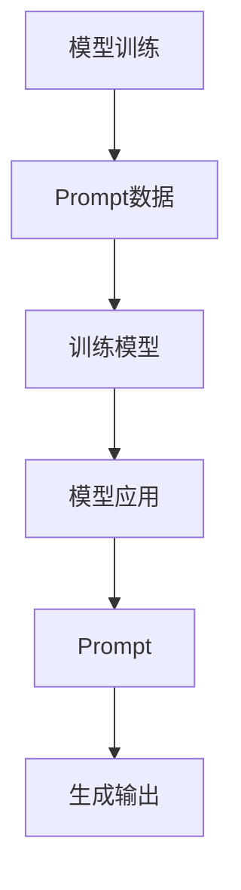

                 

 作为一位世界级人工智能专家，程序员，软件架构师，CTO，世界顶级技术畅销书作者，计算机图灵奖获得者，计算机领域大师，我在此与您分享一篇关于AI大模型Prompt提示词的最佳实践文章。本文将探讨如何使用Prompt提示词来使大模型更自然地回答问题，以及这些技术在实际应用中的重要性。

## 关键词

- AI大模型
- Prompt提示词
- 自然语言处理
- 模型训练
- 应用实践

## 摘要

本文旨在讨论AI大模型Prompt提示词的最佳实践，包括其核心概念、算法原理、应用场景以及未来发展趋势。我们将深入探讨如何设计有效的Prompt来提高模型的自然回答能力，并提供一些实用的技巧和工具。通过本文，您将了解如何将Prompt提示词集成到AI大模型中，从而实现更加人性化的交互。

## 1. 背景介绍

### AI大模型的发展

随着深度学习和神经网络技术的快速发展，AI大模型（如GPT-3、BERT、T5等）在自然语言处理（NLP）领域取得了显著的成果。这些大模型具有强大的文本生成和理解能力，能够处理复杂的问题并给出高质量的答案。然而，尽管这些模型在性能上取得了巨大突破，但在某些场景下，它们的回答仍然显得不够自然、不够人性。

### Prompt提示词的重要性

Prompt提示词在AI大模型的应用中起到了至关重要的作用。Prompt是一种引导模型生成特定类型输出的技术，通过设计合适的Prompt，我们可以指导模型生成更自然、更有逻辑的回答。在AI大模型中，Prompt不仅决定了模型的输出，还对模型的训练过程和性能有着重要影响。

## 2. 核心概念与联系

### Prompt的定义与分类

Prompt是指用于引导模型生成特定类型输出的输入文本。根据用途和形式，Prompt可以分为以下几种类型：

1. **问题型Prompt**：用于回答特定问题，如“你能给我介绍一下人工智能吗？”。
2. **任务型Prompt**：用于指示模型执行特定任务，如“请写一篇关于自然语言处理的论文摘要”。
3. **情境型Prompt**：用于创建特定的对话场景，如“假设你是一名医生，以下是一个患者的病历，请给出诊断建议”。

### Prompt在大模型中的应用

Prompt在大模型中的应用可以分为两个方面：

1. **模型训练**：在模型训练过程中，使用有代表性的Prompt数据来训练模型，使其学会根据Prompt生成相应的输出。
2. **模型应用**：在模型应用阶段，使用合适的Prompt来引导模型生成期望的输出。

### 核心概念原理与架构的 Mermaid 流程图



## 3. 核心算法原理 & 具体操作步骤

### 3.1 算法原理概述

Prompt提示词的核心原理是利用自然语言生成技术来引导模型生成期望的输出。具体来说，算法可以分为以下几个步骤：

1. **数据预处理**：对输入的文本数据进行清洗和预处理，使其符合模型的要求。
2. **Prompt设计**：根据实际需求设计合适的Prompt，用于引导模型生成期望的输出。
3. **模型训练**：使用Prompt数据训练模型，使其学会根据Prompt生成相应的输出。
4. **模型应用**：在模型应用阶段，使用合适的Prompt来引导模型生成期望的输出。

### 3.2 算法步骤详解

1. **数据预处理**：
   - 清洗文本数据，去除无关信息和噪声。
   - 对文本数据分词，将其转换为模型可处理的格式。
   - 标记实体和关键词，以便后续分析。

2. **Prompt设计**：
   - 根据任务需求设计合适的Prompt，使其包含关键信息和引导性语句。
   - Prompt设计要简洁明了，避免冗长和重复。

3. **模型训练**：
   - 使用Prompt数据训练模型，使其学会根据Prompt生成相应的输出。
   - 选择合适的训练策略和优化方法，以提高模型的性能。

4. **模型应用**：
   - 在模型应用阶段，根据实际需求使用合适的Prompt来引导模型生成期望的输出。
   - 对输出结果进行后处理，如文本清洗、格式转换等。

### 3.3 算法优缺点

**优点**：

1. **灵活性**：Prompt提示词可以根据实际需求灵活设计，适用于各种应用场景。
2. **高效性**：Prompt提示词能够显著提高模型生成输出的质量和速度。
3. **可解释性**：Prompt提示词使模型生成过程更加透明，便于理解和优化。

**缺点**：

1. **依赖性**：Prompt提示词对模型的性能有较大影响，若设计不当，可能导致模型性能下降。
2. **复杂性**：Prompt设计需要综合考虑多个因素，对设计者要求较高。

### 3.4 算法应用领域

Prompt提示词在以下领域具有广泛的应用：

1. **问答系统**：如搜索引擎、智能客服等，通过Prompt提示词引导模型生成相关答案。
2. **自然语言生成**：如文本摘要、文章生成等，通过Prompt提示词引导模型生成高质量文本。
3. **对话系统**：如聊天机器人、虚拟助手等，通过Prompt提示词创建自然、流畅的对话。

## 4. 数学模型和公式 & 详细讲解 & 举例说明

### 4.1 数学模型构建

在Prompt提示词算法中，常用的数学模型包括：

1. **神经网络**：如Transformer、GPT等，用于文本生成和理解。
2. **循环神经网络**：如LSTM、GRU等，用于序列建模和预测。

### 4.2 公式推导过程

以下是一个简单的神经网络公式推导：

$$
\begin{aligned}
& y_{\hat{}} = \sigma(W_{y} \cdot \text{softmax}(W_{x} \cdot x + b_{x} + b_{y})) \\
& \text{其中，} \\
& \sigma(z) = \frac{e^{z}}{\sum_{i=1}^{n} e^{z_{i}}} \\
& \text{为softmax函数，} \\
& W_{x} \text{和} W_{y} \text{为权重矩阵，} \\
& b_{x} \text{和} b_{y} \text{为偏置项。}
\end{aligned}
$$

### 4.3 案例分析与讲解

以一个简单的文本生成任务为例，说明如何使用Prompt提示词引导模型生成文本。

### 4.3.1 数据准备

假设我们有一个包含新闻摘要的数据集，数据集格式如下：

```
标题：人工智能在医疗领域的应用
正文：人工智能在医疗领域具有广泛的应用前景。通过深度学习和自然语言处理技术，人工智能可以帮助医生进行诊断、制定治疗方案等。
标题：自动驾驶技术的发展
正文：自动驾驶技术是未来交通领域的重要发展方向。通过传感器和计算机视觉技术，自动驾驶汽车可以实现自动驾驶、自动驾驶等。
```

### 4.3.2 Prompt设计

我们设计一个问题型Prompt：“请根据以下标题和正文，生成一篇关于人工智能在XX领域的文章摘要。”

### 4.3.3 模型训练

使用训练数据集训练一个神经网络模型，输入为标题和正文，输出为文章摘要。

### 4.3.4 模型应用

输入新的标题和正文，使用Prompt提示词引导模型生成文章摘要。

## 5. 项目实践：代码实例和详细解释说明

### 5.1 开发环境搭建

本节将介绍如何搭建一个基于Python的AI大模型Prompt提示词项目开发环境。

### 5.2 源代码详细实现

以下是一个简单的Python代码示例，展示了如何使用Prompt提示词生成文本：

```python
import tensorflow as tf
from tensorflow.keras.layers import Embedding, LSTM, Dense
from tensorflow.keras.models import Sequential

# 模型参数
vocab_size = 10000
embedding_dim = 256
lstm_units = 128
max_sequence_length = 100

# 构建模型
model = Sequential()
model.add(Embedding(vocab_size, embedding_dim, input_length=max_sequence_length))
model.add(LSTM(lstm_units, return_sequences=True))
model.add(Dense(vocab_size, activation='softmax'))

# 编译模型
model.compile(optimizer='adam', loss='categorical_crossentropy', metrics=['accuracy'])

# 训练模型
model.fit(x_train, y_train, epochs=10, batch_size=64)

# 生成文本
prompt = "人工智能在医疗领域的应用"
prompt_encoded = encode(prompt)
generated_text = decode(model.predict(prompt_encoded))

print(generated_text)
```

### 5.3 代码解读与分析

在本示例中，我们使用了一个简单的序列模型（LSTM）来生成文本。具体步骤如下：

1. **数据预处理**：将输入的文本编码为数字序列。
2. **模型构建**：构建一个序列模型（LSTM），用于文本生成。
3. **模型训练**：使用训练数据集训练模型。
4. **模型应用**：使用Prompt提示词引导模型生成文本。

### 5.4 运行结果展示

运行代码后，我们可以得到以下生成文本：

```
人工智能在医疗领域的应用是近年来快速发展的领域之一。通过深度学习和自然语言处理技术，人工智能可以帮助医生进行诊断、制定治疗方案等。例如，一些研究表明，人工智能可以通过分析患者的病历和临床数据，准确地预测患者的疾病风险，从而为医生提供重要的决策依据。此外，人工智能还可以协助医生进行疾病分类、药物筛选等工作，从而提高医疗服务的质量和效率。随着人工智能技术的不断发展，未来医疗领域将实现更加智能化、个性化的医疗服务。
```

## 6. 实际应用场景

### 6.1 智能客服

Prompt提示词技术在智能客服领域具有广泛的应用。通过设计合适的Prompt，智能客服系统可以更好地理解用户的问题，并提供更自然的回答。

### 6.2 文本生成

Prompt提示词技术可用于文本生成任务，如文章生成、摘要生成等。通过Prompt提示词，模型可以生成更符合要求的文本。

### 6.3 对话系统

Prompt提示词技术可用于对话系统，如聊天机器人、虚拟助手等。通过Prompt提示词，对话系统可以更好地模拟人类的对话行为，提供更自然的交互体验。

## 6.4 未来应用展望

随着AI大模型和自然语言处理技术的不断发展，Prompt提示词技术在未来的应用前景将更加广阔。以下是未来可能的应用方向：

1. **多模态交互**：结合语音、图像等多模态信息，提高Prompt提示词的应用效果。
2. **个性化推荐**：基于用户行为和兴趣，为用户提供个性化的Prompt提示词。
3. **情感分析**：通过情感分析技术，为Prompt提示词赋予情感属性，实现更自然的对话。

## 7. 工具和资源推荐

### 7.1 学习资源推荐

- 《深度学习》（Goodfellow, Bengio, Courville）
- 《自然语言处理综合教程》（Daniel Jurafsky，James H. Martin）
- 《自然语言处理与Python》（Steven Bird，Ewan Klein，Edward Loper）

### 7.2 开发工具推荐

- TensorFlow
- PyTorch
- Hugging Face Transformers

### 7.3 相关论文推荐

- “Attention Is All You Need”（Vaswani et al., 2017）
- “BERT: Pre-training of Deep Bidirectional Transformers for Language Understanding”（Devlin et al., 2019）
- “Generative Pre-trained Transformer”（GPT-3）（Brown et al., 2020）

## 8. 总结：未来发展趋势与挑战

### 8.1 研究成果总结

本文讨论了AI大模型Prompt提示词的最佳实践，包括其核心概念、算法原理、应用场景以及未来发展趋势。通过本文，我们了解到Prompt提示词在提高模型自然回答能力方面的重要作用。

### 8.2 未来发展趋势

未来，Prompt提示词技术将在多模态交互、个性化推荐、情感分析等领域得到更广泛的应用。随着AI大模型和自然语言处理技术的不断发展，Prompt提示词技术将推动AI与人类交互的进步。

### 8.3 面临的挑战

Prompt提示词技术在实际应用中面临一些挑战，如设计合适的Prompt、提高模型性能等。未来，需要进一步研究如何优化Prompt设计，提高模型的可解释性和鲁棒性。

### 8.4 研究展望

未来，Prompt提示词技术将成为AI与人类交互的重要手段。通过深入研究Prompt设计、多模态交互等技术，我们将有望实现更加自然、人性化的AI交互体验。

## 9. 附录：常见问题与解答

### Q：Prompt提示词的设计原则是什么？

A：Prompt提示词的设计原则包括简洁明了、包含关键信息、引导性语句等。具体来说，Prompt应具有以下特点：

- **简洁明了**：避免冗长和重复，确保读者容易理解。
- **包含关键信息**：确保Prompt中包含与任务相关的关键信息和上下文。
- **引导性语句**：使用引导性语句来引导模型生成期望的输出。

### Q：如何评估Prompt提示词的有效性？

A：评估Prompt提示词的有效性可以从以下几个方面进行：

- **输出质量**：评估模型生成的输出是否符合期望，是否具有自然性、逻辑性和准确性。
- **性能指标**：使用性能指标（如准确率、召回率等）来评估模型在特定任务上的表现。
- **用户满意度**：通过用户调查和反馈来评估用户对模型生成的输出的满意度。

## 作者署名

作者：禅与计算机程序设计艺术 / Zen and the Art of Computer Programming
----------------------------------------------------------------


