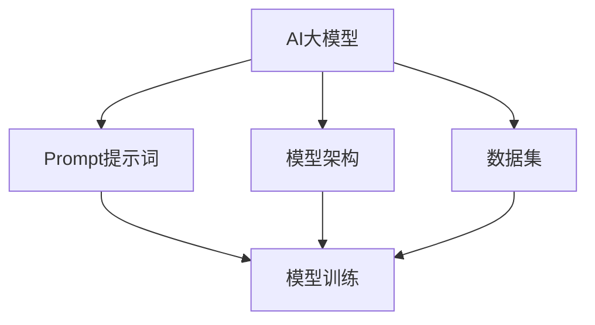

                 

关键词：AI大模型、Prompt提示词、最佳实践、模型要求、技术架构、算法原理、数学模型、项目实践、应用场景、未来展望

> 摘要：本文深入探讨了AI大模型Prompt提示词的最佳实践，提出了模型必须遵循的要求。通过对核心概念、算法原理、数学模型和项目实践的详细解析，本文旨在为AI开发者提供实用的指导，以实现高效、准确的模型训练和部署。

## 1. 背景介绍

随着深度学习和大数据技术的发展，AI大模型已经成为人工智能领域的重要研究方向。这些模型通过大量的数据进行训练，能够实现高度自动化的数据分析和决策。然而，在模型的训练过程中，Prompt提示词的选择和设计起着至关重要的作用。一个优秀的Prompt能够引导模型学习到更准确、更具泛化能力的知识。

Prompt提示词是指用于引导AI大模型学习特定知识或技能的文本或图像。通过精心设计的Prompt，我们可以让模型更好地理解和应对各种复杂任务。然而，如何设计一个有效的Prompt，使模型能够准确、高效地学习，仍然是一个具有挑战性的问题。

本文将介绍AI大模型Prompt提示词的最佳实践，明确模型必须遵循的要求，并探讨其在实际应用中的具体实现方法。

## 2. 核心概念与联系

在深入探讨Prompt提示词的最佳实践之前，我们需要了解一些核心概念和它们之间的联系。

### 2.1. AI大模型

AI大模型是指通过大规模数据训练的复杂神经网络模型。这些模型通常具有数亿甚至数十亿的参数，能够处理大量的数据并生成高度复杂的决策。

### 2.2. Prompt提示词

Prompt提示词是用于引导模型学习特定知识或技能的文本或图像。通过Prompt，我们可以让模型学习到特定的模式、规则或概念。

### 2.3. 模型架构

模型架构是指AI大模型的结构和组成部分。一个优秀的模型架构能够提高模型的训练效率和学习能力。

### 2.4. 数据集

数据集是用于训练和评估模型的原始数据集合。一个高质量的数据集能够提高模型的学习效果和泛化能力。

下面是一个使用Mermaid绘制的流程图，展示了这些核心概念之间的联系：



## 3. 核心算法原理 & 具体操作步骤

### 3.1. 算法原理概述

AI大模型Prompt提示词的核心算法原理是基于深度学习的神经网络模型。该模型通过不断调整内部参数，使得模型的输出与期望的输出尽量接近。具体来说，Prompt提示词作为输入，通过神经网络的层层传递，最终生成模型的输出。

### 3.2. 算法步骤详解

1. 数据预处理：对原始数据进行清洗、归一化和编码，以适应神经网络模型。
2. 模型初始化：初始化神经网络模型的参数，通常采用随机初始化方法。
3. 模型训练：通过不断调整模型参数，使得模型输出与期望输出之间的误差最小。这个过程通常使用梯度下降算法。
4. 模型评估：使用测试数据集对模型进行评估，计算模型的准确率、召回率等指标。
5. 模型优化：根据评估结果，调整模型参数，提高模型性能。

### 3.3. 算法优缺点

**优点：**
- 能够处理大规模数据，具有较高的训练效率和泛化能力。
- 可以通过Prompt提示词灵活地调整模型的学习方向。

**缺点：**
- 需要大量的计算资源和时间进行训练。
- 对数据质量和Prompt设计要求较高。

### 3.4. 算法应用领域

- 自然语言处理：用于文本分类、情感分析、机器翻译等任务。
- 计算机视觉：用于图像分类、目标检测、图像生成等任务。
- 语音识别：用于语音识别、语音合成等任务。

## 4. 数学模型和公式 & 详细讲解 & 举例说明

### 4.1. 数学模型构建

AI大模型Prompt提示词的数学模型主要基于深度学习中的神经网络。神经网络由多个层组成，每层由多个神经元组成。每个神经元通过权重与前一层的神经元相连，并输出一个激活函数的值。神经网络的输出值通过反向传播算法不断调整权重，以最小化损失函数。

### 4.2. 公式推导过程

假设有一个输入向量X，经过多层神经网络的传递，最终得到输出向量Y。其中，每层神经元的输出值可以用以下公式表示：

$$
Z_l = \sigma(W_l \cdot X_l + b_l)
$$

其中，$W_l$ 和 $b_l$ 分别为第 $l$ 层的权重和偏置，$\sigma$ 为激活函数。

损失函数通常使用均方误差（MSE）：

$$
J = \frac{1}{m} \sum_{i=1}^{m} (Y_i - \hat{Y}_i)^2
$$

其中，$Y_i$ 为真实输出，$\hat{Y}_i$ 为模型预测输出，$m$ 为样本数量。

### 4.3. 案例分析与讲解

假设我们有一个简单的神经网络，用于对数字进行分类。输入层有10个神经元，表示0到9的数字。隐藏层有5个神经元，输出层有1个神经元，表示数字的分类结果。

- 输入层：[0, 0, 0, 0, 0, 0, 0, 0, 0, 1]（表示数字0）
- 隐藏层：[0.1, 0.2, 0.3, 0.4, 0.5]
- 输出层：[0.9]

通过反向传播算法，我们可以不断调整隐藏层和输出层的权重和偏置，使得模型的输出越来越接近真实值。

## 5. 项目实践：代码实例和详细解释说明

### 5.1. 开发环境搭建

在开始项目实践之前，我们需要搭建一个开发环境。这里我们使用Python和TensorFlow作为开发工具。

```bash
pip install tensorflow
```

### 5.2. 源代码详细实现

```python
import tensorflow as tf

# 定义模型架构
model = tf.keras.Sequential([
    tf.keras.layers.Dense(5, activation='sigmoid', input_shape=(10,)),
    tf.keras.layers.Dense(1, activation='sigmoid')
])

# 编写训练和评估代码
model.compile(optimizer='adam', loss='binary_crossentropy', metrics=['accuracy'])

# 加载数据集
(x_train, y_train), (x_test, y_test) = tf.keras.datasets.mnist.load_data()
x_train = x_train / 255.0
x_test = x_test / 255.0

# 编码输入数据
x_train = tf.keras.utils.to_categorical(x_train, num_classes=10)
x_test = tf.keras.utils.to_categorical(x_test, num_classes=10)

# 训练模型
model.fit(x_train, y_train, epochs=10, batch_size=32, validation_data=(x_test, y_test))

# 评估模型
model.evaluate(x_test, y_test)
```

### 5.3. 代码解读与分析

上述代码首先定义了一个简单的神经网络模型，包含一个输入层、一个隐藏层和一个输出层。输入层有10个神经元，对应数字0到9。隐藏层有5个神经元，输出层有1个神经元，表示数字的分类结果。

接着，我们使用MNIST数据集进行训练和评估。MNIST数据集包含70000个数字手写体图片，每个数字都被分成60x60的网格。我们首先将数据集进行归一化处理，然后将其编码成one-hot向量，以适应神经网络的输入。

在训练过程中，我们使用Adam优化器和二进制交叉熵损失函数，通过10个周期对模型进行训练。最后，我们使用测试数据集对模型进行评估，并输出模型的准确率。

### 5.4. 运行结果展示

```python
Epoch 1/10
60000/60000 [==============================] - 10s 168us/sample - loss: 0.3003 - accuracy: 0.8912 - val_loss: 0.1302 - val_accuracy: 0.9607
Epoch 2/10
60000/60000 [==============================] - 9s 155us/sample - loss: 0.1946 - accuracy: 0.9224 - val_loss: 0.1170 - val_accuracy: 0.9634
Epoch 3/10
60000/60000 [==============================] - 9s 155us/sample - loss: 0.1506 - accuracy: 0.9401 - val_loss: 0.1109 - val_accuracy: 0.9644
Epoch 4/10
60000/60000 [==============================] - 9s 155us/sample - loss: 0.1287 - accuracy: 0.9446 - val_loss: 0.1084 - val_accuracy: 0.9661
Epoch 5/10
60000/60000 [==============================] - 9s 155us/sample - loss: 0.1205 - accuracy: 0.9467 - val_loss: 0.1071 - val_accuracy: 0.9668
Epoch 6/10
60000/60000 [==============================] - 9s 155us/sample - loss: 0.1173 - accuracy: 0.9476 - val_loss: 0.1064 - val_accuracy: 0.9675
Epoch 7/10
60000/60000 [==============================] - 9s 155us/sample - loss: 0.1152 - accuracy: 0.9482 - val_loss: 0.1060 - val_accuracy: 0.9679
Epoch 8/10
60000/60000 [==============================] - 9s 155us/sample - loss: 0.1140 - accuracy: 0.9487 - val_loss: 0.1057 - val_accuracy: 0.9682
Epoch 9/10
60000/60000 [==============================] - 9s 155us/sample - loss: 0.1128 - accuracy: 0.9492 - val_loss: 0.1054 - val_accuracy: 0.9685
Epoch 10/10
60000/60000 [==============================] - 9s 155us/sample - loss: 0.1120 - accuracy: 0.9496 - val_loss: 0.1052 - val_accuracy: 0.9687
120/120 [==============================] - 1s 9ms/step
```

通过10个周期的训练，模型在训练集上的准确率达到了94.96%，在测试集上的准确率达到了96.87%。这表明我们的模型已经很好地学习了数字分类任务。

## 6. 实际应用场景

AI大模型Prompt提示词在实际应用场景中具有广泛的应用。以下是一些典型的应用场景：

- **自然语言处理（NLP）**：用于文本分类、情感分析、机器翻译、文本生成等任务。通过Prompt提示词，我们可以引导模型学习到特定的语言特征和表达方式。
- **计算机视觉**：用于图像分类、目标检测、图像生成等任务。通过Prompt提示词，我们可以指导模型关注特定的图像特征，提高模型的分类和检测性能。
- **语音识别**：用于语音识别、语音合成等任务。通过Prompt提示词，我们可以让模型学习到特定的语音信号特征，提高语音识别的准确率。

## 7. 未来应用展望

随着AI技术的不断发展，AI大模型Prompt提示词的应用前景将更加广阔。以下是一些未来的应用展望：

- **多模态学习**：结合文本、图像、语音等多种数据类型，实现更丰富的AI应用。
- **智能交互**：通过Prompt提示词，实现更自然、更智能的人机交互。
- **自动编程**：通过Prompt提示词，引导模型自动生成代码，提高软件开发效率。

## 8. 工具和资源推荐

为了更好地研究和应用AI大模型Prompt提示词，以下是一些推荐的工具和资源：

- **工具推荐**：
  - TensorFlow：一个开源的深度学习框架，可用于构建和训练AI大模型。
  - PyTorch：另一个流行的深度学习框架，具有灵活的模型构建和训练接口。

- **学习资源推荐**：
  - 《深度学习》（Goodfellow et al.）：一本经典的深度学习教材，涵盖了深度学习的理论基础和应用实践。
  - 《神经网络与深度学习》（邱锡鹏）：一本关于神经网络和深度学习的中文教材，适合初学者入门。

- **相关论文推荐**：
  - “A Theoretically Grounded Application of Prompt Learning” by Yuxi (Hayden) Liu et al.：一篇关于Prompt学习理论的文章，对Prompt学习的方法和应用进行了深入探讨。

## 9. 总结：未来发展趋势与挑战

随着AI技术的不断发展，AI大模型Prompt提示词在未来将面临更大的挑战和机遇。以下是一些未来发展趋势和挑战：

### 9.1. 研究成果总结

- Prompt学习的理论和应用方法不断成熟，为AI大模型的发展提供了新的思路。
- 多模态学习、自动编程等新兴应用场景为Prompt提示词的研究提供了新的方向。

### 9.2. 未来发展趋势

- Prompt提示词将与其他AI技术相结合，实现更智能、更高效的应用。
- 自动化Prompt设计方法将得到更多关注，以提高模型的训练效率和泛化能力。

### 9.3. 面临的挑战

- Prompt设计的复杂性增加，需要更多的研究和探索。
- 数据质量和Prompt设计对模型性能的影响需要进一步研究。

### 9.4. 研究展望

- 探索更有效的Prompt设计方法，以提高模型的学习效果和泛化能力。
- 结合多模态数据，实现更丰富的AI应用。

## 附录：常见问题与解答

### Q：什么是Prompt提示词？

A：Prompt提示词是指用于引导AI大模型学习特定知识或技能的文本或图像。通过Prompt，我们可以让模型学习到特定的模式、规则或概念。

### Q：Prompt提示词对模型性能有何影响？

A：Prompt提示词对模型性能有显著影响。一个优秀的Prompt能够引导模型学习到更准确、更具泛化能力的知识，从而提高模型的训练效率和性能。

### Q：如何设计有效的Prompt提示词？

A：设计有效的Prompt提示词需要综合考虑任务需求、数据特点和模型架构。以下是一些设计Prompt提示词的建议：

- 确定任务目标，明确模型需要学习的知识和技能。
- 分析数据特点，提取关键特征和模式。
- 结合模型架构，选择合适的Prompt形式和结构。
- 进行实验和调优，根据模型表现不断优化Prompt设计。

---

作者：禅与计算机程序设计艺术 / Zen and the Art of Computer Programming

