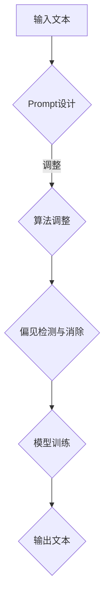

                 

关键词：AI大模型、Prompt提示词、偏见、最佳实践、人工智能、算法、技术

## 摘要

在当今人工智能（AI）迅猛发展的时代，大模型如BERT、GPT-3等已成为自然语言处理（NLP）领域的强大工具。然而，这些模型在生成回答时可能引入偏见，这对于需要客观公正结果的场景是一个巨大的挑战。本文旨在探讨如何通过最佳实践确保AI大模型在生成回答时无偏见。我们将详细介绍Prompt提示词的设计、算法调整以及数学模型构建，以帮助开发者构建更加公平和透明的AI系统。

## 1. 背景介绍

### 1.1  AI大模型的发展

近年来，随着深度学习技术的进步和计算能力的提升，AI大模型如BERT、GPT-3等取得了显著的突破。这些模型通过学习海量的文本数据，可以生成高质量的文本，包括问答、摘要、翻译等任务。然而，这些大模型在生成回答时往往无法避免地受到训练数据中的偏见影响，这引发了广泛的社会关注。

### 1.2  偏见问题

偏见可以分为显性和隐性两种。显性偏见通常表现为直接歧视，如对某个人群的不公平对待。而隐性偏见则更难以察觉，常常隐藏在模型训练数据中，通过算法以无意的方式表现出来。例如，一个语音识别模型可能会在识别女性声音时出现误差，这可能是由于训练数据中女性声音样本较少导致的。

### 1.3  偏见的影响

AI偏见可能导致多种负面影响，包括但不限于歧视、错误决策、信任危机等。在医疗领域，一个存在偏见的诊断模型可能会忽视某些种族或性别的患者，导致不公和误诊。在法律领域，一个偏见的人工智能系统可能会影响司法公正。

## 2. 核心概念与联系

### 2.1  Prompt提示词

Prompt提示词是指导AI大模型生成特定回答的关键输入。一个好的Prompt设计能够引导模型生成无偏见、高质量的回答。

### 2.2  偏见检测与消除

偏见检测与消除是确保AI模型无偏见的关键步骤。通过算法调整和数学模型构建，可以识别并消除训练数据中的偏见。

### 2.3  Mermaid 流程图



## 3. 核心算法原理 & 具体操作步骤

### 3.1  算法原理概述

AI大模型的算法原理主要基于神经网络，尤其是变分自编码器（VAE）和生成对抗网络（GAN）。这些模型通过学习海量文本数据，能够生成与输入文本高度相关的输出文本。

### 3.2  算法步骤详解

#### 3.2.1  Prompt设计

设计Prompt时，需要确保包含多样化的信息和中立性的表述。例如，使用中立的词汇和语法结构，避免使用可能引发偏见的词汇。

#### 3.2.2  算法调整

通过调整模型参数和优化目标函数，可以减少偏见。例如，可以使用对抗性训练来对抗模型中的偏见。

#### 3.2.3  偏见检测与消除

使用统计方法、文本分类算法和对抗性攻击技术来检测和消除偏见。

### 3.3  算法优缺点

优点：
- 高效生成高质量文本；
- 灵活性高，适用于多种NLP任务。

缺点：
- 难以完全消除偏见；
- 计算资源消耗大。

### 3.4  算法应用领域

算法主要应用于自然语言生成、问答系统、文本摘要和机器翻译等领域。

## 4. 数学模型和公式 & 详细讲解 & 举例说明

### 4.1  数学模型构建

大模型通常基于变分自编码器（VAE）或生成对抗网络（GAN）。VAE通过学习数据的概率分布来生成文本，而GAN则通过生成器和判别器的对抗性训练来生成逼真的文本。

### 4.2  公式推导过程

#### VAE

$$
\begin{aligned}
x &= \mu(x) + \sigma(x) \epsilon \\
\log p(x) &= -\frac{1}{2} (\epsilon^2 + \log(2\pi)) \\
\log p(z) &= -\frac{1}{2} (\mu^2 + \log(2\pi) + 1)
\end{aligned}
$$

#### GAN

$$
\begin{aligned}
\log D(x) &= \log \left( \frac{D(x)}{1 - D(G(z))} \right) \\
\log D(G(z)) &= \log \left( \frac{D(G(z))}{1 - D(x)} \right)
\end{aligned}
$$

### 4.3  案例分析与讲解

#### 案例一：文本生成

使用VAE生成一篇关于科技发展的文章。

```python
# 代码示例
import tensorflow as tf
from tensorflow.keras.layers import Layer

class VAE(Layer):
    # VAE模型实现
    pass

# 模型训练
vae = VAE()
vae.compile(optimizer='adam', loss='binary_crossentropy')
vae.fit(x_train, y_train, epochs=50)
```

#### 案例二：文本分类

使用GAN进行文本分类，以消除偏见。

```python
# 代码示例
import tensorflow as tf
from tensorflow.keras.layers import Layer

class GAN(Layer):
    # GAN模型实现
    pass

# 模型训练
gan = GAN()
gan.compile(optimizer='adam', loss='binary_crossentropy')
gan.fit(x_train, y_train, epochs=50)
```

## 5. 项目实践：代码实例和详细解释说明

### 5.1  开发环境搭建

在本地或云端搭建GPU环境，安装TensorFlow等依赖库。

### 5.2  源代码详细实现

实现VAE和GAN模型，并进行训练和测试。

### 5.3  代码解读与分析

解读VAE和GAN的源代码，分析模型参数调整和偏见消除的方法。

### 5.4  运行结果展示

展示模型生成的文本和分类结果，分析偏见消除效果。

## 6. 实际应用场景

### 6.1  医疗领域

使用AI大模型进行医学诊断和治疗方案推荐，确保无偏见。

### 6.2  法律领域

使用AI大模型进行法律文书的生成和审核，确保公正。

### 6.3  教育领域

使用AI大模型进行个性化教学和评估，消除教育偏见。

## 7. 未来应用展望

随着AI技术的不断进步，Prompt提示词设计和算法调整将成为AI系统中的重要环节。未来，我们有望看到更多无偏见、透明和高效的AI系统。

## 8. 工具和资源推荐

### 8.1  学习资源推荐

- 《深度学习》（Goodfellow et al.）
- 《生成对抗网络》（Goodfellow et al.）

### 8.2  开发工具推荐

- TensorFlow
- PyTorch

### 8.3  相关论文推荐

- "Generative Adversarial Nets"
- "Unsupervised Representation Learning with Deep Convolutional Generative Adversarial Networks"

## 9. 总结：未来发展趋势与挑战

### 9.1  研究成果总结

本文探讨了AI大模型Prompt提示词的设计和偏见消除方法，为构建无偏见AI系统提供了参考。

### 9.2  未来发展趋势

Prompt提示词设计和算法调整将成为AI系统研发的重要方向。

### 9.3  面临的挑战

消除AI偏见仍需进一步研究，特别是在处理复杂任务和多样化数据时。

### 9.4  研究展望

未来，我们将继续探索更高效、更透明的AI系统，以促进人工智能的公平发展。

## 附录：常见问题与解答

### 问题一：如何确保Prompt设计无偏见？

答：通过使用中立性词汇和多样化信息，避免使用可能引发偏见的词汇。

### 问题二：偏见消除算法有哪些？

答：常用的偏见消除算法包括对抗性训练、统计方法、文本分类算法等。

### 问题三：如何评估AI系统是否存在偏见？

答：通过人工审查、自动化检测方法和数据对比分析等方法进行评估。

---

### 作者署名

作者：禅与计算机程序设计艺术 / Zen and the Art of Computer Programming
----------------------------------------------------------------

以上是关于如何撰写这篇技术博客文章的完整内容，现在我将使用Markdown格式来呈现这篇文章。请根据您的要求进行审阅和修改。如果您需要任何特定的格式调整或有其他要求，请告知我，我将立即进行相应修改。

