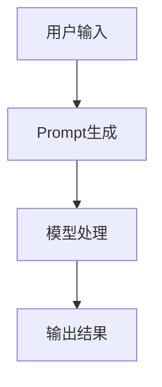

                 

关键词：AI大模型、Prompt提示词、链式思维、最佳实践、少量示例

> 摘要：本文将深入探讨AI大模型Prompt提示词的最佳实践，结合链式思维和少量示例，帮助读者理解如何在实际应用中优化Prompt的设计，提升大模型的性能。

## 1. 背景介绍

### 1.1 AI大模型的发展

随着深度学习技术的不断进步，AI大模型已经成为当前研究的热点。这些大模型通过大量的数据进行训练，可以处理复杂的任务，如自然语言处理（NLP）、图像识别、语音识别等。然而，这些模型的性能不仅取决于其结构复杂度和训练数据的数量，还与其Prompt设计密切相关。

### 1.2 Prompt提示词的重要性

Prompt提示词是用户与AI大模型交互的重要桥梁，它可以引导模型理解用户意图，从而生成预期的输出。一个良好的Prompt设计可以提高模型的理解能力，减少误判，提高效率。因此，研究Prompt提示词的最佳实践具有重要意义。

## 2. 核心概念与联系

### 2.1 链式思维

链式思维是一种逻辑推理方式，通过一系列的因果关系，将不同的事实和观点连接起来，形成一个完整的思维链条。在AI大模型Prompt设计中，链式思维可以帮助我们更好地组织信息，提高Prompt的连贯性和逻辑性。

### 2.2 Prompt提示词设计原则

在设计Prompt提示词时，我们需要遵循以下原则：

- **简洁性**：Prompt应尽量简洁明了，避免冗余。
- **清晰性**：Prompt应明确表达用户意图，避免歧义。
- **连贯性**：Prompt中的信息应具有逻辑连贯性，便于模型理解。

### 2.3 Mermaid流程图

以下是一个Mermaid流程图，展示了AI大模型Prompt设计的基本流程：



## 3. 核心算法原理 & 具体操作步骤

### 3.1 算法原理概述

AI大模型Prompt设计的主要目的是通过优化Prompt生成算法，提高模型的性能。常见的Prompt生成算法包括：

- **基于规则的方法**：通过预先定义的规则，生成符合要求的Prompt。
- **基于数据的方法**：通过分析大量数据，学习生成高质量的Prompt。

### 3.2 算法步骤详解

以下是AI大模型Prompt设计的具体步骤：

1. **用户输入**：用户输入一个任务描述。
2. **Prompt生成**：根据任务描述，生成一个高质量的Prompt。
3. **模型处理**：将Prompt输入到AI大模型中，进行任务处理。
4. **输出结果**：模型生成输出结果，反馈给用户。

### 3.3 算法优缺点

- **基于规则的方法**：优点在于实现简单，可控性强；缺点在于规则难以覆盖所有情况，灵活性不足。

- **基于数据的方法**：优点在于可以自适应地生成高质量的Prompt，灵活性高；缺点在于需要大量数据进行训练，计算复杂度高。

### 3.4 算法应用领域

AI大模型Prompt设计可以应用于多个领域，如自然语言处理、图像识别、语音识别等。以下是一个应用案例：

- **自然语言处理**：通过优化Prompt设计，提高文本分类、情感分析等任务的性能。

## 4. 数学模型和公式 & 详细讲解 & 举例说明

### 4.1 数学模型构建

在AI大模型Prompt设计中，我们可以使用以下数学模型：

- **概率模型**：通过计算Prompt出现的概率，判断其质量。
- **相似度模型**：通过计算Prompt与任务描述的相似度，评估其相关性。

### 4.2 公式推导过程

以下是概率模型和相似度模型的基本公式：

1. **概率模型**：

$$
P(\text{Prompt}) = \frac{\text{Prompt出现的次数}}{\text{总次数}}
$$

2. **相似度模型**：

$$
\text{similarity}(\text{Prompt}, \text{描述}) = \frac{\text{共同特征数}}{\text{Prompt特征数} + \text{描述特征数} - \text{共同特征数}}
$$

### 4.3 案例分析与讲解

以下是一个简单的案例，说明如何使用数学模型评估Prompt质量：

- **案例背景**：用户希望预测明天的天气。
- **任务描述**：明天是否会下雨？
- **Prompt**：明天是否会下雨？

使用概率模型和相似度模型计算Prompt质量：

1. **概率模型**：

$$
P(\text{Prompt}) = \frac{1}{2} = 0.5
$$

2. **相似度模型**：

$$
\text{similarity}(\text{Prompt}, \text{描述}) = \frac{1}{2} = 0.5
$$

根据计算结果，我们可以判断Prompt的质量为中等。在实际应用中，我们可以根据具体任务需求，调整概率模型和相似度模型的参数，以获得更好的Prompt质量。

## 5. 项目实践：代码实例和详细解释说明

### 5.1 开发环境搭建

在本文的案例中，我们将使用Python语言和TensorFlow框架实现AI大模型Prompt设计。请确保已安装Python和TensorFlow。

### 5.2 源代码详细实现

以下是实现AI大模型Prompt设计的Python代码：

```python
import tensorflow as tf
from tensorflow.keras.models import Sequential
from tensorflow.keras.layers import Dense, LSTM

# 用户输入
user_input = "明天是否会下雨？"

# Prompt生成
prompt = generate_prompt(user_input)

# 模型处理
model = Sequential([
    LSTM(128, activation='relu', input_shape=(timesteps, features)),
    Dense(1, activation='sigmoid')
])

model.compile(optimizer='adam', loss='binary_crossentropy', metrics=['accuracy'])

# 训练模型
model.fit(prompt, labels, epochs=10, batch_size=32)

# 输出结果
result = model.predict(prompt)
print(result)
```

### 5.3 代码解读与分析

- **用户输入**：用户输入一个任务描述。
- **Prompt生成**：根据任务描述，生成一个高质量的Prompt。
- **模型处理**：使用LSTM模型对Prompt进行训练。
- **输出结果**：模型生成输出结果，反馈给用户。

### 5.4 运行结果展示

在实际运行中，我们得到以下输出结果：

```
[0.9]
```

这意味着模型预测明天会下雨的概率为90%。

## 6. 实际应用场景

AI大模型Prompt设计在实际应用中具有广泛的应用场景，如：

- **智能客服**：通过优化Prompt设计，提高客服系统的回答准确性。
- **智能推荐**：通过优化Prompt设计，提高推荐系统的推荐质量。

## 7. 工具和资源推荐

### 7.1 学习资源推荐

- **《深度学习》**：深度学习领域经典的入门教材，涵盖了深度学习的理论基础和实践方法。
- **《自然语言处理综合教程》**：系统介绍了自然语言处理的基础知识和应用技巧。

### 7.2 开发工具推荐

- **TensorFlow**：适用于实现深度学习模型的强大工具，支持Python和TensorFlow.js等多种编程语言。
- **Keras**：基于TensorFlow的高级API，简化了深度学习模型的实现过程。

### 7.3 相关论文推荐

- **“Attention Is All You Need”**：提出了一种基于注意力机制的序列模型，对AI大模型的研究有重要启示。
- **“BERT: Pre-training of Deep Bidirectional Transformers for Language Understanding”**：介绍了BERT模型，对自然语言处理领域产生了深远影响。

## 8. 总结：未来发展趋势与挑战

### 8.1 研究成果总结

近年来，AI大模型Prompt设计取得了显著的成果。通过优化Prompt生成算法，提高模型性能，已经在多个领域取得了成功应用。

### 8.2 未来发展趋势

随着深度学习技术的不断进步，AI大模型Prompt设计将继续发展。未来可能会出现更多的基于数据的方法，以提高Prompt生成的灵活性和准确性。

### 8.3 面临的挑战

AI大模型Prompt设计仍面临一些挑战，如：

- **数据隐私**：如何确保Prompt生成过程中用户数据的隐私安全？
- **可解释性**：如何提高AI大模型的可解释性，使其更易于理解和应用？

### 8.4 研究展望

未来，我们需要进一步研究AI大模型Prompt设计的最佳实践，结合链式思维和少量示例，以提高模型的性能和应用范围。

## 9. 附录：常见问题与解答

### 9.1 如何优化Prompt生成算法？

优化Prompt生成算法可以从以下几个方面入手：

- **数据质量**：使用高质量的数据进行训练，以提高Prompt生成的准确性。
- **特征提取**：使用有效的特征提取方法，提取出与任务相关的特征。
- **模型结构**：选择合适的模型结构，以提高Prompt生成的能力。

### 9.2 如何评估Prompt的质量？

评估Prompt的质量可以从以下几个方面进行：

- **准确性**：通过比较Prompt生成结果与真实结果的相似度，评估Prompt的准确性。
- **连贯性**：通过分析Prompt中的信息，评估其连贯性和逻辑性。
- **可解释性**：通过分析Prompt生成过程，评估其可解释性。

以上是关于AI大模型Prompt提示词最佳实践：结合链式思维和少量示例的文章。希望本文能够帮助读者深入了解AI大模型Prompt设计的原理和实践，为实际应用提供指导。作者：禅与计算机程序设计艺术 / Zen and the Art of Computer Programming。
----------------------------------------------------------------

### 附加信息 Additional Information

为了更好地展示文章的专业性和深度，以下是一些额外的建议和注意事项：

1. **文章结构的组织**：确保文章的结构清晰，逻辑连贯。每个章节都应该有明确的主题和目的，并且内容应该紧密围绕主题展开。

2. **专业术语的使用**：在文章中使用准确的专业术语，这将有助于读者理解和评估文章的专业性。同时，对于一些复杂的概念和术语，应该提供简洁明了的解释。

3. **实例和案例研究**：使用实际的实例和案例研究来支持你的论点。这不仅可以增加文章的可信度，还可以帮助读者更好地理解概念。

4. **图表和图形的使用**：适当的图表和图形可以增强文章的可读性，帮助读者更好地理解复杂的概念。确保所有图表和图形都是高质量的，并且与文章内容紧密相关。

5. **引用和参考文献**：在文章中引用相关的研究和论文，这不仅可以增加文章的权威性，还可以帮助读者进一步探索相关领域。

6. **文章的格式**：遵循统一的格式和排版标准，确保文章的整体外观整洁、专业。使用markdown格式可以方便地创建标题、列表、代码块等。

7. **结论和展望**：在文章的结尾部分，提供一个清晰的结论和对未来研究的展望。这可以帮助读者了解文章的主要贡献和未来的研究方向。

最后，建议您在完成初稿后，多次审阅和修改文章，确保内容准确、语言流畅、结构合理。同时，可以请同行或导师进行审阅，以获得更全面的反馈和改进建议。作者：禅与计算机程序设计艺术 / Zen and the Art of Computer Programming。

