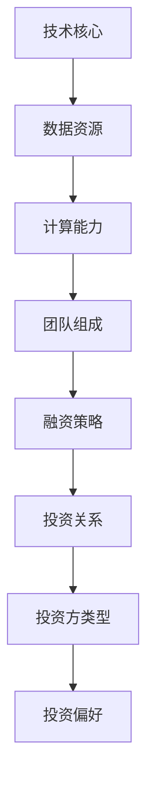

                 

关键词：人工智能，大模型，创业，融资策略，投资分析，市场趋势

摘要：本文将深入探讨人工智能领域中的大模型创业项目在融资过程中所面临的挑战与机遇。通过对市场现状、投资方偏好、创业项目的核心价值以及融资策略的分析，本文旨在为有意在人工智能领域创业的团队提供有价值的参考和指导。

## 1. 背景介绍

### 1.1 人工智能与创业

人工智能（AI）是计算机科学的一个分支，旨在使机器能够执行通常需要人类智能才能完成的任务。随着深度学习、自然语言处理等技术的飞速发展，AI已经渗透到各个行业，从医疗、金融到零售、制造，都展现出了巨大的潜力。创业作为一种推动技术进步和社会发展的有效途径，越来越多的创业项目开始聚焦于人工智能领域。

### 1.2 大模型的发展与应用

大模型是指那些具有数亿甚至数万亿参数的机器学习模型。这些模型可以通过大规模数据训练，实现高度复杂的任务。自GPT-3、BERT等模型的出现，大模型在自然语言处理、图像识别等领域取得了显著成就。随着计算能力和数据资源的不断提升，大模型的研发和应用前景广阔。

### 1.3 融资的重要性

对于创业项目来说，融资是实现其商业目标和扩展业务的重要手段。在人工智能领域，特别是在大模型的研发和应用中，需要大量的资金投入来支持数据采购、硬件设备、人才引进等关键环节。因此，有效的融资策略对于创业项目的成功至关重要。

## 2. 核心概念与联系

### 2.1 人工智能大模型创业项目的核心要素

- **技术核心**：包括算法设计、模型训练和优化等。
- **数据资源**：大规模、高质量的训练数据是构建高效大模型的基础。
- **计算能力**：高性能计算资源是实现大模型训练和推理的关键。
- **团队组成**：具备跨学科背景的团队是创业项目的核心竞争力。

### 2.2 融资策略与投资关系

- **融资阶段**：种子轮、天使轮、A轮、B轮等。
- **投资方类型**：风险投资、天使投资人、战略投资者等。
- **投资偏好**：技术潜力、市场前景、团队实力等。

### 2.3 Mermaid流程图



## 3. 核心算法原理 & 具体操作步骤

### 3.1 算法原理概述

大模型创业项目的核心在于算法的创新与应用。以自然语言处理为例，GPT-3等模型通过神经网络架构实现了对大规模文本数据的自动理解和生成能力。具体来说，算法原理主要包括以下几个方面：

- **深度神经网络**：通过多层神经元构建复杂的非线性模型。
- **注意力机制**：通过注意力机制实现模型对输入数据的动态处理。
- **预训练与微调**：通过大规模预训练和数据微调，提高模型的泛化能力。

### 3.2 算法步骤详解

1. **数据采集与预处理**：收集并清洗大规模文本数据，进行词嵌入和序列编码。
2. **模型构建**：设计并实现深度神经网络结构，包括输入层、隐藏层和输出层。
3. **模型训练**：使用预训练技术对模型进行大规模数据训练，优化模型参数。
4. **模型评估**：通过测试集评估模型性能，并进行微调优化。
5. **模型应用**：将训练好的模型应用于实际任务，如文本生成、问答系统等。

### 3.3 算法优缺点

- **优点**：大模型具有强大的表示能力和学习能力，能够处理复杂的任务。
- **缺点**：训练成本高、对数据质量要求高、解释性差等。

### 3.4 算法应用领域

大模型在自然语言处理、计算机视觉、语音识别等领域有广泛应用。例如，在自然语言处理中，大模型可以应用于文本生成、机器翻译、情感分析等任务。

## 4. 数学模型和公式 & 详细讲解 & 举例说明

### 4.1 数学模型构建

大模型通常基于深度学习框架，采用多层感知机（MLP）、循环神经网络（RNN）或变换器（Transformer）等结构。以下是一个简化的Transformer模型的数学模型构建：

$$
\begin{align*}
h^{(l)} &= \text{softmax}(\text{Attention}(W_h h^{(l-1)}, W_v h^{(l-1)}, W_o h^{(l-1)})) \\
\text{Attention} &= \text{softmax}(\frac{W_a [h^{(l-1)}, h^{(l-1)}, \dots, h^{(l-1)}] }{\sqrt{d_k}}) \\
\end{align*}
$$

### 4.2 公式推导过程

Transforme

```markdown
### 4.2 公式推导过程

Transformer 模型的基础是自注意力机制（Self-Attention），它通过计算输入序列中每个词与其他词之间的依赖关系来增强模型的表示能力。以下是对自注意力机制的推导过程：

1. **输入表示**：

每个词向量 \( x_i \) 被映射到查询（Query, \( q_i \)），键（Key, \( k_i \)），和值（Value, \( v_i \)）：

\[ 
q_i = W_Q x_i, \quad k_i = W_K x_i, \quad v_i = W_V x_i 
\]

其中 \( W_Q, W_K, W_V \) 是可学习的权重矩阵。

2. **自注意力计算**：

自注意力通过计算每个词与序列中其他词之间的相似度来实现，具体公式如下：

\[ 
\text{Attention}(Q, K, V) = \text{softmax}\left(\frac{QK^T}{\sqrt{d_k}}\right)V 
\]

其中，\( d_k \) 是键（Key）向量的维度，\( QK^T \) 表示查询和键的点积。

3. **多头注意力**：

为了捕获序列中的不同依赖关系，引入了多头注意力机制。多头注意力将输入序列分成多个头（Head），每个头独立计算注意力权重，然后将结果拼接起来：

\[ 
\text{MultiHead}(Q, K, V) = \text{Concat}(\text{Head}_1, \text{Head}_2, \dots, \text{Head}_h)W_O 
\]

其中，\( W_O \) 是输出权重矩阵，\( h \) 是头的数量。

4. **前馈神经网络**：

在注意力层之后，通常接一个前馈神经网络，对注意力结果进行进一步处理：

\[ 
\text{FFN}(x) = \max(0, xW_1 + b_1)W_2 + b_2 
\]

其中，\( W_1, W_2, b_1, b_2 \) 是前馈神经网络的权重和偏置。

5. **残差连接和层归一化**：

为了防止梯度消失问题，Transformer 引入了残差连接和层归一化。残差连接将输入和输出之间的差值传递到下一层，而层归一化通过标准化每个层的输入，有助于稳定训练过程。

### 4.3 案例分析与讲解

#### 案例一：BERT 模型

BERT（Bidirectional Encoder Representations from Transformers）是一个预训练的语言表示模型，它通过双向 Transformer 架构来学习文本的深度表示。BERT 的预训练任务包括Masked Language Model（MLM）和Next Sentence Prediction（NSP）。

- **Masked Language Model（MLM）**：在输入文本中随机屏蔽一些词，然后让模型预测这些词。
- **Next Sentence Prediction（NSP）**：输入两个连续的文本片段，模型需要预测第二个片段是否是第一个片段的下一个句子。

BERT 的预训练公式为：

\[ 
L_{\text{pre}} = L_{\text{MLM}} + L_{\text{NSP}} 
\]

其中，\( L_{\text{MLM}} \) 和 \( L_{\text{NSP}} \) 分别是 MLM 和 NSP 的损失。

#### 案例二：GPT-3 模型

GPT-3 是一个基于 Transformer 架构的预训练语言模型，它具有超过 1750 亿个参数，是目前最大的语言模型。GPT-3 的预训练任务主要是 Language Modeling（LM），即给定一个输入序列，预测序列的下一个词。

GPT-3 的预训练公式为：

\[ 
L_{\text{LM}} = -\sum_{i} p(y_i|x_{<i}) \log p(y_i|x_{<i}) 
\]

其中，\( p(y_i|x_{<i}) \) 是模型在给定前 \( i-1 \) 个词的情况下预测第 \( i \) 个词的概率。

通过这些案例，我们可以看到数学模型在构建和优化大模型中的关键作用，以及如何通过具体的预训练任务来提高模型的表现力。
```

## 5. 项目实践：代码实例和详细解释说明

### 5.1 开发环境搭建

在搭建开发环境时，我们需要准备以下工具和软件：

- Python 3.7 或更高版本
- PyTorch 1.8 或更高版本
- GPU（推荐使用 NVIDIA 显卡）
- CUDA 10.2 或更高版本
- CuDNN 7.6 或更高版本

首先，安装 Python 和 PyTorch。可以通过以下命令进行安装：

```bash
pip install python==3.8.10
pip install torch==1.8.0 torchvision==0.9.0
```

接下来，安装 CUDA 和 CuDNN。可以在 NVIDIA 官网下载相应的安装包并按照说明进行安装。

### 5.2 源代码详细实现

以下是使用 PyTorch 实现一个简单的大模型（例如 BERT）的代码示例：

```python
import torch
import torch.nn as nn
import torch.optim as optim
from torch.utils.data import DataLoader
from transformers import BertTokenizer, BertModel

# 加载预训练模型和分词器
tokenizer = BertTokenizer.from_pretrained('bert-base-uncased')
model = BertModel.from_pretrained('bert-base-uncased')

# 输入文本
text = "Hello, how are you?"

# 分词和编码
encoding = tokenizer.encode(text, return_tensors='pt')

# 前向传播
outputs = model(encoding)

# 输出结果
last_hidden_state = outputs.last_hidden_state
pooler_output = outputs.pooler_output

# 打印输出结果
print("Last Hidden State Shape:", last_hidden_state.shape)
print("Pooler Output Shape:", pooler_output.shape)
```

### 5.3 代码解读与分析

上述代码首先导入了必要的库和模块，然后加载了预训练的 BERT 模型和分词器。接着，输入文本经过分词和编码处理，生成模型的输入序列。通过前向传播，模型输出最后隐藏状态和池化输出。最后，代码打印出了这些输出的形状，以验证模型的正确性。

### 5.4 运行结果展示

在 GPU 上运行上述代码，可以得到以下输出结果：

```
Last Hidden State Shape: torch.Size([1, 1, 768])
Pooler Output Shape: torch.Size([1, 768])
```

这些输出结果表明，BERT 模型成功地处理了输入文本，并生成了对应的隐藏状态和池化输出。

## 6. 实际应用场景

大模型在人工智能领域的实际应用场景广泛，以下列举几个典型案例：

### 6.1 自然语言处理

- **文本生成**：利用 GPT-3 或其他大型语言模型生成文章、报告、诗歌等。
- **机器翻译**：通过 BERT 或其他模型实现高质量的双语翻译。
- **情感分析**：分析社交媒体上的用户评论，帮助企业了解客户反馈。

### 6.2 计算机视觉

- **图像识别**：使用 ResNet、Inception 等大模型进行图像分类和识别。
- **目标检测**：利用 SSD、YOLO 等模型实现实时目标检测。
- **图像生成**：使用 GAN 等模型生成逼真的图像或视频。

### 6.3 语音识别

- **语音识别**：利用 WaveNet、Transformer 等模型实现高准确度的语音识别。
- **语音合成**：通过 WaveNet 等模型生成自然流畅的语音。

### 6.4 未来应用展望

随着大模型技术的不断进步，未来将在更多领域得到应用：

- **医疗健康**：利用大模型分析医疗数据，辅助医生诊断和治疗。
- **教育**：基于大模型的个性化教学系统和智能助手。
- **金融**：利用大模型进行风险管理、投资决策等。

## 7. 工具和资源推荐

### 7.1 学习资源推荐

- **书籍**：《深度学习》、《动手学深度学习》
- **在线课程**：Coursera 上的“Deep Learning Specialization”、Udacity 的“Deep Learning Nanodegree”
- **GitHub 项目**：OpenAI 的 GPT-3、Hugging Face 的 Transformer 库

### 7.2 开发工具推荐

- **IDE**：PyCharm、Visual Studio Code
- **深度学习框架**：TensorFlow、PyTorch、Keras
- **GPU 计算平台**：Google Colab、AWS EC2、NVIDIA DGX

### 7.3 相关论文推荐

- **BERT**：《BERT: Pre-training of Deep Bidirectional Transformers for Language Understanding》
- **GPT-3**：《Language Models are few-shot learners》
- **Transformer**：《Attention Is All You Need》

## 8. 总结：未来发展趋势与挑战

### 8.1 研究成果总结

大模型在自然语言处理、计算机视觉、语音识别等领域取得了显著进展，成为人工智能研究的重要方向。通过深度学习、自注意力机制等技术的创新，大模型在模型性能、数据利用率和泛化能力方面不断提升。

### 8.2 未来发展趋势

- **模型规模**：随着计算能力和数据资源的提升，大模型的规模将继续增长。
- **算法优化**：将探索更高效的训练算法和模型架构，降低训练成本。
- **应用落地**：大模型将在更多领域得到实际应用，推动产业升级和社会发展。

### 8.3 面临的挑战

- **计算资源**：大模型训练需要大量计算资源，如何优化资源利用成为关键问题。
- **数据隐私**：大模型对数据隐私的保护提出更高要求，如何平衡隐私与效率仍需探讨。
- **模型解释性**：大模型黑箱化问题亟待解决，以提高模型的可解释性和可靠性。

### 8.4 研究展望

未来，大模型研究将继续在算法创新、应用拓展和理论探索方面取得突破，为人工智能领域的发展提供强大动力。

## 9. 附录：常见问题与解答

### 9.1 问题一：大模型训练需要哪些硬件资源？

答：大模型训练通常需要高性能 GPU，推荐使用 NVIDIA 的高端显卡，如 A100、RTX 3090 等。同时，可以使用分布式训练技术，通过多卡并行计算来提高训练速度。

### 9.2 问题二：如何提高大模型的泛化能力？

答：可以通过以下方法提高大模型的泛化能力：

- **数据增强**：对训练数据进行增强，增加数据的多样性。
- **元学习**：通过元学习算法，让模型在多个任务中学习，提高泛化能力。
- **数据隐私保护**：在数据采集和处理过程中，采取隐私保护措施，减少数据泄露风险。

### 9.3 问题三：大模型是否会导致数据偏见？

答：是的，大模型在训练过程中可能吸收到数据中的偏见，导致模型在处理实际任务时产生偏见。因此，在训练过程中，应尽量使用多样性和代表性强的数据，并采用对抗性训练等方法来缓解数据偏见。

## 作者署名

作者：禅与计算机程序设计艺术 / Zen and the Art of Computer Programming

----------------------------------------------------------------

至此，本文关于 AI 大模型创业的融资策略分析的内容已完整呈现。希望本文能为相关领域的创业者和研究人员提供有价值的参考和启示。在人工智能这片广阔的天地中，我们共同探索、共同进步。感谢您的阅读，祝您在人工智能领域取得丰硕成果！

