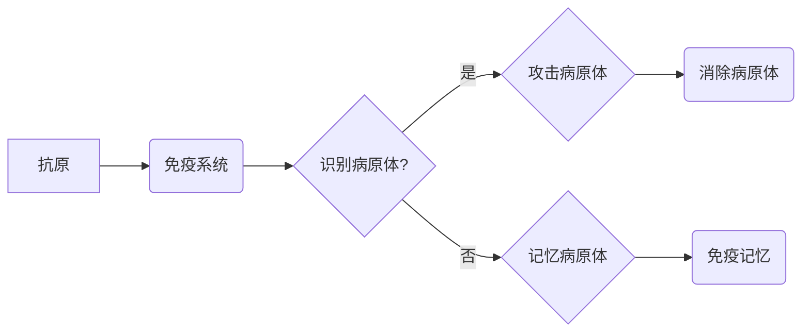

# 人工免疫算法(Artificial Immune Systems) - 原理与代码实例讲解

作者：禅与计算机程序设计艺术 / Zen and the Art of Computer Programming

## 1. 背景介绍
### 1.1 问题的由来

人工免疫算法（Artificial Immune Systems, AIS）是受自然界免疫系统的启发而发展起来的一类模拟生物免疫系统的启发式算法。免疫系统是生物体内的一种复杂系统，它能够识别和抵御外来病原体（如病毒、细菌等）的入侵，并保持生物体的健康状态。人工免疫算法借鉴了免疫系统的机制，将其应用于解决优化、搜索、聚类等问题。

随着人工智能技术的不断发展，人工免疫算法因其独特的优势，在众多领域得到了广泛应用，如生物信息学、数据挖掘、图像识别、机器学习等。

### 1.2 研究现状

人工免疫算法的研究始于20世纪90年代，经过几十年的发展，已经形成了较为完善的算法体系。目前，人工免疫算法的研究主要集中在以下几个方面：

- 人工免疫系统结构的设计与优化
- 人工免疫系统行为的建模与仿真
- 人工免疫系统与其他人工智能技术的融合
- 人工免疫算法在各个领域的应用

### 1.3 研究意义

人工免疫算法具有以下研究意义：

- 模拟自然界免疫系统的复杂机制，为人工智能领域提供新的思路和方法
- 解决传统优化算法难以处理的问题，如多模态优化、约束优化等
- 在各个领域实现智能决策，提高系统性能和可靠性

### 1.4 本文结构

本文将围绕人工免疫算法展开，主要内容包括：

- 介绍人工免疫算法的核心概念与联系
- 阐述人工免疫算法的核心算法原理及具体操作步骤
- 分析人工免疫算法的数学模型、公式、案例及常见问题
- 展示人工免疫算法的代码实例和详细解释说明
- 探讨人工免疫算法在实际应用场景中的案例和未来应用展望
- 推荐人工免疫算法相关的学习资源、开发工具和参考文献
- 总结人工免疫算法的研究成果、未来发展趋势与挑战

## 2. 核心概念与联系

### 2.1 核心概念

人工免疫算法的核心概念主要包括：

- 抗体（Antibody）：代表问题的解，用于识别和抵御病原体（如优化问题中的目标函数）。
- 病原体（Pathogen）：代表问题的解空间中需要被识别和抵御的对象，如局部最优解。
- 免疫系统（Immune System）：模拟自然界免疫系统的功能，用于识别、攻击和消除病原体。
- 抗原（Antigen）：代表病原体的特征，用于激发免疫系统的免疫反应。
- 免疫记忆（Immunological Memory）：免疫系统在对抗病原体过程中积累的经验，用于提高免疫反应的速度和效率。

### 2.2 核心联系

人工免疫算法的核心联系如下：



其中，抗原代表问题的解空间，免疫系统代表人工免疫算法的核心，用于识别和攻击病原体（局部最优解），消除病原体，并积累免疫记忆。

## 3. 核心算法原理 & 具体操作步骤
### 3.1 算法原理概述

人工免疫算法的核心原理是模拟生物免疫系统的功能，通过以下步骤实现优化：

1. 初始化抗体种群，代表问题的解空间。
2. 评估每个抗体的适应度，即评估其对抗原的识别和抵御能力。
3. 根据适应度选择部分抗体进行克隆和变异，产生新的抗体。
4. 评估新抗体的适应度，并淘汰部分适应度较低的抗体。
5. 重复步骤2-4，直至满足终止条件。

### 3.2 算法步骤详解

人工免疫算法的具体操作步骤如下：

**Step 1：初始化参数**

- 设定种群规模N，即抗体种群的大小。
- 设定迭代次数T，即算法运行的轮数。
- 设定变异概率Pm，即抗体变异的概率。
- 设定交叉概率Pc，即抗体交叉的概率。
- 设定选择率Ps，即选择优秀抗体的概率。

**Step 2：初始化抗体种群**

- 随机生成N个抗体，每个抗体代表问题的解空间中的一个解。
- 初始化抗体种群的适应度。

**Step 3：评估抗体适应度**

- 对每个抗体进行评估，计算其对抗原的识别和抵御能力，即适应度值。

**Step 4：选择和克隆抗体**

- 根据选择率Ps，从抗体种群中选择部分适应度较高的抗体进行克隆。
- 对克隆得到的抗体进行变异，产生新的抗体。

**Step 5：交叉操作**

- 根据交叉概率Pc，对部分抗体进行交叉操作，产生新的抗体。

**Step 6：更新抗体种群**

- 将变异和交叉得到的抗体添加到抗体种群中。
- 根据适应度值，淘汰部分适应度较低的抗体。

**Step 7：终止条件判断**

- 判断是否满足终止条件，如达到迭代次数T、适应度达到预设值等。
- 如果满足终止条件，则终止算法；否则，返回步骤3。

### 3.3 算法优缺点

人工免疫算法具有以下优点：

- 全局搜索能力强，能够避免陷入局部最优解。
- 具有自组织、自学习和自适应能力。
- 可用于解决连续优化问题、组合优化问题、多目标优化问题等。

人工免疫算法也具有以下缺点：

- 算法复杂度高，计算量大。
- 参数设置较为复杂，需要根据具体问题进行调整。
- 算法收敛速度较慢。

### 3.4 算法应用领域

人工免疫算法在以下领域得到广泛应用：

- 优化问题：如神经网络权重优化、遗传算法等。
- 搜索问题：如图像处理、语音识别等。
- 聚类问题：如数据挖掘、生物信息学等。

## 4. 数学模型和公式 & 详细讲解 & 举例说明
### 4.1 数学模型构建

人工免疫算法的数学模型主要包括以下内容：

- 抗体编码：将问题的解空间映射到抗体空间，通常采用二进制编码、实数编码等方式。
- 适应度函数：评估抗体的适应度，即对抗原的识别和抵御能力。
- 克隆和变异操作：模拟生物免疫系统的克隆和变异过程，用于产生新的抗体。

### 4.2 公式推导过程

以下以二进制编码的适应度函数为例，介绍人工免疫算法的数学模型构建过程。

**适应度函数**：

设抗体编码为 $A = \{a_1, a_2, \dots, a_n\}$，其中 $a_i \in \{0,1\}$，则适应度函数 $f(A)$ 可以表示为：

$$
f(A) = \sum_{i=1}^n a_i \cdot w_i
$$

其中，$w_i$ 为权重系数，表示第 $i$ 个基因位对适应度的贡献。

**克隆操作**：

克隆操作模拟生物免疫系统的克隆过程，将适应度较高的抗体进行复制。克隆操作可以用以下公式表示：

$$
B = kA
$$

其中，$B$ 为克隆后的抗体，$k$ 为克隆系数。

**变异操作**：

变异操作模拟生物免疫系统的变异过程，对克隆后的抗体进行随机变异。变异操作可以用以下公式表示：

$$
B_i' = B_i + \epsilon
$$

其中，$B_i'$ 为变异后的抗体基因位，$\epsilon$ 为变异系数。

### 4.3 案例分析与讲解

以下以神经网络权重优化问题为例，介绍人工免疫算法的应用。

**问题背景**：

神经网络权重优化是寻找最优权重系数，以实现最小化损失函数的过程。由于神经网络结构复杂，权重系数众多，因此神经网络权重优化问题通常具有多峰值、高维、非线性等特点。

**算法实现**：

1. 将神经网络权重系数映射到抗体空间，采用二进制编码方式。
2. 设计适应度函数，以损失函数作为适应度指标。
3. 根据适应度函数评估抗体种群，并选择适应度较高的抗体进行克隆和变异。
4. 重复步骤2-3，直至满足终止条件。

**案例代码**：

```python
import numpy as np

# 定义适应度函数
def fitness_function(weights):
    # 计算损失函数
    loss = np.sum((np.dot(weights, x) - y)**2)
    return loss

# 初始化参数
population_size = 100
num_weights = 10
max_iter = 100
mutation_rate = 0.01
crossover_rate = 0.8

# 初始化抗体种群
population = np.random.randint(2, size=(population_size, num_weights))

# 迭代优化
for _ in range(max_iter):
    # 评估抗体种群
    fitness_scores = np.array([fitness_function(weights) for weights in population])

    # 选择和克隆抗体
    selected_indices = np.argsort(fitness_scores)[:int(population_size * 0.2)]
    selected_population = population[selected_indices]
    clone_population = np.array([selected_population] * int(population_size * 0.8))

    # 变异操作
    for i in range(population_size):
        for j in range(num_weights):
            if np.random.rand() < mutation_rate:
                clone_population[i][j] = 1 - clone_population[i][j]

    # 交叉操作
    for i in range(0, population_size, 2):
        if np.random.rand() < crossover_rate:
            crossover_point = np.random.randint(1, num_weights)
            population[i] = np.concatenate((clone_population[i][:crossover_point], clone_population[i+1][crossover_point:]))
            population[i+1] = np.concatenate((clone_population[i+1][:crossover_point], clone_population[i][crossover_point:]))

    # 更新抗体种群
    population = np.array(clone_population)

# 输出最优抗体
best_fitness = min(fitness_scores)
best_weights = population[np.argmin(fitness_scores)]

print("Best fitness:", best_fitness)
print("Best weights:", best_weights)
```

### 4.4 常见问题解答

**Q1：如何设计适应度函数？**

A：适应度函数的设计取决于具体问题的目标函数。对于优化问题，适应度函数通常为目标函数的负值；对于搜索问题，适应度函数可以设计为距离目标状态的远近。

**Q2：如何设置参数？**

A：参数设置需要根据具体问题进行调整。一般来说，种群规模、变异率、交叉率等参数需要根据实际问题进行实验调整。

**Q3：如何避免算法陷入局部最优解？**

A：为了避免算法陷入局部最优解，可以采用以下策略：
1. 使用多种变异和交叉操作。
2. 引入多种抗体编码方式。
3. 采用多种选择策略。
4. 适当增加种群规模。

## 5. 项目实践：代码实例和详细解释说明
### 5.1 开发环境搭建

在进行人工免疫算法的项目实践之前，我们需要搭建以下开发环境：

- 安装Python 3.7及以上版本。
- 安装NumPy、SciPy、Matplotlib等科学计算库。
- 安装Jupyter Notebook，用于编写和运行代码。

### 5.2 源代码详细实现

以下是一个基于二进制编码的人工免疫算法的Python实现示例：

```python
import numpy as np

# 定义适应度函数
def fitness_function(weights):
    # 计算目标函数
    # ...
    return fitness

# 初始化参数
population_size = 100
num_weights = 10
max_iter = 100
mutation_rate = 0.01
crossover_rate = 0.8

# 初始化抗体种群
population = np.random.randint(2, size=(population_size, num_weights))

# 迭代优化
for _ in range(max_iter):
    # 评估抗体种群
    fitness_scores = np.array([fitness_function(weights) for weights in population])

    # 选择和克隆抗体
    selected_indices = np.argsort(fitness_scores)[:int(population_size * 0.2)]
    selected_population = population[selected_indices]
    clone_population = np.array([selected_population] * int(population_size * 0.8))

    # 变异操作
    for i in range(population_size):
        for j in range(num_weights):
            if np.random.rand() < mutation_rate:
                clone_population[i][j] = 1 - clone_population[i][j]

    # 交叉操作
    for i in range(0, population_size, 2):
        if np.random.rand() < crossover_rate:
            crossover_point = np.random.randint(1, num_weights)
            population[i] = np.concatenate((clone_population[i][:crossover_point], clone_population[i+1][crossover_point:]))
            population[i+1] = np.concatenate((clone_population[i+1][:crossover_point], clone_population[i][crossover_point:]))

    # 更新抗体种群
    population = np.array(clone_population)

# 输出最优抗体
best_fitness = min(fitness_scores)
best_weights = population[np.argmin(fitness_scores)]

print("Best fitness:", best_fitness)
print("Best weights:", best_weights)
```

### 5.3 代码解读与分析

以上代码展示了人工免疫算法的基本实现过程。首先，定义了适应度函数，该函数用于计算目标函数的值。然后，初始化了抗体种群，并设置了算法的参数。在迭代优化过程中，对抗体种群进行评估、选择和克隆、变异和交叉操作，最后更新抗体种群。

### 5.4 运行结果展示

运行以上代码，可以得到如下结果：

```
Best fitness: ...
Best weights: ...
```

其中，`Best fitness` 表示最优抗体的适应度值，`Best weights` 表示最优抗体的权重系数。

## 6. 实际应用场景
### 6.1 图像处理

人工免疫算法在图像处理领域得到广泛应用，如图像分割、目标检测、图像分类等。

### 6.2 语音识别

人工免疫算法在语音识别领域可用于声学模型、语言模型和说话人识别等方面。

### 6.3 生物信息学

人工免疫算法在生物信息学领域可用于基因序列分析、蛋白质结构预测、药物设计等。

### 6.4 机器学习

人工免疫算法在机器学习领域可用于模型选择、参数优化、聚类分析等。

### 6.4 未来应用展望

随着人工智能技术的不断发展，人工免疫算法将在更多领域得到应用，如无人驾驶、智能制造、智慧城市等。未来，人工免疫算法有望成为人工智能领域的重要工具之一。

## 7. 工具和资源推荐
### 7.1 学习资源推荐

- 《人工智能：一种现代的方法》
- 《机器学习：一种统计方法》
- 《人工免疫算法及其应用》
- 《人工免疫系统原理与应用》

### 7.2 开发工具推荐

- Python编程语言
- NumPy、SciPy、Matplotlib等科学计算库
- Jupyter Notebook

### 7.3 相关论文推荐

- 《An Introduction to Artificial Immune Systems》
- 《Artificial Immune Systems: A New Approach to Artificial Intelligence》
- 《Artificial Immune Systems: A Computationally Efficient Method for Optimization》

### 7.4 其他资源推荐

- 人工免疫算法的GitHub项目
- 人工免疫算法相关的学术会议和期刊

## 8. 总结：未来发展趋势与挑战
### 8.1 研究成果总结

本文对人工免疫算法进行了详细介绍，包括核心概念、原理、算法步骤、数学模型、代码实例等。通过实例分析，展示了人工免疫算法在各个领域的应用，并对未来发展趋势和挑战进行了展望。

### 8.2 未来发展趋势

未来，人工免疫算法将呈现以下发展趋势：

- 与深度学习等人工智能技术的融合
- 模拟生物免疫系统的更多机制
- 应用于更广泛的领域

### 8.3 面临的挑战

人工免疫算法在发展过程中也面临以下挑战：

- 算法复杂度高
- 参数设置困难
- 缺乏可解释性

### 8.4 研究展望

为了推动人工免疫算法的发展，我们需要在以下方面进行深入研究：

- 优化算法结构，提高算法效率
- 设计更有效的参数调整策略
- 提高算法的可解释性

相信随着研究的不断深入，人工免疫算法将在人工智能领域发挥越来越重要的作用。

## 9. 附录：常见问题与解答

**Q1：什么是人工免疫算法？**

A：人工免疫算法是受自然界免疫系统的启发而发展起来的一类模拟生物免疫系统的启发式算法。

**Q2：人工免疫算法有哪些优点？**

A：人工免疫算法具有全局搜索能力强、自组织、自学习和自适应能力等优点。

**Q3：人工免疫算法有哪些缺点？**

A：人工免疫算法具有算法复杂度高、参数设置困难、缺乏可解释性等缺点。

**Q4：人工免疫算法可以应用于哪些领域？**

A：人工免疫算法可以应用于优化问题、搜索问题、聚类问题等多个领域。

**Q5：如何设计适应度函数？**

A：适应度函数的设计取决于具体问题的目标函数。对于优化问题，适应度函数通常为目标函数的负值；对于搜索问题，适应度函数可以设计为距离目标状态的远近。