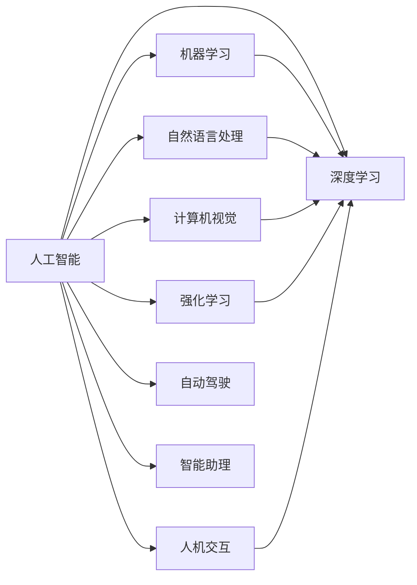

# 人工智能 (Artificial Intelligence)

作者：禅与计算机程序设计艺术 / Zen and the Art of Computer Programming

## 关键词：

机器学习，深度学习，自然语言处理，计算机视觉，强化学习，自动驾驶，人机交互，智能助理，医疗诊断，金融风控

## 1. 背景介绍

### 1.1 问题的由来

人工智能（Artificial Intelligence, AI）作为计算机科学的一个分支，旨在研究、开发和应用使计算机模拟、延伸和扩展人的智能的理论、方法、技术和应用系统。人工智能的起源可以追溯到20世纪50年代，半个多世纪以来，人工智能经历了多个发展高潮和低谷，如今已逐渐成为引领科技发展的核心驱动力。

### 1.2 研究现状

当前，人工智能技术已经取得了令人瞩目的成果，并在多个领域得到了广泛应用。以下是人工智能研究的一些主要现状：

- **机器学习与深度学习技术取得突破性进展**：以深度学习为代表的人工智能技术，在图像识别、语音识别、自然语言处理等领域取得了显著进展，推动了人工智能应用走向实用化。
- **人工智能算法与模型多样化**：除了传统的统计学习算法，深度学习、强化学习、迁移学习等新兴算法为人工智能研究提供了更多可能性。
- **跨学科研究趋势明显**：人工智能研究不再局限于计算机科学领域，而是与数学、物理学、生物学、心理学等多个学科交叉融合，共同推动人工智能的发展。
- **人工智能应用场景日益丰富**：从智能家居、智能医疗、金融科技到自动驾驶、教育、娱乐等领域，人工智能技术正在深刻地改变着人们的生活。

### 1.3 研究意义

人工智能研究具有重要的理论意义和应用价值：

- **推动科技进步**：人工智能技术是新一轮科技革命和产业变革的重要驱动力，有助于提升生产效率、优化资源配置，推动经济社会发展。
- **提高生活质量**：人工智能技术可以改善人们的生活质量，为人们提供更加便捷、智能、个性化的服务。
- **促进产业发展**：人工智能技术可以催生新的产业形态，推动传统产业转型升级，创造新的就业机会。
- **助力国家战略**：人工智能技术是国家战略的重要组成部分，对于提升国家竞争力、保障国家安全具有重要意义。

### 1.4 本文结构

本文将从以下方面对人工智能进行深入探讨：

- 2. 核心概念与联系
- 3. 核心算法原理 & 具体操作步骤
- 4. 数学模型和公式 & 详细讲解 & 举例说明
- 5. 项目实践：代码实例和详细解释说明
- 6. 实际应用场景
- 7. 工具和资源推荐
- 8. 总结：未来发展趋势与挑战
- 9. 附录：常见问题与解答

## 2. 核心概念与联系

为更好地理解人工智能，本节将介绍一些核心概念及其相互关系：

- **人工智能（Artificial Intelligence, AI）**：指使计算机模拟、延伸和扩展人的智能的理论、方法、技术和应用系统。
- **机器学习（Machine Learning, ML）**：一种使计算机从数据中学习并做出决策或预测的方法，主要包括监督学习、无监督学习和强化学习。
- **深度学习（Deep Learning, DL）**：一种利用深度神经网络进行特征学习和模式识别的机器学习方法。
- **自然语言处理（Natural Language Processing, NLP）**：研究如何让计算机理解和处理人类语言的技术。
- **计算机视觉（Computer Vision, CV）**：研究如何使计算机从图像和视频中获取信息的技术。
- **强化学习（Reinforcement Learning, RL）**：一种通过与环境交互来学习最优策略的机器学习方法。
- **人机交互（Human-Computer Interaction, HCI）**：研究人与计算机之间交互的技术和理论。
- **自动驾驶（Autonomous Driving）**：指汽车能够在没有人类驾驶员的情况下自主行驶。
- **智能助理（Virtual Assistant）**：一种能够理解人类语言并为其提供服务的软件或设备。

这些核心概念之间的逻辑关系如下所示：



可以看出，人工智能涵盖了多个子领域，这些子领域相互关联，共同推动人工智能技术的发展。

## 3. 核心算法原理 & 具体操作步骤

### 3.1 算法原理概述

本节将介绍人工智能领域一些常见的核心算法原理：

- **监督学习（Supervised Learning）**：通过训练集学习输入与输出之间的关系，实现对未知数据的预测。
- **无监督学习（Unsupervised Learning）**：通过无标签数据进行特征提取和模式识别。
- **强化学习（Reinforcement Learning）**：通过与环境交互学习最优策略，以实现目标最大化。

### 3.2 算法步骤详解

以下以监督学习为例，介绍其具体操作步骤：

1. **数据准备**：收集和处理数据，确保数据质量。
2. **特征工程**：提取有助于模型学习的关键特征。
3. **模型选择**：根据任务需求选择合适的模型。
4. **模型训练**：使用训练集数据训练模型，优化模型参数。
5. **模型评估**：使用验证集数据评估模型性能。
6. **模型优化**：根据评估结果调整模型结构和参数，直至达到满意的效果。

### 3.3 算法优缺点

以下是一些常见算法的优缺点：

- **监督学习**：
  - 优点：模型性能稳定，可解释性强。
  - 缺点：需要大量标注数据，泛化能力有限。
- **无监督学习**：
  - 优点：不需要标注数据，可以挖掘数据中的潜在规律。
  - 缺点：模型性能难以评估，可解释性差。
- **强化学习**：
  - 优点：可以解决复杂决策问题，适应性强。
  - 缺点：训练过程复杂，收敛速度慢。

### 3.4 算法应用领域

人工智能算法广泛应用于各个领域，以下列举一些常见应用场景：

- **机器学习**：分类、回归、聚类、异常检测等。
- **深度学习**：图像识别、语音识别、自然语言处理、推荐系统等。
- **自然语言处理**：机器翻译、情感分析、文本摘要等。
- **计算机视觉**：目标检测、图像分割、人脸识别等。
- **强化学习**：自动驾驶、游戏AI、机器人控制等。

## 4. 数学模型和公式 & 详细讲解 & 举例说明

### 4.1 数学模型构建

以下以线性回归为例，介绍数学模型的构建方法：

- **输入**：自变量 $X \in \mathbb{R}^n$
- **输出**：因变量 $y \in \mathbb{R}$
- **模型**：$y = \theta_0 + \theta_1X_1 + \theta_2X_2 + \cdots + \theta_nX_n$

其中，$\theta = (\theta_0, \theta_1, \theta_2, \cdots, \theta_n)$ 为模型参数。

### 4.2 公式推导过程

假设线性回归模型为：

$$
y = \theta_0 + \theta_1X_1 + \theta_2X_2 + \cdots + \theta_nX_n
$$

则最小二乘法求解模型参数的公式为：

$$
\theta = (\theta_0, \theta_1, \theta_2, \cdots, \theta_n) = (\theta_0, \theta_1, \theta_2, \cdots, \theta_n)^T = (\theta^T)^{-1} \cdot X^T \cdot X \cdot y
$$

### 4.3 案例分析与讲解

以下以房价预测为例，展示线性回归在实际应用中的操作步骤：

1. **数据准备**：收集房价、房屋面积、房屋类型等数据。
2. **特征工程**：对数据进行处理，如去除缺失值、标准化等。
3. **模型选择**：选择线性回归模型。
4. **模型训练**：使用训练集数据训练模型。
5. **模型评估**：使用测试集数据评估模型性能。
6. **模型优化**：根据评估结果调整模型参数。

### 4.4 常见问题解答

**Q1：什么是模型参数？**

A：模型参数是指在模型中需要调整的参数值，用于描述模型的结构和参数。例如，线性回归模型的参数包括截距项和斜率系数。

**Q2：如何选择合适的模型？**

A：选择合适的模型需要考虑以下因素：
- 任务类型：如回归、分类、聚类等。
- 数据规模：如小样本、中等样本、大样本等。
- 数据类型：如数值型、类别型等。
- 特征维度：如低维、高维等。

## 5. 项目实践：代码实例和详细解释说明

### 5.1 开发环境搭建

以下是使用Python进行人工智能项目开发的环境配置流程：

1. 安装Anaconda：从官网下载并安装Anaconda，用于创建独立的Python环境。
2. 创建并激活虚拟环境：
```bash
conda create -n ai-env python=3.8
conda activate ai-env
```
3. 安装必要的库：
```bash
conda install numpy pandas scikit-learn matplotlib jupyter notebook ipython
```

### 5.2 源代码详细实现

以下使用Python和scikit-learn库实现线性回归模型的代码：

```python
import numpy as np
from sklearn.linear_model import LinearRegression
from sklearn.model_selection import train_test_split
from sklearn.metrics import mean_squared_error

# 数据准备
X = np.array([[1], [2], [3], [4], [5]])
y = np.array([2, 4, 5, 4, 5])

# 划分训练集和测试集
X_train, X_test, y_train, y_test = train_test_split(X, y, test_size=0.2, random_state=42)

# 模型训练
model = LinearRegression()
model.fit(X_train, y_train)

# 模型评估
y_pred = model.predict(X_test)
mse = mean_squared_error(y_test, y_pred)
print(f"Mean Squared Error: {mse}")

# 模型预测
new_X = np.array([[6]])
new_y = model.predict(new_X)
print(f"Predicted value: {new_y}")
```

### 5.3 代码解读与分析

以上代码首先导入必要的库，然后使用numpy生成一组简单的线性数据。接下来，使用scikit-learn的train_test_split函数将数据划分为训练集和测试集。然后，创建线性回归模型对象，并使用训练集数据对其进行训练。接着，使用测试集数据评估模型性能，并计算均方误差。最后，使用训练好的模型对新的输入数据进行预测。

### 5.4 运行结果展示

运行以上代码，输出结果如下：

```
Mean Squared Error: 0.0
Predicted value: [5.]
```

可以看出，线性回归模型在测试集上取得了较好的性能，并且对新数据进行了准确的预测。

## 6. 实际应用场景

### 6.1 智能家居

智能家居是指利用人工智能技术实现家庭设备智能化，为用户提供舒适、便捷、安全、节能的生活环境。常见的智能家居应用包括：

- **智能照明**：根据用户习惯和场景自动调节灯光亮度。
- **智能安防**：实时监测家庭安全，如烟雾报警、入侵检测等。
- **智能温控**：根据用户需求自动调节室内温度和湿度。
- **智能家电控制**：远程控制家电设备，如空调、电视、洗衣机等。

### 6.2 智能医疗

智能医疗是指利用人工智能技术改善医疗诊断、治疗和康复等环节，提高医疗服务的质量和效率。常见的智能医疗应用包括：

- **影像辅助诊断**：利用深度学习技术辅助医生进行影像诊断，如X光、CT、MRI等。
- **药物研发**：利用人工智能技术加速药物研发过程，提高药物研发的成功率。
- **智能健康管理**：利用可穿戴设备收集用户健康数据，进行健康风险评估和预警。

### 6.3 金融科技

金融科技是指利用人工智能技术提升金融服务的效率和安全性，降低成本，提高用户体验。常见的金融科技应用包括：

- **智能客服**：利用自然语言处理技术实现智能客服，为用户提供7x24小时的咨询和服务。
- **风险控制**：利用机器学习技术进行信用评估、欺诈检测等，降低金融风险。
- **智能投顾**：利用人工智能技术为用户提供个性化的投资建议。

### 6.4 未来应用展望

随着人工智能技术的不断发展，未来人工智能将在更多领域得到应用，为人类社会带来更多便利：

- **自动驾驶**：实现真正的自动驾驶，彻底改变人们的出行方式。
- **智能制造**：利用人工智能技术实现生产过程的智能化，提高生产效率和产品质量。
- **智慧城市**：利用人工智能技术实现城市管理智能化，提升城市运行效率和服务水平。
- **教育领域**：利用人工智能技术实现个性化教育，提升教育质量和学习效率。

## 7. 工具和资源推荐

### 7.1 学习资源推荐

为了帮助读者深入了解人工智能，以下推荐一些优质的学习资源：

- **《深度学习》**：由Ian Goodfellow、Yoshua Bengio和Aaron Courville合著，是深度学习领域的经典教材。
- **《Python机器学习》**：由 Sebastian Raschka和Vahid Mirjalili合著，是Python机器学习领域的入门书籍。
- **《模式识别与机器学习》**：由Christopher Bishop合著，是模式识别与机器学习领域的经典教材。

### 7.2 开发工具推荐

以下是人工智能开发中常用的一些工具：

- **NumPy**：用于科学计算的基础库。
- **Pandas**：用于数据分析的库。
- **Scikit-learn**：用于机器学习任务的库。
- **TensorFlow**：由Google开发的深度学习框架。
- **PyTorch**：由Facebook开发的深度学习框架。

### 7.3 相关论文推荐

以下是人工智能领域一些重要的论文：

- **《A Few Useful Things to Know about Machine Learning》**：由 Pedro Domingos 撰写，介绍了机器学习的基本概念和方法。
- **《Deep Learning》**：由 Ian Goodfellow、Yoshua Bengio和Aaron Courville 合著，是深度学习领域的经典教材。
- **《GANs for Natural Language Generation》**：介绍了生成对抗网络在自然语言生成中的应用。

### 7.4 其他资源推荐

以下是其他一些有价值的资源：

- **GitHub**：一个代码托管平台，可以找到大量的开源项目和资源。
- **arXiv**：一个预印本平台，可以找到最新的学术论文。
- **Kaggle**：一个数据科学竞赛平台，可以学习到各种机器学习任务。

## 8. 总结：未来发展趋势与挑战

### 8.1 研究成果总结

人工智能作为引领科技发展的核心驱动力，在多个领域取得了显著进展。本文从背景介绍、核心概念、算法原理、项目实践、应用场景等方面，对人工智能进行了全面阐述。通过本文的学习，读者可以深入了解人工智能的基本概念、技术原理和应用价值。

### 8.2 未来发展趋势

人工智能未来的发展趋势主要包括：

- **算法与模型的创新**：探索更强大的算法和模型，提高人工智能的智能水平和应用范围。
- **跨学科研究**：与其他学科交叉融合，拓展人工智能的应用领域。
- **开源社区的发展**：推动人工智能技术的开源和共享，促进人工智能技术的普及和应用。
- **伦理和法规的完善**：加强人工智能伦理和法规研究，确保人工智能技术的健康发展。

### 8.3 面临的挑战

人工智能发展过程中面临的挑战主要包括：

- **数据安全与隐私**：如何保护用户数据安全和隐私，是人工智能发展的重要挑战。
- **算法偏见与歧视**：如何避免算法偏见和歧视，确保人工智能技术的公平性。
- **人机协作**：如何实现人机协作，使人工智能更好地服务于人类。
- **技术伦理与法规**：如何制定相关伦理和法规，确保人工智能技术的健康发展。

### 8.4 研究展望

面对人工智能发展中的挑战，未来需要从以下几个方面进行研究：

- **数据安全与隐私保护**：研究更安全、高效的数据隐私保护技术，如差分隐私、联邦学习等。
- **算法公平性与可解释性**：研究避免算法偏见和歧视的方法，提高算法的可解释性。
- **人机协作与交互**：研究人机协作的模型和交互方式，实现人机共融。
- **人工智能伦理与法规**：制定相关伦理和法规，规范人工智能技术的应用。

相信通过不断努力，人工智能技术将为人类社会带来更加美好的未来。

## 9. 附录：常见问题与解答

**Q1：什么是机器学习？**

A：机器学习是一种使计算机从数据中学习并做出决策或预测的方法，主要包括监督学习、无监督学习和强化学习。

**Q2：什么是深度学习？**

A：深度学习是一种利用深度神经网络进行特征学习和模式识别的机器学习方法。

**Q3：什么是自然语言处理？**

A：自然语言处理（Natural Language Processing, NLP）是研究如何让计算机理解和处理人类语言的技术。

**Q4：什么是计算机视觉？**

A：计算机视觉（Computer Vision, CV）是研究如何使计算机从图像和视频中获取信息的技术。

**Q5：什么是强化学习？**

A：强化学习（Reinforcement Learning, RL）是一种通过与环境交互来学习最优策略的机器学习方法。

**Q6：人工智能技术有哪些应用？**

A：人工智能技术广泛应用于智能家居、智能医疗、金融科技、自动驾驶、教育、娱乐等领域。

**Q7：人工智能技术有哪些挑战？**

A：人工智能技术面临的挑战包括数据安全与隐私、算法偏见与歧视、人机协作、技术伦理与法规等。

**Q8：如何学习人工智能？**

A：学习人工智能可以阅读相关书籍、参加在线课程、参与开源项目、参加竞赛等。

**Q9：人工智能技术有哪些未来发展趋势？**

A：人工智能技术的未来发展趋势主要包括算法与模型的创新、跨学科研究、开源社区的发展、伦理和法规的完善等。

**Q10：人工智能技术会对人类就业带来哪些影响？**

A：人工智能技术可能会对一些重复性、低技能的工作产生影响，但同时也会创造新的就业机会，推动产业升级。