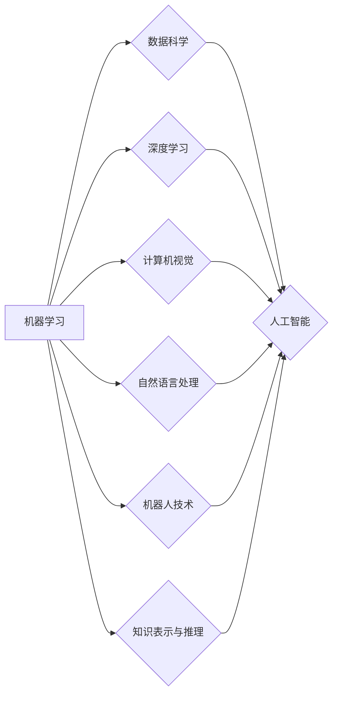

# 人工智能基础原理与代码实战案例讲解

作者：禅与计算机程序设计艺术 / Zen and the Art of Computer Programming

## 1. 背景介绍

### 1.1 问题的由来

人工智能（Artificial Intelligence，AI）作为一门交叉学科，旨在研究、开发用于模拟、延伸和扩展人的智能的理论、方法、技术和应用系统。随着计算能力的提升和大数据时代的到来，人工智能技术得到了前所未有的发展，并在各个领域展现出巨大的应用潜力。

### 1.2 研究现状

当前，人工智能领域的研究主要聚焦在以下几个方面：

- 深度学习：通过模拟人脑神经网络，实现对复杂数据的自动学习和特征提取。
- 自然语言处理：研究和开发能够理解和处理自然语言的技术，如机器翻译、情感分析、语音识别等。
- 计算机视觉：研究和开发能够理解和解释视觉信息的技术，如图像识别、目标检测、人脸识别等。
- 机器人技术：研究和开发能够自主移动、感知和执行任务的智能机器人。
- 知识表示与推理：研究和开发用于表示和处理知识的理论和算法，如专家系统、本体推理等。

### 1.3 研究意义

人工智能技术的研究和应用对于推动社会进步、提高生产力具有重要意义：

- 提高生产效率：人工智能技术可以自动化完成一些重复性、高强度的任务，提高生产效率。
- 改善生活质量：人工智能技术可以提供更加便捷、智能的服务，提高人们的生活质量。
- 促进经济发展：人工智能技术可以创造新的产业和就业机会，推动经济发展。
- 改善社会管理：人工智能技术可以协助政府部门进行社会管理，提高社会管理水平。

### 1.4 本文结构

本文将围绕人工智能基础原理与代码实战案例展开，内容安排如下：

- 第2部分，介绍人工智能领域的关键概念和联系。
- 第3部分，详细讲解人工智能的核心算法原理和具体操作步骤。
- 第4部分，介绍人工智能的数学模型和公式，并举例说明。
- 第5部分，给出人工智能的代码实战案例，并对关键代码进行解读。
- 第6部分，探讨人工智能在实际应用场景中的案例和未来应用展望。
- 第7部分，推荐人工智能的学习资源、开发工具和参考文献。
- 第8部分，总结全文，展望人工智能的未来发展趋势与挑战。
- 第9部分，附录：常见问题与解答。

## 2. 核心概念与联系

本节将介绍人工智能领域的关键概念及其相互联系。

### 2.1 机器学习与深度学习

机器学习（Machine Learning，ML）是人工智能的一个分支，旨在研究如何让计算机通过数据学习规律，并做出决策。深度学习（Deep Learning，DL）是机器学习的一个子领域，通过模拟人脑神经网络结构，实现对复杂数据的自动学习和特征提取。

### 2.2 数据科学与人工智能

数据科学（Data Science，DS）是另一个与人工智能密切相关的领域，旨在通过统计方法从数据中提取有价值的信息。数据科学可以为人工智能提供高质量的数据和算法支持。

### 2.3 计算机视觉与自然语言处理

计算机视觉（Computer Vision，CV）和自然语言处理（Natural Language Processing，NLP）是人工智能的两个重要应用领域，分别关注图像和文本数据的理解和处理。

### 2.4 机器人技术与人工智能

机器人技术（Robotics）是人工智能的一个重要应用领域，旨在研究和开发能够自主移动、感知和执行任务的智能机器人。

### 2.5 知识表示与推理

知识表示（Knowledge Representation，KR）和推理（Reasoning）是人工智能的两个基本任务，旨在将知识表示为计算机可理解的形式，并利用推理机制进行逻辑推理。

以下是大人工智能核心概念之间的逻辑关系图：



## 3. 核心算法原理 & 具体操作步骤

### 3.1 算法原理概述

人工智能领域涉及多种算法，以下列举一些常见的算法及其原理：

- **监督学习**：通过标注数据进行学习，学习输入到输出的映射关系。
- **无监督学习**：通过无标注数据进行学习，学习数据的分布和结构。
- **强化学习**：通过与环境交互进行学习，学习最优策略。
- **深度学习**：通过模拟人脑神经网络，实现对复杂数据的自动学习和特征提取。

### 3.2 算法步骤详解

以下以监督学习算法为例，介绍算法的具体操作步骤：

1. **数据预处理**：对数据进行清洗、标准化等预处理操作，以提高模型的泛化能力。
2. **特征提取**：从数据中提取有用的特征，用于模型训练和预测。
3. **模型选择**：根据任务需求选择合适的机器学习算法。
4. **模型训练**：使用标注数据对模型进行训练，优化模型参数。
5. **模型评估**：使用验证集对模型进行评估，调整模型参数。
6. **模型部署**：将训练好的模型部署到实际应用场景中。

### 3.3 算法优缺点

以下是几种常见机器学习算法的优缺点：

- **线性回归**：简单易实现，但只能处理线性关系。
- **决策树**：可解释性强，但容易过拟合。
- **支持向量机（SVM）**：泛化能力强，但参数难以调整。
- **神经网络**：可以处理非线性关系，但模型可解释性差。

### 3.4 算法应用领域

以下列举几种机器学习算法的应用领域：

- **线性回归**：用于回归分析、股票预测等。
- **决策树**：用于分类、预测、推荐等。
- **SVM**：用于图像识别、语音识别等。
- **神经网络**：用于图像识别、语音识别、自然语言处理等。

## 4. 数学模型和公式 & 详细讲解 & 举例说明

### 4.1 数学模型构建

以下以线性回归为例，介绍数学模型的构建过程：

设输入特征为 $X$，输出为 $Y$，模型参数为 $\theta$，则线性回归模型可以表示为：

$$
Y = X\theta + \epsilon
$$

其中 $\epsilon$ 为误差项。

### 4.2 公式推导过程

线性回归模型的损失函数为均方误差：

$$
L(\theta) = \frac{1}{2}\sum_{i=1}^n (Y_i - X_i^T\theta)^2
$$

对损失函数求导，并令导数等于0，可得：

$$
\theta = (X^TX)^{-1}X^TY
$$

### 4.3 案例分析与讲解

以下使用Python实现线性回归模型，并分析案例：

```python
import numpy as np
from sklearn.linear_model import LinearRegression
import matplotlib.pyplot as plt

# 生成样本数据
X = np.array([[1, 2], [2, 3], [3, 4], [4, 5], [5, 6]])
y = np.dot(X, np.array([1, 1])) + np.random.randn(*X.shape[0], 1)

# 构建线性回归模型
model = LinearRegression()
model.fit(X, y)

# 预测结果
y_pred = model.predict(X)

# 绘制结果
plt.scatter(X[:, 0], y, c='r', label='True Values')
plt.scatter(X[:, 0], y_pred, c='b', label='Predictions')
plt.xlabel('X')
plt.ylabel('Y')
plt.legend()
plt.show()
```

### 4.4 常见问题解答

**Q1：什么是过拟合？如何解决过拟合问题？**

A：过拟合是指模型在训练集上表现良好，但在测试集上表现不佳的现象。解决过拟合问题的方法包括：

- 数据增强：通过数据扩充、数据平滑等方式增加数据样本。
- 正则化：在损失函数中加入正则项，如L1正则化、L2正则化等。
- 简化模型：减少模型复杂度，如使用简单的模型、剪枝等。
- 早停（Early Stopping）：在验证集上监控模型性能，当性能不再提升时停止训练。

**Q2：什么是交叉验证？如何进行交叉验证？**

A：交叉验证是一种评估模型性能的方法，将训练集划分为多个子集，每个子集轮流作为验证集，其余子集作为训练集。常见的交叉验证方法包括：

- K折交叉验证：将数据集划分为K个子集，进行K轮训练和验证。
- 留一交叉验证：每个样本作为验证集，其余样本作为训练集。

## 5. 项目实践：代码实例和详细解释说明

### 5.1 开发环境搭建

在进行人工智能项目实践前，我们需要搭建开发环境。以下是使用Python进行机器学习开发的常用环境配置流程：

1. 安装Anaconda：从官网下载并安装Anaconda，用于创建独立的Python环境。
2. 创建并激活虚拟环境：
```bash
conda create -n ml-env python=3.8
conda activate ml-env
```
3. 安装Python科学计算库：
```bash
conda install numpy scipy scikit-learn matplotlib seaborn pandas
```
4. 安装机器学习库：
```bash
pip install scikit-learn tensorflow keras
```

### 5.2 源代码详细实现

以下使用scikit-learn库实现线性回归模型，并对关键代码进行解读：

```python
# 导入必要的库
from sklearn.datasets import make_regression
from sklearn.model_selection import train_test_split
from sklearn.linear_model import LinearRegression
import matplotlib.pyplot as plt

# 生成样本数据
X, y = make_regression(n_samples=100, n_features=1, noise=10)

# 划分训练集和测试集
X_train, X_test, y_train, y_test = train_test_split(X, y, test_size=0.2, random_state=42)

# 构建线性回归模型
model = LinearRegression()
model.fit(X_train, y_train)

# 预测结果
y_pred = model.predict(X_test)

# 绘制结果
plt.scatter(X_test, y_test, c='r', label='True Values')
plt.scatter(X_test, y_pred, c='b', label='Predictions')
plt.xlabel('X')
plt.ylabel('Y')
plt.legend()
plt.show()
```

### 5.3 代码解读与分析

- `make_regression`：用于生成线性回归问题的样本数据。
- `train_test_split`：用于将数据集划分为训练集和测试集。
- `LinearRegression`：用于构建线性回归模型。
- `fit`：用于训练模型。
- `predict`：用于预测结果。

通过上述代码，我们可以看到使用scikit-learn库进行机器学习开发非常简单，只需几行代码即可完成模型构建、训练和预测等操作。

### 5.4 运行结果展示

运行上述代码，我们可以在图中观察到：

- 真实数据点（红色）和预测结果（蓝色）的散点图。
- 线性回归模型的拟合直线。

通过对比真实数据点和预测结果，我们可以评估模型的性能。

## 6. 实际应用场景

### 6.1 信用评分系统

信用评分系统可以帮助金融机构评估客户的信用风险，从而做出贷款、信用卡审批等决策。可以使用机器学习算法对客户的信用数据进行分析，建立信用评分模型。

### 6.2 自动化问答系统

自动化问答系统可以帮助企业降低客服成本，提高客户满意度。可以使用自然语言处理技术，实现用户问题与知识库的匹配，生成智能问答系统。

### 6.3 智能推荐系统

智能推荐系统可以帮助电商、视频、新闻等平台为用户提供个性化的推荐内容。可以使用机器学习算法分析用户行为和偏好，实现个性化推荐。

### 6.4 未来应用展望

随着人工智能技术的不断发展，未来人工智能将在更多领域得到应用，如：

- 智能医疗：利用人工智能进行疾病诊断、药物研发等。
- 智能教育：利用人工智能进行个性化学习、智能辅导等。
- 智能交通：利用人工智能实现自动驾驶、智能交通管理等。

## 7. 工具和资源推荐

### 7.1 学习资源推荐

以下是学习人工智能的推荐资源：

- 《Python机器学习基础教程》：入门Python机器学习的基础教程。
- 《深度学习》系列书籍：介绍深度学习理论和应用的经典教材。
- fast.ai课程：提供免费机器学习课程，适合初学者和进阶者。
- TensorFlow官方文档：TensorFlow框架的官方文档，提供丰富的API和教程。

### 7.2 开发工具推荐

以下是人工智能开发工具的推荐：

- Jupyter Notebook：用于编写和执行代码，方便进行实验和报告。
- scikit-learn：Python机器学习库，提供丰富的机器学习算法。
- TensorFlow：深度学习框架，提供高效的模型训练和推理能力。
- PyTorch：深度学习框架，提供灵活的动态计算图。

### 7.3 相关论文推荐

以下是人工智能领域的经典论文推荐：

- "A Few Useful Things to Know about Machine Learning"：介绍机器学习的基本概念和技巧。
- "The Unreasonable Effectiveness of Deep Learning"：介绍深度学习在各个领域的应用。
- "ImageNet Classification with Deep Convolutional Neural Networks"：介绍深度卷积神经网络在图像分类中的应用。
- "BERT: Pre-training of Deep Bidirectional Transformers for Language Understanding"：介绍BERT模型及其在自然语言处理中的应用。

### 7.4 其他资源推荐

以下是其他人工智能资源推荐：

- arXiv：人工智能领域的顶级论文预印本平台。
- fast.ai：提供免费机器学习课程和教程。
- GitHub：人工智能项目的代码和资源分享平台。

## 8. 总结：未来发展趋势与挑战

### 8.1 研究成果总结

本文介绍了人工智能基础原理与代码实战案例讲解，涵盖了机器学习、深度学习、计算机视觉、自然语言处理、机器人技术、知识表示与推理等核心概念，并分析了相关算法原理和具体操作步骤。此外，本文还介绍了人工智能在实际应用场景中的案例和未来应用展望。

### 8.2 未来发展趋势

未来，人工智能技术将呈现以下发展趋势：

- 模型规模和复杂度将进一步增大。
- 计算能力和数据资源将持续提升。
- 人工智能将与其他领域深度融合。
- 人工智能将更加注重可解释性和可信赖性。

### 8.3 面临的挑战

人工智能技术在发展过程中也面临着以下挑战：

- 数据安全问题。
- 隐私保护问题。
- 道德伦理问题。
- 可解释性和可信赖性问题。
- 计算资源消耗问题。

### 8.4 研究展望

针对人工智能面临的挑战，未来的研究可以从以下几个方面进行：

- 加强人工智能的安全性和隐私保护。
- 建立人工智能的伦理规范和标准。
- 提高人工智能的可解释性和可信赖性。
- 发展绿色人工智能，降低计算资源消耗。

相信通过不断努力，人工智能技术将克服挑战，为人类社会带来更多福祉。

## 9. 附录：常见问题与解答

**Q1：什么是机器学习？**

A：机器学习是研究如何让计算机通过数据学习规律，并做出决策的学科。机器学习算法可以通过学习历史数据，预测未知数据，从而实现自动化决策。

**Q2：什么是深度学习？**

A：深度学习是机器学习的一个子领域，通过模拟人脑神经网络结构，实现对复杂数据的自动学习和特征提取。深度学习在图像识别、语音识别、自然语言处理等领域取得了显著成果。

**Q3：什么是数据科学？**

A：数据科学是研究如何从数据中提取有价值信息的学科。数据科学结合了统计学、计算机科学、信息科学等多个学科的知识，旨在利用数据解决实际问题。

**Q4：人工智能有哪些应用场景？**

A：人工智能在各个领域都有广泛应用，如自动化、医疗、教育、交通、金融、娱乐等。

**Q5：如何学习人工智能？**

A：学习人工智能可以从以下方面入手：

1. 学习Python编程语言和常用的科学计算库，如NumPy、Pandas、Scikit-learn等。
2. 学习机器学习、深度学习、自然语言处理、计算机视觉等基本概念和算法。
3. 参与实际项目，积累经验。
4. 关注人工智能领域的最新研究进展。

相信通过不断学习和实践，你一定能够成为一名优秀的人工智能工程师。