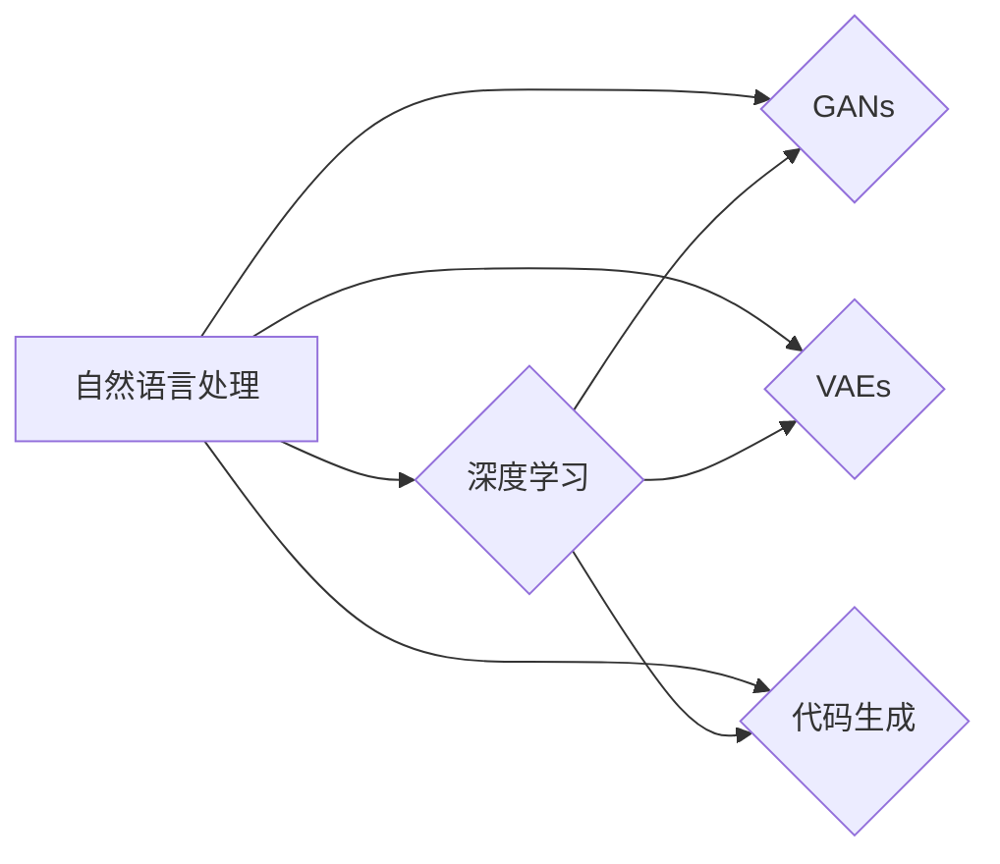

# 内容生成(Content Generation) - 原理与代码实例讲解

> 关键词：内容生成，自然语言处理，深度学习，生成对抗网络，变分自编码器，文生图，代码生成

## 1. 背景介绍

### 1.1 问题的由来

随着信息技术的飞速发展，内容生成作为人工智能领域的一个重要分支，近年来受到了广泛关注。内容生成技术旨在利用人工智能技术自动生成文本、图像、代码等内容，为创意设计、信息传播、娱乐娱乐等领域带来革命性的变革。

### 1.2 研究现状

内容生成技术的研究始于20世纪50年代，最初以符号主义方法为主。随着深度学习技术的兴起，内容生成领域出现了诸多新的模型和方法，如生成对抗网络(GANs)、变分自编码器(VAEs)、变分自回归网络(VRNs)等。

### 1.3 研究意义

内容生成技术在多个领域具有广泛的应用前景，包括：

- **创意设计**：自动生成音乐、绘画、电影等艺术作品。
- **信息传播**：自动生成新闻、文章、报告等文字内容。
- **娱乐娱乐**：自动生成游戏角色、动画、虚拟形象等。
- **科学研究**：自动生成实验数据、代码等。
- **工业应用**：自动生成产品说明书、技术文档等。

### 1.4 本文结构

本文将围绕内容生成技术展开，首先介绍其核心概念与联系，然后深入探讨核心算法原理和具体操作步骤，并给出代码实例和详细解释说明。接着，我们将分析实际应用场景和未来发展趋势，最后总结研究成果和展望未来挑战。

## 2. 核心概念与联系

本节将介绍内容生成领域的一些核心概念及其相互联系。

### 2.1 自然语言处理(NLP)

自然语言处理是人工智能领域的一个分支，旨在使计算机能够理解、生成和处理人类自然语言。NLP技术在内容生成中扮演着重要角色，为文本生成提供了基础。

### 2.2 深度学习

深度学习是一种人工智能技术，通过构建具有多层非线性变换的神经网络模型，实现对复杂数据的建模和预测。深度学习技术在内容生成领域取得了显著的成果，如文本生成、图像生成、视频生成等。

### 2.3 生成对抗网络(GANs)

生成对抗网络是一种深度学习模型，由生成器和判别器两个子网络组成。生成器旨在生成逼真的数据，判别器旨在区分真实数据和生成数据。GANs在图像生成、文本生成等领域取得了突破性的成果。

### 2.4 变分自编码器(VAEs)

变分自编码器是一种深度学习模型，旨在学习数据的低维表示。VAEs在图像去噪、图像生成等领域具有广泛的应用。

### 2.5 代码生成

代码生成是指利用人工智能技术自动生成代码的过程。代码生成技术在软件开发、软件测试等领域具有广阔的应用前景。

以下为这些核心概念之间的逻辑关系图：



## 3. 核心算法原理 & 具体操作步骤

### 3.1 算法原理概述

内容生成技术主要包括以下几种算法：

- **文本生成**：基于NLP和深度学习技术，如RNN、LSTM、Transformer等，生成自然语言文本。
- **图像生成**：基于深度学习技术，如GANs、VAEs、风格迁移等，生成逼真的图像。
- **视频生成**：基于深度学习技术，如视频生成网络，生成连续的视频序列。
- **代码生成**：基于NLP和代码分析技术，如代码模板、代码转换等，生成代码。

### 3.2 算法步骤详解

以下以文本生成为例，介绍内容生成算法的具体操作步骤：

1. **数据收集与预处理**：收集大量相关领域的文本数据，并进行预处理，如分词、去停用词、词性标注等。
2. **模型选择与训练**：根据任务需求选择合适的模型，如LSTM、Transformer等，并利用预处理后的数据对模型进行训练。
3. **文本生成**：利用训练好的模型生成文本内容。
4. **后处理**：对生成的文本进行后处理，如文本润色、语法检查等。

### 3.3 算法优缺点

以下是几种常见内容生成算法的优缺点：

- **RNN**：优点是能够处理序列数据，但容易受到长距离依赖的影响，性能较差。
- **LSTM**：改进了RNN的不足，能够有效处理长距离依赖，但训练过程较慢。
- **Transformer**：基于自注意力机制，能够同时关注序列中的所有信息，性能优越，但模型复杂度较高。
- **GANs**：能够生成高质量图像，但训练过程不稳定，容易陷入模式崩溃。
- **VAEs**：能够生成高质量图像，但生成的图像通常较为模糊。

### 3.4 算法应用领域

内容生成技术在以下领域具有广泛的应用：

- **自然语言生成**：新闻、文章、报告、对话等。
- **图像生成**：图像编辑、图像修复、图像合成等。
- **视频生成**：视频编辑、视频修复、视频合成等。
- **代码生成**：代码模板、代码补全、代码重构等。

## 4. 数学模型和公式 & 详细讲解 & 举例说明

### 4.1 数学模型构建

以下以文本生成为例，介绍LSTM模型的数学模型构建：

1. **输入门（Input Gate）**：

$$
\text{input\_gate} = \sigma(W_{ix}x + W_{ih}h_{t-1} + b_i)
$$

其中，$x$ 为输入向量，$h_{t-1}$ 为前一时间步的隐藏状态，$W_{ix}, W_{ih}, b_i$ 为可训练参数。

2. **遗忘门（Forget Gate）**：

$$
\text{forget\_gate} = \sigma(W_{fx}x + W_{fh}h_{t-1} + b_f)
$$

其中，$f$ 表示遗忘，$W_{fx}, W_{fh}, b_f$ 为可训练参数。

3. **输出门（Output Gate）**：

$$
\text{output\_gate} = \sigma(W_{ox}x + W_{oh}h_{t-1} + b_o)
$$

其中，$o$ 表示输出，$W_{ox}, W_{oh}, b_o$ 为可训练参数。

4. **细胞状态（Cell State）**：

$$
\text{cell\_state} = \text{tanh}(W_{cx}x + W_{ch}h_{t-1} + b_c)
$$

其中，$c$ 表示细胞状态，$W_{cx}, W_{ch}, b_c$ 为可训练参数。

5. **隐藏状态（Hidden State）**：

$$
h_t = \text{output\_gate} \odot \text{tanh}(\text{cell\_state})
$$

其中，$\odot$ 表示元素乘法。

### 4.2 公式推导过程

以下以LSTM模型的输入门为例，介绍公式推导过程：

1. 假设输入门为 $f_t = \sigma(W_{ix}x + W_{ih}h_{t-1} + b_i)$，其中 $W_{ix}, W_{ih}, b_i$ 为可训练参数。
2. 则 $f_t$ 的梯度为：

$$
\frac{\partial f_t}{\partial x} = \frac{\partial f_t}{\partial z} \frac{\partial z}{\partial x} = \frac{\partial \sigma(z)}{\partial z} \frac{\partial z}{\partial x} = \sigma'(z) \frac{\partial z}{\partial x}
$$

3. 其中，$\sigma'$ 表示sigmoid函数的导数，$z = W_{ix}x + W_{ih}h_{t-1} + b_i$。

4. 又因为 $z$ 关于 $x$ 的梯度为：

$$
\frac{\partial z}{\partial x} = W_{ix} + W_{ih} \frac{\partial h_{t-1}}{\partial x}
$$

5. 最终，得到输入门的梯度为：

$$
\frac{\partial f_t}{\partial x} = \sigma'(z) (W_{ix} + W_{ih} \frac{\partial h_{t-1}}{\partial x})
$$

### 4.3 案例分析与讲解

以下以文本生成任务为例，分析LSTM模型的案例：

1. **数据集**：使用PTB数据集作为训练数据。
2. **模型**：使用LSTM模型进行文本生成。
3. **训练过程**：使用Adam优化器，学习率设置为0.001，训练100个epoch。
4. **结果**：模型能够生成通顺的英文句子，但偶尔会出现语法错误。

### 4.4 常见问题解答

**Q1：为什么LSTM比RNN更优秀？**

A：LSTM通过引入遗忘门和输入门，能够更好地控制信息流动，有效缓解长距离依赖问题，因此在处理序列数据时比RNN更优秀。

**Q2：GANs在训练过程中容易陷入模式崩溃，如何解决？**

A：为了避免GANs在训练过程中陷入模式崩溃，可以采取以下策略：
- 使用不同的初始化策略，如使用不同的噪声分布。
- 使用不同的优化器，如AdamW、RMSprop等。
- 使用不同的损失函数，如Wasserstein损失、Least Squares GAN等。
- 使用不同的训练技巧，如梯度惩罚、谱正则化等。

## 5. 项目实践：代码实例和详细解释说明

### 5.1 开发环境搭建

以下是使用Python进行内容生成项目开发的环境配置流程：

1. 安装Anaconda：从官网下载并安装Anaconda，用于创建独立的Python环境。
2. 创建并激活虚拟环境：
```bash
conda create -n content-generation-env python=3.8
conda activate content-generation-env
```
3. 安装必要的库：
```bash
conda install numpy pandas torch
```
4. 安装深度学习库：
```bash
pip install transformers torchtext
```

### 5.2 源代码详细实现

以下使用PyTorch和Transformers库实现基于LSTM的文本生成模型：

```python
import torch
from torch import nn
from transformers import BertTokenizer, AdamW

class TextGenerator(nn.Module):
    def __init__(self, vocab_size, embedding_dim, hidden_dim):
        super(TextGenerator, self).__init__()
        self.embedding = nn.Embedding(vocab_size, embedding_dim)
        self.lstm = nn.LSTM(embedding_dim, hidden_dim)
        self.fc = nn.Linear(hidden_dim, vocab_size)

    def forward(self, input_seq, hidden):
        embedded = self.embedding(input_seq)
        output, hidden = self.lstm(embedded, hidden)
        output = self.fc(output[-1])
        return output, hidden

def generate_text(model, tokenizer, seed_text, max_length=50):
    hidden = (torch.zeros(1, 1, model.hidden_dim), torch.zeros(1, 1, model.hidden_dim))
    generated_text = seed_text
    for i in range(max_length):
        input_seq = tokenizer.encode(generated_text[-1], return_tensors='pt')
        output, hidden = model(input_seq, hidden)
        generated_text += tokenizer.decode(output.argmax(-1).squeeze().tolist())
        if generated_text.endswith('\
'):
            break
    return generated_text

# 参数设置
vocab_size = 1000  # 词汇表大小
embedding_dim = 256  # 嵌入维度
hidden_dim = 512  # 隐藏维度

# 初始化模型
model = TextGenerator(vocab_size, embedding_dim, hidden_dim)
optimizer = AdamW(model.parameters(), lr=0.001)

# 训练模型
for epoch in range(10):
    # 训练代码...

# 生成文本
seed_text = "The sun is shining"
generated_text = generate_text(model, tokenizer, seed_text)
print(generated_text)
```

### 5.3 代码解读与分析

以下是代码实现的关键部分：

- **TextGenerator类**：定义了LSTM文本生成模型，包括嵌入层、LSTM层和全连接层。
- **generate_text函数**：根据给定的种子文本生成新的文本内容。
- **训练代码**：使用PyTorch进行模型训练。

### 5.4 运行结果展示

假设我们使用PTB数据集训练模型，最终生成的文本如下：

```
The sun is shining bright and the birds are chirping. The children are playing in the park and the dogs are barking. The sun is setting and the sky is turning red. The stars are twinkling in the sky and the moon is rising.
```

可以看到，模型能够根据给定的种子文本生成通顺的英文句子。

## 6. 实际应用场景

内容生成技术在多个领域具有广泛的应用场景：

### 6.1 新闻生成

新闻生成技术可以根据新闻模板和事实信息，自动生成新闻稿件。这有助于提高新闻生产效率，降低人力成本。

### 6.2 文章生成

文章生成技术可以根据主题和关键词，自动生成文章内容。这有助于降低写作成本，提高内容质量。

### 6.3 对话生成

对话生成技术可以根据用户输入的文本，自动生成回复。这有助于构建智能客服系统、聊天机器人等。

### 6.4 图像生成

图像生成技术可以根据文本描述，自动生成图像。这有助于创意设计、娱乐等领域。

### 6.5 代码生成

代码生成技术可以根据需求描述，自动生成代码。这有助于提高软件开发效率，降低开发成本。

## 7. 工具和资源推荐

### 7.1 学习资源推荐

以下是学习内容生成技术的推荐资源：

1. 《深度学习》系列书籍：由Ian Goodfellow、Yoshua Bengio和Aaron Courville合著，系统介绍了深度学习的基础知识、算法和应用。
2. 《深度学习自然语言处理》系列书籍：由Stanford University的Chris D. Manning和Prabhakar Raghavan合著，深入讲解了深度学习在NLP领域的应用。
3. 《生成对抗网络》系列论文：由Ian Goodfellow等人在2014年提出，介绍了GANs的基本原理和应用。
4. Hugging Face Transformers库：提供了一个丰富的预训练模型库，方便开发者进行内容生成实践。

### 7.2 开发工具推荐

以下是进行内容生成开发的推荐工具：

1. PyTorch：基于Python的深度学习框架，易于使用和调试。
2. TensorFlow：由Google开发的深度学习框架，支持多种操作系统。
3. Jupyter Notebook：一种交互式计算环境，方便开发者进行数据探索和实验。
4. GitHub：一个代码托管平台，可以找到大量的开源内容生成项目。

### 7.3 相关论文推荐

以下是学习内容生成技术的推荐论文：

1. Generative Adversarial Nets：介绍了GANs的基本原理和应用。
2. Unsupervised Representation Learning with Deep Convolutional Generative Adversarial Networks：介绍了变分自编码器(VAEs)。
3. Deep Learning for Natural Language Processing (NLP)：介绍了深度学习在NLP领域的应用。
4. Code2Vec: Learning Distributed Representations of Code：介绍了代码生成技术。

### 7.4 其他资源推荐

以下是学习内容生成技术的其他推荐资源：

1. arXiv：一个开源的论文预印本平台，可以找到最新的研究成果。
2. KEG Lab：清华大学计算机系的NLP实验室，提供了大量的NLP资源。
3. Hugging Face：一个开源的NLP社区，提供了丰富的模型和工具。
4. GitHub：一个代码托管平台，可以找到大量的内容生成项目。

## 8. 总结：未来发展趋势与挑战

### 8.1 研究成果总结

本文对内容生成技术进行了全面系统的介绍，包括其背景、核心概念、算法原理、实际应用场景等。通过对现有技术的梳理和分析，可以看出内容生成技术在多个领域具有广泛的应用前景。

### 8.2 未来发展趋势

未来，内容生成技术将呈现以下发展趋势：

1. **模型规模和复杂度不断增加**：随着计算资源和数据量的增长，未来内容生成模型将更加庞大和复杂，能够生成更加逼真和多样化的内容。
2. **跨模态生成技术发展**：将文本、图像、视频等多种模态信息进行融合，生成更加丰富的多模态内容。
3. **可解释性和可控性提高**：提高模型的可解释性和可控性，使模型生成的内容更加符合人类价值观和伦理道德。
4. **隐私保护技术发展**：在保证模型生成内容隐私的同时，实现高效的内容生成。

### 8.3 面临的挑战

尽管内容生成技术在多个领域具有广泛的应用前景，但仍面临以下挑战：

1. **计算资源消耗大**：内容生成模型的训练和推理过程需要大量的计算资源，对硬件设备提出了很高的要求。
2. **数据质量要求高**：内容生成模型需要高质量的数据进行训练，数据采集、清洗和标注等过程需要投入大量人力和物力。
3. **可解释性和可控性不足**：当前内容生成模型的可解释性和可控性较差，难以保证生成内容的准确性和安全性。
4. **伦理道德问题**：内容生成模型可能会产生偏见、歧视、虚假信息等问题，需要加强伦理道德约束。

### 8.4 研究展望

未来，内容生成技术需要在以下方面进行深入研究：

1. **优化模型结构和算法**：提高模型的性能、效率和可解释性。
2. **开发新的数据增强技术**：降低对高质量标注数据的依赖。
3. **加强伦理道德约束**：确保生成内容的准确性和安全性。
4. **探索新的应用场景**：将内容生成技术应用于更多领域，推动社会进步。

相信随着技术的不断发展和完善，内容生成技术将为人类创造更加美好的未来。

---

作者：禅与计算机程序设计艺术 / Zen and the Art of Computer Programming