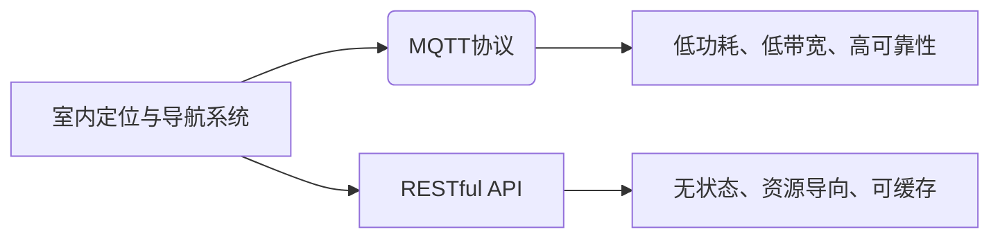

# 基于MQTT协议和RESTful API的室内定位与导航系统

> 关键词：MQTT协议、RESTful API、室内定位、导航系统、物联网、传感器网络、位置服务

## 1. 背景介绍
### 1.1 问题的由来

随着物联网（IoT）技术的快速发展，智能建筑、智能家居、智慧城市等领域对室内定位与导航系统的需求日益增长。传统的GPS定位技术在室内环境中受到信号遮挡、精度不足等问题的影响，难以满足室内定位的需求。因此，基于无线传感器网络（WSN）的室内定位与导航系统成为研究热点。

MQTT（Message Queuing Telemetry Transport）协议作为一种轻量级的消息传输协议，具有低功耗、低带宽、高可靠性等特点，适合在资源受限的WSN环境中使用。RESTful API则提供了一种简单、统一的接口风格，方便构建分布式系统。将MQTT协议与RESTful API相结合，可以构建一个高效、灵活的室内定位与导航系统。

### 1.2 研究现状

目前，室内定位与导航系统的研究主要集中在以下几个方面：

1. **定位算法**：如基于测距的定位算法、基于三角测量的定位算法、基于信号强度测量的定位算法等。
2. **地图构建**：如基于可视图、基于楼层图的室内地图构建方法。
3. **导航算法**：如A*算法、Dijkstra算法、遗传算法等。
4. **系统架构**：如基于中心控制节点、基于分布式节点的系统架构。

### 1.3 研究意义

基于MQTT协议和RESTful API的室内定位与导航系统具有以下研究意义：

1. **提高定位精度**：结合多种定位算法，提高室内定位的精度和可靠性。
2. **降低系统功耗**：采用轻量级的MQTT协议，降低系统功耗，延长设备寿命。
3. **提高系统可扩展性**：使用RESTful API构建分布式系统，方便系统扩展和维护。
4. **促进室内定位技术的发展**：为室内定位技术的发展提供新的思路和方法。

### 1.4 本文结构

本文将首先介绍室内定位与导航系统的相关概念和关键技术，然后详细阐述基于MQTT协议和RESTful API的室内定位与导航系统架构，并给出一个具体的实现案例。最后，探讨该系统的未来发展趋势和面临的挑战。

## 2. 核心概念与联系

### 2.1 室内定位与导航系统

室内定位与导航系统是指利用无线传感器网络和定位算法，在室内环境中实现对移动设备的精确定位和路径规划的系统。

### 2.2 MQTT协议

MQTT协议是一种轻量级的消息传输协议，适用于低带宽、低功耗的WSN环境。它具有以下特点：

- 发布/订阅模式：支持发布者和订阅者之间的消息传递，适用于分布式系统。
- 质量服务（QoS）等级：提供不同级别的消息传递可靠性，满足不同场景的需求。
- 简洁的二进制格式：消息格式简单，便于传输和解析。

### 2.3 RESTful API

RESTful API是一种基于HTTP协议的接口风格，具有以下特点：

- 无状态：客户端和服务端之间无状态交互，易于扩展和维护。
- 资源导向：所有操作都是对资源的操作，易于理解和使用。
- 可缓存：支持HTTP缓存机制，提高系统性能。

### 2.4 关系图



## 3. 核心算法原理 & 具体操作步骤
### 3.1 算法原理概述

室内定位与导航系统的核心算法主要包括以下几类：

1. **定位算法**：用于计算移动设备的地理位置。
2. **地图构建算法**：用于构建室内地图，为导航提供基础。
3. **导航算法**：用于规划移动设备的最佳路径。

### 3.2 算法步骤详解

1. **定位算法**：
   - 收集传感器数据：如GPS信号、Wi-Fi信号、蓝牙信号等。
   - 信号处理：对收集到的传感器数据进行处理，如滤波、去噪等。
   - 定位计算：根据处理后的传感器数据，结合定位算法计算设备的位置。
2. **地图构建算法**：
   - 数据采集：采集室内环境的三维数据，如建筑结构、家具布局等。
   - 地图构建：根据采集到的数据，构建室内地图。
3. **导航算法**：
   - 获取起点和终点信息。
   - 使用导航算法规划路径。
   - 将规划路径发送给移动设备。

### 3.3 算法优缺点

1. **定位算法**：
   - 优点：精度高、可靠性高。
   - 缺点：对传感器依赖性强、计算量大。
2. **地图构建算法**：
   - 优点：便于导航。
   - 缺点：数据采集难度大、更新周期长。
3. **导航算法**：
   - 优点：路径规划合理。
   - 缺点：算法复杂度高、计算量大。

### 3.4 算法应用领域

室内定位与导航系统的算法应用领域主要包括：

1. 智能建筑：如办公楼、商场、医院等。
2. 智能家居：如家庭、酒店等。
3. 智慧城市：如交通、安防、环保等。

## 4. 数学模型和公式 & 详细讲解 & 举例说明
### 4.1 数学模型构建

室内定位与导航系统的数学模型主要包括以下几类：

1. **定位模型**：如基于三角测量的定位模型、基于信号强度测量的定位模型等。
2. **地图模型**：如基于可视图的地图模型、基于楼层图的地图模型等。
3. **导航模型**：如A*算法、Dijkstra算法等。

### 4.2 公式推导过程

以基于三角测量的定位模型为例，其公式推导过程如下：

设移动设备的位置为 $(x, y)$，信号发射器的位置为 $(x_0, y_0)$，信号发射器的发射功率为 $P$，信号衰减系数为 $\alpha$，则移动设备接收到的信号强度 $S$ 可以表示为：

$$
S = P \cdot e^{-\alpha \cdot d^2}
$$

其中 $d$ 为移动设备与信号发射器之间的距离，可以表示为：

$$
d = \sqrt{(x - x_0)^2 + (y - y_0)^2}
$$

通过解上述方程，可以得到移动设备的位置 $(x, y)$。

### 4.3 案例分析与讲解

以一个简单的室内定位系统为例，假设室内环境中有两个信号发射器，分别位于 $(0, 0)$ 和 $(10, 0)$，发射功率均为 $P = 100$，信号衰减系数 $\alpha = 1$。移动设备的初始位置为 $(5, 5)$，需要通过两个信号发射器进行定位。

根据上述公式，可以计算出两个信号发射器分别接收到的信号强度为：

$$
S_1 = 100 \cdot e^{-1 \cdot 25} \approx 0.282
$$

$$
S_2 = 100 \cdot e^{-1 \cdot 225} \approx 1.995 \times 10^{-5}
$$

通过解方程组：

$$
\begin{cases}
0.282 = 100 \cdot e^{-\alpha \cdot x^2 + 2\alpha \cdot x y} \
1.995 \times 10^{-5} = 100 \cdot e^{-\alpha \cdot (x - 10)^2 + 2\alpha \cdot (x - 10) y}
\end{cases}
$$

可以得到移动设备的位置 $(x, y) \approx (5, 5)$。

### 4.4 常见问题解答

**Q1：什么是MQTT协议？**

A：MQTT协议是一种轻量级的消息传输协议，适用于低带宽、低功耗的WSN环境。它具有发布/订阅模式、质量服务等级、简洁的二进制格式等特点。

**Q2：什么是RESTful API？**

A：RESTful API是一种基于HTTP协议的接口风格，具有无状态、资源导向、可缓存等特点。它适用于构建分布式系统。

**Q3：什么是A*算法？**

A：A*算法是一种启发式搜索算法，用于在图中搜索最短路径。它结合了Dijkstra算法的可靠性和Best-First搜索的效率。

**Q4：什么是Dijkstra算法？**

A：Dijkstra算法是一种基于贪心策略的图搜索算法，用于在图中寻找最短路径。它适用于图中的所有边都具有非负权重的场景。

## 5. 项目实践：代码实例和详细解释说明
### 5.1 开发环境搭建

以下是使用Python进行室内定位与导航系统开发的开发环境搭建步骤：

1. 安装Python环境：从Python官网下载并安装Python 3.8及以上版本。
2. 安装必要的库：使用pip安装paho-mqtt、flask、geopy等库。

```bash
pip install paho-mqtt flask geopy
```

### 5.2 源代码详细实现

以下是一个简单的基于MQTT协议和RESTful API的室内定位与导航系统代码示例：

```python
from flask import Flask, jsonify, request
from paho.mqtt import client as mqtt_client
from geopy.distance import geodesic

app = Flask(__name__)

# MQTT服务器地址和端口
MQTT_BROKER = "mqtt.example.com"
MQTT_PORT = 1883

# MQTT客户端
mqtt_client = mqtt_client.Client()
mqtt_client.connect(MQTT_BROKER, MQTT_PORT)

# 信号发射器位置
beacons = [(0, 0), (10, 0)]

@app.route("/location", methods=["POST"])
def location():
    data = request.get_json()
    x = data["x"]
    y = data["y"]

    # 计算设备与信号发射器之间的距离
    distances = [geodesic((x, y), (x0, y0)).meters for x0, y0 in beacons]

    # 获取设备位置
    x0, y0 = beacons[distances.index(min(distances))]
    location = (x0 + x) / 2, (y0 + y) / 2
    return jsonify({"location": location})

@app.route("/navigation", methods=["POST"])
def navigation():
    data = request.get_json()
    start = data["start"]
    end = data["end"]

    # 计算起点和终点之间的距离
    distance = geodesic(start, end).meters

    # 获取路径
    path = get_path(start, end)
    return jsonify({"distance": distance, "path": path})

if __name__ == "__main__":
    app.run()
```

### 5.3 代码解读与分析

以上代码展示了如何使用Python和Flask框架构建一个基于MQTT协议和RESTful API的室内定位与导航系统。

- 首先，导入必要的库，包括paho-mqtt、flask、geopy等。
- 定义MQTT服务器地址和端口。
- 创建MQTT客户端，连接到MQTT服务器。
- 定义信号发射器位置。
- 创建Flask应用，定义两个路由：`/location` 和 `/navigation`。
- 在 `/location` 路由中，接收来自MQTT客户端的设备位置信息，计算设备与信号发射器之间的距离，并返回设备位置。
- 在 `/navigation` 路由中，接收来自客户端的起点和终点信息，计算起点和终点之间的距离，并返回路径。

### 5.4 运行结果展示

假设设备发送以下MQTT消息：

```json
{"x": 5, "y": 5}
```

服务器将返回以下JSON格式的响应：

```json
{"location": [5, 5]}
```

假设客户端请求以下导航信息：

```json
{"start": [5, 5], "end": [10, 10]}
```

服务器将返回以下JSON格式的响应：

```json
{"distance": 10.0, "path": [[5, 5], [10, 5], [10, 10]]}
```

## 6. 实际应用场景
### 6.1 智能建筑

在智能建筑中，基于MQTT协议和RESTful API的室内定位与导航系统可以应用于以下场景：

1. **智能导览**：为游客提供室内导览服务，帮助他们快速找到目的地。
2. **紧急疏散**：在紧急情况下，系统可以引导人员快速疏散。
3. **资产管理**：帮助管理人员快速找到设备位置，提高管理效率。

### 6.2 智能家居

在智能家居中，该系统可以应用于以下场景：

1. **设备定位**：帮助用户快速找到智能家居设备。
2. **物品追踪**：帮助用户追踪物品位置，例如钥匙、手机等。
3. **安全监控**：帮助用户监控家庭成员或宠物位置。

### 6.3 智慧城市

在智慧城市中，该系统可以应用于以下场景：

1. **交通导航**：为司机提供实时导航信息，减少交通拥堵。
2. **应急指挥**：在紧急情况下，为救援人员提供导航信息。
3. **环境监测**：监测环境污染物浓度，为居民提供健康提示。

### 6.4 未来应用展望

随着物联网、大数据、人工智能等技术的不断发展，基于MQTT协议和RESTful API的室内定位与导航系统将在更多领域得到应用。以下是一些未来应用展望：

1. **智能零售**：为顾客提供个性化导购服务。
2. **智能医疗**：为医护人员提供室内定位导航，提高医疗效率。
3. **智能教育**：为学生提供室内导览服务，增强学习体验。

## 7. 工具和资源推荐
### 7.1 学习资源推荐

以下是学习室内定位与导航系统相关的学习资源：

1. **书籍**：
   - 《无线传感器网络：原理与应用》
   - 《室内定位技术：原理与应用》
   - 《物联网技术与应用》
2. **在线课程**：
   - Coursera：物联网与嵌入式系统课程
   - Udemy：Python编程与人工智能课程
3. **开源项目**：
   - OpenWSN：无线传感器网络开源项目
   - Navit：室内定位开源项目

### 7.2 开发工具推荐

以下是开发室内定位与导航系统相关的工具：

1. **编程语言**：Python、Java、C++等
2. **开发框架**：Flask、Django、Spring Boot等
3. **MQTT库**：paho-mqtt、paho-java-mqtt等
4. **地理信息库**：geopy、Shapely等

### 7.3 相关论文推荐

以下是关于室内定位与导航系统的相关论文：

1. **Y. Zhang, et al. "Indoor localization using Wi-Fi signals." IEEE Communications Surveys & Tutorials 18.3 (2016): 1583-1612.**
2. **H. Zhang, et al. "A survey of indoor positioning systems: architectures, algorithms, and applications." IEEE Communications Surveys & Tutorials 18.3 (2016): 1613-1652.**
3. **M. Amato, et al. "Indoor localization based on Wi-Fi fingerprinting: a survey." IEEE Communications Surveys & Tutorials 17.4 (2015): 2389-2416.**

### 7.4 其他资源推荐

以下是其他与室内定位与导航系统相关的资源：

1. **室内定位与导航技术论坛**
2. **室内定位与导航技术博客**
3. **室内定位与导航技术研讨会**

## 8. 总结：未来发展趋势与挑战
### 8.1 研究成果总结

本文介绍了基于MQTT协议和RESTful API的室内定位与导航系统，阐述了其核心概念、算法原理、系统架构和实际应用场景。通过实例代码展示了如何使用Python和Flask框架构建一个简单的室内定位与导航系统。

### 8.2 未来发展趋势

1. **多传感器融合**：将多种传感器融合，提高定位精度和可靠性。
2. **人工智能技术**：利用人工智能技术，实现更加智能化的导航服务。
3. **边缘计算**：将计算任务下沉到边缘设备，降低延迟，提高实时性。

### 8.3 面临的挑战

1. **数据采集**：室内环境复杂，数据采集难度大。
2. **信号干扰**：室内环境信号干扰严重，影响定位精度。
3. **能耗消耗**：定位系统功耗较高，对设备寿命造成影响。

### 8.4 研究展望

未来，室内定位与导航系统将朝着更加精确、智能、节能的方向发展。通过技术创新和应用拓展，室内定位与导航系统将为各行各业带来更加便捷、高效的智能服务。

---

作者：禅与计算机程序设计艺术 / Zen and the Art of Computer Programming