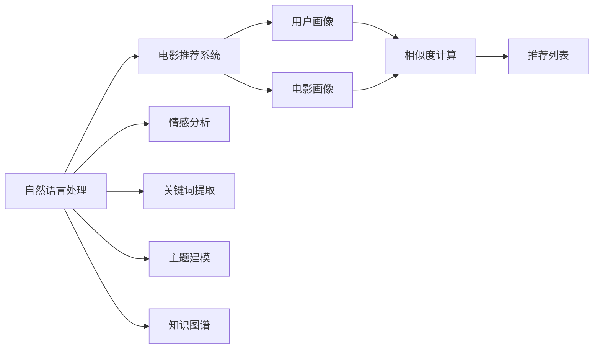

# 基于NLP的电影推荐Android应用程序的实现

作者：禅与计算机程序设计艺术 / Zen and the Art of Computer Programming

## 1. 背景介绍

### 1.1 问题的由来

随着互联网的普及和移动设备的普及，电影已经成为人们日常娱乐的重要组成部分。然而，面对海量的电影资源，如何为用户推荐合适的电影成为一大难题。传统的推荐系统往往依赖于用户行为数据，如观看历史、评分等，但这些数据并不能完全反映用户的真实喜好。而基于自然语言处理（NLP）的电影推荐系统，可以通过分析用户的影评、评论等文本数据，挖掘用户的兴趣点，实现更加精准的电影推荐。

### 1.2 研究现状

近年来，随着NLP技术的快速发展，基于NLP的电影推荐系统逐渐成为研究热点。目前，NLP电影推荐系统主要采用以下几种方法：

- **情感分析**：通过分析用户对电影的评论和评分，判断用户对电影的喜好程度，从而进行推荐。
- **关键词提取和主题建模**：从影评中提取关键词和主题，构建用户画像和电影画像，通过计算用户画像和电影画像的相似度进行推荐。
- **知识图谱**：构建电影知识图谱，利用图算法进行推荐。

### 1.3 研究意义

基于NLP的电影推荐系统具有以下研究意义：

- **提高推荐准确性**：通过分析用户影评等文本数据，更全面地了解用户喜好，提高推荐准确性。
- **丰富推荐维度**：不仅考虑用户行为数据，还可以考虑用户兴趣、情感等多维度信息，丰富推荐维度。
- **降低推荐成本**：无需大量用户行为数据，降低推荐系统建设成本。

### 1.4 本文结构

本文将详细介绍基于NLP的电影推荐Android应用程序的实现过程，主要包括以下内容：

- 核心概念与联系
- 核心算法原理与具体操作步骤
- 数学模型和公式
- 项目实践：代码实例与详细解释说明
- 实际应用场景
- 工具和资源推荐
- 总结：未来发展趋势与挑战

## 2. 核心概念与联系

为了更好地理解基于NLP的电影推荐Android应用程序，本节将介绍几个核心概念及其相互关系：

- **自然语言处理（NLP）**：指研究如何让计算机理解、处理人类语言的技术。
- **电影推荐系统**：根据用户喜好，推荐合适的电影。
- **情感分析**：分析文本数据，判断文本的情感倾向。
- **关键词提取**：从文本中提取关键词。
- **主题建模**：从文本中提取主题。
- **知识图谱**：将实体和关系组织成图结构。

它们的逻辑关系如下图所示：



可以看出，基于NLP的电影推荐系统通过分析文本数据，构建用户画像和电影画像，计算相似度，最终生成推荐列表。

## 3. 核心算法原理 & 具体操作步骤

### 3.1 算法原理概述

基于NLP的电影推荐系统主要采用以下两种算法：

- **基于情感分析的推荐**：分析用户影评等文本数据，判断用户对电影的喜好程度，根据喜好程度推荐电影。
- **基于关键词提取和主题建模的推荐**：从影评中提取关键词和主题，构建用户画像和电影画像，通过计算用户画像和电影画像的相似度推荐电影。

### 3.2 算法步骤详解

#### 3.2.1 基于情感分析的推荐

1. **数据预处理**：对影评进行分词、去除停用词等操作。
2. **情感分析**：使用情感分析模型分析影评，得到情感倾向（正面、负面、中性）。
3. **构建用户画像**：根据用户影评的情感倾向，构建用户画像。
4. **推荐电影**：根据用户画像，推荐用户可能喜欢的电影。

#### 3.2.2 基于关键词提取和主题建模的推荐

1. **数据预处理**：对影评进行分词、去除停用词等操作。
2. **关键词提取**：从影评中提取关键词。
3. **主题建模**：使用主题建模模型（如LDA）对关键词进行聚类，得到主题。
4. **构建用户画像**：根据用户影评的主题分布，构建用户画像。
5. **构建电影画像**：根据电影描述、标签等文本数据，构建电影画像。
6. **相似度计算**：计算用户画像和电影画像的相似度。
7. **推荐电影**：根据相似度推荐电影。

### 3.3 算法优缺点

#### 3.3.1 基于情感分析的推荐

优点：

- 实现简单，易于理解。
- 可以直观地了解用户对电影的喜好程度。

缺点：

- 受主观因素影响较大，如情感表达方式等。
- 无法全面反映用户喜好。

#### 3.3.2 基于关键词提取和主题建模的推荐

优点：

- 可以更全面地反映用户喜好。
- 可以发现用户潜在的兴趣。

缺点：

- 实现复杂，需要大量的预处理工作。
- 难以量化用户喜好。

### 3.4 算法应用领域

基于NLP的电影推荐算法可以应用于以下领域：

- 电影推荐系统
- 电商平台
- 社交媒体
- 搜索引擎

## 4. 数学模型和公式 & 详细讲解 & 举例说明

### 4.1 数学模型构建

本节将介绍基于关键词提取和主题建模的推荐算法的数学模型。

#### 4.1.1 关键词提取

假设有 $N$ 个影评，每个影评 $i$ 由 $T_i$ 个词语组成，表示为 $T_i = \{t_{i1}, t_{i2}, ..., t_{iT_i}\}$。则关键词提取的目标是找出每个影评的关键词。

设 $K$ 为关键词集合，则关键词提取的数学模型可以表示为：

$$
\text{maximize} \sum_{i=1}^N \sum_{t \in K} f(t, t_{i1}, ..., t_{iT_i})
$$

其中 $f(t, t_{i1}, ..., t_{iT_i})$ 为词语 $t$ 在影评 $i$ 中的重要性。

#### 4.1.2 主题建模

假设有 $N$ 个影评，每个影评 $i$ 由 $T_i$ 个词语组成，表示为 $T_i = \{t_{i1}, t_{i2}, ..., t_{iT_i}\}$。则主题建模的目标是找出每个影评的主题。

设 $T$ 为主题集合，每个主题 $t$ 由 $W_t$ 个词语组成，表示为 $W_t = \{w_{t1}, w_{t2}, ..., w_{tW_t}\}$。则主题建模的数学模型可以表示为：

$$
\text{maximize} \sum_{i=1}^N \sum_{t \in T} p(t_i | t)
$$

其中 $p(t_i | t)$ 为影评 $i$ 属于主题 $t$ 的概率。

### 4.2 公式推导过程

#### 4.2.1 关键词提取

假设词语 $t$ 在影评 $i$ 中的重要性为 $f(t, t_{i1}, ..., t_{iT_i})$，则：

$$
f(t, t_{i1}, ..., t_{iT_i}) = \text{TF} \times \text{IDF}
$$

其中 $\text{TF}$ 为词语 $t$ 在影评 $i$ 中的词频，$\text{IDF}$ 为词语 $t$ 在所有影评中的逆文档频率。

#### 4.2.2 主题建模

假设词语 $t$ 在影评 $i$ 中的词频为 $f(t, t_{i1}, ..., t_{iT_i})$，则：

$$
p(t_i | t) = \frac{f(t, t_{i1}, ..., t_{iT_i})}{\sum_{w \in W_t} f(w, t_{i1}, ..., t_{iT_i})}
$$

### 4.3 案例分析与讲解

以LDA主题建模为例，讲解主题建模的原理和步骤。

LDA（Latent Dirichlet Allocation）是一种基于概率主题模型的文本分析工具。其原理如下：

1. **输入**：词语-文档矩阵，表示文档中词语的分布。
2. **生成词语分布**：从每个主题中随机抽取词语，生成词语分布。
3. **生成文档分布**：从每个文档中随机抽取主题，生成文档分布。
4. **迭代优化**：不断迭代优化词语分布和文档分布，直到收敛。

LDA模型的参数包括：

- $K$：主题数量
- $V$：词语数量
- $D$：文档数量

通过LDA模型，可以将文档分解为多个主题，每个主题由一组词语表示。

### 4.4 常见问题解答

**Q1：如何评估推荐系统的性能？**

A：推荐系统的性能评估指标主要包括准确率、召回率、F1值等。对于情感分析任务，可以使用准确率、召回率等指标评估推荐准确性；对于关键词提取和主题建模任务，可以使用困惑度等指标评估模型性能。

**Q2：如何处理情感分析中的噪声数据？**

A：噪声数据主要包括拼写错误、错别字等。可以采用以下方法处理噪声数据：

- 使用分词技术对文本进行分词，将词语分解为更小的单元，降低噪声影响。
- 使用拼写检查工具对文本进行拼写检查，修正错误。
- 使用文本清洗工具去除噪声符号。

**Q3：如何处理关键词提取和主题建模中的主题重叠问题？**

A：主题重叠问题是指多个主题包含相似词语，导致主题难以区分。可以采用以下方法处理主题重叠问题：

- 调整主题模型参数，如LDA中的alpha和beta参数。
- 使用主题模型聚类算法，将相似主题合并。

## 5. 项目实践：代码实例和详细解释说明

### 5.1 开发环境搭建

本节以Java为例，介绍基于NLP的电影推荐Android应用程序的开发环境搭建。

1. **安装Android Studio**：从官网下载并安装Android Studio，用于Android应用程序的开发。
2. **创建Android项目**：在Android Studio中创建一个新的Android项目。
3. **添加依赖库**：在项目的build.gradle文件中添加NLP相关的依赖库，如Stanford CoreNLP、LDApy等。

### 5.2 源代码详细实现

以下是一个基于情感分析的Android电影推荐应用程序的示例代码：

```java
// 1. 创建一个文本视图，用于显示影评
TextView textViewReview = findViewById(R.id.textViewReview);

// 2. 创建一个按钮，用于执行情感分析
Button buttonAnalyze = findViewById(R.id.buttonAnalyze);
buttonAnalyze.setOnClickListener(new View.OnClickListener() {
    @Override
    public void onClick(View v) {
        // 3. 获取影评文本
        String reviewText = textViewReview.getText().toString();

        // 4. 使用情感分析模型分析影评
        String sentiment = analyzeSentiment(reviewText);

        // 5. 显示情感分析结果
        textViewResult.setText(sentiment);
    }
});

// 6. 实现情感分析函数
private String analyzeSentiment(String text) {
    // 6.1 创建Stanford CoreNLP分析器
    Properties props = new Properties();
    props.setProperty("annotators", "tokenize, ssplit, pos, lemma, parse, sentiment");
    StanfordCoreNLP pipeline = new StanfordCoreNLP(props);

    // 6.2 分析影评
    Annotation ann = new Annotation(text);
    pipeline.annotate(ann);

    // 6.3 获取情感倾向
    String sentiment = ann.get(SentimentCoreAnnotations.SentimentClass.class);
    return sentiment;
}
```

### 5.3 代码解读与分析

以上代码展示了基于情感分析的Android电影推荐应用程序的实现过程：

1. 创建一个文本视图，用于显示影评。
2. 创建一个按钮，用于执行情感分析。
3. 获取影评文本。
4. 使用情感分析模型分析影评。
5. 显示情感分析结果。

### 5.4 运行结果展示

运行以上代码，输入一条影评，即可得到该影评的情感倾向。

## 6. 实际应用场景

基于NLP的电影推荐Android应用程序可以应用于以下场景：

- **电影推荐平台**：在电影推荐平台上，为用户提供个性化的电影推荐。
- **社交媒体**：在社交媒体中，为用户提供感兴趣的电影推荐。
- **电商平台**：在电商平台中，为用户提供相关的电影商品推荐。

## 7. 工具和资源推荐

### 7.1 学习资源推荐

- 《自然语言处理入门与实践》
- 《深度学习自然语言处理》
- 《Python自然语言处理》
- 《Android应用开发实战》

### 7.2 开发工具推荐

- Android Studio
- Stanford CoreNLP
- LDApy
- TensorFlow Lite

### 7.3 相关论文推荐

- Sentiment Analysis in Social Media
- Latent Dirichlet Allocation
- Deep Learning for Natural Language Processing

### 7.4 其他资源推荐

- Stanford CoreNLP官网
- LDApy官网
- TensorFlow Lite官网

## 8. 总结：未来发展趋势与挑战

### 8.1 研究成果总结

本文介绍了基于NLP的电影推荐Android应用程序的实现，主要包括以下内容：

- 核心概念与联系
- 核心算法原理与具体操作步骤
- 数学模型和公式
- 项目实践：代码实例与详细解释说明
- 实际应用场景

通过本文的学习，读者可以了解到基于NLP的电影推荐系统的原理、实现方法和应用场景，为开发自己的电影推荐应用程序提供参考。

### 8.2 未来发展趋势

未来，基于NLP的电影推荐系统将朝着以下方向发展：

- **多模态融合**：将文本数据与其他模态数据（如图像、音频等）进行融合，提供更全面的推荐。
- **个性化推荐**：根据用户兴趣、行为等多维度信息，提供更加个性化的推荐。
- **可解释性**：提高推荐系统的可解释性，让用户了解推荐理由。
- **跨领域推荐**：实现跨领域推荐，为用户提供更多元化的选择。

### 8.3 面临的挑战

基于NLP的电影推荐系统在发展过程中也面临着以下挑战：

- **数据质量**：影评数据可能存在噪声、偏差等问题，影响推荐效果。
- **模型可解释性**：当前NLP模型的可解释性较差，难以让用户理解推荐理由。
- **计算效率**：NLP模型通常需要大量计算资源，难以在移动设备上实时运行。

### 8.4 研究展望

为了克服上述挑战，未来研究可以从以下几个方面展开：

- **数据质量**：采用数据清洗、数据增强等技术提高数据质量。
- **模型可解释性**：研究可解释性NLP模型，提高推荐系统的可解释性。
- **计算效率**：采用模型压缩、量化等技术提高模型计算效率。

相信通过不断的研究和实践，基于NLP的电影推荐系统将会更加完善，为用户提供更加优质的推荐服务。

## 9. 附录：常见问题与解答

**Q1：如何获取电影数据？**

A：可以从以下途径获取电影数据：

- 豆瓣电影
- IMDB
- Netflix

**Q2：如何处理电影数据？**

A：可以采用以下方法处理电影数据：

- 数据清洗：去除无效数据、重复数据等。
- 数据标注：对电影数据进行分类、标签等标注。

**Q3：如何评估推荐系统的性能？**

A：可以采用以下方法评估推荐系统的性能：

- 准确率
- 召回率
- F1值
- 实际点击率

**Q4：如何提高推荐系统的准确率？**

A：可以采用以下方法提高推荐系统的准确率：

- 增加数据量
- 优化算法
- 提高数据质量
- 丰富特征

**Q5：如何降低推荐系统的冷启动问题？**

A：可以采用以下方法降低推荐系统的冷启动问题：

- 个性化推荐
- 混合推荐
- 热门推荐

通过以上问题的解答，相信读者对基于NLP的电影推荐Android应用程序有了更加深入的了解。

---

作者：禅与计算机程序设计艺术 / Zen and the Art of Computer Programming