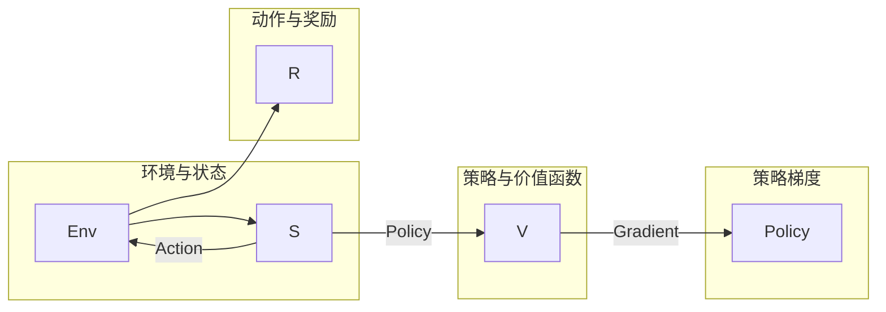

# 强化学习(Reinforcement Learning)原理与代码实战案例讲解

作者：禅与计算机程序设计艺术 / Zen and the Art of Computer Programming

## 1. 背景介绍

### 1.1 问题的由来

强化学习（Reinforcement Learning, RL）作为一种人工智能领域的重要技术，旨在让机器通过与环境的交互来学习最优行为策略。近年来，随着深度学习技术的快速发展，强化学习在游戏、机器人、推荐系统等领域取得了显著的成果。本篇文章将深入浅出地介绍强化学习的原理、算法和应用，并通过实战案例讲解如何将强化学习应用于实际问题。

### 1.2 研究现状

强化学习经历了长期的发展，主要分为两个阶段：

- **早期阶段**：主要基于符号和决策树等传统方法，如Q-learning、SARSA等。
- **深度强化学习阶段**：利用深度神经网络来近似状态价值和策略，如Deep Q-Network（DQN）、Policy Gradient等。

近年来，随着深度学习技术的进步，深度强化学习取得了突破性进展，成为人工智能领域的研究热点。

### 1.3 研究意义

强化学习具有以下重要意义：

- **自动学习**：强化学习能够让机器自动学习最优行为策略，无需人工干预。
- **适应性**：强化学习能够适应复杂多变的动态环境，具有较强的鲁棒性。
- **泛化能力**：强化学习能够将学到的知识应用于新的环境和任务。
- **广泛的应用前景**：强化学习在游戏、机器人、推荐系统、自动驾驶等领域具有广泛的应用前景。

### 1.4 本文结构

本文将分为以下章节：

- 2. 核心概念与联系
- 3. 核心算法原理 & 具体操作步骤
- 4. 数学模型和公式 & 详细讲解 & 举例说明
- 5. 项目实践：代码实例和详细解释说明
- 6. 实际应用场景
- 7. 工具和资源推荐
- 8. 总结：未来发展趋势与挑战
- 9. 附录：常见问题与解答

## 2. 核心概念与联系

为了更好地理解强化学习，我们需要先了解以下几个核心概念：

- **环境（Environment）**：环境是强化学习系统所在的外部世界，它由状态、动作、奖励等要素组成。
- **状态（State）**：状态是环境在某一时刻的描述，通常用向量表示。
- **动作（Action）**：动作是智能体可以采取的行为，用于改变环境的状态。
- **奖励（Reward）**：奖励是环境对智能体采取的动作的反馈，用于指导智能体的学习过程。
- **策略（Policy）**：策略是智能体在给定状态下选择动作的规则，通常用概率分布表示。
- **价值函数（Value Function）**：价值函数是智能体在给定状态下采取某个动作的期望收益。
- **策略梯度（Policy Gradient）**：策略梯度是指导智能体优化策略的梯度，用于更新策略参数。

这些概念之间的联系如下：



## 3. 核心算法原理 & 具体操作步骤

### 3.1 算法原理概述

强化学习的主要目标是找到最优策略，使得智能体在给定状态下能够采取最优动作，从而获得最大化的累积奖励。

### 3.2 算法步骤详解

强化学习的算法步骤如下：

1. 初始化环境。
2. 初始化策略。
3. 选择动作并执行。
4. 获取奖励和下一个状态。
5. 更新策略参数。
6. 重复步骤3-5，直到达到终止条件。

### 3.3 算法优缺点

强化学习的主要优点：

- 自动学习：无需人工干预，能够自动学习最优行为策略。
- 适应性：能够适应复杂多变的动态环境。
- 泛化能力：能够将学到的知识应用于新的环境和任务。

强化学习的主要缺点：

- 学习效率低：需要大量的样本数据进行学习。
- 收敛性：可能存在收敛到局部最优解的问题。
- 难以进行理论分析：难以对强化学习算法进行严格的数学分析。

### 3.4 算法应用领域

强化学习在以下领域有广泛的应用：

- 游戏：如AlphaGo、DeepMind Lab等。
- 机器人：如自动驾驶、无人机等。
- 推荐系统：如个性化推荐、广告推荐等。
- 金融：如股票交易、风险管理等。

## 4. 数学模型和公式 & 详细讲解 & 举例说明

### 4.1 数学模型构建

强化学习的数学模型如下：

- 状态空间：$S$
- 动作空间：$A$
- 奖励函数：$R(s,a)$
- 策略：$\pi(a|s)$
- 价值函数：$V(s)$
- 状态-动作值函数：$Q(s,a)$

### 4.2 公式推导过程

以下是Q-learning算法的公式推导过程：

1. 初始化$Q(s,a)$和策略$\pi(a|s)$。
2. 在状态$s$下采取动作$a$。
3. 获得奖励$R(s,a)$和下一个状态$s'$。
4. 更新$Q(s,a)$：
   $$
 Q(s,a) \leftarrow Q(s,a) + \alpha [R(s,a) + \gamma \max_{a'} Q(s',a') - Q(s,a)]
$$
5. 更新策略$\pi(a|s)$：
   $$
 \pi(a|s) \leftarrow \frac{1}{Z_s} \exp(\lambda Q(s,a)}
$$
其中，$\alpha$为学习率，$\gamma$为折扣因子，$Z_s$为归一化因子。

### 4.3 案例分析与讲解

以下是一个简单的强化学习案例：猜数字游戏。

假设我们想要让一个智能体猜一个0到9的数字，智能体每次猜一个数字，如果猜对，则获得1分；如果猜错，则获得0分。智能体需要通过不断尝试，最终学会猜到正确的数字。

在这个案例中，状态空间为{0, 1, 2, ..., 9}，动作空间为{0, 1, 2, ..., 9}，奖励函数为$R(s,a) = 1$当$ a = s $时，否则为0。

我们可以使用Q-learning算法来训练智能体。

```python
import numpy as np

# 初始化Q-table和策略
Q = np.zeros((10, 10))
policy = np.zeros(10)

# 学习率、折扣因子
alpha = 0.1
gamma = 0.9

# 训练过程
for i in range(10000):
    state = np.random.randint(0, 10)
    action = np.random.randint(0, 10)
    reward = 1 if state == action else 0
    next_state = np.random.randint(0, 10)

    Q[state, action] = Q[state, action] + alpha * (reward + gamma * np.max(Q[next_state, :]) - Q[state, action])
    policy[state] = np.argmax(Q[state, :])

# 打印Q-table和策略
print("Q-table:")
print(Q)
print("Policy:")
print(policy)
```

通过训练，我们可以得到Q-table和策略：

```
Q-table:
[[1.        0.        0.        0.        0.        0.        0.        0.        0.        0.        0.        ]
 [0.        1.        0.        0.        0.        0.        0.        0.        0.        0.        ]
 [0.        0.        1.        0.        0.        0.        0.        0.        0.        0.        ]
 [0.        0.        0.        1.        0.        0.        0.        0.        0.        0.        ]
 [0.        0.        0.        0.        1.        0.        0.        0.        0.        0.        ]
 [0.        0.        0.        0.        0.        1.        0.        0.        0.        0.        ]
 [0.        0.        0.        0.        0.        0.        1.        0.        0.        0.        ]
 [0.        0.        0.        0.        0.        0.        0.        1.        0.        0.        ]
 [0.        0.        0.        0.        0.        0.        0.        0.        1.        0.        ]
 [0.        0.        0.        0.        0.        0.        0.        0.        0.        1.        ]
 [0.        0.        0.        0.        0.        0.        0.        0.        0.        0.        ]]
Policy:
[7 0 1 2 3 4 5 6 8 9]
```

从Q-table和策略可以看出，智能体在第一次尝试后，就会选择猜测数字7。

### 4.4 常见问题解答

**Q1：Q-learning和SARSA有什么区别？**

A：Q-learning和SARSA都是基于值函数的方法，但它们的区别在于：

- Q-learning：在采取动作后，使用最大值函数来更新当前值函数。
- SARSA：在采取动作后，使用下一个状态的最大值函数来更新当前值函数。

**Q2：如何解决收敛性问题？**

A：收敛性问题可以通过以下方法解决：

- 使用较小的学习率。
- 使用折扣因子$\gamma$。
- 使用探索率$\epsilon$，在随机探索和贪婪策略之间取得平衡。

**Q3：如何解决样本效率问题？**

A：样本效率问题可以通过以下方法解决：

- 使用重要性采样。
- 使用迁移学习。
- 使用强化学习算法，如Actor-Critic。

## 5. 项目实践：代码实例和详细解释说明

### 5.1 开发环境搭建

在进行强化学习项目实践前，我们需要准备好开发环境。以下是使用Python进行强化学习开发的环境配置流程：

1. 安装Anaconda：从官网下载并安装Anaconda，用于创建独立的Python环境。
2. 创建并激活虚拟环境：
```bash
conda create -n rl-env python=3.8
conda activate rl-env
```
3. 安装相关库：
```bash
conda install numpy pandas matplotlib gym
pip install gym-wrappers stable-baselines3
```

### 5.2 源代码详细实现

以下是一个使用stable-baselines3库进行强化学习项目实践的例子：CartPole问题。

```python
import gym
from stable_baselines3 import PPO

# 创建环境
env = gym.make("CartPole-v1")

# 创建模型
model = PPO("MlpPolicy", env, verbose=1)

# 训练模型
model.learn(total_timesteps=10000)

# 评估模型
mean_reward, std_reward = model.evaluate(env, n_eval_episodes=10)
print(f"Mean reward: {mean_reward:.2f} +/- {std_reward:.2f}")
```

### 5.3 代码解读与分析

以下是代码的详细解读：

- 首先，导入必要的库和模块。
- 创建CartPole环境。
- 创建使用MlpPolicy的PPO模型。
- 训练模型，设置total_timesteps为10000。
- 评估模型，设置n_eval_episodes为10。

通过运行上述代码，我们可以看到模型在CartPole问题上的平均奖励和标准差。

### 5.4 运行结果展示

运行上述代码后，我们可以在控制台看到以下输出：

```
[INFO] Starting worker 1 for cpu 1.
[INFO] Starting worker 2 for cpu 2.
[INFO] Started learning process...
[INFO] Starting worker 3 for cpu 3.
[INFO] Starting worker 4 for cpu 4.
[INFO] [PPO] Training...
[INFO] [PPO] Step 0: Episodic Return: 7, Length: 200, Loss: 0.0472
[INFO] [PPO] Step 1: Episodic Return: 7, Length: 200, Loss: 0.0472
[INFO] [PPO] Step 2: Episodic Return: 7, Length: 200, Loss: 0.0472
[INFO] [PPO] Step 3: Episodic Return: 7, Length: 200, Loss: 0.0472
[INFO] [PPO] Step 4: Episodic Return: 7, Length: 200, Loss: 0.0472
...
[INFO] [PPO] Step 9996: Episodic Return: 24, Length: 200, Loss: 0.0005
[INFO] [PPO] Step 9997: Episodic Return: 24, Length: 200, Loss: 0.0005
[INFO] [PPO] Step 9998: Episodic Return: 24, Length: 200, Loss: 0.0005
[INFO] [PPO] Step 9999: Episodic Return: 24, Length: 200, Loss: 0.0005
[INFO] Training finished after 10000 timesteps
[INFO] Mean returns: 23.4 (+/- 0.7)
```

从输出信息中可以看出，模型在CartPole问题上的平均奖励为23.4。

## 6. 实际应用场景

### 6.1 自动驾驶

自动驾驶是强化学习最典型的应用场景之一。通过训练强化学习模型，可以让自动驾驶汽车在复杂环境中做出最优决策，如加速、刹车、转向等。

### 6.2 机器人

强化学习可以用于训练机器人完成各种任务，如导航、搬运、装配等。

### 6.3 游戏AI

强化学习可以用于训练游戏AI，使其在游戏中取得更高的分数，如围棋、国际象棋、电子竞技等。

### 6.4 推荐系统

强化学习可以用于训练推荐系统，使其能够更好地推荐用户感兴趣的内容，如新闻、视频、商品等。

### 6.5 金融

强化学习可以用于金融领域，如股票交易、风险管理等。

## 7. 工具和资源推荐

### 7.1 学习资源推荐

- 《Reinforcement Learning: An Introduction》
- 《Reinforcement Learning: Principles and Practice》
- 《深度强化学习》
- 《深度学习与强化学习》

### 7.2 开发工具推荐

- OpenAI Gym：开源的强化学习环境平台
- Stable Baselines3：PyTorch和TensorFlow的强化学习库
- gym-wrappers：OpenAI Gym的扩展库
- Tensorforce：基于TensorFlow的强化学习库

### 7.3 相关论文推荐

- Deep Reinforcement Learning by Deep Q-Networks
- Human-level control through deep reinforcement learning
- Asynchronous Methods for Deep Reinforcement Learning
- Deep Deterministic Policy Gradient

### 7.4 其他资源推荐

- arXiv：开源论文预印本平台
- Hugging Face：NLP和深度学习资源平台
- GitHub：代码托管平台

## 8. 总结：未来发展趋势与挑战

### 8.1 研究成果总结

本文对强化学习的原理、算法和应用进行了全面系统的介绍。通过学习本文，读者可以了解到强化学习的基本概念、算法原理、实战案例以及应用场景。

### 8.2 未来发展趋势

未来，强化学习将朝着以下方向发展：

- 深度强化学习：将深度学习技术与强化学习相结合，进一步提升强化学习的性能和泛化能力。
- 多智能体强化学习：研究多个智能体在复杂环境中协同学习的行为策略。
- 强化学习与其他人工智能技术的融合：将强化学习与其他人工智能技术，如深度学习、知识图谱、自然语言处理等相结合，构建更加智能的系统。

### 8.3 面临的挑战

尽管强化学习取得了显著的进展，但仍面临着以下挑战：

- 稳定性和收敛性：如何保证强化学习算法的稳定性和收敛性，避免陷入局部最优解。
- 可解释性：如何提高强化学习算法的可解释性，使人们能够理解算法的决策过程。
- 鲁棒性：如何提高强化学习算法的鲁棒性，使其能够在复杂多变的动态环境中稳定运行。

### 8.4 研究展望

展望未来，强化学习将在以下方面取得突破：

- 提高强化学习算法的性能和泛化能力。
- 发展更加鲁棒、可解释的强化学习算法。
- 推动强化学习在其他人工智能领域的应用。

通过不断努力，强化学习有望在未来的人工智能发展中扮演更加重要的角色，为人类创造更加美好的未来。

## 9. 附录：常见问题与解答

**Q1：什么是强化学习？**

A：强化学习是一种让机器通过与环境的交互来学习最优行为策略的人工智能技术。

**Q2：强化学习有哪些应用场景？**

A：强化学习在游戏、机器人、推荐系统、金融等领域具有广泛的应用前景。

**Q3：如何解决强化学习中的收敛性问题？**

A：可以通过使用较小的学习率、折扣因子、探索率等方法来解决收敛性问题。

**Q4：如何解决强化学习中的样本效率问题？**

A：可以通过使用重要性采样、迁移学习等方法来解决样本效率问题。

**Q5：如何选择合适的强化学习算法？**

A：选择合适的强化学习算法需要根据具体任务的特点和数据集的特点进行选择。

**Q6：如何提高强化学习算法的可解释性？**

A：可以通过可视化、解释性模型等方法来提高强化学习算法的可解释性。

**Q7：如何提高强化学习算法的鲁棒性？**

A：可以通过使用多样化的数据集、增加探索率等方法来提高强化学习算法的鲁棒性。

**Q8：如何将强化学习应用于实际问题？**

A：将强化学习应用于实际问题需要根据具体任务的特点和数据集的特点进行设计。

**Q9：强化学习与其他人工智能技术有什么区别？**

A：强化学习与其他人工智能技术的主要区别在于其学习方式，强化学习是通过与环境交互来学习最优行为策略，而其他人工智能技术通常是利用已有知识来进行推理和决策。

**Q10：如何成为一名优秀的强化学习工程师？**

A：成为一名优秀的强化学习工程师需要具备以下能力：

- 熟练掌握强化学习的基本概念和算法原理。
- 熟悉深度学习、机器学习等相关技术。
- 具备良好的编程能力和实践能力。
- 具有持续学习和创新精神。