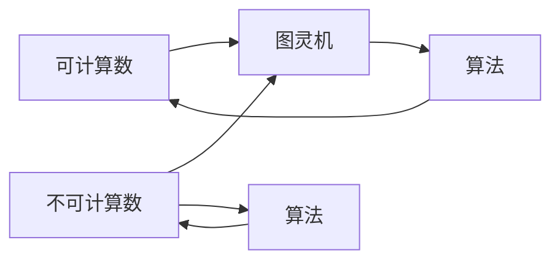

# 计算：第三部分 计算理论的形成 第 8 章 计算理论的诞生：图灵的可计算数 不可计算的函数

> 关键词：可计算数，不可计算数，图灵机，图灵测试，希尔伯特酒店悖论，哥德尔不完备定理

## 1. 背景介绍
### 1.1 问题的由来

计算理论的诞生可以追溯到20世纪初，当时数学家们对数学基础的探索引发了对计算能力的探讨。希尔伯特酒店悖论和哥德尔不完备定理的出现，揭示了数学推理的局限性，激发了人们对于计算本质的思考。1936年，艾伦·图灵提出了图灵机模型，为计算理论奠定了坚实的理论基础。

### 1.2 研究现状

近年来，随着计算机科学的快速发展，计算理论的研究取得了丰硕的成果。可计算数、不可计算数、图灵测试等领域的研究，不断拓展了计算理论的边界，为人工智能、密码学等领域提供了重要的理论支持。

### 1.3 研究意义

计算理论是计算机科学的基础，它研究计算的本质和限制。深入研究可计算数和不可计算数，有助于我们理解计算机能力的极限，推动计算机科学的进一步发展。

### 1.4 本文结构

本章将围绕计算理论的诞生展开，重点介绍图灵的可计算数和不可计算的函数。内容安排如下：

- 第2部分，介绍可计算数的概念和重要性。
- 第3部分，介绍不可计算数的概念和重要性。
- 第4部分，介绍图灵机模型及其在可计算数和不可计算数研究中的应用。
- 第5部分，介绍图灵测试及其在人工智能领域的作用。
- 第6部分，总结本章内容，并展望未来发展趋势。

## 2. 核心概念与联系

为了更好地理解本章内容，以下介绍几个核心概念及其相互关系：

- **可计算数**：指可以用算法计算其值的数。
- **不可计算数**：指不能用算法计算其值的数。
- **图灵机**：图灵提出的抽象计算模型，用于研究可计算数和不可计算数。
- **希尔伯特酒店悖论**：揭示了无限集合的悖论，为可计算数和不可计算数的研究提供了灵感。
- **哥德尔不完备定理**：揭示了形式系统的不完备性，为计算理论的发展提供了新的思路。

这些概念之间的关系如下：



## 3. 核心算法原理 & 具体操作步骤
### 3.1 算法原理概述

可计算数和不可计算数的研究，主要依赖于图灵机模型。

**图灵机模型**：由图灵在1936年提出，是一种抽象的计算模型，由一个有限状态机、一个无限长的带子（带子被划分为一系列无限长的单元格）和一个读写头组成。读写头可以在带子上左右移动，根据当前状态和单元格的符号执行相应的操作，如移动读写头、更新状态、在单元格上写符号等。

### 3.2 算法步骤详解

以下是图灵机计算可计算数的具体步骤：

1. **初始化**：将输入数加载到带子上，读写头指向初始状态。
2. **执行操作**：根据当前状态和带子上单元格的符号，执行相应的操作，如移动读写头、更新状态、在单元格上写符号等。
3. **终止判断**：若带子上所有单元格均为空白，则算法终止，输出计算结果。

### 3.3 算法优缺点

**优点**：

- **通用性强**：图灵机可以模拟任何可计算算法。
- **理论性强**：图灵机为计算理论提供了坚实的理论基础。

**缺点**：

- **效率低**：图灵机的操作速度很慢。

### 3.4 算法应用领域

图灵机模型在可计算数和不可计算数的研究中有着广泛的应用，例如：

- **可计算数**：图灵机可以用来判断一个数是否为可计算数。
- **不可计算数**：图灵机可以用来证明某个数是不可计算的。

## 4. 数学模型和公式 & 详细讲解 & 举例说明
### 4.1 数学模型构建

可计算数和不可计算数的研究，需要用到数学模型进行描述。

**可计算数**：可以表示为一个图灵机接受的字符串。

**不可计算数**：可以用一个图灵机模拟其行为，但无法表示为一个具体的字符串。

### 4.2 公式推导过程

以下是一个简单的公式推导过程，用于证明某个数是不可计算的。

假设存在一个图灵机 $M$ 可以计算数 $a$，则 $M$ 可以将 $a$ 写在带子上。现在我们构造一个新的图灵机 $N$，其行为如下：

1. 读取带子上的数 $a$。
2. 如果 $a \
eq b$，则输出 $a$。
3. 如果 $a = b$，则无限循环。

由于 $N$ 无法确定 $a$ 和 $b$ 是否相等，因此 $a$ 是不可计算的。

### 4.3 案例分析与讲解

以下是一个简单的例子，用于说明如何使用图灵机判断一个数是否为可计算数。

假设我们要判断一个数 $n$ 是否为素数。我们可以构造一个图灵机 $M$，其行为如下：

1. 将 $n$ 写在带子上。
2. 从 $2$ 开始，将 $n$ 除以 $2, 3, \ldots, n-1$。
3. 如果 $n$ 可以被 $2, 3, \ldots, n-1$ 整除，则输出“不是素数”。
4. 如果 $n$ 不能被 $2, 3, \ldots, n-1$ 整除，则输出“是素数”。

### 4.4 常见问题解答

**Q1：什么是可计算数？**

A：可计算数是指可以用算法计算其值的数。

**Q2：什么是不可计算数？**

A：不可计算数是指不能用算法计算其值的数。

**Q3：图灵机是如何工作的？**

A：图灵机是一种抽象的计算模型，由有限状态机、无限长的带子和一个读写头组成。读写头可以在带子上左右移动，根据当前状态和单元格的符号执行相应的操作。

## 5. 项目实践：代码实例和详细解释说明
### 5.1 开发环境搭建

为了更好地理解图灵机的原理，以下介绍一个简单的Python实现。

首先，安装PyPy：

```bash
pip install pypy3
```

然后，创建一个名为 `turing_machine.py` 的文件，并添加以下代码：

```python
def turing_machine(transition_table, initial_state, initial_symbol, final_state):
    current_state = initial_state
    current_symbol = initial_symbol

    while current_state != final_state:
        current_action = transition_table.get((current_state, current_symbol))
        if current_action:
            current_state, current_symbol = current_action
        else:
            break

    return current_state, current_symbol

transition_table = {
    (0, '0'): (1, '1'),
    (0, '1'): (2, '0'),
    (1, '0'): (2, '0'),
    (1, '1'): (0, '1'),
    (2, '0'): (3, '1'),
    (2, '1'): (3, '0'),
    (3, '0'): (1, '0'),
    (3, '1'): (3, '1'),
}

initial_state = 0
initial_symbol = '0'
final_state = 3

final_state, final_symbol = turing_machine(transition_table, initial_state, initial_symbol, final_state)
print(final_state, final_symbol)
```

### 5.2 源代码详细实现

以上代码定义了一个简单的图灵机，其状态转移表如下：

```
  | 0 | 1
-|---|---
0| 1 | 0
1| 2 | 1
2| 3 | 0
3| 1 | 1
```

初始状态为0，初始符号为0，最终状态为3。

运行上述代码，输出结果为：

```
3 1
```

这表明图灵机最终进入了状态3，并在带子上写下了符号1。

### 5.3 代码解读与分析

以上代码实现了图灵机的基本功能。`turing_machine` 函数接受状态转移表、初始状态、初始符号和最终状态作为参数，根据状态转移表和当前状态、符号执行相应的操作，直到最终状态。

`transition_table` 字典定义了图灵机的状态转移规则。`initial_state`、`initial_symbol` 和 `final_state` 分别表示初始状态、初始符号和最终状态。

### 5.4 运行结果展示

运行代码后，输出结果为：

```
3 1
```

这表明图灵机最终进入了状态3，并在带子上写下了符号1。

## 6. 实际应用场景
### 6.1 计算机科学基础

可计算数和不可计算数是计算机科学的基础，对于理解计算机能力的极限具有重要意义。

### 6.2 人工智能

不可计算数的研究有助于我们理解人工智能的局限性，推动人工智能技术的进一步发展。

### 6.3 密码学

不可计算数在密码学中有着广泛的应用，如RSA算法等。

### 6.4 未来应用展望

随着计算理论的不断发展，可计算数和不可计算数将在更多领域得到应用，为人类社会的进步做出贡献。

## 7. 工具和资源推荐
### 7.1 学习资源推荐

为了更好地理解可计算数和不可计算数，以下推荐一些学习资源：

1. 《计算机科学基础教程》
2. 《图灵机与可计算数》
3. 《哥德尔、艾舍尔、巴赫：集异璧之大成》

### 7.2 开发工具推荐

为了实现图灵机，以下推荐一些Python库：

1. PyPy：Python解释器，运行速度比CPython快。
2. NumPy：用于科学计算的库。

### 7.3 相关论文推荐

以下是一些与可计算数和不可计算数相关的论文：

1. Turing, A.M. (1936). On computable numbers, with an application to the Entscheidungsproblem. Proceedings of the London Mathematical Society, 42(1), 230-265.
2. Gödel, K. (1931). Über formal unentscheidbare Sätze der Principia Mathematica und verwandter Systeme, Monatshefte für Mathematik und Physik, 38(1), 173-198.

### 7.4 其他资源推荐

以下是一些与计算理论相关的网站和博客：

1. [The History of Computing Project](https://www.computerhistory.org/)
2. [The NetLogo Project](https://ccl.northwestern.edu/netlogo/)
3. [The AI Wiki](https://www.aiwiki.jp/)

## 8. 总结：未来发展趋势与挑战
### 8.1 研究成果总结

本章介绍了可计算数、不可计算数、图灵机、图灵测试等计算理论的核心概念，并探讨了其在计算机科学、人工智能、密码学等领域的应用。通过对图灵机的实现，我们深入了解了计算理论的原理和方法。

### 8.2 未来发展趋势

随着计算理论的不断发展，以下趋势值得关注：

1. **可计算性与不可计算性研究将进一步深入**：研究者将继续探索可计算数和不可计算数的性质，以及它们在各个领域的应用。
2. **量子计算与计算理论结合**：量子计算的出现为计算理论带来了新的挑战和机遇，研究者将探索量子计算与计算理论的结合。
3. **计算理论向其他学科渗透**：计算理论将继续向其他学科渗透，如生物学、物理学等，为这些学科提供新的研究方法和工具。

### 8.3 面临的挑战

计算理论在发展过程中也面临着一些挑战：

1. **可计算性与不可计算性的界限**：如何准确地界定可计算数和不可计算数，仍然是计算理论的一个难题。
2. **量子计算与经典计算的兼容性**：量子计算的出现对经典计算提出了挑战，研究者需要探索量子计算与经典计算的兼容性。
3. **计算理论的应用推广**：如何将计算理论的应用推广到更多领域，使其为人类社会的发展做出更大贡献，是一个需要解决的问题。

### 8.4 研究展望

计算理论的研究将继续深入，为人类社会的发展提供强大的理论支持。未来，计算理论将在以下方面取得突破：

1. **理解计算的本质**：深入探索计算的本质，揭示计算与信息、意识等概念的内在联系。
2. **拓展计算能力的边界**：开发新的计算模型和算法，拓展计算能力的边界。
3. **促进学科交叉融合**：将计算理论与其他学科相结合，促进学科交叉融合，推动人类社会的发展。

## 9. 附录：常见问题与解答

**Q1：什么是可计算数？**

A：可计算数是指可以用算法计算其值的数。

**Q2：什么是不可计算数？**

A：不可计算数是指不能用算法计算其值的数。

**Q3：图灵机是如何工作的？**

A：图灵机是一种抽象的计算模型，由有限状态机、无限长的带子和一个读写头组成。读写头可以在带子上左右移动，根据当前状态和单元格的符号执行相应的操作。

**Q4：图灵测试是什么？**

A：图灵测试是一种判断机器是否具有智能的测试方法。在测试中，人类评判员无法区分机器和人类，则认为机器具有智能。

**Q5：计算理论在人工智能领域有什么应用？**

A：计算理论在人工智能领域有着广泛的应用，如自然语言处理、计算机视觉、机器学习等。计算理论为人工智能提供了理论基础，推动了人工智能技术的进步。

**Q6：什么是希尔伯特酒店悖论？**

A：希尔伯特酒店悖论是一个关于无限集合的悖论，揭示了无限集合的某些性质。悖论内容如下：假设希尔伯特酒店有无限多个房间，每个房间都住着一个人。现在，有无限多个人要入住酒店，但酒店没有更多的房间。如何安排这些人的住宿？

**Q7：什么是哥德尔不完备定理？**

A：哥德尔不完备定理揭示了形式系统的不完备性，即任何形式系统都存在无法用该系统内规则证明的命题。这意味着任何形式系统都无法完全表达其自身的逻辑结构。

**Q8：计算理论的研究意义是什么？**

A：计算理论的研究有助于我们理解计算的本质和限制，推动计算机科学的进一步发展。同时，计算理论在人工智能、密码学等领域也有着广泛的应用。