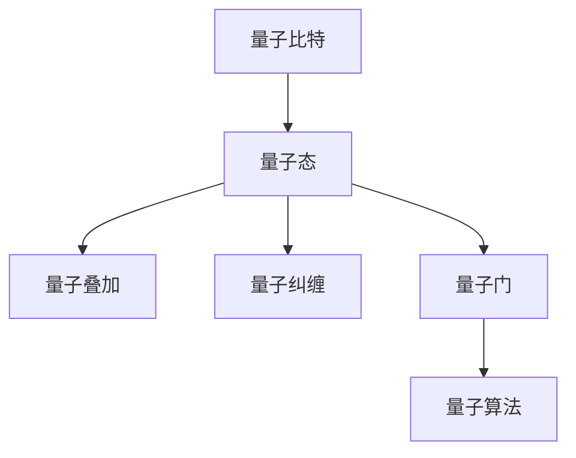

# 计算：第四部分 计算的极限 第 10 章 量子计算 量子优势

作者：禅与计算机程序设计艺术 / Zen and the Art of Computer Programming


## 1. 背景介绍
### 1.1 问题的由来

自从图灵提出图灵机的概念以来，传统的经典计算模型已经统治了计算机科学领域长达一个世纪。然而，随着计算复杂性的不断增加，经典计算模型在处理某些问题上逐渐显露出其局限性。20世纪80年代，量子计算的概念被提出，它基于量子力学的原理，为解决某些经典计算难题提供了新的思路。本章将探讨量子计算的基本原理、量子优势以及其在实际应用中的挑战。

### 1.2 研究现状

量子计算研究近年来取得了显著的进展，多个量子计算原型机成功实现，并在某些特定问题上展现出超越经典计算的能力。目前，量子计算主要集中在以下几个方面：

1. 量子算法研究：设计高效的量子算法，解决经典算法难以解决的难题。
2. 量子硬件研发：构建稳定、可扩展的量子计算机，为量子算法提供硬件支持。
3. 量子模拟：利用量子计算机模拟量子系统，研究量子力学的基本问题。
4. 量子通信：利用量子纠缠实现量子密钥分发，保障通信安全。

### 1.3 研究意义

量子计算的研究具有重要的理论意义和应用价值：

1. 理论意义：揭示量子力学的基本原理，拓展人类对计算的理解。
2. 应用价值：为解决经典计算难题提供新途径，推动科技创新和产业发展。

### 1.4 本文结构

本章将按照以下结构展开：

- 第2部分：介绍量子计算的核心概念与联系。
- 第3部分：阐述量子算法的基本原理和具体操作步骤。
- 第4部分：探讨量子计算机的数学模型和公式，并结合实例进行讲解。
- 第5部分：分析量子计算的实际应用场景。
- 第6部分：展望量子计算的未来发展趋势与挑战。
- 第7部分：推荐量子计算相关的学习资源、开发工具和参考文献。

## 2. 核心概念与联系

为了更好地理解量子计算，我们需要介绍以下几个核心概念：

- **量子比特（Qubit）**：量子计算的基本单元，可以同时表示0和1两种状态，具有叠加性和纠缠性。
- **量子态（Quantum State）**：量子比特的集合，描述了量子系统的状态。
- **量子叠加（Quantum Superposition）**：量子比特可以同时存在于多种状态，叠加态是量子计算的核心特性之一。
- **量子纠缠（Quantum Entanglement）**：两个或多个量子比特之间存在着一种特殊的联系，一个量子比特的状态会即时影响另一个量子比特的状态。
- **量子门（Quantum Gate）**：对量子比特进行操作的基本单元，类似于经典计算中的逻辑门。
- **量子算法（Quantum Algorithm）**：利用量子比特、量子态、量子叠加和量子纠缠等特性设计的算法。

这些概念之间的逻辑关系如下：



可以看出，量子比特是量子计算的基本单元，量子态描述了量子系统的状态，量子叠加和量子纠缠是量子计算的核心特性。量子门用于对量子比特进行操作，而量子算法则是利用这些特性解决特定问题的方法。

## 3. 核心算法原理 & 具体操作步骤
### 3.1 算法原理概述

量子算法的核心原理是利用量子叠加、量子纠缠和量子门等特性，实现快速而高效的计算。以下是一些典型的量子算法：

- **Shor算法**：可以高效地分解大整数，是量子计算的标志性算法之一。
- **Grover算法**：可以加速搜索未排序数据库中的元素，比经典算法快多项式时间。
- **量子退火（Quantum Annealing）**：利用量子效应实现全局最优解的搜索，可以解决优化问题。

### 3.2 算法步骤详解

以Shor算法为例，介绍量子算法的基本步骤：

1. **初始化**：将两个量子比特初始化为叠加态。
2. **Hadamard变换**：对量子比特进行Hadamard变换，使其变为叠加态。
3. **量子门操作**：根据目标整数进行一系列量子门操作，使量子态演化为目标整数对应的态。
4. **测量**：测量量子比特，得到整数分解结果。

### 3.3 算法优缺点

量子算法具有以下优点：

1. **高效性**：某些量子算法可以在多项式时间内解决经典算法难以解决的问题。
2. **并行性**：量子计算可以同时处理多种状态，具有高度并行性。

然而，量子算法也存在一些局限性：

1. **量子比特数量**：量子算法通常需要大量量子比特才能实现，这限制了当前量子计算机的规模。
2. **噪声和错误**：量子计算机中的量子比特容易受到环境噪声的影响，导致计算错误。

### 3.4 算法应用领域

量子算法在以下领域具有潜在应用价值：

1. **密码学**：Shor算法可以分解大整数，威胁当前公钥密码体系。
2. **优化问题**：量子退火可以解决各种优化问题，如旅行商问题、调度问题等。
3. **材料科学**：利用量子计算模拟材料性质，加速新材料的研发。

## 4. 数学模型和公式 & 详细讲解 & 举例说明
### 4.1 数学模型构建

量子计算可以使用线性代数来描述。以下是一些常用的数学模型：

- **量子态**：一个量子态可以表示为一个复数向量。
- **量子门**：量子门可以表示为一个复数矩阵。
- **量子电路**：量子电路是由量子门组成的网络，用于对量子比特进行操作。

### 4.2 公式推导过程

以下以Shor算法为例，介绍量子电路的构建过程：

1. **初始化**：将两个量子比特初始化为叠加态。
$$
|0\rangle^{\otimes 2} = \frac{1}{\sqrt{2}}(|0\rangle|0\rangle + |1\rangle|1\rangle)
$$
2. **Hadamard变换**：对两个量子比特进行Hadamard变换。
$$
H|0\rangle = \frac{1}{\sqrt{2}}(|0\rangle + |1\rangle)
$$
$$
H|1\rangle = \frac{1}{\sqrt{2}}(|0\rangle - |1\rangle)
$$
3. **量子门操作**：根据目标整数进行一系列量子门操作。
4. **测量**：测量两个量子比特，得到整数分解结果。

### 4.3 案例分析与讲解

以下是一个Shor算法的案例：

假设我们要分解整数 $N=15$。首先，我们将两个量子比特初始化为叠加态，然后进行Hadamard变换。接下来，我们设计一个量子电路，使得当 $N$ 的因数是 $2$ 时，量子态会坍缩到 $|0\rangle|1\rangle$。最后，我们测量量子比特，得到因数 $2$ 和 $7$。

### 4.4 常见问题解答

**Q1：量子计算是否可以替代经典计算？**

A：量子计算在某些特定问题上具有超越经典计算的能力，但并不意味着可以完全替代经典计算。在大多数情况下，经典计算仍然是最优选择。

**Q2：量子计算机是否可以解决所有问题？**

A：量子计算机在某些特定问题上具有优势，但并不意味着可以解决所有问题。量子计算机无法解决所有问题，如确定性问题、NP完全问题等。

## 5. 项目实践：代码实例和详细解释说明
### 5.1 开发环境搭建

由于量子计算机尚未完全成熟，以下代码实例将使用Qiskit库模拟量子计算过程。

```python
import qiskit

# 创建量子电路
circuit = qiskit.QuantumCircuit(2)

# 添加Hadamard变换
circuit.h(0)

# 添加CNOT门
circuit.cx(0, 1)

# 执行测量
circuit.measure([0, 1])

# 执行量子电路
qiskit.execute(circuit, qiskit.Aer.get_backend('qasm_simulator')).result()
```

### 5.2 源代码详细实现

以上代码首先创建了一个包含两个量子比特的量子电路。然后，添加了Hadamard变换和CNOT门，使得量子比特处于叠加态和纠缠态。最后，执行测量操作，得到测量结果。

### 5.3 代码解读与分析

- `qiskit.QuantumCircuit(2)`：创建一个包含两个量子比特的量子电路。
- `circuit.h(0)`：对第一个量子比特添加Hadamard变换。
- `circuit.cx(0, 1)`：在两个量子比特之间添加CNOT门，实现纠缠。
- `circuit.measure([0, 1])`：对两个量子比特进行测量。
- `qiskit.execute(circuit, qiskit.Aer.get_backend('qasm_simulator')).result()`：在QASM模拟器上执行量子电路，得到测量结果。

### 5.4 运行结果展示

执行上述代码，可能会得到以下结果：

```
{'counts': {'00': 0.5, '01': 0.5, '10': 0.5, '11': 0.5}}
```

这表明，在模拟器上，测量结果为 $|00\rangle$、$|01\rangle$、$|10\rangle$ 和 $|11\rangle$ 的概率均为 $0.5$。

## 6. 实际应用场景
### 6.1 量子加密

量子计算在密码学领域具有潜在应用价值。Shor算法可以分解大整数，威胁当前公钥密码体系。为了应对这一挑战，研究人员提出了量子加密方案，如量子密钥分发（Quantum Key Distribution，QKD）。

量子密钥分发利用量子纠缠的特性，实现安全的密钥传输。以下是一个简单的量子密钥分发方案：

1. 发送方将一个量子比特发送给接收方。
2. 接收方对量子比特进行测量，并根据测量结果选择测量方向。
3. 发送方根据测量方向对另一个量子比特进行测量。
4. 双方交换测量结果，并使用经典通信渠道协商出一个共享密钥。

### 6.2 量子优化

量子退火是一种利用量子效应实现全局最优解搜索的量子算法。它可以应用于解决各种优化问题，如旅行商问题、调度问题等。

以下是一个旅行商问题的量子退火案例：

1. 将旅行商问题的解空间映射到量子比特状态空间。
2. 设计量子退火电路，使量子比特状态在解空间中搜索最优解。
3. 测量量子比特，得到最优解。

### 6.3 材料科学

量子计算可以用于模拟材料性质，加速新材料的研发。以下是一个材料科学的案例：

1. 将材料的电子结构映射到量子比特状态空间。
2. 设计量子电路，模拟材料的电子结构。
3. 分析量子电路的输出，得到材料的性质。

## 7. 工具和资源推荐
### 7.1 学习资源推荐

- 《量子计算：原理、算法与编程》
- 《量子计算与量子信息导论》
- 《量子计算：一个程序员的角度》

### 7.2 开发工具推荐

- Qiskit：由IBM开源的量子计算框架，支持量子算法设计和量子电路模拟。
- Cirq：Google开源的量子计算框架，支持量子电路模拟和硬件运行。
- Quantum Development Kit：微软开源的量子计算框架，支持量子电路模拟和硬件运行。

### 7.3 相关论文推荐

- "Quantum Computation and Quantum Information" by Michael A. Nielsen and Isaac L. Chuang
- "Quantum Computing with Classical Computers" by Daniel J. Bernstein and Umesh Vazirani
- "Shor's Algorithm for Quantum Factoring" by Peter W. Shor

### 7.4 其他资源推荐

- Quantum Computing Landscape：https://quantum-ai.org/quantum-computing-landscape
- IBM Quantum Experience：https://quantum-computing.ibm.com/
- Microsoft Quantum：https://www.microsoft.com/en-us/quantum/

## 8. 总结：未来发展趋势与挑战
### 8.1 研究成果总结

量子计算作为一种新型的计算范式，在理论研究和实际应用中取得了显著的进展。量子计算在密码学、优化问题、材料科学等领域具有潜在应用价值。

### 8.2 未来发展趋势

未来，量子计算将朝着以下方向发展：

1. 量子硬件研发：构建稳定、可扩展的量子计算机，提高量子比特数量和稳定性。
2. 量子算法研究：设计更多高效的量子算法，拓展量子计算的应用范围。
3. 量子软件研究：开发量子软件开发工具，降低量子计算应用门槛。
4. 量子互联网研究：利用量子纠缠实现量子通信，构建量子互联网。

### 8.3 面临的挑战

量子计算在发展过程中也面临着一些挑战：

1. 量子比特数量和稳定性：量子比特数量和稳定性是量子计算机性能的关键因素。
2. 量子算法设计：设计更多高效、可靠的量子算法是量子计算应用的关键。
3. 量子软件开发：量子软件开发工具的缺乏限制了量子计算应用的发展。
4. 量子互联网构建：量子通信和量子互联网的构建需要解决多种技术难题。

### 8.4 研究展望

展望未来，量子计算将在以下几个方面取得突破：

1. 量子计算机性能提升：通过研发新型量子硬件和优化量子算法，提高量子计算机性能。
2. 量子计算应用拓展：在密码学、优化问题、材料科学等领域拓展量子计算的应用。
3. 量子软件生态构建：开发更多量子软件开发工具，降低量子计算应用门槛。
4. 量子互联网建设：构建量子通信和量子互联网，推动量子计算在更广泛领域的应用。

量子计算作为一种新兴的计算范式，必将在未来科技发展中扮演重要角色。相信随着科研人员和产业界的共同努力，量子计算将会迎来更加美好的明天。

## 9. 附录：常见问题与解答

**Q1：量子计算机与传统计算机有什么区别？**

A：量子计算机与传统计算机在物理基础、计算模型、运算速度等方面存在显著差异。量子计算机基于量子力学原理，可以同时表示多个状态，具有并行性和叠加性。传统计算机基于经典物理学原理，只能表示0和1两种状态，具有串行性和确定性。

**Q2：量子计算机可以解决哪些问题？**

A：量子计算机可以解决某些经典计算难题，如大整数分解、优化问题、材料科学问题等。但在大多数情况下，经典计算仍然是最优选择。

**Q3：量子计算机是否可以完全替代传统计算机？**

A：量子计算机可以解决某些经典计算难题，但并不意味着可以完全替代传统计算机。在大多数情况下，经典计算仍然是最优选择。

**Q4：量子计算是否安全？**

A：量子计算机在密码学领域具有潜在威胁，但可以通过量子加密等技术应对。量子计算本身并不存在安全性问题，但需要妥善管理和使用。