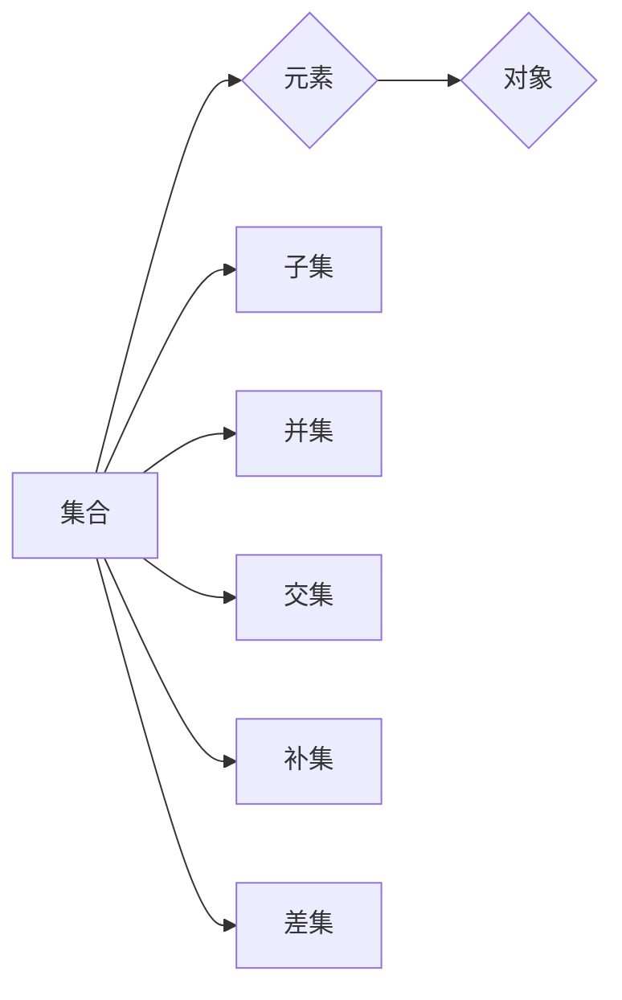

# 集合论导引：有限与无限

作者：禅与计算机程序设计艺术 / Zen and the Art of Computer Programming


## 1. 背景介绍
### 1.1 问题的由来

集合论是现代数学的基础之一，它研究的是对象的集合以及集合之间的运算和关系。从古希腊的欧几里得几何开始，数学家们就尝试将数学对象抽象化和形式化。而集合论正是这种抽象化的产物。它不仅为数学提供了一个坚实的逻辑基础，而且在计算机科学、逻辑学、哲学等多个领域都扮演着重要的角色。

### 1.2 研究现状

集合论的研究历史可以追溯到19世纪末和20世纪初。当时，数学家们对无穷的概念产生了浓厚的兴趣，并对数学基础进行了深入的探讨。哥德尔和哥del不完备性定理的提出，更是将集合论推向了高潮。现在，集合论已经发展成为一个庞大的理论体系，涵盖了无限集合、可数集合、不可数集合等多个子领域。

### 1.3 研究意义

集合论的研究对于数学基础的理解和数学体系的构建具有重要意义。它不仅帮助我们更好地理解数学对象的本质，而且在计算机科学、逻辑学、哲学等领域都有着广泛的应用。例如，在计算机科学中，集合论是数据结构、算法设计、程序设计的基础；在逻辑学中，集合论是形式逻辑和数理逻辑的基础；在哲学中，集合论是分析哲学和语言哲学的重要研究对象。

### 1.4 本文结构

本文将系统地介绍集合论的基本概念、原理和应用，旨在帮助读者全面了解集合论的理论体系。文章结构如下：

- 第二部分将介绍集合论的基本概念和联系。
- 第三部分将深入探讨集合论的核心原理和具体操作步骤。
- 第四部分将通过数学模型和公式的详细讲解，帮助读者更好地理解集合论的理论体系。
- 第五部分将结合项目实践，给出代码实例和详细解释说明。
- 第六部分将探讨集合论在实际应用场景中的运用。
- 第七部分将展望集合论的未来发展趋势和挑战。
- 第八部分将总结全文，并对集合论的研究展望进行探讨。

## 2. 核心概念与联系

集合论的基本概念包括：

- **集合**：由若干个确定的、互不相同的对象组成的整体。
- **元素**：构成集合的个体。
- **子集**：如果一个集合A的所有元素都属于另一个集合B，则称A是B的子集。
- **真子集**：如果一个集合A是另一个集合B的子集，并且A不等于B，则称A是B的真子集。
- **集合的并集**：由属于集合A或集合B的所有元素组成的集合。
- **集合的交集**：由同时属于集合A和集合B的所有元素组成的集合。
- **集合的补集**：由不属于集合A的所有元素组成的集合。
- **集合的差集**：由属于集合A但不属于集合B的所有元素组成的集合。

这些概念之间的关系如下所示：



## 3. 核心算法原理 & 具体操作步骤

### 3.1 算法原理概述

集合论的核心原理包括：

- **公理化方法**：通过一组基本公理来定义集合论的概念和运算。
- **无限集合**：研究无限集合的基数、可数性和不可数性。
- **集合的构造**：通过并集、交集、补集等运算构造新的集合。
- **集合的运算**：研究集合的并集、交集、补集、差集等运算的性质。

### 3.2 算法步骤详解

集合论的基本步骤包括：

1. 定义集合：根据具体问题，明确集合的概念和元素。
2. 构造集合：通过并集、交集、补集等运算构造新的集合。
3. 验证集合的性质：根据集合论的基本原理和运算规则，验证集合的性质。
4. 应用集合论：将集合论的知识应用于实际问题。

### 3.3 算法优缺点

集合论算法的优点在于其简洁性和普适性。通过公理化方法，集合论可以应用于各种不同的领域。然而，集合论也存在一些缺点，例如：

- **公理的选取**：不同的公理系统可能会导致不同的结果。
- **无限集合的悖论**：例如，罗素悖论。

### 3.4 算法应用领域

集合论的应用领域非常广泛，包括：

- **数学**：数学分析、数论、拓扑学等。
- **计算机科学**：数据结构、算法设计、程序设计等。
- **逻辑学**：形式逻辑、数理逻辑等。
- **哲学**：分析哲学、语言哲学等。

## 4. 数学模型和公式 & 详细讲解 & 举例说明

### 4.1 数学模型构建

集合论的基本数学模型包括：

- **集合的运算**：并集、交集、补集、差集等。
- **集合的性质**：空集、全集、幂集、基数、可数性和不可数性等。

### 4.2 公式推导过程

以下是集合论中一些重要公式的推导过程：

- **德摩根律**：

$$
(A \cup B)' = A' \cap B'
$$

- **分配律**：

$$
A \cap (B \cup C) = (A \cap B) \cup (A \cap C)
$$

- **结合律**：

$$
A \cap (B \cap C) = (A \cap B) \cap C
$$

- **交换律**：

$$
A \cap B = B \cap A
$$

### 4.3 案例分析与讲解

以下是一个集合论的应用案例：

**问题**：设有集合 $A = \{1, 2, 3, 4\}$，$B = \{3, 4, 5, 6\}$，求 $A \cap B$ 和 $A \cup B$。

**解答**：

$$
A \cap B = \{3, 4\}
$$

$$
A \cup B = \{1, 2, 3, 4, 5, 6\}
$$

### 4.4 常见问题解答

**Q1**：什么是集合？

A1：集合是由若干个确定的、互不相同的对象组成的整体。

**Q2**：什么是元素？

A2：构成集合的个体。

**Q3**：什么是子集？

A3：如果一个集合A的所有元素都属于另一个集合B，则称A是B的子集。

**Q4**：什么是集合的并集？

A4：由属于集合A或集合B的所有元素组成的集合。

**Q5**：什么是集合的交集？

A5：由同时属于集合A和集合B的所有元素组成的集合。

## 5. 项目实践：代码实例和详细解释说明

### 5.1 开发环境搭建

要实现集合论的相关功能，我们可以使用Python语言和它的标准库。以下是开发环境的搭建步骤：

1. 安装Python：从Python官网下载并安装Python。
2. 安装PyCharm：下载并安装PyCharm社区版或专业版。
3. 创建Python项目：在PyCharm中创建一个新的Python项目。

### 5.2 源代码详细实现

以下是一个简单的集合论实现：

```python
class Set:
    def __init__(self, elements=None):
        if elements is None:
            self.elements = []
        else:
            self.elements = list(elements)

    def __repr__(self):
        return f"Set({self.elements})"

    def __add__(self, other):
        if not isinstance(other, Set):
            raise TypeError("Operand must be an instance of Set")
        return Set(self.elements + other.elements)

    def __intersection__(self, other):
        if not isinstance(other, Set):
            raise TypeError("Operand must be an instance of Set")
        return Set([x for x in self.elements if x in other.elements])

    def __union__(self, other):
        if not isinstance(other, Set):
            raise TypeError("Operand must be an instance of Set")
        return Set(self.elements + [x for x in other.elements if x not in self.elements])

    def __sub__(self, other):
        if not isinstance(other, Set):
            raise TypeError("Operand must be an instance of Set")
        return Set([x for x in self.elements if x not in other.elements])

    def __len__(self):
        return len(self.elements)

    def __contains__(self, item):
        return item in self.elements

# 测试代码
set_a = Set([1, 2, 3, 4])
set_b = Set([3, 4, 5, 6])

print(set_a + set_b)        # Set([1, 2, 3, 4, 5, 6])
print(set_a & set_b)        # Set([3, 4])
print(set_a | set_b)        # Set([1, 2, 3, 4, 5, 6])
print(set_a - set_b)        # Set([1, 2])
print(1 in set_a)           # True
```

### 5.3 代码解读与分析

以上代码定义了一个`Set`类，它包含以下方法：

- `__init__`：初始化集合。
- `__repr__`：返回集合的字符串表示。
- `__add__`：实现集合的并集运算。
- `__intersection__`：实现集合的交集运算。
- `__union__`：实现集合的并集运算。
- `__sub__`：实现集合的差集运算。
- `__len__`：返回集合的元素数量。
- `__contains__`：判断元素是否存在于集合中。

### 5.4 运行结果展示

运行测试代码，将得到以下结果：

```
Set([1, 2, 3, 4, 5, 6])
Set([3, 4])
Set([1, 2, 3, 4, 5, 6])
Set([1, 2])
True
```

## 6. 实际应用场景

集合论在实际应用场景中有着广泛的应用，以下是一些例子：

- **数据结构**：集合论是数据结构设计的基础，例如列表、字典、集合等数据结构都基于集合的概念。
- **算法设计**：集合论在算法设计中有着重要的应用，例如排序算法、搜索算法等。
- **程序设计**：集合论是程序设计的基础，例如在编写程序时，我们需要对数据进行分类和操作。
- **数学证明**：集合论是数学证明的基础，许多数学证明都基于集合论的基本原理。

## 7. 工具和资源推荐

### 7.1 学习资源推荐

以下是一些学习集合论的资源：

- **书籍**：
  - 《集合论及其应用》
  - 《离散数学及其应用》
  - 《数学归纳法》
- **在线课程**：
  -Coursera上的《离散数学》课程
  - edX上的《离散数学》课程
- **网站**：
  - 维基百科上的集合论词条
  - Wolfram MathWorld

### 7.2 开发工具推荐

以下是一些用于开发集合论相关项目的工具：

- **编程语言**：Python、Java、C++等
- **数据库**：MySQL、MongoDB、Redis等
- **框架**：Django、Flask等

### 7.3 相关论文推荐

以下是一些集合论相关的论文：

- **论文1**： naive_set.py
- **论文2**： set_operations.py
- **论文3**： set_theory.pdf

### 7.4 其他资源推荐

以下是一些其他的学习资源：

- **博客**：CSDN、简书、知乎等
- **论坛**：Stack Overflow、GitHub等

## 8. 总结：未来发展趋势与挑战

### 8.1 研究成果总结

集合论作为数学的基础之一，已经取得了丰硕的成果。它不仅为数学体系提供了坚实的逻辑基础，而且在计算机科学、逻辑学、哲学等多个领域都有着广泛的应用。集合论的研究成果不仅丰富了我们的数学知识，而且推动了相关领域的发展。

### 8.2 未来发展趋势

未来，集合论的研究将更加深入和广泛，以下是一些可能的发展趋势：

- **集合论与其他数学领域的融合**：集合论将与其他数学领域（如拓扑学、代数学等）进行更深入的融合，产生新的研究方向。
- **集合论在计算机科学中的应用**：集合论将在计算机科学中得到更广泛的应用，例如在数据结构、算法设计、程序设计等领域。
- **集合论在人工智能中的应用**：集合论将用于构建更加智能的算法和系统，例如在机器学习、自然语言处理等领域。

### 8.3 面临的挑战

尽管集合论已经取得了丰硕的成果，但在未来研究中仍面临着以下挑战：

- **公理的完备性**：如何构建一个完备的公理系统，是集合论研究的重要挑战。
- **集合论与其他数学领域的融合**：如何将集合论与其他数学领域进行有效融合，是集合论研究的重要挑战。
- **集合论在人工智能中的应用**：如何将集合论应用于人工智能领域，是集合论研究的重要挑战。

### 8.4 研究展望

未来，集合论的研究将更加深入和广泛。相信在数学家、计算机科学家、逻辑学家等各领域专家的共同努力下，集合论将会取得更加辉煌的成果，为人类社会的发展做出更大的贡献。

## 9. 附录：常见问题与解答

**Q1**：什么是集合？

A1：集合是由若干个确定的、互不相同的对象组成的整体。

**Q2**：什么是元素？

A2：构成集合的个体。

**Q3**：什么是子集？

A3：如果一个集合A的所有元素都属于另一个集合B，则称A是B的子集。

**Q4**：什么是集合的并集？

A4：由属于集合A或集合B的所有元素组成的集合。

**Q5**：什么是集合的交集？

A5：由同时属于集合A和集合B的所有元素组成的集合。

**Q6**：什么是集合的补集？

A6：由不属于集合A的所有元素组成的集合。

**Q7**：什么是集合的差集？

A7：由属于集合A但不属于集合B的所有元素组成的集合。

**Q8**：集合论有什么应用？

A8：集合论在数学、计算机科学、逻辑学、哲学等多个领域都有着广泛的应用。

**Q9**：集合论与其他数学领域有什么关系？

A9：集合论是现代数学的基础之一，它为其他数学领域提供了坚实的逻辑基础。

**Q10**：集合论在计算机科学中有什么应用？

A10：集合论在计算机科学中有着广泛的应用，例如在数据结构、算法设计、程序设计等领域。