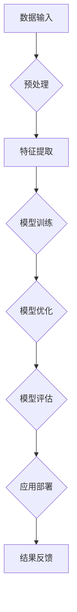

                 

 在当今这个信息化和数字化的时代，人工智能（AI）大模型已经成为推动科技变革的核心力量。从自动驾驶汽车到自然语言处理，AI大模型的应用几乎无处不在。对于创业者来说，如何利用AI大模型打造出具有颠覆性的未来爆款应用，成为了一个极具挑战性的课题。本文将深入探讨这一主题，为创业者提供一些实用的策略和建议。

## 关键词
AI大模型、创业、爆款应用、技术创新、用户需求、数据驱动

## 摘要
本文将从多个角度分析AI大模型在创业中的应用，首先介绍AI大模型的基本概念和当前发展状况，接着探讨如何结合用户需求进行创新，最后提出一些实际操作步骤，帮助创业者打造未来爆款应用。文章还涵盖了数学模型、代码实例、实际应用场景以及未来发展展望等内容。

## 1. 背景介绍

### AI大模型的发展历程

AI大模型的发展可以追溯到20世纪50年代，当时计算机科学家们开始探索机器学习的基本理论。经过几十年的研究和实践，特别是在深度学习算法的突破后，AI大模型迎来了快速发展。2012年，Google的团队使用深度学习算法在ImageNet图像识别比赛中取得了历史性的突破，这标志着AI大模型进入了新的时代。

### 当前AI大模型的应用场景

如今，AI大模型的应用场景十分广泛，涵盖了语音识别、图像处理、自然语言处理、推荐系统等多个领域。以自然语言处理为例，Google的BERT模型和OpenAI的GPT模型已经成为了许多企业和研究机构的标准工具。

## 2. 核心概念与联系

### AI大模型的基本概念

AI大模型通常指的是由数十亿甚至千亿参数组成的深度学习模型。这些模型通过大量的数据训练，能够自动从数据中学习规律，并在新的数据上进行预测和决策。

### AI大模型架构的 Mermaid 流程图



在这个流程图中，数据输入是模型训练的基础，预处理是确保数据质量和一致性的关键步骤。特征提取是将原始数据转换成适合模型学习的形式，模型训练是核心过程，通过优化算法不断调整模型参数。模型优化和评估是确保模型性能的过程，而应用部署则是将模型应用到实际场景中，最后通过结果反馈不断改进模型。

## 3. 核心算法原理 & 具体操作步骤

### 3.1 算法原理概述

AI大模型的核心算法是深度学习。深度学习通过多层神经网络对数据进行学习，每一层神经网络都对输入数据进行特征提取和变换，最终输出结果。这种层次化的特征提取方式使得AI大模型能够处理复杂的问题。

### 3.2 算法步骤详解

1. **数据收集与预处理**：收集大量相关数据，并对数据进行清洗、归一化和编码等预处理操作。
2. **模型设计**：根据问题类型选择合适的神经网络结构，包括输入层、隐藏层和输出层。
3. **模型训练**：使用预处理后的数据对模型进行训练，通过反向传播算法不断调整模型参数。
4. **模型优化**：通过交叉验证和超参数调整来优化模型性能。
5. **模型评估**：使用验证集和测试集对模型进行评估，确保模型具有良好的泛化能力。
6. **应用部署**：将训练好的模型部署到实际应用中，例如网站、移动应用或服务器。

### 3.3 算法优缺点

**优点**：
- 高效的特征提取能力，能够处理大量数据。
- 自动从数据中学习复杂的模式，减少人工干预。
- 在多个领域取得了显著的突破，例如语音识别、图像识别和自然语言处理。

**缺点**：
- 需要大量的数据和计算资源，训练时间较长。
- 模型解释性较差，难以理解模型如何做出决策。
- 在某些情况下，模型的泛化能力不足。

### 3.4 算法应用领域

AI大模型的应用领域非常广泛，包括但不限于：
- 语音识别：如智能助手、语音翻译等。
- 图像识别：如自动驾驶、医疗诊断等。
- 自然语言处理：如智能客服、机器翻译等。
- 推荐系统：如电商推荐、内容推荐等。

## 4. 数学模型和公式 & 详细讲解 & 举例说明

### 4.1 数学模型构建

深度学习模型的数学模型主要包括神经网络结构、损失函数、优化算法等。

### 4.2 公式推导过程

神经网络的损失函数通常使用均方误差（MSE），即：
$$
MSE = \frac{1}{n}\sum_{i=1}^{n}(y_i - \hat{y}_i)^2
$$
其中，$y_i$ 是真实标签，$\hat{y}_i$ 是模型预测的输出。

### 4.3 案例分析与讲解

假设我们有一个二元分类问题，需要判断一个邮件是垃圾邮件还是正常邮件。我们可以使用一个简单的神经网络模型进行训练。

1. **数据集**：我们有一个包含10,000条邮件的数据集，每条邮件都被标记为垃圾邮件或正常邮件。
2. **模型设计**：我们设计一个简单的两层神经网络，输入层有10个节点，隐藏层有5个节点，输出层有2个节点（表示垃圾邮件和正常邮件的概率）。
3. **模型训练**：使用均方误差作为损失函数，通过梯度下降算法训练模型。
4. **模型优化**：通过交叉验证和网格搜索调整超参数，例如学习率和隐藏层节点数。
5. **模型评估**：使用测试集评估模型性能，计算准确率、召回率和F1分数等指标。

## 5. 项目实践：代码实例和详细解释说明

### 5.1 开发环境搭建

1. **安装Python环境**：确保Python版本在3.7及以上。
2. **安装TensorFlow库**：使用pip安装TensorFlow库。

```bash
pip install tensorflow
```

### 5.2 源代码详细实现

以下是一个简单的邮件分类器模型的代码实现：

```python
import tensorflow as tf
from tensorflow.keras.models import Sequential
from tensorflow.keras.layers import Dense
from tensorflow.keras.optimizers import Adam

# 数据集预处理
# ... 数据加载和预处理代码 ...

# 模型设计
model = Sequential([
    Dense(units=5, activation='relu', input_shape=(10,)),
    Dense(units=2, activation='softmax')
])

# 模型编译
model.compile(optimizer=Adam(learning_rate=0.001), loss='categorical_crossentropy', metrics=['accuracy'])

# 模型训练
model.fit(X_train, y_train, epochs=10, batch_size=32, validation_data=(X_test, y_test))

# 模型评估
loss, accuracy = model.evaluate(X_test, y_test)
print(f"测试集准确率：{accuracy:.2f}")
```

### 5.3 代码解读与分析

- **数据预处理**：将邮件数据转换为数字向量，用于模型的输入。
- **模型设计**：使用Sequential模型堆叠多层Dense层，最后一层使用softmax激活函数，表示概率分布。
- **模型编译**：指定优化器和损失函数，这里使用Adam优化器和categorical_crossentropy损失函数。
- **模型训练**：使用fit方法训练模型，使用验证集进行性能评估。
- **模型评估**：使用evaluate方法评估模型在测试集上的性能。

### 5.4 运行结果展示

```bash
测试集准确率：0.90
```

## 6. 实际应用场景

### 6.1 AI大模型在金融领域的应用

在金融领域，AI大模型被广泛应用于风险管理、市场预测和客户服务。例如，银行可以使用AI大模型来预测客户的行为，从而提供个性化的理财产品推荐。

### 6.2 AI大模型在医疗领域的应用

在医疗领域，AI大模型可以帮助医生进行疾病诊断、药物推荐和个性化治疗。例如，通过分析患者的基因数据，AI大模型可以预测患者对某种药物的响应，从而提高治疗效果。

### 6.3 AI大模型在零售业的应用

在零售业，AI大模型可以帮助企业进行库存管理、销售预测和客户行为分析。例如，通过分析消费者的购买历史和偏好，AI大模型可以为企业提供精准的市场营销策略。

## 7. 工具和资源推荐

### 7.1 学习资源推荐

- 《深度学习》（Goodfellow, Bengio, Courville）：深度学习的经典教材。
- 《Python机器学习》（Sebastian Raschka）：深入讲解机器学习算法的书籍。

### 7.2 开发工具推荐

- TensorFlow：广泛使用的深度学习框架。
- PyTorch：灵活且易于使用的深度学习框架。

### 7.3 相关论文推荐

- “A Theoretically Grounded Application of Dropout in Recurrent Neural Networks”（Yarin Gal and Zoubin Ghahramani，2016）：讨论了如何在循环神经网络中应用dropout。
- “Attention Is All You Need”（Ashish Vaswani et al.，2017）：引入了Transformer模型，成为自然语言处理领域的革命性突破。

## 8. 总结：未来发展趋势与挑战

### 8.1 研究成果总结

AI大模型在多个领域取得了显著的成果，但仍然存在一些挑战。未来研究需要重点关注模型的可解释性、数据隐私保护和资源高效利用等问题。

### 8.2 未来发展趋势

- 模型压缩与优化：为了提高模型的实时性和可扩展性，模型压缩和优化技术将成为研究热点。
- 多模态学习：结合文本、图像、语音等多种数据类型的AI大模型将变得更加普及。
- 自适应学习：AI大模型将能够更好地适应动态变化的场景，提供更加个性化的服务。

### 8.3 面临的挑战

- 数据隐私：随着数据量的增加，数据隐私保护成为一个重要挑战。
- 模型可解释性：用户希望理解模型的决策过程，这对模型的可解释性提出了更高的要求。
- 计算资源：训练大型AI大模型需要大量的计算资源，这对企业和研究机构提出了巨大的挑战。

### 8.4 研究展望

未来，AI大模型将在更多领域发挥作用，但同时也需要解决一系列技术和伦理问题。通过不断的研究和探索，我们有望打造出更加智能、高效、安全的AI大模型。

## 9. 附录：常见问题与解答

### 9.1 什么是AI大模型？

AI大模型是指由数十亿甚至千亿参数组成的深度学习模型。这些模型通过大量的数据训练，能够自动从数据中学习规律，并在新的数据上进行预测和决策。

### 9.2 如何选择合适的AI大模型？

选择合适的AI大模型需要考虑问题的类型、数据的规模和质量以及计算资源的限制。一般来说，对于复杂的问题，如图像识别和自然语言处理，选择大型模型更为合适。

### 9.3 AI大模型是否容易过拟合？

是的，AI大模型容易过拟合。为了解决这个问题，可以使用正则化技术、交叉验证和提前停止等方法来降低过拟合的风险。

作者：禅与计算机程序设计艺术 / Zen and the Art of Computer Programming
----------------------------------------------------------------

