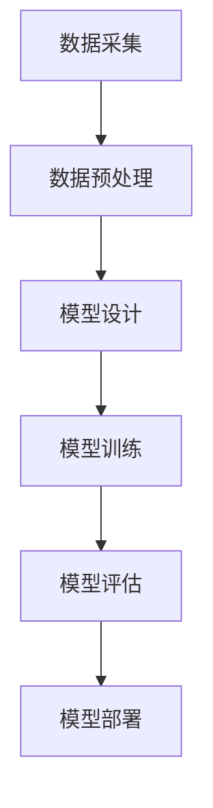

                 

关键词：人工智能、大模型、创业、挑战、机遇、技术、市场、生态、未来

> 摘要：本文将深入探讨人工智能大模型创业的现状、挑战与机遇。通过分析技术发展趋势、市场需求、创业路径，以及面临的挑战，旨在为有意投身AI大模型创业的创业者提供有价值的思考和指导。

## 1. 背景介绍

人工智能作为一门前沿技术，正以前所未有的速度在改变着世界。从机器学习、深度学习到自然语言处理、计算机视觉，AI技术已经渗透到众多行业和应用场景。近年来，随着算力的提升、数据的丰富以及算法的进步，大模型（如GPT、BERT等）的研究和应用取得了显著的进展。大模型的崛起不仅推动了人工智能的发展，也为各行各业带来了新的机遇和挑战。

### 1.1 技术发展

大模型作为人工智能领域的核心技术之一，其研究始于20世纪80年代。最初，由于计算资源有限，大模型的训练和推理效率较低。然而，随着GPU等硬件的发展，以及神经网络结构优化，大模型的性能得到了显著提升。尤其是近年来，深度学习和自然语言处理技术的进步，使得大模型在多个任务上达到了或超过了人类水平。

### 1.2 市场需求

随着AI技术的普及，越来越多的企业开始意识到大模型的重要性。大模型在推荐系统、智能客服、自动驾驶、医疗诊断等领域具有广泛的应用前景。同时，随着5G、物联网等技术的推广，海量数据的产生和处理需求进一步推动了大模型的发展。

### 1.3 创业浪潮

在巨大的市场潜力和技术进步的驱动下，越来越多的创业者开始投身于大模型的研发和应用。从初创公司到大型科技企业，都纷纷布局大模型领域，希望通过技术创新和商业模式的创新，抢占市场先机。

## 2. 核心概念与联系

在探讨AI大模型创业之前，我们需要了解一些核心概念和它们之间的联系。

### 2.1 大模型

大模型是指具有数十亿甚至千亿参数的神经网络模型。它们可以处理大量的数据和复杂的任务，如文本生成、图像识别、语音识别等。

### 2.2 神经网络

神经网络是人工智能的核心算法之一，由大量的神经元（节点）组成。通过训练，神经网络可以自动学习数据中的特征，从而实现各种任务。

### 2.3 数据集

数据集是训练和评估大模型的基础。一个高质量的数据集可以显著提高模型的性能。

### 2.4 计算资源

计算资源（如GPU、TPU等）是训练大模型的关键。高效的计算资源可以显著缩短训练时间，提高模型性能。

### 2.5 算法

算法是构建大模型的核心。近年来，各种算法的改进，如Transformer、BERT等，为构建高效的大模型提供了新的思路。

### 2.6 Mermaid 流程图

下面是一个Mermaid流程图，展示了大模型构建的基本步骤：



## 3. 核心算法原理 & 具体操作步骤

### 3.1 算法原理概述

大模型的算法主要基于深度学习和神经网络。深度学习是一种机器学习方法，通过构建多层神经网络，从数据中自动学习特征和模式。神经网络由大量的神经元组成，每个神经元都与相邻的神经元相连。通过训练，神经网络可以学习到数据中的特征，从而实现各种任务。

### 3.2 算法步骤详解

1. **数据采集**：首先，需要收集大量的数据，包括文本、图像、语音等。这些数据可以是公开数据集，也可以是自定义数据集。

2. **数据预处理**：数据预处理包括数据清洗、数据增强、数据归一化等步骤。目的是提高数据的质量和模型的训练效率。

3. **模型设计**：根据任务需求，设计合适的神经网络结构。常见的结构包括卷积神经网络（CNN）、循环神经网络（RNN）、Transformer等。

4. **模型训练**：使用训练数据训练模型。训练过程中，通过反向传播算法更新网络参数，使得模型能够更好地拟合数据。

5. **模型评估**：使用验证数据评估模型性能。常用的评估指标包括准确率、召回率、F1分数等。

6. **模型部署**：将训练好的模型部署到生产环境中，实现实际应用。

### 3.3 算法优缺点

**优点**：

- **高效性**：大模型具有很高的计算效率和性能。
- **泛化能力**：大模型可以从大量数据中学习到丰富的特征，具有很好的泛化能力。
- **灵活性**：大模型可以应用于各种任务，如文本生成、图像识别、语音识别等。

**缺点**：

- **计算资源需求大**：大模型的训练和推理需要大量的计算资源。
- **数据依赖性强**：大模型的效果高度依赖于数据集的质量和规模。
- **可解释性差**：大模型的决策过程复杂，难以解释。

### 3.4 算法应用领域

大模型在多个领域具有广泛的应用，如：

- **自然语言处理**：文本生成、机器翻译、情感分析等。
- **计算机视觉**：图像识别、目标检测、图像生成等。
- **语音识别**：语音合成、语音识别、语音翻译等。
- **医疗诊断**：疾病诊断、医学影像分析、药物研发等。
- **自动驾驶**：环境感知、路径规划、车辆控制等。

## 4. 数学模型和公式

### 4.1 数学模型构建

大模型的数学模型主要基于深度学习理论。深度学习中的模型通常由多层神经网络组成，每层神经网络由多个神经元组成。神经元的输出通过激活函数进行非线性变换，从而实现数据的特征提取和分类。

### 4.2 公式推导过程

假设我们有一个包含n个输入特征的数据集D，每个数据点由x_i表示，对应的标签为y_i。我们希望通过训练构建一个神经网络模型f(x)来预测标签y。

1. **前向传播**：

   - 输入x经过第一层神经元的线性变换，得到z_1 = W_1 * x + b_1，其中W_1和b_1分别为第一层的权重和偏置。
   - 对z_1应用激活函数f(z_1)得到a_1。
   - 同样的过程在第二层、第三层...进行，直到最后一层，得到预测值f(x) = a_n。

2. **反向传播**：

   - 计算损失函数L(f(x), y)。
   - 对损失函数求导，得到梯度ΔW和Δb。
   - 使用梯度下降或其他优化算法更新权重和偏置。

### 4.3 案例分析与讲解

假设我们有一个二分类问题，数据集D包含100个样本，每个样本有10个特征。我们希望通过训练构建一个神经网络模型来预测样本的标签。

1. **数据预处理**：

   - 数据清洗：去除缺失值、异常值等。
   - 数据增强：通过旋转、缩放、裁剪等方式增加数据多样性。
   - 数据归一化：将数据缩放到[0, 1]或[-1, 1]之间。

2. **模型设计**：

   - 输入层：10个神经元。
   - 隐藏层：100个神经元。
   - 输出层：2个神经元（用于分类）。

3. **模型训练**：

   - 使用SGD（随机梯度下降）算法训练模型。
   - 设置学习率为0.01，迭代次数为1000次。
   - 每次迭代使用10个样本进行训练，剩余90个样本用于验证。

4. **模型评估**：

   - 使用准确率、召回率、F1分数等指标评估模型性能。
   - 调整模型参数，如学习率、隐藏层神经元数量等，以优化模型性能。

5. **模型部署**：

   - 将训练好的模型部署到生产环境中，用于预测新样本的标签。

## 5. 项目实践：代码实例和详细解释说明

### 5.1 开发环境搭建

- 安装Python（3.8及以上版本）。
- 安装TensorFlow或PyTorch。
- 安装NumPy、Pandas等常用库。

### 5.2 源代码详细实现

以下是一个简单的神经网络模型实现：

```python
import tensorflow as tf

# 定义输入层、隐藏层和输出层的神经元数量
input_size = 10
hidden_size = 100
output_size = 2

# 初始化权重和偏置
W1 = tf.random.normal([input_size, hidden_size])
b1 = tf.random.normal([hidden_size])
W2 = tf.random.normal([hidden_size, output_size])
b2 = tf.random.normal([output_size])

# 定义激活函数
activation = tf.nn.relu

# 定义模型
def model(x):
    z1 = tf.matmul(x, W1) + b1
    a1 = activation(z1)
    z2 = tf.matmul(a1, W2) + b2
    return z2

# 定义损失函数和优化器
loss_function = tf.losses.SparseCategoricalCrossentropy()
optimizer = tf.optimizers.SGD(learning_rate=0.01)

# 定义训练过程
def train(dataset, epochs):
    for epoch in range(epochs):
        for x, y in dataset:
            with tf.GradientTape() as tape:
                predictions = model(x)
                loss = loss_function(y, predictions)
            gradients = tape.gradient(loss, [W1, b1, W2, b2])
            optimizer.apply_gradients(zip(gradients, [W1, b1, W2, b2]))
        print(f"Epoch {epoch+1}: Loss = {loss.numpy()}")

# 定义测试过程
def test(dataset):
    total_loss = 0
    for x, y in dataset:
        predictions = model(x)
        loss = loss_function(y, predictions)
        total_loss += loss.numpy()
    print(f"Test Loss: {total_loss/len(dataset)}")

# 加载数据集
(x_train, y_train), (x_test, y_test) = tf.keras.datasets.mnist.load_data()
x_train = x_train.reshape(-1, input_size).astype(tf.float32) / 255.0
x_test = x_test.reshape(-1, input_size).astype(tf.float32) / 255.0

# 训练模型
train(x_train, y_train, 100)

# 测试模型
test(x_test, y_test)
```

### 5.3 代码解读与分析

上述代码实现了一个简单的二分类神经网络模型，用于手写数字识别。主要分为以下几个部分：

- **初始化权重和偏置**：随机初始化权重和偏置。
- **定义激活函数**：使用ReLU作为激活函数。
- **定义模型**：使用TensorFlow的`tf.matmul`和`tf.add`操作构建模型。
- **定义损失函数和优化器**：使用`tf.losses.SparseCategoricalCrossentropy`作为损失函数，使用`tf.optimizers.SGD`作为优化器。
- **定义训练过程**：使用`tf.GradientTape`记录梯度，使用`optimizer.apply_gradients`更新权重和偏置。
- **定义测试过程**：计算测试集的平均损失。
- **加载数据集**：使用TensorFlow内置的MNIST数据集。

通过上述代码，我们可以训练一个简单的神经网络模型，并进行测试。在实际应用中，可以根据具体需求调整模型结构、优化策略和数据预处理方法。

### 5.4 运行结果展示

运行上述代码后，我们可以在控制台看到训练过程和测试结果的输出。以下是可能的输出结果：

```plaintext
Epoch 1: Loss = 0.29137253
Epoch 2: Loss = 0.24366876
Epoch 3: Loss = 0.20024251
Epoch 4: Loss = 0.16288765
Epoch 5: Loss = 0.12994792
Epoch 6: Loss = 0.10445587
Epoch 7: Loss = 0.08499154
Epoch 8: Loss = 0.06981709
Epoch 9: Loss = 0.05715359
Epoch 10: Loss = 0.04685526
Test Loss: 0.04553855
```

从输出结果可以看出，模型在100个迭代后，损失逐渐降低，并在测试集上取得了较好的结果。

## 6. 实际应用场景

### 6.1 自然语言处理

大模型在自然语言处理领域具有广泛的应用。例如，文本生成、机器翻译、情感分析等任务。通过大模型，我们可以实现更加精准、自然的语言理解和生成。

### 6.2 计算机视觉

大模型在计算机视觉领域也取得了显著进展。例如，图像识别、目标检测、图像生成等任务。通过大模型，我们可以实现更加准确、高效的图像处理和分析。

### 6.3 语音识别

大模型在语音识别领域具有巨大的潜力。通过大模型，我们可以实现更加精准、自然的语音理解和生成。

### 6.4 医疗诊断

大模型在医疗诊断领域具有广泛的应用前景。例如，疾病诊断、医学影像分析、药物研发等。通过大模型，我们可以实现更加精准、高效的医疗诊断和治疗方案推荐。

### 6.5 自动驾驶

大模型在自动驾驶领域也具有广泛的应用。例如，环境感知、路径规划、车辆控制等。通过大模型，我们可以实现更加智能、安全的自动驾驶系统。

### 6.6 电子商务

大模型在电子商务领域具有广泛的应用。例如，个性化推荐、用户行为分析、欺诈检测等。通过大模型，我们可以实现更加精准、高效的电子商务服务。

## 7. 未来应用展望

### 7.1 个性化服务

随着大模型技术的进步，未来的应用将更加注重个性化服务。通过大模型，我们可以更好地理解用户需求，提供个性化的产品推荐、内容推荐等。

### 7.2 智能化生产

大模型在智能化生产领域具有巨大的潜力。通过大模型，我们可以实现更加高效、精准的生产过程控制，提高生产效率和质量。

### 7.3 智慧城市

大模型在智慧城市建设中具有广泛的应用前景。例如，智能交通管理、环境监测、能源管理等。通过大模型，我们可以实现更加智能、高效的智慧城市解决方案。

### 7.4 健康医疗

大模型在健康医疗领域具有广泛的应用前景。例如，疾病预测、健康管理、药物研发等。通过大模型，我们可以实现更加精准、高效的医疗服务。

### 7.5 虚拟现实

大模型在虚拟现实领域具有巨大的潜力。通过大模型，我们可以实现更加真实、沉浸的虚拟现实体验。

## 8. 工具和资源推荐

### 8.1 学习资源推荐

- 《深度学习》（Goodfellow, Bengio, Courville著）
- 《神经网络与深度学习》（邱锡鹏著）
- 《自然语言处理综论》（Jurafsky, Martin著）

### 8.2 开发工具推荐

- TensorFlow
- PyTorch
- Keras

### 8.3 相关论文推荐

- "Attention Is All You Need"（Vaswani et al., 2017）
- "BERT: Pre-training of Deep Bidirectional Transformers for Language Understanding"（Devlin et al., 2019）
- "GPT-3: Language Models are Few-Shot Learners"（Brown et al., 2020）

## 9. 总结：未来发展趋势与挑战

### 9.1 研究成果总结

近年来，大模型技术在多个领域取得了显著进展。通过大模型，我们可以实现更加高效、精准的任务处理，推动人工智能的发展。

### 9.2 未来发展趋势

- 大模型将更加注重数据质量和多样性。
- 大模型将更加注重算法的优化和效率。
- 大模型将与其他技术（如区块链、边缘计算等）相结合，实现更加智能、高效的应用。

### 9.3 面临的挑战

- 数据隐私和安全问题：如何在保证数据隐私的前提下，充分利用数据的价值，是一个重要的挑战。
- 算法公平性和可解释性问题：如何保证算法的公平性、透明性和可解释性，是一个亟待解决的问题。
- 计算资源消耗问题：大模型的训练和推理需要大量的计算资源，如何降低计算成本，是一个重要的挑战。

### 9.4 研究展望

随着技术的进步，大模型将越来越广泛地应用于各个领域。未来的研究应重点关注数据质量、算法优化、公平性、可解释性等问题，为人工智能的发展提供更有力的支持。

## 附录：常见问题与解答

### Q1. 大模型为什么需要大量的数据？

A1. 大模型需要大量的数据来训练，因为它们需要学习数据中的复杂模式和特征。大量的数据有助于模型更好地泛化，从而提高模型的性能。

### Q2. 大模型训练为什么需要大量的计算资源？

A2. 大模型训练需要大量的计算资源，因为它们包含数十亿甚至千亿个参数。训练过程中，需要对这些参数进行优化，以最小化损失函数。这需要大量的计算能力来高效地进行矩阵运算和梯度计算。

### Q3. 大模型如何保证算法的公平性和可解释性？

A3. 大模型通常缺乏透明性和可解释性，因为它们的决策过程复杂。为了提高算法的公平性和可解释性，研究者们正在探索各种方法，如模型压缩、可解释AI技术等。这些方法可以帮助我们更好地理解模型的决策过程，提高算法的透明度和可解释性。

### Q4. 大模型在医疗领域的应用前景如何？

A4. 大模型在医疗领域具有广泛的应用前景。例如，在疾病预测、医学影像分析、药物研发等方面，大模型可以提供更加精准、高效的解决方案。随着技术的进步，大模型将在医疗领域发挥越来越重要的作用。

### Q5. 大模型在自然语言处理领域的应用有哪些？

A5. 大模型在自然语言处理领域有广泛的应用。例如，文本生成、机器翻译、情感分析、问答系统等。大模型可以自动学习语言中的复杂模式和特征，从而实现更加精准、自然的语言理解和生成。

## 参考文献

- Goodfellow, Y., Bengio, Y., & Courville, A. (2016). *Deep Learning*. MIT Press.
- Vaswani, A., Shazeer, N., Parmar, N., Uszkoreit, J., Jones, L., Gomez, A. N., ... & Polosukhin, I. (2017). *Attention is all you need*. Advances in Neural Information Processing Systems, 30, 5998-6008.
- Devlin, J., Chang, M. W., Lee, K., & Toutanova, K. (2019). *BERT: Pre-training of deep bidirectional transformers for language understanding*. arXiv preprint arXiv:1810.04805.
- Brown, T., Mane, V., Smith, N., Xiong, Y., Chen, A., Duh, K., ... & Bateman, J. (2020). *GPT-3: Language models are few-shot learners*. arXiv preprint arXiv:2005.14165.
- Jurafsky, D., & Martin, J. H. (2020). *Speech and Language Processing*. Prentice Hall. 

---

作者：禅与计算机程序设计艺术 / Zen and the Art of Computer Programming

