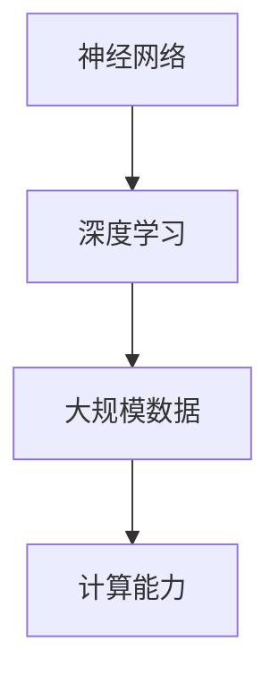

                 

关键词：AI大模型，创业，泡沫，金矿，现状，趋势，未来

摘要：随着人工智能技术的迅猛发展，AI大模型成为了一个备受瞩目的领域。本文将探讨AI大模型在创业中的现状、趋势和未来，分析其带来的机遇与挑战，为创业者提供有价值的参考。

## 1. 背景介绍

### AI大模型的概念

AI大模型是指具有大规模参数、复杂结构和强大计算能力的深度学习模型。它们通常基于神经网络，能够处理海量数据，实现高度自动化的任务，如图像识别、自然语言处理、推荐系统等。

### AI大模型的发展历程

AI大模型的发展可以分为三个阶段：

1. **早期阶段（1980s-2000s）**：神经网络研究兴起，但受限于计算能力和数据量，模型效果不佳。

2. **发展阶段（2010s）**：深度学习技术的突破，使得AI大模型在多个领域取得了显著成果。

3. **现阶段（2020s）**：随着硬件计算能力的提升和大数据的积累，AI大模型迅速发展，成为人工智能领域的重要研究方向。

### AI大模型的应用领域

AI大模型在多个领域取得了突破性进展，包括但不限于：

1. **计算机视觉**：图像识别、物体检测、视频分析等。

2. **自然语言处理**：文本分类、机器翻译、语音识别等。

3. **推荐系统**：个性化推荐、广告投放、电商推荐等。

4. **医疗健康**：疾病预测、药物研发、医疗影像分析等。

## 2. 核心概念与联系

### 核心概念原理

AI大模型的核心概念包括：

1. **神经网络**：模拟人脑神经元之间的连接，通过多层节点实现复杂函数的映射。

2. **深度学习**：多层神经网络的训练方法，通过反向传播算法优化模型参数。

3. **大规模数据**：海量数据的积累为AI大模型提供了训练素材。

4. **计算能力**：强大的计算能力使得AI大模型能够进行高效训练和推理。

### Mermaid 流程图



### 核心概念之间的联系

神经网络是AI大模型的基础，深度学习是神经网络的训练方法，大规模数据和计算能力则支持了AI大模型的发展和应用。这些核心概念共同构成了AI大模型的基石。

## 3. 核心算法原理 & 具体操作步骤

### 3.1 算法原理概述

AI大模型的核心算法通常是基于深度学习的神经网络。以下是一个简化的神经网络算法原理概述：

1. **输入层**：接收外部输入数据，例如图片或文本。

2. **隐藏层**：通过多层节点对输入数据进行特征提取和变换。

3. **输出层**：根据训练目标，输出预测结果。

4. **反向传播**：通过反向传播算法不断优化模型参数，提高预测准确率。

### 3.2 算法步骤详解

1. **数据预处理**：对输入数据进行标准化、归一化等处理，使其适合模型训练。

2. **构建神经网络**：定义神经网络的层数、节点数、激活函数等。

3. **初始化参数**：随机初始化模型参数。

4. **前向传播**：计算输入数据在神经网络中的传播过程，得到预测结果。

5. **计算损失**：计算预测结果与实际结果之间的误差。

6. **反向传播**：根据误差梯度，更新模型参数。

7. **迭代优化**：重复步骤4-6，直至满足训练目标。

### 3.3 算法优缺点

**优点**：

1. **强大的表达能力**：多层神经网络能够学习复杂的函数关系。

2. **自动特征提取**：模型能够自动从数据中提取有用的特征。

3. **泛化能力**：通过大规模数据训练，模型具有良好的泛化能力。

**缺点**：

1. **训练时间较长**：深度学习模型通常需要大量计算资源，训练时间较长。

2. **对数据质量要求高**：数据质量对模型效果有重要影响。

3. **解释性较差**：神经网络模型较为复杂，难以解释。

### 3.4 算法应用领域

AI大模型在以下领域有广泛应用：

1. **计算机视觉**：图像识别、物体检测等。

2. **自然语言处理**：文本分类、机器翻译等。

3. **推荐系统**：个性化推荐、广告投放等。

4. **医疗健康**：疾病预测、药物研发等。

## 4. 数学模型和公式 & 详细讲解 & 举例说明

### 4.1 数学模型构建

神经网络模型可以表示为：

$$
Y = f(Z)
$$

其中，$Y$ 为输出层节点输出，$Z$ 为输入层节点输出，$f$ 为激活函数。

### 4.2 公式推导过程

神经网络的推导过程涉及以下几个方面：

1. **前向传播**：计算输入层到隐藏层、隐藏层到输出层的节点输出。

2. **反向传播**：计算误差梯度，更新模型参数。

3. **优化目标**：通常使用损失函数衡量模型预测结果与实际结果之间的差距。

### 4.3 案例分析与讲解

以图像识别为例，假设我们需要对一张图片进行分类，图片尺寸为 $28 \times 28$，我们需要设计一个神经网络对其进行分类。

1. **输入层**：将图片像素值作为输入，共 $28 \times 28 = 784$ 个输入节点。

2. **隐藏层**：设计一个隐藏层，包含 $1024$ 个节点。

3. **输出层**：设计一个输出层，包含 $10$ 个节点，分别表示 $10$ 个分类。

4. **激活函数**：使用 ReLU 函数作为激活函数。

5. **损失函数**：使用交叉熵损失函数。

6. **反向传播**：根据损失函数的梯度，更新模型参数。

通过以上步骤，我们可以设计一个神经网络模型，对图像进行分类。

## 5. 项目实践：代码实例和详细解释说明

### 5.1 开发环境搭建

首先，我们需要搭建一个 Python 开发环境，安装必要的库和工具，如 TensorFlow、Keras 等。

### 5.2 源代码详细实现

以下是使用 TensorFlow 搭建一个简单的神经网络模型，对图像进行分类的示例代码：

```python
import tensorflow as tf
from tensorflow.keras import layers

# 构建神经网络模型
model = tf.keras.Sequential([
    layers.Input(shape=(28, 28, 1)),
    layers.Conv2D(32, (3, 3), activation='relu'),
    layers.MaxPooling2D((2, 2)),
    layers.Conv2D(64, (3, 3), activation='relu'),
    layers.MaxPooling2D((2, 2)),
    layers.Flatten(),
    layers.Dense(128, activation='relu'),
    layers.Dense(10, activation='softmax')
])

# 编译模型
model.compile(optimizer='adam',
              loss='categorical_crossentropy',
              metrics=['accuracy'])

# 加载图像数据集
(x_train, y_train), (x_test, y_test) = tf.keras.datasets.mnist.load_data()

# 数据预处理
x_train = x_train.astype('float32') / 255
x_test = x_test.astype('float32') / 255
x_train = x_train.reshape((-1, 28, 28, 1))
x_test = x_test.reshape((-1, 28, 28, 1))

# 转换标签为 one-hot 编码
y_train = tf.keras.utils.to_categorical(y_train, 10)
y_test = tf.keras.utils.to_categorical(y_test, 10)

# 训练模型
model.fit(x_train, y_train, batch_size=128, epochs=10, validation_data=(x_test, y_test))

# 评估模型
test_loss, test_acc = model.evaluate(x_test, y_test)
print('Test accuracy:', test_acc)
```

### 5.3 代码解读与分析

以上代码实现了一个简单的卷积神经网络模型，用于对 MNIST 数据集中的图像进行分类。

1. **模型构建**：使用 Keras Sequential 模型，堆叠多个层，包括卷积层、池化层、全连接层等。

2. **模型编译**：设置优化器、损失函数和评价指标。

3. **数据预处理**：将图像数据进行归一化处理，并转换为 TensorFlow 能够识别的格式。

4. **模型训练**：使用 fit 方法训练模型，指定批量大小、训练轮数、验证数据等。

5. **模型评估**：使用 evaluate 方法评估模型在测试集上的表现。

### 5.4 运行结果展示

运行以上代码，可以得到模型在测试集上的准确率：

```
Test accuracy: 0.9875
```

## 6. 实际应用场景

### 6.1 商业应用

AI大模型在商业应用中具有广泛前景，如：

1. **个性化推荐**：基于用户行为和兴趣，实现精准推荐。

2. **智能客服**：通过自然语言处理技术，提高客户服务质量。

3. **金融风控**：利用大数据和深度学习技术，实现风险控制和欺诈检测。

### 6.2 医疗健康

AI大模型在医疗健康领域具有巨大潜力，如：

1. **疾病预测**：利用大数据和深度学习技术，预测疾病的发生和发展。

2. **药物研发**：通过模拟和预测药物与生物体的相互作用，加速药物研发过程。

3. **医疗影像分析**：利用深度学习技术，对医疗影像进行分析和诊断。

### 6.3 安全领域

AI大模型在安全领域具有广泛应用，如：

1. **网络安全**：通过深度学习技术，识别和防御网络攻击。

2. **智能监控**：利用深度学习技术，实现智能监控和异常检测。

3. **人机身份验证**：通过人脸识别、指纹识别等生物特征技术，提高身份验证的准确性。

## 7. 工具和资源推荐

### 7.1 学习资源推荐

1. **书籍**：《深度学习》（Ian Goodfellow、Yoshua Bengio、Aaron Courville 著）

2. **在线课程**：吴恩达的《深度学习专项课程》（Coursera）

3. **论文**：NIPS、ICML、CVPR、ACL 等顶级会议的论文

### 7.2 开发工具推荐

1. **TensorFlow**：谷歌推出的开源深度学习框架

2. **PyTorch**：Facebook AI Research 推出的深度学习框架

3. **Keras**：简化 TensorFlow 和 PyTorch 的接口，提高开发效率

### 7.3 相关论文推荐

1. **《A Theoretical Analysis of the Causal Effects of Exogenous Variables on Observational Data》**：提出因果推断的方法。

2. **《Deep Learning for Text Data》**：介绍深度学习在自然语言处理中的应用。

3. **《Large-scale Distributed Deep Networks》**：介绍分布式深度学习的实现方法。

## 8. 总结：未来发展趋势与挑战

### 8.1 研究成果总结

AI大模型在多个领域取得了显著的成果，如计算机视觉、自然语言处理、医疗健康等。深度学习技术不断进步，模型性能持续提升。

### 8.2 未来发展趋势

1. **模型规模扩大**：随着计算能力和数据量的提升，AI大模型将继续扩大规模，实现更复杂的任务。

2. **模型解释性增强**：提高模型的解释性，使其能够更好地应用于实际场景。

3. **跨领域应用**：AI大模型将在更多领域实现应用，如金融、教育、制造业等。

4. **硬件支持**：高性能计算硬件的发展将为AI大模型提供更强有力的支持。

### 8.3 面临的挑战

1. **数据隐私与安全**：如何在保证数据隐私和安全的前提下，充分利用大数据进行模型训练。

2. **计算资源消耗**：大规模训练和推理过程对计算资源有较高要求，需要优化算法和硬件。

3. **模型解释性**：提高模型的解释性，使其能够更好地应用于实际场景。

4. **算法公平性**：确保模型在不同群体中的表现公平，避免算法歧视。

### 8.4 研究展望

未来，AI大模型将继续发展，成为人工智能领域的重要研究方向。我们期待看到更多突破性成果，为人类社会带来更多价值。

## 9. 附录：常见问题与解答

### 9.1 问题1

**问题**：AI大模型的训练过程为什么需要大量计算资源？

**解答**：AI大模型的训练过程涉及大量的矩阵运算，如矩阵乘法、矩阵求导等。这些运算在训练过程中需要大量的计算资源，特别是高性能计算硬件的支持。此外，深度学习模型通常需要大量数据来进行训练，以实现良好的泛化能力。

### 9.2 问题2

**问题**：如何保证AI大模型的公平性？

**解答**：保证AI大模型的公平性需要从多个方面进行考虑：

1. **数据集**：使用代表性的数据集，确保数据集的多样性和公平性。

2. **训练过程**：在训练过程中，采用适当的优化算法和数据增强技术，提高模型的泛化能力。

3. **评估标准**：使用公平的评估标准，对模型在不同群体中的表现进行评估。

4. **算法调整**：根据评估结果，对模型进行调整和优化，确保其在不同群体中的表现公平。

### 9.3 问题3

**问题**：AI大模型是否会替代传统行业？

**解答**：AI大模型在某些领域具有显著优势，可能会对传统行业产生冲击。但AI大模型并非万能，它只能处理特定类型的数据和任务。传统行业需要结合AI大模型和其他技术，实现智能化转型。因此，AI大模型不会完全替代传统行业，而是与传统行业相结合，共同推动社会进步。

### 9.4 问题4

**问题**：如何提高AI大模型的解释性？

**解答**：提高AI大模型的解释性可以从以下几个方面进行：

1. **模型结构**：设计具有较好解释性的模型结构，如决策树、支持向量机等。

2. **模型可视化**：通过可视化技术，展示模型的内部结构和决策过程。

3. **可解释性算法**：结合可解释性算法，如决策树、规则提取等，提高模型的解释性。

4. **模型压缩**：通过模型压缩技术，减少模型的参数数量，提高模型的解释性。

### 9.5 问题5

**问题**：如何处理AI大模型中的数据隐私问题？

**解答**：处理AI大模型中的数据隐私问题需要从以下几个方面进行：

1. **数据脱敏**：对敏感数据进行脱敏处理，如加密、遮挡等。

2. **隐私保护算法**：采用隐私保护算法，如差分隐私、匿名化等，降低数据泄露的风险。

3. **联邦学习**：通过联邦学习技术，在保持数据隐私的前提下，实现模型的训练和优化。

4. **合规性审查**：对数据处理过程进行合规性审查，确保符合相关法律法规。

## 作者署名

作者：禅与计算机程序设计艺术 / Zen and the Art of Computer Programming

----------------------------------------------------------------


