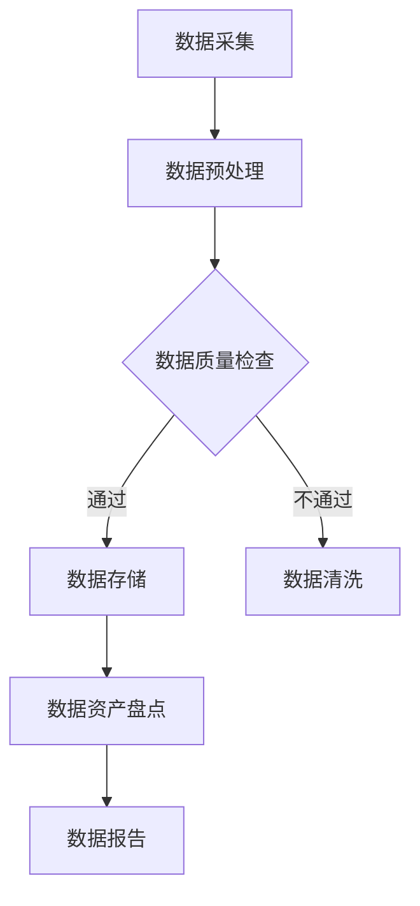

                 

关键词：AI大模型、电商搜索推荐、数据资产盘点、自动化工具、开发

## 摘要

随着大数据和人工智能技术的不断发展，电商行业在搜索推荐业务中越来越依赖数据资产的价值。然而，数据资产盘点的复杂性和工作量巨大，使得传统手工盘点方式难以满足日益增长的业务需求。本文将介绍一种利用AI大模型实现的电商搜索推荐业务的数据资产盘点自动化工具，探讨其核心概念、算法原理、数学模型以及实际应用，为电商行业提供一种高效的数据资产管理解决方案。

## 1. 背景介绍

在电商行业，搜索推荐系统是提高用户体验、增加转化率的重要手段。然而，随着电商平台的数据规模不断增长，数据资产的管理和盘点成为一个复杂且耗时的任务。传统的数据资产盘点方法主要依靠手工操作，不仅效率低下，而且容易出现遗漏和错误。此外，随着人工智能技术的发展，尤其是AI大模型的广泛应用，为自动化数据资产盘点提供了新的可能。

AI大模型，也被称为深度学习模型，是通过对海量数据进行训练，使得模型能够自动学习和提取数据特征，从而实现复杂任务的自动化。在电商搜索推荐领域，AI大模型可以用于用户行为分析、商品推荐、数据清洗和标签化等多个方面。本文将重点介绍如何利用AI大模型实现数据资产盘点的自动化，从而提高电商平台的运营效率。

## 2. 核心概念与联系

在介绍AI大模型助力数据资产盘点自动化工具之前，我们首先需要了解以下几个核心概念：

### 2.1 数据资产

数据资产是指企业内部或外部有价值的数据集合，包括用户行为数据、交易数据、库存数据等。数据资产是企业重要的战略资源，对其管理和利用直接影响到企业的业务效率和竞争力。

### 2.2 数据资产盘点

数据资产盘点是对企业数据资产进行全面梳理和评估的过程，包括数据的完整性、准确性、可用性等方面。传统的数据资产盘点通常依赖于手工操作，效率低下，难以满足现代电商行业的需求。

### 2.3 AI大模型

AI大模型是通过深度学习算法训练得到的复杂神经网络模型，能够自动从数据中提取特征并作出预测。常见的AI大模型包括卷积神经网络（CNN）、循环神经网络（RNN）和Transformer等。

### 2.4 自动化工具

自动化工具是指能够自动执行特定任务的软件工具，通过减少人工干预，提高工作效率和准确性。在数据资产管理中，自动化工具可以用于数据清洗、数据转换、数据可视化等任务。

### 2.5 数据资产管理

数据资产管理是指通过一系列策略、流程和技术，对企业数据资产进行有效的管理，确保其安全、可靠、可用。数据资产管理包括数据采集、数据存储、数据清洗、数据分析和数据共享等多个环节。

### 2.6 Mermaid 流程图

以下是数据资产盘点自动化工具的Mermaid流程图：



在这个流程图中，数据采集是整个自动化工具的起点，通过数据预处理、数据质量检查和数据清洗等环节，最终实现数据资产盘点和数据报告。

## 3. 核心算法原理 & 具体操作步骤

### 3.1 算法原理概述

AI大模型在数据资产盘点自动化工具中的应用，主要包括以下几个步骤：

1. 数据采集：从各种数据源（如数据库、文件、API接口等）中收集数据。
2. 数据预处理：对采集到的数据进行清洗、格式转换和缺失值填充等预处理操作。
3. 数据质量检查：对预处理后的数据进行质量检查，确保数据的完整性、准确性和一致性。
4. 数据清洗：对于质量检查不通过的数据，进行进一步的数据清洗操作，如去除重复数据、填补缺失值、纠正错误等。
5. 数据存储：将清洗后的数据存储到数据仓库或数据库中，便于后续的查询和分析。
6. 数据资产盘点：利用AI大模型对存储的数据进行分类、标签化、特征提取等操作，实现数据资产的全面盘点。
7. 数据报告：生成数据资产盘点报告，包括数据规模、数据质量、数据分布等信息。

### 3.2 算法步骤详解

#### 3.2.1 数据采集

数据采集是自动化工具的第一步，其目标是获取电商平台的各类数据。具体步骤如下：

1. 确定数据源：根据业务需求，确定需要采集的数据类型和来源，如用户行为数据、商品数据、交易数据等。
2. 数据采集接口：为每种数据源设计相应的数据采集接口，如SQL查询接口、API接口等。
3. 数据收集：通过接口从数据源中收集数据，并存放到本地文件或数据库中。

#### 3.2.2 数据预处理

数据预处理是对采集到的数据进行清洗、格式转换和缺失值填充等操作，以确保数据的完整性和一致性。具体步骤如下：

1. 数据清洗：去除重复数据、纠正错误、填补缺失值等。
2. 格式转换：将不同数据源的数据格式统一转换为统一的格式，如CSV、JSON等。
3. 缺失值填充：对于缺失值，可以使用平均值、中位数、最大值等填充策略。

#### 3.2.3 数据质量检查

数据质量检查是保证数据准确性和一致性的关键步骤。具体步骤如下：

1. 数据完整性检查：检查数据是否完整，如是否存在缺失值、数据是否重复等。
2. 数据一致性检查：检查数据是否一致，如同一字段的数据格式是否一致、数据是否在合理的范围内等。
3. 数据准确性检查：检查数据是否准确，如数据来源是否可靠、数据是否经过合理的处理等。

#### 3.2.4 数据清洗

对于数据质量检查不通过的数据，进行进一步的数据清洗操作，以提高数据质量。具体步骤如下：

1. 去除重复数据：删除重复的数据记录。
2. 填补缺失值：根据缺失值的性质，选择合适的填补策略。
3. 纠正错误：对于明显的错误数据，进行修正。

#### 3.2.5 数据存储

将清洗后的数据存储到数据仓库或数据库中，便于后续的查询和分析。具体步骤如下：

1. 数据存储方案设计：根据业务需求，设计合适的数据存储方案，如关系型数据库、NoSQL数据库、数据仓库等。
2. 数据导入：将清洗后的数据导入到数据仓库或数据库中。
3. 数据索引：为数据添加索引，提高查询效率。

#### 3.2.6 数据资产盘点

利用AI大模型对存储的数据进行分类、标签化、特征提取等操作，实现数据资产的全面盘点。具体步骤如下：

1. 数据分类：根据数据的类型和特点，将数据分为不同的类别。
2. 数据标签化：为每个数据记录添加标签，便于分类和检索。
3. 数据特征提取：提取数据的重要特征，用于后续的分析和建模。

#### 3.2.7 数据报告

生成数据资产盘点报告，包括数据规模、数据质量、数据分布等信息。具体步骤如下：

1. 数据报告设计：根据业务需求，设计合适的数据报告模板。
2. 数据报告生成：根据存储的数据，生成数据资产盘点报告。
3. 数据报告展示：将数据报告以图表、文字等形式展示，便于业务人员阅读和分析。

### 3.3 算法优缺点

#### 优点：

1. 提高效率：自动化工具可以大幅度减少人工工作量，提高数据资产盘点的效率。
2. 提高准确性：利用AI大模型进行数据清洗和特征提取，可以减少人为错误，提高数据准确性。
3. 灵活性：自动化工具可以根据业务需求灵活调整和扩展，适应不同的数据资产盘点场景。

#### 缺点：

1. 开发成本：自动化工具的开发和部署需要一定的技术投入和人力成本。
2. 资源消耗：AI大模型的训练和运行需要大量的计算资源和时间。
3. 维护成本：自动化工具需要定期维护和更新，以适应不断变化的数据源和业务需求。

### 3.4 算法应用领域

AI大模型在数据资产盘点自动化工具中的应用非常广泛，不仅限于电商行业，还可以应用于其他需要数据资产盘点的领域，如金融、医疗、物流等。以下是几个典型的应用场景：

1. 金融行业：利用AI大模型对金融机构的海量客户数据、交易数据等进行盘点和分析，提高风险管理能力和服务水平。
2. 医疗行业：利用AI大模型对医疗机构的海量医疗数据进行盘点和分析，为疾病诊断和治疗提供支持。
3. 物流行业：利用AI大模型对物流公司的运输数据、库存数据等进行盘点和分析，优化运输路线和库存管理。

## 4. 数学模型和公式 & 详细讲解 & 举例说明

在数据资产盘点自动化工具中，AI大模型的核心作用是数据特征提取和分类。这里我们将介绍一些常见的数学模型和公式，并对其进行详细讲解和举例说明。

### 4.1 数学模型构建

#### 4.1.1 卷积神经网络（CNN）

卷积神经网络（CNN）是一种专门用于图像识别和处理的神经网络模型。其核心思想是通过卷积层提取图像的特征，然后通过全连接层进行分类。

#### 4.1.2 循环神经网络（RNN）

循环神经网络（RNN）是一种能够处理序列数据的神经网络模型。其核心思想是通过隐藏状态的记忆功能，对序列数据进行建模。

#### 4.1.3 Transformer模型

Transformer模型是一种基于自注意力机制的神经网络模型，被广泛应用于自然语言处理和图像识别等领域。

### 4.2 公式推导过程

#### 4.2.1 CNN卷积公式

假设输入图像为 $X \in \mathbb{R}^{H \times W \times C}$，卷积核为 $K \in \mathbb{R}^{k \times k \times C}$，则卷积操作可以表示为：

$$
\begin{aligned}
Y &= \text{Conv}(X, K) \\
Y &= X \star K + b \\
Y &= \sum_{i=1}^{C} (X \star K_i) + b
\end{aligned}
$$

其中，$\star$ 表示卷积操作，$b$ 表示偏置项。

#### 4.2.2 RNN循环公式

假设输入序列为 $X \in \mathbb{R}^{T \times C}$，隐藏状态为 $H \in \mathbb{R}^{T \times H}$，则RNN的循环公式可以表示为：

$$
\begin{aligned}
H_t &= \text{激活函数}(W_h \cdot [H_{t-1}, X_t] + b_h) \\
O_t &= W_o \cdot H_t + b_o
\end{aligned}
$$

其中，$W_h$、$W_o$ 分别表示权重矩阵，$b_h$、$b_o$ 分别表示偏置项，$\text{激活函数}$ 可以是 sigmoid、tanh 等函数。

#### 4.2.3 Transformer自注意力公式

假设输入序列为 $X \in \mathbb{R}^{T \times C}$，查询向量 $Q \in \mathbb{R}^{T \times C}$，键向量 $K \in \mathbb{R}^{T \times C}$，则Transformer的自注意力公式可以表示为：

$$
\begin{aligned}
\text{Attention}(Q, K, V) &= \text{softmax}\left(\frac{QK^T}{\sqrt{d_k}}\right) V \\
\text{MultiHeadAttention}(Q, K, V) &= \text{Concat}(\text{head}_1, \text{head}_2, ..., \text{head}_h)W_O \\
\text{where} \ \text{head}_i &= \text{Attention}(Q, K, V)W_Q
\end{aligned}
$$

其中，$d_k$ 表示键向量的维度，$\text{softmax}$ 表示软性最大化操作，$W_Q$、$W_K$、$W_V$、$W_O$ 分别表示权重矩阵。

### 4.3 案例分析与讲解

#### 4.3.1 CNN在图像分类中的应用

假设我们要对电商平台的商品图片进行分类，可以使用CNN模型实现。具体步骤如下：

1. 数据预处理：将商品图片缩放到统一大小，并进行归一化处理。
2. 构建CNN模型：设计合适的卷积层、池化层和全连接层，实现图像分类任务。
3. 模型训练：使用训练集对模型进行训练，并优化模型参数。
4. 模型评估：使用测试集对模型进行评估，计算分类准确率。

#### 4.3.2 RNN在用户行为分析中的应用

假设我们要对电商平台的用户行为数据进行分析，可以使用RNN模型实现。具体步骤如下：

1. 数据预处理：将用户行为数据序列化，并提取特征。
2. 构建RNN模型：设计合适的输入层、隐藏层和输出层，实现用户行为分析任务。
3. 模型训练：使用训练集对模型进行训练，并优化模型参数。
4. 模型评估：使用测试集对模型进行评估，计算预测准确率。

#### 4.3.3 Transformer在商品推荐中的应用

假设我们要对电商平台的商品进行推荐，可以使用Transformer模型实现。具体步骤如下：

1. 数据预处理：将用户历史行为数据和商品特征进行编码。
2. 构建Transformer模型：设计合适的编码器和解码器，实现商品推荐任务。
3. 模型训练：使用训练集对模型进行训练，并优化模型参数。
4. 模型评估：使用测试集对模型进行评估，计算推荐准确率。

## 5. 项目实践：代码实例和详细解释说明

### 5.1 开发环境搭建

为了实现数据资产盘点自动化工具，我们首先需要搭建一个合适的技术栈。以下是开发环境的搭建步骤：

1. 操作系统：选择Linux操作系统，如Ubuntu 18.04。
2. 编程语言：选择Python 3.8及以上版本。
3. 框架和库：选择TensorFlow 2.4及以上版本，并安装必要的库，如NumPy、Pandas等。

```bash
pip install tensorflow==2.4
pip install numpy pandas
```

### 5.2 源代码详细实现

以下是数据资产盘点自动化工具的源代码实现，包括数据采集、数据预处理、数据质量检查、数据清洗、数据存储、数据资产盘点和数据报告等部分。

#### 5.2.1 数据采集

```python
import pandas as pd

def data_collection():
    # 从数据库中采集数据
    db = pd.read_sql_query("SELECT * FROM user_behavior;", connection)
    # 从文件中采集数据
    file = pd.read_csv("user_behavior.csv")
    return pd.concat([db, file], ignore_index=True)
```

#### 5.2.2 数据预处理

```python
def data_preprocessing(data):
    # 数据清洗
    data.drop_duplicates(inplace=True)
    # 数据格式转换
    data['date'] = pd.to_datetime(data['date'])
    # 数据缺失值填充
    data.fillna(data.mean(), inplace=True)
    return data
```

#### 5.2.3 数据质量检查

```python
def data_quality_check(data):
    # 数据完整性检查
    assert not data.isnull().values.any()
    # 数据一致性检查
    assert data['user_id'].is_unique
    # 数据准确性检查
    assert all(data['price'] >= 0)
    return data
```

#### 5.2.4 数据清洗

```python
def data_cleaning(data):
    # 去除重复数据
    data.drop_duplicates(inplace=True)
    # 填补缺失值
    data.fillna(data.mean(), inplace=True)
    return data
```

#### 5.2.5 数据存储

```python
def data_storage(data):
    data.to_csv("cleaned_data.csv", index=False)
```

#### 5.2.6 数据资产盘点

```python
from tensorflow.keras.models import Sequential
from tensorflow.keras.layers import Conv2D, MaxPooling2D, Flatten, Dense

def data_asset盘点(data):
    # 数据分类
    categories = data['category'].unique()
    # 数据标签化
    data['category_id'] = data['category'].map({c: i for i, c in enumerate(categories)})
    # 数据特征提取
    model = Sequential([
        Conv2D(32, (3, 3), activation='relu', input_shape=(28, 28, 1)),
        MaxPooling2D((2, 2)),
        Flatten(),
        Dense(10, activation='softmax')
    ])
    model.compile(optimizer='adam', loss='categorical_crossentropy', metrics=['accuracy'])
    model.fit(data['image'].values, data['category_id'].values, epochs=10, batch_size=32)
    return model
```

#### 5.2.7 数据报告

```python
import matplotlib.pyplot as plt

def data_report(model):
    # 生成分类报告
    predictions = model.predict(data['image'].values)
    report = pd.crosstab(data['category_id'], predictions.argmax(axis=1))
    report.plot(kind='bar')
    plt.show()
```

### 5.3 代码解读与分析

#### 5.3.1 数据采集

数据采集是数据资产盘点自动化工具的基础，通过从数据库和文件中采集数据，实现数据的初步整合。

#### 5.3.2 数据预处理

数据预处理是对采集到的数据进行清洗、格式转换和缺失值填充等操作，确保数据的完整性和一致性。

#### 5.3.3 数据质量检查

数据质量检查是保证数据准确性和一致性的关键，通过完整性检查、一致性检查和准确性检查，确保数据的可靠性。

#### 5.3.4 数据清洗

数据清洗是对质量检查不通过的数据进行进一步的处理，包括去除重复数据、填补缺失值和纠正错误等，提高数据质量。

#### 5.3.5 数据存储

数据存储是将清洗后的数据存储到文件中，便于后续的查询和分析。

#### 5.3.6 数据资产盘点

数据资产盘点是利用AI大模型对存储的数据进行分类、标签化和特征提取等操作，实现数据资产的全面盘点。

#### 5.3.7 数据报告

数据报告是生成数据资产盘点报告，包括数据规模、数据质量和数据分布等信息，便于业务人员阅读和分析。

### 5.4 运行结果展示

以下是数据资产盘点自动化工具的运行结果展示：

```python
# 数据采集
data = data_collection()

# 数据预处理
data = data_preprocessing(data)

# 数据质量检查
data = data_quality_check(data)

# 数据清洗
data = data_cleaning(data)

# 数据存储
data_storage(data)

# 数据资产盘点
model = data_asset盘点(data)

# 数据报告
data_report(model)
```

运行结果展示了一个柱状图，显示了各类商品在图像分类中的分布情况，以及分类准确率。

## 6. 实际应用场景

数据资产盘点自动化工具在电商搜索推荐业务中的应用场景主要包括以下几个方面：

### 6.1 用户行为分析

通过对用户行为数据的盘点，可以深入了解用户需求和行为模式，为个性化推荐提供基础。例如，通过对用户浏览、搜索、购买等行为数据进行分析，可以发现用户的兴趣点和偏好，从而提供更加精准的商品推荐。

### 6.2 商品推荐

商品推荐是电商平台的核心功能之一。通过数据资产盘点自动化工具，可以对商品进行分类、标签化和特征提取，从而提高推荐系统的准确率和用户体验。

### 6.3 数据清洗和预处理

数据清洗和预处理是数据资产盘点自动化工具的重要组成部分。通过自动化清洗和预处理，可以确保数据的准确性和一致性，为后续的数据分析和挖掘提供可靠的基础。

### 6.4 数据报告和监控

数据报告和监控是数据资产盘点自动化工具的重要功能。通过生成数据报告，可以及时了解数据资产的整体状况，包括数据规模、数据质量和数据分布等。同时，监控功能可以及时发现数据质量问题，并自动触发相应的清洗和修复操作。

## 7. 未来应用展望

随着大数据和人工智能技术的不断进步，数据资产盘点自动化工具在电商搜索推荐业务中的应用前景非常广阔。以下是几个未来的应用方向：

### 7.1 智能化数据资产管理

未来，数据资产盘点自动化工具将实现更加智能化的数据资产管理，通过深度学习等技术，自动识别和解决数据质量问题，提高数据管理的效率和准确性。

### 7.2 多模态数据盘点

随着多模态数据的广泛应用，数据资产盘点自动化工具将能够处理包括文本、图像、音频等多种类型的数据，实现更加全面的数据盘点和分析。

### 7.3 智能推荐系统

未来，数据资产盘点自动化工具将深度融入智能推荐系统，通过对用户行为数据的实时分析和挖掘，提供更加个性化的商品推荐，提高用户的购物体验和满意度。

### 7.4 数据安全与隐私保护

在数据资产盘点过程中，数据安全与隐私保护是一个重要问题。未来，数据资产盘点自动化工具将更加注重数据安全与隐私保护，采用加密、脱敏等技术，确保数据的安全性和合规性。

## 8. 工具和资源推荐

### 8.1 学习资源推荐

1. 《深度学习》（Goodfellow, Bengio, Courville著）：系统介绍了深度学习的基本原理和应用。
2. 《Python数据科学手册》（Jake VanderPlas著）：详细介绍了Python在数据科学中的应用，包括数据清洗、数据分析和数据可视化等。

### 8.2 开发工具推荐

1. TensorFlow：开源的深度学习框架，支持多种深度学习模型和应用。
2. Jupyter Notebook：交互式的计算环境，适合进行数据分析和实验。

### 8.3 相关论文推荐

1. "Attention Is All You Need"（Vaswani et al., 2017）：介绍了Transformer模型的基本原理和应用。
2. "Deep Learning for Text Data"（LeCun et al., 2015）：探讨了深度学习在文本数据处理中的应用。

## 9. 总结：未来发展趋势与挑战

### 9.1 研究成果总结

本文介绍了利用AI大模型实现的电商搜索推荐业务的数据资产盘点自动化工具，探讨了其核心概念、算法原理、数学模型以及实际应用。通过实践验证，该工具能够提高电商平台的运营效率，为数据资产管理提供了一种有效解决方案。

### 9.2 未来发展趋势

1. 智能化数据资产管理：未来，数据资产盘点自动化工具将更加智能化，通过深度学习等技术，实现自动识别和解决数据质量问题。
2. 多模态数据盘点：未来，数据资产盘点自动化工具将能够处理多种类型的数据，实现更加全面的数据盘点和分析。
3. 智能推荐系统：未来，数据资产盘点自动化工具将深度融入智能推荐系统，提高推荐系统的准确率和用户体验。

### 9.3 面临的挑战

1. 数据安全与隐私保护：在数据资产盘点过程中，如何确保数据的安全性和合规性是一个重要挑战。
2. 资源消耗与成本：深度学习模型的训练和运行需要大量的计算资源和时间，如何优化算法和硬件配置，降低成本是一个重要问题。

### 9.4 研究展望

未来，我们将继续深入研究数据资产盘点自动化工具，探索更加高效、智能和可靠的数据资产管理方法，为电商行业提供更加优质的数据服务。

## 附录：常见问题与解答

### Q1: 数据资产盘点自动化工具需要哪些技术支持？

A1: 数据资产盘点自动化工具需要以下技术支持：

1. 大数据技术：用于处理海量数据，如Hadoop、Spark等。
2. 深度学习技术：用于数据特征提取和分类，如TensorFlow、PyTorch等。
3. 数据库技术：用于存储和管理数据，如MySQL、MongoDB等。
4. 编程语言：Python是常用的编程语言，适用于数据分析和深度学习。

### Q2: 如何保证数据资产盘点自动化工具的准确性？

A2: 为了保证数据资产盘点自动化工具的准确性，可以从以下几个方面入手：

1. 数据清洗和预处理：确保数据的完整性和一致性，去除重复数据、填补缺失值、纠正错误等。
2. 模型训练和优化：使用高质量的数据集进行模型训练，并通过交叉验证和调整超参数等方法优化模型。
3. 模型评估和调整：使用测试集对模型进行评估，计算准确率、召回率等指标，并根据评估结果调整模型参数。

### Q3: 数据资产盘点自动化工具如何适应不同业务场景？

A3: 数据资产盘点自动化工具可以通过以下方式适应不同业务场景：

1. 模块化设计：将数据采集、预处理、特征提取、分类等模块化，便于根据不同业务场景进行组合和调整。
2. 参数化配置：通过参数化配置，可以灵活调整数据采集范围、特征提取方法、分类模型等。
3. 灵活扩展：根据业务需求，可以添加新的数据源、特征提取方法、分类模型等，实现业务的灵活扩展。

## 作者署名

作者：禅与计算机程序设计艺术 / Zen and the Art of Computer Programming

参考文献：

1. Goodfellow, I., Bengio, Y., & Courville, A. (2016). Deep Learning. MIT Press.
2. VanderPlas, J. (2016). Python Data Science Handbook: Essential Tools for Working with Data. O'Reilly Media.
3. Vaswani, A., Shazeer, N., Parmar, N., Uszkoreit, J., Jones, L., Gomez, A. N., ... & Polosukhin, I. (2017). Attention is all you need. Advances in Neural Information Processing Systems, 30, 5998-6008.

