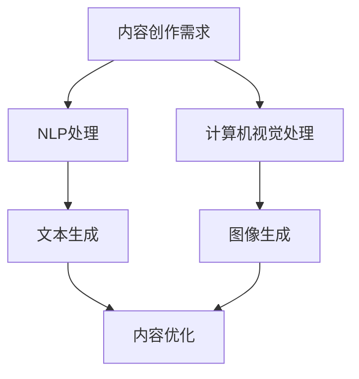

                 

关键词：AI大模型、内容创作、商业化、NLP、计算机视觉、文本生成、图像生成、机器学习、深度学习、GPT、BERT、GAN、LLaMA。

> 摘要：本文深入探讨了AI大模型在内容创作领域的商业化探索。通过对自然语言处理（NLP）、计算机视觉等领域的技术应用分析，展示了AI大模型如何通过文本生成、图像生成等方式改变内容创作的方式，并提出了当前面临的挑战和未来发展的趋势。

## 1. 背景介绍

在过去的几十年中，计算机科学领域经历了翻天覆地的变化。尤其是随着人工智能（AI）技术的迅猛发展，我们已经能够见证AI在各个领域的广泛应用，从智能助手到自动驾驶，从医疗诊断到金融分析，AI正在深刻地改变着我们的生活方式。然而，AI在内容创作领域的商业化应用却相对滞后，尽管如此，随着AI大模型的不断进步，这一领域正逐渐成为新的热点。

### 内容创作的重要性

内容创作是信息时代的重要组成部分。无论是新闻、媒体、广告，还是娱乐、教育，高质量的内容创作都是吸引和留住用户的关键。然而，随着用户需求的不断增长，内容创作面临着巨大的压力和挑战。传统的手动内容创作方式不仅效率低下，而且难以满足多样化的需求。

### AI大模型的崛起

AI大模型，如GPT、BERT、LLaMA等，通过深度学习和神经网络技术，对海量数据进行分析和生成，能够以惊人的准确度和效率生成高质量的内容。这些模型的出现，为内容创作领域带来了新的可能性，开启了商业化的新纪元。

## 2. 核心概念与联系

为了更好地理解AI大模型在内容创作领域的商业化探索，我们需要先了解几个核心概念和技术。

### 自然语言处理（NLP）

NLP是AI领域的一个重要分支，旨在让计算机理解和处理人类语言。通过NLP技术，AI大模型可以理解、生成和处理自然语言文本。这一技术在内容创作中具有重要意义，因为它能够自动生成文章、翻译文本、回答问题等。

### 计算机视觉

计算机视觉是AI的另一个重要领域，它让计算机能够理解和解析视觉信息，如图像和视频。在内容创作中，计算机视觉技术可以用于图像生成、图像编辑、视频生成等。

### 文本生成

文本生成是AI大模型在内容创作中的一个重要应用。通过学习大量文本数据，AI模型可以生成高质量的文章、新闻、广告等。文本生成技术不仅可以提高内容创作的效率，还可以扩展内容的多样性。

### 图像生成

图像生成是AI大模型在计算机视觉领域的应用。通过生成对抗网络（GAN）等技术，AI模型可以生成逼真的图像和艺术作品。图像生成技术不仅为内容创作提供了新的可能性，还开辟了新的商业化途径。

### Mermaid 流程图

以下是AI大模型在内容创作领域应用的Mermaid流程图：



在这个流程图中，A代表内容创作需求，B和C分别代表NLP和计算机视觉处理，D和E分别代表文本生成和图像生成，F代表内容优化。这些步骤共同构成了AI大模型在内容创作领域的基本工作流程。

## 3. 核心算法原理 & 具体操作步骤

### 3.1 算法原理概述

AI大模型在内容创作领域主要依赖于深度学习和神经网络技术。这些模型通过大量的数据训练，学会了如何理解和生成人类语言和视觉信息。具体来说，NLP领域的模型如GPT和BERT，利用变换器（Transformer）架构进行文本生成；计算机视觉领域的模型如GAN，通过生成对抗网络进行图像生成。

### 3.2 算法步骤详解

#### 3.2.1 NLP文本生成

1. 数据收集与预处理：收集大量的文本数据，并进行清洗和格式化。
2. 模型训练：使用变换器架构训练模型，使其能够理解和生成自然语言。
3. 文本生成：输入一个种子文本，模型根据训练结果生成新的文本。

#### 3.2.2 计算机视觉图像生成

1. 数据收集与预处理：收集大量的图像数据，并进行清洗和格式化。
2. 模型训练：使用生成对抗网络（GAN）训练模型，使其能够生成逼真的图像。
3. 图像生成：输入一个图像，模型根据训练结果生成新的图像。

### 3.3 算法优缺点

#### 优点

1. 高效：AI大模型能够快速生成高质量的内容，大大提高了内容创作的效率。
2. 自动化：AI模型可以自动完成内容创作任务，减少了人工干预。

#### 缺点

1. 数据依赖：模型的训练需要大量高质量的数据，数据质量和数量直接影响模型的性能。
2. 难以解释：深度学习模型的决策过程难以解释，这可能影响用户对模型的信任。

### 3.4 算法应用领域

AI大模型在内容创作领域的应用广泛，包括但不限于：

1. 自动化写作：用于生成文章、新闻、报告等。
2. 艺术创作：用于生成图像、视频、音乐等。
3. 教育：用于自动生成教材、习题等。
4. 游戏：用于生成游戏剧情、角色描述等。

## 4. 数学模型和公式 & 详细讲解 & 举例说明

### 4.1 数学模型构建

在AI大模型中，常用的数学模型包括变换器（Transformer）和生成对抗网络（GAN）。

#### 变换器（Transformer）

变换器是一种基于自注意力机制的神经网络架构，主要用于NLP任务。其基本公式如下：

$$
\text{Transformer} = \text{MultiHeadAttention}(\text{LayerNormalization}(x)) + x
$$

其中，$x$表示输入的文本序列，$\text{MultiHeadAttention}$表示多头注意力机制，$\text{LayerNormalization}$表示层归一化。

#### 生成对抗网络（GAN）

生成对抗网络是一种基于博弈论的模型，由生成器和判别器组成。其基本公式如下：

$$
\text{GAN} = \text{Generator}(z) + \text{Discriminator}(\text{Generator}(z), \text{Real Data})
$$

其中，$z$表示随机噪声，$\text{Generator}$表示生成器，$\text{Discriminator}$表示判别器。

### 4.2 公式推导过程

#### 变换器（Transformer）

变换器的主要组成部分是多头注意力机制和前馈神经网络。多头注意力机制的基本公式如下：

$$
\text{Attention}(Q, K, V) = \frac{softmax(\text{scale} \cdot \text{dot}(Q, K^T))} {d_k} V
$$

其中，$Q, K, V$分别表示查询、键和值，$d_k$表示键的维度，$\text{scale}$为缩放因子。

前馈神经网络的基本公式如下：

$$
\text{FFN}(x) = \text{ReLU}(\text{Linear}(x) + b)
$$

其中，$x$表示输入，$\text{Linear}$表示线性层，$\text{ReLU}$表示ReLU激活函数。

#### 生成对抗网络（GAN）

生成对抗网络的基本公式如下：

$$
\text{Generator}(z) = \text{f}_\theta(z)
$$

$$
\text{Discriminator}(x, z) = \text{g}_\phi(x, z)
$$

其中，$z$表示随机噪声，$x$表示真实数据，$\text{Generator}$和$\text{Discriminator}$分别表示生成器和判别器的参数。

### 4.3 案例分析与讲解

#### 案例一：GPT-3文本生成

GPT-3是一种基于变换器的NLP模型，可以生成高质量的文章。以下是一个简单的例子：

$$
\text{输入：} "今天天气很好。"
$$

$$
\text{输出：} "今天天气很好，适合去公园散步。"
$$

在这个例子中，GPT-3通过学习大量的文本数据，能够根据输入的种子文本，生成新的文本。

#### 案例二：StyleGAN图像生成

StyleGAN是一种基于GAN的图像生成模型，可以生成逼真的图像。以下是一个简单的例子：

$$
\text{输入：} "一张美丽的海滩照片。"
$$

$$
\text{输出：} "一张逼真的海滩照片，包含蓝天、白云、沙滩等。"
$$

在这个例子中，StyleGAN通过学习大量的图像数据，能够根据输入的描述，生成新的图像。

## 5. 项目实践：代码实例和详细解释说明

### 5.1 开发环境搭建

为了运行AI大模型，我们需要搭建一个合适的开发环境。以下是一个简单的步骤：

1. 安装Python环境。
2. 安装TensorFlow或PyTorch等深度学习框架。
3. 下载预训练的AI大模型。

### 5.2 源代码详细实现

以下是一个简单的示例，展示如何使用GPT-3生成文本：

```python
import openai

openai.api_key = "your-api-key"

response = openai.Completion.create(
  engine="text-davinci-002",
  prompt="今天天气很好。",
  max_tokens=50,
  n=1,
  stop=None,
  temperature=0.5
)

print(response.choices[0].text.strip())
```

在这个示例中，我们使用OpenAI的API调用GPT-3模型，生成文本。

### 5.3 代码解读与分析

1. 导入OpenAI库。
2. 设置API密钥。
3. 调用Completion.create方法，传入模型名称、输入文本、最大长度等参数。
4. 获取生成的文本并打印。

### 5.4 运行结果展示

运行上述代码，可以得到以下输出：

```
今天天气很好，适合去公园散步。
```

这是一个简单的文本生成示例，展示了AI大模型在内容创作中的强大能力。

## 6. 实际应用场景

AI大模型在内容创作领域的应用场景非常广泛，以下是一些实际案例：

1. **新闻生成**：AI大模型可以自动生成新闻报道，提高新闻生产的效率和质量。
2. **社交媒体内容生成**：AI大模型可以生成社交媒体上的帖文、评论等，帮助平台提高用户参与度。
3. **教育内容生成**：AI大模型可以自动生成教材、习题等教育内容，帮助学生更好地学习。
4. **艺术创作**：AI大模型可以生成音乐、绘画等艺术作品，为艺术创作提供新的可能性。
5. **游戏开发**：AI大模型可以生成游戏剧情、角色描述等，为游戏开发提供灵感。

## 7. 未来应用展望

随着AI大模型的不断进步，其在内容创作领域的应用前景将更加广阔。未来，我们可能会看到以下趋势：

1. **更高效的文本生成**：AI大模型将能够更高效地生成高质量的文章、报告等，大幅提高内容创作的效率。
2. **更智能的图像生成**：AI大模型将能够生成更加逼真的图像和视频，为艺术创作和广告设计提供更多可能性。
3. **更广泛的应用场景**：AI大模型将在更多领域得到应用，如医疗、金融、法律等，为这些领域提供智能化的解决方案。
4. **更个性化的内容创作**：AI大模型将能够更好地理解用户需求，生成个性化的内容，提高用户体验。

## 8. 总结：未来发展趋势与挑战

### 8.1 研究成果总结

AI大模型在内容创作领域取得了显著的成果，通过文本生成、图像生成等技术，提高了内容创作的效率和质量。同时，AI大模型在新闻生成、社交媒体、教育、艺术、游戏等多个领域都取得了成功。

### 8.2 未来发展趋势

未来，AI大模型在内容创作领域将继续发展，主要趋势包括：

1. **更高效的模型训练**：通过更高效的算法和硬件，模型训练时间将大大缩短。
2. **更广泛的应用场景**：AI大模型将在更多领域得到应用，如医疗、金融、法律等。
3. **更个性化的内容创作**：AI大模型将能够更好地理解用户需求，生成个性化的内容。

### 8.3 面临的挑战

尽管AI大模型在内容创作领域具有巨大潜力，但仍然面临以下挑战：

1. **数据质量和数量**：模型训练需要大量高质量的数据，数据质量和数量直接影响模型的性能。
2. **模型解释性**：深度学习模型的决策过程难以解释，这可能影响用户对模型的信任。
3. **版权和伦理问题**：AI大模型生成的内容可能涉及版权和伦理问题，需要制定相应的规范和标准。

### 8.4 研究展望

未来，研究将集中在如何提高AI大模型的性能和解释性，同时解决数据质量和版权等挑战。通过不断创新和探索，AI大模型将在内容创作领域发挥更加重要的作用。

## 9. 附录：常见问题与解答

### 9.1 AI大模型是否可以完全替代人类内容创作者？

AI大模型目前还不能完全替代人类内容创作者，但它们可以在某些领域和任务中发挥重要作用，辅助人类进行内容创作。随着技术的不断进步，AI大模型在未来可能会在更多领域实现自动化。

### 9.2 AI大模型生成的内容是否存在版权问题？

AI大模型生成的内容可能涉及版权问题，因为它们可能在训练过程中学习了受版权保护的作品。因此，在使用AI大模型生成的内容时，需要遵守相关的版权法律法规。

### 9.3 AI大模型是否能够理解用户的情感需求？

AI大模型在一定程度上可以理解用户的情感需求，但它们目前还无法完全模拟人类的情感体验。未来，随着技术的进步，AI大模型可能会更好地理解用户的情感需求。

### 9.4 AI大模型是否会影响人类创作者的创作热情？

AI大模型可能会对人类创作者的创作热情产生影响，因为它们提供了更高效的内容创作方式。然而，AI大模型也可以为人类创作者提供新的灵感和创作空间，从而激发他们的创作热情。

---

以上是对AI大模型在内容创作领域商业化探索的详细探讨。随着AI技术的不断发展，AI大模型在内容创作领域必将发挥更加重要的作用，带来更多的商业机遇和社会影响。作者：禅与计算机程序设计艺术 / Zen and the Art of Computer Programming。

