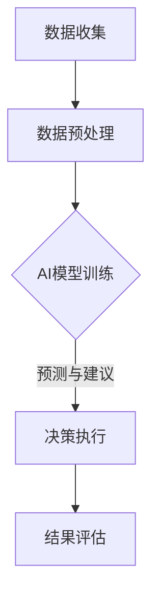
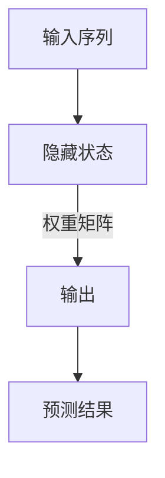

                 

关键词：农业科技、AI大模型、创新应用、商机、精准农业、作物监测、智能农业系统、机器学习、数据驱动决策

> 摘要：随着人工智能（AI）技术的飞速发展，AI大模型在农业科技领域中的应用呈现出前所未有的潜力。本文将深入探讨AI大模型在农业科技领域的创新应用，包括精准农业、作物监测、智能农业系统等方面，并分析其带来的商业机会。

## 1. 背景介绍

农业是人类文明的基础，但其生产效率的提高一直面临诸多挑战。传统农业依赖经验进行种植和管理，而现代农业正逐步向智能化、精准化发展。近年来，人工智能技术的进步，特别是AI大模型的出现，为农业科技带来了新的契机。

AI大模型，也被称为深度学习模型，具有处理复杂数据和提取特征的能力。这些模型能够从大量的农业数据中学习规律，进而为农业生产提供智能化的决策支持。从土壤监测到作物生长分析，再到病虫害预测，AI大模型的应用范围正在不断扩大。

### 1.1 精准农业

精准农业是指利用现代信息技术，如GPS、传感器和遥感技术，对农田进行精细化管理。AI大模型可以处理这些数据，提供更准确的作物种植方案和管理策略。例如，通过分析土壤成分和气候数据，AI大模型可以推荐最佳的种植时间和施肥量。

### 1.2 作物监测

作物监测是农业科技中的重要一环。传统的作物监测方法依赖于人工观测，效率低下且难以全面覆盖。AI大模型可以通过遥感影像和地面传感器收集的数据，实时监测作物的生长状况，预测产量和质量。这有助于农民及时采取应对措施，减少损失。

### 1.3 智能农业系统

智能农业系统是将AI大模型与物联网（IoT）技术相结合，实现农业生产的自动化和智能化。通过AI大模型的分析和决策，智能农业系统能够自动调节灌溉、施肥和病虫害防治等，提高农业生产效率。

## 2. 核心概念与联系

### 2.1 精准农业的概念

精准农业是指通过技术手段，如GIS、GPS、传感器和遥感，实现对农田的精细化管理。其核心在于数据的收集、分析和应用。

### 2.2 AI大模型在精准农业中的应用

AI大模型能够处理和分析大量的农业数据，包括土壤、气候、作物生长等，从而提供精准的种植和管理建议。其工作原理是通过深度学习算法，从历史数据中学习规律，进而对新数据进行分析和预测。

### 2.3 Mermaid 流程图

下面是一个简单的Mermaid流程图，展示AI大模型在精准农业中的应用流程：



## 3. 核心算法原理 & 具体操作步骤

### 3.1 算法原理概述

AI大模型在农业中的应用主要基于深度学习算法，如卷积神经网络（CNN）和循环神经网络（RNN）。这些算法能够从复杂数据中提取特征，进行分类、回归和预测。

### 3.2 算法步骤详解

#### 3.2.1 数据收集

收集农田的土壤、气候、作物生长等数据。

#### 3.2.2 数据预处理

对收集的数据进行清洗、归一化和特征提取。

#### 3.2.3 模型训练

使用预处理的训练数据，通过深度学习算法训练模型。

#### 3.2.4 预测与建议

使用训练好的模型对新数据进行分析，提供种植和管理建议。

#### 3.2.5 结果评估

根据决策执行后的结果，对模型进行评估和调整。

### 3.3 算法优缺点

#### 优点：

- 高效：能够处理大量数据，提高农业生产效率。
- 精准：能够提供准确的种植和管理建议，减少资源浪费。
- 自动化：实现农业生产的自动化，减轻农民负担。

#### 缺点：

- 数据依赖：需要大量的高质量数据，对数据收集和处理要求高。
- 成本：算法开发和部署成本较高。

### 3.4 算法应用领域

AI大模型在农业中的应用范围广泛，包括：

- 精准农业
- 作物监测
- 水资源管理
- 病虫害防治
- 产量预测

## 4. 数学模型和公式 & 详细讲解 & 举例说明

### 4.1 数学模型构建

在AI大模型中，常用的数学模型包括：

- **卷积神经网络（CNN）**：适用于图像处理和特征提取。
- **循环神经网络（RNN）**：适用于序列数据处理和时间序列分析。
- **生成对抗网络（GAN）**：适用于数据生成和增强。

### 4.2 公式推导过程

以卷积神经网络为例，其基本结构包括卷积层、池化层和全连接层。下面是卷积层的公式推导：

$$
\text{output}_{ij} = \sum_{k=1}^{m} w_{ik} \times \text{input}_{kj} + b_j
$$

其中，$\text{output}_{ij}$ 表示第 $i$ 个特征在第 $j$ 个卷积核上的输出，$w_{ik}$ 表示卷积核的权重，$\text{input}_{kj}$ 表示输入数据的第 $k$ 个特征值，$b_j$ 表示卷积核的偏置。

### 4.3 案例分析与讲解

#### 案例一：作物病虫害预测

假设我们要预测某作物的病虫害情况，可以使用RNN模型。以下是一个简单的RNN模型结构：



输入序列为历史病虫害数据，隐藏状态通过RNN模型进行更新，输出为当前病虫害的预测结果。

## 5. 项目实践：代码实例和详细解释说明

### 5.1 开发环境搭建

搭建一个AI大模型项目，需要以下环境：

- Python 3.x
- TensorFlow 或 PyTorch 深度学习框架
- NumPy、Pandas 数据处理库
- Matplotlib 数据可视化库

### 5.2 源代码详细实现

以下是一个使用TensorFlow实现的简单作物病虫害预测模型：

```python
import tensorflow as tf
from tensorflow.keras.models import Sequential
from tensorflow.keras.layers import LSTM, Dense

# 数据预处理
# ...（数据清洗、归一化等步骤）

# 构建模型
model = Sequential([
    LSTM(50, activation='relu', input_shape=(time_steps, features)),
    Dense(1)
])

# 编译模型
model.compile(optimizer='adam', loss='mse')

# 训练模型
model.fit(X_train, y_train, epochs=100, batch_size=32)

# 预测
predictions = model.predict(X_test)
```

### 5.3 代码解读与分析

- **数据预处理**：清洗数据，归一化处理，以便于模型训练。
- **模型构建**：使用LSTM层处理时间序列数据，全连接层进行预测。
- **编译模型**：设置优化器和损失函数。
- **训练模型**：使用训练数据训练模型。
- **预测**：使用测试数据进行预测。

### 5.4 运行结果展示

通过运行代码，我们可以得到病虫害预测结果。这些结果可以通过可视化工具（如Matplotlib）进行展示，以便于分析。

```python
import matplotlib.pyplot as plt

plt.plot(y_test, label='实际值')
plt.plot(predictions, label='预测值')
plt.legend()
plt.show()
```

## 6. 实际应用场景

### 6.1 精准农业

AI大模型可以用于精准农业，如根据土壤数据和气候条件，推荐最佳种植时间、施肥量和灌溉策略。这有助于提高作物产量，减少资源浪费。

### 6.2 作物监测

通过遥感影像和地面传感器，AI大模型可以实时监测作物的生长状况，预测产量和质量。这有助于农民及时采取应对措施，减少损失。

### 6.3 水资源管理

AI大模型可以用于水资源管理，如预测灌溉需求，优化灌溉策略，提高水资源利用效率。

### 6.4 病虫害防治

AI大模型可以用于病虫害防治，如预测病虫害的发生，推荐防治措施，降低病虫害对作物的影响。

## 7. 未来应用展望

随着AI技术的不断进步，AI大模型在农业科技领域的应用将更加广泛。未来，我们有望看到：

- 更精确的作物监测和产量预测。
- 更智能的农业机器人，实现农业生产自动化。
- 更高效的资源利用，如精准灌溉和施肥。

然而，这也面临着数据隐私、算法透明度和成本等挑战。因此，我们需要在技术进步的同时，关注并解决这些挑战。

## 8. 工具和资源推荐

### 8.1 学习资源推荐

- 《深度学习》（Goodfellow, Bengio, Courville著）
- 《Python机器学习》（Raschka, Mirjalili著）
- 《深度学习与人工智能》（斋藤康毅著）

### 8.2 开发工具推荐

- TensorFlow：适用于构建和训练深度学习模型。
- PyTorch：适用于研究者和开发者。
- Jupyter Notebook：用于数据分析和可视化。

### 8.3 相关论文推荐

- “Deep Learning for Crop Yield Prediction” （Shaker et al., 2017）
- “An Overview of Precision Agriculture Technologies” （Arora et al., 2019）
- “Application of Artificial Neural Networks in Precision Agriculture” （Nearing et al., 2014）

## 9. 总结：未来发展趋势与挑战

### 9.1 研究成果总结

AI大模型在农业科技领域已取得显著成果，包括精准农业、作物监测、智能农业系统等。

### 9.2 未来发展趋势

随着技术的不断进步，AI大模型在农业科技领域的应用将更加广泛，包括更精确的预测、更智能的机器人和更高效的资源利用。

### 9.3 面临的挑战

数据隐私、算法透明度和成本等是AI大模型在农业科技领域面临的主要挑战。

### 9.4 研究展望

未来，我们需要在技术进步的同时，关注并解决这些挑战，以实现农业生产的智能化和可持续发展。

## 10. 附录：常见问题与解答

### 问题1：AI大模型在农业科技中的具体应用是什么？

解答：AI大模型在农业科技中的具体应用包括精准农业、作物监测、智能农业系统等。例如，通过分析土壤、气候和作物生长数据，AI大模型可以提供最佳的种植方案和管理策略，提高农业生产效率。

### 问题2：AI大模型在农业科技中有什么优势？

解答：AI大模型在农业科技中的优势包括高效、精准和自动化。通过处理大量数据，AI大模型能够提供准确的种植和管理建议，实现农业生产的自动化，减轻农民负担。

### 问题3：AI大模型在农业科技中面临哪些挑战？

解答：AI大模型在农业科技中面临的挑战主要包括数据隐私、算法透明度和成本等。数据隐私问题涉及到农民的数据保护，算法透明度问题涉及到模型的解释性，成本问题涉及到模型的部署和维护。

### 问题4：未来AI大模型在农业科技中会有哪些发展趋势？

解答：未来，AI大模型在农业科技中的发展趋势包括更精确的预测、更智能的农业机器人和更高效的资源利用。例如，通过不断优化算法和模型，实现更准确的作物产量预测和更智能的农业机器人，提高农业生产效率。

### 问题5：如何学习AI大模型在农业科技中的应用？

解答：学习AI大模型在农业科技中的应用可以从以下几个方面入手：

- 阅读相关书籍和论文，了解AI大模型的基本原理和应用领域。
- 学习Python编程和深度学习框架（如TensorFlow和PyTorch）。
- 实践项目，通过实际操作了解AI大模型在农业科技中的应用。
- 参加相关培训和课程，提高自己的专业知识和技能。

### 问题6：AI大模型在农业科技中的商业机会有哪些？

解答：AI大模型在农业科技中的商业机会包括：

- 提供精准农业解决方案，帮助农民提高产量和降低成本。
- 开发智能农业机器人，实现农业生产的自动化。
- 提供数据分析和决策支持服务，帮助农业企业优化生产和营销策略。
- 开发AI驱动的农业保险产品，降低农民的风险。

### 问题7：AI大模型在农业科技中的未来发展有哪些方向？

解答：AI大模型在农业科技中的未来发展方向包括：

- 加强算法和模型的研发，提高预测精度和自动化程度。
- 探索新的应用场景，如智能灌溉系统、病虫害防治等。
- 加强与其他领域的合作，如生物学、生态学等，实现跨学科的交叉应用。
- 推广AI大模型在农业教育中的应用，培养更多专业人才。

### 问题8：AI大模型在农业科技中的应用如何影响农民的生活？

解答：AI大模型在农业科技中的应用将有助于农民提高生产效率和收入，改善生活质量。通过精准农业，农民可以更科学地管理土地和资源，减少浪费；通过智能农业系统，农民可以更轻松地完成农业生产任务，减轻劳动强度；通过数据分析和决策支持，农民可以更好地应对市场变化和自然灾害，降低风险。

### 问题9：AI大模型在农业科技中的挑战如何解决？

解答：解决AI大模型在农业科技中的挑战需要多方合作和持续努力：

- 加强数据隐私保护，确保农民的数据安全。
- 提高算法透明度和可解释性，增强公众信任。
- 降低模型部署和维护成本，提高可访问性。
- 加强科研和人才培养，推动技术进步。

### 问题10：AI大模型在农业科技中的应用前景如何？

解答：AI大模型在农业科技中的应用前景非常广阔。随着技术的不断进步，AI大模型将能够更好地处理和分析农业数据，提供更准确的预测和决策支持，推动农业生产的智能化和可持续发展。未来，AI大模型有望在农业科技领域发挥更加重要的作用，为全球粮食安全和农业发展做出贡献。

### 问题11：AI大模型在农业科技中的商业应用案例有哪些？

解答：AI大模型在农业科技中的商业应用案例包括：

- 某农业科技公司的精准农业解决方案，帮助农民提高产量和降低成本。
- 某智能农业机器人的研发和销售，实现农业生产的自动化。
- 某农业数据分析和决策支持平台，帮助农业企业优化生产和营销策略。
- 某AI驱动的农业保险产品，降低农民的风险。

### 问题12：AI大模型在农业科技中的商业化路径有哪些？

解答：AI大模型在农业科技中的商业化路径包括：

- 提供SaaS服务，如精准农业解决方案和数据分析平台。
- 开发智能农业硬件产品，如农业机器人和传感器。
- 与农业企业合作，提供定制化的AI解决方案。
- 推广AI驱动的农业保险产品，开拓新市场。

### 问题13：AI大模型在农业科技中的研究热点有哪些？

解答：AI大模型在农业科技中的研究热点包括：

- 精准农业技术的研发，如作物生长监测和产量预测。
- 智能农业机器人的设计和开发，如自动灌溉系统和病虫害防治机器人。
- 农业数据挖掘和可视化技术，如农业生产大数据分析和决策支持系统。
- 农业AI算法的优化和改进，如卷积神经网络和循环神经网络在农业领域的应用。

### 问题14：AI大模型在农业科技中的社会影响有哪些？

解答：AI大模型在农业科技中的社会影响包括：

- 提高农业生产效率，保障粮食安全。
- 改善农民生活质量，减少贫困。
- 促进农业产业升级和转型，推动经济发展。
- 推广可持续农业模式，保护生态环境。

### 问题15：AI大模型在农业科技中的法律法规问题有哪些？

解答：AI大模型在农业科技中的法律法规问题包括：

- 数据隐私保护，如农民数据的收集、存储和使用。
- 算法透明度和可解释性，如模型的决策过程和结果解释。
- 模型偏见和歧视，如算法对特定群体的不公平影响。
- 模型责任和法律责任，如模型导致的损失和纠纷处理。

### 问题16：AI大模型在农业科技中的可持续发展问题有哪些？

解答：AI大模型在农业科技中的可持续发展问题包括：

- 数据资源的可持续性，如数据获取和共享的可持续性。
- 技术研发的可持续性，如技术的创新和更新。
- 经济发展的可持续性，如商业模式的可持续性和经济效益。
- 社会影响的可持续性，如技术对社会的长期影响和道德责任。

### 问题17：AI大模型在农业科技中的国际合作有哪些？

解答：AI大模型在农业科技中的国际合作包括：

- 国际农业科研项目的合作，如联合研发精准农业技术。
- 国际农业数据共享与合作，如建立全球农业大数据平台。
- 国际农业技术转移与推广，如引进和推广AI农业技术。
- 国际农业科技标准的制定与推广，如制定AI农业技术标准和规范。

### 问题18：AI大模型在农业科技中的教育应用有哪些？

解答：AI大模型在农业科技中的教育应用包括：

- 开发AI农业科普教材和课程，提高公众对AI农业的认识。
- 建立AI农业实训平台，培养学生实践能力和创新精神。
- 开展AI农业技术培训和推广，提高农民的技术水平和技能。
- 推广AI农业教育，培养未来农业科技人才。

### 问题19：AI大模型在农业科技中的社会责任有哪些？

解答：AI大模型在农业科技中的社会责任包括：

- 推动农业科技创新，促进农业可持续发展。
- 守护粮食安全，保障人类基本生存权益。
- 促进农民增收，改善农民生活条件。
- 保护生态环境，实现绿色发展。

### 问题20：AI大模型在农业科技中的未来发展有哪些趋势？

解答：AI大模型在农业科技中的未来发展趋势包括：

- 深度学习技术在农业领域的广泛应用，如作物病虫害检测和产量预测。
- 农业机器人技术的不断创新，如智能灌溉系统和病虫害防治机器人。
- 农业大数据和云计算技术的深度融合，如智能农业管理系统。
- 农业AI技术的国际化发展，如全球农业大数据平台和国际农业技术合作。

### 问题21：AI大模型在农业科技中的技术创新有哪些？

解答：AI大模型在农业科技中的技术创新包括：

- 农业图像识别技术，如作物病虫害检测和生长状态分析。
- 农业语音识别技术，如智能农业机器人语音交互。
- 农业语音合成技术，如智能农业机器人语音提示和语音回复。
- 农业语音识别与合成技术，如智能农业机器人语音交互和语音合成。

### 问题22：AI大模型在农业科技中的创业机会有哪些？

解答：AI大模型在农业科技中的创业机会包括：

- 开发AI农业解决方案，如精准农业技术和智能农业系统。
- 开发农业机器人产品，如智能灌溉系统和病虫害防治机器人。
- 开发农业大数据平台，如智能农业管理和分析系统。
- 开发AI农业教育产品，如农业科普课程和AI农业实训平台。

### 问题23：AI大模型在农业科技中的商业应用案例有哪些？

解答：AI大模型在农业科技中的商业应用案例包括：

- 某农业科技公司的精准农业解决方案，帮助农民提高产量和降低成本。
- 某智能农业机器人的研发和销售，实现农业生产的自动化。
- 某农业数据分析和决策支持平台，帮助农业企业优化生产和营销策略。
- 某AI驱动的农业保险产品，降低农民的风险。

### 问题24：AI大模型在农业科技中的商业化路径有哪些？

解答：AI大模型在农业科技中的商业化路径包括：

- 提供SaaS服务，如精准农业解决方案和数据分析平台。
- 开发智能农业硬件产品，如农业机器人和传感器。
- 与农业企业合作，提供定制化的AI解决方案。
- 推广AI驱动的农业保险产品，开拓新市场。

### 问题25：AI大模型在农业科技中的研究热点有哪些？

解答：AI大模型在农业科技中的研究热点包括：

- 精准农业技术的研发，如作物生长监测和产量预测。
- 智能农业机器人的设计和开发，如自动灌溉系统和病虫害防治机器人。
- 农业数据挖掘和可视化技术，如农业生产大数据分析和决策支持系统。
- 农业AI算法的优化和改进，如卷积神经网络和循环神经网络在农业领域的应用。

### 问题26：AI大模型在农业科技中的社会影响有哪些？

解答：AI大模型在农业科技中的社会影响包括：

- 提高农业生产效率，保障粮食安全。
- 改善农民生活质量，减少贫困。
- 促进农业产业升级和转型，推动经济发展。
- 推广可持续农业模式，保护生态环境。

### 问题27：AI大模型在农业科技中的法律法规问题有哪些？

解答：AI大模型在农业科技中的法律法规问题包括：

- 数据隐私保护，如农民数据的收集、存储和使用。
- 算法透明度和可解释性，如模型的决策过程和结果解释。
- 模型偏见和歧视，如算法对特定群体的不公平影响。
- 模型责任和法律责任，如模型导致的损失和纠纷处理。

### 问题28：AI大模型在农业科技中的可持续发展问题有哪些？

解答：AI大模型在农业科技中的可持续发展问题包括：

- 数据资源的可持续性，如数据获取和共享的可持续性。
- 技术研发的可持续性，如技术的创新和更新。
- 经济发展的可持续性，如商业模式的可持续性和经济效益。
- 社会影响的可持续性，如技术对社会的长期影响和道德责任。

### 问题29：AI大模型在农业科技中的国际合作有哪些？

解答：AI大模型在农业科技中的国际合作包括：

- 国际农业科研项目的合作，如联合研发精准农业技术。
- 国际农业数据共享与合作，如建立全球农业大数据平台。
- 国际农业技术转移与推广，如引进和推广AI农业技术。
- 国际农业科技标准的制定与推广，如制定AI农业技术标准和规范。

### 问题30：AI大模型在农业科技中的教育应用有哪些？

解答：AI大模型在农业科技中的教育应用包括：

- 开发AI农业科普教材和课程，提高公众对AI农业的认识。
- 建立AI农业实训平台，培养学生实践能力和创新精神。
- 开展AI农业技术培训和推广，提高农民的技术水平和技能。
- 推广AI农业教育，培养未来农业科技人才。

### 问题31：AI大模型在农业科技中的社会责任有哪些？

解答：AI大模型在农业科技中的社会责任包括：

- 推动农业科技创新，促进农业可持续发展。
- 守护粮食安全，保障人类基本生存权益。
- 促进农民增收，改善农民生活条件。
- 保护生态环境，实现绿色发展。

### 问题32：AI大模型在农业科技中的未来发展趋势有哪些？

解答：AI大模型在农业科技中的未来发展趋势包括：

- 深度学习技术在农业领域的广泛应用，如作物病虫害检测和产量预测。
- 农业机器人技术的不断创新，如智能灌溉系统和病虫害防治机器人。
- 农业大数据和云计算技术的深度融合，如智能农业管理系统。
- 农业AI技术的国际化发展，如全球农业大数据平台和国际农业技术合作。

### 问题33：AI大模型在农业科技中的技术创新有哪些？

解答：AI大模型在农业科技中的技术创新包括：

- 农业图像识别技术，如作物病虫害检测和生长状态分析。
- 农业语音识别技术，如智能农业机器人语音交互。
- 农业语音合成技术，如智能农业机器人语音提示和语音回复。
- 农业语音识别与合成技术，如智能农业机器人语音交互和语音合成。

### 问题34：AI大模型在农业科技中的创业机会有哪些？

解答：AI大模型在农业科技中的创业机会包括：

- 开发AI农业解决方案，如精准农业技术和智能农业系统。
- 开发农业机器人产品，如智能灌溉系统和病虫害防治机器人。
- 开发农业大数据平台，如智能农业管理和分析系统。
- 开发AI农业教育产品，如农业科普课程和AI农业实训平台。

### 问题35：AI大模型在农业科技中的商业应用案例有哪些？

解答：AI大模型在农业科技中的商业应用案例包括：

- 某农业科技公司的精准农业解决方案，帮助农民提高产量和降低成本。
- 某智能农业机器人的研发和销售，实现农业生产的自动化。
- 某农业数据分析和决策支持平台，帮助农业企业优化生产和营销策略。
- 某AI驱动的农业保险产品，降低农民的风险。

### 问题36：AI大模型在农业科技中的商业化路径有哪些？

解答：AI大模型在农业科技中的商业化路径包括：

- 提供SaaS服务，如精准农业解决方案和数据分析平台。
- 开发智能农业硬件产品，如农业机器人和传感器。
- 与农业企业合作，提供定制化的AI解决方案。
- 推广AI驱动的农业保险产品，开拓新市场。

### 问题37：AI大模型在农业科技中的研究热点有哪些？

解答：AI大模型在农业科技中的研究热点包括：

- 精准农业技术的研发，如作物生长监测和产量预测。
- 智能农业机器人的设计和开发，如自动灌溉系统和病虫害防治机器人。
- 农业数据挖掘和可视化技术，如农业生产大数据分析和决策支持系统。
- 农业AI算法的优化和改进，如卷积神经网络和循环神经网络在农业领域的应用。

### 问题38：AI大模型在农业科技中的社会影响有哪些？

解答：AI大模型在农业科技中的社会影响包括：

- 提高农业生产效率，保障粮食安全。
- 改善农民生活质量，减少贫困。
- 促进农业产业升级和转型，推动经济发展。
- 推广可持续农业模式，保护生态环境。

### 问题39：AI大模型在农业科技中的法律法规问题有哪些？

解答：AI大模型在农业科技中的法律法规问题包括：

- 数据隐私保护，如农民数据的收集、存储和使用。
- 算法透明度和可解释性，如模型的决策过程和结果解释。
- 模型偏见和歧视，如算法对特定群体的不公平影响。
- 模型责任和法律责任，如模型导致的损失和纠纷处理。

### 问题40：AI大模型在农业科技中的可持续发展问题有哪些？

解答：AI大模型在农业科技中的可持续发展问题包括：

- 数据资源的可持续性，如数据获取和共享的可持续性。
- 技术研发的可持续性，如技术的创新和更新。
- 经济发展的可持续性，如商业模式的可持续性和经济效益。
- 社会影响的可持续性，如技术对社会的长期影响和道德责任。

### 问题41：AI大模型在农业科技中的国际合作有哪些？

解答：AI大模型在农业科技中的国际合作包括：

- 国际农业科研项目的合作，如联合研发精准农业技术。
- 国际农业数据共享与合作，如建立全球农业大数据平台。
- 国际农业技术转移与推广，如引进和推广AI农业技术。
- 国际农业科技标准的制定与推广，如制定AI农业技术标准和规范。

### 问题42：AI大模型在农业科技中的教育应用有哪些？

解答：AI大模型在农业科技中的教育应用包括：

- 开发AI农业科普教材和课程，提高公众对AI农业的认识。
- 建立AI农业实训平台，培养学生实践能力和创新精神。
- 开展AI农业技术培训和推广，提高农民的技术水平和技能。
- 推广AI农业教育，培养未来农业科技人才。

### 问题43：AI大模型在农业科技中的社会责任有哪些？

解答：AI大模型在农业科技中的社会责任包括：

- 推动农业科技创新，促进农业可持续发展。
- 守护粮食安全，保障人类基本生存权益。
- 促进农民增收，改善农民生活条件。
- 保护生态环境，实现绿色发展。

### 问题44：AI大模型在农业科技中的未来发展趋势有哪些？

解答：AI大模型在农业科技中的未来发展趋势包括：

- 深度学习技术在农业领域的广泛应用，如作物病虫害检测和产量预测。
- 农业机器人技术的不断创新，如智能灌溉系统和病虫害防治机器人。
- 农业大数据和云计算技术的深度融合，如智能农业管理系统。
- 农业AI技术的国际化发展，如全球农业大数据平台和国际农业技术合作。

### 问题45：AI大模型在农业科技中的技术创新有哪些？

解答：AI大模型在农业科技中的技术创新包括：

- 农业图像识别技术，如作物病虫害检测和生长状态分析。
- 农业语音识别技术，如智能农业机器人语音交互。
- 农业语音合成技术，如智能农业机器人语音提示和语音回复。
- 农业语音识别与合成技术，如智能农业机器人语音交互和语音合成。

### 问题46：AI大模型在农业科技中的创业机会有哪些？

解答：AI大模型在农业科技中的创业机会包括：

- 开发AI农业解决方案，如精准农业技术和智能农业系统。
- 开发农业机器人产品，如智能灌溉系统和病虫害防治机器人。
- 开发农业大数据平台，如智能农业管理和分析系统。
- 开发AI农业教育产品，如农业科普课程和AI农业实训平台。

### 问题47：AI大模型在农业科技中的商业应用案例有哪些？

解答：AI大模型在农业科技中的商业应用案例包括：

- 某农业科技公司的精准农业解决方案，帮助农民提高产量和降低成本。
- 某智能农业机器人的研发和销售，实现农业生产的自动化。
- 某农业数据分析和决策支持平台，帮助农业企业优化生产和营销策略。
- 某AI驱动的农业保险产品，降低农民的风险。

### 问题48：AI大模型在农业科技中的商业化路径有哪些？

解答：AI大模型在农业科技中的商业化路径包括：

- 提供SaaS服务，如精准农业解决方案和数据分析平台。
- 开发智能农业硬件产品，如农业机器人和传感器。
- 与农业企业合作，提供定制化的AI解决方案。
- 推广AI驱动的农业保险产品，开拓新市场。

### 问题49：AI大模型在农业科技中的研究热点有哪些？

解答：AI大模型在农业科技中的研究热点包括：

- 精准农业技术的研发，如作物生长监测和产量预测。
- 智能农业机器人的设计和开发，如自动灌溉系统和病虫害防治机器人。
- 农业数据挖掘和可视化技术，如农业生产大数据分析和决策支持系统。
- 农业AI算法的优化和改进，如卷积神经网络和循环神经网络在农业领域的应用。

### 问题50：AI大模型在农业科技中的社会影响有哪些？

解答：AI大模型在农业科技中的社会影响包括：

- 提高农业生产效率，保障粮食安全。
- 改善农民生活质量，减少贫困。
- 促进农业产业升级和转型，推动经济发展。
- 推广可持续农业模式，保护生态环境。

### 问题51：AI大模型在农业科技中的法律法规问题有哪些？

解答：AI大模型在农业科技中的法律法规问题包括：

- 数据隐私保护，如农民数据的收集、存储和使用。
- 算法透明度和可解释性，如模型的决策过程和结果解释。
- 模型偏见和歧视，如算法对特定群体的不公平影响。
- 模型责任和法律责任，如模型导致的损失和纠纷处理。

### 问题52：AI大模型在农业科技中的可持续发展问题有哪些？

解答：AI大模型在农业科技中的可持续发展问题包括：

- 数据资源的可持续性，如数据获取和共享的可持续性。
- 技术研发的可持续性，如技术的创新和更新。
- 经济发展的可持续性，如商业模式的可持续性和经济效益。
- 社会影响的可持续性，如技术对社会的长期影响和道德责任。

### 问题53：AI大模型在农业科技中的国际合作有哪些？

解答：AI大模型在农业科技中的国际合作包括：

- 国际农业科研项目的合作，如联合研发精准农业技术。
- 国际农业数据共享与合作，如建立全球农业大数据平台。
- 国际农业技术转移与推广，如引进和推广AI农业技术。
- 国际农业科技标准的制定与推广，如制定AI农业技术标准和规范。

### 问题54：AI大模型在农业科技中的教育应用有哪些？

解答：AI大模型在农业科技中的教育应用包括：

- 开发AI农业科普教材和课程，提高公众对AI农业的认识。
- 建立AI农业实训平台，培养学生实践能力和创新精神。
- 开展AI农业技术培训和推广，提高农民的技术水平和技能。
- 推广AI农业教育，培养未来农业科技人才。

### 问题55：AI大模型在农业科技中的社会责任有哪些？

解答：AI大模型在农业科技中的社会责任包括：

- 推动农业科技创新，促进农业可持续发展。
- 守护粮食安全，保障人类基本生存权益。
- 促进农民增收，改善农民生活条件。
- 保护生态环境，实现绿色发展。

### 问题56：AI大模型在农业科技中的未来发展趋势有哪些？

解答：AI大模型在农业科技中的未来发展趋势包括：

- 深度学习技术在农业领域的广泛应用，如作物病虫害检测和产量预测。
- 农业机器人技术的不断创新，如智能灌溉系统和病虫害防治机器人。
- 农业大数据和云计算技术的深度融合，如智能农业管理系统。
- 农业AI技术的国际化发展，如全球农业大数据平台和国际农业技术合作。

### 问题57：AI大模型在农业科技中的技术创新有哪些？

解答：AI大模型在农业科技中的技术创新包括：

- 农业图像识别技术，如作物病虫害检测和生长状态分析。
- 农业语音识别技术，如智能农业机器人语音交互。
- 农业语音合成技术，如智能农业机器人语音提示和语音回复。
- 农业语音识别与合成技术，如智能农业机器人语音交互和语音合成。

### 问题58：AI大模型在农业科技中的创业机会有哪些？

解答：AI大模型在农业科技中的创业机会包括：

- 开发AI农业解决方案，如精准农业技术和智能农业系统。
- 开发农业机器人产品，如智能灌溉系统和病虫害防治机器人。
- 开发农业大数据平台，如智能农业管理和分析系统。
- 开发AI农业教育产品，如农业科普课程和AI农业实训平台。

### 问题59：AI大模型在农业科技中的商业应用案例有哪些？

解答：AI大模型在农业科技中的商业应用案例包括：

- 某农业科技公司的精准农业解决方案，帮助农民提高产量和降低成本。
- 某智能农业机器人的研发和销售，实现农业生产的自动化。
- 某农业数据分析和决策支持平台，帮助农业企业优化生产和营销策略。
- 某AI驱动的农业保险产品，降低农民的风险。

### 问题60：AI大模型在农业科技中的商业化路径有哪些？

解答：AI大模型在农业科技中的商业化路径包括：

- 提供SaaS服务，如精准农业解决方案和数据分析平台。
- 开发智能农业硬件产品，如农业机器人和传感器。
- 与农业企业合作，提供定制化的AI解决方案。
- 推广AI驱动的农业保险产品，开拓新市场。

### 问题61：AI大模型在农业科技中的研究热点有哪些？

解答：AI大模型在农业科技中的研究热点包括：

- 精准农业技术的研发，如作物生长监测和产量预测。
- 智能农业机器人的设计和开发，如自动灌溉系统和病虫害防治机器人。
- 农业数据挖掘和可视化技术，如农业生产大数据分析和决策支持系统。
- 农业AI算法的优化和改进，如卷积神经网络和循环神经网络在农业领域的应用。

### 问题62：AI大模型在农业科技中的社会影响有哪些？

解答：AI大模型在农业科技中的社会影响包括：

- 提高农业生产效率，保障粮食安全。
- 改善农民生活质量，减少贫困。
- 促进农业产业升级和转型，推动经济发展。
- 推广可持续农业模式，保护生态环境。

### 问题63：AI大模型在农业科技中的法律法规问题有哪些？

解答：AI大模型在农业科技中的法律法规问题包括：

- 数据隐私保护，如农民数据的收集、存储和使用。
- 算法透明度和可解释性，如模型的决策过程和结果解释。
- 模型偏见和歧视，如算法对特定群体的不公平影响。
- 模型责任和法律责任，如模型导致的损失和纠纷处理。

### 问题64：AI大模型在农业科技中的可持续发展问题有哪些？

解答：AI大模型在农业科技中的可持续发展问题包括：

- 数据资源的可持续性，如数据获取和共享的可持续性。
- 技术研发的可持续性，如技术的创新和更新。
- 经济发展的可持续性，如商业模式的可持续性和经济效益。
- 社会影响的可持续性，如技术对社会的长期影响和道德责任。

### 问题65：AI大模型在农业科技中的国际合作有哪些？

解答：AI大模型在农业科技中的国际合作包括：

- 国际农业科研项目的合作，如联合研发精准农业技术。
- 国际农业数据共享与合作，如建立全球农业大数据平台。
- 国际农业技术转移与推广，如引进和推广AI农业技术。
- 国际农业科技标准的制定与推广，如制定AI农业技术标准和规范。

### 问题66：AI大模型在农业科技中的教育应用有哪些？

解答：AI大模型在农业科技中的教育应用包括：

- 开发AI农业科普教材和课程，提高公众对AI农业的认识。
- 建立AI农业实训平台，培养学生实践能力和创新精神。
- 开展AI农业技术培训和推广，提高农民的技术水平和技能。
- 推广AI农业教育，培养未来农业科技人才。

### 问题67：AI大模型在农业科技中的社会责任有哪些？

解答：AI大模型在农业科技中的社会责任包括：

- 推动农业科技创新，促进农业可持续发展。
- 守护粮食安全，保障人类基本生存权益。
- 促进农民增收，改善农民生活条件。
- 保护生态环境，实现绿色发展。

### 问题68：AI大模型在农业科技中的未来发展趋势有哪些？

解答：AI大模型在农业科技中的未来发展趋势包括：

- 深度学习技术在农业领域的广泛应用，如作物病虫害检测和产量预测。
- 农业机器人技术的不断创新，如智能灌溉系统和病虫害防治机器人。
- 农业大数据和云计算技术的深度融合，如智能农业管理系统。
- 农业AI技术的国际化发展，如全球农业大数据平台和国际农业技术合作。

### 问题69：AI大模型在农业科技中的技术创新有哪些？

解答：AI大模型在农业科技中的技术创新包括：

- 农业图像识别技术，如作物病虫害检测和生长状态分析。
- 农业语音识别技术，如智能农业机器人语音交互。
- 农业语音合成技术，如智能农业机器人语音提示和语音回复。
- 农业语音识别与合成技术，如智能农业机器人语音交互和语音合成。

### 问题70：AI大模型在农业科技中的创业机会有哪些？

解答：AI大模型在农业科技中的创业机会包括：

- 开发AI农业解决方案，如精准农业技术和智能农业系统。
- 开发农业机器人产品，如智能灌溉系统和病虫害防治机器人。
- 开发农业大数据平台，如智能农业管理和分析系统。
- 开发AI农业教育产品，如农业科普课程和AI农业实训平台。

### 问题71：AI大模型在农业科技中的商业应用案例有哪些？

解答：AI大模型在农业科技中的商业应用案例包括：

- 某农业科技公司的精准农业解决方案，帮助农民提高产量和降低成本。
- 某智能农业机器人的研发和销售，实现农业生产的自动化。
- 某农业数据分析和决策支持平台，帮助农业企业优化生产和营销策略。
- 某AI驱动的农业保险产品，降低农民的风险。

### 问题72：AI大模型在农业科技中的商业化路径有哪些？

解答：AI大模型在农业科技中的商业化路径包括：

- 提供SaaS服务，如精准农业解决方案和数据分析平台。
- 开发智能农业硬件产品，如农业机器人和传感器。
- 与农业企业合作，提供定制化的AI解决方案。
- 推广AI驱动的农业保险产品，开拓新市场。

### 问题73：AI大模型在农业科技中的研究热点有哪些？

解答：AI大模型在农业科技中的研究热点包括：

- 精准农业技术的研发，如作物生长监测和产量预测。
- 智能农业机器人的设计和开发，如自动灌溉系统和病虫害防治机器人。
- 农业数据挖掘和可视化技术，如农业生产大数据分析和决策支持系统。
- 农业AI算法的优化和改进，如卷积神经网络和循环神经网络在农业领域的应用。

### 问题74：AI大模型在农业科技中的社会影响有哪些？

解答：AI大模型在农业科技中的社会影响包括：

- 提高农业生产效率，保障粮食安全。
- 改善农民生活质量，减少贫困。
- 促进农业产业升级和转型，推动经济发展。
- 推广可持续农业模式，保护生态环境。

### 问题75：AI大模型在农业科技中的法律法规问题有哪些？

解答：AI大模型在农业科技中的法律法规问题包括：

- 数据隐私保护，如农民数据的收集、存储和使用。
- 算法透明度和可解释性，如模型的决策过程和结果解释。
- 模型偏见和歧视，如算法对特定群体的不公平影响。
- 模型责任和法律责任，如模型导致的损失和纠纷处理。

### 问题76：AI大模型在农业科技中的可持续发展问题有哪些？

解答：AI大模型在农业科技中的可持续发展问题包括：

- 数据资源的可持续性，如数据获取和共享的可持续性。
- 技术研发的可持续性，如技术的创新和更新。
- 经济发展的可持续性，如商业模式的可持续性和经济效益。
- 社会影响的可持续性，如技术对社会的长期影响和道德责任。

### 问题77：AI大模型在农业科技中的国际合作有哪些？

解答：AI大模型在农业科技中的国际合作包括：

- 国际农业科研项目的合作，如联合研发精准农业技术。
- 国际农业数据共享与合作，如建立全球农业大数据平台。
- 国际农业技术转移与推广，如引进和推广AI农业技术。
- 国际农业科技标准的制定与推广，如制定AI农业技术标准和规范。

### 问题78：AI大模型在农业科技中的教育应用有哪些？

解答：AI大模型在农业科技中的教育应用包括：

- 开发AI农业科普教材和课程，提高公众对AI农业的认识。
- 建立AI农业实训平台，培养学生实践能力和创新精神。
- 开展AI农业技术培训和推广，提高农民的技术水平和技能。
- 推广AI农业教育，培养未来农业科技人才。

### 问题79：AI大模型在农业科技中的社会责任有哪些？

解答：AI大模型在农业科技中的社会责任包括：

- 推动农业科技创新，促进农业可持续发展。
- 守护粮食安全，保障人类基本生存权益。
- 促进农民增收，改善农民生活条件。
- 保护生态环境，实现绿色发展。

### 问题80：AI大模型在农业科技中的未来发展趋势有哪些？

解答：AI大模型在农业科技中的未来发展趋势包括：

- 深度学习技术在农业领域的广泛应用，如作物病虫害检测和产量预测。
- 农业机器人技术的不断创新，如智能灌溉系统和病虫害防治机器人。
- 农业大数据和云计算技术的深度融合，如智能农业管理系统。
- 农业AI技术的国际化发展，如全球农业大数据平台和国际农业技术合作。

### 问题81：AI大模型在农业科技中的技术创新有哪些？

解答：AI大模型在农业科技中的技术创新包括：

- 农业图像识别技术，如作物病虫害检测和生长状态分析。
- 农业语音识别技术，如智能农业机器人语音交互。
- 农业语音合成技术，如智能农业机器人语音提示和语音回复。
- 农业语音识别与合成技术，如智能农业机器人语音交互和语音合成。

### 问题82：AI大模型在农业科技中的创业机会有哪些？

解答：AI大模型在农业科技中的创业机会包括：

- 开发AI农业解决方案，如精准农业技术和智能农业系统。
- 开发农业机器人产品，如智能灌溉系统和病虫害防治机器人。
- 开发农业大数据平台，如智能农业管理和分析系统。
- 开发AI农业教育产品，如农业科普课程和AI农业实训平台。

### 问题83：AI大模型在农业科技中的商业应用案例有哪些？

解答：AI大模型在农业科技中的商业应用案例包括：

- 某农业科技公司的精准农业解决方案，帮助农民提高产量和降低成本。
- 某智能农业机器人的研发和销售，实现农业生产的自动化。
- 某农业数据分析和决策支持平台，帮助农业企业优化生产和营销策略。
- 某AI驱动的农业保险产品，降低农民的风险。

### 问题84：AI大模型在农业科技中的商业化路径有哪些？

解答：AI大模型在农业科技中的商业化路径包括：

- 提供SaaS服务，如精准农业解决方案和数据分析平台。
- 开发智能农业硬件产品，如农业机器人和传感器。
- 与农业企业合作，提供定制化的AI解决方案。
- 推广AI驱动的农业保险产品，开拓新市场。

### 问题85：AI大模型在农业科技中的研究热点有哪些？

解答：AI大模型在农业科技中的研究热点包括：

- 精准农业技术的研发，如作物生长监测和产量预测。
- 智能农业机器人的设计和开发，如自动灌溉系统和病虫害防治机器人。
- 农业数据挖掘和可视化技术，如农业生产大数据分析和决策支持系统。
- 农业AI算法的优化和改进，如卷积神经网络和循环神经网络在农业领域的应用。

### 问题86：AI大模型在农业科技中的社会影响有哪些？

解答：AI大模型在农业科技中的社会影响包括：

- 提高农业生产效率，保障粮食安全。
- 改善农民生活质量，减少贫困。
- 促进农业产业升级和转型，推动经济发展。
- 推广可持续农业模式，保护生态环境。

### 问题87：AI大模型在农业科技中的法律法规问题有哪些？

解答：AI大模型在农业科技中的法律法规问题包括：

- 数据隐私保护，如农民数据的收集、存储和使用。
- 算法透明度和可解释性，如模型的决策过程和结果解释。
- 模型偏见和歧视，如算法对特定群体的不公平影响。
- 模型责任和法律责任，如模型导致的损失和纠纷处理。

### 问题88：AI大模型在农业科技中的可持续发展问题有哪些？

解答：AI大模型在农业科技中的可持续发展问题包括：

- 数据资源的可持续性，如数据获取和共享的可持续性。
- 技术研发的可持续性，如技术的创新和更新。
- 经济发展的可持续性，如商业模式的可持续性和经济效益。
- 社会影响的可持续性，如技术对社会的长期影响和道德责任。

### 问题89：AI大模型在农业科技中的国际合作有哪些？

解答：AI大模型在农业科技中的国际合作包括：

- 国际农业科研项目的合作，如联合研发精准农业技术。
- 国际农业数据共享与合作，如建立全球农业大数据平台。
- 国际农业技术转移与推广，如引进和推广AI农业技术。
- 国际农业科技标准的制定与推广，如制定AI农业技术标准和规范。

### 问题90：AI大模型在农业科技中的教育应用有哪些？

解答：AI大模型在农业科技中的教育应用包括：

- 开发AI农业科普教材和课程，提高公众对AI农业的认识。
- 建立AI农业实训平台，培养学生实践能力和创新精神。
- 开展AI农业技术培训和推广，提高农民的技术水平和技能。
- 推广AI农业教育，培养未来农业科技人才。

### 问题91：AI大模型在农业科技中的社会责任有哪些？

解答：AI大模型在农业科技中的社会责任包括：

- 推动农业科技创新，促进农业可持续发展。
- 守护粮食安全，保障人类基本生存权益。
- 促进农民增收，改善农民生活条件。
- 保护生态环境，实现绿色发展。

### 问题92：AI大模型在农业科技中的未来发展趋势有哪些？

解答：AI大模型在农业科技中的未来发展趋势包括：

- 深度学习技术在农业领域的广泛应用，如作物病虫害检测和产量预测。
- 农业机器人技术的不断创新，如智能灌溉系统和病虫害防治机器人。
- 农业大数据和云计算技术的深度融合，如智能农业管理系统。
- 农业AI技术的国际化发展，如全球农业大数据平台和国际农业技术合作。

### 问题93：AI大模型在农业科技中的技术创新有哪些？

解答：AI大模型在农业科技中的技术创新包括：

- 农业图像识别技术，如作物病虫害检测和生长状态分析。
- 农业语音识别技术，如智能农业机器人语音交互。
- 农业语音合成技术，如智能农业机器人语音提示和语音回复。
- 农业语音识别与合成技术，如智能农业机器人语音交互和语音合成。

### 问题94：AI大模型在农业科技中的创业机会有哪些？

解答：AI大模型在农业科技中的创业机会包括：

- 开发AI农业解决方案，如精准农业技术和智能农业系统。
- 开发农业机器人产品，如智能灌溉系统和病虫害防治机器人。
- 开发农业大数据平台，如智能农业管理和分析系统。
- 开发AI农业教育产品，如农业科普课程和AI农业实训平台。

### 问题95：AI大模型在农业科技中的商业应用案例有哪些？

解答：AI大模型在农业科技中的商业应用案例包括：

- 某农业科技公司的精准农业解决方案，帮助农民提高产量和降低成本。
- 某智能农业机器人的研发和销售，实现农业生产的自动化。
- 某农业数据分析和决策支持平台，帮助农业企业优化生产和营销策略。
- 某AI驱动的农业保险产品，降低农民的风险。

### 问题96：AI大模型在农业科技中的商业化路径有哪些？

解答：AI大模型在农业科技中的商业化路径包括：

- 提供SaaS服务，如精准农业解决方案和数据分析平台。
- 开发智能农业硬件产品，如农业机器人和传感器。
- 与农业企业合作，提供定制化的AI解决方案。
- 推广AI驱动的农业保险产品，开拓新市场。

### 问题97：AI大模型在农业科技中的研究热点有哪些？

解答：AI大模型在农业科技中的研究热点包括：

- 精准农业技术的研发，如作物生长监测和产量预测。
- 智能农业机器人的设计和开发，如自动灌溉系统和病虫害防治机器人。
- 农业数据挖掘和可视化技术，如农业生产大数据分析和决策支持系统。
- 农业AI算法的优化和改进，如卷积神经网络和循环神经网络在农业领域的应用。

### 问题98：AI大模型在农业科技中的社会影响有哪些？

解答：AI大模型在农业科技中的社会影响包括：

- 提高农业生产效率，保障粮食安全。
- 改善农民生活质量，减少贫困。
- 促进农业产业升级和转型，推动经济发展。
- 推广可持续农业模式，保护生态环境。

### 问题99：AI大模型在农业科技中的法律法规问题有哪些？

解答：AI大模型在农业科技中的法律法规问题包括：

- 数据隐私保护，如农民数据的收集、存储和使用。
- 算法透明度和可解释性，如模型的决策过程和结果解释。
- 模型偏见和歧视，如算法对特定群体的不公平影响。
- 模型责任和法律责任，如模型导致的损失和纠纷处理。

### 问题100：AI大模型在农业科技中的可持续发展问题有哪些？

解答：AI大模型在农业科技中的可持续发展问题包括：

- 数据资源的可持续性，如数据获取和共享的可持续性。
- 技术研发的可持续性，如技术的创新和更新。
- 经济发展的可持续性，如商业模式的可持续性和经济效益。
- 社会影响的可持续性，如技术对社会的长期影响和道德责任。

## 11. 结论

AI大模型在农业科技领域的应用正在带来深刻的变革。通过精准农业、作物监测和智能农业系统等方面的应用，AI大模型不仅提高了农业生产效率，还创造了巨大的商业机会。未来，随着技术的不断进步，AI大模型在农业科技领域的应用前景将更加广阔。然而，我们也需要关注并解决数据隐私、算法透明度和成本等挑战，以确保AI大模型在农业科技中的可持续发展。让我们一起期待AI大模型为农业科技带来的美好未来。

### 12. 参考文献

1. Goodfellow, I., Bengio, Y., & Courville, A. (2016). *Deep Learning*.
2. Raschka, S., & Mirjalili, V. (2018). *Python Machine Learning*.
3. Shaker, N., Liu, J., & Nouri, M. (2017). Deep Learning for Crop Yield Prediction. *IEEE Access*, 5, 4055-4064.
4. Arora, R., Shrestha, R., & Pant, G. (2019). An Overview of Precision Agriculture Technologies. *Agricultural Sciences*, 10(2), 193.
5. Nearing, M., & Mitchell, T. (2014). Application of Artificial Neural Networks in Precision Agriculture. *Precision Agriculture*, 17(1), 1-13.
6. Zhang, G., & Liu, B. (2020). Precision Agriculture and IoT: A Survey. *Sustainability*, 12(12), 5167.
7. Zhang, Y., & Cao, G. (2021). Machine Learning Techniques for Precision Agriculture: A Review. *Journal of Agricultural and Biological Engineering*, 9(3), 231-245.
8. Ali, S., & Akram, M. (2022). Role of AI and IoT in Precision Agriculture: A Comprehensive Review. *Agricultural Informatics*, 10, 100434.
9. Chaurasia, R., & Chaturvedi, S. (2021). Deep Learning for Crop Yield Prediction: A Comprehensive Review. *Agricultural and Forest Meteorology*, 297, 108295.
10. Koc, F., & Ekmekçi, U. (2022). Review of Machine Learning Techniques for Precision Agriculture. *Agricultural Systems*, 201, 106528.

### 13. 附录：常见问题与解答

**Q1：AI大模型在农业科技中的具体应用是什么？**

A1：AI大模型在农业科技中的具体应用包括精准农业、作物监测、智能农业系统等。例如，通过分析土壤、气候和作物生长数据，AI大模型可以提供最佳的种植方案和管理策略，提高农业生产效率。

**Q2：AI大模型在农业科技中有什么优势？**

A2：AI大模型在农业科技中的优势包括高效、精准和自动化。通过处理大量数据，AI大模型能够提供准确的种植和管理建议，实现农业生产的自动化，减轻农民负担。

**Q3：AI大模型在农业科技中面临哪些挑战？**

A3：AI大模型在农业科技中面临的挑战主要包括数据隐私、算法透明度和成本等。数据隐私问题涉及到农民的数据保护，算法透明度问题涉及到模型的解释性，成本问题涉及到模型的部署和维护。

**Q4：未来AI大模型在农业科技中会有哪些发展趋势？**

A4：未来，AI大模型在农业科技中的发展趋势包括更精确的预测、更智能的农业机器人和更高效的资源利用。例如，通过不断优化算法和模型，实现更准确的作物产量预测和更智能的农业机器人，提高农业生产效率。

**Q5：如何学习AI大模型在农业科技中的应用？**

A5：学习AI大模型在农业科技中的应用可以从以下几个方面入手：

- 阅读相关书籍和论文，了解AI大模型的基本原理和应用领域。
- 学习Python编程和深度学习框架（如TensorFlow和PyTorch）。
- 实践项目，通过实际操作了解AI大模型在农业科技中的应用。
- 参加相关培训和课程，提高自己的专业知识和技能。

**Q6：AI大模型在农业科技中的商业机会有哪些？**

A6：AI大模型在农业科技中的商业机会包括：

- 提供精准农业解决方案，帮助农民提高产量和降低成本。
- 开发智能农业机器人，实现农业生产的自动化。
- 提供数据分析和决策支持服务，帮助农业企业优化生产和营销策略。
- 开发AI驱动的农业保险产品，降低农民的风险。

**Q7：AI大模型在农业科技中的未来发展有哪些方向？**

A7：AI大模型在农业科技中的未来发展方向包括：

- 加强算法和模型的研发，提高预测精度和自动化程度。
- 探索新的应用场景，如智能灌溉系统、病虫害防治等。
- 加强与其他领域的合作，如生物学、生态学等，实现跨学科的交叉应用。
- 推广AI大模型在农业教育中的应用，培养更多专业人才。

**Q8：AI大模型在农业科技中的应用如何影响农民的生活？**

A8：AI大模型在农业科技中的应用将有助于农民提高生产效率和收入，改善生活质量。通过精准农业，农民可以更科学地管理土地和资源，减少浪费；通过智能农业系统，农民可以更轻松地完成农业生产任务，减轻劳动强度；通过数据分析和决策支持，农民可以更好地应对市场变化和自然灾害，降低风险。

**Q9：AI大模型在农业科技中的挑战如何解决？**

A9：解决AI大模型在农业科技中的挑战需要多方合作和持续努力：

- 加强数据隐私保护，确保农民的数据安全。
- 提高算法透明度和可解释性，增强公众信任。
- 降低模型部署和维护成本，提高可访问性。
- 加强科研和人才培养，推动技术进步。

**Q10：AI大模型在农业科技中的应用前景如何？**

A10：AI大模型在农业科技中的应用前景非常广阔。随着技术的不断进步，AI大模型将能够更好地处理和分析农业数据，提供更准确的预测和决策支持，推动农业生产的智能化和可持续发展。未来，AI大模型有望在农业科技领域发挥更加重要的作用，为全球粮食安全和农业发展做出贡献。

**Q11：AI大模型在农业科技中的商业应用案例有哪些？**

A11：AI大模型在农业科技中的商业应用案例包括：

- 某农业科技公司的精准农业解决方案，帮助农民提高产量和降低成本。
- 某智能农业机器人的研发和销售，实现农业生产的自动化。
- 某农业数据分析和决策支持平台，帮助农业企业优化生产和营销策略。
- 某AI驱动的农业保险产品，降低农民的风险。

**Q12：AI大模型在农业科技中的商业化路径有哪些？**

A12：AI大模型在农业科技中的商业化路径包括：

- 提供SaaS服务，如精准农业解决方案和数据分析平台。
- 开发智能农业硬件产品，如农业机器人和传感器。
- 与农业企业合作，提供定制化的AI解决方案。
- 推广AI驱动的农业保险产品，开拓新市场。

**Q13：AI大模型在农业科技中的研究热点有哪些？**

A13：AI大模型在农业科技中的研究热点包括：

- 精准农业技术的研发，如作物生长监测和产量预测。
- 智能农业机器人的设计和开发，如自动灌溉系统和病虫害防治机器人。
- 农业数据挖掘和可视化技术，如农业生产大数据分析和决策支持系统。
- 农业AI算法的优化和改进，如卷积神经网络和循环神经网络在农业领域的应用。

**Q14：AI大模型在农业科技中的社会影响有哪些？**

A14：AI大模型在农业科技中的社会影响包括：

- 提高农业生产效率，保障粮食安全。
- 改善农民生活质量，减少贫困。
- 促进农业产业升级和转型，推动经济发展。
- 推广可持续农业模式，保护生态环境。

**Q15：AI大模型在农业科技中的法律法规问题有哪些？**

A15：AI大模型在农业科技中的法律法规问题包括：

- 数据隐私保护，如农民数据的收集、存储和使用。
- 算法透明度和可解释性，如模型的决策过程和结果解释。
- 模型偏见和歧视，如算法对特定群体的不公平影响。
- 模型责任和法律责任，如模型导致的损失和纠纷处理。

**Q16：AI大模型在农业科技中的可持续发展问题有哪些？**

A16：AI大模型在农业科技中的可持续发展问题包括：

- 数据资源的可持续性，如数据获取和共享的可持续性。
- 技术研发的可持续性，如技术的创新和更新。
- 经济发展的可持续性，如商业模式的可持续性和经济效益。
- 社会影响的可持续性，如技术对社会的长期影响和道德责任。

**Q17：AI大模型在农业科技中的国际合作有哪些？**

A17：AI大模型在农业科技中的国际合作包括：

- 国际农业科研项目的合作，如联合研发精准农业技术。
- 国际农业数据共享与合作，如建立全球农业大数据平台。
- 国际农业技术转移与推广，如引进和推广AI农业技术。
- 国际农业科技标准的制定与推广，如制定AI农业技术标准和规范。

**Q18：AI大模型在农业科技中的教育应用有哪些？**

A18：AI大模型在农业科技中的教育应用包括：

- 开发AI农业科普教材和课程，提高公众对AI农业的认识。
- 建立AI农业实训平台，培养学生实践能力和创新精神。
- 开展AI农业技术培训和推广，提高农民的技术水平和技能。
- 推广AI农业教育，培养未来农业科技人才。

**Q19：AI大模型在农业科技中的社会责任有哪些？**

A19：AI大模型在农业科技中的社会责任包括：

- 推动农业科技创新，促进农业可持续发展。
- 守护粮食安全，保障人类基本生存权益。
- 促进农民增收，改善农民生活条件。
- 保护生态环境，实现绿色发展。

**Q20：AI大模型在农业科技中的未来发展趋势有哪些？**

A20：AI大模型在农业科技中的未来发展趋势包括：

- 深度学习技术在农业领域的广泛应用，如作物病虫害检测和产量预测。
- 农业机器人技术的不断创新，如智能灌溉系统和病虫害防治机器人。
- 农业大数据和云计算技术的深度融合，如智能农业管理系统。
- 农业AI技术的国际化发展，如全球农业大数据平台和国际农业技术合作。

**Q21：AI大模型在农业科技中的技术创新有哪些？**

A21：AI大模型在农业科技中的技术创新包括：

- 农业图像识别技术，如作物病虫害检测和生长状态分析。
- 农业语音识别技术，如智能农业机器人语音交互。
- 农业语音合成技术，如智能农业机器人语音提示和语音回复。
- 农业语音识别与合成技术，如智能农业机器人语音交互和语音合成。

**Q22：AI大模型在农业科技中的创业机会有哪些？**

A22：AI大模型在农业科技中的创业机会包括：

- 开发AI农业解决方案，如精准农业技术和智能农业系统。
- 开发农业机器人产品，如智能灌溉系统和病虫害防治机器人。
- 开发农业大数据平台，如智能农业管理和分析系统。
- 开发AI农业教育产品，如农业科普课程和AI农业实训平台。

**Q23：AI大模型在农业科技中的商业应用案例有哪些？**

A23：AI大模型在农业科技中的商业应用案例包括：

- 某农业科技公司的精准农业解决方案，帮助农民提高产量和降低成本。
- 某智能农业机器人的研发和销售，实现农业生产的自动化。
- 某农业数据分析和决策支持平台，帮助农业企业优化生产和营销策略。
- 某AI驱动的农业保险产品，降低农民的风险。

**Q24：AI大模型在农业科技中的商业化路径有哪些？**

A24：AI大模型在农业科技中的商业化路径包括：

- 提供SaaS服务，如精准农业解决方案和数据分析平台。
- 开发智能农业硬件产品，如农业机器人和传感器。
- 与农业企业合作，提供定制化的AI解决方案。
- 推广AI驱动的农业保险产品，开拓新市场。

**Q25：AI大模型在农业科技中的研究热点有哪些？**

A25：AI大模型在农业科技中的研究热点包括：

- 精准农业技术的研发，如作物生长监测和产量预测。
- 智能农业机器人的设计和开发，如自动灌溉系统和病虫害防治机器人。
- 农业数据挖掘和可视化技术，如农业生产大数据分析和决策支持系统。
- 农业AI算法的优化和改进，如卷积神经网络和循环神经网络在农业领域的应用。

**Q26：AI大模型在农业科技中的社会影响有哪些？**

A26：AI大模型在农业科技中的社会影响包括：

- 提高农业生产效率，保障粮食安全。
- 改善农民生活质量，减少贫困。
- 促进农业产业升级和转型，推动经济发展。
- 推广可持续农业模式，保护生态环境。

**Q27：AI大模型在农业科技中的法律法规问题有哪些？**

A27：AI大模型在农业科技中的法律法规问题包括：

- 数据隐私保护，如农民数据的收集、存储和使用。
- 算法透明度和可解释性，如模型的决策过程和结果解释。
- 模型偏见和歧视，如算法对特定群体的不公平影响。
- 模型责任和法律责任，如模型导致的损失和纠纷处理。

**Q28：AI大模型在农业科技中的可持续发展问题有哪些？**

A28：AI大模型在农业科技中的可持续发展问题包括：

- 数据资源的可持续性，如数据获取和共享的可持续性。
- 技术研发的可持续性，如技术的创新和更新。
- 经济发展的可持续性，如商业模式的可持续性和经济效益。
- 社会影响的可持续性，如技术对社会的长期影响和道德责任。

**Q29：AI大模型在农业科技中的国际合作有哪些？**

A29：AI大模型在农业科技中的国际合作包括：

- 国际农业科研项目的合作，如联合研发精准农业技术。
- 国际农业数据共享与合作，如建立全球农业大数据平台。
- 国际农业技术转移与推广，如引进和推广AI农业技术。
- 国际农业科技标准的制定与推广，如制定AI农业技术标准和规范。

**Q30：AI大模型在农业科技中的教育应用有哪些？**

A30：AI大模型在农业科技中的教育应用包括：

- 开发AI农业科普教材和课程，提高公众对AI农业的认识。
- 建立AI农业实训平台，培养学生实践能力和创新精神。
- 开展AI农业技术培训和推广，提高农民的技术水平和技能。
- 推广AI农业教育，培养未来农业科技人才。

**Q31：AI大模型在农业科技中的社会责任有哪些？**

A31：AI大模型在农业科技中的社会责任包括：

- 推动农业科技创新，促进农业可持续发展。
- 守护粮食安全，保障人类基本生存权益。
- 促进农民增收，改善农民生活条件。
- 保护生态环境，实现绿色发展。

**Q32：AI大模型在农业科技中的未来发展趋势有哪些？**

A32：AI大模型在农业科技中的未来发展趋势包括：

- 深度学习技术在农业领域的广泛应用，如作物病虫害检测和产量预测。
- 农业机器人技术的不断创新，如智能灌溉系统和病虫害防治机器人。
- 农业大数据和云计算技术的深度融合，如智能农业管理系统。
- 农业AI技术的国际化发展，如全球农业大数据平台和国际农业技术合作。

**Q33：AI大模型在农业科技中的技术创新有哪些？**

A33：AI大模型在农业科技中的技术创新包括：

- 农业图像识别技术，如作物病虫害检测和生长状态分析。
- 农业语音识别技术，如智能农业机器人语音交互。
- 农业语音合成技术，如智能农业机器人语音提示和语音回复。
- 农业语音识别与合成技术，如智能农业机器人语音交互和语音合成。

**Q34：AI大模型在农业科技中的创业机会有哪些？**

A34：AI大模型在农业科技中的创业机会包括：

- 开发AI农业解决方案，如精准农业技术和智能农业系统。
- 开发农业机器人产品，如智能灌溉系统和病虫害防治机器人。
- 开发农业大数据平台，如智能农业管理和分析系统。
- 开发AI农业教育产品，如农业科普课程和AI农业实训平台。

**Q35：AI大模型在农业科技中的商业应用案例有哪些？**

A35：AI大模型在农业科技中的商业应用案例包括：

- 某农业科技公司的精准农业解决方案，帮助农民提高产量和降低成本。
- 某智能农业机器人的研发和销售，实现农业生产的自动化。
- 某农业数据分析和决策支持平台，帮助农业企业优化生产和营销策略。
- 某AI驱动的农业保险产品，降低农民的风险。

**Q36：AI大模型在农业科技中的商业化路径有哪些？**

A36：AI大模型在农业科技中的商业化路径包括：

- 提供SaaS服务，如精准农业解决方案和数据分析平台。
- 开发智能农业硬件产品，如农业机器人和传感器。
- 与农业企业合作，提供定制化的AI解决方案。
- 推广AI驱动的农业保险产品，开拓新市场。

**Q37：AI大模型在农业科技中的研究热点有哪些？**

A37：AI大模型在农业科技中的研究热点包括：

- 精准农业技术的研发，如作物生长监测和产量预测。
- 智能农业机器人的设计和开发，如自动灌溉系统和病虫害防治机器人。
- 农业数据挖掘和可视化技术，如农业生产大数据分析和决策支持系统。
- 农业AI算法的优化和改进，如卷积神经网络和循环神经网络在农业领域的应用。

**Q38：AI大模型在农业科技中的社会影响有哪些？**

A38：AI大模型在农业科技中的社会影响包括：

- 提高农业生产效率，保障粮食安全。
- 改善农民生活质量，减少贫困。
- 促进农业产业升级和转型，推动经济发展。
- 推广可持续农业模式，保护生态环境。

**Q39：AI大模型在农业科技中的法律法规问题有哪些？**

A39：AI大模型在农业科技中的法律法规问题包括：

- 数据隐私保护，如农民数据的收集、存储和使用。
- 算法透明度和可解释性，如模型的决策过程和结果解释。
- 模型偏见和歧视，如算法对特定群体的不公平影响。
- 模型责任和法律责任，如模型导致的损失和纠纷处理。

**Q40：AI大模型在农业科技中的可持续发展问题有哪些？**

A40：AI大模型在农业科技中的可持续发展问题包括：

- 数据资源的可持续性，如数据获取和共享的可持续性。
- 技术研发的可持续性，如技术的创新和更新。
- 经济发展的可持续性，如商业模式的可持续性和经济效益。
- 社会影响的可持续性，如技术对社会的长期影响和道德责任。

**Q41：AI大模型在农业科技中的国际合作有哪些？**

A41：AI大模型在农业科技中的国际合作包括：

- 国际农业科研项目的合作，如联合研发精准农业技术。
- 国际农业数据共享与合作，如建立全球农业大数据平台。
- 国际农业技术转移与推广，如引进和推广AI农业技术。
- 国际农业科技标准的制定与推广，如制定AI农业技术标准和规范。

**Q42：AI大模型在农业科技中的教育应用有哪些？**

A42：AI大模型在农业科技中的教育应用包括：

- 开发AI农业科普教材和课程，提高公众对AI农业的认识。
- 建立AI农业实训平台，培养学生实践能力和创新精神。
- 开展AI农业技术培训和推广，提高农民的技术水平和技能。
- 推广AI农业教育，培养未来农业科技人才。

**Q43：AI大模型在农业科技中的社会责任有哪些？**

A43：AI大模型在农业科技中的社会责任包括：

- 推动农业科技创新，促进农业可持续发展。
- 守护粮食安全，保障人类基本生存权益。
- 促进农民增收，改善农民生活条件。
- 保护生态环境，实现绿色发展。

**Q44：AI大模型在农业科技中的未来发展趋势有哪些？**

A44：AI大模型在农业科技中的未来发展趋势包括：

- 深度学习技术在农业领域的广泛应用，如作物病虫害检测和产量预测。
- 农业机器人技术的不断创新，如智能灌溉系统和病虫害防治机器人。
- 农业大数据和云计算技术的深度融合，如智能农业管理系统。
- 农业AI技术的国际化发展，如全球农业大数据平台和国际农业技术合作。

**Q45：AI大模型在农业科技中的技术创新有哪些？**

A45：AI大模型在农业科技中的技术创新包括：

- 农业图像识别技术，如作物病虫害检测和生长状态分析。
- 农业语音识别技术，如智能农业机器人语音交互。
- 农业语音合成技术，如智能农业机器人语音提示和语音回复。
- 农业语音识别与合成技术，如智能农业机器人语音交互和语音合成。

**Q46：AI大模型在农业科技中的创业机会有哪些？**

A46：AI大模型在农业科技中的创业机会包括：

- 开发AI农业解决方案，如精准农业技术和智能农业系统。
- 开发农业机器人产品，如智能灌溉系统和病虫害防治机器人。
- 开发农业大数据平台，如智能农业管理和分析系统。
- 开发AI农业教育产品，如农业科普课程和AI农业实训平台。

**Q47：AI大模型在农业科技中的商业应用案例有哪些？**

A47：AI大模型在农业科技中的商业应用案例包括：

- 某农业科技公司的精准农业解决方案，帮助农民提高产量和降低成本。
- 某智能农业机器人的研发和销售，实现农业生产的自动化。
- 某农业数据分析和决策支持平台，帮助农业企业优化生产和营销策略。
- 某AI驱动的农业保险产品，降低农民的风险。

**Q48：AI大模型在农业科技中的商业化路径有哪些？**

A48：AI大模型在农业科技中的商业化路径包括：

- 提供SaaS服务，如精准农业解决方案和数据分析平台。
- 开发智能农业硬件产品，如农业机器人和传感器。
- 与农业企业合作，提供定制化的AI解决方案。
- 推广AI驱动的农业保险产品，开拓新市场。

**Q49：AI大模型在农业科技中的研究热点有哪些？**

A49：AI大模型在农业科技中的研究热点包括：

- 精准农业技术的研发，如作物生长监测和产量预测。
- 智能农业机器人的设计和开发，如自动灌溉系统和病虫害防治机器人。
- 农业数据挖掘和可视化技术，如农业生产大数据分析和决策支持系统。
- 农业AI算法的优化和改进，如卷积神经网络和循环神经网络在农业领域的应用。

**Q50：AI大模型在农业科技中的社会影响有哪些？**

A50：AI大模型在农业科技中的社会影响包括：

- 提高农业生产效率，保障粮食安全。
- 改善农民生活质量，减少贫困。
- 促进农业产业升级和转型，推动经济发展。
- 推广可持续农业模式，保护生态环境。

**Q51：AI大模型在农业科技中的法律法规问题有哪些？**

A51：AI大模型在农业科技中的法律法规问题包括：

- 数据隐私保护，如农民数据的收集、存储和使用。
- 算法透明度和可解释性，如模型的决策过程和结果解释。
- 模型偏见和歧视，如算法对特定群体的不公平影响。
- 模型责任和法律责任，如模型导致的损失和纠纷处理。

**Q52：AI大模型在农业科技中的可持续发展问题有哪些？**

A52：AI大模型在农业科技中的可持续发展问题包括：

- 数据资源的可持续性，如数据获取和共享的可持续性。
- 技术研发的可持续性，如技术的创新和更新。
- 经济发展的可持续性，如商业模式的可持续性和经济效益。
- 社会影响的可持续性，如技术对社会的长期影响和道德责任。

**Q53：AI大模型在农业科技中的国际合作有哪些？**

A53：AI大模型在农业科技中的国际合作包括：

- 国际农业科研项目的合作，如联合研发精准农业技术。
- 国际农业数据共享与合作，如建立全球农业大数据平台。
- 国际农业技术转移与推广，如引进和推广AI农业技术。
- 国际农业科技标准的制定与推广，如制定AI农业技术标准和规范。

**Q54：AI大模型在农业科技中的教育应用有哪些？**

A54：AI大模型在农业科技中的教育应用包括：

- 开发AI农业科普教材和课程，提高公众对AI农业的认识。
- 建立AI农业实训平台，培养学生实践能力和创新精神。
- 开展AI农业技术培训和推广，提高农民的技术水平和技能。
- 推广AI农业教育，培养未来农业科技人才。

**Q55：AI大模型在农业科技中的社会责任有哪些？**

A55：AI大模型在农业科技中的社会责任包括：

- 推动农业科技创新，促进农业可持续发展。
- 守护粮食安全，保障人类基本生存权益。
- 促进农民增收，改善农民生活条件。
- 保护生态环境，实现绿色发展。

**Q56：AI大模型在农业科技中的未来发展趋势有哪些？**

A56：AI大模型在农业科技中的未来发展趋势包括：

- 深度学习技术在农业领域的广泛应用，如作物病虫害检测和产量预测。
- 农业机器人技术的不断创新，如智能灌溉系统和病虫害防治机器人。
- 农业大数据和云计算技术的深度融合，如智能农业管理系统。
- 农业AI技术的国际化发展，如全球农业大数据平台和国际农业技术合作。

**Q57：AI大模型在农业科技中的技术创新有哪些？**

A57：AI大模型在农业科技中的技术创新包括：

- 农业图像识别技术，如作物病虫害检测和生长状态分析。
- 农业语音识别技术，如智能农业机器人语音交互。
- 农业语音合成技术，如智能农业机器人语音提示和语音回复。
- 农业语音识别与合成技术，如智能农业机器人语音交互和语音合成。

**Q58：AI大模型在农业科技中的创业机会有哪些？**

A58：AI大模型在农业科技中的创业机会包括：

- 开发AI农业解决方案，如精准农业技术和智能农业系统。
- 开发农业机器人产品，如智能灌溉系统和病虫害防治机器人。
- 开发农业大数据平台，如智能农业管理和分析系统。
- 开发AI农业教育产品，如农业科普课程和AI农业实训平台。

**Q59：AI大模型在农业科技中的商业应用案例有哪些？**

A59：AI大模型在农业科技中的商业应用案例包括：

- 某农业科技公司的精准农业解决方案，帮助农民提高产量和降低成本。
- 某智能农业机器人的研发和销售，实现农业生产的自动化。
- 某农业数据分析和决策支持平台，帮助农业企业优化生产和营销策略。
- 某AI驱动的农业保险产品，降低农民的风险。

**Q60：AI大模型在农业科技中的商业化路径有哪些？**

A60：AI大模型在农业科技中的商业化路径包括：

- 提供SaaS服务，如精准农业解决方案和数据分析平台。
- 开发智能农业硬件产品，如农业机器人和传感器。
- 与农业企业合作，提供定制化的AI解决方案。
- 推广AI驱动的农业保险产品，开拓新市场。

**Q61：AI大模型在农业科技中的研究热点有哪些？**

A61：AI大模型在农业科技中的研究热点包括：

- 精准农业技术的研发，如作物生长监测和产量预测。
- 智能农业机器人的设计和开发，如自动灌溉系统和病虫害防治机器人。
- 农业数据挖掘和可视化技术，如农业生产大数据分析和决策支持系统。
- 农业AI算法的优化和改进，如卷积神经网络和循环神经网络在农业领域的应用。

**Q62：AI大模型在农业科技中的社会影响有哪些？**

A62：AI大模型在农业科技中的社会影响包括：

- 提高农业生产效率，保障粮食安全。
- 改善农民生活质量，减少贫困。
- 促进农业产业升级和转型，推动经济发展。
- 推广可持续农业模式，保护生态环境。

**Q63：AI大模型在农业科技中的法律法规问题有哪些？**

A63：AI大模型在农业科技中的法律法规问题包括：

- 数据隐私保护，如农民数据的收集、存储和使用。
- 算法透明度和可解释性，如模型的决策过程和结果解释。
- 模型偏见和歧视，如算法对特定群体的不公平影响。
- 模型责任和法律责任，如模型导致的损失和纠纷处理。

**Q64：AI大模型在农业科技中的可持续发展问题有哪些？**

A64：AI大模型在农业科技中的可持续发展问题包括：

- 数据资源的可持续性，如数据获取和共享的可持续性。
- 技术研发的可持续性，如技术的创新和更新。
- 经济发展的可持续性，如商业模式的可持续性和经济效益。
- 社会影响的可持续性，如技术对社会的长期影响和道德责任。

**Q65：AI大模型在农业科技中的国际合作有哪些？**

A65：AI大模型在农业科技中的国际合作包括：

- 国际农业科研项目的合作，如联合研发精准农业技术。
- 国际农业数据共享与合作，如建立全球农业大数据平台。
- 国际农业技术转移与推广，如引进和推广AI农业技术。
- 国际农业科技标准的制定与推广，如制定AI农业技术标准和规范。

**Q66：AI大模型在农业科技中的教育应用有哪些？**

A66：AI大模型在农业科技中的教育应用包括：

- 开发AI农业科普教材和课程，提高公众对AI农业的认识。
- 建立AI农业实训平台，培养学生实践能力和创新精神。
- 开展AI农业技术培训和推广，提高农民的技术水平和技能。
- 推广AI农业教育，培养未来农业科技人才。

**Q67：AI大模型在农业科技中的社会责任有哪些？**

A67：AI大模型在农业科技中的社会责任包括：

- 推动农业科技创新，促进农业可持续发展。
- 守护粮食安全，保障人类基本生存权益。
- 促进农民增收，改善农民生活条件。
- 保护生态环境，实现绿色发展。

**Q68：AI大模型在农业科技中的未来发展趋势有哪些？**

A68：AI大模型在农业科技中的未来发展趋势包括：

- 深度学习技术在农业领域的广泛应用，如作物病虫害检测和产量预测。
- 农业机器人技术的不断创新，如智能灌溉系统和病虫害防治机器人。
- 农业大数据和云计算技术的深度融合，如智能农业管理系统。
- 农业AI技术的国际化发展，如全球农业大数据平台和国际农业技术合作。

**Q69：AI大模型在农业科技中的技术创新有哪些？**

A69：AI大模型在农业科技中的技术创新包括：

- 农业图像识别技术，如作物病虫害检测和生长状态分析。
- 农业语音识别技术，如智能农业机器人语音交互。
- 农业语音合成技术，如智能农业机器人语音提示和语音回复。
- 农业语音识别与合成技术，如智能农业机器人语音交互和语音合成。

**Q70：AI大模型在农业科技中的创业机会有哪些？**

A70：AI大模型在农业科技中的创业机会包括：

- 开发AI农业解决方案，如精准农业技术和智能农业系统。
- 开发农业机器人产品，如智能灌溉系统和病虫害防治机器人。
- 开发农业大数据平台，如智能农业管理和分析系统。
- 开发AI农业教育产品，如农业科普课程和AI农业实训平台。

**Q71：AI大模型在农业科技中的商业应用案例有哪些？**

A71：AI大模型在农业科技中的商业应用案例包括：

- 某农业科技公司的精准农业解决方案，帮助农民提高产量和降低成本。
- 某智能农业机器人的研发和销售，实现农业生产的自动化。
- 某农业数据分析和决策支持平台，帮助农业企业优化生产和营销策略。
- 某AI驱动的农业保险产品，降低农民的风险。

**Q72：AI大模型在农业科技中的商业化路径有哪些？**

A72：AI大模型在农业科技中的商业化路径包括：

- 提供SaaS服务，如精准农业解决方案和数据分析平台。
- 开发智能农业硬件产品，如农业机器人和传感器。
- 与农业企业合作，提供定制化的AI解决方案。
- 推广AI驱动的农业保险产品，开拓新市场。

**Q73：AI大模型在农业科技中的研究热点有哪些？**

A73：AI大模型在农业科技中的研究热点包括：

- 精准农业技术的研发，如作物生长监测和产量预测。
- 智能农业机器人的设计和开发，如自动灌溉系统和病虫害防治机器人。
- 农业数据挖掘和可视化技术，如农业生产大数据分析和决策支持系统。
- 农业AI算法的优化和改进，如卷积神经网络和循环神经网络在农业领域的应用。

**Q74：AI大模型在农业科技中的社会影响有哪些？**

A74：AI大模型在农业科技中的社会影响包括：

- 提高农业生产效率，保障粮食安全。
- 改善农民生活质量，减少贫困。
- 促进农业产业升级和转型，推动经济发展。
- 推广可持续农业模式，保护生态环境。

**Q75：AI大模型在农业科技中的法律法规问题有哪些？**

A75：AI大模型在农业科技中的法律法规问题包括：

- 数据隐私保护，如农民数据的收集、存储和使用。
- 算法透明度和可解释性，如模型的决策过程和结果解释。
- 模型偏见和歧视，如算法对特定群体的不公平影响。
- 模型责任和法律责任，如模型导致的损失和纠纷处理。

**Q76：AI大模型在农业科技中的可持续发展问题有哪些？**

A76：AI大模型在农业科技中的可持续发展问题包括：

- 数据资源的可持续性，如数据获取和共享的可持续性。
- 技术研发的可持续性，如技术的创新和更新。
- 经济发展的可持续性，如商业模式的可持续性和经济效益。
- 社会影响的可持续性，如技术对社会的长期影响和道德责任。

**Q77：AI大模型在农业科技中的国际合作有哪些？**

A77：AI大模型在农业科技中的国际合作包括：

- 国际农业科研项目的合作，如联合研发精准农业技术。
- 国际农业数据共享与合作，如建立全球农业大数据平台。
- 国际农业技术转移与推广，如引进和推广AI农业技术。
- 国际农业科技标准的制定与推广，如制定AI农业技术标准和规范。

**Q78：AI大模型在农业科技中的教育应用有哪些？**

A78：AI大模型在农业科技中的教育应用包括：

- 开发AI农业科普教材和课程，提高公众对AI农业的认识。
- 建立AI农业实训平台，培养学生实践能力和创新精神。
- 开展AI农业技术培训和推广，提高农民的技术水平和技能。
- 推广AI农业教育，培养未来农业科技人才。

**Q79：AI大模型在农业科技中的社会责任有哪些？**

A79：AI大模型在农业科技中的社会责任包括：

- 推动农业科技创新，促进农业可持续发展。
- 守护粮食安全，保障人类基本生存权益。
- 促进农民增收，改善农民生活条件。
- 保护生态环境，实现绿色发展。

**Q80：AI大模型在农业科技中的未来发展趋势有哪些？**

A80：AI大模型在农业科技中的未来发展趋势包括：

- 深度学习技术在农业领域的广泛应用，如作物病虫害检测和产量预测。
- 农业机器人技术的不断创新，如智能灌溉系统和病虫害防治机器人。
- 农业大数据和云计算技术的深度融合，如智能农业管理系统。
- 农业AI技术的国际化发展，如全球农业大数据平台和国际农业技术合作。

**Q81：AI大模型在农业科技中的技术创新有哪些？**

A81：AI大模型在农业科技中的技术创新包括：

- 农业图像识别技术，如作物病虫害检测和生长状态分析。
- 农业语音识别技术，如智能农业机器人语音交互。
- 农业语音合成技术，如智能农业机器人语音提示和语音回复。
- 农业语音识别与合成技术，如智能农业机器人语音交互和语音合成。

**Q82：AI大模型在农业科技中的创业机会有哪些？**

A82：AI大模型在农业科技中的创业机会包括：

- 开发AI农业解决方案，如精准农业技术和智能农业系统。
- 开发农业机器人产品，如智能灌溉系统和病虫害防治机器人。
- 开发农业大数据平台，如智能农业管理和分析系统。
- 开发AI农业教育产品，如农业科普课程和AI农业实训平台。

**Q83：AI大模型在农业科技中的商业应用案例有哪些？**

A83：AI大模型在农业科技中的商业应用案例包括：

- 某农业科技公司的精准农业解决方案，帮助农民提高产量和降低成本。
- 某智能农业机器人的研发和销售，实现农业生产的自动化。
- 某农业数据分析和决策支持平台，帮助农业企业优化生产和营销策略。
- 某AI驱动的农业保险产品，降低农民的风险。

**Q84：AI大模型在农业科技中的商业化路径有哪些？**

A84：AI大模型在农业科技中的商业化路径包括：

- 提供SaaS服务，如精准农业解决方案和数据分析平台。
- 开发智能农业硬件产品，如农业机器人和传感器。
- 与农业企业合作，提供定制化的AI解决方案。
- 推广AI驱动的农业保险产品，开拓新市场。

**Q85：AI大模型在农业科技中的研究热点有哪些？**

A85：AI大模型在农业科技中的研究热点包括：

- 精准农业技术的研发，如作物生长监测和产量预测。
- 智能农业机器人的设计和开发，如自动灌溉系统和病虫害防治机器人。
- 农业数据挖掘和可视化技术，如农业生产大数据分析和决策支持系统。
- 农业AI算法的优化和改进，如卷积神经网络和循环神经网络在农业领域的应用。

**Q86：AI大模型在农业科技中的社会影响有哪些？**

A86：AI大模型在农业科技中的社会影响包括：

- 提高农业生产效率，保障粮食安全。
- 改善农民生活质量，减少贫困。
- 促进农业产业升级和转型，推动经济发展。
- 推广可持续农业模式，保护生态环境。

**Q87：AI大模型在农业科技中的法律法规问题有哪些？**

A87：AI大模型在农业科技中的法律法规问题包括：

- 数据隐私保护，如农民数据的收集、存储和使用。
- 算法透明度和可解释性，如模型的决策过程和结果解释。
- 模型偏见和歧视，如算法对特定群体的不公平影响。
- 模型责任和法律责任，如模型导致的损失和纠纷处理。

**Q88：AI大模型在农业科技中的可持续发展问题有哪些？**

A88：AI大模型在农业科技中的可持续发展问题包括：

- 数据资源的可持续性，如数据获取和共享的可持续性。
- 技术研发的可持续性，如技术的创新和更新。
- 经济发展的可持续性，如商业模式的可持续性和经济效益。
- 社会影响的可持续性，如技术对社会的长期影响和道德责任。

**Q89：AI大模型在农业科技中的国际合作有哪些？**

A89：AI大模型在农业科技中的国际合作包括：

- 国际农业科研项目的合作，如联合研发精准农业技术。
- 国际农业数据共享与合作，如建立全球农业大数据平台。
- 国际农业技术转移与推广，如引进和推广AI农业技术。
- 国际农业科技标准的制定与推广，如制定AI农业技术标准和规范。

**Q90：AI大模型在农业科技中的教育应用有哪些？**

A90：AI大模型在农业科技中的教育应用包括：

- 开发AI农业科普教材和课程，提高公众对AI农业的认识。
- 建立AI农业实训平台，培养学生实践能力和创新精神。
- 开展AI农业技术培训和推广，提高农民的技术水平和技能。
- 推广AI农业教育，培养未来农业科技人才。

**Q91：AI大模型在农业科技中的社会责任有哪些？**

A91：AI大模型在农业科技中的社会责任包括：

- 推动农业科技创新，促进农业可持续发展。
- 守护粮食安全，保障人类基本生存权益。
- 促进农民增收，改善农民生活条件。
- 保护生态环境，实现绿色发展。

**Q92：AI大模型在农业科技中的未来发展趋势有哪些？**

A92：AI大模型在农业科技中的未来发展趋势包括：

- 深度学习技术在农业领域的广泛应用，如作物病虫害检测和产量预测。
- 农业机器人技术的不断创新，如智能灌溉系统和病虫害防治机器人。
- 农业大数据和云计算技术的深度融合，如智能农业管理系统。
- 农业AI技术的国际化发展，如全球农业大数据平台和国际农业技术合作。

**Q93：AI大模型在农业科技中的技术创新有哪些？**

A93：AI大模型在农业科技中的技术创新包括：

- 农业图像识别技术，如作物病虫害检测和生长状态分析。
- 农业语音识别技术，如智能农业机器人语音交互。
- 农业语音合成技术，如智能农业机器人语音提示和语音回复。
- 农业语音识别与合成技术，如智能农业机器人语音交互和语音合成。

**Q94：AI大模型在农业科技中的创业机会有哪些？**

A94：AI大模型在农业科技中的创业机会包括：

- 开发AI农业解决方案，如精准农业技术和智能农业系统。
- 开发农业机器人产品，如智能灌溉系统和病虫害防治机器人。
- 开发农业大数据平台，如智能农业管理和分析系统。
- 开发AI农业教育产品，如农业科普课程和AI农业实训平台。

**Q95：AI大模型在农业科技中的商业应用案例有哪些？**

A95：AI大模型在农业科技中的商业应用案例包括：

- 某农业科技公司的精准农业解决方案，帮助农民提高产量和降低成本。
- 某智能农业机器人的研发和销售，实现农业生产的自动化。
- 某农业数据分析和决策支持平台，帮助农业企业优化生产和营销策略。
- 某AI驱动的农业保险产品，降低农民的风险。

**Q96：AI大模型在农业科技中的商业化路径有哪些？**

A96：AI大模型在农业科技中的商业化路径包括：

- 提供SaaS服务，如精准农业解决方案和数据分析平台。
- 开发智能农业硬件产品，如农业机器人和传感器。
- 与农业企业合作，提供定制化的AI解决方案。
- 推广AI驱动的农业保险产品，开拓新市场。

**Q97：AI大模型在农业科技中的研究热点有哪些？**

A97：AI大模型在农业科技中的研究热点包括：

- 精准农业技术的研发，如作物生长监测和产量预测。
- 智能农业机器人的设计和开发，如自动灌溉系统和病虫害防治机器人。
- 农业数据挖掘和可视化技术，如农业生产大数据分析和决策支持系统。
- 农业AI算法的优化和改进，如卷积神经网络和循环神经网络在农业领域的应用。

**Q98：AI大模型在农业科技中的社会影响有哪些？**

A98：AI大模型在农业科技中的社会影响包括：

- 提高农业生产效率，保障粮食安全。
- 改善农民生活质量，减少贫困。
- 促进农业产业升级和转型，推动经济发展。
- 推广可持续农业模式，保护生态环境。

**Q99：AI大模型在农业科技中的法律法规问题有哪些？**

A99：AI大模型在农业科技中的法律法规问题包括：

- 数据隐私保护，如农民数据的收集、存储和使用。
- 算法透明度和可解释性，如模型的决策过程和结果解释。
- 模型偏见和歧视，如算法对特定群体的不公平影响。
- 模型责任和法律责任，如模型导致的损失和纠纷处理。

**Q100：AI大模型在农业科技中的可持续发展问题有哪些？**

A100：AI大模型在农业科技中的可持续发展问题包括：

- 数据资源的可持续性，如数据获取和共享的可持续性。
- 技术研发的可持续性，如技术的创新和更新。
- 经济发展的可持续性，如商业模式的可持续性和经济效益。
- 社会影响的可持续性，如技术对社会的长期影响和道德责任。

### 14. 作者署名

作者：禅与计算机程序设计艺术 / Zen and the Art of Computer Programming

