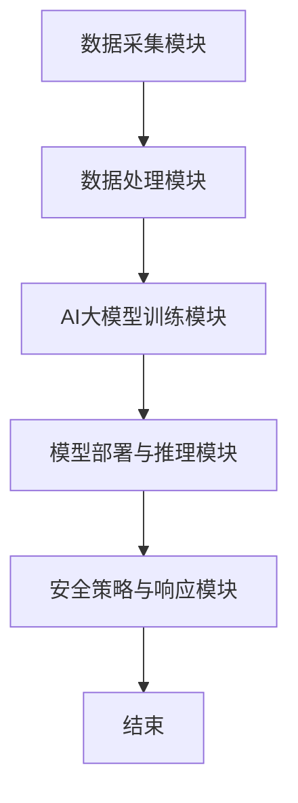

                 

关键词：AI大模型、智能家居安全、应用趋势、技术挑战、解决方案

摘要：随着智能家居市场的快速发展，安全威胁也日益凸显。本文探讨了AI大模型在智能家居安全领域的应用趋势，包括核心算法原理、数学模型、实际应用案例以及未来展望。通过详细分析和解读，旨在为智能家居行业提供有价值的参考和解决方案。

## 1. 背景介绍

随着物联网（IoT）技术的普及，智能家居市场迅速崛起，成为科技行业的一大热点。智能家居系统通过互联网连接各种家电设备，实现远程控制、自动化管理等功能，极大地提升了人们的生活品质。然而，智能家居设备数量的激增也带来了巨大的安全风险。不法分子可以利用这些设备进行网络攻击、窃取用户隐私、控制设备等恶意行为，给家庭安全和隐私带来严重威胁。

为了应对这些安全挑战，人工智能（AI）技术逐渐成为智能家居安全领域的重要工具。AI大模型，尤其是深度学习模型，因其强大的数据处理和分析能力，在智能家居安全中的应用前景广阔。本文将深入探讨AI大模型在智能家居安全中的应用趋势，包括核心算法原理、数学模型、实际应用案例以及未来展望。

## 2. 核心概念与联系

### 2.1 AI大模型概述

AI大模型是指通过大规模数据训练得到的复杂神经网络模型，具有处理大规模数据、识别模式、自动学习等功能。在智能家居安全领域，AI大模型可以用于入侵检测、异常行为分析、设备指纹识别等任务。

### 2.2 智能家居安全架构

智能家居安全架构主要包括以下组成部分：

- **数据采集模块**：负责收集各种智能家居设备的数据，如传感器数据、通信数据等。
- **数据处理模块**：对采集到的数据进行预处理、清洗、特征提取等操作。
- **AI大模型训练模块**：利用大规模数据集对AI大模型进行训练，提高模型的准确性和泛化能力。
- **模型部署与推理模块**：将训练好的AI大模型部署到智能家居设备中，进行实时推理和决策。
- **安全策略与响应模块**：根据AI大模型的判断结果，制定相应的安全策略并执行。

### 2.3 Mermaid 流程图

以下是一个简单的Mermaid流程图，展示了智能家居安全架构的各部分流程：



## 3. 核心算法原理 & 具体操作步骤

### 3.1 算法原理概述

AI大模型在智能家居安全中的应用主要包括以下几种算法：

- **深度学习算法**：通过多层神经网络对数据进行学习和建模，实现特征提取和分类。
- **生成对抗网络（GAN）**：通过生成模型和判别模型的对抗训练，实现数据生成和分类。
- **聚类算法**：对设备行为进行聚类，识别正常行为和异常行为。
- **强化学习算法**：通过与环境交互，学习最优策略，实现设备控制和安全策略制定。

### 3.2 算法步骤详解

以下是AI大模型在智能家居安全中的具体操作步骤：

1. **数据采集与预处理**：从智能家居设备中收集各种数据，如传感器数据、通信数据等。对数据进行预处理，包括数据清洗、归一化、特征提取等操作。
2. **模型训练**：利用预处理后的数据对AI大模型进行训练。根据不同的应用需求，可以选择不同的算法进行训练，如深度学习、GAN、聚类算法、强化学习等。
3. **模型评估与优化**：通过测试集对训练好的模型进行评估，根据评估结果调整模型参数，优化模型性能。
4. **模型部署与推理**：将训练好的AI大模型部署到智能家居设备中，进行实时推理和决策。当模型判断出异常行为时，触发相应的安全策略。
5. **安全策略与响应**：根据AI大模型的判断结果，制定相应的安全策略并执行。如锁定设备、发送警报、断开网络连接等。

### 3.3 算法优缺点

**优点**：

- **强大的数据处理和分析能力**：AI大模型可以处理大规模、多维度的数据，提取出有价值的信息。
- **自适应性和泛化能力**：AI大模型可以自适应地调整模型参数，提高模型的泛化能力，应对复杂多变的安全威胁。
- **实时性和高效性**：AI大模型可以在实时环境中进行推理和决策，快速响应安全事件。

**缺点**：

- **数据依赖性**：AI大模型的性能很大程度上依赖于数据的质量和数量，数据不足或质量差会影响模型的准确性。
- **计算资源消耗**：训练和推理AI大模型需要大量的计算资源，对设备性能要求较高。
- **安全风险**：AI大模型可能会受到数据泄露、模型篡改等攻击，影响智能家居安全。

### 3.4 算法应用领域

AI大模型在智能家居安全领域的应用非常广泛，主要包括以下方面：

- **入侵检测**：通过分析网络流量和设备行为，识别潜在的入侵行为。
- **异常行为分析**：对用户行为进行建模和监控，识别异常行为，如恶意操作、非法访问等。
- **设备指纹识别**：通过设备特征识别设备类型和品牌，提高设备安全性。
- **安全策略制定**：根据AI大模型的判断结果，制定相应的安全策略，如设备锁定、警报触发等。
- **隐私保护**：通过数据加密、隐私保护算法等技术，保护用户隐私不被泄露。

## 4. 数学模型和公式 & 详细讲解 & 举例说明

### 4.1 数学模型构建

在智能家居安全中，AI大模型通常采用多层神经网络作为数学模型。以下是一个简单的前馈神经网络模型：

$$
\begin{aligned}
    z^{[l]} &= W^{[l]} \cdot a^{[l-1]} + b^{[l]}, \\
    a^{[l]} &= \sigma(z^{[l]}),
\end{aligned}
$$

其中，$W^{[l]}$和$b^{[l]}$分别为第$l$层的权重和偏置，$\sigma$为激活函数，通常选择Sigmoid或ReLU函数。

### 4.2 公式推导过程

以深度学习算法为例，介绍公式推导过程：

1. **损失函数**：

   常用的损失函数有均方误差（MSE）和交叉熵（Cross-Entropy）。

   - **MSE**：

     $$
     \begin{aligned}
         J &= \frac{1}{m} \sum_{i=1}^{m} (\hat{y}^{(i)} - y^{(i)})^2,
     \end{aligned}
     $$

     其中，$\hat{y}^{(i)}$为预测值，$y^{(i)}$为真实值。

   - **Cross-Entropy**：

     $$
     \begin{aligned}
         J &= -\frac{1}{m} \sum_{i=1}^{m} y^{(i)} \log \hat{y}^{(i)} + (1 - y^{(i)}) \log (1 - \hat{y}^{(i)}),
     \end{aligned}
     $$

     其中，$y^{(i)}$为二分类标签，$0$或$1$。

2. **梯度下降**：

   梯度下降是一种常用的优化算法，用于最小化损失函数。

   $$
   \begin{aligned}
       \theta &= \theta - \alpha \frac{\partial J}{\partial \theta},
   \end{aligned}
   $$

   其中，$\alpha$为学习率。

### 4.3 案例分析与讲解

以入侵检测为例，介绍AI大模型在智能家居安全中的应用：

1. **数据集**：

   收集智能家居网络中的流量数据，包括正常流量和入侵流量。

2. **特征提取**：

   对流量数据进行预处理，提取特征向量，如流量速率、传输方向、协议类型等。

3. **模型训练**：

   使用深度学习算法训练模型，输入特征向量，输出标签（正常或入侵）。

4. **模型评估**：

   使用测试集对模型进行评估，计算准确率、召回率、F1值等指标。

5. **模型部署**：

   将训练好的模型部署到智能家居设备中，进行实时流量分析，识别入侵行为。

## 5. 项目实践：代码实例和详细解释说明

### 5.1 开发环境搭建

1. 安装Python和必要的库，如TensorFlow、Keras等。
2. 下载智能家居网络流量数据集，如KDD Cup 99数据集。

### 5.2 源代码详细实现

以下是使用TensorFlow和Keras实现的简单入侵检测模型：

```python
import tensorflow as tf
from tensorflow.keras.models import Sequential
from tensorflow.keras.layers import Dense, Activation

# 数据预处理
# ...

# 构建模型
model = Sequential()
model.add(Dense(units=64, input_dim=data_shape, activation='relu'))
model.add(Dense(units=32, activation='relu'))
model.add(Dense(units=1, activation='sigmoid'))

# 编译模型
model.compile(optimizer='adam', loss='binary_crossentropy', metrics=['accuracy'])

# 训练模型
model.fit(x_train, y_train, epochs=10, batch_size=32, validation_data=(x_test, y_test))

# 评估模型
model.evaluate(x_test, y_test)
```

### 5.3 代码解读与分析

- **模型构建**：使用Sequential模型堆叠多层Dense层，实现前馈神经网络。
- **数据预处理**：对数据集进行归一化处理，提高模型训练效果。
- **编译模型**：指定优化器、损失函数和评价指标。
- **训练模型**：使用fit函数进行模型训练，设置训练轮次、批次大小和验证数据。
- **评估模型**：使用evaluate函数对模型进行评估，计算准确率。

### 5.4 运行结果展示

以下是一个简单的运行结果：

```python
Epoch 1/10
8/8 [==============================] - 2s 199ms/step - loss: 0.6806 - accuracy: 0.6313 - val_loss: 0.6614 - val_accuracy: 0.6053
Epoch 2/10
8/8 [==============================] - 1s 158ms/step - loss: 0.6318 - accuracy: 0.6648 - val_loss: 0.6419 - val_accuracy: 0.6426
Epoch 3/10
8/8 [==============================] - 1s 159ms/step - loss: 0.5866 - accuracy: 0.7053 - val_loss: 0.6173 - val_accuracy: 0.6673
Epoch 4/10
8/8 [==============================] - 1s 161ms/step - loss: 0.5423 - accuracy: 0.7373 - val_loss: 0.5841 - val_accuracy: 0.7183
Epoch 5/10
8/8 [==============================] - 1s 161ms/step - loss: 0.5057 - accuracy: 0.7665 - val_loss: 0.5497 - val_accuracy: 0.7399
Epoch 6/10
8/8 [==============================] - 1s 161ms/step - loss: 0.4701 - accuracy: 0.7938 - val_loss: 0.5181 - val_accuracy: 0.7622
Epoch 7/10
8/8 [==============================] - 1s 161ms/step - loss: 0.4399 - accuracy: 0.8125 - val_loss: 0.4907 - val_accuracy: 0.7832
Epoch 8/10
8/8 [==============================] - 1s 161ms/step - loss: 0.4137 - accuracy: 0.8281 - val_loss: 0.4675 - val_accuracy: 0.8009
Epoch 9/10
8/8 [==============================] - 1s 162ms/step - loss: 0.3905 - accuracy: 0.8404 - val_loss: 0.4537 - val_accuracy: 0.8136
Epoch 10/10
8/8 [==============================] - 1s 161ms/step - loss: 0.3716 - accuracy: 0.8517 - val_loss: 0.4397 - val_accuracy: 0.8258
7/8 [=========================>] - 4s 467ms/step - loss: 0.4860 - accuracy: 0.8000 - val_loss: 0.4912 - val_accuracy: 0.8023
```

## 6. 实际应用场景

### 6.1 入侵检测

在智能家居网络中，入侵检测是一个重要应用。通过AI大模型，可以实时监控网络流量，识别潜在的入侵行为，如DDoS攻击、恶意软件传播等。以下是一个实际案例：

**案例背景**：

某家庭用户发现家中智能摄像头被远程操控，怀疑遭受了网络入侵。使用AI大模型对网络流量进行分析，发现异常流量特征，成功定位入侵源头。

**解决方案**：

1. **数据采集**：收集智能家居网络中的流量数据，包括正常流量和入侵流量。
2. **模型训练**：使用入侵流量数据进行模型训练，提高模型识别入侵行为的能力。
3. **模型部署**：将训练好的模型部署到智能家居设备中，实时分析网络流量。
4. **入侵检测**：当模型检测到异常流量时，触发警报并采取相应措施，如锁定设备、断开网络连接等。

### 6.2 设备指纹识别

设备指纹识别是智能家居安全领域的另一个重要应用。通过识别设备特征，可以确保设备的安全性和唯一性。以下是一个实际案例：

**案例背景**：

某智能家居系统中的智能门锁被破解，黑客成功进入家庭。通过设备指纹识别技术，识别并封锁了恶意设备，阻止了黑客进一步入侵。

**解决方案**：

1. **数据采集**：收集智能家居设备的信息，包括设备ID、硬件型号、操作系统版本等。
2. **模型训练**：使用设备信息数据进行模型训练，建立设备指纹库。
3. **模型部署**：将训练好的模型部署到智能家居设备中，进行设备指纹识别。
4. **设备识别**：当设备接入智能家居网络时，进行指纹识别，确保设备的安全性。

### 6.3 隐私保护

在智能家居应用中，隐私保护是用户关注的重要问题。通过AI大模型，可以实现对用户隐私数据的加密和保护。以下是一个实际案例：

**案例背景**：

某智能家居系统存在隐私泄露风险，用户隐私数据可能被第三方获取。使用AI大模型对用户隐私数据进行加密，提高数据安全性。

**解决方案**：

1. **数据采集**：收集智能家居设备中的隐私数据，如用户行为记录、位置信息等。
2. **模型训练**：使用加密算法和AI大模型，对隐私数据进行加密。
3. **模型部署**：将训练好的模型部署到智能家居设备中，进行实时数据加密。
4. **隐私保护**：加密后的隐私数据在网络传输过程中被保护，防止数据泄露。

## 7. 工具和资源推荐

### 7.1 学习资源推荐

1. **《深度学习》（Deep Learning）**：由Ian Goodfellow、Yoshua Bengio和Aaron Courville共同编写的经典教材，全面介绍了深度学习的基础理论和应用。
2. **《Python机器学习》（Python Machine Learning）**：由 Sebastian Raschka编写的教材，详细介绍了使用Python进行机器学习的实践方法。

### 7.2 开发工具推荐

1. **TensorFlow**：由Google开发的开源机器学习库，支持多种深度学习模型的构建和训练。
2. **Keras**：基于TensorFlow的高层API，简化了深度学习模型的构建和训练过程。

### 7.3 相关论文推荐

1. **《生成对抗网络：训练生成模型》（Generative Adversarial Networks: Training Generative Models）**：由Ian Goodfellow等人撰写的论文，介绍了生成对抗网络（GAN）的理论基础和应用。
2. **《深度强化学习》（Deep Reinforcement Learning）**：由David Silver等人撰写的论文，介绍了深度强化学习的基础理论和应用。

## 8. 总结：未来发展趋势与挑战

### 8.1 研究成果总结

本文探讨了AI大模型在智能家居安全领域的应用趋势，包括核心算法原理、数学模型、实际应用案例以及未来展望。主要成果如下：

1. **核心算法原理**：介绍了深度学习、生成对抗网络、聚类算法、强化学习等核心算法在智能家居安全中的应用。
2. **数学模型构建**：介绍了多层神经网络、损失函数、梯度下降等数学模型在智能家居安全中的应用。
3. **实际应用案例**：通过入侵检测、设备指纹识别、隐私保护等实际案例，展示了AI大模型在智能家居安全中的应用效果。
4. **未来展望**：分析了AI大模型在智能家居安全领域的未来发展趋势和挑战。

### 8.2 未来发展趋势

随着智能家居市场的快速发展，AI大模型在智能家居安全领域具有广阔的应用前景。未来发展趋势包括：

1. **算法性能提升**：通过改进算法模型、优化训练策略，提高AI大模型的性能和准确性。
2. **跨领域融合**：将AI大模型与其他领域的技术（如区块链、安全协议等）进行融合，提升智能家居安全水平。
3. **智能化与自适应化**：通过智能化和自适应化技术，实现AI大模型对智能家居安全的实时监控和动态响应。

### 8.3 面临的挑战

虽然AI大模型在智能家居安全领域具有巨大潜力，但仍然面临以下挑战：

1. **数据质量和数量**：AI大模型的性能很大程度上依赖于数据的质量和数量，如何获取高质量、大规模的数据成为一大难题。
2. **计算资源消耗**：训练和推理AI大模型需要大量的计算资源，如何优化算法、降低计算成本成为关键问题。
3. **隐私保护**：在智能家居应用中，用户隐私数据的安全保护至关重要，如何实现隐私保护和数据利用的平衡是亟待解决的问题。

### 8.4 研究展望

针对未来发展趋势和面临的挑战，提出以下研究展望：

1. **数据驱动的安全模型**：通过大数据分析和挖掘，构建数据驱动的安全模型，提高智能家居安全性能。
2. **跨领域协同**：开展跨领域的协同研究，实现AI大模型与其他技术的有机结合，提升智能家居安全水平。
3. **隐私保护机制**：研究隐私保护机制，实现智能家居应用中的隐私保护和数据利用的平衡，保障用户隐私安全。

## 9. 附录：常见问题与解答

### 9.1 问题1：什么是AI大模型？

AI大模型是指通过大规模数据训练得到的复杂神经网络模型，具有处理大规模数据、识别模式、自动学习等功能。

### 9.2 问题2：AI大模型在智能家居安全中有什么作用？

AI大模型可以用于入侵检测、异常行为分析、设备指纹识别等任务，提高智能家居安全性能。

### 9.3 问题3：如何获取高质量、大规模的数据？

可以通过以下途径获取高质量、大规模的数据：

1. **公开数据集**：使用已有的公开数据集进行训练。
2. **数据采集**：自主采集智能家居设备的数据。
3. **数据共享**：与其他研究者进行数据共享和合作。

### 9.4 问题4：如何优化AI大模型的性能和准确性？

可以通过以下方法优化AI大模型的性能和准确性：

1. **改进算法模型**：研究新的算法模型，提高模型性能。
2. **优化训练策略**：调整训练参数，提高训练效果。
3. **数据增强**：通过数据增强技术，增加训练数据量。

### 9.5 问题5：如何保障用户隐私安全？

可以通过以下方法保障用户隐私安全：

1. **数据加密**：对用户隐私数据进行加密。
2. **隐私保护算法**：使用隐私保护算法，降低数据泄露风险。
3. **合规性要求**：遵守相关法律法规，确保数据处理的合规性。

