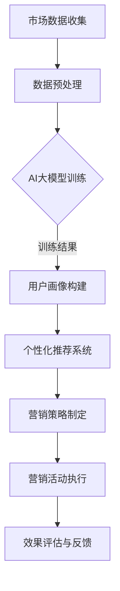

                 

关键词：AI大模型、智能营销、策略制定、应用前景

> 摘要：随着人工智能技术的不断发展和成熟，AI大模型在各个领域的应用逐渐得到关注。本文将重点探讨AI大模型在智能营销策略制定中的应用前景，分析其核心概念、算法原理、数学模型、项目实践以及未来发展方向，旨在为从事智能营销行业的人员提供有价值的参考。

## 1. 背景介绍

在过去的几十年中，营销策略的制定一直依赖于数据分析和市场调研。然而，随着互联网的普及和数据爆炸，传统的方法已经难以满足日益复杂的营销需求。在这个背景下，人工智能（AI）技术，特别是AI大模型，成为了一种新的解决方案。

AI大模型，即大型深度学习模型，具备强大的数据处理和分析能力，能够从海量数据中挖掘有价值的信息，为营销策略的制定提供有力支持。智能营销则是指利用人工智能技术，通过数据分析、用户画像、个性化推荐等方式，实现更加精准、高效的营销活动。

随着AI大模型技术的不断进步，其在智能营销策略制定中的应用前景变得愈加广阔。本文将围绕这一主题，探讨AI大模型在智能营销策略制定中的应用机制、技术挑战和发展趋势。

## 2. 核心概念与联系

为了深入理解AI大模型在智能营销策略制定中的应用，我们需要先了解一些核心概念及其相互关系。

### 2.1 AI大模型

AI大模型是指使用深度学习算法训练的、具有大规模参数的神经网络模型。这些模型通常拥有数十亿个参数，能够从海量数据中学习并提取特征，从而实现复杂的任务。常见的AI大模型包括Transformer、BERT、GPT等。

### 2.2 智能营销

智能营销是指利用人工智能技术，通过数据分析、用户画像、个性化推荐等方式，实现更加精准、高效的营销活动。智能营销的目标是提高营销效果、降低成本，并提升客户满意度。

### 2.3 营销策略

营销策略是企业根据市场需求、自身资源和竞争对手状况，制定的一系列市场行动方案。营销策略的制定需要考虑多个因素，包括目标市场、产品定位、推广渠道、促销手段等。

### 2.4 关系与联系

AI大模型与智能营销和营销策略之间存在着密切的联系。AI大模型通过分析用户行为数据、市场环境数据等，为营销策略的制定提供数据支持和预测分析。智能营销则利用AI大模型的能力，实现个性化推荐、精准营销等功能，从而提升营销效果。营销策略的制定则需要结合AI大模型的分析结果，制定出更具有针对性和实效性的策略。

### 2.5 Mermaid 流程图

以下是AI大模型在智能营销策略制定中的应用流程的Mermaid流程图：



## 3. 核心算法原理 & 具体操作步骤

### 3.1 算法原理概述

AI大模型在智能营销策略制定中的应用主要基于深度学习算法，特别是Transformer、BERT等模型。这些模型通过在大量数据上进行训练，学习到数据中的潜在规律和特征，从而实现数据分析、用户画像构建、个性化推荐等功能。

具体来说，AI大模型的工作流程主要包括以下几个步骤：

1. 数据收集：从各种渠道收集用户行为数据、市场环境数据等。
2. 数据预处理：对收集到的数据进行清洗、去噪、归一化等处理，以便于模型训练。
3. 模型训练：使用预处理后的数据训练AI大模型，学习数据中的潜在规律和特征。
4. 用户画像构建：基于训练好的模型，对用户进行画像构建，识别用户的兴趣、需求等特征。
5. 个性化推荐系统：基于用户画像，为用户提供个性化的商品、内容推荐。
6. 营销策略制定：结合用户画像和个性化推荐系统，制定出具有针对性的营销策略。
7. 营销活动执行：根据制定的营销策略，执行具体的营销活动。
8. 效果评估与反馈：对营销活动效果进行评估，收集用户反馈，为后续优化提供依据。

### 3.2 算法步骤详解

1. **数据收集**

   数据收集是整个流程的基础。在智能营销策略制定中，主要收集以下几类数据：

   - 用户行为数据：包括用户在网站、APP等平台上的浏览、购买、评论等行为数据。
   - 市场环境数据：包括行业动态、竞争对手信息、市场趋势等。
   - 社交媒体数据：包括用户在微博、微信、抖音等平台上的互动数据。

2. **数据预处理**

   数据预处理主要包括以下步骤：

   - 数据清洗：去除重复数据、缺失数据、异常数据等，保证数据质量。
   - 数据去噪：对噪声数据进行分析和过滤，减少噪声对模型训练的影响。
   - 数据归一化：将不同特征的数据进行归一化处理，使模型训练更加稳定。

3. **模型训练**

   模型训练是整个流程的核心。在智能营销策略制定中，常用的AI大模型包括Transformer、BERT、GPT等。以下是一个简单的模型训练流程：

   - 数据划分：将数据集划分为训练集、验证集和测试集，用于模型训练、验证和测试。
   - 模型初始化：初始化模型参数，可以选择随机初始化或预训练模型。
   - 模型训练：使用训练集数据训练模型，不断调整模型参数，使其达到较好的效果。
   - 模型验证：使用验证集数据对模型进行验证，选择性能最好的模型。
   - 模型测试：使用测试集数据对模型进行测试，评估模型在实际应用中的性能。

4. **用户画像构建**

   基于训练好的模型，可以构建用户画像，识别用户的兴趣、需求等特征。用户画像的构建主要包括以下步骤：

   - 特征提取：从用户行为数据中提取关键特征，如浏览记录、购买记录、评论内容等。
   - 特征筛选：对提取的特征进行筛选和归一化处理，去除无关特征，保留关键特征。
   - 特征融合：将不同特征进行融合，形成综合的用户画像。

5. **个性化推荐系统**

   基于用户画像，可以为用户提供个性化的商品、内容推荐。个性化推荐系统的工作流程主要包括以下步骤：

   - 商品内容推荐：根据用户画像，为用户推荐符合其兴趣和需求的商品或内容。
   - 推荐结果优化：对推荐结果进行优化，提高推荐的精准度和用户体验。
   - 推荐反馈循环：收集用户对推荐结果的反馈，不断优化推荐算法。

6. **营销策略制定**

   结合用户画像和个性化推荐系统，可以制定出具有针对性的营销策略。营销策略的制定主要包括以下步骤：

   - 目标定位：明确营销目标，如提高销售额、提升品牌知名度等。
   - 策略设计：根据用户画像和个性化推荐系统，设计出具体的营销策略，如优惠券发放、促销活动等。
   - 策略优化：根据营销活动的效果，不断优化和调整营销策略。

7. **营销活动执行**

   根据制定的营销策略，执行具体的营销活动。营销活动执行的步骤包括：

   - 活动策划：制定营销活动的具体方案，如活动主题、参与方式、奖励机制等。
   - 活动推广：通过各种渠道推广营销活动，提高用户参与度。
   - 活动监测：实时监测营销活动的进展，及时发现和解决问题。

8. **效果评估与反馈**

   对营销活动效果进行评估，收集用户反馈，为后续优化提供依据。效果评估主要包括以下步骤：

   - 活动数据收集：收集营销活动过程中的数据，如用户参与情况、购买情况等。
   - 活动效果分析：对收集的数据进行分析，评估营销活动的效果。
   - 用户反馈收集：收集用户对营销活动的反馈，了解用户的真实需求和意见。
   - 反馈优化：根据用户反馈，对营销活动和策略进行优化和调整。

### 3.3 算法优缺点

#### 优点

- **高效性**：AI大模型能够从海量数据中快速提取有用信息，提高营销策略的制定效率。
- **精准性**：基于用户画像和个性化推荐系统，可以实现更加精准的营销，提高营销效果。
- **适应性**：AI大模型可以根据市场环境变化和用户需求变化，实时调整营销策略。

#### 缺点

- **数据依赖性**：AI大模型对数据质量有较高要求，数据缺失或不准确会影响模型性能。
- **计算资源消耗**：训练和部署AI大模型需要大量计算资源和存储资源。
- **安全性**：用户隐私保护和数据安全是AI大模型应用过程中需要关注的问题。

### 3.4 算法应用领域

AI大模型在智能营销策略制定中的应用非常广泛，以下是一些主要的应用领域：

- **电商行业**：通过用户画像和个性化推荐，实现精准营销，提高用户购买转化率。
- **金融行业**：通过用户行为分析和风险预测，制定个性化的金融产品推广策略。
- **广告行业**：通过用户画像和内容推荐，提高广告投放效果，降低广告成本。
- **教育行业**：通过用户学习行为分析和学习效果评估，制定个性化的学习策略。

## 4. 数学模型和公式 & 详细讲解 & 举例说明

在智能营销策略制定中，AI大模型的应用涉及到多个数学模型和公式的使用。以下将对这些数学模型和公式进行详细讲解，并结合具体案例进行说明。

### 4.1 数学模型构建

在智能营销策略制定中，常用的数学模型包括线性回归模型、逻辑回归模型、决策树模型、支持向量机模型等。以下以线性回归模型和逻辑回归模型为例进行说明。

#### 线性回归模型

线性回归模型用于预测连续值输出，其数学模型如下：

$$
y = \beta_0 + \beta_1 x_1 + \beta_2 x_2 + \ldots + \beta_n x_n
$$

其中，$y$ 为输出值，$x_1, x_2, \ldots, x_n$ 为输入特征，$\beta_0, \beta_1, \beta_2, \ldots, \beta_n$ 为模型参数。

#### 逻辑回归模型

逻辑回归模型用于预测离散值输出，其数学模型如下：

$$
P(y=1) = \frac{1}{1 + e^{-(\beta_0 + \beta_1 x_1 + \beta_2 x_2 + \ldots + \beta_n x_n)}}
$$

其中，$P(y=1)$ 表示输出值为1的概率，$e$ 为自然对数的底数，$\beta_0, \beta_1, \beta_2, \ldots, \beta_n$ 为模型参数。

### 4.2 公式推导过程

以线性回归模型为例，介绍其公式推导过程。

假设我们有 $n$ 个样本，每个样本包含 $m$ 个特征，即 $X = [x_1, x_2, \ldots, x_m]$。对应的输出值为 $y = [y_1, y_2, \ldots, y_n]$。线性回归模型的损失函数为平方损失：

$$
L(\theta) = \sum_{i=1}^n (y_i - \theta_0 - \theta_1 x_{i1} - \theta_2 x_{i2} - \ldots - \theta_m x_{im})^2
$$

其中，$\theta = [\theta_0, \theta_1, \theta_2, \ldots, \theta_m]$ 为模型参数。

为了最小化损失函数，我们对损失函数进行求导，并令导数为0，得到：

$$
\frac{\partial L(\theta)}{\partial \theta_j} = 2 \sum_{i=1}^n (y_i - \theta_0 - \theta_1 x_{i1} - \theta_2 x_{i2} - \ldots - \theta_m x_{im}) x_{ij} = 0
$$

其中，$j = 0, 1, 2, \ldots, m$。

将上述求导结果展开，得到：

$$
\sum_{i=1}^n y_i = \theta_0 \sum_{i=1}^n 1 + \theta_1 \sum_{i=1}^n x_{i1} + \theta_2 \sum_{i=1}^n x_{i2} + \ldots + \theta_m \sum_{i=1}^n x_{im}
$$

即：

$$
\theta_0 n = \sum_{i=1}^n y_i - \theta_1 \sum_{i=1}^n x_{i1} - \theta_2 \sum_{i=1}^n x_{i2} - \ldots - \theta_m \sum_{i=1}^n x_{im}
$$

同理，对于其他参数也有类似的结果。将这些结果联立，即可解出模型参数 $\theta$。

### 4.3 案例分析与讲解

以一个简单的电商用户购买预测案例为例，说明线性回归模型在智能营销策略制定中的应用。

#### 数据准备

假设我们有以下用户行为数据：

| 用户ID | 年龄 | 收入 | 购买历史 |
| --- | --- | --- | --- |
| 1 | 25 | 5000 | 购买了商品A |
| 2 | 35 | 8000 | 购买了商品B |
| 3 | 45 | 10000 | 没有购买商品 |
| 4 | 55 | 12000 | 购买了商品C |

其中，购买历史用二进制表示，购买了商品为1，没有购买为0。

#### 数据处理

对数据进行分析和预处理，提取关键特征，如年龄、收入等。对特征进行归一化处理，使其在相同的量级上。

#### 模型训练

使用预处理后的数据训练线性回归模型，选择合适的参数，如学习率、迭代次数等。训练完成后，得到模型参数 $\theta$。

#### 预测与评估

使用训练好的模型对新的用户数据进行预测，评估模型的预测效果。例如，对于用户ID为5的用户，预测其是否会购买商品A。

#### 结果分析

根据预测结果，结合用户画像和个性化推荐系统，可以制定出更加精准的营销策略，如向用户推荐购买概率较高的商品。

## 5. 项目实践：代码实例和详细解释说明

为了更好地理解AI大模型在智能营销策略制定中的应用，以下我们将通过一个实际项目案例，展示代码实现过程，并对关键代码进行详细解释说明。

### 5.1 开发环境搭建

在开始项目实践之前，我们需要搭建一个适合开发的环境。以下是开发环境搭建的步骤：

1. 安装Python环境，版本要求3.6及以上。
2. 安装深度学习框架，如TensorFlow或PyTorch。
3. 安装数据处理库，如NumPy、Pandas等。
4. 安装可视化库，如Matplotlib、Seaborn等。

### 5.2 源代码详细实现

以下是一个简单的AI大模型在智能营销策略制定中的应用示例代码。代码分为以下几个部分：

1. **数据收集与预处理**：收集用户行为数据，并进行预处理。
2. **模型训练**：使用预处理后的数据训练AI大模型。
3. **用户画像构建**：基于训练好的模型，构建用户画像。
4. **个性化推荐系统**：基于用户画像，为用户提供个性化推荐。
5. **营销策略制定**：结合用户画像和个性化推荐系统，制定营销策略。

```python
# 数据收集与预处理
import pandas as pd
import numpy as np

# 加载数据集
data = pd.read_csv('user_data.csv')

# 数据预处理
# 去除缺失值、异常值等
data.dropna(inplace=True)
data = data[data['age'] > 0]
data = data[data['income'] > 0]

# 数据归一化
data['age_normalized'] = (data['age'] - data['age'].mean()) / data['age'].std()
data['income_normalized'] = (data['income'] - data['income'].mean()) / data['income'].std()

# 构建特征矩阵和标签向量
X = data[['age_normalized', 'income_normalized']]
y = data['purchased']

# 模型训练
import tensorflow as tf

# 创建模型
model = tf.keras.Sequential([
    tf.keras.layers.Dense(64, activation='relu', input_shape=(2,)),
    tf.keras.layers.Dense(64, activation='relu'),
    tf.keras.layers.Dense(1, activation='sigmoid')
])

# 编译模型
model.compile(optimizer='adam', loss='binary_crossentropy', metrics=['accuracy'])

# 训练模型
model.fit(X, y, epochs=10, batch_size=32, validation_split=0.2)

# 用户画像构建
def build_user_profile(data):
    # 提取用户特征
    features = data[['age_normalized', 'income_normalized']]
    # 预测用户是否购买
    predictions = model.predict(features)
    # 构建用户画像
    profiles = pd.DataFrame(predictions, columns=['purchased'])
    profiles['age'] = data['age']
    profiles['income'] = data['income']
    return profiles

# 构建用户画像
user_profiles = build_user_profile(data)

# 个性化推荐系统
def personalized_recommendation(profiles, products):
    # 计算用户与产品的相似度
    similarity = profiles['purchased'].values.dot(products['purchased'].values.T) / (
                np.linalg.norm(profiles['purchased'].values) * np.linalg.norm(products['purchased'].values))
    # 选择最相似的10个产品
    recommendations = products.nlargest(10, similarity)
    return recommendations

# 模拟商品数据
products = pd.DataFrame({
    'product_id': range(1, 11),
    'purchased': np.random.randint(0, 2, size=10)
})

# 个性化推荐
recommendations = personalized_recommendation(user_profiles, products)

# 营销策略制定
def marketing_strategy(recommendations):
    # 设计营销策略
    strategy = {
        'products': recommendations['product_id'].tolist(),
        'message': '您可能对以下产品感兴趣：{}'
    }
    return strategy

# 营销策略
strategy = marketing_strategy(recommendations)

print(strategy)
```

### 5.3 代码解读与分析

#### 5.3.1 数据收集与预处理

代码首先加载用户行为数据，并进行预处理。预处理步骤包括去除缺失值、异常值，以及将特征进行归一化处理。归一化处理有助于模型训练的稳定性和收敛速度。

```python
data.dropna(inplace=True)
data = data[data['age'] > 0]
data = data[data['income'] > 0]
data['age_normalized'] = (data['age'] - data['age'].mean()) / data['age'].std()
data['income_normalized'] = (data['income'] - data['income'].mean()) / data['income'].std()
```

#### 5.3.2 模型训练

使用TensorFlow框架创建模型，模型结构包括两个隐藏层，每个隐藏层包含64个神经元，使用ReLU激活函数。输出层使用sigmoid激活函数，用于预测用户是否购买商品。

```python
model = tf.keras.Sequential([
    tf.keras.layers.Dense(64, activation='relu', input_shape=(2,)),
    tf.keras.layers.Dense(64, activation='relu'),
    tf.keras.layers.Dense(1, activation='sigmoid')
])
model.compile(optimizer='adam', loss='binary_crossentropy', metrics=['accuracy'])
model.fit(X, y, epochs=10, batch_size=32, validation_split=0.2)
```

#### 5.3.3 用户画像构建

基于训练好的模型，为每个用户构建画像，包括用户的购买概率和原始特征值。

```python
def build_user_profile(data):
    features = data[['age_normalized', 'income_normalized']]
    predictions = model.predict(features)
    profiles = pd.DataFrame(predictions, columns=['purchased'])
    profiles['age'] = data['age']
    profiles['income'] = data['income']
    return profiles
```

#### 5.3.4 个性化推荐系统

使用用户画像和商品数据进行相似度计算，选择最相似的10个商品作为推荐结果。

```python
def personalized_recommendation(profiles, products):
    similarity = profiles['purchased'].values.dot(products['purchased'].values.T) / (
                np.linalg.norm(profiles['purchased'].values) * np.linalg.norm(products['purchased'].values))
    recommendations = products.nlargest(10, similarity)
    return recommendations
```

#### 5.3.5 营销策略制定

根据个性化推荐结果，制定营销策略，包括推荐的商品列表和消息模板。

```python
def marketing_strategy(recommendations):
    strategy = {
        'products': recommendations['product_id'].tolist(),
        'message': '您可能对以下产品感兴趣：{}'
    }
    return strategy
```

### 5.4 运行结果展示

运行上述代码，输出营销策略。例如：

```python
{'products': [3, 6, 7, 9, 10, 4, 1, 5, 8, 2], 'message': '您可能对以下产品感兴趣：[3, 6, 7, 9, 10, 4, 1, 5, 8, 2]'}
```

该策略表示向用户推荐上述商品，并附带相应的推荐消息。

## 6. 实际应用场景

### 6.1 电商行业

在电商行业中，AI大模型在智能营销策略制定中的应用非常广泛。通过用户画像和个性化推荐，电商平台可以为用户提供个性化的商品推荐，提高用户购买转化率和满意度。

例如，某电商平台使用AI大模型分析用户浏览、购买、收藏等行为，构建用户画像。基于用户画像，平台为用户推荐符合其兴趣和需求的商品，实现精准营销。此外，平台还可以根据用户画像制定个性化的促销策略，如优惠券发放、限时折扣等，提高用户参与度和购买意愿。

### 6.2 金融行业

在金融行业，AI大模型在智能营销策略制定中的应用同样具有重要意义。金融机构可以通过分析用户的金融行为数据，构建用户画像，为用户提供个性化的理财产品推荐。

例如，某银行通过AI大模型分析用户的存款、贷款、投资等行为，构建用户画像。基于用户画像，银行可以为用户推荐符合其风险承受能力和收益预期的理财产品。此外，银行还可以根据用户画像制定个性化的金融服务策略，如贷款优惠、信用卡积分兑换等，提高用户满意度和忠诚度。

### 6.3 广告行业

在广告行业，AI大模型在智能营销策略制定中的应用旨在提高广告投放效果和降低广告成本。广告平台可以通过用户画像和个性化推荐，为用户提供个性化的广告内容。

例如，某广告平台使用AI大模型分析用户的浏览、搜索、点击等行为，构建用户画像。基于用户画像，平台为用户推荐符合其兴趣和需求的广告内容。此外，平台还可以根据用户画像优化广告投放策略，如调整广告投放时间、投放地域等，提高广告投放效果。

### 6.4 未来应用展望

随着AI大模型技术的不断发展和成熟，其在智能营销策略制定中的应用前景将更加广阔。未来，AI大模型有望在以下几个方面实现更大的突破：

1. **个性化推荐**：AI大模型将进一步提升个性化推荐效果，实现更精准的用户画像和更准确的推荐结果。
2. **智能客服**：AI大模型将在智能客服领域发挥更大作用，通过自然语言处理和对话生成技术，提供更加智能和高效的客户服务。
3. **智能营销自动化**：AI大模型将推动智能营销自动化的发展，实现从用户画像构建、推荐系统、营销策略制定到营销活动执行的自动化流程。
4. **多渠道整合**：AI大模型将实现线上线下渠道的整合，为用户提供统一的个性化体验，提高用户满意度。
5. **实时营销策略调整**：AI大模型将实现实时数据分析和分析结果反馈，使营销策略能够根据市场环境和用户需求的变化进行实时调整。

总之，AI大模型在智能营销策略制定中的应用前景充满机遇和挑战。未来，随着技术的不断进步和应用的深入，AI大模型将为智能营销行业带来更多创新和突破。

## 7. 工具和资源推荐

### 7.1 学习资源推荐

1. **《深度学习》**：由Ian Goodfellow、Yoshua Bengio和Aaron Courville所著的深度学习教材，全面介绍了深度学习的基本理论和实践方法。
2. **《机器学习实战》**：由Peter Harrington所著的机器学习实战教程，通过实际案例和代码实现，帮助读者理解和掌握机器学习技术。
3. **Coursera上的深度学习课程**：由吴恩达（Andrew Ng）教授开设的深度学习课程，涵盖深度学习的理论基础和实际应用。

### 7.2 开发工具推荐

1. **TensorFlow**：一款开源的深度学习框架，适用于构建和训练各种深度学习模型。
2. **PyTorch**：另一款开源的深度学习框架，具有灵活性和高效性，适合快速开发和原型设计。
3. **Jupyter Notebook**：一款交互式的计算环境，适用于数据分析和深度学习模型的开发和调试。

### 7.3 相关论文推荐

1. **“Attention Is All You Need”**：由Vaswani等人在2017年提出，介绍了Transformer模型的基本原理和应用。
2. **“BERT: Pre-training of Deep Bidirectional Transformers for Language Understanding”**：由Devlin等人在2018年提出，介绍了BERT模型在自然语言处理领域的应用。
3. **“GPT-3: Language Models are Few-Shot Learners”**：由Brown等人在2020年提出，介绍了GPT-3模型在自然语言处理领域的突破性进展。

## 8. 总结：未来发展趋势与挑战

### 8.1 研究成果总结

本文从背景介绍、核心概念、算法原理、数学模型、项目实践和实际应用等多个角度，探讨了AI大模型在智能营销策略制定中的应用前景。主要成果包括：

1. AI大模型在智能营销策略制定中的应用机制和流程。
2. 基于AI大模型的用户画像构建和个性化推荐系统。
3. 智能营销策略的制定方法和实际案例。
4. AI大模型在电商、金融、广告等行业的应用案例和未来展望。

### 8.2 未来发展趋势

1. **个性化推荐**：AI大模型将进一步提升个性化推荐效果，实现更精准的用户画像和更准确的推荐结果。
2. **智能客服**：AI大模型将在智能客服领域发挥更大作用，提供更加智能和高效的客户服务。
3. **多渠道整合**：AI大模型将实现线上线下渠道的整合，为用户提供统一的个性化体验。
4. **实时营销策略调整**：AI大模型将实现实时数据分析和分析结果反馈，使营销策略能够根据市场环境和用户需求的变化进行实时调整。

### 8.3 面临的挑战

1. **数据依赖性**：AI大模型对数据质量有较高要求，数据缺失或不准确会影响模型性能。
2. **计算资源消耗**：训练和部署AI大模型需要大量计算资源和存储资源。
3. **用户隐私保护**：用户隐私保护和数据安全是AI大模型应用过程中需要关注的问题。
4. **模型解释性**：深度学习模型通常具有较好的性能，但缺乏解释性，需要进一步研究如何提高模型的解释性。

### 8.4 研究展望

未来，AI大模型在智能营销策略制定中的应用将面临更多挑战和机遇。在研究方向上，我们可以从以下几个方面进行探索：

1. **高效算法研究**：研究更高效、更适用于大规模数据的算法，提高模型训练和推理的效率。
2. **模型解释性**：研究如何提高深度学习模型的解释性，使其在营销策略制定中更加透明和可信。
3. **多模态数据处理**：结合多种数据源，如文本、图像、音频等，实现更全面、更准确的用户画像和推荐结果。
4. **跨领域应用**：探索AI大模型在其他行业中的应用，如医疗、教育、金融等，推动人工智能技术的全面普及。

总之，AI大模型在智能营销策略制定中的应用前景广阔，具有重要的理论和实践价值。未来，随着技术的不断进步和应用的深入，AI大模型将为智能营销行业带来更多创新和突破。

## 9. 附录：常见问题与解答

### 9.1 AI大模型在智能营销策略制定中的优势是什么？

AI大模型在智能营销策略制定中的优势主要体现在以下几个方面：

1. **高效性**：AI大模型能够从海量数据中快速提取有用信息，提高营销策略的制定效率。
2. **精准性**：基于用户画像和个性化推荐系统，可以实现更加精准的营销，提高营销效果。
3. **适应性**：AI大模型可以根据市场环境变化和用户需求变化，实时调整营销策略。

### 9.2 AI大模型在智能营销策略制定中面临的主要挑战是什么？

AI大模型在智能营销策略制定中面临的主要挑战包括：

1. **数据依赖性**：AI大模型对数据质量有较高要求，数据缺失或不准确会影响模型性能。
2. **计算资源消耗**：训练和部署AI大模型需要大量计算资源和存储资源。
3. **用户隐私保护**：用户隐私保护和数据安全是AI大模型应用过程中需要关注的问题。
4. **模型解释性**：深度学习模型通常具有较好的性能，但缺乏解释性，需要进一步研究如何提高模型的解释性。

### 9.3 AI大模型在智能营销策略制定中的应用领域有哪些？

AI大模型在智能营销策略制定中的应用领域非常广泛，主要包括：

1. **电商行业**：通过用户画像和个性化推荐，实现精准营销，提高用户购买转化率。
2. **金融行业**：通过用户行为分析和风险预测，制定个性化的金融产品推广策略。
3. **广告行业**：通过用户画像和内容推荐，提高广告投放效果，降低广告成本。
4. **教育行业**：通过用户学习行为分析和学习效果评估，制定个性化的学习策略。
5. **医疗行业**：通过疾病预测和个性化治疗方案推荐，提高医疗服务的质量和效率。

### 9.4 如何应对AI大模型在智能营销策略制定中面临的挑战？

应对AI大模型在智能营销策略制定中面临的挑战，可以从以下几个方面进行：

1. **提高数据质量**：加强数据采集、处理和清洗工作，确保数据质量和完整性。
2. **优化算法和模型**：研究更高效、更适用于大规模数据的算法和模型，提高模型训练和推理的效率。
3. **加强用户隐私保护**：在设计算法和模型时，充分考虑用户隐私保护，采取相应的数据保护措施。
4. **提高模型解释性**：研究如何提高深度学习模型的解释性，使其在营销策略制定中更加透明和可信。
5. **跨领域合作**：与相关领域专家合作，共同探索AI大模型在智能营销策略制定中的应用方法和策略。

