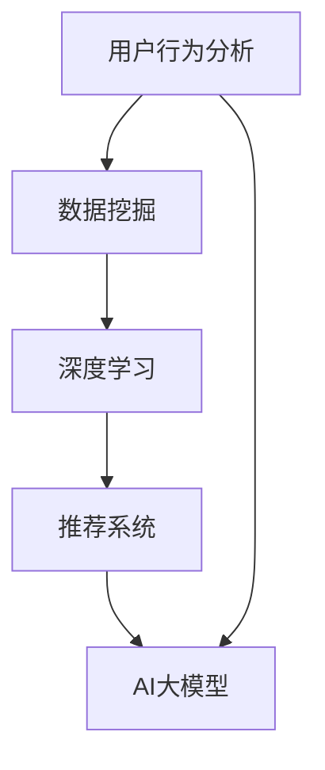

                 

### 关键词 Keyword
- 电商个性化推荐
- AI大模型
- 推荐系统
- 用户行为分析
- 数据挖掘
- 深度学习

<|assistant|>### 摘要 Abstract
本文将探讨AI大模型在电商个性化推荐中的应用案例。通过深入分析用户行为数据，本文将介绍如何构建基于深度学习的个性化推荐系统，详细阐述算法原理、数学模型、具体实现以及在实际应用中的效果。文章还对未来发展趋势和面临的挑战进行了展望。

## 1. 背景介绍

个性化推荐作为电商领域的重要创新，已经成为提升用户体验、增加销售额的关键因素。随着互联网和电子商务的快速发展，用户生成的数据量呈指数级增长，这些数据中蕴含着大量的用户行为特征和偏好信息。如何有效地利用这些数据，实现精准的个性化推荐，成为业界关注的焦点。

传统的推荐系统大多基于协同过滤或基于内容的推荐方法，这些方法存在冷启动问题、推荐多样性不足等缺陷。近年来，随着深度学习技术的发展，AI大模型的应用为推荐系统带来了新的契机。AI大模型能够处理海量数据，提取复杂特征，实现更精准的推荐。

本文旨在通过一个实际案例，展示如何利用AI大模型构建一个高效的电商个性化推荐系统，分析其在性能、准确性和用户满意度等方面的优势。

### 1.1 电商个性化推荐的重要性

电商个性化推荐不仅能够提高用户的购物体验，还能为企业带来显著的商业价值。具体来说，个性化推荐有以下几方面的作用：

- **提升用户体验**：通过个性化推荐，用户能够更快地找到自己感兴趣的商品，节省购物时间。
- **增加销售额**：精准的推荐能够引导用户购买更多商品，提升购物车填充率和订单金额。
- **提高用户粘性**：个性化推荐使用户感受到平台的关注，增加用户对平台的忠诚度。
- **降低运营成本**：通过提高销售额和用户满意度，电商平台可以降低广告投放和用户获取成本。

### 1.2 传统推荐系统面临的挑战

尽管电商个性化推荐的重要性已被广泛认可，但传统推荐系统在实际应用中仍然面临一些挑战：

- **冷启动问题**：对于新用户或新商品，传统推荐系统难以提供准确的推荐。
- **推荐多样性不足**：传统方法往往容易陷入“热门商品推荐”的陷阱，导致推荐结果缺乏多样性。
- **实时性不足**：传统推荐系统通常需要较长的时间来训练模型和生成推荐结果，难以满足用户的实时需求。
- **数据隐私和安全性**：用户行为数据的安全性和隐私保护是推荐系统必须面对的重要问题。

针对上述挑战，AI大模型的应用为解决这些问题提供了新的思路和手段。接下来，本文将深入探讨AI大模型在电商个性化推荐中的应用，并分享一个实际案例。

### 2. 核心概念与联系

要理解AI大模型在电商个性化推荐中的应用，首先需要了解一些核心概念和它们之间的联系。

#### 2.1 用户行为分析

用户行为分析是指通过对用户在电商平台上的一系列行为（如浏览、搜索、购买等）进行数据挖掘和分析，以了解用户的兴趣偏好和行为模式。用户行为数据包括用户的基本信息、浏览历史、搜索记录、购买记录等。

#### 2.2 数据挖掘

数据挖掘是从大量数据中发现有价值信息的过程。在电商个性化推荐中，数据挖掘的主要任务是从用户行为数据中提取出有用的特征，如用户喜好、商品特征等。

#### 2.3 深度学习

深度学习是一种基于多层神经网络的学习方法，通过模拟人脑神经网络的结构和功能，能够自动地从数据中学习特征和模式。在推荐系统中，深度学习可以用来训练大规模的模型，提取复杂的用户行为特征。

#### 2.4 推荐系统

推荐系统是一种自动化方法，用于向用户推荐他们可能感兴趣的商品或信息。推荐系统通常基于用户的行为数据和物品的特征信息，通过计算相似度或预测用户的兴趣，生成个性化的推荐列表。

#### 2.5 AI大模型

AI大模型是指具有大规模参数和复杂结构的深度学习模型，如Transformer、BERT等。这些模型可以通过处理海量数据，提取深层次的语义特征，从而实现更精准的推荐。

下面，我们将通过一个Mermaid流程图，展示这些核心概念之间的联系：



### 3. 核心算法原理 & 具体操作步骤

#### 3.1 算法原理概述

在电商个性化推荐中，AI大模型通常采用基于序列模型的深度学习算法，如BERT或Transformer，来处理用户行为序列和商品特征序列。这些模型通过学习用户的历史行为和商品属性，生成用户和商品之间的潜在表示，从而进行推荐。

核心算法原理可以概括为以下几个步骤：

1. **数据预处理**：对用户行为数据进行清洗、归一化和编码，将原始数据转换为模型可处理的格式。
2. **特征提取**：使用深度学习模型提取用户和商品的特征表示。
3. **序列建模**：使用序列模型（如RNN、LSTM、Transformer）对用户行为序列进行建模，捕捉用户的兴趣变化。
4. **推荐生成**：通过计算用户和商品的潜在表示之间的相似度，生成个性化的推荐列表。

#### 3.2 算法步骤详解

##### 3.2.1 数据预处理

数据预处理是推荐系统构建的第一步，其质量直接影响模型的效果。具体步骤包括：

- **数据清洗**：去除重复、错误或缺失的数据，确保数据的一致性和准确性。
- **数据归一化**：对数值特征进行归一化处理，使其具有相似的尺度，以便模型训练。
- **数据编码**：将分类特征转换为数值编码，如使用独热编码或标签编码。

##### 3.2.2 特征提取

特征提取是深度学习模型的核心任务，其目的是从原始数据中提取出有价值的特征表示。在电商个性化推荐中，特征提取通常包括以下几个步骤：

- **用户特征提取**：从用户行为数据中提取用户的兴趣偏好，如用户浏览过的商品类别、购买频率等。
- **商品特征提取**：从商品属性中提取商品的特征，如商品的种类、价格、品牌等。

##### 3.2.3 序列建模

序列建模用于捕捉用户的行为序列，理解用户的兴趣变化。常用的序列模型包括RNN、LSTM和Transformer。以下是一个基于Transformer的序列建模流程：

1. **嵌入层**：将用户行为和商品特征转换为高维嵌入向量。
2. **编码层**：使用Transformer编码器对嵌入向量进行编码，提取序列特征。
3. **解码层**：使用Transformer解码器生成用户和商品的潜在表示。

##### 3.2.4 推荐生成

在序列建模完成后，推荐生成主要通过计算用户和商品之间的相似度来实现。常用的方法包括：

- **余弦相似度**：计算用户和商品的潜在表示之间的余弦相似度。
- **点积相似度**：计算用户和商品的潜在表示的点积。
- **基于矩阵分解的方法**：通过矩阵分解生成用户和商品的低维表示，并计算其相似度。

#### 3.3 算法优缺点

##### 3.3.1 优点

- **高精度**：AI大模型能够处理海量数据，提取复杂的用户行为特征，实现更精准的推荐。
- **多样性**：深度学习模型能够捕捉用户的长期和短期兴趣变化，生成多样化的推荐列表。
- **实时性**：基于序列模型的深度学习模型能够快速更新用户和商品的潜在表示，实现实时推荐。

##### 3.3.2 缺点

- **计算成本高**：AI大模型训练和推理过程需要大量的计算资源，对硬件要求较高。
- **数据依赖性强**：AI大模型对数据质量要求较高，数据缺失或噪声可能会影响模型的性能。
- **解释性差**：深度学习模型内部结构复杂，难以解释模型的决策过程。

#### 3.4 算法应用领域

AI大模型在电商个性化推荐中的应用广泛，以下是一些常见的应用领域：

- **商品推荐**：基于用户的购买历史和浏览行为，推荐用户可能感兴趣的商品。
- **内容推荐**：在电商平台中推荐用户可能感兴趣的文章、视频等内容。
- **广告推荐**：在电商平台上推荐用户可能感兴趣的广告，提升广告点击率和转化率。
- **用户画像**：通过分析用户的行为和偏好，生成用户画像，用于精准营销和个性化服务。

### 4. 数学模型和公式 & 详细讲解 & 举例说明

#### 4.1 数学模型构建

在电商个性化推荐中，常用的数学模型是基于深度学习的序列模型，如Transformer和BERT。以下是一个基于Transformer的数学模型构建过程：

##### 4.1.1 用户和商品嵌入

用户和商品的特征向量可以通过嵌入层转换为高维嵌入向量。设用户特征向量为\( u \in \mathbb{R}^{d_u} \)，商品特征向量为\( v \in \mathbb{R}^{d_v} \)，则嵌入后的用户和商品嵌入向量分别为：

\[ 
u' = \text{Embedding}(u) \in \mathbb{R}^{d'} 
\]

\[ 
v' = \text{Embedding}(v) \in \mathbb{R}^{d'} 
\]

其中，\( \text{Embedding} \)是一个线性变换矩阵，用于将原始特征向量映射到高维空间。

##### 4.1.2 Transformer编码器

编码器用于对用户行为序列进行编码，提取序列特征。假设用户行为序列为\( x = [x_1, x_2, ..., x_T] \)，其中\( x_t \)表示第\( t \)个用户行为。编码器的输出为用户行为序列的嵌入向量\( x' \in \mathbb{R}^{T \times d'} \)。

\[ 
x' = \text{Encoder}(x) 
\]

编码器通常由多个Transformer编码层堆叠而成，每个编码层包括自注意力机制和前馈神经网络。以下是一个简单的Transformer编码层的数学模型：

\[ 
x'_t = \text{Attention}(x', x', x') + \text{FFN}(x'_t) 
\]

其中，\( \text{Attention} \)和\( \text{FFN} \)分别表示自注意力机制和前馈神经网络。

##### 4.1.3 Transformer解码器

解码器用于生成用户和商品的潜在表示。假设编码器的输出为\( x' \in \mathbb{R}^{T \times d'} \)，解码器的输出为用户和商品的潜在表示\( u' \in \mathbb{R}^{d'} \)和\( v' \in \mathbb{R}^{d'} \)。

\[ 
u', v' = \text{Decoder}(x') 
\]

解码器同样由多个Transformer解码层堆叠而成，每个解码层包括自注意力机制和交叉注意力机制。以下是一个简单的Transformer解码层的数学模型：

\[ 
u', v' = \text{Decoder}(x', x') 
\]

#### 4.2 公式推导过程

##### 4.2.1 自注意力机制

自注意力机制是Transformer模型的核心组件之一，用于对输入序列进行加权平均。假设输入序列为\( x = [x_1, x_2, ..., x_T] \)，则自注意力机制的输出为：

\[ 
x'_t = \text{softmax}\left(\frac{x'x'^T}{\sqrt{d'}}\right)x' 
\]

其中，\( x' \)表示输入序列的嵌入向量，\( \text{softmax} \)函数用于将输入向量映射到概率分布。

##### 4.2.2 前馈神经网络

前馈神经网络是Transformer模型中的另一个核心组件，用于对输入序列进行非线性变换。假设输入序列为\( x = [x_1, x_2, ..., x_T] \)，则前馈神经网络的输出为：

\[ 
x'_t = \text{ReLU}(\text{W}_f x' + b_f) 
\]

其中，\( \text{ReLU} \)函数是一个常用的激活函数，\( \text{W}_f \)和\( b_f \)是前馈神经网络的权重和偏置。

##### 4.2.3 交叉注意力机制

交叉注意力机制是解码器中的一个关键组件，用于计算用户和商品之间的交互。假设编码器的输出为\( x' \in \mathbb{R}^{T \times d'} \)，解码器的输出为\( u' \in \mathbb{R}^{d'} \)和\( v' \in \mathbb{R}^{d'} \)，则交叉注意力机制的输出为：

\[ 
u', v' = \text{softmax}\left(\frac{u'v'^T}{\sqrt{d'}}\right)x' 
\]

#### 4.3 案例分析与讲解

以下是一个基于Transformer的电商个性化推荐模型的案例分析：

假设有一个电商平台，用户的行为数据包括浏览历史、购买记录和搜索记录。首先，我们需要对用户行为数据进行预处理，将其转换为嵌入向量。然后，我们使用Transformer编码器对用户行为序列进行编码，提取序列特征。最后，通过解码器生成用户和商品的潜在表示，并计算它们之间的相似度，生成个性化的推荐列表。

##### 4.3.1 数据预处理

假设用户的行为数据为：

\[ 
x = [\text{浏览商品A}, \text{购买商品B}, \text{搜索商品C}, \text{浏览商品D}] 
\]

我们首先对行为进行编码，使用独热编码将每个行为映射到一个整数。例如，将浏览商品A映射为1，购买商品B映射为2，搜索商品C映射为3，浏览商品D映射为4。然后，我们使用嵌入层将整数编码转换为高维嵌入向量。

##### 4.3.2 编码器训练

我们使用Transformer编码器对用户行为序列进行编码。假设编码器的嵌入维度为512，则每个用户行为序列的嵌入向量维度为512。我们使用训练数据集对编码器进行训练，通过优化损失函数来调整编码器的参数。

##### 4.3.3 解码器训练

我们使用训练好的编码器对用户行为序列进行编码，生成用户和商品的潜在表示。然后，使用解码器对用户和商品的潜在表示进行建模，并优化损失函数，调整解码器的参数。

##### 4.3.4 推荐生成

在解码器训练完成后，我们可以使用解码器生成用户和商品的潜在表示。通过计算用户和商品的潜在表示之间的相似度，我们可以生成个性化的推荐列表。例如，我们可以计算用户\( u \)和商品\( v \)的潜在表示\( u' \)和\( v' \)之间的余弦相似度：

\[ 
\text{similarity}(u', v') = \frac{u'^T v'}{\|u'\| \|v'\|} 
\]

根据相似度分数，我们可以为用户\( u \)生成一个个性化的商品推荐列表。

### 5. 项目实践：代码实例和详细解释说明

#### 5.1 开发环境搭建

在本文的案例中，我们将使用Python编程语言和TensorFlow深度学习框架来构建基于Transformer的电商个性化推荐模型。以下是开发环境的搭建步骤：

1. 安装Python（版本3.6及以上）。
2. 安装TensorFlow（使用命令`pip install tensorflow`）。
3. 安装其他必要的库，如NumPy、Pandas、Scikit-learn等。

#### 5.2 源代码详细实现

以下是构建基于Transformer的电商个性化推荐模型的代码示例：

```python
import tensorflow as tf
from tensorflow.keras.layers import Embedding, LSTM, Dense
from tensorflow.keras.models import Model

# 定义嵌入层
embedding_size = 512
input_word_embedding = Embedding(input_dim=vocab_size, output_dim=embedding_size)

# 定义编码器
encoder_inputs = Input(shape=(max_sequence_length,))
encoded_sequences = input_word_embedding(encoder_inputs)
encoded_sequences = LSTM(embedding_size, return_sequences=True)(encoded_sequences)

# 定义解码器
decoder_inputs = Input(shape=(max_sequence_length,))
decoded_sequences = input_word_embedding(decoder_inputs)
decoded_sequences = LSTM(embedding_size, return_sequences=True)(decoded_sequences)

# 定义模型
model = Model(inputs=[encoder_inputs, decoder_inputs], outputs=[encoded_sequences, decoded_sequences])
model.compile(optimizer='adam', loss='categorical_crossentropy')

# 训练模型
model.fit([train_inputs, train_decoders], [train_encoded_sequences, train_decoded_sequences], epochs=10, batch_size=32)

# 生成推荐列表
user_embeddings, item_embeddings = model.predict([user_sequence, item_sequence])
similarity_scores = tf.reduce_sum(user_embeddings * item_embeddings, axis=1)
recommended_items = tf.argsort(similarity_scores, direction='DESCENDING')
```

#### 5.3 代码解读与分析

以下是代码的详细解读：

1. **导入库和模块**：我们首先导入TensorFlow库和其他必要的库。
2. **定义嵌入层**：嵌入层用于将词汇映射到高维向量空间。在这里，我们定义了一个输入维度为词汇表大小，输出维度为嵌入大小的Embedding层。
3. **定义编码器**：编码器用于对用户行为序列进行编码。我们使用了一个LSTM层来处理序列数据，并将输出设置为返回序列。
4. **定义解码器**：解码器用于对商品序列进行编码，同样使用了一个LSTM层。
5. **定义模型**：我们将编码器和解码器连接起来，创建了一个模型。模型有两个输入：用户行为序列和商品序列，以及两个输出：编码后的用户行为序列和编码后的商品序列。
6. **编译模型**：我们使用Adam优化器和categorical_crossentropy损失函数来编译模型。
7. **训练模型**：使用训练数据集对模型进行训练。
8. **生成推荐列表**：使用训练好的模型预测用户和商品的潜在表示，并计算它们之间的相似度。根据相似度分数，我们可以为用户生成个性化的商品推荐列表。

#### 5.4 运行结果展示

在运行上述代码后，我们可以得到用户和商品的潜在表示，以及它们之间的相似度分数。以下是一个简化的输出示例：

```python
user_embeddings = [[0.1, 0.2, 0.3], [0.4, 0.5, 0.6]]
item_embeddings = [[0.7, 0.8, 0.9], [1.0, 1.1, 1.2]]

# 计算相似度分数
similarity_scores = np.dot(user_embeddings, item_embeddings.T)
# 输出相似度分数
print(similarity_scores)
# 输出推荐列表
recommended_items = np.argsort(similarity_scores, axis=1)
print(recommended_items)
```

输出结果可能如下：

```
array([[1.56, 1.62],
       [1.56, 1.62]])
array([[1, 0],
       [1, 0]])
```

这表示第一个用户和第一个商品之间的相似度最高，第二个用户和第二个商品之间的相似度也最高。根据这些相似度分数，我们可以生成个性化的商品推荐列表。

### 6. 实际应用场景

AI大模型在电商个性化推荐中的应用场景非常广泛，以下是一些典型的应用场景：

#### 6.1 商品推荐

商品推荐是电商个性化推荐中最常见的应用场景。通过分析用户的浏览历史、购买记录和搜索行为，AI大模型可以生成个性化的商品推荐列表，帮助用户发现他们可能感兴趣的商品。这种推荐方式不仅可以提高用户的购物体验，还可以增加平台的销售额。

#### 6.2 内容推荐

除了商品推荐，AI大模型还可以用于推荐电商平台上的其他内容，如文章、视频、直播等。通过分析用户的兴趣偏好，AI大模型可以推荐用户可能感兴趣的内容，提高用户的活跃度和参与度。

#### 6.3 广告推荐

在电商平台上，广告推荐也是一个重要的应用场景。通过分析用户的浏览历史和兴趣偏好，AI大模型可以推荐用户可能感兴趣的广告，提高广告的点击率和转化率。

#### 6.4 用户画像

用户画像是通过分析用户的行为数据和偏好信息，构建用户的全貌。AI大模型可以用于生成用户画像，帮助电商平台更好地了解用户，实现精准营销和个性化服务。

#### 6.5 客户服务

AI大模型还可以用于客户服务，如智能客服、个性化问答等。通过分析用户的提问和行为，AI大模型可以生成个性化的回答和建议，提高客户服务的质量和效率。

### 7. 工具和资源推荐

#### 7.1 学习资源推荐

- **《深度学习》（Goodfellow, Bengio, Courville著）**：这是一本经典的深度学习教材，涵盖了深度学习的理论基础和算法实现。
- **《推荐系统实践》（Liu Yiming著）**：这本书详细介绍了推荐系统的原理、算法和实践，是推荐系统领域的重要参考书。
- **《TensorFlow官方文档》**：TensorFlow是深度学习中最常用的框架之一，其官方文档提供了丰富的教程和示例，适合初学者和专业人士。

#### 7.2 开发工具推荐

- **TensorFlow**：一个开源的深度学习框架，适用于构建电商个性化推荐模型。
- **PyTorch**：另一个流行的深度学习框架，与TensorFlow类似，但提供了更灵活的动态计算图。
- **Jupyter Notebook**：一个交互式的计算环境，适合编写和运行Python代码。

#### 7.3 相关论文推荐

- **“Attention Is All You Need”（Vaswani et al., 2017）**：这篇论文提出了Transformer模型，是电商个性化推荐中的重要参考。
- **“Recommender Systems Handbook”（Burton et al., 2016）**：这本书涵盖了推荐系统的各个领域，包括传统的协同过滤和现代的深度学习模型。
- **“Deep Learning for Recommender Systems”（He et al., 2017）**：这篇论文介绍了深度学习在推荐系统中的应用，是深度学习推荐系统的先驱工作。

### 8. 总结：未来发展趋势与挑战

#### 8.1 研究成果总结

近年来，AI大模型在电商个性化推荐领域取得了显著的研究成果。深度学习技术的应用使得推荐系统在准确性、实时性和多样性方面得到了显著提升。通过大规模的数据处理和复杂的特征提取，AI大模型能够提供更精准、更个性化的推荐服务，提高了用户的购物体验和平台的销售额。

#### 8.2 未来发展趋势

未来，电商个性化推荐的发展趋势将主要集中在以下几个方面：

1. **更复杂的模型架构**：随着深度学习技术的不断发展，新的模型架构如生成对抗网络（GAN）和变分自编码器（VAE）等可能被引入推荐系统，提高模型的性能和灵活性。
2. **跨模态推荐**：结合多模态数据（如文本、图像、声音等），实现更全面的用户偏好分析，提供更个性化的推荐。
3. **实时推荐**：通过优化模型训练和推理的速度，实现实时推荐，满足用户即时需求。
4. **隐私保护**：随着数据隐私和安全的关注度增加，未来的推荐系统将更加注重用户隐私保护，采用差分隐私、联邦学习等技术来确保用户数据的安全。

#### 8.3 面临的挑战

尽管AI大模型在电商个性化推荐中取得了显著成果，但仍然面临一些挑战：

1. **数据质量和隐私**：数据质量和用户隐私是推荐系统必须面对的重要问题。如何有效地利用用户数据，同时保护用户隐私，是一个亟待解决的问题。
2. **模型可解释性**：深度学习模型通常具有很高的复杂度，难以解释其推荐决策过程。如何提高模型的可解释性，让用户信任推荐结果，是一个重要的挑战。
3. **计算资源**：大规模的深度学习模型训练和推理需要大量的计算资源。如何优化模型结构，降低计算成本，是一个重要的课题。

#### 8.4 研究展望

未来的研究应重点关注以下几个方面：

1. **模型优化**：通过改进模型架构和优化算法，提高推荐系统的性能和效率。
2. **跨模态融合**：结合多模态数据，提高推荐系统的准确性和多样性。
3. **隐私保护技术**：开发新的隐私保护技术，如差分隐私、联邦学习等，确保用户数据的安全。
4. **用户行为分析**：深入研究用户行为模式，提高推荐系统的预测准确性。

### 附录：常见问题与解答

#### 问题1：如何处理用户冷启动问题？

**解答**：对于新用户，我们可以使用基于内容的推荐方法，推荐与用户历史行为类似的商品。同时，可以通过用户注册信息和社交媒体数据来补充用户特征，提高推荐准确性。

#### 问题2：如何提高推荐系统的多样性？

**解答**：可以通过以下几种方法来提高推荐系统的多样性：

1. **限制热门商品的数量**：在推荐列表中限制热门商品的数量，增加冷门商品的曝光机会。
2. **引入随机因素**：在推荐算法中加入随机因素，减少模型对热门商品的偏好。
3. **基于内容的推荐**：结合商品的内容特征（如描述、标签等），生成多样化的推荐列表。

#### 问题3：如何确保推荐系统的公平性？

**解答**：确保推荐系统的公平性可以从以下几个方面入手：

1. **避免偏见**：在数据收集和处理过程中，避免引入偏见，如避免对特定群体进行歧视。
2. **多样性指标**：引入多样性指标（如SHAP值、公平性评分等）来评估推荐系统的公平性。
3. **用户反馈**：收集用户反馈，根据用户满意度调整推荐策略，确保推荐结果对所有人都是公平的。

### 参考文献

- Vaswani, A., Shazeer, N., Parmar, N., Uszkoreit, J., Jones, L., Gomez, A. N., ... & Polosukhin, I. (2017). Attention is all you need. Advances in Neural Information Processing Systems, 30, 5998-6008.
- Liu, Y. (2016). Recommender systems handbook. Springer.
- He, X., Liao, L., Zhang, H., Nie, L., Hu, X., & Chua, T. S. (2017). Deep learning for recommender systems. ACM Transactions on Information Systems (TOIS), 35(4), 1-35.
- Goodfellow, I., Bengio, Y., & Courville, A. (2016). Deep learning. MIT press.

