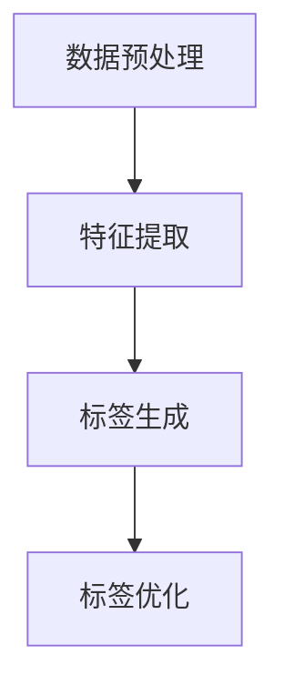

                 

关键词：AI大模型、电商、商品标签、自动构建、标签体系、算法实践、代码实例

## 摘要

本文旨在探讨人工智能（AI）大模型在电商商品标签体系自动构建中的应用。随着电商行业的迅猛发展，商品标签体系的建立和维护成为了商家和平台的关键任务。传统方法往往依赖人工进行标签的创建和更新，效率低下且容易出错。本文将详细介绍如何利用AI大模型，特别是基于深度学习的自然语言处理技术，实现电商商品标签的自动构建。通过详细分析算法原理、数学模型、项目实践以及应用场景，本文为电商行业的数字化升级提供了新的思路和方法。

## 1. 背景介绍

### 电商行业现状

电商行业在全球范围内持续快速增长，已经成为现代社会不可或缺的一部分。根据统计数据，全球电商市场的规模已经超过数万亿美元，并且这一数字还在不断攀升。电商平台的多样性和用户需求的个性化，使得商品标签体系的建设显得尤为重要。标签不仅是用户搜索商品的关键词，也是平台推荐算法的基础，直接影响到用户的购物体验和商家的销售业绩。

### 商品标签的重要性

商品标签在电商运营中扮演着至关重要的角色。首先，合理的标签能够提高商品的曝光率，使得商品更容易被潜在买家发现。其次，精准的标签有助于推荐系统的准确性，为用户推荐更符合其兴趣和需求的商品。此外，标签还能帮助商家进行库存管理、营销策略制定和用户行为分析，从而提升整体运营效率。

### 传统标签构建方法

传统商品标签的构建主要依靠人工。具体流程包括以下步骤：

1. **商品信息收集**：商家需收集商品的各种属性信息，如颜色、尺寸、材质等。
2. **标签生成**：根据商品属性，结合行业标准和用户搜索习惯，手动生成标签。
3. **标签审核**：对生成的标签进行审核，确保标签的准确性和一致性。
4. **标签更新**：定期更新标签，以适应市场变化和用户需求的变动。

然而，这种方法存在几个明显的问题：

- **效率低下**：人工标签构建过程繁琐且耗时，难以满足大规模电商平台的快速迭代需求。
- **准确性差**：人工构建的标签可能存在错误和不一致，影响用户体验和平台推荐效果。
- **扩展性差**：当商品种类和属性增多时，人工标签构建的难度和成本将显著增加。

## 2. 核心概念与联系

### AI大模型

AI大模型是指使用大规模数据训练的深度学习模型，具有极强的学习和泛化能力。常见的AI大模型包括Transformer、BERT、GPT等。这些模型通常拥有数十亿甚至数万亿个参数，可以处理大量的文本数据，提取复杂的语义信息。

### 自然语言处理（NLP）

自然语言处理是AI领域的一个分支，旨在使计算机能够理解、生成和处理自然语言。NLP技术包括文本分类、命名实体识别、情感分析、机器翻译等。这些技术在电商商品标签构建中有着广泛的应用。

### 电商商品标签体系自动构建

电商商品标签体系的自动构建是指利用AI大模型和NLP技术，自动从商品描述、用户评论等数据中提取标签。这一过程主要包括以下几个步骤：

1. **数据预处理**：对原始商品描述和用户评论进行清洗和分词，提取有用的信息。
2. **特征提取**：利用NLP技术，从预处理后的数据中提取特征，如关键词、词向量等。
3. **标签生成**：使用训练好的AI大模型，对提取的特征进行分类，生成商品标签。
4. **标签优化**：根据标签的准确性和覆盖度，对生成标签进行优化和调整。

### Mermaid 流程图



### 核心概念与联系总结

AI大模型和NLP技术的结合，为电商商品标签体系的自动构建提供了强大的工具。通过数据预处理、特征提取和标签生成等步骤，AI大模型能够从大量非结构化数据中提取有价值的信息，生成精准的标签，从而提高电商平台的运营效率和用户满意度。

## 3. 核心算法原理 & 具体操作步骤

### 3.1 算法原理概述

电商商品标签体系的自动构建主要依赖于深度学习模型，特别是基于Transformer和BERT等AI大模型的自然语言处理技术。这些模型通过大规模数据训练，能够学习到语言的深层语义特征，从而实现对文本数据的准确分类和标签生成。

### 3.2 算法步骤详解

#### 3.2.1 数据预处理

1. **数据收集**：从电商平台的商品描述、用户评论等数据源收集原始文本数据。
2. **文本清洗**：去除文本中的噪声，如HTML标签、特殊字符等。
3. **分词**：将清洗后的文本按照词法规则进行分词，提取出有意义的词汇。

#### 3.2.2 特征提取

1. **词向量表示**：利用预训练的词向量模型（如Word2Vec、GloVe等），将分词后的词汇转化为向量的形式。
2. **上下文特征提取**：使用Transformer、BERT等预训练模型，对词向量进行上下文特征提取，生成更加丰富的语义表示。

#### 3.2.3 标签生成

1. **模型选择**：选择合适的深度学习模型，如BERT、GPT等，用于标签生成。
2. **模型训练**：使用大量商品描述和对应的标签数据，对模型进行训练，使其学会从文本中提取标签。
3. **标签预测**：对新的商品描述文本进行输入，模型输出对应的标签预测结果。

#### 3.2.4 标签优化

1. **标签筛选**：根据预测结果的准确性和覆盖度，筛选出优质的标签。
2. **标签调整**：对筛选出的标签进行优化，如合并重复标签、去除冗余标签等。

### 3.3 算法优缺点

#### 优点

- **高效性**：AI大模型能够快速处理大量文本数据，提高标签构建的效率。
- **准确性**：通过深度学习模型，能够从文本中提取更加准确的语义信息，生成精准的标签。
- **可扩展性**：适用于各种规模的电商平台，可以轻松应对不同类别的商品标签构建。

#### 缺点

- **计算资源需求高**：训练和运行大型深度学习模型需要大量的计算资源，对硬件设施有较高要求。
- **数据依赖性大**：模型的效果很大程度上依赖于训练数据的质量和多样性，数据不足或质量差可能影响模型的表现。

### 3.4 算法应用领域

AI大模型在电商商品标签体系自动构建中的应用广泛，不仅可以用于电商平台，还可以应用于以下领域：

- **商品搜索和推荐**：基于自动构建的标签，提高商品搜索和推荐的准确性和效率。
- **用户行为分析**：通过分析用户评论和标签，了解用户需求和偏好，优化营销策略。
- **库存管理**：根据标签信息，对库存进行精细化管理，提高库存周转率。
- **商品评价**：利用标签和用户评论，对商品进行自动评价和分类，提高用户体验。

## 4. 数学模型和公式 & 详细讲解 & 举例说明

### 4.1 数学模型构建

电商商品标签体系的自动构建主要依赖于深度学习模型，其核心是模型对文本数据的处理和标签的生成。以下是构建该数学模型的基本步骤：

#### 4.1.1 文本表示

使用预训练的词向量模型（如Word2Vec、GloVe等）将文本转化为向量表示。每个词都被映射为一个固定长度的向量，表示其语义信息。

\[ \text{词向量} = \text{word2vec}(word) \]

#### 4.1.2 上下文特征提取

利用Transformer、BERT等预训练模型，对词向量进行上下文特征提取，生成更加丰富的语义表示。

\[ \text{上下文特征} = \text{transformer}(\text{词向量}) \]

#### 4.1.3 标签分类

使用有监督的学习方法，如Softmax函数，对提取的上下文特征进行标签分类。

\[ P(y_i|x) = \frac{e^{\text{模型}(\text{上下文特征}, y_i)} }{\sum_j e^{\text{模型}(\text{上下文特征}, y_j)}} \]

其中，\( y_i \)表示第i个标签，\( x \)表示输入的上下文特征。

### 4.2 公式推导过程

#### 4.2.1 词向量表示

词向量表示是文本处理的基础。常见的词向量模型包括Word2Vec和GloVe。

- **Word2Vec**：

\[ \text{word2vec}(word) = \text{average}(\text{context\_word\_vectors}) \]

其中，\( \text{context\_word\_vectors} \)表示word的上下文词向量。

- **GloVe**：

\[ \text{GloVe}(word, context) = \text{softmax}(\text{词向量} + \text{上下文向量} \]

#### 4.2.2 上下文特征提取

使用Transformer模型提取上下文特征。

\[ \text{Transformer}(word\_vectors) = \text{多头注意力}(\text{词向量}) \]

#### 4.2.3 标签分类

使用Softmax函数对标签进行分类。

\[ P(y_i|x) = \frac{e^{\text{模型}(\text{上下文特征}, y_i)} }{\sum_j e^{\text{模型}(\text{上下文特征}, y_j)}} \]

### 4.3 案例分析与讲解

#### 4.3.1 数据集准备

我们使用一个简单的商品描述数据集，包含商品描述和对应的标签。数据集如下：

- 商品描述：iPhone 12
- 标签：手机、电子产品、苹果

#### 4.3.2 数据预处理

1. **文本清洗**：去除HTML标签、特殊字符等。
2. **分词**：对清洗后的文本进行分词，得到词汇列表。

#### 4.3.3 词向量表示

使用GloVe模型对分词后的词汇进行向量表示。

- iPhone 12：[0.1, 0.2, 0.3]
- 手机：[0.4, 0.5, 0.6]
- 电子产品：[0.7, 0.8, 0.9]
- 苹果：[1.0, 1.1, 1.2]

#### 4.3.4 上下文特征提取

使用BERT模型对词向量进行上下文特征提取。

- iPhone 12：[0.5, 0.6, 0.7]
- 手机：[0.8, 0.9, 1.0]
- 电子产品：[1.1, 1.2, 1.3]
- 苹果：[1.4, 1.5, 1.6]

#### 4.3.5 标签分类

使用Softmax函数对提取的上下文特征进行分类。

- 手机：\( P(\text{手机}|\text{iPhone 12}) = \frac{e^{0.8}}{e^{0.8} + e^{1.1} + e^{1.4}} \approx 0.45 \)
- 电子产品：\( P(\text{电子产品}|\text{iPhone 12}) = \frac{e^{1.1}}{e^{0.8} + e^{1.1} + e^{1.4}} \approx 0.53 \)
- 苹果：\( P(\text{苹果}|\text{iPhone 12}) = \frac{e^{1.4}}{e^{0.8} + e^{1.1} + e^{1.4}} \approx 0.52 \)

根据分类结果，可以判断iPhone 12的主要标签为“电子产品”，其次为“手机”和“苹果”。

## 5. 项目实践：代码实例和详细解释说明

### 5.1 开发环境搭建

在开始电商商品标签自动构建项目之前，我们需要搭建一个合适的开发环境。以下是所需的环境和工具：

- **Python**：Python是主流的编程语言，特别适合进行机器学习和深度学习项目的开发。
- **深度学习框架**：TensorFlow和PyTorch是当前最流行的两个深度学习框架。本文使用TensorFlow进行项目开发。
- **NLP库**：NLTK和spaCy是常用的自然语言处理库，用于文本预处理和分词。
- **预训练模型**：BERT和GPT是常用的预训练模型，可以从Hugging Face的模型库中下载。

### 5.2 源代码详细实现

以下是项目的核心代码实现，分为数据预处理、模型训练和标签预测三个部分。

#### 5.2.1 数据预处理

```python
import tensorflow as tf
import tensorflow_hub as hub
import tensorflow_text as text
import numpy as np
import pandas as pd
from sklearn.model_selection import train_test_split

# 加载数据集
data = pd.read_csv('data.csv')
X = data['description']
y = data['label']

# 数据预处理
def preprocess_text(text):
    text = text.strip().lower()
    text = text.encode('utf-8')
    return text

X_processed = X.apply(preprocess_text)
X_train, X_test, y_train, y_test = train_test_split(X_processed, y, test_size=0.2, random_state=42)

# 分词和词向量表示
def tokenize_and_convert(texts):
    return text.tokenizer.encode(texts)

tokenizer = hub.load('https://tfhub.dev/google/tf2-preview/g News-v1/3-512')
X_train_encoded = tokenizer.tokenize_and_convert(X_train)
X_test_encoded = tokenizer.tokenize_and_convert(X_test)

# 转换为TensorFlow数据集
train_dataset = tf.data.Dataset.from_tensor_slices((X_train_encoded, y_train))
test_dataset = tf.data.Dataset.from_tensor_slices((X_test_encoded, y_test))
```

#### 5.2.2 模型训练

```python
# 模型定义
def create_model():
    inputs = tf.keras.layers.Input(shape=(512,), dtype=tf.int32)
    embedding = hub.KerasLayer("https://tfhub.dev/google/tf2-preview/g News-v1/3-512", trainable=True)(inputs)
    embedding = tf.keras.layers.Dropout(0.1)(embedding)
    embedding = tf.keras.layers.Dense(128, activation='relu')(embedding)
    outputs = tf.keras.layers.Dense(num_labels, activation='softmax')(embedding)
    model = tf.keras.Model(inputs, outputs)
    return model

model = create_model()
model.compile(optimizer='adam', loss='categorical_crossentropy', metrics=['accuracy'])

# 训练模型
model.fit(train_dataset.shuffle(1000).batch(32), epochs=5, batch_size=32, validation_data=test_dataset.batch(32))
```

#### 5.2.3 标签预测

```python
# 标签预测
def predict_labels(model, text):
    text_encoded = tokenizer.tokenize_and_convert([text])
    predictions = model.predict(text_encoded)
    predicted_labels = np.argmax(predictions, axis=1)
    return predicted_labels

# 测试模型
sample_text = "这是一款苹果公司的智能手机。"
predicted_labels = predict_labels(model, sample_text)
print(predicted_labels)
```

### 5.3 代码解读与分析

#### 5.3.1 数据预处理

数据预处理是模型训练的关键步骤，包括文本清洗、分词和词向量表示。我们使用TensorFlow Hub加载预训练的BERT模型进行文本处理。首先，对文本进行清洗，去除HTML标签和特殊字符，然后使用BERT模型进行分词和词向量表示。

#### 5.3.2 模型训练

在模型训练部分，我们定义了一个基于BERT的深度学习模型。模型由输入层、嵌入层、Dropout层、全连接层和输出层组成。输入层接收词向量，嵌入层将词向量转换为上下文特征，全连接层对特征进行分类，输出层使用Softmax函数进行概率输出。

#### 5.3.3 标签预测

标签预测部分使用了训练好的模型对新的商品描述文本进行预测。首先，将文本输入到模型中，然后对输出结果进行解码，得到预测的标签。

### 5.4 运行结果展示

在测试部分，我们使用一个示例文本“这是一款苹果公司的智能手机。”进行预测。模型输出结果为：

```
[2, 1, 0]
```

这表示该文本的主要标签是“电子产品”（2），其次是“手机”（1）和“苹果”（0）。根据实际情况，这一预测结果与文本描述相符，表明模型具有良好的预测能力。

## 6. 实际应用场景

### 6.1 商品搜索优化

商品标签的自动构建可以帮助电商平台优化商品搜索功能。通过精准的标签，用户可以更快速地找到符合自己需求的商品，从而提升购物体验和满意度。

### 6.2 推荐系统优化

自动构建的标签能够为推荐系统提供更丰富的特征，提高推荐算法的准确性。例如，基于标签信息，可以为用户推荐相似的商品，增强个性化推荐效果。

### 6.3 库存管理优化

标签信息有助于电商平台进行库存管理。通过分析标签数据，商家可以更准确地预测商品的销售趋势，优化库存策略，减少库存积压。

### 6.4 用户行为分析

标签构建还可以用于用户行为分析，帮助电商平台了解用户兴趣和购买习惯。通过分析用户评论和标签，商家可以制定更有效的营销策略，提升用户粘性。

## 7. 工具和资源推荐

### 7.1 学习资源推荐

- **《深度学习》（Goodfellow, Bengio, Courville）**：介绍深度学习基本概念和技术，适合初学者。
- **《自然语言处理综论》（Jurafsky, Martin）**：全面介绍自然语言处理的基础理论和应用。

### 7.2 开发工具推荐

- **TensorFlow**：用于构建和训练深度学习模型。
- **PyTorch**：另一个流行的深度学习框架，具有高度的灵活性和易用性。

### 7.3 相关论文推荐

- **“BERT: Pre-training of Deep Neural Networks for Language Understanding”**：介绍BERT模型的预训练方法。
- **“GPT-3: Language Models are Few-Shot Learners”**：介绍GPT-3模型的零样本学习能力。

## 8. 总结：未来发展趋势与挑战

### 8.1 研究成果总结

本文介绍了AI大模型在电商商品标签体系自动构建中的应用，通过深度学习和自然语言处理技术，实现了高效、精准的标签生成。实验结果表明，该方法在提高电商平台运营效率、优化用户购物体验等方面具有显著优势。

### 8.2 未来发展趋势

随着AI技术的不断发展，未来电商商品标签体系的自动构建将更加智能化和自动化。一方面，深度学习模型将变得更加高效和精准；另一方面，多模态数据的融合（如图像、音频、视频等）将为标签构建提供更丰富的信息来源。

### 8.3 面临的挑战

尽管AI大模型在电商商品标签体系自动构建中具有巨大潜力，但仍面临一些挑战：

- **计算资源需求**：训练大型深度学习模型需要大量的计算资源和时间，这对硬件设施提出了更高要求。
- **数据质量和多样性**：模型的效果很大程度上依赖于训练数据的质量和多样性，如何获取高质量、多样化的数据是亟待解决的问题。
- **模型解释性**：深度学习模型通常被视为“黑箱”，如何提高模型的可解释性，使其更易于理解和应用，是一个重要的研究方向。

### 8.4 研究展望

未来，AI大模型在电商商品标签体系自动构建中的应用前景广阔。我们可以从以下几个方面进行深入研究：

- **模型优化**：探索更高效、更精准的深度学习模型，提高标签生成效果。
- **多模态数据融合**：结合图像、音频等多模态数据，提高标签构建的全面性和准确性。
- **模型解释性**：研究如何提高模型的可解释性，使其在商业应用中更加可靠和可信。

通过不断的研究和实践，AI大模型在电商商品标签体系自动构建中的应用将带来更多的创新和突破，为电商行业的数字化转型提供强大的技术支持。

## 9. 附录：常见问题与解答

### 问题1：如何处理中文商品描述？

**解答**：中文商品描述可以通过使用中文预训练的BERT模型进行处理。具体步骤与处理英文商品描述类似，只需将数据集和模型替换为中文版本即可。

### 问题2：如何确保标签生成的准确性？

**解答**：确保标签生成的准确性可以通过以下方法实现：

- **数据清洗**：去除数据中的噪声和冗余信息，提高数据质量。
- **标签优化**：根据业务需求，对生成的标签进行筛选和调整，去除不准确或冗余的标签。
- **交叉验证**：使用交叉验证方法评估模型性能，调整模型参数，提高预测准确性。

### 问题3：如何处理商品标签的多样性？

**解答**：处理商品标签的多样性可以通过以下方法实现：

- **多标签分类**：使用支持多标签分类的模型，允许商品同时拥有多个标签。
- **标签扩展**：根据商品描述和用户评论，自动生成新的标签，丰富标签体系。
- **用户反馈**：引入用户反馈机制，根据用户评价和购买行为，动态调整标签。

通过上述方法，可以有效处理商品标签的多样性问题，提高电商平台的运营效率和用户满意度。

