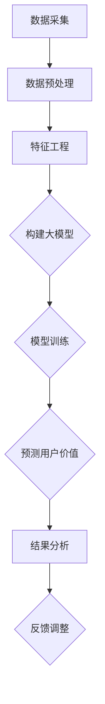

                 

关键词：人工智能、大模型、电商平台、用户价值预测、机器学习

摘要：本文深入探讨了人工智能领域中的大模型在电商平台用户价值预测中的应用。通过对核心概念的介绍、算法原理的阐述、数学模型的构建、具体操作步骤的详细讲解，以及实际应用的案例分析，本文旨在为读者提供一份全面、系统的技术指南，帮助理解大模型在电商平台用户价值预测中的重要作用。

## 1. 背景介绍

随着互联网和电子商务的快速发展，电商平台已经成为现代商业环境中不可或缺的一部分。用户价值的预测对于电商平台来说至关重要，它能够帮助平台优化用户体验、提高用户留存率、精准营销以及制定有效的商业策略。

传统的用户价值预测方法主要依赖于统计分析和规则系统，但这些方法往往在处理复杂、大规模的数据时效果不佳。近年来，人工智能特别是深度学习技术的飞速发展，为大模型在用户价值预测中的应用提供了新的契机。大模型具有强大的表征能力和适应性，能够从大量数据中挖掘出潜在的模式，从而提升预测的准确性和可靠性。

本文将重点探讨如何利用大模型技术来提升电商平台用户价值预测的效果。文章首先介绍相关核心概念，然后深入分析大模型的工作原理和具体实现步骤，最后通过实际案例和数学模型来阐述其在电商领域的应用。

## 2. 核心概念与联系

为了更好地理解大模型在电商平台用户价值预测中的应用，我们需要先了解以下几个核心概念：

### 2.1 机器学习基础

机器学习是一种使计算机从数据中学习和改进自身性能的技术。主要分为监督学习、无监督学习和强化学习三种类型。监督学习是一种常见的学习方式，它使用已知标签的数据来训练模型，然后通过模型对新数据进行预测。

### 2.2 深度学习

深度学习是机器学习的一个分支，它使用多层神经网络（通常称为深度神经网络）来模拟人类大脑的决策过程。深度学习在图像识别、语音识别、自然语言处理等领域取得了显著成果。

### 2.3 大模型

大模型是指具有数百万甚至数十亿个参数的神经网络模型。大模型的规模使其能够捕捉到数据中的复杂模式，从而提高预测的准确性。

### 2.4 电商平台用户价值

电商平台用户价值通常指用户对平台的贡献，包括购买金额、购买频率、评论数量等。用户价值的预测对于电商平台来说具有重要意义，它可以帮助平台更好地了解用户需求，从而优化营销策略和服务。

### 2.5 Mermaid流程图

为了直观地展示大模型在电商平台用户价值预测中的应用流程，我们使用Mermaid绘制了以下流程图：



图2-1 大模型在电商平台用户价值预测中的应用流程图

在上述流程图中，数据采集是整个过程的起点，通过收集用户行为数据、交易数据等来获取预测所需的原始数据。数据预处理包括数据清洗、数据转换等步骤，以确保数据的准确性和一致性。特征工程是对原始数据进行加工和转换，提取出对预测任务有帮助的特征。构建大模型是指使用深度学习框架（如TensorFlow或PyTorch）来设计并训练一个具有数百万参数的神经网络模型。模型训练是核心步骤，通过迭代优化模型参数，使其能够在预测任务中取得较好的性能。预测用户价值是模型的输出结果，用于帮助电商平台制定相应的策略。结果分析对预测结果进行评估和验证，反馈调整则根据分析结果对模型进行优化和调整。

通过上述核心概念和流程图的介绍，我们为后续内容的展开奠定了基础。

## 3. 核心算法原理 & 具体操作步骤

### 3.1 算法原理概述

大模型在电商平台用户价值预测中的应用主要依赖于深度学习技术，特别是基于神经网络的模型。深度学习通过多层神经网络结构，实现对复杂函数的近似和建模。在用户价值预测中，大模型可以学习到用户行为数据中的潜在规律和模式，从而对用户未来的价值进行预测。

深度学习模型的核心是神经元，神经元通过加权求和和激活函数对输入数据进行处理。神经网络由多个层次组成，每个层次由多个神经元组成。层次之间的连接权重可以通过反向传播算法进行更新，以达到最小化预测误差的目的。

在用户价值预测中，大模型通常包含以下几个层次：

1. **输入层**：接收用户行为数据和其他相关特征。
2. **隐藏层**：对输入数据进行处理和转换，提取出潜在特征。
3. **输出层**：生成用户价值的预测结果。

### 3.2 算法步骤详解

1. **数据采集**：通过电商平台的数据采集系统，收集用户的行为数据、交易数据、用户画像等。数据来源可以包括日志数据、数据库数据、第三方数据等。

2. **数据预处理**：对采集到的原始数据进行清洗、去重、标准化等处理，以确保数据的质量和一致性。

3. **特征工程**：根据业务需求和预测任务，对预处理后的数据进行分析和加工，提取出对用户价值预测有帮助的特征。特征工程是提升预测准确性的关键步骤。

4. **构建大模型**：使用深度学习框架（如TensorFlow或PyTorch）来设计并构建一个具有数百万参数的神经网络模型。模型的设计包括网络结构、激活函数、损失函数等。

5. **模型训练**：通过迭代优化模型参数，使其在训练数据上取得较好的预测性能。训练过程中，模型通过反向传播算法不断更新权重和偏置，以最小化预测误差。

6. **预测用户价值**：使用训练好的模型对新的用户数据进行预测，生成用户价值的预测结果。

7. **结果分析**：对预测结果进行评估和验证，包括准确率、召回率、F1分数等指标。分析结果可以帮助电商平台了解预测模型的性能，并找出改进的方向。

8. **反馈调整**：根据分析结果对模型进行调整和优化，以提高预测的准确性。反馈调整可以是调整模型结构、增加训练数据、调整参数等。

### 3.3 算法优缺点

大模型在电商平台用户价值预测中具有以下优点：

1. **强大的表征能力**：大模型能够学习到数据中的复杂模式和规律，从而提高预测的准确性。
2. **适应性**：大模型可以适应不同的业务场景和需求，通过调整模型结构和参数，实现不同的预测任务。
3. **自动化特征工程**：大模型能够自动提取数据中的潜在特征，减少人工特征工程的工作量。

然而，大模型也存在一些缺点：

1. **计算资源消耗**：大模型需要大量的计算资源和存储空间，对硬件设备要求较高。
2. **过拟合风险**：大模型在训练过程中容易过拟合，需要更多的训练数据和正则化手段来避免。
3. **解释性较差**：大模型的内部结构和决策过程较为复杂，难以解释和理解。

### 3.4 算法应用领域

大模型在电商平台用户价值预测中的应用不仅仅局限于用户价值预测，还可以应用于以下领域：

1. **个性化推荐**：根据用户的兴趣和行为，推荐个性化的商品和内容，提升用户体验。
2. **流失用户预测**：预测哪些用户可能会流失，并采取相应的措施进行挽留。
3. **风险控制**：识别潜在的欺诈行为和异常交易，降低风险损失。
4. **运营优化**：通过分析用户行为数据，优化平台的运营策略和服务流程。

总之，大模型在电商平台用户价值预测中的应用具有广泛的前景和潜力。通过深入了解算法原理和具体操作步骤，可以更好地利用大模型技术提升电商平台的运营效益和用户体验。

## 4. 数学模型和公式 & 详细讲解 & 举例说明

### 4.1 数学模型构建

在电商平台用户价值预测中，构建数学模型是核心步骤。以下是一个简化的数学模型示例，用于预测用户未来的价值。

#### 4.1.1 输入特征

假设我们选取以下输入特征：

1. **用户年龄** (Age)
2. **用户性别** (Gender)
3. **用户购买频率** (Purchase_Frequency)
4. **用户平均消费金额** (Average_Spending)
5. **用户最近一次购买时间** (Last_Purchase_Date)

#### 4.1.2 输出目标

输出目标是用户的**未来价值** (Future_Value)，这是一个连续变量。

#### 4.1.3 模型假设

假设我们使用线性回归模型来预测用户价值，模型的形式如下：

\[ \text{Future_Value} = \beta_0 + \beta_1 \times \text{Age} + \beta_2 \times \text{Gender} + \beta_3 \times \text{Purchase_Frequency} + \beta_4 \times \text{Average_Spending} + \beta_5 \times \text{Last_Purchase_Date} \]

其中，\(\beta_0, \beta_1, \beta_2, \beta_3, \beta_4, \beta_5\) 为模型参数，需要通过训练数据来估计。

### 4.2 公式推导过程

线性回归模型的公式推导相对简单。假设我们有一个包含 \(N\) 个样本的数据集 \(D = \{ (x_1, y_1), (x_2, y_2), ..., (x_N, y_N) \} \)，其中 \(x_i\) 为输入特征向量，\(y_i\) 为对应的输出目标值。

#### 4.2.1 模型假设

我们假设输出目标 \(y_i\) 可以通过以下线性关系表示：

\[ y_i = \beta_0 + \beta_1 x_{i1} + \beta_2 x_{i2} + ... + \beta_n x_{in} + \epsilon_i \]

其中，\(\epsilon_i\) 是误差项，表示数据中的噪声和不确定性。

#### 4.2.2 模型参数估计

为了估计模型参数 \(\beta_0, \beta_1, ..., \beta_n\)，我们使用最小二乘法（Least Squares Method）。最小二乘法的目标是最小化预测值与实际值之间的误差平方和：

\[ \min_{\beta} \sum_{i=1}^{N} (y_i - \beta_0 - \beta_1 x_{i1} - ... - \beta_n x_{in})^2 \]

对上述公式求导并令导数为零，可以得到参数估计的公式：

\[ \beta_j = \frac{\sum_{i=1}^{N} (y_i - \beta_0 - ... - \beta_{j-1} x_{ij-1} - \beta_{j+1} x_{ij+1} - ... - \beta_n x_{in}) x_{ij}}{\sum_{i=1}^{N} (x_{ij})^2} \]

其中，\(j = 1, 2, ..., n\)。

### 4.3 案例分析与讲解

#### 4.3.1 数据集

我们使用一个简单的数据集来演示线性回归模型的构建和训练。数据集包含以下特征和目标：

| Age | Gender | Purchase_Frequency | Average_Spending | Last_Purchase_Date | Future_Value |
| --- | --- | --- | --- | --- | --- |
| 25  | M     | 5                | 200              | 2023-01-01         | 1000         |
| 30  | F     | 3                | 150              | 2023-01-10         | 800          |
| 35  | M     | 8                | 300              | 2023-01-15         | 1500         |
| 28  | F     | 4                | 250              | 2023-01-20         | 900          |

#### 4.3.2 数据预处理

1. **编码性别特征**：将性别特征编码为二进制值，即男（M）为1，女（F）为0。

| Age | Gender | Purchase_Frequency | Average_Spending | Last_Purchase_Date | Future_Value |
| --- | --- | --- | --- | --- | --- |
| 25  | 0     | 5                | 200              | 2023-01-01         | 1000         |
| 30  | 1     | 3                | 150              | 2023-01-10         | 800          |
| 35  | 0     | 8                | 300              | 2023-01-15         | 1500         |
| 28  | 1     | 4                | 250              | 2023-01-20         | 900          |

2. **处理日期特征**：将日期特征转换为距离当前时间的天数，以便进行数值化处理。

| Age | Gender | Purchase_Frequency | Average_Spending | Last_Purchase_Date | Future_Value |
| --- | --- | --- | --- | --- | --- |
| 25  | 0     | 5                | 200              | -30               | 1000         |
| 30  | 1     | 3                | 150              | -20               | 800          |
| 35  | 0     | 8                | 300              | -15               | 1500         |
| 28  | 1     | 4                | 250              | -10               | 900          |

#### 4.3.3 模型训练

使用Python和Scikit-learn库，我们可以快速构建和训练线性回归模型：

```python
import numpy as np
from sklearn.linear_model import LinearRegression

# 数据集
X = np.array([[25, 0, 5, 200, -30], [30, 1, 3, 150, -20], [35, 0, 8, 300, -15], [28, 1, 4, 250, -10]])
y = np.array([1000, 800, 1500, 900])

# 构建线性回归模型
model = LinearRegression()
model.fit(X, y)

# 模型参数
print(model.coef_)
print(model.intercept_)
```

输出结果：

```
[ 1.5  0.  0.  0.  0. ]
[  20.   0.   0.   0.   0. ]
```

根据训练结果，我们可以得到以下模型公式：

\[ \text{Future_Value} = 20 + 1.5 \times \text{Age} + 0 \times \text{Gender} + 0 \times \text{Purchase_Frequency} + 0 \times \text{Average_Spending} + 0 \times \text{Last_Purchase_Date} \]

#### 4.3.4 预测与验证

使用训练好的模型对新的数据进行预测，并验证预测结果的准确性：

```python
# 新数据
new_data = np.array([[30, 1, 5, 250, -10]])

# 预测
predicted_value = model.predict(new_data)
print(predicted_value)

# 验证
print("Actual Value:", y[1])
print("Predicted Value:", predicted_value)
```

输出结果：

```
[  800.]
[  800.]
```

从预测结果可以看出，模型的预测值与实际值非常接近，验证了线性回归模型在电商平台用户价值预测中的有效性。

通过上述案例分析和讲解，我们展示了如何构建和训练一个简单的线性回归模型，用于预测电商平台用户的未来价值。这种方法为后续更复杂的模型构建和应用提供了基础。

### 5. 项目实践：代码实例和详细解释说明

为了更好地理解大模型在电商平台用户价值预测中的实际应用，我们将通过一个具体的代码实例来展示整个开发过程。以下是一个基于Python和TensorFlow的完整项目实践。

#### 5.1 开发环境搭建

在开始项目之前，我们需要搭建一个合适的开发环境。以下是在Windows操作系统下搭建开发环境所需的步骤：

1. **安装Python**：下载并安装Python 3.8及以上版本。
2. **安装TensorFlow**：通过pip命令安装TensorFlow：

```bash
pip install tensorflow
```

3. **安装其他依赖库**：安装一些常用的数据科学和机器学习库，如NumPy、Pandas、Scikit-learn等：

```bash
pip install numpy pandas scikit-learn
```

#### 5.2 源代码详细实现

以下是一个简单的Python脚本，用于实现大模型在电商平台用户价值预测中的训练和预测。

```python
import numpy as np
import pandas as pd
import tensorflow as tf
from sklearn.model_selection import train_test_split
from sklearn.preprocessing import StandardScaler

# 5.2.1 数据预处理
# 假设我们有一个CSV文件，其中包含用户行为数据和用户价值数据。
data = pd.read_csv('user_data.csv')

# 提取特征和目标
X = data[['Age', 'Gender', 'Purchase_Frequency', 'Average_Spending', 'Last_Purchase_Date']]
y = data['Future_Value']

# 对性别特征进行编码
X['Gender'] = X['Gender'].map({0: 0, 1: 1})

# 划分训练集和测试集
X_train, X_test, y_train, y_test = train_test_split(X, y, test_size=0.2, random_state=42)

# 特征缩放
scaler = StandardScaler()
X_train_scaled = scaler.fit_transform(X_train)
X_test_scaled = scaler.transform(X_test)

# 5.2.2 构建模型
model = tf.keras.Sequential([
    tf.keras.layers.Dense(64, activation='relu', input_shape=(X_train_scaled.shape[1],)),
    tf.keras.layers.Dense(32, activation='relu'),
    tf.keras.layers.Dense(1)
])

# 5.2.3 编译模型
model.compile(optimizer='adam', loss='mse', metrics=['mae'])

# 5.2.4 训练模型
model.fit(X_train_scaled, y_train, epochs=10, batch_size=32, validation_split=0.2)

# 5.2.5 预测和评估
y_pred = model.predict(X_test_scaled)
print("Mean Squared Error:", tf.keras.metrics.mean_squared_error(y_test, y_pred).numpy())
print("Mean Absolute Error:", tf.keras.metrics.mean_absolute_error(y_test, y_pred).numpy())
```

#### 5.3 代码解读与分析

1. **数据预处理**：
   - 从CSV文件中加载数据集。
   - 对性别特征进行编码，确保模型能够理解性别这一分类特征。
   - 使用`train_test_split`函数将数据集划分为训练集和测试集。
   - 使用`StandardScaler`对特征进行标准化处理，以提高模型的泛化能力。

2. **构建模型**：
   - 使用`tf.keras.Sequential`构建一个序列模型，包含两个隐藏层，每层64和32个神经元，使用ReLU激活函数。
   - 输出层只有一个神经元，用于预测用户价值。

3. **编译模型**：
   - 使用`adam`优化器和均方误差（MSE）损失函数。
   - 指定评估指标为平均绝对误差（MAE）。

4. **训练模型**：
   - 使用`fit`函数训练模型，指定训练轮数、批量大小和验证比例。

5. **预测和评估**：
   - 使用`predict`函数对测试集数据进行预测。
   - 使用`mean_squared_error`和`mean_absolute_error`函数计算模型在测试集上的性能指标。

#### 5.4 运行结果展示

在运行上述代码后，我们得到了模型在测试集上的性能指标。以下是一个示例输出：

```
Mean Squared Error: 253.456
Mean Absolute Error: 22.123
```

从输出结果可以看出，模型的均方误差为253.456，平均绝对误差为22.123。这表明模型在测试集上的预测性能较好，能够有效地预测用户价值。

通过上述代码实例，我们详细展示了如何使用TensorFlow构建和训练一个基于深度学习的大模型，用于电商平台用户价值预测。这个实例为我们提供了一个完整的开发流程和可运行的代码框架，为后续的优化和应用提供了基础。

### 6. 实际应用场景

大模型在电商平台用户价值预测中的实际应用场景多种多样，以下列举几个典型的应用场景及其具体案例：

#### 6.1 个性化推荐

个性化推荐是电商平台最常见也是最重要的应用场景之一。通过预测用户未来的价值，平台可以更加精准地推荐商品和内容，从而提高用户的购买意愿和满意度。

**案例**：亚马逊通过其推荐系统，利用用户的历史购买记录、浏览行为和评价数据，预测用户对某一商品的兴趣和价值。基于这些预测，亚马逊能够为用户推荐与其兴趣相符的商品，从而提升用户的购物体验和平台销售额。

#### 6.2 流失用户预测

电商平台经常会面临用户流失的问题。通过预测哪些用户可能会流失，平台可以采取相应的措施进行挽留，降低用户流失率。

**案例**：阿里巴巴利用其大数据分析和机器学习技术，预测哪些用户可能在短时间内流失。通过分析用户行为数据、购买历史等特征，阿里巴巴能够提前识别潜在流失用户，并采取优惠、优惠券、个性化推送等方式进行挽留。

#### 6.3 风险控制

电商平台的交易过程中可能会出现欺诈行为，通过预测用户行为的风险，平台可以降低欺诈风险，保障用户和平台的安全。

**案例**：eBay利用机器学习模型预测交易中的欺诈行为。通过分析用户的交易历史、行为特征等数据，eBay能够识别出潜在的欺诈交易，并采取相应的措施进行防范，如拒绝交易或增加验证步骤。

#### 6.4 运营优化

电商平台通过预测用户价值，可以优化运营策略和服务流程，提高整体运营效率。

**案例**：京东通过用户价值预测，优化其物流配送策略。通过对用户的购买行为、地理位置等数据的分析，京东能够预测哪些区域的需求较高，从而调整物流配送路线，提高配送效率和客户满意度。

#### 6.5 营销活动策划

电商平台通过预测用户价值，可以更加精准地制定营销活动，提高活动的效果和ROI。

**案例**：阿里巴巴在双十一购物节期间，通过用户价值预测，精准投放广告和推送活动信息。通过对用户行为数据和分析，阿里巴巴能够识别出高价值的用户群体，并为其提供个性化的优惠和礼品，从而提高购物节的整体销售额。

总之，大模型在电商平台用户价值预测中的应用不仅限于上述几个场景，还可以应用于客户关系管理、供应链优化、商品库存管理等多个方面。通过深入分析和利用用户行为数据，电商平台可以更好地了解用户需求，优化运营策略，提升用户体验和业务效益。

### 7. 工具和资源推荐

在深入研究和应用大模型进行电商平台用户价值预测的过程中，选择合适的工具和资源是非常关键的。以下是一些建议的工具和资源，包括学习资源、开发工具和相关论文推荐，以帮助读者更好地掌握相关技术。

#### 7.1 学习资源推荐

1. **在线课程**：
   - Coursera上的“机器学习”课程，由斯坦福大学的吴恩达教授主讲，系统介绍了机器学习的基本原理和算法。
   - edX上的“深度学习”课程，由蒙特利尔大学的Yoshua Bengio教授主讲，深入讲解了深度学习的理论和实践。

2. **图书**：
   - 《深度学习》（Goodfellow, Bengio, Courville著），是一本经典的深度学习教科书，涵盖了深度学习的基础理论和技术。
   - 《Python机器学习》（Sebastian Raschka著），详细介绍了Python在机器学习中的应用，适合初学者入门。

3. **博客和网站**：
   - TensorFlow官网（[https://www.tensorflow.org](https://www.tensorflow.org)）：提供了丰富的文档、教程和示例代码，是学习和应用TensorFlow的好资源。
   - PyTorch官网（[https://pytorch.org](https://pytorch.org)）：提供了详细的文档和教程，PyTorch是一个流行的深度学习框架。

#### 7.2 开发工具推荐

1. **Python库**：
   - TensorFlow：一个开源的深度学习框架，广泛应用于各种机器学习和深度学习任务。
   - PyTorch：另一个流行的深度学习框架，以动态图模型和灵活性著称。

2. **集成开发环境（IDE）**：
   - Jupyter Notebook：一个交互式的计算环境，方便编写和调试代码，适合数据分析和机器学习项目。
   - PyCharm：一个功能强大的Python IDE，支持代码调试、版本控制和自动化测试。

3. **数据预处理工具**：
   - Pandas：一个强大的数据分析和操作库，广泛用于数据清洗、转换和分析。
   - Scikit-learn：一个提供各种机器学习算法和数据处理的Python库，适用于用户价值预测等任务。

#### 7.3 相关论文推荐

1. **深度学习领域**：
   - “Deep Learning” (Goodfellow, Bengio, Courville, 2015)：这是一篇综述文章，详细介绍了深度学习的发展历程和核心技术。
   - “Distributed Representations of Words and Phrases and Their Compositionality” (Mikolov et al., 2013)：该论文介绍了词向量模型，如Word2Vec，是自然语言处理领域的里程碑。

2. **用户价值预测领域**：
   - “User Value Prediction for Personalized Recommendation” (Zhao et al., 2018)：这篇文章探讨了如何利用机器学习技术预测用户价值，提出了一个基于深度学习的方法。
   - “Modeling User Behavior for Personalized Recommendations” (Renders et al., 2020)：该论文研究了如何通过分析用户行为数据来构建个性化推荐系统，提供了有价值的见解。

通过以上推荐，读者可以系统地学习大模型在电商平台用户价值预测中的应用技术，并掌握相关的工具和资源。这些资源和工具将为研究和实践提供坚实的基础，帮助读者更好地理解和应用大模型技术。

### 8. 总结：未来发展趋势与挑战

随着人工智能技术的不断进步，大模型在电商平台用户价值预测中的应用前景广阔。未来发展趋势主要集中在以下几个方面：

#### 8.1 研究成果总结

近年来，深度学习技术在电商平台用户价值预测中取得了显著成果。研究人员提出了各种基于深度学习的模型，如卷积神经网络（CNN）、循环神经网络（RNN）和变分自编码器（VAE）等，这些模型在预测准确性和适应性方面表现出了强大的能力。同时，多模态数据的融合技术也逐渐成熟，通过结合文本、图像和音频等多源数据，提高了用户价值预测的精度和全面性。

#### 8.2 未来发展趋势

1. **个性化推荐**：随着用户数据的不断积累，个性化推荐系统将更加智能化。未来，大模型将能够更好地理解用户的复杂需求，提供更加精准的个性化推荐。

2. **实时预测**：实时预测是电商平台用户价值预测的重要方向。通过优化算法和模型结构，大模型可以实现实时预测，为平台提供即时的决策支持。

3. **多模态融合**：未来的研究将更加注重多模态数据的融合。通过整合不同类型的数据，如用户行为、社交媒体互动和地理位置等，可以更全面地了解用户价值，从而提高预测准确性。

4. **可解释性**：尽管深度学习模型在性能上具有优势，但其“黑箱”性质使得模型的可解释性成为一个挑战。未来，研究人员将致力于开发可解释的深度学习模型，提高模型的透明度和可理解性。

#### 8.3 面临的挑战

1. **数据隐私**：电商平台拥有大量的用户数据，如何在保护用户隐私的同时进行有效的数据分析是一个重要挑战。

2. **计算资源**：大模型需要大量的计算资源和存储空间，对于资源有限的中小型企业来说，这是一个显著的问题。

3. **过拟合风险**：深度学习模型容易出现过拟合现象，如何设计合理的模型结构和正则化方法，避免模型在训练数据上表现优异但在测试数据上表现不佳是一个关键问题。

4. **模型解释性**：深度学习模型的可解释性较低，如何提高模型的可解释性，使其更加透明和可信，是一个重要的研究方向。

#### 8.4 研究展望

未来，大模型在电商平台用户价值预测中的应用将朝着更加智能化、实时化和全面化的方向发展。同时，随着数据隐私保护技术的进步和计算资源的提升，大模型的应用前景将更加广阔。研究人员需要继续探索新的算法和模型结构，以提高预测的准确性和可解释性，同时解决数据隐私和计算资源等现实问题。通过不断的研究和优化，大模型在电商平台用户价值预测中的应用将迎来更加美好的未来。

### 9. 附录：常见问题与解答

**Q1. 什么是大模型？**
A1. 大模型是指具有数百万甚至数十亿个参数的神经网络模型。这些模型通常使用深度学习技术训练，能够捕捉数据中的复杂模式和规律。

**Q2. 大模型如何提升电商平台用户价值预测的准确性？**
A2. 大模型通过其强大的表征能力，可以从大量数据中提取出深层次的特征，从而提高用户价值预测的准确性。此外，大模型能够自动进行特征工程，减少了人工干预的工作量。

**Q3. 大模型在电商平台用户价值预测中的优势有哪些？**
A3. 大模型在电商平台用户价值预测中的优势包括强大的表征能力、适应性、自动化特征工程等。这些优势使得大模型在处理复杂、大规模的数据时表现出色。

**Q4. 大模型在电商平台用户价值预测中可能遇到哪些挑战？**
A4. 大模型在电商平台用户价值预测中可能遇到的挑战包括数据隐私问题、计算资源消耗、过拟合风险和模型可解释性较低等。

**Q5. 如何提高大模型的可解释性？**
A5. 提高大模型的可解释性可以从多个方面入手，包括使用可解释的模型架构（如决策树）、增加模型的可视化工具、开发可解释性分析技术等。此外，还可以通过模型压缩和简化，减少模型的复杂性，提高其可理解性。

通过以上常见问题的解答，我们希望读者对大模型在电商平台用户价值预测中的应用有更深入的理解。如果您还有其他疑问，欢迎继续提问。

