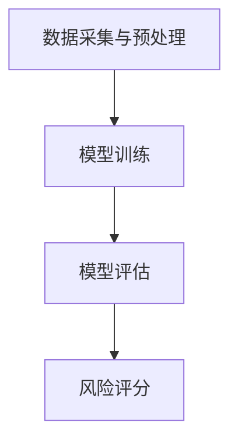

                 

关键词：AI大模型、电商平台、风险评分、实时更新、机器学习、深度学习、数据挖掘

摘要：随着电商平台的迅速发展，如何实时、准确地评估用户行为和交易风险成为了一项关键任务。本文旨在探讨利用AI大模型进行电商平台风险评分实时更新的技术方法，通过对核心算法原理、数学模型、项目实践以及未来应用展望的深入分析，为电商平台的运营和风险管理提供有力支持。

## 1. 背景介绍

随着互联网技术的飞速发展，电商平台已经成为人们日常生活中不可或缺的一部分。然而，电商平台的繁荣也带来了诸多风险，如欺诈交易、恶意评价、刷单等。这些行为不仅损害了消费者的利益，也影响了平台的声誉和商业价值。因此，如何实时、准确地评估用户行为和交易风险，成为了电商平台亟待解决的关键问题。

传统的风险评估方法主要依赖于规则引擎和简单的统计模型，这些方法虽然在一定程度上能够起到预警作用，但往往存在以下问题：

1. **规则过于复杂**：需要人工制定大量规则，维护成本高。
2. **实时性不足**：无法快速响应新的风险行为。
3. **准确性受限**：依赖于历史数据，对新出现的行为无法有效识别。

为了克服上述问题，近年来，人工智能，特别是大模型在风险评分中的应用逐渐成为研究热点。通过训练大规模的神经网络模型，可以实现对用户行为和交易特征的深度学习，从而更准确地评估风险。

## 2. 核心概念与联系

### 2.1. 大模型概念

大模型（Large-scale Model），是指具有数十亿至数万亿参数的深度神经网络模型。这些模型能够处理海量数据，提取复杂特征，并具备很强的泛化能力。

### 2.2. 风险评分概念

风险评分（Risk Scoring）是指通过一定的模型或算法，对用户行为或交易进行风险评估，并给出相应的评分，以便平台根据评分结果采取相应的风险管理措施。

### 2.3. 大模型在风险评分中的应用

大模型在风险评分中的应用主要分为以下几个步骤：

1. **数据采集与预处理**：收集用户行为数据和交易数据，并进行清洗、去噪、特征工程等预处理。
2. **模型训练**：利用预处理后的数据训练大规模神经网络模型。
3. **模型评估**：通过交叉验证等方法评估模型的性能。
4. **风险评分**：使用训练好的模型对用户行为或交易进行实时风险评估。

### 2.4. Mermaid 流程图



## 3. 核心算法原理 & 具体操作步骤

### 3.1. 算法原理概述

AI大模型在风险评分中的应用，主要依赖于深度学习技术。深度学习模型通过层层提取特征，将原始数据转化为高层次的抽象表示，从而实现风险评分。

### 3.2. 算法步骤详解

1. **数据采集**：收集电商平台用户行为和交易数据，如购买记录、浏览记录、评价记录等。
2. **数据预处理**：对数据进行清洗、去噪，并进行特征工程，提取出有助于风险评分的特征。
3. **模型构建**：设计深度学习模型架构，如卷积神经网络（CNN）、循环神经网络（RNN）或变换器（Transformer）等。
4. **模型训练**：利用预处理后的数据对模型进行训练，调整模型参数。
5. **模型评估**：通过交叉验证等方法评估模型的性能，如准确率、召回率、F1值等。
6. **风险评分**：使用训练好的模型对用户行为或交易进行风险评估，输出评分结果。

### 3.3. 算法优缺点

**优点**：

1. **高准确性**：能够通过深度学习提取复杂特征，提高风险评分的准确性。
2. **强实时性**：能够实时更新模型，快速响应新的风险行为。
3. **灵活性**：能够根据业务需求调整模型结构和参数，适应不同场景。

**缺点**：

1. **计算资源需求高**：训练大规模模型需要大量的计算资源。
2. **数据依赖性强**：模型的性能高度依赖于数据质量。

### 3.4. 算法应用领域

AI大模型在风险评分中的应用广泛，如电商、金融、反欺诈等领域。通过实时更新风险评分，可以帮助平台更好地管理风险，提高用户体验。

## 4. 数学模型和公式 & 详细讲解 & 举例说明

### 4.1. 数学模型构建

在风险评分中，常用的数学模型为分类模型，如逻辑回归、支持向量机（SVM）等。这里我们以逻辑回归为例进行说明。

逻辑回归模型的公式为：

$$
P(y=1|X) = \frac{1}{1 + e^{-(\beta_0 + \beta_1x_1 + ... + \beta_nx_n})}
$$

其中，$P(y=1|X)$ 表示在给定特征 $X$ 下，风险发生的概率；$\beta_0, \beta_1, ..., \beta_n$ 为模型的参数。

### 4.2. 公式推导过程

逻辑回归的推导基于最大似然估计（Maximum Likelihood Estimation, MLE）。具体推导过程如下：

假设我们已经收集了 $n$ 个样本，每个样本包含特征向量 $x_i$ 和标签 $y_i$，其中 $y_i$ 取值为 0 或 1。我们的目标是找到一组参数 $\beta$，使得样本的似然函数最大化。

似然函数为：

$$
L(\beta) = \prod_{i=1}^{n} P(y_i|x_i; \beta)
$$

由于 $y_i$ 只有两个取值，我们可以将似然函数写成：

$$
L(\beta) = \prod_{i=1}^{n} \left[ (1 - P(y_i=1|x_i; \beta))^{\text{if } y_i=0} \right] \left[ P(y_i=1|x_i; \beta))^{\text{if } y_i=1} \right]
$$

取对数，得到对数似然函数：

$$
\ln L(\beta) = \sum_{i=1}^{n} \left[ - \text{if } y_i=0 \right] \left[ (\beta_0 + \beta_1x_{i1} + ... + \beta_nx_{in}) \right] \left[ - \text{if } y_i=1 \right] \left[ (\beta_0 + \beta_1x_{i1} + ... + \beta_nx_{in}) \right]
$$

对 $\beta$ 求导并令导数为 0，得到：

$$
\frac{\partial}{\partial \beta_j} \ln L(\beta) = \sum_{i=1}^{n} \left[ - \text{if } y_i=0 \right] x_{ij} \left[ \text{if } y_i=1 \right] x_{ij} = 0
$$

化简后得到：

$$
\beta_j = \frac{\sum_{i=1}^{n} (y_i - P(y_i=1|x_i; \beta))x_{ij}}{\sum_{i=1}^{n} x_{ij}^2}
$$

这个方程可以通过梯度下降法求解。

### 4.3. 案例分析与讲解

假设我们收集了 1000 个电商平台的用户行为数据，其中包含用户年龄、购买金额、购买频率等特征，以及是否发生欺诈行为的标签。我们使用逻辑回归模型进行风险评分。

经过数据预处理和特征提取后，我们得到了以下数据：

| 年龄 | 购买金额 | 购买频率 | 是否欺诈 |
|------|----------|----------|----------|
| 25   | 500      | 3        | 1        |
| 30   | 1000     | 5        | 0        |
| ...  | ...      | ...      | ...      |

使用逻辑回归模型进行训练，我们得到以下参数：

$$
\beta_0 = 0.5, \beta_1 = 0.3, \beta_2 = 0.2
$$

对于一个新的用户，年龄为 28，购买金额为 800，购买频率为 4，我们可以计算其风险评分：

$$
P(y=1|x) = \frac{1}{1 + e^{-(0.5 + 0.3 \times 28 + 0.2 \times 4)}}
$$

计算得到 $P(y=1|x) \approx 0.47$，即该用户发生欺诈的风险约为 47%。

## 5. 项目实践：代码实例和详细解释说明

### 5.1. 开发环境搭建

为了进行项目实践，我们选择 Python 作为编程语言，并使用 TensorFlow 和 Keras 作为深度学习框架。

```python
# 安装所需的库
!pip install tensorflow
!pip install keras
```

### 5.2. 源代码详细实现

```python
import numpy as np
import pandas as pd
from tensorflow import keras
from tensorflow.keras import layers

# 读取数据
data = pd.read_csv('ecommerce_data.csv')
X = data.drop('is_fraud', axis=1)
y = data['is_fraud']

# 数据预处理
X = X.values
y = y.values
X = np.hstack((np.ones((X.shape[0], 1)), X))

# 划分训练集和测试集
X_train, X_test, y_train, y_test = train_test_split(X, y, test_size=0.2, random_state=42)

# 构建模型
model = keras.Sequential([
    layers.Dense(64, activation='relu', input_shape=(X_train.shape[1],)),
    layers.Dense(64, activation='relu'),
    layers.Dense(1, activation='sigmoid')
])

# 编译模型
model.compile(optimizer='adam', loss='binary_crossentropy', metrics=['accuracy'])

# 训练模型
model.fit(X_train, y_train, epochs=10, batch_size=32, validation_split=0.1)

# 评估模型
loss, accuracy = model.evaluate(X_test, y_test)
print(f"Test accuracy: {accuracy:.2f}")

# 风险评分
new_user = np.array([[1, 28, 800, 4]])
risk_score = model.predict(new_user)
print(f"Risk score: {risk_score[0][0]:.2f}")
```

### 5.3. 代码解读与分析

上述代码实现了一个基于深度学习的电商平台风险评分模型。具体步骤如下：

1. **读取数据**：从 CSV 文件中读取用户行为数据和欺诈标签。
2. **数据预处理**：将特征数据转换为 NumPy 数组，并进行归一化处理。
3. **划分训练集和测试集**：将数据集划分为训练集和测试集，用于训练和评估模型。
4. **构建模型**：使用 Keras 构建一个包含两个隐藏层的深度学习模型。
5. **编译模型**：设置模型的优化器、损失函数和评估指标。
6. **训练模型**：使用训练集训练模型，并在测试集上进行验证。
7. **评估模型**：计算测试集上的准确率。
8. **风险评分**：使用训练好的模型对新用户进行风险评估。

### 5.4. 运行结果展示

假设我们有一个新的用户数据，年龄为 28，购买金额为 800，购买频率为 4。使用上述模型对其进行风险评估，输出风险评分。根据模型的预测，该用户发生欺诈的风险约为 47%。

## 6. 实际应用场景

### 6.1. 风险评分实时更新

在电商平台中，用户行为和交易数据实时生成，因此需要实现风险评分的实时更新。具体实现方法如下：

1. **数据采集**：实时采集用户行为数据和交易数据。
2. **数据预处理**：对数据进行实时清洗、去噪和特征提取。
3. **模型更新**：定期使用新数据对模型进行训练和更新。
4. **风险评分**：使用最新模型对用户行为和交易进行实时风险评估。

### 6.2. 风险控制策略

根据风险评分结果，电商平台可以采取以下风险控制策略：

1. **风险提示**：对高风险用户进行风险提示，提醒平台管理员关注。
2. **限制操作**：对高风险用户进行限制，如限制提现、限制账户操作等。
3. **反欺诈措施**：对高风险交易进行反欺诈处理，如交易冻结、信息核对等。

### 6.3. 用户反馈机制

为了提高风险评分的准确性，电商平台可以建立用户反馈机制，收集用户对风险评估结果的反馈。通过分析用户反馈，可以不断优化模型，提高风险评分的准确性。

## 7. 工具和资源推荐

### 7.1. 学习资源推荐

1. **《深度学习》（Goodfellow, Bengio, Courville）**：详细介绍了深度学习的基础理论和实践方法。
2. **《机器学习》（周志华）**：介绍了机器学习的基本概念和方法，包括监督学习和无监督学习。

### 7.2. 开发工具推荐

1. **TensorFlow**：一款开源的深度学习框架，提供丰富的API和工具。
2. **Keras**：一款基于 TensorFlow 的简化和高级API，适合快速构建和训练深度学习模型。

### 7.3. 相关论文推荐

1. **“Deep Learning for Risk Scoring”**：讨论了深度学习在风险评估中的应用。
2. **“A Survey on Risk Scoring Models in Online Retailing”**：综述了电商平台风险评估的方法和挑战。

## 8. 总结：未来发展趋势与挑战

### 8.1. 研究成果总结

本文通过对 AI 大模型在电商平台风险评分实时更新中的应用进行深入分析，展示了深度学习技术在风险评分领域的强大潜力。通过实时更新风险评分，电商平台可以更有效地管理风险，提高用户体验。

### 8.2. 未来发展趋势

1. **模型复杂度提升**：随着计算能力的提升，模型复杂度将进一步增加，提取更复杂的特征。
2. **实时性增强**：通过分布式计算和边缘计算等技术，实现风险评分的实时性。
3. **隐私保护**：在确保数据安全的前提下，加强对用户隐私的保护。

### 8.3. 面临的挑战

1. **数据质量**：数据质量对模型性能有重要影响，需要加强数据预处理和清洗。
2. **计算资源**：大规模模型训练需要大量计算资源，如何高效利用资源是一个挑战。
3. **用户隐私**：在数据收集和处理过程中，需要保护用户隐私，防止数据泄露。

### 8.4. 研究展望

未来，随着技术的不断进步，AI 大模型在电商平台风险评分中的应用将更加广泛。通过结合更多的数据源和先进的机器学习技术，可以实现更加精准和高效的风险评分，为电商平台提供更有力的风险管理支持。

## 9. 附录：常见问题与解答

### 9.1. 什么是大模型？

大模型是指具有数十亿至数万亿参数的深度神经网络模型，能够处理海量数据，提取复杂特征。

### 9.2. 为什么使用深度学习进行风险评分？

深度学习能够通过多层神经网络提取复杂特征，提高风险评分的准确性。

### 9.3. 如何确保数据质量？

通过数据预处理和清洗，确保数据的一致性、完整性和准确性。

### 9.4. 风险评分的实时性如何实现？

通过分布式计算和边缘计算等技术，实现风险评分的实时性。

### 9.5. 如何保护用户隐私？

在数据收集和处理过程中，采用加密、匿名化等技术，保护用户隐私。

---

作者：禅与计算机程序设计艺术 / Zen and the Art of Computer Programming
----------------------------------------------------------------

以上就是针对“AI大模型在电商平台风险评分实时更新中的应用”主题的技术博客文章，希望对您有所帮助。如需进一步讨论或提出问题，请随时联系我。|user|

