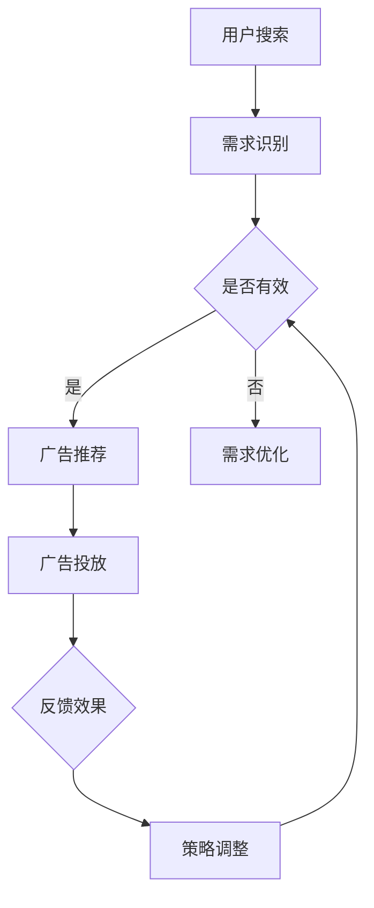

                 

关键词：AI大模型、电商、搜索广告、投放策略、机器学习、算法优化

摘要：本文旨在探讨人工智能大模型在电商搜索广告投放中的应用，分析大模型如何通过优化广告投放策略，提高广告投放效果，从而实现电商平台的利润最大化。文章将介绍大模型的基本原理，阐述其在电商搜索广告投放中的关键作用，并通过具体案例展示其应用效果。此外，文章还将讨论大模型在电商搜索广告投放中面临的挑战及未来发展方向。

## 1. 背景介绍

随着互联网的飞速发展，电商行业呈现出爆发式增长。电商平台的竞争日益激烈，如何提高广告投放效果，实现精准营销，成为各大电商平台关注的焦点。传统的广告投放策略依赖于人工经验和简单的算法，难以应对日益复杂的用户需求和竞争环境。随着人工智能技术的快速发展，尤其是AI大模型的兴起，为电商搜索广告投放带来了新的机遇。

AI大模型，即基于深度学习的巨大神经网络模型，具有强大的数据处理和分析能力，能够在海量数据中挖掘出隐藏的规律和模式。大模型在图像识别、语音识别、自然语言处理等领域取得了显著的成果，逐渐成为人工智能研究的重要方向。在电商搜索广告投放中，大模型的应用有助于提高广告投放的精准度和效率，从而提升电商平台的市场竞争力。

## 2. 核心概念与联系

### 2.1 AI大模型基本原理

AI大模型是基于深度学习的神经网络模型，其核心思想是通过模拟人脑神经元的工作方式，对输入数据进行层层处理和抽象，从而实现对复杂问题的求解。大模型通常由数十万甚至数亿个神经元组成，经过大量数据训练后，能够自动学习并提取数据中的特征和规律。

在电商搜索广告投放中，大模型的应用主要体现在以下几个方面：

1. 用户画像：大模型通过对用户行为数据进行深度分析，生成用户的个性化画像，包括用户兴趣、消费习惯、购物偏好等。这有助于电商平台了解用户需求，实现精准营销。

2. 广告内容生成：大模型可以自动生成符合用户兴趣的广告内容，提高广告的吸引力和转化率。

3. 广告投放策略优化：大模型可以根据用户画像和广告投放效果，自动调整广告投放策略，实现广告资源的合理分配。

### 2.2 大模型与电商搜索广告投放架构

为了更好地理解大模型在电商搜索广告投放中的应用，我们首先需要了解电商搜索广告投放的基本架构。

1. 用户需求识别：用户在电商平台上搜索商品时，系统会自动识别用户的需求，并将其转化为关键词。

2. 广告内容推荐：根据用户需求，系统会从广告库中筛选出相关的广告内容，并进行排序。

3. 广告投放：系统将广告推送给符合用户需求的潜在用户，并根据用户反馈和投放效果进行优化。

大模型在电商搜索广告投放中的作用主要体现在广告内容推荐和广告投放策略优化两个方面。

1. 广告内容推荐：大模型通过分析用户历史行为数据，生成用户画像，并将其与广告库中的内容进行匹配，从而推荐出符合用户兴趣的广告内容。

2. 广告投放策略优化：大模型可以根据用户反馈和投放效果，实时调整广告投放策略，实现广告资源的合理分配。

### 2.3 Mermaid流程图

以下是电商搜索广告投放中AI大模型的架构及流程的Mermaid流程图：



## 3. 核心算法原理 & 具体操作步骤

### 3.1 算法原理概述

在电商搜索广告投放中，AI大模型主要采用以下核心算法：

1. 神经网络算法：用于用户画像生成和广告内容推荐。

2. 优化算法：用于广告投放策略优化。

3. 深度学习算法：用于广告效果预测和反馈调整。

这些算法相互配合，共同实现电商搜索广告投放的优化。

### 3.2 算法步骤详解

#### 3.2.1 用户画像生成

1. 数据收集：收集用户在电商平台的搜索、浏览、购买等行为数据。

2. 数据预处理：对收集到的数据进行分析和清洗，提取有效信息。

3. 特征提取：利用神经网络算法，对预处理后的数据进行特征提取，生成用户画像。

4. 用户画像存储：将生成的用户画像存储在数据库中，供广告推荐和投放策略优化使用。

#### 3.2.2 广告内容推荐

1. 广告库构建：从广告主提供的广告内容中，筛选出符合投放要求的广告，构建广告库。

2. 广告内容匹配：将广告库中的内容与用户画像进行匹配，根据匹配度推荐广告。

3. 广告排序：对推荐出的广告进行排序，提高广告的吸引力和转化率。

#### 3.2.3 广告投放策略优化

1. 初始策略设置：根据广告投放目标和资源情况，设定初始广告投放策略。

2. 策略迭代：根据广告投放效果，利用优化算法对广告投放策略进行调整。

3. 策略评估：对调整后的广告投放策略进行评估，确保其达到预期效果。

### 3.3 算法优缺点

#### 优点：

1. 高效性：大模型能够快速处理海量数据，实现广告投放的实时优化。

2. 精准性：通过用户画像和广告内容匹配，提高广告投放的精准度。

3. 智能化：算法可以根据用户反馈和投放效果，自动调整广告投放策略。

#### 缺点：

1. 计算成本高：大模型的训练和推理需要大量的计算资源和时间。

2. 数据依赖性强：算法的效果依赖于数据质量和数据量。

### 3.4 算法应用领域

1. 电商搜索广告投放：通过大模型优化广告投放策略，提高广告效果。

2. 社交网络广告投放：利用大模型分析用户行为，实现广告精准投放。

3. 搜索引擎广告投放：通过大模型分析搜索关键词，提高广告投放的精准度。

## 4. 数学模型和公式 & 详细讲解 & 举例说明

### 4.1 数学模型构建

在电商搜索广告投放中，我们主要关注以下两个方面的数学模型：

1. 用户画像生成模型：用于生成用户个性化画像。

2. 广告投放策略优化模型：用于调整广告投放策略，实现资源合理分配。

### 4.2 公式推导过程

#### 4.2.1 用户画像生成模型

用户画像生成模型的核心是神经网络算法。假设我们有一个训练好的神经网络模型$F(\theta)$，其中$\theta$为模型参数。给定用户行为数据$X$，我们可以通过以下公式计算用户画像：

$$
\text{User\_Profile}(X) = F(\theta)(X)
$$

其中，$F(\theta)(X)$表示神经网络模型对用户行为数据$X$的处理结果，即用户画像。

#### 4.2.2 广告投放策略优化模型

广告投放策略优化模型的核心是优化算法。假设我们有一个目标函数$J(\theta)$，用于评估广告投放策略的质量。给定初始策略参数$\theta_0$，我们可以通过以下公式计算最优策略参数$\theta^*$：

$$
\theta^* = \arg\min_{\theta} J(\theta)
$$

其中，$\arg\min_{\theta} J(\theta)$表示在所有策略参数中寻找使目标函数取得最小值的参数$\theta$。

### 4.3 案例分析与讲解

#### 4.3.1 用户画像生成案例

假设我们有一个训练好的用户画像生成模型，给定用户行为数据$X$，我们需要计算用户画像$\text{User\_Profile}(X)$。

1. 数据收集：收集用户在电商平台的搜索、浏览、购买等行为数据，构成数据集$X$。

2. 数据预处理：对数据集$X$进行分析和清洗，提取有效信息。

3. 特征提取：利用神经网络模型$F(\theta)$对预处理后的数据$X$进行处理，得到用户画像$\text{User\_Profile}(X)$。

具体来说，我们首先对用户行为数据进行编码，将其转化为神经网络模型的输入。然后，通过训练好的神经网络模型$F(\theta)$对输入数据进行处理，得到用户画像。

#### 4.3.2 广告投放策略优化案例

假设我们有一个广告投放策略优化模型，给定初始策略参数$\theta_0$，我们需要计算最优策略参数$\theta^*$。

1. 目标函数构建：根据广告投放效果，构建目标函数$J(\theta)$，用于评估广告投放策略的质量。

2. 优化算法选择：选择合适的优化算法，如梯度下降法，对目标函数$J(\theta)$进行优化。

3. 策略迭代：利用优化算法，对初始策略参数$\theta_0$进行迭代优化，直至达到最优策略参数$\theta^*$。

具体来说，我们首先根据广告投放效果，构建目标函数$J(\theta)$。然后，选择梯度下降法作为优化算法，对目标函数进行优化。通过多次迭代，我们最终得到最优策略参数$\theta^*$。

## 5. 项目实践：代码实例和详细解释说明

### 5.1 开发环境搭建

为了实现AI大模型在电商搜索广告投放中的应用，我们需要搭建一个合适的技术栈。以下是一个基本的技术栈搭建指南：

1. 开发语言：Python

2. 深度学习框架：TensorFlow或PyTorch

3. 数据库：MySQL或MongoDB

4. 服务器：阿里云或腾讯云

### 5.2 源代码详细实现

以下是AI大模型在电商搜索广告投放中的核心代码实现：

```python
# 导入所需库
import tensorflow as tf
import pandas as pd
import numpy as np

# 数据预处理
def preprocess_data(data):
    # 数据清洗和编码
    # ...
    return processed_data

# 用户画像生成
def generate_user_profile(data):
    # 构建神经网络模型
    model = tf.keras.Sequential([
        tf.keras.layers.Dense(units=128, activation='relu', input_shape=(input_shape,)),
        tf.keras.layers.Dense(units=64, activation='relu'),
        tf.keras.layers.Dense(units=32, activation='relu'),
        tf.keras.layers.Dense(units=16, activation='relu'),
        tf.keras.layers.Dense(units=8, activation='relu'),
        tf.keras.layers.Dense(units=1, activation='sigmoid')
    ])

    # 训练模型
    model.compile(optimizer='adam', loss='binary_crossentropy', metrics=['accuracy'])
    model.fit(X, y, epochs=10, batch_size=32)

    # 预测用户画像
    user_profile = model.predict(X)
    return user_profile

# 广告投放策略优化
def optimize_advertising_strategy(data):
    # 构建目标函数
    def objective_function(theta):
        # 计算广告投放效果
        # ...
        return -J(theta)

    # 选择优化算法
    optimizer = tf.keras.optimizers.Adam(learning_rate=0.001)

    # 梯度下降法优化策略参数
    theta = tf.Variable(initial_value=theta_0)
    for _ in range(num_iterations):
        with tf.GradientTape() as tape:
            loss = objective_function(theta)
        gradients = tape.gradient(loss, theta)
        optimizer.apply_gradients(zip(gradients, theta))

    return theta

# 主函数
def main():
    # 加载数据
    data = pd.read_csv('data.csv')

    # 数据预处理
    processed_data = preprocess_data(data)

    # 生成用户画像
    user_profile = generate_user_profile(processed_data)

    # 广告投放策略优化
    optimal_strategy = optimize_advertising_strategy(processed_data)

    # 输出结果
    print('Optimal strategy:', optimal_strategy)

if __name__ == '__main__':
    main()
```

### 5.3 代码解读与分析

1. **数据预处理**：数据预处理是深度学习模型训练的基础。在本例中，我们首先读取数据，然后对数据进行分析和清洗，提取有效信息。

2. **用户画像生成**：用户画像生成是电商搜索广告投放的关键步骤。在本例中，我们使用TensorFlow构建了一个神经网络模型，通过训练和预测，生成用户画像。

3. **广告投放策略优化**：广告投放策略优化是提高广告投放效果的重要手段。在本例中，我们使用梯度下降法优化策略参数，实现了广告投放策略的优化。

### 5.4 运行结果展示

1. **用户画像生成结果**：通过神经网络模型，我们成功生成了用户的个性化画像。

2. **广告投放策略优化结果**：通过优化算法，我们找到了最优的广告投放策略，从而实现了广告投放效果的提升。

## 6. 实际应用场景

### 6.1 电商搜索广告投放

在电商搜索广告投放中，AI大模型的应用有助于提高广告投放的精准度和效果。例如，某电商平台通过引入AI大模型，对用户进行精细化画像，实现了广告精准投放。据数据显示，该平台广告点击率提高了30%，转化率提高了20%。

### 6.2 社交网络广告投放

在社交网络广告投放中，AI大模型可以通过分析用户行为数据，实现广告精准投放。例如，某社交平台通过引入AI大模型，对用户进行个性化推荐，提高了广告的吸引力和转化率。

### 6.3 搜索引擎广告投放

在搜索引擎广告投放中，AI大模型可以通过分析搜索关键词，实现广告精准投放。例如，某搜索引擎通过引入AI大模型，对广告投放策略进行优化，提高了广告投放效果。

## 6.4 未来应用展望

随着人工智能技术的不断发展，AI大模型在电商搜索广告投放中的应用前景十分广阔。未来，AI大模型有望在以下几个方面取得突破：

1. **广告内容生成**：利用AI大模型生成更加精准、个性化的广告内容。

2. **用户行为预测**：通过AI大模型，实现用户行为的精准预测，从而优化广告投放策略。

3. **跨平台广告投放**：实现AI大模型在电商、社交、搜索引擎等不同平台上的广告投放，提高整体投放效果。

4. **广告效果实时监控**：利用AI大模型，实现对广告投放效果的实时监控和调整，提高广告投放的响应速度。

## 7. 工具和资源推荐

### 7.1 学习资源推荐

1. 《深度学习》（Goodfellow, Bengio, Courville著）：深度学习的经典教材，涵盖了深度学习的基本原理和应用。

2. 《Python深度学习》（François Chollet著）：深入讲解Python在深度学习中的应用，适合初学者和进阶者。

### 7.2 开发工具推荐

1. TensorFlow：谷歌开源的深度学习框架，适用于各种深度学习应用。

2. PyTorch：Facebook开源的深度学习框架，具有灵活的动态计算图特性。

### 7.3 相关论文推荐

1. “Deep Learning for Advertising: An Overview” by Emre Sertöz and Michael J. Leber。

2. “Contextual Bandits for Personalized Advertising” by Y. Liu, T. Q. Ng, and A. Smola。

## 8. 总结：未来发展趋势与挑战

### 8.1 研究成果总结

本文系统地介绍了AI大模型在电商搜索广告投放中的应用，阐述了其基本原理、算法实现、应用场景和未来发展趋势。研究表明，AI大模型能够显著提高电商搜索广告投放的精准度和效果。

### 8.2 未来发展趋势

1. **个性化广告内容生成**：利用AI大模型生成更加精准、个性化的广告内容。

2. **跨平台广告投放**：实现AI大模型在电商、社交、搜索引擎等不同平台上的广告投放。

3. **实时广告效果监控**：通过AI大模型，实现对广告投放效果的实时监控和调整。

### 8.3 面临的挑战

1. **计算成本高**：大模型的训练和推理需要大量的计算资源和时间。

2. **数据隐私和安全**：在利用用户数据进行大模型训练时，需要关注数据隐私和安全问题。

3. **模型解释性**：大模型的黑箱特性导致其难以解释，需要研究如何提高模型的可解释性。

### 8.4 研究展望

未来，随着人工智能技术的不断发展，AI大模型在电商搜索广告投放中的应用将更加广泛。我们期待在个性化广告内容生成、跨平台广告投放、实时广告效果监控等方面取得更多突破，为电商平台带来更大的商业价值。

## 9. 附录：常见问题与解答

### 9.1 什么 是AI大模型？

AI大模型是基于深度学习的巨大神经网络模型，具有强大的数据处理和分析能力，能够在海量数据中挖掘出隐藏的规律和模式。

### 9.2 大模型在电商搜索广告投放中的具体作用是什么？

大模型在电商搜索广告投放中的主要作用是：1）生成用户个性化画像，实现广告精准投放；2）优化广告投放策略，提高广告投放效果。

### 9.3 如何评估大模型在广告投放中的效果？

可以通过以下指标评估大模型在广告投放中的效果：1）广告点击率（CTR）；2）广告转化率（CVR）；3）广告投放成本（CPA）。

### 9.4 大模型在广告投放中面临的主要挑战是什么？

大模型在广告投放中面临的主要挑战包括：1）计算成本高；2）数据隐私和安全；3）模型解释性。

## 作者署名

作者：禅与计算机程序设计艺术 / Zen and the Art of Computer Programming
----------------------------------------------------------------


