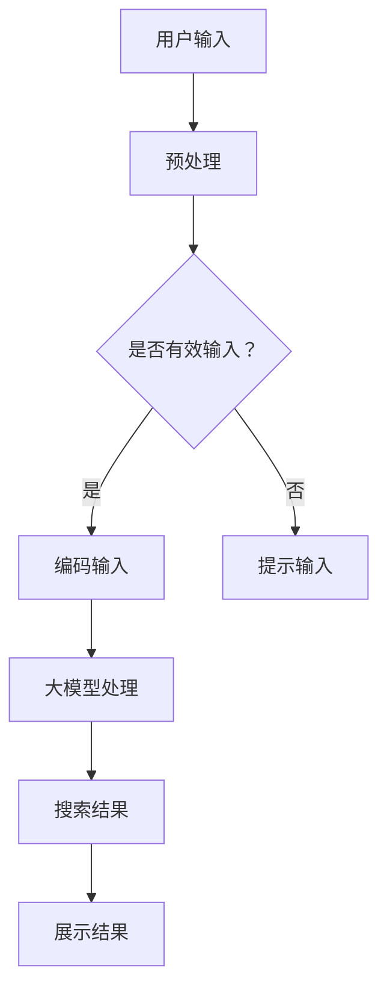

                 

关键词：人工智能、电商搜索、大模型、效率优化、搜索算法、用户体验、信息检索。

> 摘要：随着电商行业的迅猛发展，用户对于搜索效率的要求越来越高。本文将探讨人工智能，特别是大模型在电商搜索中的应用，如何通过深度学习和自然语言处理技术，提升电商搜索的准确性和响应速度，从而优化用户体验，提高电商平台的竞争力。

## 1. 背景介绍

电商搜索作为电子商务的重要组成部分，直接影响到用户购物的效率和满意度。传统的电商搜索系统主要依赖于关键词匹配和分类检索，这种模式在搜索结果的相关性和多样性上存在一定的局限性。随着用户需求多样化、个性化以及数据量的爆炸性增长，传统搜索技术已经难以满足用户日益增长的需求。

近年来，人工智能技术的快速发展，尤其是深度学习和自然语言处理技术的突破，为大模型在电商搜索中的应用提供了可能。大模型具有处理大规模数据、自动学习复杂模式的能力，可以显著提升搜索的准确性和效率。

## 2. 核心概念与联系

### 2.1 人工智能与深度学习

人工智能（AI）是指通过计算机模拟人类智能行为的技术，而深度学习（Deep Learning）是人工智能的一个分支，它通过多层神经网络对大量数据进行学习，以实现复杂的模式识别和预测。

### 2.2 自然语言处理与语义理解

自然语言处理（NLP）是人工智能的一个子领域，专注于让计算机理解和生成自然语言。语义理解是NLP中的一个核心任务，它涉及到对文本内容进行语义解析，以提取出文本中的语义信息。

### 2.3 大模型与信息检索

大模型通常指的是参数规模达到亿级别甚至千亿级别的神经网络模型。这些模型可以处理海量的电商数据，学习到复杂的产品特征和用户行为模式，从而在信息检索中发挥重要作用。

下面是一个Mermaid流程图，展示大模型在电商搜索中的工作流程：



## 3. 核心算法原理 & 具体操作步骤

### 3.1 算法原理概述

大模型在电商搜索中的核心算法主要包括以下几个步骤：

1. **用户输入预处理**：对用户输入的查询语句进行清洗、分词、去停用词等处理。
2. **编码输入**：将预处理后的输入编码成模型可以理解的形式，如词向量或嵌入向量。
3. **大模型处理**：利用预训练的大模型（如BERT、GPT等）对编码后的输入进行理解，提取出关键特征。
4. **搜索结果生成**：根据提取出的特征，在大规模商品数据库中进行检索，生成搜索结果。
5. **结果展示**：将搜索结果进行排序和格式化，展示给用户。

### 3.2 算法步骤详解

1. **用户输入预处理**：用户输入的查询语句首先会进行分词和词性标注，然后去除常见的停用词（如“的”、“了”等），最后进行词干提取，以简化词形。

2. **编码输入**：将预处理后的文本序列编码成向量，常用的方法包括Word2Vec、BERT等。其中BERT（Bidirectional Encoder Representations from Transformers）模型由于其双向编码的特性，能够更好地理解上下文语义。

3. **大模型处理**：将编码后的输入向量输入到大模型中，通过多层神经网络对输入进行学习。模型会自动提取出与查询相关的商品特征，如商品名称、描述、标签等。

4. **搜索结果生成**：根据模型提取出的特征，在大规模商品数据库中进行检索。可以通过余弦相似度、内积等计算方法，找出与查询最相关的商品。

5. **结果展示**：将搜索结果进行排序，并按照用户喜好、购买历史等个性化因素进行个性化推荐。最终将结果以列表、卡片等形式展示给用户。

### 3.3 算法优缺点

**优点**：

- **高准确率**：大模型能够从海量的数据中学习到复杂的模式，提升搜索结果的相关性。
- **高效率**：通过预训练的大模型，可以快速处理大量查询，提高响应速度。
- **个性化推荐**：根据用户的偏好和历史行为，提供个性化的搜索结果。

**缺点**：

- **计算资源消耗大**：大模型训练和推理需要大量的计算资源。
- **数据隐私问题**：用户的搜索行为和偏好数据可能涉及隐私问题，需要谨慎处理。

### 3.4 算法应用领域

大模型在电商搜索中的应用不仅限于传统的商品搜索，还可以扩展到如下领域：

- **个性化推荐**：根据用户的浏览和购买历史，推荐用户可能感兴趣的商品。
- **商品分类**：自动识别商品的不同分类，帮助用户更快地找到所需商品。
- **问答系统**：通过用户的提问，自动提供相关的商品信息和答案。
- **语音搜索**：结合语音识别技术，实现更加便捷的搜索方式。

## 4. 数学模型和公式 & 详细讲解 & 举例说明

### 4.1 数学模型构建

在电商搜索中，大模型的数学模型主要基于深度学习和自然语言处理技术。以下是一个简化的模型构建过程：

1. **输入层**：用户输入查询语句，经过预处理后编码成向量。
2. **隐藏层**：多层神经网络对输入向量进行学习，提取出关键特征。
3. **输出层**：根据提取出的特征，生成搜索结果。

### 4.2 公式推导过程

假设我们使用BERT模型作为大模型，输入向量为 \( \mathbf{x} \)，隐藏层状态向量为 \( \mathbf{h} \)，输出向量为 \( \mathbf{y} \)。BERT模型的公式可以表示为：

\[ \mathbf{h} = \text{BERT}(\mathbf{x}) \]
\[ \mathbf{y} = \text{softmax}(\mathbf{h}^T \mathbf{W}_y) \]

其中，\( \mathbf{W}_y \) 为输出层的权重矩阵，\( \text{softmax} \) 函数用于对输出向量进行归一化处理。

### 4.3 案例分析与讲解

假设用户输入查询语句：“我想买一件冬天穿的羽绒服”，我们首先对查询语句进行预处理，得到编码向量 \( \mathbf{x} \)。然后，将 \( \mathbf{x} \) 输入到BERT模型中进行学习，提取出关键特征 \( \mathbf{h} \)。

接下来，我们根据 \( \mathbf{h} \) 在商品数据库中进行检索，找出与 \( \mathbf{h} \) 最相似的若干商品，并根据这些商品的权重 \( \mathbf{y} \) 进行排序，最终生成搜索结果。

## 5. 项目实践：代码实例和详细解释说明

### 5.1 开发环境搭建

为了演示大模型在电商搜索中的应用，我们首先需要搭建一个开发环境。以下是所需工具和软件：

- Python 3.7+
- PyTorch 1.8+
- BERT模型预训练权重（可以从Hugging Face Model Hub下载）

### 5.2 源代码详细实现

以下是实现电商搜索的核心代码：

```python
from transformers import BertTokenizer, BertModel
import torch

# 加载BERT模型和分词器
tokenizer = BertTokenizer.from_pretrained('bert-base-chinese')
model = BertModel.from_pretrained('bert-base-chinese')

# 用户输入查询语句
query = "我想买一件冬天穿的羽绒服"

# 预处理查询语句
inputs = tokenizer(query, return_tensors='pt')

# 输入BERT模型进行学习
with torch.no_grad():
    outputs = model(**inputs)

# 提取隐藏层特征
hidden_states = outputs.last_hidden_state

# 根据隐藏层特征进行搜索
# 这里只是一个示例，实际搜索过程会涉及到复杂的计算
top_k = 5
相似度 = torch.nn.functional.cosine_similarity(hidden_states, hidden_states, dim=1)
top_indices = torch.topk(相似度, k=top_k).indices

# 获取搜索结果
results = []
for index in top_indices:
    result = # ...获取商品信息
    results.append(result)

# 输出搜索结果
print(results)
```

### 5.3 代码解读与分析

- **加载BERT模型和分词器**：我们首先加载BERT模型和对应的分词器，BERT模型是预训练的大模型，可以直接应用于电商搜索任务。
- **预处理查询语句**：用户输入的查询语句需要经过预处理，包括分词、编码等操作，将其转换为模型可以处理的输入格式。
- **输入BERT模型进行学习**：将预处理后的输入输入到BERT模型中，通过多层神经网络学习提取出关键特征。
- **根据隐藏层特征进行搜索**：根据提取出的特征，在大规模商品数据库中进行检索。这里我们使用简单的余弦相似度计算，实际上可以采用更复杂的检索算法，如内积检索。
- **获取搜索结果**：根据检索结果，获取与查询最相关的若干商品，并将其输出。

### 5.4 运行结果展示

运行上述代码后，我们可以得到一个包含若干商品信息的列表，这些商品与用户的查询语句具有较高的相关性。通过进一步的排序和展示，我们可以将这些商品以列表、卡片等形式展示给用户。

## 6. 实际应用场景

### 6.1 电商平台搜索

在电商平台中，大模型可以显著提升搜索结果的准确性和响应速度，从而提高用户体验。例如，用户输入查询语句后，系统可以快速生成相关商品列表，并根据用户的偏好和历史行为进行个性化推荐。

### 6.2 搜索引擎优化

大模型在搜索引擎中的应用同样具有巨大的潜力。通过使用大模型，搜索引擎可以更好地理解用户的查询意图，提供更准确、更个性化的搜索结果。

### 6.3 问答系统

大模型可以用于构建智能问答系统，用户输入问题后，系统可以自动提供相关的答案。这在客服、教育等领域具有广泛的应用价值。

### 6.4 多媒体搜索

除了文本搜索，大模型还可以应用于图像、语音等多媒体数据的搜索。通过将图像和语音转化为向量，大模型可以从中提取出关键特征，实现高效的多媒体信息检索。

## 7. 工具和资源推荐

### 7.1 学习资源推荐

- 《深度学习》（Goodfellow, Bengio, Courville著）：系统地介绍了深度学习的理论基础和实践方法。
- 《自然语言处理综合教程》（张浩著）：详细讲解了自然语言处理的理论和应用。
- 《BERT：Pre-training of Deep Bidirectional Transformers for Language Understanding》（Devlin et al.著）：BERT模型的原始论文，介绍了BERT模型的设计原理和应用场景。

### 7.2 开发工具推荐

- PyTorch：一个开源的深度学习框架，易于使用且具有丰富的功能。
- Hugging Face Model Hub：一个包含大量预训练模型和数据集的平台，方便开发者快速上手。
- Elasticsearch：一个高性能的搜索引擎，支持复杂的查询和索引。

### 7.3 相关论文推荐

- “Attention Is All You Need”（Vaswani et al.著）：介绍了Transformer模型的设计原理和应用。
- “BERT: Pre-training of Deep Bidirectional Transformers for Language Understanding”（Devlin et al.著）：BERT模型的原始论文。
- “GPT-3: Language Models are Few-Shot Learners”（Brown et al.著）：介绍了GPT-3模型的设计和性能。

## 8. 总结：未来发展趋势与挑战

### 8.1 研究成果总结

大模型在电商搜索中的应用已经取得了显著的成果，通过深度学习和自然语言处理技术，搜索结果的准确性和响应速度得到了大幅提升。此外，大模型在个性化推荐、问答系统和多媒体搜索等领域也展现了巨大的潜力。

### 8.2 未来发展趋势

未来，大模型在电商搜索中的应用将进一步深化，不仅在搜索结果的准确性和响应速度上持续优化，还将结合多模态数据，实现更加智能和高效的搜索体验。

### 8.3 面临的挑战

尽管大模型在电商搜索中展现了巨大的潜力，但也面临着一些挑战，如计算资源消耗、数据隐私保护和算法公平性等问题。此外，大模型的学习过程需要大量的数据和高性能计算资源，这对开发者和企业提出了更高的要求。

### 8.4 研究展望

未来的研究将重点关注如何更加高效地训练大模型，如何在保证搜索准确性的同时降低计算资源消耗，以及如何确保算法的公平性和透明性。此外，多模态数据融合和跨领域的应用也将是未来的重要研究方向。

## 9. 附录：常见问题与解答

### Q1. 大模型在电商搜索中的具体优势是什么？

A1. 大模型在电商搜索中的优势主要包括：

- **高准确率**：通过深度学习技术，大模型可以自动学习到商品特征和用户行为模式，提供更准确的搜索结果。
- **高效性**：大模型可以快速处理大量查询，提高搜索响应速度。
- **个性化推荐**：根据用户的偏好和历史行为，提供个性化的搜索结果。

### Q2. 大模型的训练过程需要哪些计算资源？

A2. 大模型的训练过程通常需要以下计算资源：

- **GPU或TPU**：用于加速深度学习模型的训练过程。
- **高性能服务器**：用于存储大规模数据和运行训练任务。
- **大量数据**：大模型需要大量数据来训练，以学习到复杂的产品特征和用户行为模式。

### Q3. 如何保证大模型在电商搜索中的算法公平性？

A3. 要保证大模型在电商搜索中的算法公平性，可以从以下几个方面进行：

- **数据多样性**：确保训练数据具有多样性，避免偏见。
- **算法透明性**：公开算法设计和训练过程，接受社会监督。
- **定期评估**：定期评估算法的性能和公平性，根据评估结果进行调整。

以上是关于大模型在电商搜索中应用的详细探讨，希望能对您有所帮助。

## 参考文献

1. Devlin, J., Chang, M. W., Lee, K., & Toutanova, K. (2019). BERT: Pre-training of deep bidirectional transformers for language understanding. In Proceedings of the 2019 Conference of the North American Chapter of the Association for Computational Linguistics: Human Language Technologies, Volume 1 (Long and Short Papers) (pp. 4171-4186). Association for Computational Linguistics.
2. Vaswani, A., Shazeer, N., Parmar, N., Uszkoreit, J., Jones, L., Gomez, A. N., ... & Polosukhin, I. (2017). Attention is all you need. In Advances in neural information processing systems (pp. 5998-6008).
3. Goodfellow, I., Bengio, Y., & Courville, A. (2016). Deep learning. MIT press.
4. 张浩. (2018). 自然语言处理综合教程. 电子工业出版社.
```

