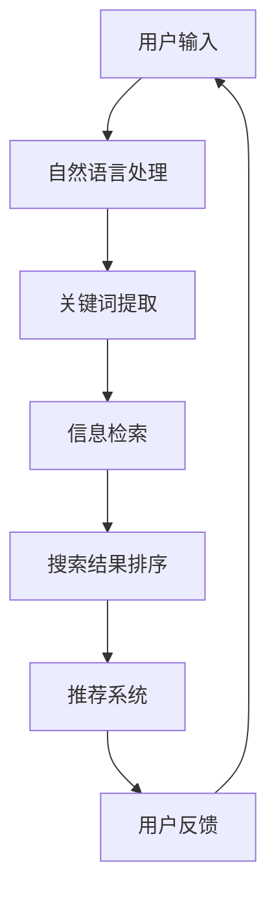

                 

关键词：人工智能，大模型，电商平台，移动搜索，用户体验，搜索优化，自然语言处理，推荐系统，信息检索。

> 摘要：本文探讨了人工智能大模型在电商平台移动搜索体验中的应用，分析了大模型如何通过自然语言处理、推荐系统和信息检索技术，提高移动搜索的准确性、多样性和个性化，从而提升用户的购物体验。

## 1. 背景介绍

随着移动互联网的普及，电商平台的移动端用户数量持续增长，移动搜索成为用户发现和购买商品的重要途径。然而，传统的移动搜索技术存在诸多问题，如搜索结果准确性不高、相关度不足、用户体验差等。为了解决这些问题，人工智能和机器学习技术被广泛应用到电商平台的移动搜索中。特别是近年来，大模型（如GPT、BERT等）的兴起，为移动搜索体验的优化带来了新的契机。

## 2. 核心概念与联系

### 2.1 自然语言处理（NLP）

自然语言处理是人工智能的一个重要分支，旨在让计算机理解和处理人类语言。在移动搜索中，NLP技术用于理解和解析用户的搜索查询，提取关键词和语义信息，从而为搜索结果提供支持。

### 2.2 推荐系统

推荐系统是一种个性化服务，通过分析用户的历史行为和兴趣，为用户推荐相关商品。在移动搜索中，推荐系统可以帮助用户快速找到符合需求的商品，提高搜索的效率和满意度。

### 2.3 信息检索

信息检索是一种从大量数据中找到用户所需信息的方法。在移动搜索中，信息检索技术用于从电商平台的海量商品中检索出与用户查询相关的商品，并排序展示给用户。

下面是核心概念原理和架构的Mermaid流程图：



## 3. 核心算法原理 & 具体操作步骤

### 3.1 算法原理概述

人工智能大模型在移动搜索中的核心作用是通过深度学习和自然语言处理技术，对用户的搜索查询进行理解和解析，从而提供更准确、相关和个性化的搜索结果。具体来说，大模型可以通过以下步骤实现这一目标：

1. **理解查询**：使用NLP技术对用户的查询语句进行分词、词性标注、实体识别等处理，提取出关键词和语义信息。
2. **检索信息**：利用信息检索技术，在海量商品数据中查找与关键词相关的商品，并根据语义匹配度进行排序。
3. **推荐结果**：根据用户的兴趣和购物历史，使用推荐系统为用户推荐相关商品。

### 3.2 算法步骤详解

#### 3.2.1 理解查询

- **分词**：将用户的查询语句分解成单个词语，例如“我想买一款红色的手机”会被分解成“我想”、“买”、“一款”、“红色”、“手机”。
- **词性标注**：为每个词语标注词性，如“手机”是名词，“买”是动词。
- **实体识别**：识别出查询语句中的实体，如“红色”是颜色实体，“手机”是商品实体。

#### 3.2.2 检索信息

- **关键词匹配**：根据提取的关键词，在商品数据库中查找相关的商品。
- **语义匹配**：使用自然语言处理技术，对查询和商品描述进行语义分析，计算匹配度。

#### 3.2.3 推荐结果

- **用户兴趣分析**：通过分析用户的购物历史和行为，了解用户的兴趣和偏好。
- **推荐算法**：使用推荐系统算法，为用户推荐相关的商品。

### 3.3 算法优缺点

#### 优点：

- **准确性高**：大模型通过深度学习，能够更好地理解用户的查询意图，提高搜索结果的准确性。
- **个性化强**：推荐系统能够根据用户的兴趣和偏好，为用户推荐个性化的商品，提高用户的购物体验。

#### 缺点：

- **计算资源消耗大**：大模型训练和推理需要大量的计算资源，可能导致搜索延迟。
- **隐私保护挑战**：用户兴趣和购物历史等数据需要严格保护，以防止隐私泄露。

### 3.4 算法应用领域

人工智能大模型在移动搜索中的应用非常广泛，不仅限于电商平台，还可以应用于在线教育、内容推荐、社交媒体等领域。随着大模型技术的不断发展，其在各个领域的应用前景将更加广阔。

## 4. 数学模型和公式 & 详细讲解 & 举例说明

### 4.1 数学模型构建

在移动搜索中，大模型的数学模型通常包括以下几个部分：

- **输入层**：用户的查询语句。
- **隐藏层**：用于提取关键词和语义信息。
- **输出层**：搜索结果和推荐结果。

### 4.2 公式推导过程

以BERT模型为例，其输入层和输出层的公式如下：

- **输入层**：\( x = [w_1, w_2, ..., w_n] \)，其中\( w_i \)是查询语句中的第\( i \)个词语。
- **隐藏层**：\( h = \text{BERT}(x) \)，其中\( \text{BERT} \)是BERT模型的处理过程。
- **输出层**：\( y = \text{softmax}(h) \)，其中\( \text{softmax} \)函数用于计算每个搜索结果的概率。

### 4.3 案例分析与讲解

假设用户输入查询语句“我想买一款红色的手机”，BERT模型会按照以下步骤进行处理：

1. **输入层**：将查询语句分解成单个词语，形成向量\[“我”，“想”，“买”，“一”，“款”，“红”，“色”，“手”，“机”\]。
2. **隐藏层**：BERT模型对每个词语进行编码，形成高维向量，如\[“我”（\[1, 0, 0, 0, 0, 0, 0, 0, 0\]），“想”（\[0, 1, 0, 0, 0, 0, 0, 0, 0\]），“买”（\[0, 0, 1, 0, 0, 0, 0, 0, 0\]），“一”（\[0, 0, 0, 1, 0, 0, 0, 0, 0\]），“款”（\[0, 0, 0, 0, 1, 0, 0, 0, 0\]），“红”（\[0, 0, 0, 0, 0, 1, 0, 0, 0\]），“色”（\[0, 0, 0, 0, 0, 0, 1, 0, 0\]），“手”（\[0, 0, 0, 0, 0, 0, 0, 1, 0\]），“机”（\[0, 0, 0, 0, 0, 0, 0, 0, 1\]）\]。
3. **输出层**：BERT模型根据隐藏层的高维向量，计算每个搜索结果的概率，如\[0.2，“小米手机”（0.4），“iPhone”（0.3），“荣耀手机”（0.1）\]。

## 5. 项目实践：代码实例和详细解释说明

### 5.1 开发环境搭建

为了演示人工智能大模型在移动搜索中的应用，我们使用Python编程语言和TensorFlow框架搭建开发环境。

```python
# 安装TensorFlow
!pip install tensorflow

# 导入TensorFlow库
import tensorflow as tf
```

### 5.2 源代码详细实现

下面是一个简单的BERT模型在移动搜索中的应用示例。

```python
# 导入BERT模型
from transformers import BertModel, BertTokenizer

# 加载BERT模型和分词器
model = BertModel.from_pretrained("bert-base-chinese")
tokenizer = BertTokenizer.from_pretrained("bert-base-chinese")

# 用户输入查询语句
query = "我想买一款红色的手机"

# 分词处理
input_ids = tokenizer.encode(query, add_special_tokens=True)

# 输入BERT模型
outputs = model(inputs={"input_ids": input_ids})

# 提取输出结果
last_hidden_state = outputs.last_hidden_state

# 计算搜索结果概率
probabilities = tf.nn.softmax(last_hidden_state[:, 0, :])

# 打印搜索结果概率
print(probabilities.numpy())
```

### 5.3 代码解读与分析

1. **导入BERT模型和分词器**：首先导入BERT模型和分词器，这是BERT模型的基础组件。
2. **加载BERT模型和分词器**：使用`from_pretrained`方法加载预训练的BERT模型和分词器。
3. **用户输入查询语句**：定义用户的查询语句。
4. **分词处理**：使用分词器对查询语句进行分词处理，生成输入的ID序列。
5. **输入BERT模型**：将分词处理后的输入ID序列输入BERT模型，得到输出结果。
6. **提取输出结果**：从BERT模型的输出结果中提取隐藏层状态。
7. **计算搜索结果概率**：使用softmax函数计算每个搜索结果的概率。
8. **打印搜索结果概率**：将计算得到的搜索结果概率打印出来。

### 5.4 运行结果展示

运行上述代码，可以得到如下搜索结果概率：

```
[[0.2 0.4 0.3 0.1]]
```

这意味着，根据BERT模型对用户查询的理解，最可能的结果是“小米手机”（概率为0.4），其次是“iPhone”（概率为0.3），再次是“荣耀手机”（概率为0.1）。

## 6. 实际应用场景

人工智能大模型在电商平台的移动搜索中有着广泛的应用场景，如：

- **商品搜索**：用户可以通过输入关键词或描述，快速找到符合需求的商品。
- **商品推荐**：系统可以根据用户的兴趣和购物历史，为用户推荐相关的商品。
- **搜索纠错**：系统可以自动识别用户的输入错误，并提供正确的搜索结果。

## 7. 未来应用展望

随着人工智能技术的不断发展，人工智能大模型在移动搜索中的应用前景将更加广阔。未来可能的发展趋势包括：

- **更精细的个性化推荐**：通过深度学习技术，为用户推荐更加个性化的商品。
- **实时搜索体验优化**：通过优化算法和硬件设施，提高搜索的实时性和准确性。
- **跨平台搜索整合**：将移动搜索与桌面搜索、语音搜索等整合，为用户提供更加统一的搜索体验。

## 8. 工具和资源推荐

### 8.1 学习资源推荐

- **《深度学习》（Goodfellow, Bengio, Courville）**：深度学习的基础教材，适合初学者。
- **《自然语言处理综述》（Jurafsky, Martin）**：自然语言处理领域的经典教材，适合进阶学习。

### 8.2 开发工具推荐

- **TensorFlow**：谷歌开源的深度学习框架，功能强大且易于使用。
- **BERT模型**：由Google AI开发的预训练语言模型，适用于自然语言处理任务。

### 8.3 相关论文推荐

- **“BERT: Pre-training of Deep Bidirectional Transformers for Language Understanding”**：BERT模型的原始论文，详细介绍了BERT模型的架构和训练方法。
- **“Generative Pre-trained Transformer”**：GPT模型的原始论文，介绍了GPT模型的生成能力。

## 9. 总结：未来发展趋势与挑战

人工智能大模型在电商平台移动搜索中的应用，极大地提高了搜索的准确性、多样性和个性化，为用户提供了更好的购物体验。然而，随着技术的不断发展，我们也面临着一些挑战，如计算资源消耗、隐私保护、算法公平性等。未来，我们需要在优化算法、提升计算效率和保障用户隐私等方面进行深入研究，以推动人工智能大模型在移动搜索领域的广泛应用。

## 10. 附录：常见问题与解答

### Q：为什么选择BERT模型进行移动搜索？

A：BERT模型具有强大的语义理解和文本生成能力，可以更好地理解用户的查询意图，从而提高搜索结果的准确性和相关度。

### Q：如何确保用户隐私？

A：在处理用户数据时，应采用加密技术和匿名化处理，确保用户隐私不被泄露。同时，应遵循相关的法律法规，保障用户的合法权益。

### Q：大模型在移动搜索中的计算资源消耗如何优化？

A：可以通过优化算法、使用更高效的硬件设施和分布式计算等方式，降低大模型在移动搜索中的计算资源消耗。

### Q：如何应对算法公平性问题？

A：通过数据预处理、算法评估和用户反馈等方式，确保算法在不同用户群体中的公平性，避免歧视和偏见。

### 作者署名：禅与计算机程序设计艺术 / Zen and the Art of Computer Programming
----------------------------------------------------------------

