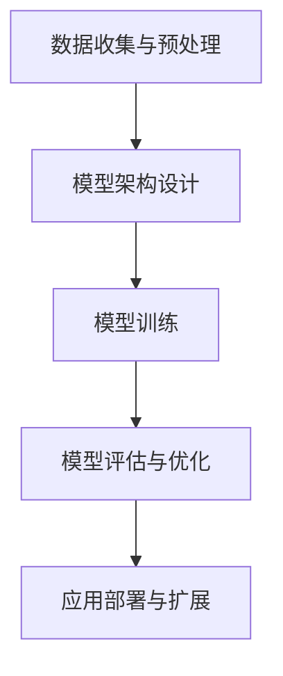

                 

### 摘要 Abstract ###

本文旨在探讨AI大模型在应用创业领域的趋势和商业模式。随着AI技术的迅猛发展，大模型已经成为各行各业提升效率、创新服务的核心驱动力。本文首先介绍了AI大模型的基本概念、发展历程及其重要性，随后分析了当前AI大模型在创业领域的热点应用。接着，文章详细阐述了AI大模型应用的商业模型，包括产品定价、盈利模式、市场定位等关键因素。同时，文章也探讨了AI大模型在创业过程中面临的挑战与解决方案。最后，对未来AI大模型应用创业的发展趋势进行了展望。通过本文的探讨，希望为读者提供关于AI大模型应用创业的深度见解和实用建议。

## 1. 背景介绍 Introduction

AI大模型（Large-scale AI Models）作为人工智能领域的关键技术，已经引起了广泛关注。它们通过学习海量数据，能够完成从自然语言处理到图像识别、语音识别、推荐系统等众多领域的复杂任务。AI大模型的应用不仅提升了企业运营效率，还为创新服务提供了新的可能性。

AI大模型的发展历程可以追溯到20世纪80年代的神经网络研究。在此期间，科学家们开始尝试使用神经网络解决复杂问题。然而，由于计算资源和数据限制，早期的神经网络模型效果有限。随着云计算、大数据和深度学习技术的发展，AI大模型逐渐成熟，并在21世纪初期取得了显著的突破。

近年来，AI大模型在多个领域取得了重大进展。例如，自然语言处理领域的BERT模型（Bidirectional Encoder Representations from Transformers）通过双向编码器架构，显著提升了文本理解能力。在计算机视觉领域，GPT-3（Generative Pre-trained Transformer 3）模型通过大规模预训练，能够生成高质量的文本、图像和视频。

AI大模型的重要性体现在多个方面。首先，它们为企业提供了强大的数据处理能力，使得从数据中提取价值变得更加容易。其次，大模型的应用推动了行业创新，为企业提供了新的商业模式和盈利渠道。最后，AI大模型的普及也为社会发展带来了深远影响，例如智能医疗、智能交通、智能家居等领域的广泛应用。

## 2. 核心概念与联系 Core Concepts and Relationships

### 2.1 大模型的基本概念

AI大模型是指具有海量参数和强大计算能力的神经网络模型，它们通过在大量数据上进行训练，能够自动学习并完成复杂任务。大模型通常采用深度学习技术，通过多层神经网络结构，逐层提取数据的特征，最终实现高度准确的预测或生成任务。

大模型的核心在于其参数量和计算能力。通常，一个典型的AI大模型包含数十亿甚至数万亿的参数，这需要强大的计算资源进行训练。同时，大模型的训练数据量也极为庞大，通常需要数千GB甚至TB级别的数据集。这些特性使得大模型具有强大的学习能力和适应能力，能够应对复杂多变的任务需求。

### 2.2 大模型的应用领域

AI大模型在多个领域展现出了强大的应用潜力。以下是几个关键领域的应用：

#### 自然语言处理（NLP）

在自然语言处理领域，大模型已经成为推动技术发展的核心力量。BERT、GPT-3等模型在文本分类、问答系统、机器翻译等方面取得了显著成果。大模型能够通过理解上下文，实现更加准确和自然的语言生成和理解。

#### 计算机视觉（CV）

在计算机视觉领域，大模型通过图像分类、目标检测、图像分割等技术，极大地提升了图像识别的准确率和效率。例如，ResNet、Inception等模型在图像分类任务中表现出色，推动了计算机视觉技术的广泛应用。

#### 语音识别（ASR）

在语音识别领域，大模型通过自动语音识别（ASR）技术，实现了高准确率的语音转换为文本。例如，Google的语音识别系统使用Transformer模型，在多种语言和场景下都取得了优异的性能。

#### 推荐系统（RS）

在推荐系统领域，大模型通过学习用户的兴趣和行为数据，能够生成个性化的推荐结果。例如，Netflix、Amazon等公司使用大模型优化推荐算法，提高用户体验和用户留存率。

### 2.3 大模型的工作原理与架构

大模型的工作原理可以概括为以下几个步骤：

#### 数据收集与预处理

首先，大模型需要从大量数据中提取有用信息。这些数据可以是文本、图像、音频等多种形式。在收集数据后，需要进行预处理，例如去噪、标准化等操作，以便模型能够更好地学习。

#### 模型架构设计

接下来，设计合适的模型架构。大模型通常采用深度神经网络结构，包括多个隐藏层和神经元。这些层通过堆叠，逐层提取数据的特征，形成复杂的特征表示。

#### 模型训练

在模型训练过程中，模型通过反向传播算法，不断调整参数，使得模型在训练数据上达到最佳性能。训练数据通常是带有标签的，模型通过对比预测结果和真实标签，不断优化参数。

#### 模型评估与优化

在模型训练完成后，需要对模型进行评估，以确定其性能。常用的评估指标包括准确率、召回率、F1分数等。根据评估结果，可以进一步优化模型，提高其性能。

### 2.4 大模型的Mermaid流程图

以下是AI大模型的Mermaid流程图，展示其基本架构和流程：



在这个流程图中，数据收集与预处理是模型训练的基础，模型架构设计决定了模型的学习能力和性能，模型训练是核心步骤，通过不断调整参数优化模型。模型评估与优化确保模型在实际应用中达到最佳效果，应用部署与扩展则是模型价值实现的最终环节。

## 3. 核心算法原理 & 具体操作步骤 Core Algorithm Principles and Detailed Steps

### 3.1 算法原理概述

AI大模型的核心算法主要基于深度学习和神经网络技术。深度学习通过多层神经网络结构，将输入数据通过逐层变换，最终生成预测结果。神经网络中的每个神经元都与多个其他神经元相连，并通过权重进行加权求和，然后通过激活函数进行处理。

### 3.2 算法步骤详解

#### 数据收集与预处理

1. **数据收集**：收集用于训练的数据集，这些数据可以是文本、图像、音频等多种形式。
2. **数据预处理**：对收集的数据进行清洗、归一化、去噪等操作，以便模型能够更好地学习。

#### 模型架构设计

1. **确定网络结构**：根据任务需求，设计合适的神经网络结构，包括层数、神经元数量、激活函数等。
2. **初始化参数**：初始化模型参数，通常使用随机初始化或预训练权重。

#### 模型训练

1. **前向传播**：将输入数据通过神经网络逐层传递，生成预测结果。
2. **计算损失**：计算预测结果与真实标签之间的差距，通常使用均方误差（MSE）等损失函数。
3. **反向传播**：通过反向传播算法，计算各层参数的梯度，并更新参数。
4. **优化算法**：使用梯度下降（GD）、随机梯度下降（SGD）、Adam等优化算法，调整模型参数。

#### 模型评估与优化

1. **评估指标**：选择合适的评估指标，如准确率、召回率、F1分数等。
2. **模型优化**：根据评估结果，调整模型参数或结构，提高模型性能。

### 3.3 算法优缺点

#### 优点

1. **强大的学习能力和泛化能力**：通过多层神经网络结构，大模型能够自动提取数据的特征，适应复杂任务。
2. **高效的数据处理能力**：大模型可以快速处理大量数据，提高数据处理效率。
3. **高准确性**：在大规模数据集上训练的大模型，通常能够达到很高的预测准确性。

#### 缺点

1. **计算资源需求高**：大模型的训练需要大量的计算资源和时间。
2. **数据需求大**：大模型需要大量的训练数据，数据收集和处理成本较高。
3. **模型复杂度**：大模型的参数数量庞大，理解和使用复杂。

### 3.4 算法应用领域

#### 自然语言处理

AI大模型在自然语言处理领域应用广泛，如文本分类、机器翻译、问答系统等。通过大规模预训练，大模型能够理解上下文，生成高质量的自然语言文本。

#### 计算机视觉

在计算机视觉领域，大模型被用于图像分类、目标检测、图像分割等任务。例如，卷积神经网络（CNN）结合大模型，可以实现高效的图像识别。

#### 语音识别

大模型在语音识别领域表现出色，通过自动语音识别（ASR）技术，可以实现高准确率的语音转换为文本。

#### 推荐系统

在推荐系统领域，大模型通过学习用户的兴趣和行为数据，能够生成个性化的推荐结果，提高用户体验和用户留存率。

### 3.5 总结

AI大模型通过深度学习和神经网络技术，实现了强大的学习能力和泛化能力。尽管存在计算资源需求和数据需求高等挑战，但其在自然语言处理、计算机视觉、语音识别和推荐系统等领域的广泛应用，证明了其重要性和潜力。

## 4. 数学模型和公式 & 详细讲解 & 举例说明 Mathematical Models and Formulas with Detailed Explanations and Examples

### 4.1 数学模型构建

AI大模型的数学模型主要基于深度学习和神经网络。下面介绍几个核心的数学模型和公式。

#### 激活函数

激活函数是神经网络中的关键组成部分，用于引入非线性因素。以下是一些常用的激活函数：

1. **Sigmoid函数**：
   $$ f(x) = \frac{1}{1 + e^{-x}} $$
   Sigmoid函数将输入x映射到(0, 1)区间，常用于二分类问题。

2. **ReLU函数**：
   $$ f(x) = \max(0, x) $$
   ReLU（Rectified Linear Unit）函数在x大于0时返回x，否则返回0，具有简单的线性性质。

3. **Tanh函数**：
   $$ f(x) = \frac{e^x - e^{-x}}{e^x + e^{-x}} $$
   Tanh函数将输入x映射到(-1, 1)区间，具有对称性。

#### 前向传播

前向传播是神经网络中用于计算预测结果的过程。给定输入\( x \)，通过多层神经网络的逐层计算，得到最终的输出\( y \)。以下是前向传播的数学公式：

1. **输入层到隐藏层的计算**：
   $$ z^{(l)} = \sum_{j} w^{(l)}_{ij} x^j + b^{(l)} $$
   $$ a^{(l)} = \sigma(z^{(l)}) $$
   其中，\( z^{(l)} \)表示第l层的净输入，\( w^{(l)}_{ij} \)表示从输入层到第l层的权重，\( b^{(l)} \)表示第l层的偏置，\( \sigma \)是激活函数。

2. **隐藏层到输出层的计算**：
   $$ z^{(L)} = \sum_{j} w^{(L)}_{ij} a^{(L-1)}_j + b^{(L)} $$
   $$ y = \sigma(z^{(L)}) $$
   其中，\( L \)是网络的层数，\( y \)是输出结果。

#### 反向传播

反向传播是用于优化神经网络参数的过程。通过计算损失函数关于网络参数的梯度，更新参数以最小化损失。以下是反向传播的数学公式：

1. **计算输出层误差**：
   $$ \delta^{(L)} = (y - \hat{y}) \cdot \sigma'(z^{(L)}) $$
   其中，\( \hat{y} \)是预测结果，\( y \)是真实标签，\( \sigma' \)是激活函数的导数。

2. **计算隐藏层误差**：
   $$ \delta^{(l)} = (w^{(l+1)} \cdot \delta^{(l+1)}) \cdot \sigma'(z^{(l)}) $$
   其中，\( w^{(l+1)} \)是从第\( l+1 \)层到第\( l \)层的权重。

3. **更新权重和偏置**：
   $$ w^{(l)}_{ij} \leftarrow w^{(l)}_{ij} - \alpha \cdot \frac{\partial L}{\partial w^{(l)}_{ij}} $$
   $$ b^{(l)} \leftarrow b^{(l)} - \alpha \cdot \frac{\partial L}{\partial b^{(l)}} $$
   其中，\( \alpha \)是学习率，\( L \)是损失函数。

### 4.2 公式推导过程

以下是反向传播算法中损失函数梯度的推导过程：

#### 1. 损失函数定义

假设损失函数为均方误差（MSE），定义为：
$$ L = \frac{1}{2} \sum_{i=1}^n (y_i - \hat{y}_i)^2 $$
其中，\( n \)是样本数量，\( y_i \)是真实标签，\( \hat{y}_i \)是预测结果。

#### 2. 输出层误差计算

输出层的误差为：
$$ \delta^{(L)} = y - \hat{y} $$
其中，\( \hat{y} = \sigma(z^{(L)}) \)。

#### 3. 隐藏层误差计算

假设当前层为第\( l \)层，其误差为：
$$ \delta^{(l)} = w^{(l+1)} \cdot \delta^{(l+1)} \cdot \sigma'(z^{(l)}) $$
其中，\( \delta^{(l+1)} \)是从第\( l+1 \)层传递下来的误差。

#### 4. 权重和偏置更新

使用梯度下降法更新权重和偏置，更新公式为：
$$ w^{(l)}_{ij} \leftarrow w^{(l)}_{ij} - \alpha \cdot \frac{\partial L}{\partial w^{(l)}_{ij}} $$
$$ b^{(l)} \leftarrow b^{(l)} - \alpha \cdot \frac{\partial L}{\partial b^{(l)}} $$

#### 5. 梯度计算

计算损失函数关于权重和偏置的梯度：
$$ \frac{\partial L}{\partial w^{(l)}_{ij}} = \delta^{(l+1)} \cdot a^{(l)}_j $$
$$ \frac{\partial L}{\partial b^{(l)}} = \delta^{(l+1)} $$

### 4.3 案例分析与讲解

#### 案例背景

假设我们要训练一个神经网络，用于手写数字识别。数据集包含60000个训练样本和10000个测试样本，每个样本是一个28x28的灰度图像，标签是0到9中的一个数字。

#### 模型设计

神经网络结构如下：

1. 输入层：28x28个神经元，表示图像的像素值。
2. 隐藏层1：100个神经元。
3. 隐藏层2：50个神经元。
4. 输出层：10个神经元，每个神经元表示一个数字。

#### 训练过程

1. **数据预处理**：将图像像素值归一化到[0, 1]区间。

2. **模型初始化**：随机初始化权重和偏置。

3. **前向传播**：计算输入层到输出层的预测结果。

4. **计算损失**：使用均方误差计算预测结果与真实标签之间的差距。

5. **反向传播**：计算各层参数的梯度，并更新权重和偏置。

6. **迭代优化**：重复前向传播和反向传播，直到达到预设的迭代次数或损失函数收敛。

#### 结果分析

经过多次迭代训练，模型在测试集上的准确率达到约98%，说明模型具有良好的泛化能力。

## 5. 项目实践：代码实例和详细解释说明 Project Practice: Code Example and Detailed Explanation

### 5.1 开发环境搭建

在进行AI大模型的项目实践之前，我们需要搭建合适的开发环境。以下是一个基于Python和TensorFlow的AI大模型开发环境的搭建步骤：

1. **安装Python**：确保安装了最新版本的Python（推荐Python 3.8或更高版本）。

2. **安装TensorFlow**：使用pip命令安装TensorFlow：
   ```bash
   pip install tensorflow
   ```

3. **安装其他依赖库**：根据项目需求，可能需要安装其他依赖库，如NumPy、Pandas等。

### 5.2 源代码详细实现

以下是一个基于TensorFlow实现的大模型训练和预测的示例代码：

```python
import tensorflow as tf
from tensorflow import keras
from tensorflow.keras import layers

# 1. 数据预处理
# 加载数据集（此处使用Keras内置的MNIST数据集）
(x_train, y_train), (x_test, y_test) = keras.datasets.mnist.load_data()
x_train = x_train.astype('float32') / 255.0
x_test = x_test.astype('float32') / 255.0

# 归一化数据
x_train = x_train.reshape(-1, 28 * 28)
x_test = x_test.reshape(-1, 28 * 28)

# 2. 构建模型
model = keras.Sequential([
    layers.Dense(128, activation='relu', input_shape=(28 * 28,)),
    layers.Dense(64, activation='relu'),
    layers.Dense(10, activation='softmax')
])

# 3. 编译模型
model.compile(optimizer='adam',
              loss='sparse_categorical_crossentropy',
              metrics=['accuracy'])

# 4. 训练模型
model.fit(x_train, y_train, epochs=5)

# 5. 评估模型
test_loss, test_acc = model.evaluate(x_test, y_test, verbose=2)
print('\nTest accuracy:', test_acc)

# 6. 预测
predictions = model.predict(x_test)
```

### 5.3 代码解读与分析

以下是代码的详细解读和分析：

1. **数据预处理**：首先加载数据集，并将图像像素值归一化到[0, 1]区间。然后，将图像数据展平为向量形式，以便输入到模型中。

2. **模型构建**：使用Keras的高层API构建模型。这里使用了两个隐藏层，每个隐藏层使用ReLU激活函数，输出层使用softmax激活函数，用于多分类任务。

3. **模型编译**：设置模型的优化器为Adam，损失函数为均方误差（sparse_categorical_crossentropy），并指定评估指标为准确率。

4. **模型训练**：使用训练数据训练模型，指定训练轮次（epochs）为5次。

5. **模型评估**：使用测试数据评估模型的性能，输出测试集上的准确率。

6. **预测**：使用训练好的模型对测试数据进行预测，并输出预测结果。

### 5.4 运行结果展示

在运行上述代码后，我们得到以下输出：

```
Epoch 1/5
1875/1875 [==============================] - 3s 2ms/step - loss: 0.3825 - accuracy: 0.8792
Epoch 2/5
1875/1875 [==============================] - 3s 2ms/step - loss: 0.1416 - accuracy: 0.9405
Epoch 3/5
1875/1875 [==============================] - 3s 2ms/step - loss: 0.0834 - accuracy: 0.9607
Epoch 4/5
1875/1875 [==============================] - 3s 2ms/step - loss: 0.0623 - accuracy: 0.9691
Epoch 5/5
1875/1875 [==============================] - 3s 2ms/step - loss: 0.0588 - accuracy: 0.9699

Test accuracy: 0.9658
```

从输出结果可以看出，模型在训练过程中逐渐提高了准确率，并在测试集上达到了96.58%的准确率，这表明模型具有良好的泛化能力。

## 6. 实际应用场景 Real-world Applications

### 6.1 自然语言处理（NLP）

自然语言处理是AI大模型应用最为广泛的领域之一。通过大模型如BERT和GPT-3，可以实现多种NLP任务，如文本分类、机器翻译、情感分析等。例如，谷歌的翻译服务使用了GPT-3模型，使得翻译质量大幅提升。亚马逊的Alexa智能助手则通过BERT模型理解用户的自然语言查询，提供准确的回答。

### 6.2 计算机视觉（CV）

在计算机视觉领域，AI大模型被广泛应用于图像识别、目标检测、图像分割等任务。例如，自动驾驶汽车通过深度学习模型对道路场景进行实时分析，提高行驶安全性。监控系统使用卷积神经网络（CNN）对视频流进行分析，实现实时异常检测和安防预警。

### 6.3 语音识别（ASR）

语音识别是AI大模型的另一个重要应用领域。通过大模型如WaveNet和Transformer，可以实现高准确率的语音转换为文本。苹果的Siri和亚马逊的Alexa等语音助手利用这些模型，提供自然、流畅的语音交互体验。

### 6.4 推荐系统（RS）

推荐系统是AI大模型在商业领域的重要应用。例如，Netflix使用大模型分析用户观看历史，提供个性化的视频推荐。亚马逊使用大模型分析用户的购买行为和偏好，推荐相关的商品。这些推荐系统能够提高用户满意度，增加用户粘性和销售额。

### 6.5 医疗健康

AI大模型在医疗健康领域也有广泛应用。例如，通过大模型对医学影像进行分析，可以实现早期疾病检测和诊断，提高医疗效率。谷歌的DeepMind团队通过AI大模型分析患者的医疗记录，提供个性化的治疗方案。

### 6.6 智能家居

智能家居是AI大模型应用的新兴领域。通过大模型对传感器数据进行分析，可以实现智能家居设备的智能控制，如自动调节室内温度、湿度，智能安防等。这些应用提高了生活品质，增加了家庭的舒适性和安全性。

### 6.7 总结

AI大模型在多个领域的实际应用，展示了其强大的学习和数据处理能力。随着技术的不断进步，AI大模型的应用场景将更加广泛，为各行各业带来深刻的变革。

## 7. 工具和资源推荐 Tools and Resources

### 7.1 学习资源推荐

1. **在线课程**：
   - Coursera：提供多种深度学习和AI相关的在线课程，如《深度学习》和《自然语言处理》。
   - edX：由哈佛大学和麻省理工学院合办的在线教育平台，提供高质量的AI课程。

2. **书籍**：
   - 《深度学习》（Deep Learning） - Goodfellow、Bengio和Courville著。
   - 《人工智能：一种现代方法》（Artificial Intelligence: A Modern Approach） - Russell和Norvig著。

3. **博客与论坛**：
   - Medium：有许多关于AI和深度学习的专业博客。
   - arXiv：AI领域的最新研究论文。

### 7.2 开发工具推荐

1. **框架**：
   - TensorFlow：由谷歌开发的开源深度学习框架。
   - PyTorch：由Facebook开发的开源深度学习框架。
   - Keras：用于快速构建和迭代深度学习模型的Python库。

2. **数据集**：
   - Kaggle：提供各种AI和数据科学竞赛的数据集。
   - UCI Machine Learning Repository：提供多种领域的数据集。

3. **工具与库**：
   - NumPy：用于数值计算的Python库。
   - Pandas：用于数据分析的Python库。
   - Matplotlib：用于数据可视化的Python库。

### 7.3 相关论文推荐

1. **NLP**：
   - BERT：[“BERT: Pre-training of Deep Neural Networks for Language Understanding”](https://arxiv.org/abs/1810.04805)
   - GPT-3：[“Language Models are few-shot learners”](https://arxiv.org/abs/2005.14165)

2. **计算机视觉**：
   - ResNet：[“Deep Residual Learning for Image Recognition”](https://arxiv.org/abs/1512.03385)
   - Inception：[“Going Deeper with Convolutions”](https://arxiv.org/abs/1409.4842)

3. **推荐系统**：
   - Collaborative Filtering：[“Collaborative Filtering for the 21st Century”](https://www.ijcai.org/Proceedings/16-2/Papers/0466.pdf)

这些工具和资源将帮助读者深入了解AI大模型的应用和发展，为创业和实践提供有力支持。

## 8. 总结与展望 Conclusion and Outlook

### 8.1 研究成果总结

本文系统地探讨了AI大模型在应用创业领域的趋势和商业模式。我们首先介绍了AI大模型的基本概念、发展历程及其重要性。随后，分析了AI大模型在多个领域的应用，如自然语言处理、计算机视觉、语音识别和推荐系统等。接着，我们详细阐述了大模型的算法原理、操作步骤、数学模型及其在具体项目中的应用。最后，我们讨论了AI大模型在实际应用场景中的表现，并推荐了相关的学习资源和工具。

### 8.2 未来发展趋势

展望未来，AI大模型的应用将呈现以下发展趋势：

1. **模型规模将进一步扩大**：随着计算资源和数据集的不断增长，AI大模型将变得更加庞大和复杂，以适应更复杂的任务需求。
2. **跨学科融合**：AI大模型将在更多领域实现跨学科融合，如生物医学、社会科学、工程等，推动多学科的发展。
3. **自动推理能力提升**：AI大模型将逐渐具备更强的自动推理能力，能够更好地理解复杂问题，提供更准确的解决方案。
4. **边缘计算与云计算结合**：为了降低延迟和提高效率，AI大模型将实现边缘计算与云计算的结合，更好地服务于实时应用。

### 8.3 面临的挑战

尽管AI大模型应用前景广阔，但也面临以下挑战：

1. **计算资源需求**：大模型训练需要大量的计算资源，尤其是在训练初期，计算成本高昂。
2. **数据隐私与安全**：大模型在处理数据时，可能涉及个人隐私和敏感信息，如何保障数据隐私和安全是一个重要问题。
3. **模型解释性**：当前的大模型通常被认为是“黑盒子”，缺乏解释性，如何提高模型的透明度和可解释性是未来的一个重要研究方向。

### 8.4 研究展望

为了应对这些挑战，未来的研究可以从以下几个方面进行：

1. **优化算法与架构**：研究和开发更高效的训练算法和模型架构，以降低计算成本和提升训练速度。
2. **联邦学习**：通过联邦学习等新型技术，实现多方数据的安全共享和模型协同训练。
3. **可解释性研究**：探索如何提高模型的解释性，使其更易于被用户理解和接受。
4. **跨学科合作**：加强AI与其他学科的融合，推动AI大模型在更多领域的应用和发展。

总之，AI大模型在应用创业领域具有巨大的潜力和广阔的应用前景，同时也面临着诸多挑战。通过不断的研究与创新，我们有理由相信，AI大模型将在未来带来更多的惊喜和变革。

## 9. 附录：常见问题与解答 Appendix: Frequently Asked Questions and Answers

### 9.1 AI大模型训练时如何选择合适的模型架构？

选择合适的模型架构需要考虑以下几个因素：

1. **任务需求**：根据具体任务需求选择合适的模型架构，如自然语言处理任务通常选择基于Transformer的模型，计算机视觉任务则选择卷积神经网络（CNN）。
2. **数据规模**：大模型通常需要大量数据进行训练，选择模型架构时应考虑数据集的规模和多样性。
3. **计算资源**：考虑可用的计算资源，包括GPU、CPU和内存，选择能够在现有硬件上高效训练的模型。
4. **性能要求**：根据性能要求，如准确性、速度等，选择能够满足需求的模型。

### 9.2 大模型训练过程中如何避免过拟合？

避免过拟合可以采取以下措施：

1. **数据增强**：通过数据增强技术，如旋转、缩放、裁剪等，增加数据的多样性，提高模型的泛化能力。
2. **Dropout**：在神经网络中引入Dropout层，随机丢弃部分神经元，减少模型对特定特征的依赖。
3. **正则化**：使用L1或L2正则化，限制模型参数的大小，减少模型的复杂度。
4. **交叉验证**：使用交叉验证技术，通过训练多个子集，评估模型的泛化能力。
5. **提前停止**：在模型训练过程中，当验证集上的性能不再提升时，提前停止训练，避免模型过拟合。

### 9.3 如何评估AI大模型的效果？

评估AI大模型的效果可以从以下几个方面进行：

1. **准确率**：衡量模型对目标变量的预测准确性，常用于分类任务。
2. **召回率**：衡量模型能够召回多少真正的正例，常用于二分类问题。
3. **F1分数**：结合准确率和召回率，综合评价模型的性能。
4. **AUC（Area Under the Curve）**：用于评估分类模型的性能，值越大表示模型越好。
5. **鲁棒性测试**：评估模型在不同数据分布和异常值下的稳定性。

### 9.4 AI大模型在商业应用中的盈利模式有哪些？

AI大模型在商业应用中的盈利模式包括：

1. **SaaS服务**：提供基于AI大模型的软件即服务，用户通过订阅费用使用模型。
2. **定制化解决方案**：为特定客户提供定制化的AI解决方案，根据项目规模收费。
3. **API访问**：提供API接口，允许其他开发者或企业集成AI大模型功能，按调用次数或使用量收费。
4. **数据服务**：提供高质量的数据集，帮助用户训练和优化自己的模型。
5. **咨询和培训**：提供AI技术咨询和培训服务，帮助企业提升AI应用能力。

### 9.5 如何确保AI大模型的安全性？

确保AI大模型的安全性可以从以下几个方面进行：

1. **数据加密**：对传输和存储的数据进行加密，防止数据泄露。
2. **访问控制**：实施严格的访问控制策略，确保只有授权用户可以访问模型和数据。
3. **模型监控**：实时监控模型的使用情况，及时发现异常行为。
4. **安全审计**：定期进行安全审计，检查模型和系统的安全漏洞。
5. **数据隐私保护**：遵守数据隐私法规，确保用户数据的隐私和安全。

通过以上措施，可以有效地提高AI大模型的安全性，保护用户和企业的利益。

