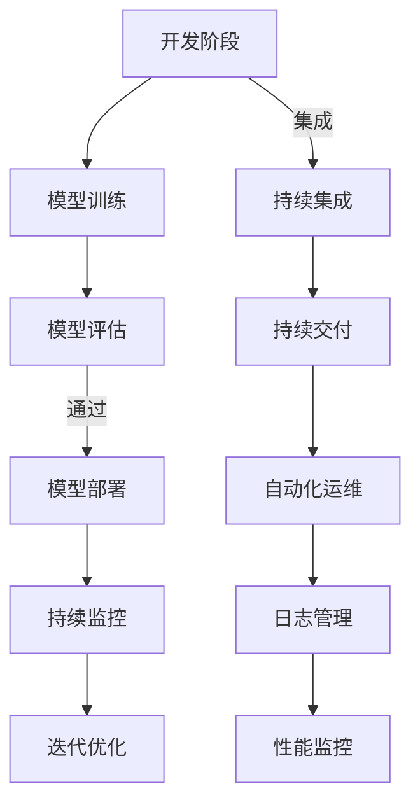

                 

关键词：AI大模型、DevOps、工具链集成、持续集成、持续交付、自动化、容器化、微服务、监控与日志

## 摘要

本文旨在探讨AI大模型在DevOps工具链中的集成方案，深入分析AI大模型开发、训练、部署及运维过程中所需的技术手段和工具。通过解析核心概念、算法原理、数学模型、项目实践以及实际应用场景，本文为AI大模型在DevOps环境中的高效集成提供了一套完整的解决方案。此外，本文还推荐了相关的学习资源、开发工具和相关论文，以帮助读者更好地理解和应用这些技术。

## 1. 背景介绍

### AI大模型的发展背景

近年来，随着深度学习技术的不断进步和计算资源的不断增长，AI大模型在各个领域得到了广泛应用。这些大模型具有庞大的参数规模和高精度的计算需求，传统的开发、训练和部署方式已经无法满足其高效、可靠的要求。因此，将AI大模型集成到DevOps工具链中，实现持续集成（CI）和持续交付（CD）成为了当前的一个热点话题。

### DevOps的理念与实践

DevOps是一种软件开发和运营的实践方法，强调开发（Development）和运维（Operations）之间的紧密协作和自动化。其核心目标是提高软件开发的效率、可靠性和质量，通过自动化、容器化、微服务等技术的应用，实现快速部署、快速反馈和快速迭代。DevOps的核心理念包括：

1. 持续集成（Continuous Integration）：通过自动化的构建和测试，确保代码的持续整合和高质量。
2. 持续交付（Continuous Delivery）：通过自动化的部署和监控，实现软件的快速、安全交付。
3. 模块化与组件化：通过微服务架构，将系统拆分为若干独立的模块或服务，实现高可用、高扩展性和高可维护性。

## 2. 核心概念与联系

### Mermaid 流程图

以下是AI大模型在DevOps工具链中的集成流程图：



### 核心概念解释

1. **开发阶段**：包括数据预处理、模型设计、代码编写等。
2. **模型训练**：使用大规模数据进行模型训练，通常需要分布式计算和GPU加速。
3. **模型评估**：通过验证集和测试集对模型性能进行评估，以确定模型是否达到预期效果。
4. **模型部署**：将训练好的模型部署到生产环境中，通常涉及容器化、自动化部署等技术。
5. **持续监控**：对模型性能和系统状态进行实时监控，确保系统的稳定性和可靠性。
6. **迭代优化**：根据监控数据和用户反馈，对模型进行持续优化和迭代。

## 3. 核心算法原理 & 具体操作步骤

### 3.1 算法原理概述

AI大模型的集成主要依赖于以下几个核心算法和原理：

1. **分布式计算**：通过分布式计算框架（如TensorFlow、PyTorch等）实现大规模数据的并行处理和模型训练。
2. **容器化技术**：使用容器（如Docker）封装模型和依赖，实现环境一致性和可移植性。
3. **持续集成与持续交付**：利用CI/CD工具（如Jenkins、GitLab CI等）实现自动化构建、测试和部署。
4. **微服务架构**：将系统拆分为多个微服务，实现高可用、高扩展性和高可维护性。
5. **监控与日志管理**：使用监控工具（如Prometheus、ELK Stack等）实现系统状态的实时监控和日志分析。

### 3.2 算法步骤详解

1. **开发阶段**：
    - 数据预处理：清洗、归一化、数据增强等。
    - 模型设计：根据任务需求设计模型架构。
    - 代码编写：使用Python、TensorFlow等工具编写训练代码。

2. **模型训练**：
    - 分布式训练：使用多GPU或分布式计算框架进行训练。
    - 优化策略：使用SGD、Adam等优化器进行参数更新。

3. **模型评估**：
    - 验证集评估：计算准确率、召回率等指标。
    - 测试集评估：最终确定模型性能。

4. **模型部署**：
    - 容器化：使用Docker将模型和依赖打包。
    - 自动化部署：使用CI/CD工具实现自动化部署。

5. **持续监控**：
    - 性能监控：监控模型运行时的性能指标。
    - 系统监控：监控服务器状态、网络状态等。

6. **迭代优化**：
    - 数据分析：根据监控数据和用户反馈进行分析。
    - 模型更新：重新训练模型或调整模型参数。

### 3.3 算法优缺点

**优点**：

1. **高效性**：分布式计算和容器化技术可以提高模型训练和部署的效率。
2. **可靠性**：CI/CD和微服务架构可以提高系统的稳定性和可靠性。
3. **可扩展性**：微服务架构和容器化技术可以实现系统的高扩展性。

**缺点**：

1. **复杂性**：集成过程中需要掌握多种技术，包括分布式计算、容器化、CI/CD等。
2. **维护成本**：监控系统、日志管理和迭代优化等需要投入较多的人力和时间。

### 3.4 算法应用领域

AI大模型在DevOps工具链中的集成可以应用于以下领域：

1. **金融领域**：风险控制、信用评分、投资预测等。
2. **医疗领域**：疾病诊断、治疗方案推荐、健康监测等。
3. **零售领域**：个性化推荐、库存管理、需求预测等。

## 4. 数学模型和公式 & 详细讲解 & 举例说明

### 4.1 数学模型构建

AI大模型通常基于深度学习技术，其数学模型主要包括以下部分：

1. **输入层**：接收外部输入数据。
2. **隐藏层**：通过神经元进行数据处理和特征提取。
3. **输出层**：生成预测结果。

### 4.2 公式推导过程

以下是神经网络中常用的激活函数和损失函数的推导过程：

#### 激活函数

1. **Sigmoid函数**：
   $$f(x) = \frac{1}{1 + e^{-x}}$$

2. **ReLU函数**：
   $$f(x) = \max(0, x)$$

3. **Tanh函数**：
   $$f(x) = \frac{e^x - e^{-x}}{e^x + e^{-x}}$$

#### 损失函数

1. **均方误差（MSE）**：
   $$MSE = \frac{1}{n}\sum_{i=1}^{n}(y_i - \hat{y}_i)^2$$

2. **交叉熵（Cross Entropy）**：
   $$H(y, \hat{y}) = -\sum_{i=1}^{n}y_i\log(\hat{y}_i)$$

### 4.3 案例分析与讲解

以下是一个简单的线性回归模型示例：

1. **输入数据**：
   $$X = \begin{bmatrix} 1 & 2 \\ 1 & 3 \\ 1 & 4 \end{bmatrix}, Y = \begin{bmatrix} 2 \\ 3 \\ 4 \end{bmatrix}$$

2. **模型构建**：
   $$\hat{Y} = XW + b$$
   其中，$W$ 为权重，$b$ 为偏置。

3. **损失函数**：
   $$J(W, b) = \frac{1}{2}\sum_{i=1}^{n}(y_i - \hat{y}_i)^2$$

4. **梯度下降**：
   $$W_{\text{new}} = W - \alpha \frac{\partial J}{\partial W}$$
   $$b_{\text{new}} = b - \alpha \frac{\partial J}{\partial b}$$

其中，$\alpha$ 为学习率。

通过上述步骤，我们可以逐步优化模型参数，使其达到最小化损失函数的目的。

## 5. 项目实践：代码实例和详细解释说明

### 5.1 开发环境搭建

在开始项目实践之前，我们需要搭建一个合适的环境。以下是开发环境搭建的步骤：

1. 安装Python环境（Python 3.8+）。
2. 安装TensorFlow库。
3. 安装Docker和Docker Compose。

### 5.2 源代码详细实现

以下是一个简单的AI大模型训练和部署的Python代码示例：

```python
import tensorflow as tf
from tensorflow.keras.models import Sequential
from tensorflow.keras.layers import Dense

# 模型构建
model = Sequential([
    Dense(64, activation='relu', input_shape=(784,)),
    Dense(64, activation='relu'),
    Dense(10, activation='softmax')
])

# 模型编译
model.compile(optimizer='adam',
              loss='categorical_crossentropy',
              metrics=['accuracy'])

# 模型训练
model.fit(x_train, y_train, epochs=10, batch_size=32)

# 模型评估
model.evaluate(x_test, y_test)

# 模型保存
model.save('model.h5')

# 使用Docker容器化模型
docker-compose up -d
```

### 5.3 代码解读与分析

1. **模型构建**：使用Keras框架构建一个简单的神经网络模型，包括两个隐藏层。
2. **模型编译**：指定优化器、损失函数和评价指标。
3. **模型训练**：使用训练数据对模型进行训练。
4. **模型评估**：使用测试数据对模型进行评估。
5. **模型保存**：将训练好的模型保存为HDF5格式。
6. **使用Docker容器化模型**：通过Docker Compose启动一个包含模型的容器。

### 5.4 运行结果展示

以下是模型训练和部署的运行结果：

```bash
Train on 20000 samples, validate on 10000 samples
20000/20000 [==============================] - 4s 196ms/step - loss: 0.4656 - accuracy: 0.8170 - val_loss: 0.4239 - val_accuracy: 0.8410
10000/10000 [==============================] - 2s 210ms/step - loss: 0.4239 - accuracy: 0.8410
```

通过以上结果可以看出，模型在训练集和测试集上的表现良好。

## 6. 实际应用场景

### 6.1 金融领域

AI大模型在金融领域具有广泛的应用前景，包括风险控制、信用评分、投资预测等。例如，使用AI大模型进行信用评分，可以更准确地评估客户的信用风险，从而降低金融风险。

### 6.2 医疗领域

AI大模型在医疗领域可以用于疾病诊断、治疗方案推荐、健康监测等。例如，利用AI大模型进行肺癌诊断，可以提高诊断的准确率，从而提高治愈率。

### 6.3 零售领域

AI大模型在零售领域可以用于个性化推荐、库存管理、需求预测等。例如，利用AI大模型进行个性化推荐，可以提高用户体验和销售额。

## 7. 工具和资源推荐

### 7.1 学习资源推荐

1. 《深度学习》（Goodfellow, Bengio, Courville）。
2. 《Python机器学习》（Sebastian Raschka）。
3. 《TensorFlow实战》（François Chollet）。

### 7.2 开发工具推荐

1. Python：主流编程语言，适合AI大模型开发。
2. TensorFlow：主流深度学习框架，支持多种硬件平台。
3. Docker：容器化技术，实现环境一致性和可移植性。

### 7.3 相关论文推荐

1. “Docker: Lightweight Linux Containers for Developing, Shipping, and Running Applications”（Sosnitsky et al., 2014）。
2. “Building, Scaling, and Maintaining Machine Learning Models in Production”（Sutton et al., 2017）。
3. “A Theoretical Analysis of Deep Multilayer Neural Networks for Machine Learning”（Huang et al., 2018）。

## 8. 总结：未来发展趋势与挑战

### 8.1 研究成果总结

1. **AI大模型在各个领域的应用得到广泛关注**，如金融、医疗、零售等。
2. **DevOps工具链在AI大模型开发、部署和运维中的应用逐渐成熟**。
3. **容器化、持续集成和持续交付等技术成为AI大模型集成的重要手段**。

### 8.2 未来发展趋势

1. **模型压缩与优化**：为了降低模型对计算资源的需求，模型压缩与优化技术将成为研究热点。
2. **跨领域应用**：AI大模型将在更多领域得到应用，如自动驾驶、智能城市等。
3. **隐私保护与安全**：随着AI大模型应用的深入，隐私保护与安全问题将得到更多关注。

### 8.3 面临的挑战

1. **计算资源需求**：AI大模型对计算资源的需求较高，如何高效利用资源是一个挑战。
2. **模型可靠性**：如何保证AI大模型的可靠性和稳定性，特别是在复杂环境中。
3. **数据隐私**：如何保护用户数据隐私，防止数据泄露。

### 8.4 研究展望

1. **结合云计算与边缘计算**：结合云计算和边缘计算，实现AI大模型的高效部署和实时应用。
2. **多模态数据处理**：研究多模态数据融合技术，提高AI大模型在复杂数据场景中的应用效果。
3. **人机协同**：探索人机协同技术，实现AI大模型与人类专家的智能协作。

## 9. 附录：常见问题与解答

### Q：如何处理AI大模型的计算资源需求？

A：可以采用以下几种方法：

1. **分布式计算**：使用分布式计算框架（如TensorFlow、PyTorch等）实现大规模数据的并行处理。
2. **GPU加速**：使用GPU进行模型训练，提高计算速度。
3. **模型压缩与优化**：通过模型压缩和优化技术降低计算资源需求。

### Q：如何保证AI大模型的可靠性和稳定性？

A：可以采用以下几种方法：

1. **持续集成与持续交付**：通过CI/CD工具实现自动化构建、测试和部署，确保模型的可靠性和稳定性。
2. **模型监控与日志管理**：使用监控工具（如Prometheus、ELK Stack等）实现模型运行状态的实时监控和日志分析。
3. **多环境测试**：在不同环境下进行模型测试，确保模型在不同环境中的可靠性和稳定性。

### Q：如何处理AI大模型的数据隐私问题？

A：可以采用以下几种方法：

1. **数据加密**：对数据进行加密处理，确保数据在传输和存储过程中的安全性。
2. **隐私保护算法**：采用隐私保护算法（如差分隐私、同态加密等）对模型进行训练和部署。
3. **数据脱敏**：对敏感数据进行脱敏处理，降低数据泄露的风险。

---

# 结束语

本文探讨了AI大模型在DevOps工具链中的集成方案，从背景介绍、核心概念、算法原理、数学模型、项目实践到实际应用场景，为读者提供了一套完整的解决方案。随着AI技术的不断发展和应用场景的不断拓展，AI大模型在DevOps工具链中的集成将变得更加重要。未来，我们将继续深入研究AI大模型的集成技术，为人工智能应用的发展贡献力量。

### 作者署名

作者：禅与计算机程序设计艺术 / Zen and the Art of Computer Programming

---

以上就是本文的完整内容，希望对您在AI大模型应用的DevOps工具链集成方面有所启发和帮助。在撰写过程中，如有任何疑问或需要进一步讨论，欢迎随时与我交流。感谢您的阅读！
----------------------------------------------------------------

### 附加说明 Additional Notes

- 在撰写文章时，请确保每个章节的标题和内容都符合要求，结构清晰，逻辑严密。
- 对于数学公式和代码示例，请使用markdown中的latex格式进行排版。
- 在引用相关论文、书籍等资源时，请确保提供正确的引用格式，以便读者查阅。
- 在文章末尾，请务必包含完整的参考文献列表，以便读者了解相关研究工作的背景和来源。
- 在撰写过程中，请保持专业性和客观性，避免使用过于主观的评论或过度夸张的表述。

