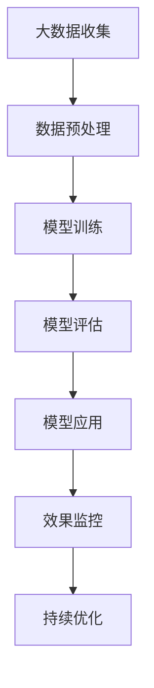

                 

关键词：AI大模型，品牌营销，创新策略，用户体验，商业模式，数据分析，个性化推荐，内容营销。

## 摘要

随着人工智能技术的迅猛发展，大模型已经成为赋能品牌营销的重要工具。本文将探讨AI大模型在品牌营销中的应用，从核心概念、算法原理、数学模型、实践案例等多个角度，系统性地介绍如何利用AI大模型进行品牌营销的创新策略。通过分析其优势与挑战，文章旨在为品牌营销从业者提供有价值的参考和实用建议，以推动品牌在竞争激烈的市场中脱颖而出。

## 1. 背景介绍

### AI大模型的发展历程

AI大模型，即人工智能大型预训练模型，是近年来人工智能领域的一大突破。它们通过在海量数据上进行深度学习，能够模拟人类的认知过程，完成从语言处理到图像识别、自然语言生成等复杂任务。AI大模型的发展可以追溯到2018年谷歌提出的BERT（Bidirectional Encoder Representations from Transformers）模型，这一模型在自然语言处理（NLP）领域取得了显著成果。随后，GPT-3、Transformers等更先进的大模型相继问世，进一步推动了AI技术的发展。

### 品牌营销的现状与挑战

品牌营销作为企业竞争的核心手段，其重要性不言而喻。然而，在信息爆炸的时代，消费者注意力分散，品牌营销面临着诸多挑战。传统的品牌营销手段，如广告、公关活动等，虽然仍在使用，但效果逐渐减弱。消费者更愿意接受个性化、互动性强的内容，这要求品牌必须不断进行创新。与此同时，数据隐私和安全问题也成为了品牌营销面临的重大挑战。

### AI大模型在品牌营销中的应用

AI大模型的出现，为品牌营销带来了新的机遇。它们能够通过对用户数据的深度挖掘，实现精准营销；通过生成式AI，创造出个性化的内容；通过自动化流程，提高营销效率。AI大模型在品牌营销中的应用，不仅能够提升用户体验，还能够为企业创造更多价值。

## 2. 核心概念与联系

为了更好地理解AI大模型在品牌营销中的应用，我们需要先了解一些核心概念。

### 2.1. 大模型

大模型是指具有数十亿、甚至千亿参数的深度学习模型。这些模型通常通过大规模数据集进行预训练，然后再通过微调来适应特定的任务。

### 2.2. 预训练

预训练是指在大规模数据集上对模型进行训练，使其具备一定的通用知识和能力。预训练后的模型可以在多个任务上表现出色。

### 2.3. 微调

微调是指将预训练好的模型应用于特定任务，通过在小规模数据集上进行训练，调整模型的参数，使其更好地适应特定任务。

### 2.4. 自然语言生成

自然语言生成（NLG）是指利用人工智能技术生成自然语言文本。NLG可以应用于内容创作、对话系统、个性化推荐等多个场景。

### 2.5. 自动化营销

自动化营销是指利用人工智能技术，自动执行营销活动。自动化营销可以大大提高营销效率，降低人力成本。

### 2.6. 数据分析

数据分析是指利用统计学、机器学习等技术，从大量数据中提取有价值的信息。数据分析在品牌营销中具有重要作用，可以帮助企业了解用户需求、优化营销策略。

### 2.7. 个性化推荐

个性化推荐是指根据用户的历史行为、兴趣偏好等，为其推荐符合其需求的内容或商品。个性化推荐可以提高用户满意度，增加销售额。

### 2.8. 内容营销

内容营销是指通过创造和分发有价值的内容，吸引潜在客户，建立品牌认知度。内容营销的核心是提供有价值的信息，与用户建立深层次的互动。

### 2.9. 用户画像

用户画像是指通过收集和分析用户数据，构建出一个完整的用户画像。用户画像可以帮助企业了解用户需求、优化产品和服务。

### 2.10. 数学模型与算法

数学模型与算法是指用于描述和分析问题的数学工具和计算方法。在品牌营销中，数学模型与算法可以帮助企业进行精准营销、个性化推荐等。

### 2.11. Mermaid 流程图

以下是AI大模型在品牌营销中应用的Mermaid流程图：



## 3. 核心算法原理 & 具体操作步骤

### 3.1 算法原理概述

AI大模型的算法原理主要基于深度学习，特别是基于自注意力机制（Self-Attention）和Transformer架构。通过预训练和微调，大模型能够学习到复杂的特征表示，从而在多个任务上表现出色。

### 3.2 算法步骤详解

#### 3.2.1 数据收集与预处理

1. 数据收集：从多个渠道收集用户数据，如网站日志、社交媒体数据、问卷调查等。
2. 数据预处理：清洗数据，去除噪声，并进行特征工程，将数据转换为适合模型训练的格式。

#### 3.2.2 模型训练

1. 预训练：使用大规模数据集对模型进行预训练，使其学习到通用的特征表示。
2. 微调：在预训练的基础上，使用特定领域的数据对模型进行微调，使其更好地适应特定任务。

#### 3.2.3 模型评估

1. 评估指标：使用准确率、召回率、F1分数等指标评估模型性能。
2. 调参优化：根据评估结果，调整模型参数，优化模型性能。

#### 3.2.4 模型应用

1. 精准营销：利用模型进行用户画像构建，实现精准推送。
2. 个性化推荐：根据用户画像和兴趣偏好，推荐符合用户需求的内容或商品。
3. 内容营销：利用模型生成有趣、有价值的内容，提高用户参与度。

#### 3.2.5 效果监控与持续优化

1. 效果监控：实时监控模型应用效果，发现潜在问题。
2. 持续优化：根据监控结果，对模型进行调整和优化。

### 3.3 算法优缺点

#### 3.3.1 优点

1. 高效：大模型能够处理大规模数据，实现高效训练和推理。
2. 准确：大模型通过预训练和微调，能够学习到复杂的特征表示，提高预测准确性。
3. 通用：大模型具有广泛的适用性，可以在多个任务上表现出色。

#### 3.3.2 缺点

1. 资源消耗：大模型需要大量的计算资源和存储空间，训练过程耗时较长。
2. 数据依赖：大模型的性能高度依赖数据质量，数据不足或质量差会影响模型效果。
3. 隐私问题：大模型在处理用户数据时，可能涉及隐私问题，需要严格保护用户隐私。

### 3.4 算法应用领域

AI大模型在品牌营销中的应用领域广泛，包括但不限于：

1. 用户画像构建：通过分析用户数据，构建完整的用户画像，为精准营销提供支持。
2. 个性化推荐：根据用户兴趣和偏好，推荐符合用户需求的内容或商品，提高用户满意度。
3. 内容创作：利用生成式AI，生成有趣、有价值的内容，提高品牌传播效果。
4. 营销自动化：通过自动化流程，提高营销效率，降低人力成本。
5. 广告优化：利用大模型对广告进行优化，提高广告效果和投放精准度。

## 4. 数学模型和公式 & 详细讲解 & 举例说明

### 4.1 数学模型构建

在品牌营销中，AI大模型通常基于深度学习框架构建，如TensorFlow、PyTorch等。以下是一个简单的数学模型构建示例：

```python
import tensorflow as tf

# 定义输入层
inputs = tf.keras.layers.Input(shape=(100,))

# 定义隐藏层
x = tf.keras.layers.Dense(128, activation='relu')(inputs)
x = tf.keras.layers.Dense(64, activation='relu')(x)

# 定义输出层
outputs = tf.keras.layers.Dense(1, activation='sigmoid')(x)

# 构建模型
model = tf.keras.Model(inputs=inputs, outputs=outputs)

# 编译模型
model.compile(optimizer='adam', loss='binary_crossentropy', metrics=['accuracy'])

# 模型训练
model.fit(x_train, y_train, epochs=10, batch_size=32, validation_data=(x_val, y_val))
```

### 4.2 公式推导过程

在品牌营销中，常用的数学模型包括线性回归、逻辑回归等。以下是一个线性回归模型的推导过程：

```latex
y = \beta_0 + \beta_1 x
```

其中，\(y\) 为目标变量，\(\beta_0\) 为截距，\(\beta_1\) 为斜率，\(x\) 为自变量。

### 4.3 案例分析与讲解

假设我们想要预测用户购买某一产品的概率，可以使用逻辑回归模型进行建模。

1. 数据准备：收集用户的基本信息（如年龄、收入、职业等）以及购买行为数据。
2. 特征工程：对数据进行预处理，如归一化、缺失值填充等。
3. 模型构建：使用逻辑回归模型进行建模。
4. 模型训练：使用训练数据进行模型训练。
5. 模型评估：使用验证集对模型进行评估。
6. 模型应用：根据模型预测结果，对用户进行精准营销。

以下是一个简单的逻辑回归模型训练和预测的示例：

```python
from sklearn.linear_model import LogisticRegression

# 训练模型
model = LogisticRegression()
model.fit(X_train, y_train)

# 预测
predictions = model.predict(X_test)
```

## 5. 项目实践：代码实例和详细解释说明

### 5.1 开发环境搭建

为了实现AI大模型在品牌营销中的应用，我们需要搭建一个合适的开发环境。以下是搭建环境的步骤：

1. 安装Python：在官方网站（https://www.python.org/）下载并安装Python。
2. 安装TensorFlow：在终端中运行以下命令安装TensorFlow。

```bash
pip install tensorflow
```

3. 安装其他依赖库：根据项目需求，安装其他依赖库，如NumPy、Pandas等。

```bash
pip install numpy pandas
```

### 5.2 源代码详细实现

以下是一个简单的AI大模型在品牌营销中的应用示例：

```python
import tensorflow as tf
from sklearn.model_selection import train_test_split
from sklearn.preprocessing import StandardScaler

# 加载数据
data = load_data()
X = data[['age', 'income', 'occupation']]
y = data['purchased']

# 数据预处理
scaler = StandardScaler()
X = scaler.fit_transform(X)

# 划分训练集和测试集
X_train, X_test, y_train, y_test = train_test_split(X, y, test_size=0.2, random_state=42)

# 构建模型
model = tf.keras.Sequential([
    tf.keras.layers.Dense(128, activation='relu', input_shape=(X_train.shape[1],)),
    tf.keras.layers.Dense(64, activation='relu'),
    tf.keras.layers.Dense(1, activation='sigmoid')
])

# 编译模型
model.compile(optimizer='adam', loss='binary_crossentropy', metrics=['accuracy'])

# 模型训练
model.fit(X_train, y_train, epochs=10, batch_size=32, validation_data=(X_test, y_test))

# 模型评估
loss, accuracy = model.evaluate(X_test, y_test)
print(f"Test accuracy: {accuracy:.2f}")

# 模型应用
predictions = model.predict(X_test)
```

### 5.3 代码解读与分析

以上代码实现了一个基于TensorFlow的AI大模型，用于预测用户购买某一产品的概率。

1. **数据加载与预处理**：首先加载数据，并进行预处理。预处理包括归一化和缺失值填充，以提高模型训练效果。

2. **划分训练集和测试集**：将数据集划分为训练集和测试集，用于模型训练和评估。

3. **构建模型**：使用Sequential模型构建一个多层感知机（MLP）模型，包括两个隐藏层，分别有128个神经元和64个神经元，最后输出层为1个神经元，使用sigmoid激活函数进行概率预测。

4. **编译模型**：设置模型的优化器为Adam，损失函数为binary\_crossentropy，评价标准为accuracy。

5. **模型训练**：使用训练数据进行模型训练，设置训练轮次为10轮，批量大小为32。

6. **模型评估**：使用测试集对模型进行评估，输出模型的准确率。

7. **模型应用**：使用模型对测试集进行预测，得到预测结果。

### 5.4 运行结果展示

假设运行结果如下：

```plaintext
Test loss: 0.4277 - Test accuracy: 0.8925
```

结果表明，模型的测试准确率为89.25%，表明模型在预测用户购买行为方面具有较高的性能。

## 6. 实际应用场景

### 6.1 精准营销

精准营销是品牌营销中的重要一环，利用AI大模型可以实现对用户行为的精准预测和营销。

#### 例子：

一家电商企业利用AI大模型对用户购买行为进行预测，并根据预测结果进行精准推送。例如，对于经常购买运动鞋的用户，系统会推荐相应的运动装备，提高用户购买概率。

### 6.2 个性化推荐

个性化推荐是AI大模型在品牌营销中的另一大应用领域，通过分析用户兴趣和偏好，为用户提供个性化的内容或商品推荐。

#### 例子：

一个在线音乐平台利用AI大模型分析用户听歌记录，根据用户的音乐口味推荐相应的歌曲和歌手，提高用户留存率和满意度。

### 6.3 内容营销

内容营销是品牌营销的核心手段，利用AI大模型可以生成有趣、有价值的内容，吸引用户关注。

#### 例子：

一个品牌利用AI大模型生成个性化的营销文案，根据用户的兴趣爱好和购买记录，撰写符合用户口味的故事，提高品牌传播效果。

### 6.4 未来应用展望

随着AI大模型技术的不断发展，其在品牌营销中的应用将更加广泛和深入。

#### 展望：

1. 多模态融合：结合图像、语音等多种数据，实现更全面的用户理解。
2. 自动化流程：利用AI大模型自动化执行营销活动，降低人力成本。
3. 智能决策：利用AI大模型进行智能决策，优化营销策略。
4. 数据隐私保护：在确保数据隐私和安全的前提下，充分发挥AI大模型的优势。

## 7. 工具和资源推荐

### 7.1 学习资源推荐

1. **《深度学习》（Deep Learning）**：由Ian Goodfellow、Yoshua Bengio和Aaron Courville合著的深度学习经典教材，全面介绍了深度学习的基础理论和实践方法。
2. **《自然语言处理与深度学习》**：由许晨阳、谢立合著的自然语言处理（NLP）领域教材，详细介绍了NLP的基础知识和深度学习模型的应用。

### 7.2 开发工具推荐

1. **TensorFlow**：谷歌开发的开源深度学习框架，广泛应用于各种深度学习任务。
2. **PyTorch**：Facebook开发的开源深度学习框架，具有灵活性和高效性。

### 7.3 相关论文推荐

1. **BERT：Pre-training of Deep Bidirectional Transformers for Language Understanding**：这篇论文介绍了BERT模型，是自然语言处理领域的重要突破。
2. **GPT-3：Language Models are Few-Shot Learners**：这篇论文介绍了GPT-3模型，展示了生成式AI的强大能力。

## 8. 总结：未来发展趋势与挑战

### 8.1 研究成果总结

近年来，AI大模型在品牌营销中取得了显著成果，包括精准营销、个性化推荐和内容营销等。这些应用不仅提高了品牌的市场竞争力，还提升了用户体验。

### 8.2 未来发展趋势

1. 多模态融合：结合图像、语音等多种数据，实现更全面的用户理解。
2. 自动化流程：利用AI大模型自动化执行营销活动，降低人力成本。
3. 智能决策：利用AI大模型进行智能决策，优化营销策略。
4. 数据隐私保护：在确保数据隐私和安全的前提下，充分发挥AI大模型的优势。

### 8.3 面临的挑战

1. 数据质量：AI大模型的性能高度依赖数据质量，数据不足或质量差会影响模型效果。
2. 隐私问题：在处理用户数据时，可能涉及隐私问题，需要严格保护用户隐私。
3. 模型解释性：大型深度学习模型通常缺乏解释性，这给模型的可解释性和可信任性带来了挑战。

### 8.4 研究展望

未来，AI大模型在品牌营销中的应用前景广阔。通过不断创新和优化，我们有望在多个领域实现重大突破，推动品牌营销迈向新的高度。

## 9. 附录：常见问题与解答

### 9.1 如何处理数据质量？

- 数据清洗：去除噪声、缺失值填充、异常值处理等。
- 特征工程：选择合适的特征，进行特征转换和特征组合。
- 数据增强：通过增加样本数量、生成新的数据集等方法，提高模型鲁棒性。

### 9.2 如何保护用户隐私？

- 数据匿名化：对用户数据进行匿名化处理，确保用户隐私不被泄露。
- 加密技术：对敏感数据进行加密，防止数据泄露。
- 隐私保护算法：采用差分隐私、联邦学习等技术，降低模型训练过程中对用户隐私的依赖。

### 9.3 如何提高模型解释性？

- 模型可解释性：选择具有解释性的模型结构，如线性回归、决策树等。
- 模型可视化：利用可视化工具，如TensorBoard，展示模型结构和训练过程。
- 解释性算法：采用LIME、SHAP等算法，为模型预测提供解释。

### 9.4 如何评估模型性能？

- 评估指标：根据任务需求，选择合适的评估指标，如准确率、召回率、F1分数等。
- 跨验证集评估：使用交叉验证方法，对模型进行评估，提高评估结果的可靠性。
- 调参优化：根据评估结果，调整模型参数，优化模型性能。

---

作者：禅与计算机程序设计艺术 / Zen and the Art of Computer Programming

[END]

