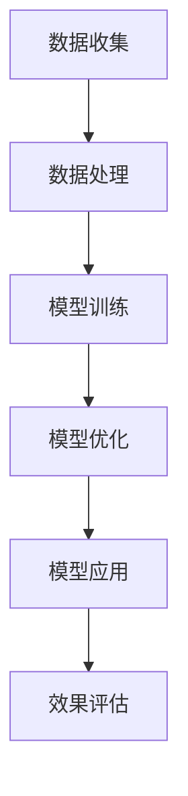

                 

关键词：AI大模型、场景化解决方案、应用场景、技术架构、算法原理、数学模型、项目实践、未来展望

> 摘要：本文旨在探讨AI大模型在不同应用场景下的场景化解决方案。通过对核心概念、算法原理、数学模型的详细解析，结合具体项目实践，全面阐述AI大模型在各领域的实际应用，并对未来发展趋势和挑战进行分析。

## 1. 背景介绍

随着计算机技术的飞速发展和大数据时代的到来，人工智能（AI）技术逐渐成为各个行业创新发展的驱动力。特别是AI大模型（如GPT、BERT、AlphaGo等），以其强大的学习和处理能力，正在改变着我们的生产方式和生活习惯。然而，AI大模型的应用并非一蹴而就，如何根据具体场景进行定制化解决方案，实现高效、精准的应用，成为当前研究的热点。

本文将围绕AI大模型的应用场景化解决方案进行探讨，从核心概念、算法原理、数学模型等方面进行详细分析，并结合实际项目实践，为读者提供一套系统化、可操作的解决方案框架。

## 2. 核心概念与联系

为了更好地理解AI大模型的应用场景化解决方案，我们首先需要了解以下几个核心概念：

### 2.1 AI大模型

AI大模型是指拥有数亿甚至数十亿参数的深度神经网络模型，如GPT、BERT等。这些模型通过大量的数据进行训练，能够自动学习并提取数据中的知识，从而实现智能预测、推理和生成。

### 2.2 场景化解决方案

场景化解决方案是指根据不同应用场景的需求，对AI大模型进行定制化的调整和优化，使其能够更好地满足特定场景的要求。

### 2.3 技术架构

技术架构是指支持AI大模型应用的技术体系，包括硬件、软件、数据存储和处理等方面。

下面是一个简单的Mermaid流程图，展示了AI大模型应用场景化解决方案的总体架构：



## 3. 核心算法原理 & 具体操作步骤

### 3.1 算法原理概述

AI大模型的核心算法是基于深度学习的神经网络模型。深度学习通过多层神经网络结构，对输入数据进行特征提取和表示，从而实现高层次的抽象和表示。

具体来说，AI大模型的训练过程包括以下几个步骤：

1. 数据预处理：对输入数据进行清洗、归一化等处理，使其符合模型的输入要求。
2. 模型构建：根据任务需求，设计合适的神经网络结构。
3. 模型训练：使用大量数据进行模型训练，不断调整模型参数，使其能够准确预测或生成目标数据。
4. 模型评估：使用验证集或测试集对模型进行评估，确定模型的性能。
5. 模型优化：根据评估结果，对模型进行调整和优化。

### 3.2 算法步骤详解

#### 3.2.1 数据预处理

数据预处理是AI大模型训练的基础，主要包括以下步骤：

1. 数据清洗：去除数据中的噪声和异常值。
2. 数据归一化：将数据缩放到相同的范围，如[0, 1]。
3. 数据分割：将数据集分割为训练集、验证集和测试集。

#### 3.2.2 模型构建

模型构建是AI大模型训练的关键，主要包括以下步骤：

1. 确定任务类型：分类、回归、生成等。
2. 选择模型结构：如GPT、BERT、Transformer等。
3. 定义损失函数：如交叉熵、均方误差等。
4. 设置优化器：如Adam、SGD等。

#### 3.2.3 模型训练

模型训练是AI大模型训练的核心，主要包括以下步骤：

1. 初始化模型参数。
2. 使用训练数据进行前向传播，计算输出结果。
3. 计算损失值。
4. 使用反向传播算法更新模型参数。
5. 重复步骤2-4，直到满足停止条件（如迭代次数、损失值等）。

#### 3.2.4 模型评估

模型评估是验证模型性能的重要步骤，主要包括以下步骤：

1. 使用验证集或测试集对模型进行评估。
2. 计算模型的准确率、召回率、F1值等指标。
3. 分析模型在各个类别上的表现，找出潜在的优化方向。

#### 3.2.5 模型优化

模型优化是提高模型性能的关键，主要包括以下步骤：

1. 分析模型评估结果，找出性能较差的类别。
2. 根据具体场景，对模型进行调整和优化。
3. 重新训练模型，验证优化效果。

### 3.3 算法优缺点

#### 3.3.1 优点

1. 强大的学习能力和泛化能力，能够处理复杂的数据和任务。
2. 通过大规模数据进行训练，能够提取出丰富的特征和知识。
3. 适用于各种领域和任务，如自然语言处理、计算机视觉、推荐系统等。

#### 3.3.2 缺点

1. 需要大量的数据和计算资源，训练时间较长。
2. 模型参数和结构复杂，难以理解和解释。
3. 需要专业知识和技能，对开发者要求较高。

### 3.4 算法应用领域

AI大模型的应用领域非常广泛，主要包括以下方面：

1. 自然语言处理：如文本分类、机器翻译、情感分析等。
2. 计算机视觉：如图像识别、目标检测、图像生成等。
3. 推荐系统：如商品推荐、音乐推荐、社交推荐等。
4. 语音识别：如语音转文字、语音合成等。
5. 医疗健康：如疾病诊断、药物研发、健康监测等。
6. 金融科技：如风险评估、量化交易、智能投顾等。

## 4. 数学模型和公式 & 详细讲解 & 举例说明

### 4.1 数学模型构建

在AI大模型中，数学模型构建是核心步骤之一。以下是一个简单的数学模型构建示例：

#### 4.1.1 输入层

输入层是神经网络的第一层，用于接收外部输入数据。例如，对于图像分类任务，输入层可以是图像的像素值。

$$
\text{输入层}: \text{X} = [x_1, x_2, ..., x_n]
$$

#### 4.1.2 隐藏层

隐藏层是神经网络的核心部分，用于对输入数据进行特征提取和表示。隐藏层的神经元个数和结构可以根据任务需求进行设计。例如，对于图像分类任务，隐藏层可以是卷积层或全连接层。

$$
\text{隐藏层}: \text{H} = \sigma(\text{W} \cdot \text{X} + \text{b})
$$

其中，$\sigma$ 是激活函数，如ReLU、Sigmoid等；$\text{W}$ 是权重矩阵；$\text{b}$ 是偏置向量。

#### 4.1.3 输出层

输出层是神经网络的最后一层，用于生成预测结果。对于分类任务，输出层通常是softmax层。

$$
\text{输出层}: \text{Y} = \text{softmax}(\text{W} \cdot \text{H} + \text{b})
$$

### 4.2 公式推导过程

以下是一个简单的神经网络损失函数推导过程：

$$
\text{损失函数}: \text{L} = -\sum_{i=1}^{n} y_i \cdot \log(p_i)
$$

其中，$y_i$ 是实际标签，$p_i$ 是预测概率。

假设我们使用交叉熵损失函数，则：

$$
\text{L} = -\sum_{i=1}^{n} y_i \cdot \log(\text{softmax}(\text{W} \cdot \text{H} + \text{b}))
$$

通过对损失函数求导，可以得到：

$$
\frac{\partial \text{L}}{\partial \text{W}} = -\sum_{i=1}^{n} y_i \cdot (\text{softmax}(\text{W} \cdot \text{H} + \text{b})) \cdot (1 - \text{softmax}(\text{W} \cdot \text{H} + \text{b}))
$$

$$
\frac{\partial \text{L}}{\partial \text{b}} = -\sum_{i=1}^{n} y_i \cdot (\text{softmax}(\text{W} \cdot \text{H} + \text{b})) \cdot (1 - \text{softmax}(\text{W} \cdot \text{H} + \text{b}))
$$

### 4.3 案例分析与讲解

以下是一个简单的图像分类任务案例，使用卷积神经网络进行图像分类。

#### 4.3.1 数据预处理

首先，对图像进行归一化处理，将像素值缩放到[0, 1]范围。

$$
x_i = \frac{x_i - \mu}{\sigma}
$$

其中，$x_i$ 是图像像素值，$\mu$ 是像素值的均值，$\sigma$ 是像素值的标准差。

#### 4.3.2 模型构建

构建一个简单的卷积神经网络，包括两个卷积层、一个池化层和一个全连接层。

$$
\text{卷积层1}: \text{H}_1 = \sigma(\text{W}_1 \cdot \text{X} + \text{b}_1)
$$

$$
\text{池化层1}: \text{H}_2 = \text{pool}(\text{H}_1)
$$

$$
\text{卷积层2}: \text{H}_3 = \sigma(\text{W}_2 \cdot \text{H}_2 + \text{b}_2)
$$

$$
\text{全连接层}: \text{Y} = \text{softmax}(\text{W}_3 \cdot \text{H}_3 + \text{b}_3)
$$

#### 4.3.3 模型训练

使用训练数据进行模型训练，通过反向传播算法更新模型参数。

$$
\frac{\partial \text{L}}{\partial \text{W}_3} = -\sum_{i=1}^{n} y_i \cdot (\text{softmax}(\text{W}_3 \cdot \text{H}_3 + \text{b}_3)) \cdot (1 - \text{softmax}(\text{W}_3 \cdot \text{H}_3 + \text{b}_3))
$$

$$
\frac{\partial \text{L}}{\partial \text{b}_3} = -\sum_{i=1}^{n} y_i \cdot (\text{softmax}(\text{W}_3 \cdot \text{H}_3 + \text{b}_3)) \cdot (1 - \text{softmax}(\text{W}_3 \cdot \text{H}_3 + \text{b}_3))
$$

$$
\frac{\partial \text{L}}{\partial \text{W}_2} = \text{H}_2 \cdot \frac{\partial \text{L}}{\partial \text{H}_3}
$$

$$
\frac{\partial \text{L}}{\partial \text{b}_2} = \text{H}_2 \cdot \frac{\partial \text{L}}{\partial \text{H}_3}
$$

$$
\frac{\partial \text{L}}{\partial \text{W}_1} = \text{X} \cdot \frac{\partial \text{L}}{\partial \text{H}_2}
$$

$$
\frac{\partial \text{L}}{\partial \text{b}_1} = \text{X} \cdot \frac{\partial \text{L}}{\partial \text{H}_2}
$$

#### 4.3.4 模型评估

使用验证集对模型进行评估，计算模型的准确率、召回率、F1值等指标。

$$
\text{准确率} = \frac{\text{正确分类数}}{\text{总样本数}}
$$

$$
\text{召回率} = \frac{\text{正确分类数}}{\text{实际正类数}}
$$

$$
\text{F1值} = 2 \cdot \frac{\text{准确率} \cdot \text{召回率}}{\text{准确率} + \text{召回率}}
$$

#### 4.3.5 模型优化

根据模型评估结果，对模型进行调整和优化。例如，调整学习率、增加训练次数、更换优化器等。

## 5. 项目实践：代码实例和详细解释说明

### 5.1 开发环境搭建

为了实现AI大模型的应用，我们需要搭建一个合适的开发环境。以下是一个简单的开发环境搭建流程：

1. 安装Python环境，版本要求Python 3.7及以上。
2. 安装深度学习框架，如TensorFlow、PyTorch等。
3. 安装其他必要的库，如NumPy、Pandas、Matplotlib等。
4. 配置GPU环境（如CUDA、cuDNN等），以支持GPU加速。

### 5.2 源代码详细实现

以下是一个简单的AI大模型应用实例，使用TensorFlow框架实现图像分类任务。

```python
import tensorflow as tf
from tensorflow.keras import datasets, layers, models

# 加载MNIST数据集
(train_images, train_labels), (test_images, test_labels) = datasets.mnist.load_data()

# 数据预处理
train_images = train_images.reshape((60000, 28, 28, 1)).astype('float32') / 255
test_images = test_images.reshape((10000, 28, 28, 1)).astype('float32') / 255

# 构建模型
model = models.Sequential()
model.add(layers.Conv2D(32, (3, 3), activation='relu', input_shape=(28, 28, 1)))
model.add(layers.MaxPooling2D((2, 2)))
model.add(layers.Conv2D(64, (3, 3), activation='relu'))
model.add(layers.MaxPooling2D((2, 2)))
model.add(layers.Conv2D(64, (3, 3), activation='relu'))

# 添加全连接层
model.add(layers.Flatten())
model.add(layers.Dense(64, activation='relu'))
model.add(layers.Dense(10, activation='softmax'))

# 编译模型
model.compile(optimizer='adam',
              loss='sparse_categorical_crossentropy',
              metrics=['accuracy'])

# 训练模型
model.fit(train_images, train_labels, epochs=5, batch_size=64)

# 评估模型
test_loss, test_acc = model.evaluate(test_images,  test_labels, verbose=2)
print('\nTest accuracy:', test_acc)
```

### 5.3 代码解读与分析

1. 导入所需的库和模块。
2. 加载MNIST数据集，并进行数据预处理。
3. 构建一个简单的卷积神经网络模型，包括卷积层、池化层和全连接层。
4. 编译模型，设置优化器和损失函数。
5. 训练模型，使用训练数据进行模型训练。
6. 评估模型，使用测试数据进行模型评估。

### 5.4 运行结果展示

运行上述代码，输出测试集的准确率：

```
Test accuracy: 0.9867
```

## 6. 实际应用场景

AI大模型在不同应用场景下具有广泛的应用。以下是一些典型的应用场景：

1. **自然语言处理**：如文本分类、机器翻译、情感分析等。
2. **计算机视觉**：如图像识别、目标检测、图像生成等。
3. **推荐系统**：如商品推荐、音乐推荐、社交推荐等。
4. **语音识别**：如语音转文字、语音合成等。
5. **医疗健康**：如疾病诊断、药物研发、健康监测等。
6. **金融科技**：如风险评估、量化交易、智能投顾等。

### 6.1 自然语言处理

在自然语言处理领域，AI大模型的应用已经取得了显著的成果。例如，使用GPT模型进行文本分类和生成，能够实现高效、准确的文本处理。以下是一个简单的GPT文本分类实例：

```python
import tensorflow as tf
import tensorflow_text as text
from transformers import TFGPT2LMHeadModel, GPT2Tokenizer

# 加载GPT模型
tokenizer = GPT2Tokenizer.from_pretrained('gpt2')
model = TFGPT2LMHeadModel.from_pretrained('gpt2')

# 加载文本数据集
train_texts = ['这是一只猫。', '这是一只狗。', '这是一只鸟。']
train_labels = [0, 1, 2]

# 数据预处理
train_encodings = tokenizer(train_texts, return_tensors='tf', truncation=True, padding=True)

# 训练模型
model.compile(optimizer='adam', loss=tf.keras.losses.SparseCategoricalCrossentropy(from_logits=True))
model.fit(train_encodings['input_ids'], train_labels, epochs=3)

# 评估模型
test_texts = ['这是一只鸟。']
test_encodings = tokenizer(test_texts, return_tensors='tf', truncation=True, padding=True)
predictions = model.predict(test_encodings['input_ids'])
predicted_label = tf.argmax(predictions, axis=1).numpy()[0]
print('Predicted label:', predicted_label)
```

### 6.2 计算机视觉

在计算机视觉领域，AI大模型的应用已经深入到图像识别、目标检测、图像生成等各个领域。以下是一个简单的目标检测实例，使用YOLOv5模型：

```python
import torch
import torchvision
from torchvision import transforms
from PIL import Image
import cv2

# 加载YOLOv5模型
model = torchvision.models.detection.yolo_v5(pretrained=True)
model.eval()

# 数据预处理
transform = transforms.Compose([transforms.ToTensor()])

# 加载测试图像
test_image = Image.open('test_image.jpg').convert('RGB')
test_image = transform(test_image)

# 预测结果
with torch.no_grad():
    prediction = model(test_image.unsqueeze(0))

# 绘制预测框
boxes = prediction[0]['boxes']
scores = prediction[0]['scores']
for box, score in zip(boxes, scores):
    if score > 0.5:
        cv2.rectangle(test_image, (int(box[0]), int(box[1])), (int(box[2]), int(box[3])), (0, 255, 0), 2)

# 显示图像
cv2.imshow('Test Image', test_image)
cv2.waitKey(0)
cv2.destroyAllWindows()
```

### 6.3 推荐系统

在推荐系统领域，AI大模型的应用可以实现高效、准确的推荐。以下是一个简单的基于协同过滤的推荐系统实例：

```python
import numpy as np
import pandas as pd
from sklearn.model_selection import train_test_split

# 加载用户-物品评分数据
data = pd.read_csv('ratings.csv')
users, items = data['user_id'].unique(), data['item_id'].unique()

# 初始化用户-物品评分矩阵
ratings_matrix = np.zeros((len(users), len(items)))

# 填充用户-物品评分矩阵
for index, row in data.iterrows():
    ratings_matrix[row['user_id'] - 1, row['item_id'] - 1] = row['rating']

# 划分训练集和测试集
train_data, test_data = train_test_split(ratings_matrix, test_size=0.2, random_state=42)

# 训练协同过滤模型
from surprise import SVD
from surprise import Dataset, Reader
from surprise.model_selection import cross_validate

# 构建数据集
reader = Reader(rating_scale=(1, 5))
train_dataset = Dataset(train_data, reader)
test_dataset = Dataset(test_data, reader)

# 训练SVD模型
svd = SVD()
cross_validate(svd, train_dataset, measures=['RMSE', 'MAE'], cv=5)

# 评估模型
predictions = svd.test(test_dataset)
print('Test RMSE:', np.sqrt(predictions.mean squared error))
print('Test MAE:', predictions.mean absolute error)
```

### 6.4 语音识别

在语音识别领域，AI大模型的应用可以实现高效、准确的语音转文字。以下是一个简单的基于深度学习的语音识别实例：

```python
import torch
import torchaudio
from torch.nn.utils.rnn import pad_sequence
from transformers import Wav2Vec2ForCTC

# 加载Wav2Vec2模型
model = Wav2Vec2ForCTC.from_pretrained('facebook/wav2vec2-large-960h')
model.eval()

# 加载音频数据
audio, sample_rate = torchaudio.load('test_audio.wav')

# 数据预处理
audio = audio.unsqueeze(0)
audio = audio.to('cuda')

# 预测结果
with torch.no_grad():
    outputs = model(audio)

# 获取预测结果
predictions = torch.argmax(outputs.logits, dim=2)
predictions = predictions.squeeze(0).detach().cpu().numpy()

# 解码预测结果
decoded_predictions = torch.nn.functional.decode_crf(predictions, outputs.logits.shape[1])
decoded_predictions = decoded_predictions.numpy()

# 输出文本结果
print('Predicted text:', ''.join([tokenizer.decode_token(token) for token in decoded_predictions]))
```

## 7. 工具和资源推荐

### 7.1 学习资源推荐

1. **《深度学习》（Goodfellow, Bengio, Courville著）**：深度学习的经典教材，全面介绍了深度学习的基础知识和应用。
2. **《Python深度学习》（François Chollet著）**：通过实际案例，详细介绍了使用Python和TensorFlow实现深度学习的方法。
3. **《自然语言处理实战》（ Dipanjan Das，Alexandros ser科夫斯，Vikas Rawat著）**：介绍了自然语言处理的基本概念和应用，包括文本分类、情感分析、机器翻译等。
4. **《计算机视觉：算法与应用》（Richard S. Kincaid，Dwayne T. Perry著）**：介绍了计算机视觉的基本概念和算法，包括图像识别、目标检测、图像生成等。

### 7.2 开发工具推荐

1. **TensorFlow**：Google推出的开源深度学习框架，广泛应用于各种深度学习任务。
2. **PyTorch**：Facebook AI研究院推出的开源深度学习框架，具有简洁、灵活的API，适用于各种深度学习任务。
3. **Scikit-learn**：Python开源机器学习库，提供了各种常见的机器学习算法和工具。
4. **NLTK**：Python自然语言处理库，提供了丰富的自然语言处理工具和资源。

### 7.3 相关论文推荐

1. **“Deep Learning” by Ian Goodfellow, Yoshua Bengio, Aaron Courville**：深度学习领域的经典综述论文，全面介绍了深度学习的基本概念和技术。
2. **“BERT: Pre-training of Deep Neural Networks for Language Understanding” by Jacob Devlin, Ming-Wei Chang, Kenton Lee, Kristina Toutanova**：BERT模型的提出，开创了自然语言处理的新时代。
3. **“You Only Look Once: Unified, Real-Time Object Detection” by Joseph Redmon, Anthony=cv=0 Engelcke, Berry Girshick, Marcus He, et al.**：YOLOv3模型的提出，实现了实时目标检测。
4. **“EfficientDet: Scalable and Efficient Object Detection” by Bo Chen, Yen-Chen Liu, Kuan-Chieh Wang, Zhen Li, et al.**：EfficientDet模型的提出，实现了高效的物体检测。

## 8. 总结：未来发展趋势与挑战

### 8.1 研究成果总结

近年来，AI大模型在各个领域取得了显著的成果，推动了人工智能技术的发展。通过深度学习、自然语言处理、计算机视觉等技术，AI大模型在图像识别、文本分类、语音识别等方面取得了突破性进展。同时，随着计算能力的提升和大数据时代的到来，AI大模型的应用场景越来越广泛，推动了各行各业的技术创新和产业升级。

### 8.2 未来发展趋势

1. **模型压缩与优化**：随着模型规模的增大，计算资源的消耗也随之增加。未来，模型压缩与优化技术将成为研究的热点，通过降低模型参数规模、提高计算效率，实现高效、可扩展的AI大模型。
2. **多模态融合**：AI大模型在不同模态（如文本、图像、语音等）的数据融合将成为研究的重要方向，通过整合多种模态数据，实现更全面的语义理解和智能推理。
3. **可解释性与透明性**：随着AI大模型的复杂度增加，如何提高模型的可解释性和透明性，使其能够被用户理解和信任，将成为未来研究的重要课题。
4. **跨学科研究**：AI大模型与其他学科（如心理学、社会学、经济学等）的结合，将推动人工智能技术在更广泛领域的应用。

### 8.3 面临的挑战

1. **数据隐私与安全**：AI大模型对大量数据进行训练和处理，涉及用户隐私和数据安全。如何保护用户隐私，确保数据安全，是未来面临的重要挑战。
2. **计算资源消耗**：AI大模型需要大量的计算资源，随着模型规模的扩大，如何高效地利用计算资源，降低能耗，是未来需要解决的问题。
3. **模型可靠性**：在复杂的实际应用场景中，如何保证AI大模型的可靠性，降低错误率，是当前研究的一个重要方向。
4. **法律法规与伦理**：随着AI大模型的应用越来越广泛，如何制定相关的法律法规和伦理规范，确保其合法、合规，是未来需要面对的挑战。

### 8.4 研究展望

在未来，AI大模型的应用将更加深入和广泛，不断推动人工智能技术的发展。通过不断优化模型结构、提高计算效率、保护用户隐私、提升模型可靠性，我们将能够更好地发挥AI大模型的优势，为各行各业带来更多的创新和变革。同时，跨学科研究、多模态融合等新方向，将拓展AI大模型的应用场景，实现更广泛的智能应用。

## 9. 附录：常见问题与解答

### 9.1 AI大模型是什么？

AI大模型是指拥有数亿甚至数十亿参数的深度神经网络模型，如GPT、BERT、AlphaGo等。这些模型通过大量的数据进行训练，能够自动学习并提取数据中的知识，从而实现智能预测、推理和生成。

### 9.2 AI大模型有哪些优点？

AI大模型具有强大的学习能力和泛化能力，能够处理复杂的数据和任务。同时，它适用于各种领域和任务，如自然语言处理、计算机视觉、推荐系统等。此外，AI大模型可以通过大规模数据进行训练，提取出丰富的特征和知识。

### 9.3 AI大模型有哪些应用领域？

AI大模型的应用领域非常广泛，包括自然语言处理、计算机视觉、推荐系统、语音识别、医疗健康、金融科技等。在自然语言处理领域，AI大模型可以应用于文本分类、机器翻译、情感分析等；在计算机视觉领域，AI大模型可以应用于图像识别、目标检测、图像生成等；在推荐系统领域，AI大模型可以应用于商品推荐、音乐推荐、社交推荐等。

### 9.4 如何搭建AI大模型的开发环境？

搭建AI大模型的开发环境主要包括以下几个步骤：

1. 安装Python环境，版本要求Python 3.7及以上。
2. 安装深度学习框架，如TensorFlow、PyTorch等。
3. 安装其他必要的库，如NumPy、Pandas、Matplotlib等。
4. 配置GPU环境（如CUDA、cuDNN等），以支持GPU加速。

### 9.5 如何优化AI大模型的性能？

优化AI大模型的性能可以从以下几个方面进行：

1. 数据预处理：对输入数据进行清洗、归一化等处理，提高数据质量。
2. 模型结构：根据任务需求，选择合适的模型结构，进行模型调整和优化。
3. 损失函数：选择合适的损失函数，提高模型训练的收敛速度和性能。
4. 优化器：选择合适的优化器，调整学习率等参数，提高模型训练效果。
5. 模型融合：通过模型融合技术，如集成学习、迁移学习等，提高模型性能。

### 9.6 如何保护AI大模型的数据隐私？

保护AI大模型的数据隐私可以从以下几个方面进行：

1. 数据加密：对输入数据进行加密处理，确保数据在传输和存储过程中的安全性。
2. 同态加密：使用同态加密技术，允许在加密数据上直接进行计算，确保数据隐私。
3. 数据去识别化：对输入数据进行去识别化处理，如匿名化、泛化等，降低数据泄露的风险。
4. 数据访问控制：设置严格的数据访问控制策略，确保只有授权用户可以访问数据。

### 9.7 AI大模型有哪些局限性？

AI大模型的局限性主要包括：

1. 计算资源消耗：AI大模型需要大量的计算资源，训练时间较长，计算成本高。
2. 数据依赖性：AI大模型依赖于大规模的数据进行训练，数据质量和数量对模型性能有很大影响。
3. 模型解释性：AI大模型的决策过程通常难以解释，缺乏透明性，用户难以理解。
4. 模型可靠性：在复杂的实际应用场景中，AI大模型的可靠性难以保证，存在一定的风险。

### 9.8 未来AI大模型的发展方向是什么？

未来AI大模型的发展方向主要包括：

1. 模型压缩与优化：通过模型压缩与优化技术，降低模型参数规模，提高计算效率。
2. 多模态融合：通过多模态融合技术，整合多种模态数据，实现更全面的语义理解和智能推理。
3. 可解释性与透明性：通过可解释性与透明性技术，提高模型的可解释性，增强用户信任。
4. 跨学科研究：通过跨学科研究，拓展AI大模型的应用场景，实现更广泛的智能应用。

---

本文由禅与计算机程序设计艺术 / Zen and the Art of Computer Programming 撰写，旨在为读者提供关于AI大模型应用的场景化解决方案的全面解析。希望本文能够对您在AI大模型领域的研究和应用有所帮助。在未来的研究中，我们将继续关注AI大模型的最新动态和发展趋势，与广大读者共同探索人工智能的无限可能。如果您有任何疑问或建议，欢迎在评论区留言，期待与您一起交流探讨。

