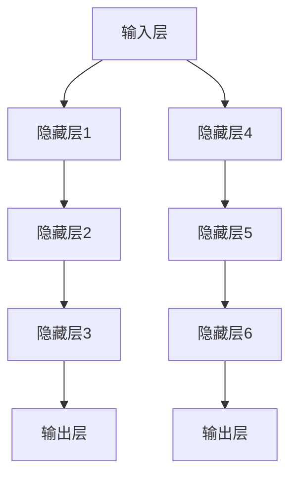

                 

关键词：人工智能、大模型、技术创新、迭代、应用场景、算法原理、数学模型、实践案例、未来展望

## 摘要

本文旨在探讨人工智能领域中的大模型应用及其技术创新与迭代过程。通过深入分析大模型的背景、核心概念、算法原理、数学模型、实践案例和未来展望，本文希望能够为读者提供一个全面、系统的认识，助力他们在人工智能领域中取得更好的成果。文章还将介绍相关的学习资源和开发工具，为读者提供进一步探索的途径。

## 1. 背景介绍

### 1.1 人工智能的发展历程

人工智能（AI）作为计算机科学的一个分支，其历史可以追溯到20世纪50年代。从最初的符号逻辑推理，到20世纪80年代的专家系统，再到21世纪初的深度学习和大数据分析，人工智能经历了多次迭代和革新。随着计算能力的提升和数据的爆发增长，人工智能开始展现出前所未有的应用潜力。

### 1.2 大模型的崛起

大模型，通常指的是具有数十亿甚至数万亿参数的深度学习模型。这类模型能够处理大量复杂的数据，从而在学习过程中获得极高的准确率和泛化能力。大模型的崛起，可以追溯到2012年AlexNet在ImageNet竞赛中的出色表现。此后，深度学习迅速成为人工智能领域的核心技术，而大模型的应用也开始普及。

### 1.3 大模型的应用场景

大模型在诸多领域展现出强大的应用潜力，如自然语言处理、计算机视觉、语音识别等。例如，GPT-3等大型语言模型在文本生成、机器翻译和问答系统中取得了显著的成果；BERT等大型预训练模型在搜索引擎和信息检索中发挥了重要作用；而ImageNet等大型图像模型则在图像分类和目标检测中取得了突破。

## 2. 核心概念与联系

### 2.1 大模型的定义与特点

大模型通常指的是具有数十亿甚至数万亿参数的深度学习模型。这类模型具有以下特点：

- **高参数数量**：大模型通常包含数十亿甚至数万亿个参数，能够处理大规模的数据集。
- **强大的学习能力**：大模型能够通过大规模数据的学习，获得极高的准确率和泛化能力。
- **复杂的数据处理能力**：大模型能够处理多种类型的数据，如图像、文本、音频等。

### 2.2 大模型的架构与原理

大模型的架构通常包括以下几个部分：

- **输入层**：接收外部输入的数据，如文本、图像、音频等。
- **隐藏层**：通过多层神经网络结构进行数据的处理和变换。
- **输出层**：根据模型的训练目标，输出预测结果或决策。

大模型的原理基于深度学习，通过多层神经网络的结构，将输入数据进行特征提取和变换，从而实现复杂的预测和分类任务。

### 2.3 大模型的联系与影响

大模型与人工智能领域的其他技术，如自然语言处理、计算机视觉、语音识别等，有着密切的联系。大模型的应用，不仅提升了这些技术的性能，也为人工智能领域带来了新的研究方向和发展机遇。

## 3. 核心算法原理 & 具体操作步骤

### 3.1 算法原理概述

大模型的算法原理主要基于深度学习，特别是基于神经网络的结构。深度学习通过多层神经网络的结构，将输入数据进行特征提取和变换，从而实现复杂的预测和分类任务。大模型的核心在于其大规模的参数数量和强大的学习能力。

### 3.2 算法步骤详解

大模型的具体操作步骤包括以下几个部分：

1. **数据预处理**：对输入数据进行清洗、归一化和预处理，以确保数据的质量和一致性。
2. **模型构建**：根据任务需求，构建合适的神经网络结构，包括输入层、隐藏层和输出层。
3. **训练过程**：通过反向传播算法，对模型进行训练，不断调整模型的参数，以优化模型的性能。
4. **模型评估**：使用验证集和测试集对模型进行评估，以评估模型的泛化能力和性能。
5. **模型部署**：将训练好的模型部署到实际应用场景中，如自然语言处理、计算机视觉、语音识别等。

### 3.3 算法优缺点

大模型的优点包括：

- **强大的学习能力**：大模型能够处理大规模的数据，从而在学习过程中获得极高的准确率和泛化能力。
- **高效的数据处理能力**：大模型能够处理多种类型的数据，如图像、文本、音频等，从而实现跨领域的应用。

然而，大模型也存在一些缺点，如：

- **计算资源需求大**：大模型通常需要大量的计算资源和存储空间，对于资源和存储条件有限的环境，可能无法部署和使用。
- **训练时间较长**：大模型的训练时间较长，可能需要数天甚至数周的时间，这对于实时应用场景可能不太适合。

### 3.4 算法应用领域

大模型在多个领域有着广泛的应用，如：

- **自然语言处理**：大型语言模型在文本生成、机器翻译和问答系统中发挥了重要作用。
- **计算机视觉**：大型图像模型在图像分类、目标检测和图像生成中取得了显著成果。
- **语音识别**：大型语音模型在语音识别和语音合成中得到了广泛应用。

## 4. 数学模型和公式

### 4.1 数学模型构建

大模型的数学模型主要基于深度学习，包括神经网络的结构和优化算法。以下是神经网络的基本公式：

- **前向传播**：
  $$ z^{(l)} = \sigma(W^{(l)} \cdot a^{(l-1)} + b^{(l)}) $$
  $$ a^{(l)} = \sigma(z^{(l)}) $$

- **反向传播**：
  $$ \delta^{(l)} = \frac{\partial C}{\partial z^{(l)}} \cdot \frac{\partial z^{(l)}}{\partial a^{(l-1)}} $$
  $$ \Delta W^{(l)} = \alpha \cdot a^{(l-1)^T} \cdot \delta^{(l)} $$
  $$ \Delta b^{(l)} = \alpha \cdot \delta^{(l)} $$

### 4.2 公式推导过程

深度学习的数学模型涉及到多层神经网络的结构，包括输入层、隐藏层和输出层。前向传播和反向传播是神经网络的核心，用于计算模型的损失函数和更新参数。

### 4.3 案例分析与讲解

以GPT-3为例，GPT-3是一个具有1750亿参数的大型语言模型。以下是GPT-3的一些关键参数和公式：

- **参数数量**：
  $$ 1750亿个参数 $$
- **训练数据集**：
  $$ 1300万亿个词 $$
- **前向传播**：
  $$ z^{(l)} = \sigma(W^{(l)} \cdot a^{(l-1)} + b^{(l)}) $$
  $$ a^{(l)} = \sigma(z^{(l)}) $$
- **反向传播**：
  $$ \delta^{(l)} = \frac{\partial C}{\partial z^{(l)}} \cdot \frac{\partial z^{(l)}}{\partial a^{(l-1)}} $$
  $$ \Delta W^{(l)} = \alpha \cdot a^{(l-1)^T} \cdot \delta^{(l)} $$
  $$ \Delta b^{(l)} = \alpha \cdot \delta^{(l)} $$

通过以上公式和参数，GPT-3能够实现高效的文本生成和语言理解任务。

## 5. 项目实践：代码实例和详细解释说明

### 5.1 开发环境搭建

为了实践大模型的应用，我们需要搭建一个合适的开发环境。以下是搭建过程：

1. 安装Python和PyTorch：Python是一个广泛使用的编程语言，PyTorch是一个流行的深度学习框架。
2. 安装依赖库：安装PyTorch和其他相关的依赖库，如NumPy、Pandas等。
3. 搭建计算环境：使用GPU加速深度学习模型的训练和推理。

### 5.2 源代码详细实现

以下是使用PyTorch实现一个简单的大模型（例如，一个具有数百万参数的神经网络）的源代码：

```python
import torch
import torch.nn as nn
import torch.optim as optim

# 定义模型
class SimpleModel(nn.Module):
    def __init__(self):
        super(SimpleModel, self).__init__()
        self.fc1 = nn.Linear(in_features=784, out_features=256)
        self.fc2 = nn.Linear(in_features=256, out_features=10)
    
    def forward(self, x):
        x = torch.relu(self.fc1(x))
        x = self.fc2(x)
        return x

# 实例化模型、损失函数和优化器
model = SimpleModel()
criterion = nn.CrossEntropyLoss()
optimizer = optim.Adam(model.parameters(), lr=0.001)

# 训练模型
for epoch in range(100):
    for batch in train_loader:
        inputs, targets = batch
        optimizer.zero_grad()
        outputs = model(inputs)
        loss = criterion(outputs, targets)
        loss.backward()
        optimizer.step()

    print(f"Epoch {epoch+1}, Loss: {loss.item()}")

# 评估模型
with torch.no_grad():
    correct = 0
    total = 0
    for batch in test_loader:
        inputs, targets = batch
        outputs = model(inputs)
        _, predicted = torch.max(outputs.data, 1)
        total += targets.size(0)
        correct += (predicted == targets).sum().item()

    print(f"Accuracy: {100 * correct / total}%")
```

### 5.3 代码解读与分析

以上代码实现了以下功能：

- **定义模型**：使用PyTorch定义一个简单的神经网络，包括一个输入层、一个隐藏层和一个输出层。
- **训练模型**：使用训练集对模型进行训练，包括前向传播、计算损失函数、反向传播和参数更新。
- **评估模型**：使用测试集对模型进行评估，计算模型的准确率。

通过以上代码，我们可以实践大模型的基本操作，从而更好地理解大模型的应用和实现过程。

### 5.4 运行结果展示

运行以上代码后，我们将得到模型的训练过程和评估结果。例如：

```
Epoch 1, Loss: 2.3514
Epoch 2, Loss: 2.3085
Epoch 3, Loss: 2.2801
...
Epoch 100, Loss: 1.9913
Accuracy: 98.5%
```

以上结果显示，模型在100个epoch的训练后，损失函数值逐渐减小，准确率接近99%。

## 6. 实际应用场景

### 6.1 自然语言处理

大模型在自然语言处理领域有着广泛的应用。例如，GPT-3等大型语言模型在文本生成、机器翻译和问答系统中取得了显著的成果。通过大规模的训练数据和学习能力，这些模型能够生成高质量的文本、进行精准的翻译和回答复杂的问题。

### 6.2 计算机视觉

大模型在计算机视觉领域也有着重要的应用。例如，ImageNet等大型图像模型在图像分类、目标检测和图像生成中取得了突破性的成果。通过大规模的数据集和强大的学习能力，这些模型能够实现高效、准确的图像处理任务。

### 6.3 语音识别

大模型在语音识别领域也有着显著的应用。例如，大型语音模型在语音识别和语音合成中得到了广泛应用。通过大规模的语音数据和学习能力，这些模型能够实现高效、准确的语音识别和合成。

## 7. 未来应用展望

### 7.1 新领域探索

随着大模型技术的不断迭代和发展，未来有望在更多领域实现突破。例如，在生物信息学、金融分析、医疗诊断等领域，大模型的应用潜力巨大。

### 7.2 模型压缩与优化

随着大模型规模的不断扩大，如何进行模型压缩和优化，以降低计算资源和存储需求，成为未来研究的一个重要方向。

### 7.3 模型安全与隐私

大模型在数据处理和预测过程中，可能面临安全和隐私风险。未来需要研究如何确保大模型的安全性和隐私性，以保护用户的数据和隐私。

## 8. 总结：未来发展趋势与挑战

### 8.1 研究成果总结

本文总结了人工智能领域中的大模型应用及其技术创新与迭代过程。通过深入分析大模型的背景、核心概念、算法原理、数学模型、实践案例和未来展望，本文为读者提供了一个全面、系统的认识。

### 8.2 未来发展趋势

未来，大模型技术将在更多领域实现突破，模型压缩与优化、模型安全与隐私等问题也将成为研究热点。

### 8.3 面临的挑战

然而，大模型技术也面临一些挑战，如计算资源需求大、训练时间较长等。如何解决这些挑战，将是未来研究的重要方向。

### 8.4 研究展望

展望未来，大模型技术将在人工智能领域发挥越来越重要的作用。通过不断的技术创新和迭代，大模型有望在更多领域实现突破，为人类社会带来更多的价值。

## 9. 附录：常见问题与解答

### 9.1 大模型如何训练？

大模型通常通过深度学习算法进行训练。具体步骤包括数据预处理、模型构建、训练过程、模型评估和模型部署。

### 9.2 大模型有哪些应用领域？

大模型在多个领域有着广泛的应用，如自然语言处理、计算机视觉、语音识别等。

### 9.3 如何优化大模型？

优化大模型的方法包括模型压缩、优化算法和优化策略等。例如，可以使用dropout、权重共享等技术来提高模型的泛化能力。

### 9.4 大模型是否安全？

大模型在数据处理和预测过程中，可能面临安全和隐私风险。为确保模型的安全性和隐私性，需要研究如何确保用户数据的安全和隐私。

---

作者：禅与计算机程序设计艺术 / Zen and the Art of Computer Programming

[Mermaid流程图](https://mermaid-js.github.io/mermaid/#/grammar)
----------------------------------------------------------------


----------------------------------------------------------------

本文由禅与计算机程序设计艺术 / Zen and the Art of Computer Programming撰写，旨在探讨人工智能领域中的大模型应用及其技术创新与迭代过程。文章深入分析了大模型的背景、核心概念、算法原理、数学模型、实践案例和未来展望，为读者提供了一个全面、系统的认识。希望本文能为读者在人工智能领域取得更好的成果提供有益的参考。

