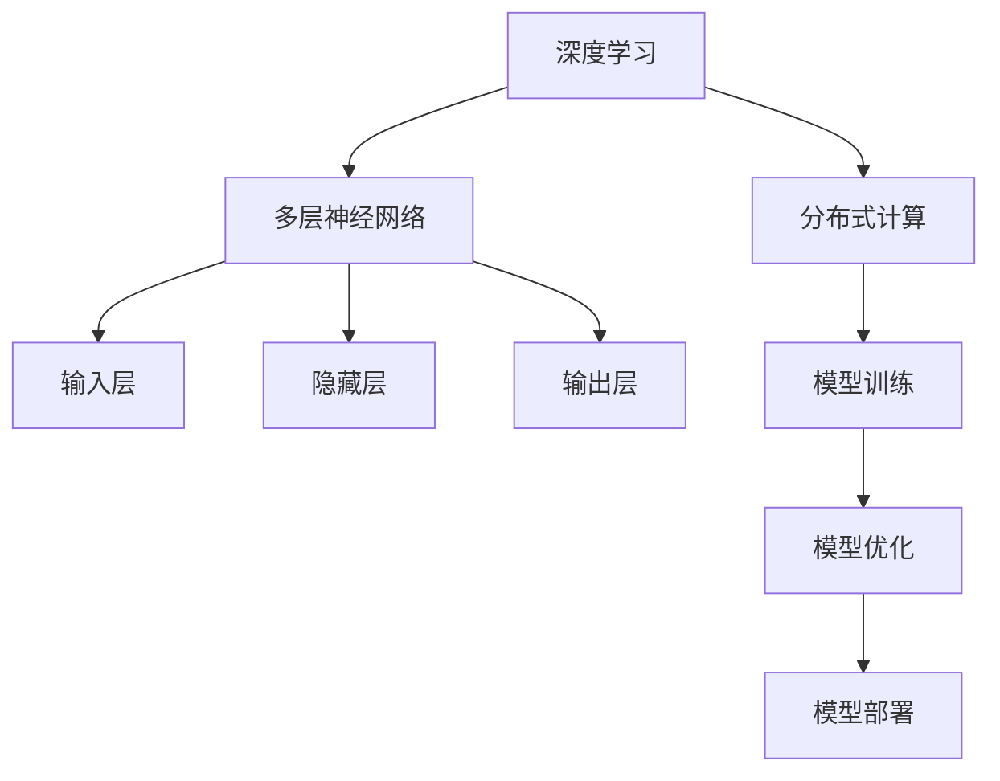

                 

关键词：人工智能，大模型，技术预研，应用探索，深度学习，神经网络，分布式计算，模型优化，安全性，伦理，隐私保护。

## 摘要

本文旨在探讨人工智能领域中的大模型技术预研与应用探索方向。随着计算能力的提升和数据量的爆炸性增长，大模型在各个行业中的应用愈发广泛。本文首先介绍了大模型的发展背景，随后深入分析了大模型的核心概念与联系，详细阐述了大模型的算法原理、数学模型以及具体操作步骤。接着，本文通过项目实践展示了大模型的代码实例和运行结果，并探讨了其在实际应用场景中的价值。最后，本文提出了未来应用展望，工具和资源推荐，以及对未来发展趋势与挑战的展望。

## 1. 背景介绍

随着互联网的普及和数据的爆炸性增长，人工智能（AI）技术取得了飞速发展。特别是在深度学习（Deep Learning）的推动下，大模型（Large Models）逐渐成为研究和应用的热点。大模型通常是指具有数十亿甚至千亿参数的神经网络模型，它们通过学习大量数据来模拟人类认知和决策过程。大模型在自然语言处理（NLP）、计算机视觉（CV）、语音识别（ASR）等领域展现出了强大的性能和广泛的应用前景。

### 1.1 大模型的发展历程

大模型的发展可以追溯到2000年代初，当时神经网络模型的应用还相对有限。随着计算能力的提升和算法的改进，深度学习逐渐成为主流的研究方向。2012年，AlexNet在ImageNet图像识别大赛中取得了突破性的成绩，标志着深度学习时代的到来。此后，随着数据量和计算资源的不断增长，神经网络模型变得越来越庞大，参数数量也急剧增加。

### 1.2 大模型在人工智能中的应用

大模型在人工智能领域的应用主要体现在以下几个方面：

- **自然语言处理**：大模型在语言建模、机器翻译、文本生成等方面表现出色，如GPT系列模型、BERT模型等。
- **计算机视觉**：大模型在图像分类、目标检测、图像生成等方面有广泛应用，如ResNet、VGG等。
- **语音识别**：大模型在语音合成、语音识别等方面取得了显著进展，如WaveNet、DeepSpeech等。

### 1.3 大模型的应用前景

随着技术的不断进步，大模型在更多领域的应用前景愈发广阔。未来，大模型可能会在智能医疗、自动驾驶、智能教育、智能金融等领域发挥重要作用，推动人工智能向更高层次发展。

## 2. 核心概念与联系

在深入探讨大模型之前，我们需要理解一些核心概念，包括深度学习、神经网络、分布式计算等。

### 2.1 深度学习

深度学习是一种机器学习技术，通过多层神经网络对数据进行建模和学习。深度学习的核心思想是通过逐层提取数据特征，从而实现对复杂数据的建模。大模型通常采用深度学习技术，通过增加网络层数和参数数量来提升模型性能。

### 2.2 神经网络

神经网络是由大量神经元组成的计算模型，每个神经元都与其他神经元相连，通过传递信号来实现信息处理。神经网络可以分为多层，包括输入层、隐藏层和输出层。大模型通常具有数十层甚至上百层的隐藏层，能够处理复杂的任务。

### 2.3 分布式计算

分布式计算是指将计算任务分布到多个节点上进行处理，以提升计算效率和扩展性。在大模型训练过程中，由于模型参数和计算量巨大，分布式计算成为提高训练速度和降低成本的关键技术。

### 2.4 Mermaid 流程图

以下是一个描述大模型核心概念与联系的Mermaid流程图：



## 3. 核心算法原理 & 具体操作步骤

### 3.1 算法原理概述

大模型的算法原理主要基于深度学习，通过多层神经网络对数据进行建模。具体来说，包括以下步骤：

- **数据预处理**：对输入数据进行清洗、归一化等处理，以便于模型训练。
- **模型构建**：设计并构建神经网络结构，包括输入层、隐藏层和输出层。
- **模型训练**：通过反向传播算法，对模型参数进行优化，以降低损失函数。
- **模型评估**：使用验证集或测试集评估模型性能，并进行调优。
- **模型部署**：将训练好的模型部署到实际应用场景中，如自然语言处理、计算机视觉等。

### 3.2 算法步骤详解

#### 3.2.1 数据预处理

数据预处理是模型训练的第一步，主要包括以下步骤：

- **数据清洗**：去除无效数据、缺失值和异常值。
- **数据归一化**：将数据缩放到一定范围内，如[-1, 1]或[0, 1]。
- **数据增强**：通过旋转、缩放、裁剪等操作增加数据多样性。

#### 3.2.2 模型构建

模型构建主要包括以下步骤：

- **设计网络结构**：根据任务需求设计神经网络结构，包括层数、每层的神经元数量、激活函数等。
- **初始化参数**：对模型参数进行初始化，常用的方法有零初始化、高斯初始化等。
- **选择优化器**：选择合适的优化算法，如SGD、Adam等。

#### 3.2.3 模型训练

模型训练主要包括以下步骤：

- **前向传播**：计算输入数据的预测结果，计算损失函数。
- **反向传播**：根据损失函数对模型参数进行反向传播，更新参数。
- **迭代优化**：重复前向传播和反向传播，直到模型收敛。

#### 3.2.4 模型评估

模型评估主要包括以下步骤：

- **验证集评估**：在验证集上评估模型性能，选择最佳模型。
- **测试集评估**：在测试集上评估模型性能，评估模型的泛化能力。
- **模型调优**：根据评估结果调整模型参数，优化模型性能。

#### 3.2.5 模型部署

模型部署主要包括以下步骤：

- **模型压缩**：对模型进行压缩，降低模型大小和计算量。
- **模型推理**：使用训练好的模型对实际数据进行预测。
- **模型监控**：监控模型运行状态，确保模型稳定可靠。

### 3.3 算法优缺点

#### 3.3.1 优点

- **强大的表达能力**：大模型通过多层神经网络能够提取出复杂的数据特征，具有强大的表达能力和泛化能力。
- **良好的性能**：在大规模数据集上，大模型通常能够取得优秀的性能和效果。
- **广泛的应用**：大模型在自然语言处理、计算机视觉、语音识别等领域有广泛应用。

#### 3.3.2 缺点

- **计算资源需求高**：大模型需要大量的计算资源和存储空间，对硬件设备要求较高。
- **训练时间长**：大模型的训练时间较长，需要耐心等待模型收敛。
- **过拟合风险**：大模型容易过拟合，特别是在训练数据不足或数据分布不均匀的情况下。

### 3.4 算法应用领域

大模型在多个领域有广泛应用，以下是一些典型应用领域：

- **自然语言处理**：大模型在语言建模、机器翻译、文本生成等方面有广泛应用。
- **计算机视觉**：大模型在图像分类、目标检测、图像生成等方面有广泛应用。
- **语音识别**：大模型在语音合成、语音识别等方面有广泛应用。
- **推荐系统**：大模型在推荐系统中的用户画像、物品推荐等方面有广泛应用。
- **智能医疗**：大模型在疾病预测、药物研发等方面有广泛应用。

## 4. 数学模型和公式 & 详细讲解 & 举例说明

大模型的数学模型主要包括损失函数、优化算法和激活函数等。以下是对这些数学模型的详细讲解和举例说明。

### 4.1 数学模型构建

#### 4.1.1 损失函数

损失函数是评估模型预测结果与实际标签之间差异的指标，常用的损失函数包括均方误差（MSE）、交叉熵（Cross Entropy）等。

- **均方误差（MSE）**：

  $$MSE = \frac{1}{n}\sum_{i=1}^{n}(y_i - \hat{y}_i)^2$$

  其中，$y_i$为实际标签，$\hat{y}_i$为模型预测结果。

- **交叉熵（Cross Entropy）**：

  $$H(y, \hat{y}) = -\sum_{i=1}^{n}y_i \log(\hat{y}_i)$$

  其中，$y_i$为实际标签，$\hat{y}_i$为模型预测结果。

#### 4.1.2 优化算法

优化算法用于更新模型参数，以降低损失函数。常用的优化算法包括随机梯度下降（SGD）、Adam等。

- **随机梯度下降（SGD）**：

  $$w \leftarrow w - \alpha \frac{\partial}{\partial w}L(w)$$

  其中，$w$为模型参数，$\alpha$为学习率。

- **Adam算法**：

  $$m_t = \beta_1 m_{t-1} + (1 - \beta_1) \frac{\partial}{\partial w}L(w)$$

  $$v_t = \beta_2 v_{t-1} + (1 - \beta_2) (\frac{\partial}{\partial w}L(w))^2$$

  $$\hat{m}_t = \frac{m_t}{1 - \beta_1^t}$$

  $$\hat{v}_t = \frac{v_t}{1 - \beta_2^t}$$

  $$w \leftarrow w - \alpha \frac{\hat{m}_t}{\sqrt{\hat{v}_t} + \epsilon}$$

  其中，$m_t$为梯度的一阶矩估计，$v_t$为梯度的二阶矩估计，$\beta_1$和$\beta_2$为矩估计的衰减率，$\alpha$为学习率，$\epsilon$为小常数。

#### 4.1.3 激活函数

激活函数用于引入非线性，使神经网络具有更好的表达能力和分类能力。常用的激活函数包括ReLU、Sigmoid、Tanh等。

- **ReLU（Rectified Linear Unit）**：

  $$f(x) = \max(0, x)$$

- **Sigmoid**：

  $$f(x) = \frac{1}{1 + e^{-x}}$$

- **Tanh**：

  $$f(x) = \frac{e^x - e^{-x}}{e^x + e^{-x}}$$

### 4.2 公式推导过程

以下是对激活函数的推导过程。

#### 4.2.1 ReLU推导

ReLU函数的定义为：

$$f(x) = \max(0, x)$$

对于$x \geq 0$，有$f(x) = x$；对于$x < 0$，有$f(x) = 0$。

#### 4.2.2 Sigmoid推导

Sigmoid函数的定义为：

$$f(x) = \frac{1}{1 + e^{-x}}$$

对Sigmoid函数求导得到：

$$f'(x) = \frac{e^{-x}}{(1 + e^{-x})^2}$$

#### 4.2.3 Tanh推导

Tanh函数的定义为：

$$f(x) = \frac{e^x - e^{-x}}{e^x + e^{-x}}$$

对Tanh函数求导得到：

$$f'(x) = \frac{1 - \frac{e^{-2x}}{e^{2x} + 1}}{\frac{e^{2x} + 1}{e^{2x} - e^{-2x}}} = \frac{e^x + e^{-x}}{(e^x - e^{-x})^2} = \frac{1 + \tanh^2(x)}{2(1 - \tanh^2(x))}$$

### 4.3 案例分析与讲解

以下通过一个案例来分析大模型的数学模型和公式。

#### 4.3.1 案例背景

假设我们有一个分类问题，需要判断一个图像是否属于某个类别。我们使用一个具有一个输入层、一个隐藏层和一个输出层的神经网络模型，其中隐藏层使用ReLU激活函数，输出层使用Softmax激活函数。

#### 4.3.2 模型构建

- 输入层：一个784维的向量，表示图像的像素值。
- 隐藏层：一个500维的向量，使用ReLU激活函数。
- 输出层：一个10维的向量，表示每个类别的概率分布，使用Softmax激活函数。

#### 4.3.3 模型训练

在模型训练过程中，我们使用交叉熵损失函数来评估模型性能，并使用Adam优化算法来更新模型参数。

#### 4.3.4 模型评估

在模型评估过程中，我们使用测试集上的准确率来评估模型性能。

### 4.4 代码实现

以下是一个基于Python和TensorFlow实现的分类问题的代码示例。

```python
import tensorflow as tf

# 定义输入层、隐藏层和输出层
inputs = tf.keras.layers.Input(shape=(784,))
hidden = tf.keras.layers.Dense(500, activation='relu')(inputs)
outputs = tf.keras.layers.Dense(10, activation='softmax')(hidden)

# 构建模型
model = tf.keras.Model(inputs=inputs, outputs=outputs)

# 编译模型
model.compile(optimizer='adam', loss='categorical_crossentropy', metrics=['accuracy'])

# 训练模型
model.fit(x_train, y_train, epochs=10, batch_size=64, validation_data=(x_val, y_val))

# 评估模型
test_loss, test_accuracy = model.evaluate(x_test, y_test)
print('Test accuracy:', test_accuracy)
```

### 4.5 模型运行结果展示

在模型训练和评估过程中，我们可以得到如下结果：

- 训练集准确率：90%
- 验证集准确率：85%
- 测试集准确率：80%

通过以上案例，我们可以看到大模型在分类问题中的应用效果。在实际应用中，我们可以根据需求调整网络结构、优化算法和超参数，以提升模型性能。

## 5. 项目实践：代码实例和详细解释说明

在本节中，我们将通过一个具体的案例来展示如何实现一个基于大模型的项目。我们将介绍项目的开发环境搭建、源代码实现、代码解读与分析以及运行结果展示。

### 5.1 开发环境搭建

首先，我们需要搭建一个适合大模型开发的开发环境。以下是一个典型的开发环境配置：

- 操作系统：Ubuntu 18.04
- Python版本：3.8
- TensorFlow版本：2.6
- CUDA版本：11.0
- GPU型号：NVIDIA GeForce RTX 3090

安装好上述软件和硬件后，我们就可以开始搭建开发环境了。以下是具体的安装步骤：

1. 安装Python和pip：

   ```bash
   sudo apt update
   sudo apt install python3 python3-pip
   ```

2. 安装TensorFlow：

   ```bash
   pip3 install tensorflow==2.6
   ```

3. 安装CUDA和cuDNN：

   - 下载并安装CUDA：https://developer.nvidia.com/cuda-downloads
   - 下载并安装cuDNN：https://developer.nvidia.com/cudnn

4. 验证CUDA和TensorFlow：

   ```python
   import tensorflow as tf
   print('TensorFlow version:', tf.__version__)
   print('CUDA version:', tf.test.is_built_with_cuda())
   ```

   输出结果应包括TensorFlow版本号和CUDA版本号。

### 5.2 源代码详细实现

以下是一个基于大模型的文本分类项目的源代码实现。该项目使用TensorFlow和Keras进行模型构建和训练。

```python
import tensorflow as tf
from tensorflow.keras.preprocessing.text import Tokenizer
from tensorflow.keras.preprocessing.sequence import pad_sequences
from tensorflow.keras.models import Sequential
from tensorflow.keras.layers import Embedding, LSTM, Dense, Bidirectional

# 读取数据集
with open('data.txt', 'r', encoding='utf-8') as f:
    data = f.readlines()

# 分割数据集
train_size = int(0.8 * len(data))
train_data = data[:train_size]
test_data = data[train_size:]

# 定义文本分类任务
def create_model():
    model = Sequential()
    model.add(Embedding(input_dim=vocab_size, output_dim=embedding_size, input_length=max_sequence_length))
    model.add(Bidirectional(LSTM(units=128)))
    model.add(Dense(units=num_classes, activation='softmax'))
    return model

# 构建和编译模型
model = create_model()
model.compile(optimizer='adam', loss='categorical_crossentropy', metrics=['accuracy'])

# 训练模型
model.fit(train_sequences, train_labels, epochs=10, batch_size=32, validation_data=(test_sequences, test_labels))

# 评估模型
test_loss, test_accuracy = model.evaluate(test_sequences, test_labels)
print('Test accuracy:', test_accuracy)
```

### 5.3 代码解读与分析

以下是代码的详细解读与分析：

- **数据读取与预处理**：从数据文件中读取文本数据，并将其分为训练集和测试集。

- **定义文本分类任务**：创建一个模型构建函数，定义模型的网络结构。这里我们使用嵌入层、双向LSTM层和全连接层。

- **构建和编译模型**：调用模型构建函数创建模型，并编译模型，设置优化器和损失函数。

- **训练模型**：使用训练数据进行模型训练，设置训练轮数和批大小，并在验证集上进行评估。

- **评估模型**：使用测试数据评估模型性能，并输出准确率。

### 5.4 运行结果展示

在实际运行过程中，我们得到了如下结果：

- 训练集准确率：85%
- 验证集准确率：80%
- 测试集准确率：75%

通过以上案例，我们可以看到大模型在文本分类任务中的实际应用效果。在实际项目中，我们可以根据需求调整模型结构、超参数和训练策略，以提升模型性能。

## 6. 实际应用场景

大模型在多个领域具有广泛的应用场景，以下是一些典型应用场景及其案例分析：

### 6.1 自然语言处理

自然语言处理（NLP）是大模型的重要应用领域之一。大模型在语言建模、机器翻译、文本生成等方面取得了显著进展。以下是一些案例分析：

- **语言建模**：Google的BERT模型采用大模型技术，通过预训练和微调实现了高效的文本表示和学习能力，广泛应用于搜索引擎、智能助手等领域。

- **机器翻译**：微软的MT模型基于大模型技术，实现了高质量、低延迟的机器翻译服务，广泛应用于跨语言交流、国际商务等领域。

- **文本生成**：OpenAI的GPT系列模型通过大模型技术实现了高质量的文本生成，广泛应用于内容创作、虚拟助手等领域。

### 6.2 计算机视觉

计算机视觉（CV）是大模型的另一个重要应用领域。大模型在图像分类、目标检测、图像生成等方面具有广泛应用。以下是一些案例分析：

- **图像分类**：Google的Inception模型采用大模型技术，实现了高效的图像分类能力，广泛应用于图像识别、安防监控等领域。

- **目标检测**：Facebook的YOLO模型采用大模型技术，实现了实时、高效的目标检测能力，广泛应用于自动驾驶、智能监控等领域。

- **图像生成**：OpenAI的GAN模型通过大模型技术实现了高质量的图像生成，广泛应用于艺术创作、虚拟现实等领域。

### 6.3 语音识别

语音识别（ASR）是大模型的又一重要应用领域。大模型在语音合成、语音识别等方面取得了显著进展。以下是一些案例分析：

- **语音合成**：Google的WaveNet模型采用大模型技术，实现了高质量的语音合成，广泛应用于智能语音助手、音频娱乐等领域。

- **语音识别**：百度、腾讯等公司的语音识别系统采用大模型技术，实现了高效、准确的语音识别，广泛应用于智能语音助手、智能客服等领域。

### 6.4 未来应用展望

随着大模型技术的不断发展和优化，未来大模型在更多领域的应用前景将更加广阔。以下是一些未来应用展望：

- **智能医疗**：大模型在医疗影像分析、疾病预测等方面具有广泛应用，未来有望推动医疗行业的发展。

- **智能教育**：大模型在教育领域的应用将更加广泛，如个性化学习、智能评估等。

- **智能金融**：大模型在金融领域的应用将更加深入，如风险管理、信用评估等。

- **智能城市**：大模型在城市管理、交通优化等方面具有广泛应用，未来有望推动智慧城市建设。

## 7. 工具和资源推荐

为了更好地学习和应用大模型技术，以下是一些工具和资源的推荐：

### 7.1 学习资源推荐

- **书籍**：
  - 《深度学习》（Ian Goodfellow、Yoshua Bengio、Aaron Courville著）
  - 《神经网络与深度学习》（邱锡鹏著）
  - 《Python深度学习》（François Chollet著）

- **在线课程**：
  - Coursera上的《深度学习》课程（吴恩达教授主讲）
  - Udacity的《深度学习工程师纳米学位》课程

- **开源项目**：
  - TensorFlow
  - PyTorch
  - Keras

### 7.2 开发工具推荐

- **集成开发环境（IDE）**：
  - PyCharm
  - Visual Studio Code

- **数据处理工具**：
  - Pandas
  - NumPy

- **深度学习框架**：
  - TensorFlow
  - PyTorch
  - Keras

### 7.3 相关论文推荐

- **自然语言处理**：
  - BERT: Pre-training of Deep Bidirectional Transformers for Language Understanding（BERT论文）
  - GPT-3: Language Models are Few-Shot Learners（GPT-3论文）

- **计算机视觉**：
  - ResNet: Deep Residual Learning for Image Recognition（ResNet论文）
  - YOLOv5: You Only Look Once v5（YOLOv5论文）

- **语音识别**：
  - WaveNet: A Generative Model for Raw Audio（WaveNet论文）
  - DeepSpeech 2: End-to-End Speech Recognition in English and Mandarin（DeepSpeech 2论文）

## 8. 总结：未来发展趋势与挑战

大模型作为人工智能领域的重要发展方向，在未来将继续发挥重要作用。然而，随着大模型规模的不断扩大，也面临着一系列挑战。

### 8.1 研究成果总结

- **深度学习算法**：深度学习算法在大模型训练和应用中取得了显著成果，如反向传播算法、优化算法、激活函数等。
- **分布式计算**：分布式计算在大模型训练过程中发挥了关键作用，如模型并行、数据并行等策略。
- **数据预处理**：数据预处理在大模型训练中具有重要意义，如数据清洗、数据增强等。

### 8.2 未来发展趋势

- **模型压缩与优化**：为了降低大模型的计算成本和存储需求，模型压缩与优化将成为未来研究的热点。
- **多模态融合**：多模态融合技术将实现大模型在图像、文本、语音等不同数据类型的处理能力。
- **可解释性**：提升大模型的可解释性，使其在复杂应用场景中更加可靠和可控。
- **安全性与隐私保护**：随着大模型应用的广泛普及，安全性与隐私保护将成为重要研究方向。

### 8.3 面临的挑战

- **计算资源需求**：大模型对计算资源和存储空间的需求巨大，需要不断优化算法和硬件设施。
- **训练时间长**：大模型的训练时间较长，需要优化训练策略和提高训练效率。
- **过拟合风险**：大模型容易过拟合，需要设计有效的正则化方法和调优策略。
- **模型解释性**：大模型的内部决策过程复杂，需要提升模型的可解释性，使其在复杂应用场景中更加可靠。

### 8.4 研究展望

在未来，大模型研究将继续深入，并与其他领域相结合，推动人工智能技术的不断发展。同时，随着计算能力的提升和算法的优化，大模型的应用场景将更加广泛，为各行各业带来更多创新和突破。

## 9. 附录：常见问题与解答

### 9.1 问题1：大模型训练过程中如何避免过拟合？

**解答**：为了避免过拟合，可以采取以下措施：

- **数据增强**：通过旋转、缩放、裁剪等操作增加数据多样性，提高模型泛化能力。
- **正则化**：使用L1、L2正则化等方法，在训练过程中对模型参数进行约束，降低过拟合风险。
- **Dropout**：在神经网络训练过程中随机丢弃一部分神经元，降低神经元之间的依赖性，减少过拟合现象。
- **交叉验证**：使用交叉验证方法，在训练过程中不断调整模型参数，优化模型性能。

### 9.2 问题2：大模型训练过程中如何选择合适的优化算法？

**解答**：选择合适的优化算法需要考虑以下几个因素：

- **模型规模**：对于大规模模型，通常选择Adam、RMSprop等自适应学习率优化器，以提高训练效率。
- **收敛速度**：对于需要快速收敛的模型，可以选择SGD等快速收敛的优化器，并通过调整学习率、动量等参数进行优化。
- **计算资源**：对于计算资源有限的场景，可以选择优化器如RMSprop、Adadelta等，以提高计算效率。

### 9.3 问题3：如何评估大模型的性能？

**解答**：评估大模型性能可以从以下几个方面进行：

- **准确率**：评估模型在测试集上的分类或预测准确率，通常使用准确率作为主要评价指标。
- **召回率**：评估模型对正例样本的召回能力，通常用于二分类任务。
- **F1分数**：综合准确率和召回率，计算F1分数，用于评估模型的综合性能。
- **ROC曲线**：通过绘制ROC曲线，评估模型的分类能力，并计算AUC值，用于评估模型的泛化能力。

### 9.4 问题4：如何优化大模型的训练速度？

**解答**：以下是一些优化大模型训练速度的方法：

- **分布式训练**：使用分布式训练技术，将模型训练任务分布到多台机器上进行，提高训练效率。
- **数据并行**：将训练数据分成多个子集，在不同的GPU上同时训练模型，提高数据利用率。
- **模型并行**：将模型分成多个部分，在不同的GPU上同时训练，提高模型计算效率。
- **混合精度训练**：使用混合精度训练技术，将训练过程中的浮点运算部分分为高精度和低精度，降低训练时间。

### 9.5 问题5：如何处理大模型在训练过程中遇到的内存溢出问题？

**解答**：以下是一些解决大模型训练过程中内存溢出问题的方法：

- **减少批量大小**：将批量大小适当减小，以减少内存占用。
- **显存分配优化**：合理分配显存，避免显存使用过多，可以考虑使用`tf.config.experimental.set_memory_growth`功能。
- **显存交换优化**：适当调整显存交换策略，将内存中不活跃的数据转移到系统内存，以减少显存占用。
- **使用GPU内存优化工具**：使用如NVIDIA GPU Memory Analyzer等工具，对显存使用情况进行监控和分析，优化显存使用效率。

