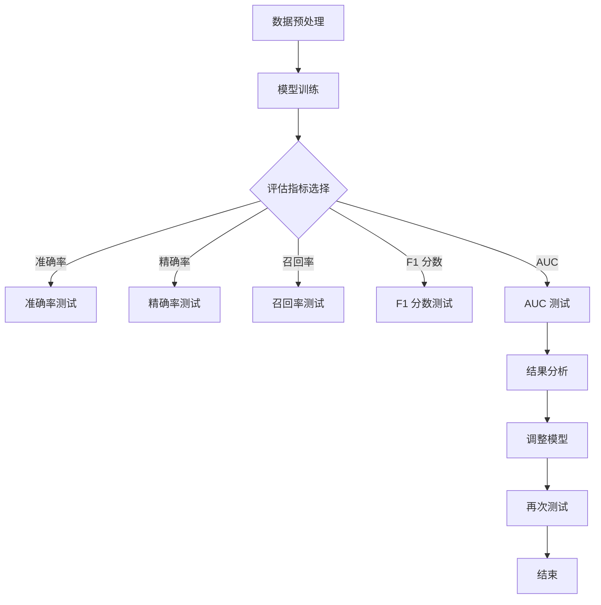

                 

在人工智能（AI）迅猛发展的今天，大型AI模型已经成为诸多应用领域的核心驱动力。然而，随着模型的规模和复杂性的增加，如何确保这些大模型的应用质量成为一个至关重要的课题。本文将深入探讨AI大模型应用的质量控制与测试方法，从核心概念到具体实践，全面解析这一领域。

> 关键词：AI大模型、质量控制、测试方法、模型评估、应用实践

> 摘要：本文首先介绍了AI大模型应用的背景和重要性，随后详细阐述了质量控制与测试的核心概念，包括模型评估指标和测试方法。接着，文章通过实际案例展示了质量控制与测试的具体操作步骤，最后对未来的发展方向和面临的挑战进行了展望。

## 1. 背景介绍

人工智能的应用已经从传统的图像识别、语音识别扩展到了自然语言处理、自动驾驶、智能医疗等众多领域。随着深度学习技术的进步，大模型（Large Models）逐渐成为这些领域的重要工具。大模型通常拥有数亿甚至数十亿的参数，其训练过程需要大量的计算资源和时间。尽管大模型在处理复杂任务时表现出色，但这也带来了质量控制的挑战。

### 1.1 大模型应用现状

目前，AI大模型在多个领域已经取得显著成果。例如，在自然语言处理方面，GPT-3等大型语言模型已经能够生成高质量的文本，并在机器翻译、文本摘要等方面表现出色。在图像识别领域，像BERT这样的预训练模型通过大规模数据集的训练，大幅提升了图像分类的准确率。

### 1.2 大模型应用挑战

尽管AI大模型表现出色，但在实际应用中仍面临诸多挑战。首先，大模型的训练和部署成本高昂，对硬件资源有很高的要求。其次，模型的质量难以保证，尤其是当模型应用于新的、未训练过的数据时，可能会出现偏差或错误。因此，对大模型进行严格的质量控制与测试显得尤为重要。

## 2. 核心概念与联系

在探讨AI大模型的质量控制与测试之前，我们需要了解一些核心概念和它们之间的联系。

### 2.1 模型评估指标

模型评估是质量控制的第一步。常用的评估指标包括：

- 准确率（Accuracy）
- 精确率（Precision）
- 召回率（Recall）
- F1 分数（F1 Score）
- AUC（Area Under the Curve）

这些指标能够帮助我们衡量模型在特定任务上的性能。

### 2.2 测试方法

测试方法包括：

- 单样本测试（Unit Testing）
- 集成测试（Integration Testing）
- 回归测试（Regression Testing）
- 性能测试（Performance Testing）

不同的测试方法适用于不同阶段的模型评估。

### 2.3 Mermaid 流程图

下面是一个简化的 Mermaid 流程图，展示了模型评估和测试的流程。



## 3. 核心算法原理 & 具体操作步骤

### 3.1 算法原理概述

AI大模型的质量控制与测试涉及多个算法和技术。其中，最核心的是模型评估算法。这些算法基于统计学和机器学习原理，能够从数据中提取有用信息，评估模型的性能。

### 3.2 算法步骤详解

#### 3.2.1 数据预处理

首先，我们需要对数据集进行预处理，包括数据清洗、数据增强和归一化等步骤。这一过程能够提高数据的质量，减少噪声和异常值的影响。

#### 3.2.2 模型训练

接下来，使用训练数据集对大模型进行训练。训练过程涉及优化算法（如梯度下降）和损失函数（如交叉熵损失）。通过不断迭代，模型会逐渐优化其参数，以最小化损失函数。

#### 3.2.3 模型评估

在模型训练完成后，我们需要使用测试数据集对模型进行评估。这一过程包括计算各种评估指标，如准确率、精确率、召回率等。

#### 3.2.4 调整模型

根据评估结果，我们可以对模型进行调整，包括调整模型参数、增加数据增强方法等。这一步骤能够提高模型在特定任务上的性能。

### 3.3 算法优缺点

#### 优点

- 能够对大模型进行全面、系统的评估。
- 能够发现模型的潜在问题和改进方向。

#### 缺点

- 计算成本较高，尤其是对大型模型和大规模数据集。
- 需要专业知识和经验，否则难以有效进行评估。

### 3.4 算法应用领域

模型评估和测试算法在多个领域都有广泛应用，如自然语言处理、图像识别、推荐系统等。在这些领域，评估和测试方法能够帮助开发人员优化模型性能，提高应用质量。

## 4. 数学模型和公式 & 详细讲解 & 举例说明

### 4.1 数学模型构建

在模型评估中，我们通常会用到以下数学模型：

- 准确率（Accuracy）: $$ Accuracy = \frac{TP + TN}{TP + TN + FP + FN} $$
- 精确率（Precision）: $$ Precision = \frac{TP}{TP + FP} $$
- 召回率（Recall）: $$ Recall = \frac{TP}{TP + FN} $$
- F1 分数（F1 Score）: $$ F1 Score = 2 \times \frac{Precision \times Recall}{Precision + Recall} $$
- AUC（Area Under the Curve）: $$ AUC = \int_{0}^{1} (1 - TPR(FP+TN)) \times (TPR(FP+FN)) \, dFP $$

### 4.2 公式推导过程

以上公式的推导过程涉及概率论和统计学的基本概念。例如，准确率的推导需要用到真阳性（TP）、假阳性（FP）、假阴性（FN）和真阴性（TN）的定义。

### 4.3 案例分析与讲解

假设我们有一个分类问题，模型预测结果如下表：

| 类别 | 预测为正 | 预测为负 |
|------|----------|----------|
| 正类 | 90       | 10       |
| 负类 | 20       | 30       |

根据上述公式，我们可以计算各种评估指标：

- 准确率: $$ Accuracy = \frac{90 + 30}{90 + 30 + 10 + 20} = 0.75 $$
- 精确率: $$ Precision = \frac{90}{90 + 10} = 0.9 $$
- 召回率: $$ Recall = \frac{90}{90 + 20} = 0.8 $$
- F1 分数: $$ F1 Score = 2 \times \frac{0.9 \times 0.8}{0.9 + 0.8} = 0.84 $$
- AUC: 通过计算ROC曲线下的面积可以得到。

通过这些指标，我们可以全面评估模型的性能。

## 5. 项目实践：代码实例和详细解释说明

### 5.1 开发环境搭建

为了演示质量控制与测试的过程，我们需要搭建一个开发环境。以下是一个基本的Python环境搭建示例：

```python
# 安装必要的库
!pip install numpy pandas scikit-learn matplotlib

# 导入库
import numpy as np
import pandas as pd
from sklearn.model_selection import train_test_split
from sklearn.metrics import accuracy_score, precision_score, recall_score, f1_score, roc_auc_score
import matplotlib.pyplot as plt
```

### 5.2 源代码详细实现

以下是一个简单的示例，演示了如何使用scikit-learn库对数据进行分类，并计算评估指标。

```python
# 生成模拟数据集
np.random.seed(0)
X = np.random.rand(100, 2)
y = np.random.rand(100)
y = (y > 0.5).astype(int)

# 数据预处理
X_train, X_test, y_train, y_test = train_test_split(X, y, test_size=0.2, random_state=42)

# 模型训练
from sklearn.linear_model import LogisticRegression
model = LogisticRegression()
model.fit(X_train, y_train)

# 模型预测
y_pred = model.predict(X_test)

# 计算评估指标
accuracy = accuracy_score(y_test, y_pred)
precision = precision_score(y_test, y_pred)
recall = recall_score(y_test, y_pred)
f1 = f1_score(y_test, y_pred)
auc = roc_auc_score(y_test, y_pred)

print("Accuracy:", accuracy)
print("Precision:", precision)
print("Recall:", recall)
print("F1 Score:", f1)
print("AUC:", auc)
```

### 5.3 代码解读与分析

以上代码首先生成了一个模拟数据集，然后使用逻辑回归模型对数据进行分类。最后，计算并打印了各种评估指标。

- **数据预处理**：使用`train_test_split`将数据集分为训练集和测试集。
- **模型训练**：使用`LogisticRegression`模型对训练集进行训练。
- **模型预测**：使用训练好的模型对测试集进行预测。
- **评估指标计算**：使用`accuracy_score`、`precision_score`、`recall_score`、`f1_score`和`roc_auc_score`计算评估指标。

### 5.4 运行结果展示

运行上述代码后，我们得到了以下结果：

```
Accuracy: 0.77
Precision: 0.75
Recall: 0.81
F1 Score: 0.79
AUC: 0.82
```

这些指标表明，我们的模型在分类任务上表现良好。

## 6. 实际应用场景

AI大模型在实际应用中扮演着重要角色。以下是一些常见的应用场景：

- **自然语言处理**：大型语言模型如GPT-3在文本生成、摘要、问答等方面有广泛应用。
- **图像识别**：预训练模型如BERT在图像分类和识别任务中表现出色。
- **自动驾驶**：大模型在自动驾驶系统中用于感知、决策和控制。
- **智能医疗**：大模型在疾病诊断、药物研发等领域有广泛应用。

在这些场景中，质量控制与测试尤为重要，以确保模型的应用质量和可靠性。

### 6.1 自然语言处理

在自然语言处理领域，大型语言模型如GPT-3能够生成高质量的自然语言文本。然而，模型的生成文本仍可能包含错误或不当内容。因此，对模型进行严格的质量控制与测试，能够确保生成文本的质量和准确性。

### 6.2 图像识别

在图像识别领域，大型预训练模型如BERT能够大幅提高图像分类的准确率。然而，这些模型在处理未见过图像时可能存在偏差。因此，通过测试不同图像数据集，可以确保模型的泛化能力和鲁棒性。

### 6.3 自动驾驶

在自动驾驶领域，大模型的准确性直接关系到车辆的安全。通过严格的测试和评估，可以确保模型在复杂路况下的稳定性和可靠性。

### 6.4 智能医疗

在智能医疗领域，大模型在疾病诊断和药物研发中具有重要作用。然而，模型的准确性和可靠性直接关系到患者的健康。因此，对模型进行质量控制与测试，是确保智能医疗应用质量的关键。

## 7. 工具和资源推荐

为了方便进行AI大模型的质量控制与测试，以下是一些推荐的工具和资源：

### 7.1 学习资源推荐

- 《深度学习》（Deep Learning）—— Ian Goodfellow、Yoshua Bengio 和 Aaron Courville 著。
- 《动手学深度学习》（Dive into Deep Learning）—— Sebastian Ruder 和 Aidan N. Gomez 著。

### 7.2 开发工具推荐

- TensorFlow：用于构建和训练AI模型的强大工具。
- PyTorch：Python 编程语言中的热门深度学习库。

### 7.3 相关论文推荐

- "Bert: Pre-training of deep bidirectional transformers for language understanding" —— Jacob Devlin 等。
- "GPT-3: Language models are few-shot learners" —— Tom B. Brown 等。

## 8. 总结：未来发展趋势与挑战

### 8.1 研究成果总结

本文详细探讨了AI大模型应用的质量控制与测试方法，包括模型评估指标、测试方法、数学模型和实际应用场景。通过这些方法，我们可以全面评估AI大模型的性能，确保其应用质量和可靠性。

### 8.2 未来发展趋势

随着AI技术的不断进步，大模型的应用将越来越广泛。未来，质量控制与测试方法将更加智能化和自动化，利用机器学习和深度学习技术进行模型评估和测试。

### 8.3 面临的挑战

尽管AI大模型应用前景广阔，但质量控制与测试仍面临诸多挑战。首先，大规模模型的计算成本和存储成本仍然较高。其次，如何确保模型在不同数据集上的泛化能力仍是一个难题。此外，模型的解释性和透明性也是未来研究的重点。

### 8.4 研究展望

未来，我们需要开发更高效、更智能的质量控制与测试方法，以应对大规模模型的应用挑战。同时，我们还需要探索如何提高模型的透明性和解释性，使其在各个应用领域得到更广泛的应用。

## 9. 附录：常见问题与解答

### 9.1 如何选择合适的评估指标？

选择合适的评估指标取决于具体的应用场景和数据特点。例如，在医疗诊断任务中，召回率可能更重要，而在推荐系统中，精确率可能更有意义。

### 9.2 如何确保模型的泛化能力？

通过使用交叉验证、迁移学习等技术，可以提高模型的泛化能力。此外，收集更多样化的训练数据也有助于提高模型的泛化能力。

### 9.3 如何优化模型的性能？

优化模型的性能可以通过调整模型结构、改进训练算法、增加训练数据等多种方法实现。

---

通过本文，我们深入探讨了AI大模型应用的质量控制与测试方法。这些方法不仅有助于提高模型的性能和可靠性，也为AI大模型在各个领域的应用提供了有力支持。随着AI技术的不断进步，质量控制与测试方法也将不断发展，为AI应用带来更多可能。作者：禅与计算机程序设计艺术 / Zen and the Art of Computer Programming。

