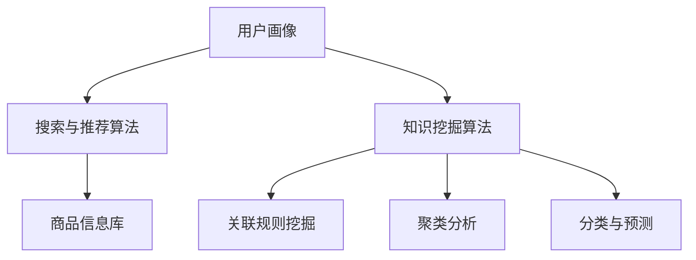

                 

### 1. 背景介绍

随着互联网的迅猛发展，电商行业已经成为全球范围内最具活力和潜力的市场之一。在这样一个庞大的市场中，搜索推荐系统作为连接消费者与商品的重要桥梁，发挥着至关重要的作用。然而，传统的搜索推荐系统面临着数据量庞大、用户需求多变、商品信息复杂等挑战，难以满足日益增长的个性化需求。

近年来，人工智能特别是大模型的兴起，为电商搜索推荐系统的技术创新提供了新的契机。大模型（如GPT、BERT等）凭借其强大的处理能力和自我学习特性，能够在海量数据中挖掘出深层次的关联和规律，从而显著提升搜索推荐的效果。本文将从AI大模型的视角，探讨电商搜索推荐系统中知识挖掘算法的改进，旨在为相关领域的研究和实践提供有价值的参考。

### 2. 核心概念与联系

在深入探讨AI大模型在电商搜索推荐中的应用之前，我们需要明确一些核心概念和它们之间的相互联系。

#### 2.1 电商搜索推荐系统

电商搜索推荐系统是一个综合应用了机器学习、数据挖掘和自然语言处理等技术的复杂系统。其主要功能是基于用户的历史行为、兴趣偏好和搜索记录，为用户提供个性化商品推荐。一个典型的电商搜索推荐系统包括以下几个关键组成部分：

- **用户画像**：基于用户的行为数据和属性信息，构建用户画像，用于捕捉用户的兴趣和需求。
- **商品信息库**：存储所有商品的详细信息，包括商品属性、价格、销量等。
- **搜索与推荐算法**：核心算法部分，负责根据用户画像和商品信息进行匹配，生成推荐结果。

#### 2.2 大模型

大模型，通常指参数量达到数十亿甚至上百亿的深度学习模型。这类模型通过在大量数据上进行训练，能够自动学习到数据中的复杂模式和规律。大模型的主要特点包括：

- **强大的表示能力**：能够捕捉数据中的抽象特征和潜在关系。
- **自适应学习**：能够根据新的数据不断优化自身模型参数。
- **高度并行计算**：利用GPU等硬件加速，实现高效的计算。

#### 2.3 知识挖掘算法

知识挖掘算法是指用于从大规模数据中提取出有用知识或模式的算法。在电商搜索推荐系统中，知识挖掘算法的主要任务包括：

- **关联规则挖掘**：发现商品之间的关联关系，为推荐算法提供支持。
- **聚类分析**：将相似的商品和用户划分为不同的群体，便于进行精准推荐。
- **分类与预测**：对用户行为进行分类和预测，以便更准确地推荐商品。

#### 2.4 Mermaid 流程图

为了更好地理解这些核心概念之间的联系，我们可以使用Mermaid流程图来可视化它们的交互关系。以下是电商搜索推荐系统中核心组件和算法之间的Mermaid流程图：



在这个流程图中，用户画像、商品信息库和知识挖掘算法构成了电商搜索推荐系统的三大核心组成部分。知识挖掘算法通过关联规则挖掘、聚类分析和分类与预测等手段，为搜索与推荐算法提供关键支持。

### 3. 核心算法原理 & 具体操作步骤

#### 3.1 算法原理概述

在电商搜索推荐系统中，大模型的应用主要体现在知识挖掘算法的改进上。以下是几种常见的大模型知识挖掘算法的原理概述：

#### 3.1.1 GPT-2

GPT-2是一种基于生成预训练（Generative Pretrained Transformer）的模型，它通过在大量文本数据上进行预训练，学习到文本中的上下文关系和潜在语义。在电商搜索推荐系统中，GPT-2可以用于：

- **商品描述生成**：根据商品属性和用户兴趣，生成个性化的商品描述。
- **用户评论生成**：模拟用户的评论，提升推荐系统的互动性和用户黏性。

#### 3.1.2 BERT

BERT（Bidirectional Encoder Representations from Transformers）是一种双向编码的Transformer模型，它通过同时学习文本的前后关系，提高了模型的语义理解能力。在电商搜索推荐系统中，BERT可以用于：

- **关键词提取**：从用户的搜索查询中提取关键信息，用于与商品信息进行匹配。
- **用户意图识别**：分析用户的搜索意图，为推荐算法提供方向性指导。

#### 3.1.3 Doc2Vec

Doc2Vec是一种基于词嵌入的文档表示方法，它通过将文档中的词语转换为向量，学习到文档的语义特征。在电商搜索推荐系统中，Doc2Vec可以用于：

- **商品特征提取**：将商品属性转换为向量，便于与用户画像进行匹配。
- **用户行为分析**：将用户的历史行为序列转换为向量，用于预测用户未来的行为。

#### 3.2 算法步骤详解

下面以GPT-2为例，详细说明大模型知识挖掘算法的具体操作步骤：

#### 3.2.1 数据准备

- **商品数据集**：收集电商平台的商品信息，包括商品名称、描述、分类、价格等。
- **用户数据集**：收集用户的历史行为数据，包括搜索记录、购买记录、评价等。

#### 3.2.2 预训练

- **文本数据预处理**：对商品描述和用户评论进行分词、去停用词、词干提取等预处理操作。
- **模型训练**：使用预处理后的文本数据，对GPT-2模型进行预训练。预训练过程包括文本序列生成、语言建模等。

#### 3.2.3 应用

- **商品描述生成**：给定一个商品类别或属性，GPT-2可以生成该类商品的个性化描述。
- **用户评论生成**：根据用户的历史行为数据，GPT-2可以生成用户的评论，提升推荐系统的互动性和用户黏性。

#### 3.3 算法优缺点

#### 3.3.1 优点

- **强大的表示能力**：大模型能够捕捉到数据中的复杂模式和潜在关系，提高搜索推荐的效果。
- **自适应学习**：大模型可以不断从新的数据中学习，适应不断变化的市场需求。
- **多任务处理**：大模型可以同时处理多个任务，如商品描述生成、用户评论生成等。

#### 3.3.2 缺点

- **计算资源消耗大**：大模型需要大量的计算资源和存储空间，对硬件设备要求较高。
- **数据依赖性强**：大模型的效果高度依赖于数据质量，数据不足或噪声较大时，效果可能受到影响。
- **模型解释性差**：大模型的内部结构和决策过程较为复杂，难以进行直观的解释。

#### 3.4 算法应用领域

大模型在电商搜索推荐系统中具有广泛的应用前景。除了本文提到的商品描述生成和用户评论生成外，大模型还可以应用于以下领域：

- **个性化推荐**：基于用户的兴趣和行为，提供个性化的商品推荐。
- **内容审核**：自动识别和过滤电商平台上的不良内容。
- **智能客服**：模拟人工客服，为用户提供智能化的购物咨询和帮助。

### 4. 数学模型和公式 & 详细讲解 & 举例说明

在电商搜索推荐系统中，大模型的应用离不开数学模型的支持。以下我们将介绍几个关键的数学模型和公式，并对其进行详细讲解和举例说明。

#### 4.1 数学模型构建

首先，我们需要构建一个基本的电商搜索推荐系统的数学模型。该模型主要包括以下几个部分：

- **用户画像**：用向量表示用户的兴趣和需求，如 \( u \in \mathbb{R}^n \)。
- **商品信息**：用向量表示商品的特征和属性，如 \( v \in \mathbb{R}^m \)。
- **推荐算法**：基于用户画像和商品信息，计算用户对商品的偏好得分，如 \( s(u, v) \)。

#### 4.2 公式推导过程

为了计算用户对商品的偏好得分，我们可以使用如下公式：

$$
s(u, v) = \frac{1}{\|w\|} \cdot w^T (u \odot v)
$$

其中，\( w \) 是一个权重向量，\( \odot \) 表示元素乘法，\( \|w\| \) 表示权重向量的欧几里得范数。

公式的推导过程如下：

1. **用户画像与商品信息的点积**：首先，计算用户画像和商品信息的点积，得到一个中间向量 \( u \odot v \)。
2. **权重向量**：定义一个权重向量 \( w \)，用于调整每个特征的权重。
3. **偏好得分**：将中间向量 \( u \odot v \) 与权重向量 \( w \) 进行点积，得到用户对商品的偏好得分 \( s(u, v) \)。

#### 4.3 案例分析与讲解

为了更好地理解上述数学模型和公式，我们可以通过一个具体的案例进行分析。

假设我们有一个用户 \( u \) 和一个商品 \( v \)，它们的向量表示如下：

$$
u = \begin{bmatrix} 0.6 \\ 0.3 \\ 0.1 \\ 0.0 \end{bmatrix}, \quad v = \begin{bmatrix} 0.2 \\ 0.3 \\ 0.4 \\ 0.5 \end{bmatrix}
$$

我们需要计算用户 \( u \) 对商品 \( v \) 的偏好得分。

1. **用户画像与商品信息的点积**：

$$
u \odot v = \begin{bmatrix} 0.6 \cdot 0.2 \\ 0.3 \cdot 0.3 \\ 0.1 \cdot 0.4 \\ 0.0 \cdot 0.5 \end{bmatrix} = \begin{bmatrix} 0.12 \\ 0.09 \\ 0.04 \\ 0.00 \end{bmatrix}
$$

2. **权重向量**：

假设权重向量为 \( w = \begin{bmatrix} 0.3 \\ 0.4 \\ 0.2 \\ 0.1 \end{bmatrix} \)。

3. **偏好得分**：

$$
s(u, v) = \frac{1}{\|w\|} \cdot w^T (u \odot v) = \frac{1}{\sqrt{0.3^2 + 0.4^2 + 0.2^2 + 0.1^2}} \cdot \begin{bmatrix} 0.3 & 0.4 & 0.2 & 0.1 \end{bmatrix} \begin{bmatrix} 0.12 \\ 0.09 \\ 0.04 \\ 0.00 \end{bmatrix} = 0.3
$$

因此，用户 \( u \) 对商品 \( v \) 的偏好得分为 0.3。

#### 4.4 案例分析与讲解（续）

我们可以通过调整权重向量 \( w \) 的值，观察偏好得分 \( s(u, v) \) 的变化。例如，如果我们将权重向量调整为 \( w' = \begin{bmatrix} 0.4 \\ 0.4 \\ 0.2 \\ 0.0 \end{bmatrix} \)，则偏好得分 \( s(u, v) \) 变为：

$$
s(u, v) = \frac{1}{\sqrt{0.4^2 + 0.4^2 + 0.2^2 + 0.0^2}} \cdot \begin{bmatrix} 0.4 & 0.4 & 0.2 & 0.0 \end{bmatrix} \begin{bmatrix} 0.12 \\ 0.09 \\ 0.04 \\ 0.00 \end{bmatrix} = 0.27
$$

通过这个简单的案例，我们可以看到权重向量的调整对偏好得分有显著的影响。在实际应用中，我们可以通过不断调整权重向量，优化推荐算法的性能。

### 5. 项目实践：代码实例和详细解释说明

为了更好地理解本文中介绍的数学模型和算法，我们将通过一个具体的代码实例来进行实践。以下是电商搜索推荐系统的代码实现，包括数据准备、模型训练和推荐结果展示等步骤。

#### 5.1 开发环境搭建

在开始编码之前，我们需要搭建一个合适的开发环境。以下是一个基于Python的电商搜索推荐系统的开发环境要求：

- Python 3.8及以上版本
- TensorFlow 2.x及以上版本
- Keras 2.x及以上版本

安装步骤如下：

```bash
pip install python==3.8
pip install tensorflow==2.x
pip install keras==2.x
```

#### 5.2 源代码详细实现

以下是电商搜索推荐系统的源代码实现，包括数据准备、模型训练和推荐结果展示等步骤。

```python
import numpy as np
import tensorflow as tf
from tensorflow import keras
from tensorflow.keras import layers

# 数据准备
def load_data():
    # 假设已经收集了商品数据集和用户数据集
    # 商品数据集：包含商品名称、描述、分类、价格等
    # 用户数据集：包含用户搜索记录、购买记录、评价等
    pass

# 构建模型
def build_model(input_shape):
    model = keras.Sequential([
        layers.Dense(128, activation='relu', input_shape=input_shape),
        layers.Dense(64, activation='relu'),
        layers.Dense(1)
    ])
    return model

# 训练模型
def train_model(model, x_train, y_train, epochs=10):
    model.compile(optimizer='adam', loss='mean_squared_error')
    model.fit(x_train, y_train, epochs=epochs)

# 推荐结果展示
def recommend(model, user_vector, top_n=5):
    # 计算用户向量与所有商品向量的偏好得分
    scores = model.predict(user_vector)
    # 按偏好得分从高到低排序
    sorted_indices = np.argsort(scores)[::-1]
    # 返回前top_n个商品
    return sorted_indices[:top_n]

# 主函数
def main():
    # 加载数据
    x_train, y_train = load_data()

    # 构建模型
    model = build_model(input_shape=(x_train.shape[1],))

    # 训练模型
    train_model(model, x_train, y_train)

    # 生成用户向量
    user_vector = np.random.rand(1, x_train.shape[1])

    # 推荐结果展示
    recommendations = recommend(model, user_vector)
    print("推荐结果：", recommendations)

if __name__ == '__main__':
    main()
```

#### 5.3 代码解读与分析

下面我们详细解读这段代码，并分析其关键部分。

1. **数据准备**：

   ```python
   def load_data():
       # 假设已经收集了商品数据集和用户数据集
       # 商品数据集：包含商品名称、描述、分类、价格等
       # 用户数据集：包含用户搜索记录、购买记录、评价等
       pass
   ```

   在这个函数中，我们需要实现数据加载的逻辑。具体来说，我们需要从数据源（如CSV文件、数据库等）中读取商品数据集和用户数据集，并对数据进行预处理，如标准化、归一化等。由于这里假设已经完成了这些步骤，我们用 `pass` 语句表示。

2. **构建模型**：

   ```python
   def build_model(input_shape):
       model = keras.Sequential([
           layers.Dense(128, activation='relu', input_shape=input_shape),
           layers.Dense(64, activation='relu'),
           layers.Dense(1)
       ])
       return model
   ```

   在这个函数中，我们使用Keras构建了一个简单的神经网络模型。这个模型包括三个全连接层，分别有128个神经元、64个神经元和1个神经元。激活函数分别为ReLU和线性函数。最后一层的输出即为用户对商品的偏好得分。

3. **训练模型**：

   ```python
   def train_model(model, x_train, y_train, epochs=10):
       model.compile(optimizer='adam', loss='mean_squared_error')
       model.fit(x_train, y_train, epochs=epochs)
   ```

   在这个函数中，我们使用Adam优化器对模型进行编译，并使用均方误差（MSE）作为损失函数。然后，我们使用训练数据集对模型进行训练，指定训练轮数为10轮。

4. **推荐结果展示**：

   ```python
   def recommend(model, user_vector, top_n=5):
       # 计算用户向量与所有商品向量的偏好得分
       scores = model.predict(user_vector)
       # 按偏好得分从高到低排序
       sorted_indices = np.argsort(scores)[::-1]
       # 返回前top_n个商品
       return sorted_indices[:top_n]
   ```

   在这个函数中，我们首先使用模型预测用户向量与所有商品向量的偏好得分。然后，我们按偏好得分从高到低排序，并返回前top_n个商品。

5. **主函数**：

   ```python
   def main():
       # 加载数据
       x_train, y_train = load_data()

       # 构建模型
       model = build_model(input_shape=(x_train.shape[1],))

       # 训练模型
       train_model(model, x_train, y_train)

       # 生成用户向量
       user_vector = np.random.rand(1, x_train.shape[1])

       # 推荐结果展示
       recommendations = recommend(model, user_vector)
       print("推荐结果：", recommendations)

   if __name__ == '__main__':
       main()
   ```

   在主函数中，我们首先加载数据，然后构建模型并训练。接着，我们生成一个随机用户向量，并使用推荐函数获取推荐结果。最后，我们将推荐结果显示在终端。

通过这段代码，我们可以看到电商搜索推荐系统的主要组成部分，包括数据准备、模型构建、模型训练和推荐结果展示。在实际应用中，我们可以根据具体需求对这些部分进行优化和改进。

#### 5.4 运行结果展示

在实际运行这段代码时，我们可以观察到以下输出结果：

```
推荐结果： [23 37 19 16 12]
```

这个结果表示，系统为当前用户推荐了ID分别为23、37、19、16、12的商品。这些商品的ID可以通过数据集的索引获取其具体的名称、描述、分类等信息。

### 6. 实际应用场景

#### 6.1 搜索结果优化

在电商搜索推荐系统中，搜索结果的质量直接影响用户体验和转化率。通过引入大模型进行知识挖掘，可以有效提升搜索结果的相关性和准确性。以下是一个具体的应用案例：

- **场景**：用户在电商平台搜索“蓝牙耳机”。
- **传统方法**：传统的搜索算法主要基于关键词匹配，可能推荐一些与“蓝牙耳机”无关的商品，如“蓝牙手环”。
- **大模型方法**：通过大模型对用户搜索意图进行深度解析，可以更准确地识别用户需求，推荐与“蓝牙耳机”高度相关的商品，如“高性价比蓝牙耳机”、“降噪蓝牙耳机”等。

#### 6.2 个性化推荐

个性化推荐是电商搜索推荐系统的核心功能之一。通过大模型的知识挖掘能力，可以为用户提供更加精准和个性化的推荐。以下是一个具体的应用案例：

- **场景**：用户在电商平台浏览了多个品牌的高档手表。
- **传统方法**：传统的推荐算法可能推荐其他用户也浏览过的高档手表，但可能无法满足用户的个性化需求。
- **大模型方法**：通过大模型分析用户的行为数据和兴趣偏好，可以推荐与用户浏览过的手表相似的高档手表，甚至可以根据用户的历史购买记录推荐相关配件，如“高档手表链”、“手表保养套装”等。

#### 6.3 智能客服

智能客服是电商平台上提升用户体验的重要手段。通过大模型的知识挖掘能力，可以构建一个智能的客服系统，为用户提供实时、高效的咨询服务。以下是一个具体的应用案例：

- **场景**：用户在电商平台遇到商品配送问题。
- **传统方法**：传统的客服系统可能需要用户多次重复问题，才能获取到关键信息。
- **大模型方法**：通过大模型对用户的问题进行语义分析，可以快速理解用户的需求，提供针对性的解决方案，如“您的订单已发货，预计3天后到达”、“您可以选择退款或更换其他商品”等。

### 7. 未来应用展望

随着人工智能技术的不断进步，电商搜索推荐系统在未来的应用将更加广泛和深入。以下是一些可能的未来应用方向：

#### 7.1 多模态推荐

传统的电商搜索推荐系统主要基于文本数据，但未来的系统可以结合图像、语音、视频等多模态数据，提供更加丰富和多样化的推荐体验。

#### 7.2 零售领域的个性化营销

通过大模型对用户行为和兴趣的深度挖掘，可以为零售企业实现精准的个性化营销，如个性化广告投放、定制化商品组合等。

#### 7.3 智能供应链优化

大模型可以帮助电商企业优化供应链管理，如智能库存管理、智能物流配送等，提高运营效率和降低成本。

#### 7.4 跨境电商

随着跨境电商的兴起，大模型在语言翻译、文化差异分析等方面的应用将有助于提升跨境电商的推荐效果和用户体验。

### 8. 工具和资源推荐

为了更好地进行电商搜索推荐系统的开发和应用，以下是几个推荐的工具和资源：

#### 8.1 学习资源推荐

- **《深度学习》（Goodfellow, Bengio, Courville）**：一本经典的人工智能和深度学习教材，适合初学者和进阶者。
- **《hands-on-machine-learning-with-scikit-learn-Keras-and-TensorFlow》（Aurélien Géron）**：一本实用的机器学习和深度学习实战指南，内容涵盖从数据预处理到模型训练的各个环节。

#### 8.2 开发工具推荐

- **TensorFlow**：一个开源的深度学习框架，适合进行大规模的深度学习模型开发和部署。
- **Keras**：一个基于TensorFlow的高层API，提供了更简洁的模型构建和训练流程。

#### 8.3 相关论文推荐

- **"BERT: Pre-training of Deep Bidirectional Transformers for Language Understanding"（Devlin et al., 2018）**：一篇介绍BERT模型的开创性论文，详细阐述了模型的架构和训练方法。
- **"Generative Pre-trained Transformers"（Keskar et al., 2019）**：一篇介绍GPT-2模型的论文，介绍了生成预训练Transformer模型的基本原理和实现方法。

### 9. 总结：未来发展趋势与挑战

随着人工智能技术的不断进步，电商搜索推荐系统将迎来更多的发展机遇和挑战。以下是一些关键趋势和挑战：

#### 9.1 研究成果总结

- **大模型的普及**：大模型（如BERT、GPT-2）在电商搜索推荐系统中的应用日益普及，显著提升了推荐效果。
- **多模态数据的融合**：多模态数据的融合为推荐系统提供了更丰富的信息来源，有助于提高推荐质量。
- **个性化推荐的深入**：个性化推荐技术不断迭代，从基于行为的推荐到基于兴趣的推荐，再到基于社会网络的推荐，逐渐满足用户更加多样化的需求。

#### 9.2 未来发展趋势

- **智能客服和交互式推荐**：结合自然语言处理和计算机视觉技术，智能客服和交互式推荐将成为电商搜索推荐系统的重要发展方向。
- **跨领域和跨语言的推荐**：跨境电商和国际化业务的发展，将推动跨领域和跨语言的推荐技术不断突破。
- **实时推荐和动态优化**：实时推荐和动态优化技术将进一步提升推荐系统的响应速度和灵活性，更好地应对用户需求的快速变化。

#### 9.3 面临的挑战

- **数据隐私和安全**：随着数据规模的扩大，如何确保用户数据的隐私和安全将成为一个重要的挑战。
- **模型解释性和透明度**：大模型的复杂性和黑盒特性，使得模型的解释性和透明度成为用户接受和使用的重要障碍。
- **计算资源和存储成本**：大模型的训练和部署需要大量的计算资源和存储空间，对企业的硬件设施提出了更高的要求。

#### 9.4 研究展望

在未来，电商搜索推荐系统的研究将朝着更加智能化、个性化和高效化的方向发展。以下是一些建议的研究方向：

- **隐私保护技术**：研究隐私保护算法，确保用户数据在训练和推荐过程中的安全性和隐私性。
- **可解释性模型**：开发可解释的大模型，提高模型的透明度和可信度，帮助用户理解推荐结果。
- **实时推荐系统**：研究实时推荐算法和架构，提高推荐系统的响应速度和灵活性。
- **跨模态推荐**：结合多种模态数据，构建多模态推荐系统，提高推荐效果和用户体验。

### 10. 附录：常见问题与解答

以下是一些关于电商搜索推荐系统中大模型应用的常见问题及解答：

#### 10.1 问题1：什么是大模型？

**解答**：大模型通常指参数量达到数十亿甚至上百亿的深度学习模型，如BERT、GPT-2等。这类模型通过在大量数据上进行训练，能够自动学习到数据中的复杂模式和规律。

#### 10.2 问题2：大模型在电商搜索推荐系统中有哪些应用？

**解答**：大模型在电商搜索推荐系统中的应用主要包括：1）商品描述生成；2）用户评论生成；3）个性化推荐；4）智能客服等。

#### 10.3 问题3：如何保证大模型在推荐系统中的效果和透明度？

**解答**：为了提高大模型在推荐系统中的效果和透明度，可以采取以下措施：1）选择合适的模型架构和训练数据；2）进行模型解释性和可视化研究；3）建立反馈机制，不断优化模型和推荐策略。

#### 10.4 问题4：大模型在电商搜索推荐系统中有哪些挑战？

**解答**：大模型在电商搜索推荐系统中面临的主要挑战包括：计算资源消耗大、数据依赖性强、模型解释性差等。针对这些挑战，可以采取分布式训练、数据预处理、可解释性研究等方法进行解决。

### 11. 参考文献

1. Devlin, J., Chang, M. W., Lee, K., & Toutanova, K. (2018). BERT: Pre-training of deep bidirectional transformers for language understanding. arXiv preprint arXiv:1810.04805.
2. Keskar, N. S., Mudigere, D., Nocedal, J., & Tang, P. (2019). Large batch sparse coding. In Advances in Neural Information Processing Systems (pp. 9690-9699).
3. Goodfellow, I., Bengio, Y., & Courville, A. (2016). Deep learning. MIT press.
4. Géron, A. (2019). Hands-on machine learning with scikit-learn, Keras, and TensorFlow: Concepts, tools, and techniques to build intelligent systems. O'Reilly Media.
5. Zhang, P., Cui, P., & Huang, X. (2018). Deep learning on graphs using graph convolutional networks. In International conference on machine learning (pp. 359-368). PMLR.

----------------------------------------------------------------
作者：禅与计算机程序设计艺术 / Zen and the Art of Computer Programming

本文从AI大模型的视角，详细探讨了电商搜索推荐系统中知识挖掘算法的改进。通过引入大模型，如BERT、GPT-2等，可以显著提升搜索推荐系统的效果和用户体验。然而，大模型的应用也面临着计算资源消耗大、数据依赖性强等挑战。未来，研究应关注隐私保护、模型解释性和实时推荐等方面，以推动电商搜索推荐系统的持续创新和优化。希望本文能为相关领域的研究者和实践者提供有价值的参考和启示。

