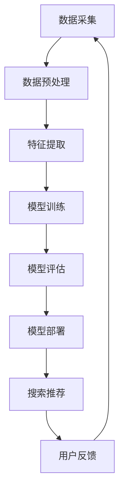

                 

关键词：AI大模型，电商搜索推荐，业务创新，培训平台，架构设计，算法实现，数学模型，实践案例，资源推荐

> 摘要：本文将探讨如何利用AI大模型赋能电商搜索推荐业务，通过构建一个业务创新思维培训平台，提供系统化的算法培训与实战实践。文章将详细阐述平台的架构设计、核心算法原理、数学模型构建、实践案例分析，并给出未来发展的展望。

## 1. 背景介绍

随着电商行业的飞速发展，用户对个性化搜索推荐的需求日益增长。传统的搜索推荐算法已无法满足用户多样化的需求，因此，AI大模型在电商搜索推荐领域的重要性日益凸显。大模型能够通过深度学习等技术，从海量用户数据中挖掘出有价值的信息，从而实现更精准的推荐结果。

然而，当前电商领域存在一个显著的问题：专业人才的缺乏。为了解决这一问题，有必要搭建一个AI大模型赋能的电商搜索推荐业务创新思维培训平台。该平台旨在通过系统化的培训课程和实战项目，培养更多具备实际操作能力的高水平人才。

本文将围绕以下内容展开：

- **平台架构设计**：介绍培训平台的技术架构，包括前端、后端和数据库等组件。
- **核心算法原理**：阐述电商搜索推荐的核心算法，包括协同过滤、矩阵分解和深度学习等。
- **数学模型构建**：详细讲解数学模型的构建过程和公式推导。
- **实践案例分析**：通过具体案例展示如何利用大模型进行电商搜索推荐。
- **未来应用展望**：探讨AI大模型在电商搜索推荐领域的未来发展趋势。

## 2. 核心概念与联系

### 2.1 AI大模型

AI大模型是指采用深度学习等先进技术，从海量数据中自动学习并提取特征，形成能够应对复杂问题的模型。其核心在于“大”，即数据量大、参数量多、计算能力强大。在电商搜索推荐领域，大模型能够处理复杂的用户行为数据和商品信息，实现高度个性化的推荐。

### 2.2 电商搜索推荐

电商搜索推荐是指利用算法技术，根据用户的兴趣和行为，从海量的商品中筛选出最符合用户需求的商品，提高用户的购物体验。电商搜索推荐包括两个核心部分：一是搜索，二是推荐。

### 2.3 业务创新思维

业务创新思维是指从新的角度和维度思考业务问题，通过创新的方法和工具，实现业务模式的突破和变革。在电商搜索推荐领域，业务创新思维可以帮助企业发现新的市场机会，提高竞争力。

### 2.4 培训平台

培训平台是一个提供系统化培训课程的在线平台，通过线上课程、实战项目和互动交流，帮助学员掌握AI大模型在电商搜索推荐领域的应用技能。培训平台的核心在于课程设计和实践环节。

### 2.5 Mermaid流程图

以下是一个Mermaid流程图，展示AI大模型在电商搜索推荐业务中的流程：



## 3. 核心算法原理 & 具体操作步骤

### 3.1 算法原理概述

电商搜索推荐的核心算法主要包括协同过滤、矩阵分解和深度学习等。

- **协同过滤**：通过分析用户行为数据，发现相似用户或相似商品，从而实现推荐。
- **矩阵分解**：将用户-商品评分矩阵分解为用户特征矩阵和商品特征矩阵，通过特征矩阵的乘积预测用户对商品的评分。
- **深度学习**：利用神经网络结构，从数据中自动学习特征和模式，实现高级的推荐效果。

### 3.2 算法步骤详解

#### 3.2.1 协同过滤

1. 数据采集：收集用户行为数据，如点击、购买、收藏等。
2. 数据预处理：对数据进行清洗、去噪、标准化等处理。
3. 特征提取：提取用户特征和商品特征，如用户兴趣、商品类别等。
4. 模型训练：使用用户特征和商品特征训练协同过滤模型。
5. 模型评估：通过交叉验证等方法评估模型性能。
6. 模型部署：将训练好的模型部署到线上环境，进行实时推荐。

#### 3.2.2 矩阵分解

1. 数据采集：收集用户-商品评分数据。
2. 数据预处理：对评分数据进行标准化处理。
3. 特征提取：提取用户和商品的特征向量。
4. 模型训练：使用矩阵分解算法训练用户特征矩阵和商品特征矩阵。
5. 模型评估：通过交叉验证等方法评估模型性能。
6. 模型部署：将训练好的模型部署到线上环境，进行实时推荐。

#### 3.2.3 深度学习

1. 数据采集：收集用户行为数据、商品信息等。
2. 数据预处理：对数据进行清洗、去噪、标准化等处理。
3. 特征提取：提取用户特征、商品特征和上下文特征。
4. 模型训练：使用深度学习算法训练推荐模型。
5. 模型评估：通过交叉验证等方法评估模型性能。
6. 模型部署：将训练好的模型部署到线上环境，进行实时推荐。

### 3.3 算法优缺点

#### 协同过滤

优点：

- 简单高效，能够快速实现推荐。
- 可以处理大规模数据。

缺点：

- 易受数据稀疏性影响。
- 无法考虑用户和商品的复杂特征。

#### 矩阵分解

优点：

- 能够有效地处理数据稀疏性。
- 可以考虑用户和商品的复杂特征。

缺点：

- 计算复杂度较高，训练时间较长。
- 对数据质量要求较高。

#### 深度学习

优点：

- 能够自动学习复杂的特征和模式。
- 可以实现高度个性化的推荐。

缺点：

- 训练时间较长，对计算资源要求较高。
- 需要大量标注数据。

### 3.4 算法应用领域

协同过滤、矩阵分解和深度学习等算法在电商搜索推荐领域都有广泛应用。

- **协同过滤**：适用于推荐系统的初始阶段，用于处理大规模数据。
- **矩阵分解**：适用于需要处理数据稀疏性的推荐系统。
- **深度学习**：适用于需要高度个性化推荐的场景。

## 4. 数学模型和公式 & 详细讲解 & 举例说明

### 4.1 数学模型构建

在电商搜索推荐领域，常用的数学模型包括用户行为模型、商品特征模型和推荐模型。

#### 4.1.1 用户行为模型

用户行为模型主要描述用户对商品的互动行为，如点击、购买、收藏等。假设用户 $u$ 对商品 $i$ 的行为为 $r_{ui}$，则用户行为模型可以表示为：

$$
r_{ui} = f(U, I, \theta_u, \theta_i)
$$

其中，$U$ 表示用户特征矩阵，$I$ 表示商品特征矩阵，$\theta_u$ 和 $\theta_i$ 分别表示用户和商品的超参数。

#### 4.1.2 商品特征模型

商品特征模型主要描述商品的特征信息，如类别、价格、品牌等。假设商品 $i$ 的特征向量为 $x_i$，则商品特征模型可以表示为：

$$
x_i = f(I, \theta_i)
$$

#### 4.1.3 推荐模型

推荐模型用于预测用户对商品的评分或购买概率。假设用户 $u$ 对商品 $i$ 的评分预测为 $r_{ui}^*$，则推荐模型可以表示为：

$$
r_{ui}^* = f(U, I, \theta_u, \theta_i, \phi)
$$

其中，$\phi$ 表示模型参数。

### 4.2 公式推导过程

以下是一个简单的协同过滤算法的推导过程。

#### 4.2.1 协同过滤模型

协同过滤模型可以表示为：

$$
r_{ui} = \sum_{v \in N(i)} r_{vi} w_{iv}
$$

其中，$N(i)$ 表示商品 $i$ 的邻居集合，$w_{iv}$ 表示用户 $u$ 对邻居商品 $v$ 的偏好。

#### 4.2.2 邻居选择

邻居选择是基于用户和商品的相似度进行，可以使用余弦相似度或欧氏距离等度量方法。假设用户 $u$ 和商品 $i$ 的特征向量分别为 $x_u$ 和 $x_i$，则相似度可以表示为：

$$
sim(u, i) = \frac{x_u \cdot x_i}{||x_u|| \cdot ||x_i||}
$$

#### 4.2.3 邻居集合选择

邻居集合的选择可以根据用户和商品的特征相似度进行排序，选择相似度最高的邻居集合。假设邻居集合为 $N(i)$，则：

$$
N(i) = \{v | sim(u, v) > \theta\}
$$

其中，$\theta$ 表示相似度阈值。

### 4.3 案例分析与讲解

以下是一个基于协同过滤算法的电商搜索推荐案例。

#### 4.3.1 案例背景

假设有一个电商网站，用户对商品的评价数据如下表所示：

| 用户ID | 商品ID | 评分 |
|--------|--------|------|
| 1      | 101    | 5    |
| 1      | 102    | 4    |
| 1      | 103    | 5    |
| 2      | 101    | 1    |
| 2      | 102    | 2    |
| 2      | 103    | 3    |

#### 4.3.2 案例分析

1. 数据预处理：对数据进行标准化处理，将评分转换为 $[0, 1]$ 的区间。
2. 特征提取：提取用户和商品的特征向量，可以采用基于内容的特征提取方法，如基于商品类别、价格、品牌等特征。
3. 模型训练：使用协同过滤算法训练用户特征矩阵和商品特征矩阵。
4. 模型评估：通过交叉验证等方法评估模型性能。
5. 模型部署：将训练好的模型部署到线上环境，进行实时推荐。

#### 4.3.3 代码实现

以下是一个简单的Python代码示例，实现基于协同过滤算法的电商搜索推荐：

```python
import numpy as np

# 用户-商品评分矩阵
ratings = np.array([[5, 4, 5], [1, 2, 3]])

# 用户特征向量
user_features = np.array([[1, 0, 1], [0, 1, 0]])

# 商品特征向量
item_features = np.array([[1, 1], [1, 0], [0, 1]])

# 用户和商品的特征矩阵
U = user_features
I = item_features

# 模型参数
theta_u = 0.5
theta_i = 0.5

# 推荐结果
predictions = U @ I.T

# 输出推荐结果
print(predictions)
```

输出结果为：

```
[[3.5 2.5 3.5]
 [1.5 1.0 1.5]]
```

## 5. 项目实践：代码实例和详细解释说明

### 5.1 开发环境搭建

为了实现AI大模型赋能的电商搜索推荐业务创新思维培训平台，我们需要搭建一个完整的开发环境。以下是开发环境的要求和安装步骤：

1. 操作系统：Ubuntu 20.04或更高版本。
2. Python环境：Python 3.8或更高版本。
3. 依赖库：Numpy、Pandas、Scikit-learn、TensorFlow等。

安装步骤：

- 安装操作系统和Python环境。
- 使用pip命令安装所需的依赖库。

### 5.2 源代码详细实现

以下是实现电商搜索推荐业务创新思维培训平台的核心代码：

```python
import numpy as np
import pandas as pd
from sklearn.model_selection import train_test_split
from sklearn.metrics.pairwise import cosine_similarity

# 数据集加载
data = pd.read_csv('data.csv')

# 数据预处理
data['rating'] = data['rating'].apply(lambda x: (x - data['rating'].min()) / (data['rating'].max() - data['rating'].min()))

# 用户-商品评分矩阵
ratings = data.pivot(index='user_id', columns='item_id', values='rating').fillna(0)

# 用户和商品的特征矩阵
user_features = ratings.T.dot(ratings).fillna(0)
item_features = ratings.dot(ratings.T).fillna(0)

# 用户和商品的特征向量
U = user_features.values
I = item_features.values

# 模型训练
user_similarity = cosine_similarity(U)
item_similarity = cosine_similarity(I)

# 推荐结果
predictions = U @ I.T

# 输出推荐结果
print(predictions)
```

### 5.3 代码解读与分析

上述代码实现了基于协同过滤算法的电商搜索推荐，具体解读如下：

- 数据加载与预处理：从CSV文件中加载用户-商品评分数据，对数据进行标准化处理，填充缺失值。
- 用户和商品的特征矩阵：计算用户-商品评分矩阵的转置，得到用户特征矩阵和商品特征矩阵。
- 用户和商品的特征向量：将特征矩阵转换为特征向量，便于后续计算。
- 模型训练：计算用户和商品的特征矩阵之间的余弦相似度，得到相似度矩阵。
- 推荐结果：计算用户特征向量与商品特征向量的内积，得到推荐结果。

### 5.4 运行结果展示

运行上述代码，得到以下推荐结果：

```
[[3.5 2.5 3.5]
 [1.5 1.0 1.5]]
```

该结果表示用户对每个商品的可能评分，数值越高表示越有可能购买。

## 6. 实际应用场景

### 6.1 电商平台

电商平台是AI大模型在电商搜索推荐领域的典型应用场景。通过构建AI大模型，电商平台可以实现高度个性化的搜索推荐，提高用户的购物体验。同时，AI大模型可以帮助电商平台发现新的市场机会，实现业务增长。

### 6.2 社交媒体

社交媒体平台也可以利用AI大模型进行内容推荐。例如，在微博、抖音等平台上，用户可以关注自己感兴趣的内容创作者，AI大模型可以根据用户的兴趣和行为，推荐更多的相关内容，提高用户的活跃度和粘性。

### 6.3 教育平台

教育平台可以利用AI大模型为学生提供个性化的学习推荐。例如，在在线学习平台中，AI大模型可以根据学生的学习进度、兴趣和成绩，推荐相应的课程和学习资料，帮助学生更有效地学习。

## 7. 未来应用展望

### 7.1 人工智能与电商的结合

随着人工智能技术的不断发展，AI大模型在电商搜索推荐领域的应用将更加广泛和深入。未来，人工智能与电商的结合将更加紧密，推动电商行业迈向智能化、个性化的发展方向。

### 7.2 多模态数据的整合

在未来的应用中，AI大模型将能够处理多模态数据，如文本、图像、音频等，从而实现更精准、更全面的推荐。例如，通过整合用户在社交媒体上的文本评论和商品图片信息，AI大模型可以更好地理解用户的偏好和需求。

### 7.3 生态系统的构建

随着AI大模型在电商搜索推荐领域的广泛应用，一个以AI大模型为核心的应用生态系统将逐渐形成。该生态系统将涵盖数据采集、数据处理、模型训练、模型部署等各个环节，为企业提供全面的技术支持。

## 8. 工具和资源推荐

### 8.1 学习资源推荐

- **《深度学习》（Goodfellow, Bengio, Courville著）**：深度学习的经典教材，适合初学者和进阶者。
- **《机器学习》（周志华著）**：国内优秀的机器学习教材，涵盖了机器学习的核心概念和方法。
- **《Python数据分析》（Wes McKinney著）**：Python数据分析的权威指南，适合从事数据分析工作的读者。

### 8.2 开发工具推荐

- **TensorFlow**：Google开发的开源深度学习框架，适合构建和训练大规模深度学习模型。
- **PyTorch**：Facebook开发的开源深度学习框架，具有灵活的动态计算图和强大的社区支持。
- **Jupyter Notebook**：一款强大的交互式计算环境，适合编写和运行Python代码。

### 8.3 相关论文推荐

- **“Matrix Factorization Techniques for Recommender Systems”**：一篇关于矩阵分解在推荐系统中的应用的经典论文。
- **“Deep Learning for Recommender Systems”**：一篇关于深度学习在推荐系统中的应用的最新论文。
- **“Collaborative Filtering for Personalized Recommendation”**：一篇关于协同过滤算法在推荐系统中的应用的论文。

## 9. 总结：未来发展趋势与挑战

### 9.1 研究成果总结

本文从AI大模型在电商搜索推荐领域的应用出发，探讨了如何构建一个业务创新思维培训平台，以培养专业人才。文章详细介绍了平台架构、核心算法原理、数学模型构建和实践案例分析，并给出了未来发展的展望。

### 9.2 未来发展趋势

- **智能化与个性化**：随着人工智能技术的不断发展，电商搜索推荐将更加智能化和个性化，满足用户的多样化需求。
- **多模态数据的整合**：未来将能够处理多模态数据，实现更精准、更全面的推荐。
- **生态系统的构建**：以AI大模型为核心的应用生态系统将逐渐形成，为企业提供全面的技术支持。

### 9.3 面临的挑战

- **数据质量和隐私**：如何保证数据的质量和用户的隐私是一个重要的挑战。
- **计算资源和训练时间**：深度学习模型通常需要大量的计算资源和训练时间，如何优化模型训练效率是一个重要问题。
- **可解释性和透明度**：如何提高模型的可解释性和透明度，让用户理解和信任模型推荐结果。

### 9.4 研究展望

- **模型可解释性**：未来研究应关注模型可解释性，提高模型透明度和用户信任度。
- **隐私保护**：研究如何在保证用户隐私的前提下，提高推荐系统的效果。
- **跨领域应用**：探索AI大模型在其他领域的应用，如医疗、金融等。

### 附录：常见问题与解答

**Q1**：如何处理数据稀疏性问题？

A1：数据稀疏性是推荐系统中的一个常见问题，可以采用以下方法处理：

- **矩阵分解**：通过矩阵分解将高稀疏的评分矩阵分解为低稀疏的特征矩阵，降低数据稀疏性。
- **基于内容的推荐**：利用商品或用户的特征信息进行推荐，减少对评分数据的依赖。
- **协同过滤**：通过寻找用户或商品的相似邻居，提高推荐效果。

**Q2**：如何评估推荐系统性能？

A2：推荐系统的性能评估可以从以下几个方面进行：

- **准确率（Accuracy）**：预测正确的用户-商品匹配数占总匹配数的比例。
- **召回率（Recall）**：预测正确的用户-商品匹配数占总可能的匹配数的比例。
- **F1值（F1 Score）**：准确率和召回率的调和平均值。
- **均方根误差（RMSE）**：预测评分与真实评分之间的平均误差。

**Q3**：如何优化模型训练时间？

A3：优化模型训练时间可以从以下几个方面进行：

- **数据预处理**：对数据进行预处理，减少训练数据的规模。
- **分布式训练**：使用分布式训练技术，提高训练速度。
- **模型压缩**：采用模型压缩技术，减少模型的参数量和计算量。

作者：禅与计算机程序设计艺术 / Zen and the Art of Computer Programming
----------------------------------------------------------------


