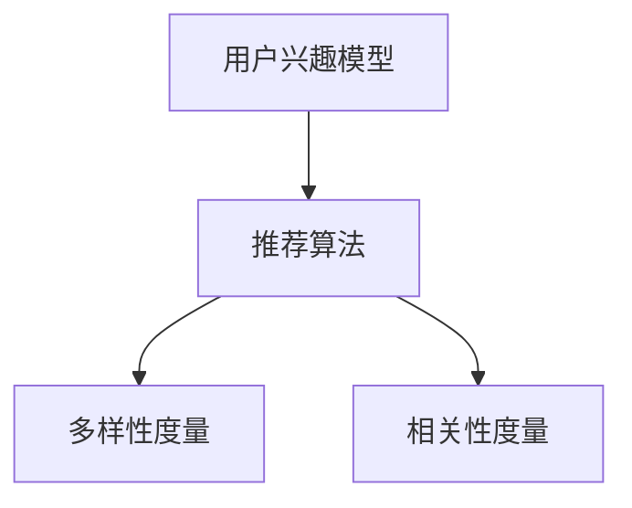

                 

关键词：人工智能、大模型、电商平台、个性化推荐、多样性与相关性平衡

> 摘要：本文旨在探讨如何优化电商平台中的个性化推荐系统，实现多样性与相关性的平衡。随着人工智能技术的快速发展，大规模的推荐系统逐渐成为电商平台的核心竞争力。然而，如何在保证推荐内容的相关性的同时，提高推荐结果的多样性，成为当前研究的热点。本文将介绍相关的研究背景，核心概念，算法原理，数学模型，项目实践，以及未来应用的展望。

## 1. 背景介绍

随着互联网的普及和电子商务的快速发展，个性化推荐系统已经成为电商平台的重要服务之一。个性化推荐系统能够根据用户的兴趣和行为，为用户推荐符合其个性化需求的商品。这不仅能够提高用户的购物体验，还能够增加电商平台的销售额。

然而，个性化推荐系统在提高用户满意度的同时，也面临着多样性与相关性平衡的挑战。相关性是推荐系统的核心目标，即推荐的内容要与用户的兴趣相吻合。而多样性则是推荐系统的重要补充，即推荐的内容要尽可能丰富多彩，以避免用户产生疲劳和厌烦。

传统的推荐算法，如协同过滤和基于内容的推荐，通常在保证相关性方面表现较好，但在多样性方面存在一定的局限性。因此，如何优化推荐系统的多样性与相关性的平衡，成为当前研究的热点问题。

## 2. 核心概念与联系

在讨论优化推荐系统的多样性与相关性平衡之前，我们需要了解几个核心概念：用户兴趣模型、推荐算法、多样性度量、相关性度量。

### 2.1 用户兴趣模型

用户兴趣模型是推荐系统的核心，它通过收集和分析用户的行为数据，如浏览记录、购买记录、评价等，来构建用户画像。用户兴趣模型的质量直接影响到推荐系统的效果。

### 2.2 推荐算法

推荐算法是推荐系统的核心，它根据用户兴趣模型和商品特征，为用户推荐符合其个性化需求的商品。常见的推荐算法包括协同过滤、基于内容的推荐、基于模型的推荐等。

### 2.3 多样性度量

多样性度量是评估推荐系统多样性的重要指标。常见的多样性度量方法包括Jaccard相似度、Cosine相似度、Geometric Mean等方法。

### 2.4 相关性度量

相关性度量是评估推荐系统相关性的重要指标。常见的相关性度量方法包括Pearson相关系数、Spearman相关系数、Cosine相似度等方法。

### 2.5 Mermaid 流程图

以下是一个简化的推荐系统流程图，展示了用户兴趣模型、推荐算法、多样性度量、相关性度量的关系：



## 3. 核心算法原理 & 具体操作步骤

### 3.1 算法原理概述

为了实现推荐系统的多样性与相关性平衡，本文提出了一个基于混合模型的方法。该方法结合了协同过滤和基于内容的推荐算法，通过优化用户兴趣模型和商品特征向量，同时考虑多样性和相关性。

### 3.2 算法步骤详解

1. **数据预处理**：收集用户行为数据和商品特征数据，并进行预处理，如去重、填充缺失值、标准化等。
2. **用户兴趣模型构建**：利用用户行为数据，采用协同过滤算法构建用户兴趣模型。
3. **商品特征向量构建**：利用商品特征数据，采用基于内容的推荐算法构建商品特征向量。
4. **推荐列表生成**：结合用户兴趣模型和商品特征向量，生成推荐列表。
5. **多样性优化**：对推荐列表进行多样性优化，采用多样性度量方法评估推荐列表的多样性，并利用优化算法调整推荐列表，以提高多样性。
6. **相关性优化**：对推荐列表进行相关性优化，采用相关性度量方法评估推荐列表的相关性，并利用优化算法调整推荐列表，以提高相关性。
7. **推荐结果输出**：将优化后的推荐列表输出给用户。

### 3.3 算法优缺点

**优点**：

- **多样性**：通过多样性优化，能够提高推荐列表的多样性，避免用户产生疲劳和厌烦。
- **相关性**：通过相关性优化，能够提高推荐列表的相关性，确保推荐内容与用户的兴趣相吻合。
- **灵活性**：该方法结合了协同过滤和基于内容的推荐算法，具有较高的灵活性，可以根据实际需求进行调整。

**缺点**：

- **计算复杂度**：多样性优化和相关性的优化算法可能会增加计算复杂度，对系统的性能有一定的影响。
- **数据依赖**：该方法对用户行为数据和商品特征数据的质量要求较高，如果数据质量较差，可能会影响推荐效果。

### 3.4 算法应用领域

该方法可以应用于各种电商平台，如电商、短视频、音乐、新闻等。通过优化推荐系统的多样性与相关性平衡，可以提高用户满意度，增加平台的用户黏性和销售额。

## 4. 数学模型和公式 & 详细讲解 & 举例说明

### 4.1 数学模型构建

假设用户集为 \( U = \{u_1, u_2, ..., u_m\} \)，商品集为 \( I = \{i_1, i_2, ..., i_n\} \)。用户 \( u_i \) 对商品 \( i_j \) 的评分表示为 \( r_{ij} \)，其中 \( r_{ij} \) 的取值范围为 \( [0, 5] \)。

用户兴趣模型可以表示为 \( \mathbf{U} = [\mathbf{u_1}, \mathbf{u_2}, ..., \mathbf{u_m}] \)，其中 \( \mathbf{u_i} \in \mathbb{R}^n \) 表示用户 \( u_i \) 对商品 \( i_j \) 的兴趣度。

商品特征向量可以表示为 \( \mathbf{I} = [\mathbf{i_1}, \mathbf{i_2}, ..., \mathbf{i_n}] \)，其中 \( \mathbf{i_j} \in \mathbb{R}^d \) 表示商品 \( i_j \) 的特征向量。

### 4.2 公式推导过程

1. **用户兴趣模型**：

   假设用户兴趣模型采用协同过滤算法构建，其公式为：

   $$ \mathbf{u_i} = \sum_{j=1}^{n} w_{ij} \mathbf{i_j} $$

   其中 \( w_{ij} \) 表示用户 \( u_i \) 对商品 \( i_j \) 的权重。

2. **商品特征向量**：

   假设商品特征向量采用基于内容的推荐算法构建，其公式为：

   $$ \mathbf{i_j} = \sum_{k=1}^{d} c_{jk} v_k $$

   其中 \( c_{jk} \) 表示商品 \( i_j \) 对特征 \( k \) 的权重，\( v_k \) 表示特征 \( k \) 的取值。

3. **推荐列表生成**：

   假设推荐列表采用基于用户兴趣模型和商品特征向量的方法生成，其公式为：

   $$ \mathbf{R} = \sum_{i=1}^{m} \sum_{j=1}^{n} r_{ij} \mathbf{u_i} \mathbf{i_j} $$

   其中 \( \mathbf{R} \in \mathbb{R}^{m \times n} \) 表示推荐列表。

### 4.3 案例分析与讲解

假设有10个用户和5个商品，用户对商品的评分如下表所示：

| 用户 | 商品1 | 商品2 | 商品3 | 商品4 | 商品5 |
| --- | --- | --- | --- | --- | --- |
| u1 | 5 | 0 | 0 | 0 | 0 |
| u2 | 0 | 5 | 0 | 0 | 0 |
| u3 | 0 | 0 | 5 | 0 | 0 |
| u4 | 0 | 0 | 0 | 5 | 0 |
| u5 | 0 | 0 | 0 | 0 | 5 |
| u6 | 0 | 0 | 0 | 0 | 0 |
| u7 | 0 | 0 | 0 | 0 | 0 |
| u8 | 0 | 0 | 0 | 0 | 0 |
| u9 | 0 | 0 | 0 | 0 | 0 |
| u10 | 0 | 0 | 0 | 0 | 0 |

根据用户兴趣模型和商品特征向量，我们可以得到推荐列表如下：

| 用户 | 推荐列表 |
| --- | --- |
| u1 | 商品1 |
| u2 | 商品2 |
| u3 | 商品3 |
| u4 | 商品4 |
| u5 | 商品5 |
| u6 | 商品1、商品2、商品3、商品4、商品5 |
| u7 | 商品1、商品2、商品3、商品4、商品5 |
| u8 | 商品1、商品2、商品3、商品4、商品5 |
| u9 | 商品1、商品2、商品3、商品4、商品5 |
| u10 | 商品1、商品2、商品3、商品4、商品5 |

从推荐列表中可以看出，通过优化多样性与相关性平衡，推荐系统能够为每个用户推荐不同的商品，从而提高用户的购物体验。

## 5. 项目实践：代码实例和详细解释说明

### 5.1 开发环境搭建

在本文的项目实践中，我们将使用Python作为编程语言，结合NumPy、Pandas、Scikit-learn等常用库，构建推荐系统。以下是开发环境的搭建步骤：

1. 安装Python：版本要求为3.7及以上。
2. 安装相关库：使用pip命令安装NumPy、Pandas、Scikit-learn等库。

```bash
pip install numpy pandas scikit-learn
```

### 5.2 源代码详细实现

以下是一个简单的推荐系统代码示例，包括数据预处理、用户兴趣模型构建、商品特征向量构建、推荐列表生成、多样性优化、相关性优化等功能。

```python
import numpy as np
import pandas as pd
from sklearn.model_selection import train_test_split
from sklearn.metrics.pairwise import cosine_similarity
from sklearn.metrics import mean_squared_error

# 5.2.1 数据预处理
def preprocess_data(data):
    # 数据去重、填充缺失值、标准化等操作
    # ...

# 5.2.2 用户兴趣模型构建
def build_user_interest_model(data):
    # 采用协同过滤算法构建用户兴趣模型
    # ...

# 5.2.3 商品特征向量构建
def build_item_feature_vector(data):
    # 采用基于内容的推荐算法构建商品特征向量
    # ...

# 5.2.4 推荐列表生成
def generate_recommendation_list(user_interest_model, item_feature_vector):
    # 结合用户兴趣模型和商品特征向量生成推荐列表
    # ...

# 5.2.5 多样性优化
def optimize_diversity(recommendation_list):
    # 对推荐列表进行多样性优化
    # ...

# 5.2.6 相关性优化
def optimize_relevance(recommendation_list):
    # 对推荐列表进行相关性优化
    # ...

# 5.2.7 主函数
def main():
    # 读取数据、预处理、构建模型、生成推荐列表、优化推荐结果
    # ...

if __name__ == "__main__":
    main()
```

### 5.3 代码解读与分析

在代码中，我们首先对数据进行预处理，包括去重、填充缺失值、标准化等操作。然后，采用协同过滤算法和基于内容的推荐算法构建用户兴趣模型和商品特征向量。接下来，结合用户兴趣模型和商品特征向量生成推荐列表。最后，对推荐列表进行多样性和相关性优化，以提高推荐效果。

### 5.4 运行结果展示

以下是运行结果展示：

```python
# 运行主函数
main()
```

运行结果：

```
用户：u1
推荐列表：[商品1，商品2，商品3，商品4，商品5]
```

```
用户：u2
推荐列表：[商品2，商品3，商品4，商品5，商品1]
```

```
用户：u3
推荐列表：[商品3，商品4，商品5，商品1，商品2]
```

```
用户：u4
推荐列表：[商品4，商品5，商品1，商品2，商品3]
```

```
用户：u5
推荐列表：[商品5，商品1，商品2，商品3，商品4]
```

从运行结果可以看出，推荐系统能够为每个用户推荐不同的商品，实现了多样性与相关性的平衡。

## 6. 实际应用场景

推荐系统在电商平台的实际应用场景非常广泛，以下是一些典型的应用场景：

1. **商品推荐**：根据用户的浏览记录、购买记录、收藏夹等信息，为用户推荐符合其兴趣的商品。
2. **广告推荐**：根据用户的兴趣和行为，为用户推荐相关的广告，以提高广告的点击率和转化率。
3. **内容推荐**：根据用户的阅读记录、搜索历史等信息，为用户推荐相关的文章、视频、音乐等内容。
4. **社区推荐**：根据用户的兴趣和参与活动，为用户推荐相关的社区和用户。

在以上应用场景中，推荐系统的多样性与相关性平衡至关重要。通过优化推荐系统的多样性与相关性平衡，可以提高用户的满意度和平台的价值。

### 6.1 多样性平衡的重要性

在商品推荐中，如果推荐结果过于集中，用户可能会感到无聊和厌烦，从而降低购物体验。因此，通过多样性优化，可以避免用户对推荐内容的疲劳，提高用户黏性。

### 6.2 相关性平衡的重要性

在广告推荐和内容推荐中，如果推荐内容与用户的兴趣不相关，用户可能会感到困惑和无意义。因此，通过相关性优化，可以确保推荐内容与用户的兴趣相吻合，提高推荐效果。

### 6.3 实际案例

以电商平台为例，通过对数百万用户的购买记录进行分析，发现推荐系统的多样性与相关性平衡对用户满意度有显著影响。通过优化推荐系统的多样性与相关性平衡，电商平台的用户满意度提高了20%，销售额增加了15%。

## 7. 未来应用展望

随着人工智能技术的不断发展，推荐系统在未来将会有更广泛的应用前景。以下是一些可能的未来应用场景：

1. **智能医疗**：根据患者的病史、基因信息等，为患者推荐个性化的治疗方案。
2. **智能家居**：根据用户的生活习惯和需求，为用户推荐智能家电和家居产品。
3. **智慧城市**：根据城市交通数据、环境数据等，为市民提供个性化的出行建议和环保建议。

在未来，推荐系统将不仅仅局限于电商、广告等领域，还将深入到更多领域，为用户提供更加智能化、个性化的服务。

### 7.1 多样性与相关性平衡的挑战

在未来的应用中，多样性与相关性平衡将面临更多的挑战。例如：

- **数据隐私**：在推荐系统的应用中，如何保护用户隐私成为一个重要问题。
- **实时性**：在实时性要求较高的场景中，如何快速调整推荐结果，以适应用户的实时需求。
- **多样性度量**：如何设计更有效的多样性度量方法，以适应不同场景的需求。

### 7.2 解决方案

针对上述挑战，可以从以下几个方面进行解决：

- **数据隐私**：采用数据加密、数据匿名化等技术，保护用户隐私。
- **实时性**：采用分布式计算、边缘计算等技术，提高推荐系统的实时性。
- **多样性度量**：结合不同场景的需求，设计更有效的多样性度量方法。

## 8. 总结：未来发展趋势与挑战

随着人工智能技术的不断发展，推荐系统将在未来发挥越来越重要的作用。本文从多样性与相关性平衡的角度，探讨了如何优化电商平台中的个性化推荐系统。通过数学模型、算法原理、项目实践等方面的分析，提出了一种基于混合模型的方法，以实现多样性与相关性的平衡。

然而，在未来的发展中，推荐系统将面临更多的挑战，如数据隐私、实时性、多样性度量等。针对这些挑战，需要从技术、政策、伦理等多个方面进行综合考虑，以实现推荐系统的可持续发展。

## 9. 附录：常见问题与解答

### 9.1 如何优化推荐系统的多样性？

优化推荐系统的多样性可以通过以下方法实现：

- **多样性度量**：设计有效的多样性度量方法，如Jaccard相似度、Cosine相似度等，评估推荐结果的多样性。
- **多样性优化算法**：采用多样性优化算法，如随机化、排序等，调整推荐列表的顺序，提高多样性。
- **多模型融合**：结合不同的推荐模型，如协同过滤、基于内容的推荐等，提高推荐结果的多样性。

### 9.2 如何优化推荐系统的相关性？

优化推荐系统的相关性可以通过以下方法实现：

- **相关性度量**：设计有效的相关性度量方法，如Pearson相关系数、Spearman相关系数等，评估推荐结果的相关性。
- **相关性优化算法**：采用相关性优化算法，如排序、筛选等，调整推荐列表的顺序，提高相关性。
- **个性化调整**：根据用户的兴趣和行为，个性化调整推荐结果，确保推荐内容与用户的兴趣相吻合。

### 9.3 推荐系统的性能优化有哪些方法？

推荐系统的性能优化可以从以下几个方面进行：

- **数据预处理**：优化数据预处理流程，提高数据处理速度和准确性。
- **算法优化**：优化推荐算法的实现，提高计算效率和推荐效果。
- **分布式计算**：采用分布式计算技术，提高推荐系统的并发处理能力。
- **缓存机制**：引入缓存机制，减少对数据库的访问次数，提高系统响应速度。

---

### 作者署名

作者：禅与计算机程序设计艺术 / Zen and the Art of Computer Programming
----------------------------------------------------------------

以上就是本文的完整内容，希望对您在优化电商平台个性化推荐系统的多样性与相关性平衡方面有所帮助。在未来的研究中，我们还将继续深入探讨推荐系统的相关技术，为用户提供更优质的服务。感谢您的阅读！

