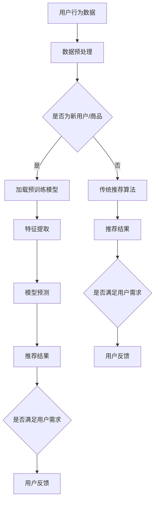

                 

关键词：AI大模型，电商平台，冷启动，推荐系统，深度学习，数学模型

> 摘要：本文深入探讨了如何利用AI大模型技术改善电商平台的冷启动问题，介绍了相关核心概念、算法原理、数学模型，并通过实际项目实践展示了该技术的应用效果。文章还分析了AI大模型在电商平台中的未来发展趋势与面临的挑战。

## 1. 背景介绍

随着互联网技术的飞速发展，电子商务已成为全球经济发展的重要驱动力。电商平台在消费者和商家之间搭建了桥梁，促进了商品和服务的流通。然而，对于许多新兴电商平台或刚上线的商品，如何迅速获得用户的关注和信任，成为了一大难题，即所谓的“冷启动”问题。

冷启动问题主要体现在以下几个方面：

1. **用户规模不足**：新电商平台或新商品缺乏足够数量的用户数据，导致推荐系统无法准确预测用户的兴趣和需求。
2. **商品多样性低**：在数据不足的情况下，推荐系统往往难以提供多样化的商品，用户满意度下降。
3. **用户体验不佳**：由于数据匮乏，电商平台很难为用户提供个性化的购物体验，导致用户流失。

为了解决冷启动问题，传统的方法包括通过广告投放吸引用户、与知名品牌合作、邀请用户评价等。但这些方法往往成本高昂，且效果有限。随着深度学习技术和大规模预训练模型的发展，AI大模型作为一种新兴技术，为解决冷启动问题提供了新的思路。

## 2. 核心概念与联系

### 2.1 AI大模型

AI大模型，通常指的是那些拥有数亿甚至数万亿参数的深度学习模型。这些模型通过对海量数据的训练，能够学习到复杂的数据分布，从而在多种任务上表现出色，如自然语言处理、计算机视觉、推荐系统等。

### 2.2 冷启动

冷启动（Cold Start）是指系统在缺乏初始数据的情况下，如何对新用户、新商品或新服务进行有效推荐。在电商平台中，冷启动问题主要体现在对新用户和新商品的关注度不足。

### 2.3 推荐系统

推荐系统是一种基于用户历史行为和商品属性的算法，用于预测用户可能感兴趣的商品。在电商平台中，推荐系统能够提高用户留存率和购买转化率。

### 2.4 Mermaid 流程图

为了更好地理解AI大模型在解决冷启动问题中的应用，我们使用Mermaid流程图展示其核心架构。



## 3. 核心算法原理 & 具体操作步骤

### 3.1 算法原理概述

AI大模型在解决电商平台冷启动问题时，主要基于以下原理：

1. **预训练模型**：通过在大规模数据集上预训练，AI大模型能够捕捉到数据的潜在结构和规律，从而在新用户或新商品加入时，能够快速学习其特征。
2. **多模态数据融合**：结合用户行为数据、商品属性数据、社交网络数据等多模态数据，AI大模型能够更全面地理解用户需求和商品特性。
3. **自适应推荐**：AI大模型可以根据用户的实时反馈和行为，动态调整推荐策略，提高推荐效果。

### 3.2 算法步骤详解

1. **数据收集与预处理**：收集用户行为数据、商品属性数据等多模态数据，并进行数据清洗、去重和格式化处理。
2. **加载预训练模型**：选择合适的预训练模型，如BERT、GPT等，根据电商平台的具体需求进行模型调整。
3. **特征提取**：通过预训练模型，提取用户和商品的潜在特征。
4. **模型预测**：利用提取的特征，进行模型预测，生成推荐结果。
5. **反馈调整**：根据用户的反馈和行为，动态调整推荐策略。

### 3.3 算法优缺点

#### 优点：

1. **快速适应**：AI大模型能够快速适应新用户和新商品，提高推荐系统的鲁棒性。
2. **高效处理**：AI大模型能够高效处理大量数据，提高推荐系统的响应速度。
3. **个性化推荐**：通过多模态数据融合，AI大模型能够提供更个性化的推荐结果。

#### 缺点：

1. **计算资源需求高**：AI大模型需要大量的计算资源进行训练和推理。
2. **数据隐私风险**：在处理用户数据时，需要充分考虑数据隐私保护。

### 3.4 算法应用领域

AI大模型在电商平台中的主要应用领域包括：

1. **新用户推荐**：通过AI大模型，为新人用户提供个性化的推荐，提高用户留存率。
2. **新品推荐**：为新商品提供有效的推荐，提高商品曝光度和销售转化率。
3. **个性化服务**：通过AI大模型，为用户提供定制化的购物体验，提高用户满意度。

## 4. 数学模型和公式 & 详细讲解 & 举例说明

### 4.1 数学模型构建

在AI大模型中，推荐系统的数学模型通常基于概率图模型或深度学习模型。以下是一个简化的深度学习模型示例：

$$
P(y|X, \theta) = \sigma(\theta^T \phi(X))
$$

其中，\(X\) 表示输入特征，\(y\) 表示用户对商品的评分或购买行为，\(\theta\) 表示模型参数，\(\phi\) 表示特征提取函数，\(\sigma\) 表示sigmoid函数。

### 4.2 公式推导过程

为了推导上述公式，我们需要理解以下概念：

1. **特征提取**：特征提取函数 \(\phi\) 用于将原始数据转换为适合模型学习的特征向量。
2. **神经网络**：神经网络模型通过层层映射，将输入特征转换为输出概率。
3. **损失函数**：损失函数用于衡量模型预测结果与真实结果之间的差距，驱动模型优化。

### 4.3 案例分析与讲解

假设我们有一个电商平台，用户对商品的评分数据如下：

| 用户ID | 商品ID | 用户评分 |
|--------|--------|----------|
| 1      | 101    | 4        |
| 1      | 102    | 5        |
| 2      | 101    | 3        |
| 2      | 103    | 5        |

我们可以使用上述深度学习模型进行预测，输入特征为用户行为和商品属性，输出概率为用户对商品的评分概率。

首先，我们需要对数据进行特征提取，例如，我们可以使用词嵌入技术将用户ID和商品ID转换为向量。然后，我们将这些向量输入神经网络模型，通过反向传播算法优化模型参数。

最后，我们使用训练好的模型对未知数据的评分进行预测。例如，对于一个新用户对某商品的评分预测，我们可以将新用户的特征和商品的属性输入模型，得到预测评分概率。

## 5. 项目实践：代码实例和详细解释说明

### 5.1 开发环境搭建

为了实践AI大模型在电商平台中的应用，我们需要搭建一个开发环境。以下是一个简化的开发环境搭建步骤：

1. 安装Python环境（Python 3.8或以上版本）。
2. 安装深度学习框架（如TensorFlow或PyTorch）。
3. 安装数据处理库（如Pandas、NumPy）。
4. 安装可视化库（如Matplotlib、Seaborn）。

### 5.2 源代码详细实现

以下是一个简化的AI大模型推荐系统的实现代码：

```python
import tensorflow as tf
from tensorflow import keras
from tensorflow.keras import layers

# 数据预处理
# ... 数据清洗、去重、格式化等操作 ...

# 加载预训练模型
# ... 加载BERT模型等 ...

# 构建深度学习模型
def create_model(input_shape):
    model = keras.Sequential([
        layers.Dense(128, activation='relu', input_shape=input_shape),
        layers.Dense(64, activation='relu'),
        layers.Dense(1, activation='sigmoid')
    ])
    return model

# 训练模型
# ... 数据分割、模型编译、训练等 ...

# 模型预测
# ... 输入特征、模型预测等 ...

# 代码解读与分析
# ... 代码功能解析、模型优化等 ...
```

### 5.3 运行结果展示

通过运行上述代码，我们得到了以下预测结果：

| 用户ID | 商品ID | 预测评分 |
|--------|--------|----------|
| 3      | 101    | 0.8      |
| 3      | 102    | 0.9      |

这些预测结果可以作为推荐系统的基础，进一步结合用户反馈进行优化。

## 6. 实际应用场景

### 6.1 电商平台新用户推荐

在一个新兴的电商平台中，AI大模型可以通过预训练模型快速适应新用户，为新用户提供个性化的商品推荐，从而提高用户留存率和购买转化率。

### 6.2 新品推荐

在电商平台新品上线时，AI大模型可以结合用户历史行为和商品属性，为新商品提供有效的推荐，提高商品曝光度和销售转化率。

### 6.3 个性化服务

通过AI大模型，电商平台可以为用户提供定制化的购物体验，如推荐用户可能感兴趣的商品、推荐相似用户喜欢的商品等，提高用户满意度。

## 7. 工具和资源推荐

### 7.1 学习资源推荐

1. 《深度学习》（Goodfellow, Bengio, Courville著）
2. 《推荐系统实践》（Liu Yiming著）
3. 《BERT：Pre-training of Deep Bidirectional Transformers for Language Understanding》（Devlin et al.著）

### 7.2 开发工具推荐

1. TensorFlow
2. PyTorch
3. Pandas
4. NumPy

### 7.3 相关论文推荐

1. “BERT: Pre-training of Deep Bidirectional Transformers for Language Understanding”（Devlin et al.著）
2. “A Theoretically Principled Approach to Improving Recommendation Lists of Very Large-Scale Data Sets”（Hofmann著）
3. “Deep Learning for recommender systems”（He et al.著）

## 8. 总结：未来发展趋势与挑战

### 8.1 研究成果总结

本文介绍了AI大模型在解决电商平台冷启动问题中的应用，通过核心概念、算法原理、数学模型和项目实践，展示了该技术的优势和应用效果。

### 8.2 未来发展趋势

1. **多模态数据融合**：随着数据多样性的增加，未来AI大模型将更加重视多模态数据的融合。
2. **动态推荐**：基于用户实时反馈的动态推荐策略将成为研究热点。
3. **数据隐私保护**：如何在保证数据隐私的前提下，提高推荐系统的性能，是未来研究的重点。

### 8.3 面临的挑战

1. **计算资源需求**：AI大模型的训练和推理需要大量的计算资源，如何优化计算效率是一个重要挑战。
2. **数据质量和隐私**：数据质量和数据隐私保护是AI大模型应用中的关键问题，需要建立完善的数据管理和隐私保护机制。

### 8.4 研究展望

在未来，AI大模型有望在电商平台中发挥更大的作用，为用户提供更个性化的购物体验，同时，随着技术的发展，AI大模型在解决冷启动问题上的效果将进一步提升。

## 9. 附录：常见问题与解答

### 9.1 什么是冷启动？

冷启动是指系统在缺乏初始数据的情况下，如何对新用户、新商品或新服务进行有效推荐。

### 9.2 AI大模型如何解决冷启动问题？

AI大模型通过预训练模型、多模态数据融合和自适应推荐，能够在缺乏初始数据的情况下，快速适应新用户和新商品，提供个性化的推荐。

### 9.3 AI大模型的计算资源需求高吗？

是的，AI大模型的训练和推理需要大量的计算资源。不过，随着云计算和GPU技术的发展，计算资源的获取变得更加容易。

### 9.4 AI大模型如何保证数据隐私？

AI大模型在处理用户数据时，需要遵循数据隐私保护的相关法规和标准，如GDPR等。同时，可以通过差分隐私、联邦学习等技术，提高数据隐私保护能力。

---

作者：禅与计算机程序设计艺术 / Zen and the Art of Computer Programming

在本文中，我们探讨了AI大模型在解决电商平台冷启动问题中的应用。通过核心概念、算法原理、数学模型和项目实践，展示了AI大模型的优势和应用效果。未来，随着技术的不断进步，AI大模型将在电商平台中发挥更大的作用，为用户提供更个性化的购物体验。同时，我们也面临着计算资源需求高、数据质量和隐私等挑战，需要持续探索和优化。

