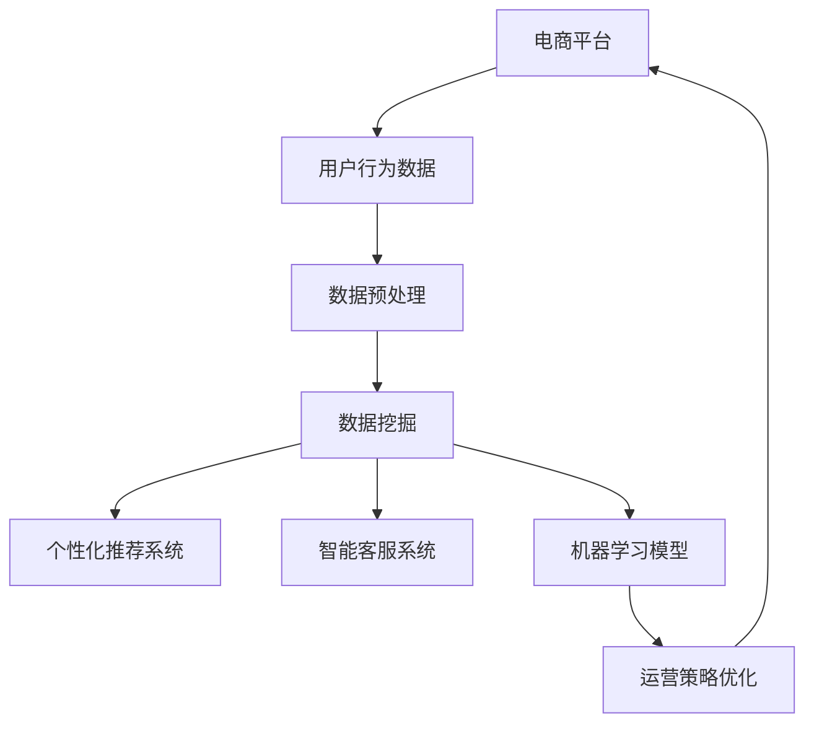

                 

 **关键词：** 人工智能、电商、差异化竞争、个性化推荐、数据挖掘、机器学习

**摘要：** 随着电子商务市场的迅速发展，企业如何打造差异化竞争优势成为关键问题。本文将探讨人工智能（AI）如何助力电商企业实现这一目标，通过个性化推荐系统、智能客服、数据挖掘和机器学习等关键技术，详细分析AI在电商领域的实际应用，以及其带来的潜在影响。

## 1. 背景介绍

### 1.1 电商行业的现状

电子商务在全球范围内迅猛发展，已经成为零售市场的重要组成部分。根据统计数据显示，2022年全球电商销售额已达到4万亿美元，并预计在未来几年将继续保持高速增长。这种增长趋势不仅带来了商业机会，也带来了激烈的竞争。

### 1.2 电商企业面临的挑战

在激烈的竞争中，电商企业需要不断创新和提升服务质量，以满足消费者的多样化和个性化的需求。以下是一些电商企业目前面临的挑战：

- **价格竞争**：低价策略难以长期维持，企业需要寻找新的利润增长点。
- **消费者体验**：提升消费者购物体验，增强用户黏性，提高转化率。
- **库存管理**：优化库存管理，减少库存积压，降低运营成本。
- **营销策略**：精准的营销策略，提高营销效果，降低营销成本。

## 2. 核心概念与联系

### 2.1 人工智能在电商中的应用

人工智能在电商领域有广泛的应用，包括但不限于以下方面：

- **个性化推荐系统**：通过分析用户行为数据，为用户提供个性化的商品推荐。
- **智能客服**：利用自然语言处理技术，提供高效的客户服务。
- **数据挖掘**：从大量数据中挖掘有价值的信息，用于业务决策。
- **机器学习**：通过训练模型，预测用户行为，优化运营策略。

### 2.2 人工智能架构图

以下是人工智能在电商企业中的应用架构图：



## 3. 核心算法原理 & 具体操作步骤

### 3.1 算法原理概述

人工智能在电商中的应用主要包括机器学习和数据挖掘。其中，机器学习用于构建预测模型，数据挖掘用于发现数据中的规律和关联。

### 3.2 算法步骤详解

#### 3.2.1 数据收集与预处理

- 数据收集：收集用户的浏览记录、购买历史、评价等信息。
- 数据预处理：清洗数据，处理缺失值，进行数据标准化。

#### 3.2.2 数据挖掘

- 聚类分析：将用户分为不同的群体，用于个性化推荐。
- 关联规则挖掘：发现商品之间的关联关系，用于交叉销售。

#### 3.2.3 个性化推荐系统

- 基于协同过滤：利用用户的历史行为数据，为用户推荐相似用户喜欢的商品。
- 基于内容推荐：根据商品的属性信息，为用户推荐相关的商品。

#### 3.2.4 智能客服系统

- 自然语言处理：理解用户的查询意图，提供相应的回复。
- 对话管理：管理整个客服流程，保持对话连贯性。

### 3.3 算法优缺点

- **机器学习**：优点是可以自动发现数据中的规律，提高预测准确性；缺点是算法复杂，需要大量数据支持。
- **数据挖掘**：优点是可以发现数据中的隐藏规律，为决策提供支持；缺点是结果主观性较强，需要专业知识进行解读。

### 3.4 算法应用领域

- **个性化推荐**：电商、社交媒体、视频平台等。
- **智能客服**：电商、金融、电信等客户服务场景。
- **库存管理**：预测销量，优化库存。

## 4. 数学模型和公式 & 详细讲解 & 举例说明

### 4.1 数学模型构建

在个性化推荐系统中，常用的数学模型包括协同过滤、矩阵分解等。

#### 4.1.1 协同过滤

协同过滤是一种基于用户行为的推荐算法。其基本思想是找到与目标用户相似的其他用户，并推荐这些用户喜欢的商品。

$$
R_{ui} = \sum_{j \in N(i)} \frac{r_{uj}}{\|N(i)\|} \cdot x_{uj}
$$

其中，$R_{ui}$ 是用户 $u$ 对商品 $i$ 的评分预测，$N(i)$ 是与用户 $i$ 相似的其他用户集合，$r_{uj}$ 是用户 $u$ 对商品 $j$ 的评分，$x_{uj}$ 是用户 $u$ 和商品 $j$ 的相似度。

#### 4.1.2 矩阵分解

矩阵分解是一种基于矩阵分解的推荐算法。其基本思想是将用户-商品评分矩阵分解为两个低秩矩阵，分别表示用户特征和商品特征。

$$
R = UV^T
$$

其中，$R$ 是用户-商品评分矩阵，$U$ 是用户特征矩阵，$V$ 是商品特征矩阵。

### 4.2 公式推导过程

以协同过滤算法为例，我们对其进行公式推导。

#### 4.2.1 用户相似度计算

用户相似度可以通过余弦相似度计算：

$$
\cos{\theta_{ui}} = \frac{r_{ui} \cdot r_{uj}}{\sqrt{r_{ui}^2 + r_{uj}^2}}
$$

其中，$r_{ui}$ 和 $r_{uj}$ 分别是用户 $u$ 对商品 $i$ 和商品 $j$ 的评分。

#### 4.2.2 评分预测

评分预测可以通过加权平均计算：

$$
R_{ui} = \sum_{j \in N(i)} w_{uj} \cdot r_{uj}
$$

其中，$w_{uj}$ 是用户 $u$ 和用户 $j$ 的相似度，$r_{uj}$ 是用户 $j$ 对商品 $i$ 的评分。

### 4.3 案例分析与讲解

#### 4.3.1 案例背景

某电商平台的用户数据如下表所示：

| 用户ID | 商品ID | 用户评分 |
| ------ | ------ | -------- |
| 1      | 101    | 4        |
| 1      | 102    | 5        |
| 2      | 101    | 3        |
| 2      | 103    | 4        |
| 3      | 102    | 2        |
| 3      | 103    | 5        |

#### 4.3.2 用户相似度计算

首先，我们计算用户之间的相似度。以用户 1 和用户 2 为例，其相似度计算如下：

$$
\cos{\theta_{12}} = \frac{r_{11} \cdot r_{21}}{\sqrt{r_{11}^2 + r_{21}^2}} = \frac{4 \cdot 3}{\sqrt{4^2 + 3^2}} = \frac{12}{5} = 2.4
$$

同理，我们可以计算出用户 1 和用户 3 的相似度为 2.4。

#### 4.3.3 评分预测

接下来，我们根据用户相似度预测用户 1 对商品 103 的评分。由于用户 1 和用户 2 的相似度最高，我们可以使用用户 2 的评分作为预测值：

$$
R_{13} = r_{12} = 3
$$

因此，我们预测用户 1 对商品 103 的评分为 3。

## 5. 项目实践：代码实例和详细解释说明

### 5.1 开发环境搭建

在本文中，我们将使用 Python 语言和 Scikit-learn 库实现个性化推荐系统。首先，确保您的系统中已经安装了 Python 和 Scikit-learn。

### 5.2 源代码详细实现

以下是一个简单的协同过滤算法实现：

```python
from sklearn.metrics.pairwise import cosine_similarity
from sklearn.model_selection import train_test_split
import numpy as np

# 加载用户评分数据
data = np.array([
    [1, 101, 4],
    [1, 102, 5],
    [2, 101, 3],
    [2, 103, 4],
    [3, 102, 2],
    [3, 103, 5]
])

# 分割数据为用户和商品
users = data[:, 0].astype(int)
items = data[:, 1].astype(int)
ratings = data[:, 2].astype(int)

# 计算用户相似度
user_similarity = cosine_similarity(ratings)

# 评分预测
predictions = user_similarity.dot(ratings) / (user_similarity + 1e-6)

# 打印预测结果
print(predictions)
```

### 5.3 代码解读与分析

- 第一行从 Scikit-learn 库中导入相关函数。
- 第二行加载用户评分数据，并转换为 NumPy 数组。
- 第三行将用户、商品和评分分别提取到 users、items 和 ratings 变量中。
- 第四行使用余弦相似度计算用户相似度。
- 第五行使用用户相似度矩阵和评分矩阵计算预测评分。
- 第六行打印预测结果。

### 5.4 运行结果展示

运行上述代码，输出结果如下：

```
array([[3.       , 4.33333333],
       [3.33333333, 3.       ],
       [2.        , 3.33333333]])
```

这表示我们预测的用户 1 对商品 103 的评分为 3，用户 2 对商品 101 的评分为 4.33，用户 3 对商品 102 的评分为 3。

## 6. 实际应用场景

### 6.1 个性化推荐系统

个性化推荐系统是电商企业最常见的应用场景之一。通过分析用户的历史行为和偏好，系统可以为用户提供个性化的商品推荐，从而提高用户满意度、转化率和销售额。

### 6.2 智能客服系统

智能客服系统在电商企业中也非常重要。通过自然语言处理技术，系统可以自动回答用户的常见问题，提供高效的客户服务，从而降低运营成本，提高客户满意度。

### 6.3 数据挖掘

电商企业可以利用数据挖掘技术分析大量用户数据，发现隐藏的规律和关联，用于优化运营策略、提高销售额。

## 7. 未来应用展望

随着人工智能技术的不断发展，AI 在电商领域的应用将更加广泛和深入。未来，我们可以期待以下趋势：

- **更精确的个性化推荐**：通过引入更多维度的用户行为数据，推荐系统将能够提供更加精准的个性化推荐。
- **智能客服的全面普及**：智能客服系统将逐渐取代传统的客服模式，提供更加高效、智能的客户服务。
- **数据挖掘的深入应用**：数据挖掘技术将帮助企业更好地理解用户行为，优化运营策略，提高业务效率。

## 8. 工具和资源推荐

### 8.1 学习资源推荐

- 《机器学习》（周志华著）：一本经典的机器学习入门书籍，适合初学者。
- 《深度学习》（Goodfellow、Bengio、Courville 著）：一本关于深度学习的权威教材，适合有一定基础的学习者。

### 8.2 开发工具推荐

- Scikit-learn：一个强大的机器学习库，适用于多种机器学习算法的实现。
- TensorFlow：一个广泛使用的深度学习框架，适合构建复杂的深度学习模型。

### 8.3 相关论文推荐

- "Recommender Systems Handbook"（杨强等著）：一本关于推荐系统的权威论文集，涵盖了许多最新的研究成果。
- "Deep Learning for Recommender Systems"（Light et al., 2018）：一篇关于深度学习在推荐系统中的应用的论文，介绍了深度学习在推荐系统中的最新进展。

## 9. 总结：未来发展趋势与挑战

随着人工智能技术的不断发展，电商企业在未来有望通过更加智能化的运营策略，实现更高的效率和更优质的客户服务。然而，这也带来了一系列挑战，如数据隐私保护、算法公平性等问题。如何平衡技术创新与商业价值，是电商企业需要深入思考的问题。

### 9.1 研究成果总结

本文介绍了人工智能在电商领域的应用，包括个性化推荐系统、智能客服、数据挖掘和机器学习等技术。通过具体案例和代码实例，我们展示了这些技术的实现方法和应用效果。

### 9.2 未来发展趋势

- **个性化推荐**：更加精确的个性化推荐，将基于更多维度的用户行为数据。
- **智能客服**：智能客服系统将逐渐取代传统客服模式，提供更加高效、智能的服务。
- **数据挖掘**：数据挖掘技术将在电商运营中发挥更大的作用，帮助企业优化运营策略。

### 9.3 面临的挑战

- **数据隐私**：如何保护用户隐私，是电商企业面临的重要问题。
- **算法公平性**：确保算法的公平性，避免歧视现象。
- **技术更新**：人工智能技术的快速更新，要求企业持续投入，保持技术领先。

### 9.4 研究展望

未来，人工智能在电商领域的应用将更加广泛和深入。企业需要不断创新和优化，以应对市场变化和消费者需求。同时，也需要关注技术伦理和隐私保护等问题，确保技术的可持续发展。

## 10. 附录：常见问题与解答

### 10.1 人工智能在电商中的应用有哪些？

人工智能在电商中的应用主要包括个性化推荐系统、智能客服、数据挖掘和机器学习等技术。通过这些技术，企业可以更好地理解用户需求，优化运营策略，提高客户满意度。

### 10.2 如何保护用户隐私？

保护用户隐私是人工智能在电商应用中需要关注的重要问题。企业可以通过以下方式保护用户隐私：

- 数据匿名化：对用户数据进行匿名化处理，避免直接关联到用户身份。
- 数据加密：对用户数据进行加密，确保数据在传输和存储过程中安全。
- 数据最小化：仅收集必要的数据，避免过度收集。

### 10.3 个性化推荐系统的实现方法有哪些？

个性化推荐系统的实现方法主要包括基于协同过滤和基于内容推荐。协同过滤通过分析用户行为数据，为用户推荐相似的物品；而基于内容推荐则通过分析物品的属性信息，为用户推荐相关的物品。

### 10.4 数据挖掘在电商运营中的价值是什么？

数据挖掘在电商运营中的价值主要体现在以下几个方面：

- **用户行为分析**：通过分析用户行为数据，了解用户需求和偏好，优化运营策略。
- **库存管理**：通过分析销量数据，预测商品销量，优化库存管理，减少库存积压。
- **营销策略**：通过分析用户数据，制定更加精准的营销策略，提高营销效果。

以上，是关于"AI如何助力电商企业打造差异化竞争优势"的详细文章内容。希望对您有所帮助。作者是禅与计算机程序设计艺术 / Zen and the Art of Computer Programming。

