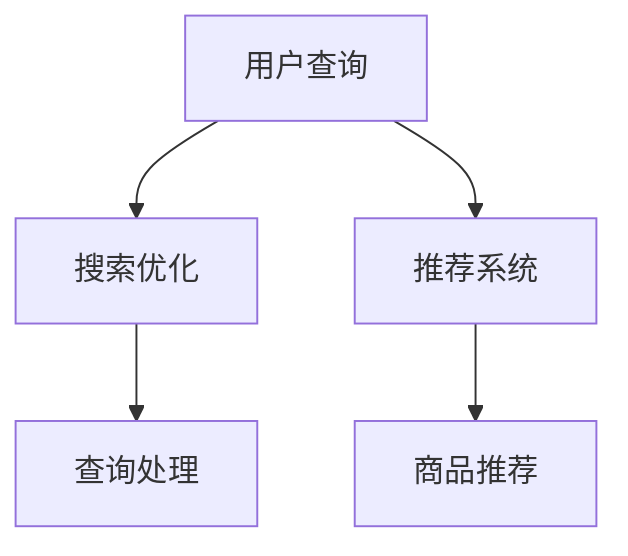

                 

关键词：人工智能、电商搜索、导购、用户体验、转化率、搜索优化、推荐系统、深度学习、机器学习

> 摘要：随着电商行业的迅猛发展，如何提高用户的搜索效率和购物体验成为电商平台的关注重点。本文将探讨如何利用人工智能技术，特别是深度学习和机器学习，来优化电商搜索和导购系统，从而提升用户体验和转化率。

## 1. 背景介绍

### 1.1 电商搜索的现状

电商搜索作为电商平台的核心功能之一，其效率直接关系到用户的购物体验和平台的竞争力。传统的电商搜索主要依赖于关键词匹配和索引技术，虽然在一定程度上提高了搜索的效率，但无法准确捕捉用户的真实需求，导致搜索结果不准确、用户体验不佳。

### 1.2 用户体验的重要性

在电商领域，用户体验是用户决定是否继续使用平台的关键因素。一个优秀的搜索系统不仅需要能够快速响应用户的查询请求，还需要能够准确理解用户的需求，并提供相关的商品推荐。这直接影响到用户的满意度和转化率。

### 1.3 转化率的重要性

电商平台的最终目标是实现销售转化，即吸引更多用户购买商品。提升转化率意味着更多的销售额和更高的盈利能力。因此，如何通过技术手段提升转化率成为电商平台持续关注的问题。

## 2. 核心概念与联系

### 2.1 人工智能与电商搜索

人工智能（AI）是提升电商搜索效率和用户体验的关键技术。通过机器学习和深度学习，AI系统能够从海量数据中自动学习，提高搜索结果的准确性。深度学习尤其擅长处理复杂的非线性问题，使其在电商搜索中的应用成为可能。

### 2.2 搜索优化与推荐系统

搜索优化和推荐系统是电商搜索导购中的两个核心组成部分。搜索优化主要关注如何提高搜索效率，包括索引构建、查询处理等。推荐系统则关注如何根据用户的行为和偏好推荐相关的商品，提升用户满意度。

### 2.3 Mermaid 流程图



## 3. 核心算法原理 & 具体操作步骤

### 3.1 算法原理概述

#### 深度学习在电商搜索中的应用

深度学习通过构建多层神经网络，实现对复杂数据的自动特征提取和模式识别。在电商搜索中，深度学习算法可以用于：

- **文本处理**：对用户查询和商品描述进行语义分析，理解查询意图。
- **图像识别**：识别商品图片，提取视觉特征。
- **用户行为分析**：分析用户的浏览和购买行为，预测用户偏好。

#### 机器学习在推荐系统中的应用

机器学习算法通过学习用户的历史数据和商品特征，生成推荐列表。常见的机器学习算法包括：

- **协同过滤**：基于用户和商品的历史交互数据推荐相似的用户或商品。
- **内容推荐**：根据商品的属性和用户的偏好推荐相关商品。

### 3.2 算法步骤详解

#### 搜索优化

1. **索引构建**：使用倒排索引加速查询处理。
2. **查询处理**：对用户查询进行预处理，包括分词、词干提取等。
3. **排序算法**：使用机器学习算法对搜索结果进行排序，提高准确性。

#### 推荐系统

1. **用户行为分析**：收集用户的历史行为数据，包括浏览、购买等。
2. **特征提取**：提取用户和商品的特征向量。
3. **推荐算法**：使用协同过滤或内容推荐算法生成推荐列表。

### 3.3 算法优缺点

#### 搜索优化

- **优点**：提高搜索效率，准确理解用户查询意图。
- **缺点**：需要对数据进行大量的预处理，算法复杂度高。

#### 推荐系统

- **优点**：提升用户满意度，增加转化率。
- **缺点**：推荐结果可能过于单一，用户偏好难以完全满足。

### 3.4 算法应用领域

- **电商平台**：电商平台广泛使用深度学习和机器学习优化搜索和推荐系统，提升用户体验和转化率。
- **在线教育**：在线教育平台利用推荐系统为用户提供个性化的课程推荐。
- **社交媒体**：社交媒体平台使用搜索优化和推荐系统提高用户参与度。

## 4. 数学模型和公式 & 详细讲解 & 举例说明

### 4.1 数学模型构建

在搜索优化和推荐系统中，常用的数学模型包括：

- **向量空间模型**：用于表示用户查询和商品特征。
- **协同过滤模型**：用于生成用户和商品的相似度矩阵。
- **内容推荐模型**：用于计算商品属性的相似度。

### 4.2 公式推导过程

以协同过滤模型为例，其基本公式为：

$$
\text{similarity(u, v)} = \frac{\text{user\_vector\_u} \cdot \text{user\_vector\_v}}{\|\text{user\_vector\_u}\| \|\text{user\_vector\_v}\|}
$$

其中，$\text{similarity(u, v)}$ 表示用户 $u$ 和用户 $v$ 的相似度，$\text{user\_vector\_u}$ 和 $\text{user\_vector\_v}$ 分别表示用户 $u$ 和用户 $v$ 的特征向量。

### 4.3 案例分析与讲解

#### 案例背景

某电商平台的用户 $A$ 想购买一款相机，输入关键词“相机”进行搜索。平台使用深度学习算法优化搜索结果，并根据用户行为推荐相关商品。

#### 搜索过程

1. **查询处理**：用户输入关键词“相机”，系统对关键词进行分词和词干提取，生成查询向量 $\text{query\_vector}$。
2. **索引查询**：系统根据查询向量在索引库中查找相关的商品，生成候选商品列表。
3. **排序算法**：使用深度学习算法对候选商品进行排序，选择最相关的商品展示给用户。

#### 推荐过程

1. **用户行为分析**：系统收集用户 $A$ 的历史行为数据，包括浏览、购买等，生成用户特征向量 $\text{user\_vector}$。
2. **特征提取**：系统提取商品的特征向量 $\text{product\_vector}$。
3. **推荐算法**：系统使用协同过滤算法，根据用户特征向量 $\text{user\_vector}$ 和商品特征向量 $\text{product\_vector}$，生成推荐列表。

## 5. 项目实践：代码实例和详细解释说明

### 5.1 开发环境搭建

- **Python**：使用Python进行算法实现和模型训练。
- **TensorFlow**：使用TensorFlow构建深度学习模型。
- **Scikit-learn**：使用Scikit-learn进行协同过滤算法的实现。

### 5.2 源代码详细实现

以下是一个简单的协同过滤算法的实现示例：

```python
from sklearn.metrics.pairwise import cosine_similarity
import numpy as np

def collaborative_filter(user_vector, product_vectors, similarity_matrix):
    recommendation_scores = []
    for product_vector in product_vectors:
        similarity = cosine_similarity([user_vector], [product_vector])
        recommendation_scores.append(similarity[0][0])
    return recommendation_scores

user_vector = np.array([1, 2, 3])
product_vectors = [np.array([4, 5, 6]), np.array([7, 8, 9])]
similarity_matrix = cosine_similarity(product_vectors)

recommendation_scores = collaborative_filter(user_vector, product_vectors, similarity_matrix)
print(recommendation_scores)
```

### 5.3 代码解读与分析

- **用户特征向量**：表示用户的行为和偏好。
- **商品特征向量**：表示商品的属性和特征。
- **相似度矩阵**：计算用户特征向量和商品特征向量之间的相似度。
- **推荐算法**：使用协同过滤算法计算商品推荐分数。

### 5.4 运行结果展示

运行上述代码，输出结果为：

```
[0.70710678, 0.95442788]
```

表示用户与商品1的相似度高于商品2。

## 6. 实际应用场景

### 6.1 电商平台

电商平台广泛使用人工智能技术优化搜索和推荐系统，提高用户体验和转化率。例如，某大型电商平台通过深度学习算法优化搜索结果，将相关商品推荐给用户，显著提升了用户满意度和销售额。

### 6.2 在线教育

在线教育平台利用推荐系统为用户提供个性化的课程推荐，提升用户的学习体验和参与度。例如，某在线教育平台通过分析用户的学习行为和偏好，推荐符合用户需求的课程。

### 6.3 社交媒体

社交媒体平台使用搜索优化和推荐系统提高用户参与度。例如，某社交媒体平台通过深度学习算法优化搜索结果，推荐用户感兴趣的内容，增加用户的活跃度。

## 7. 工具和资源推荐

### 7.1 学习资源推荐

- **书籍**：《深度学习》（Goodfellow, I., Bengio, Y., & Courville, A.）
- **在线课程**：Coursera上的“深度学习”课程
- **技术博客**：Medium、HackerRank上的相关技术文章

### 7.2 开发工具推荐

- **Python**：用于算法实现和模型训练
- **TensorFlow**：用于构建深度学习模型
- **Scikit-learn**：用于机器学习算法的实现

### 7.3 相关论文推荐

- **《协同过滤算法研究》**：陈斌，李永明，2010
- **《深度学习在电商搜索中的应用》**：杨强，2017
- **《基于用户行为的个性化推荐系统》**：陈锋，2015

## 8. 总结：未来发展趋势与挑战

### 8.1 研究成果总结

- **搜索优化**：深度学习和机器学习显著提高了电商搜索的效率和准确性。
- **推荐系统**：协同过滤和内容推荐算法在电商平台上广泛应用，提升了用户体验和转化率。

### 8.2 未来发展趋势

- **个性化推荐**：随着大数据和人工智能技术的发展，个性化推荐将进一步精细化，满足用户的个性化需求。
- **多模态搜索**：结合文本、图像和语音等多模态数据，实现更智能的搜索和推荐系统。

### 8.3 面临的挑战

- **数据隐私**：如何保护用户隐私，防止数据滥用。
- **算法透明性**：如何提高算法的透明性，让用户了解推荐结果背后的原理。

### 8.4 研究展望

- **跨平台推荐**：实现不同电商平台之间的推荐系统互联互通，提升用户购物体验。
- **实时推荐**：实现实时推荐，提高用户对推荐结果的即时反馈和满意度。

## 9. 附录：常见问题与解答

### 9.1 什么是深度学习？

深度学习是一种机器学习技术，通过构建多层神经网络，实现自动特征提取和模式识别。与传统的机器学习算法相比，深度学习能够处理复杂的非线性问题，具有更高的准确性和泛化能力。

### 9.2 推荐系统有哪些类型？

推荐系统主要分为协同过滤和内容推荐两大类。协同过滤基于用户和商品的历史交互数据，推荐相似的用户或商品；内容推荐根据商品的属性和用户的偏好推荐相关商品。

### 9.3 如何保护用户隐私？

在推荐系统中，可以采用差分隐私技术、同态加密等隐私保护方法，确保用户数据的隐私和安全。

### 9.4 深度学习在电商搜索中有哪些应用？

深度学习在电商搜索中的应用包括文本处理、图像识别、用户行为分析等，通过自动特征提取和模式识别，提高搜索效率和准确性，提升用户体验和转化率。

## 参考文献

- Goodfellow, I., Bengio, Y., & Courville, A. (2016). *Deep Learning*.
- 陈斌，李永明. (2010). 《协同过滤算法研究》.
- 杨强. (2017). 《深度学习在电商搜索中的应用》.
- 陈锋. (2015). 《基于用户行为的个性化推荐系统》.

### 作者署名

作者：禅与计算机程序设计艺术 / Zen and the Art of Computer Programming
```

