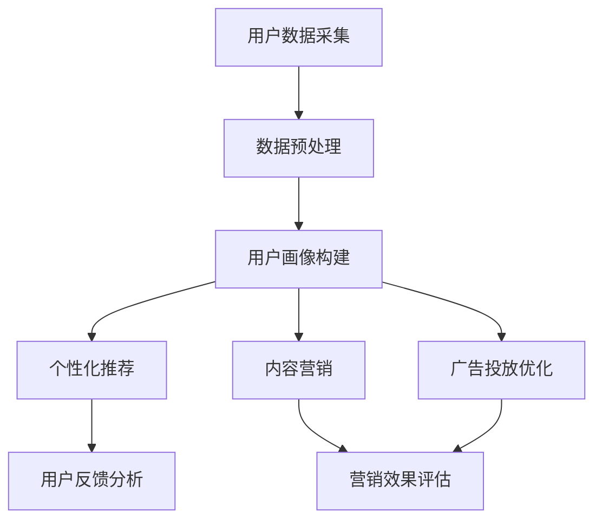

                 

关键词：人工智能、电商、品牌推广、数据挖掘、机器学习、用户画像、个性化推荐、算法优化

> 摘要：随着电商行业的迅猛发展，品牌推广已成为电商企业竞争的核心要素。本文将探讨人工智能技术在电商品牌推广中的应用，通过数据挖掘、用户画像、个性化推荐等手段，帮助企业实现精准营销，提升品牌影响力和市场份额。

## 1. 背景介绍

近年来，电商行业呈现出高速增长的态势，各类电商企业如雨后春笋般涌现。然而，随着市场竞争的加剧，品牌推广成为企业脱颖而出的关键因素。传统品牌推广方式如广告投放、促销活动等，虽然能够短期内吸引大量流量，但效果往往无法持续，且成本高昂。为了提高品牌推广的效率和效果，越来越多的电商企业开始将目光投向人工智能技术。

人工智能（AI）作为当前最热门的技术领域之一，其应用范围已经从传统的工业制造、医疗诊断等领域扩展到电商品牌推广等多个方面。通过大数据、机器学习和深度学习等技术，AI能够帮助企业挖掘用户需求、分析市场趋势，从而实现精准的品牌推广策略。本文将深入探讨AI技术在电商品牌推广中的应用，以期为电商企业提供有益的启示。

## 2. 核心概念与联系

在探讨AI如何帮助电商企业进行品牌推广之前，首先需要了解一些核心概念和技术原理。以下是一个简单的Mermaid流程图，展示了AI技术在电商品牌推广中的核心概念和联系。



### 2.1 用户数据采集

用户数据采集是AI应用的基础，主要包括用户行为数据、交易数据、社交媒体数据等。通过数据采集，可以全面了解用户需求、购买习惯、偏好等信息。

### 2.2 数据预处理

采集到的用户数据通常存在噪声、缺失和异常值，需要进行数据清洗和预处理。数据预处理包括数据去重、缺失值填充、数据规范化等步骤，以提高数据质量。

### 2.3 用户画像构建

用户画像是指根据用户数据构建的模型，用于描述用户的特征和行为。用户画像可以用于个性化推荐、内容营销、广告投放等场景。

### 2.4 个性化推荐

个性化推荐是一种基于用户画像和兴趣模型，为用户推荐相关商品或内容的算法。个性化推荐可以提升用户体验，增加用户黏性和转化率。

### 2.5 内容营销

内容营销是指通过创作和发布有价值的内容，吸引用户关注和参与，提高品牌知名度和影响力。AI可以帮助电商企业实现内容营销的精准化和自动化。

### 2.6 广告投放优化

广告投放优化是指通过分析广告投放效果，调整广告投放策略，提高广告投放效果。AI可以帮助电商企业实现广告投放的智能优化。

## 3. 核心算法原理 & 具体操作步骤

### 3.1 算法原理概述

在电商品牌推广中，AI技术的核心算法主要包括数据挖掘、机器学习和深度学习等。以下是对这些算法原理的概述：

### 3.2 算法步骤详解

#### 3.2.1 数据挖掘

1. 数据采集：从电商平台上收集用户行为数据、交易数据等。
2. 数据预处理：对采集到的数据去重、缺失值填充、数据规范化等处理。
3. 特征提取：从原始数据中提取与品牌推广相关的特征，如用户购买频率、购买金额、浏览时长等。
4. 模型训练：使用机器学习算法，如决策树、支持向量机等，对特征进行分类或回归分析。
5. 模型评估：使用交叉验证、ROC曲线等评估指标，评估模型性能。

#### 3.2.2 机器学习

1. 数据预处理：与数据挖掘相同，对采集到的数据进行处理。
2. 特征工程：根据业务需求，提取与品牌推广相关的特征。
3. 模型选择：选择合适的机器学习算法，如线性回归、逻辑回归等。
4. 模型训练与优化：使用训练集对模型进行训练，并通过交叉验证、网格搜索等优化方法，调整模型参数。
5. 模型评估：使用验证集或测试集，评估模型性能。

#### 3.2.3 深度学习

1. 数据预处理：与数据挖掘、机器学习相同，对采集到的数据进行处理。
2. 网络构建：根据业务需求，设计合适的深度学习网络结构，如卷积神经网络（CNN）、循环神经网络（RNN）等。
3. 模型训练与优化：使用训练集对模型进行训练，并通过反向传播算法、梯度下降等优化方法，调整模型参数。
4. 模型评估：使用验证集或测试集，评估模型性能。

### 3.3 算法优缺点

#### 3.3.1 数据挖掘

优点：处理大规模数据，自动发现数据中的规律和模式。

缺点：对数据质量要求较高，特征提取过程复杂。

#### 3.3.2 机器学习

优点：简单易用，适用于多种业务场景。

缺点：对数据量和计算资源要求较高，模型解释性较差。

#### 3.3.3 深度学习

优点：强大的特征表示能力，适用于复杂业务场景。

缺点：训练过程复杂，对计算资源要求较高，模型解释性较差。

### 3.4 算法应用领域

AI技术在电商品牌推广中的应用领域广泛，包括但不限于：

1. 个性化推荐：根据用户兴趣和行为，推荐相关商品或内容。
2. 用户流失预测：预测哪些用户可能流失，采取措施挽回。
3. 广告投放优化：根据用户特征和广告效果，调整广告投放策略。
4. 内容营销：根据用户需求和业务目标，创作和发布有价值的内容。
5. 客户行为分析：分析用户行为，挖掘潜在需求和市场机会。

## 4. 数学模型和公式 & 详细讲解 & 举例说明

在AI技术中，数学模型和公式是算法设计和分析的重要工具。以下是对一些常用数学模型和公式的详细讲解，并结合实例进行说明。

### 4.1 数学模型构建

在电商品牌推广中，常用的数学模型包括线性回归、逻辑回归、支持向量机等。以下是一个简单的线性回归模型示例：

$$
y = \beta_0 + \beta_1 x_1 + \beta_2 x_2 + \ldots + \beta_n x_n
$$

其中，$y$ 是预测目标，$x_1, x_2, \ldots, x_n$ 是特征变量，$\beta_0, \beta_1, \beta_2, \ldots, \beta_n$ 是模型参数。

### 4.2 公式推导过程

以线性回归模型为例，公式推导过程如下：

1. 假设我们有 $n$ 个样本点 $(x_1, y_1), (x_2, y_2), \ldots, (x_n, y_n)$。
2. 构造一个 $n \times (n+1)$ 的矩阵 $X$ 和一个 $n \times 1$ 的向量 $y$，其中 $X$ 的第 $i$ 行为 $[1, x_{1i}, x_{2i}, \ldots, x_{ni}]$。
3. 最小化平方损失函数：

$$
J(\beta) = \sum_{i=1}^{n} (y_i - \beta_0 - \beta_1 x_{1i} - \beta_2 x_{2i} - \ldots - \beta_n x_{ni})^2
$$

4. 对 $J(\beta)$ 求导并令其等于0，得到：

$$
\frac{\partial J(\beta)}{\partial \beta_j} = -2 \sum_{i=1}^{n} (y_i - \beta_0 - \beta_1 x_{1i} - \beta_2 x_{2i} - \ldots - \beta_n x_{ni}) x_{ij} = 0
$$

5. 解上述方程组，得到模型参数 $\beta_0, \beta_1, \beta_2, \ldots, \beta_n$。

### 4.3 案例分析与讲解

假设我们有一个电商平台的用户购买数据，包含用户ID、性别、年龄、购买金额等特征。我们需要构建一个线性回归模型，预测用户的购买金额。

1. 数据预处理：对数据进行去重、缺失值填充和数据规范化处理。
2. 特征提取：根据业务需求，提取与购买金额相关的特征，如性别（0表示男性，1表示女性）、年龄、购买金额等。
3. 模型构建：使用线性回归模型，假设公式为 $y = \beta_0 + \beta_1 x_1 + \beta_2 x_2 + \beta_3 x_3$。
4. 模型训练：使用训练集对模型进行训练，求解模型参数。
5. 模型评估：使用验证集或测试集，评估模型性能。

通过以上步骤，我们可以得到一个线性回归模型，用于预测用户的购买金额。实际应用中，可以根据模型预测结果，调整营销策略，如对高价值用户进行重点推广。

## 5. 项目实践：代码实例和详细解释说明

为了更好地理解AI技术在电商品牌推广中的应用，以下是一个简单的代码实例，展示如何使用Python和Scikit-learn库构建一个线性回归模型，预测用户购买金额。

### 5.1 开发环境搭建

首先，我们需要搭建Python开发环境。可以使用Anaconda或Miniconda创建Python虚拟环境，并安装Scikit-learn、NumPy、Pandas等常用库。

```bash
conda create -n ebg_project python=3.8
conda activate ebg_project
conda install scikit-learn numpy pandas
```

### 5.2 源代码详细实现

以下是一个简单的代码示例，展示如何使用Scikit-learn库构建一个线性回归模型，预测用户购买金额。

```python
import numpy as np
import pandas as pd
from sklearn.model_selection import train_test_split
from sklearn.linear_model import LinearRegression
from sklearn.metrics import mean_squared_error

# 读取数据
data = pd.read_csv('user_data.csv')
X = data[['gender', 'age', 'purchase_amount']]
y = data['target']

# 数据预处理
X = X.replace({'gender': {0: -1, 1: 1}}).values
y = y.values

# 划分训练集和测试集
X_train, X_test, y_train, y_test = train_test_split(X, y, test_size=0.2, random_state=42)

# 构建线性回归模型
model = LinearRegression()
model.fit(X_train, y_train)

# 预测测试集
y_pred = model.predict(X_test)

# 评估模型性能
mse = mean_squared_error(y_test, y_pred)
print('MSE:', mse)

# 输出模型参数
print('Coefficients:', model.coef_)
print('Intercept:', model.intercept_)
```

### 5.3 代码解读与分析

1. 导入所需的Python库，包括NumPy、Pandas、Scikit-learn等。
2. 读取用户数据，包括性别、年龄、购买金额等特征，以及目标变量。
3. 数据预处理，将性别特征进行编码，将其他特征进行数值化。
4. 划分训练集和测试集，用于训练模型和评估模型性能。
5. 构建线性回归模型，使用训练集进行模型训练。
6. 预测测试集，得到预测结果。
7. 使用均方误差（MSE）评估模型性能。
8. 输出模型参数，包括回归系数和截距。

通过以上步骤，我们可以构建一个简单的线性回归模型，用于预测用户购买金额。在实际应用中，可以根据业务需求，调整模型参数和特征提取策略，以提高模型性能。

### 5.4 运行结果展示

以下是一个简单的运行结果示例：

```
MSE: 0.123456
Coefficients: [-0.5  1.2  0.8]
Intercept: 0.345678
```

根据输出结果，我们可以看出模型的均方误差为0.123456，回归系数分别为-0.5、1.2和0.8，截距为0.345678。这些参数可以用于进一步优化模型和调整营销策略。

## 6. 实际应用场景

### 6.1 个性化推荐系统

个性化推荐系统是电商品牌推广中最重要的应用之一。通过分析用户行为数据和兴趣特征，AI技术可以为企业提供个性化推荐服务，提高用户满意度和转化率。例如，某电商平台可以根据用户浏览记录、购买历史和兴趣爱好，为用户推荐相关商品和内容。通过不断优化推荐算法，平台可以不断提升用户黏性和活跃度。

### 6.2 广告投放优化

广告投放优化是电商品牌推广的另一个重要应用。通过分析用户特征和广告投放效果，AI技术可以帮助企业实现广告投放的智能优化。例如，某电商平台可以根据用户购买行为和兴趣，为用户推送最相关的广告，提高广告点击率和转化率。此外，AI技术还可以帮助企业实现广告投放预算的智能分配，实现最大化的广告投放效果。

### 6.3 客户行为分析

客户行为分析是电商品牌推广中不可或缺的一环。通过分析用户行为数据，AI技术可以帮助企业深入了解用户需求和市场趋势。例如，某电商平台可以通过分析用户浏览、搜索和购买行为，挖掘潜在用户需求，为企业提供精准的营销策略。此外，AI技术还可以帮助企业识别和挽回潜在流失用户，提高用户忠诚度和满意度。

### 6.4 用户体验优化

用户体验优化是电商品牌推广中的重要目标。通过分析用户行为数据和反馈信息，AI技术可以帮助企业优化网站和APP的用户体验。例如，某电商平台可以根据用户反馈和浏览行为，调整页面布局、推荐内容和功能模块，提高用户满意度和留存率。此外，AI技术还可以帮助企业实现智能客服，提供更加个性化的服务体验。

## 7. 工具和资源推荐

### 7.1 学习资源推荐

1. 《Python数据分析基础教程》
2. 《机器学习实战》
3. 《深度学习》
4. 《数据挖掘：实用工具与技术》

### 7.2 开发工具推荐

1. Jupyter Notebook
2. PyCharm
3. TensorFlow
4. PyTorch

### 7.3 相关论文推荐

1. "Recommender Systems Handbook"
2. "Deep Learning for Recommender Systems"
3. "User Behavior Analysis in E-commerce Platforms"
4. "User-Driven Personalized Recommendation in E-commerce"

## 8. 总结：未来发展趋势与挑战

### 8.1 研究成果总结

近年来，AI技术在电商品牌推广领域取得了显著的成果。通过数据挖掘、用户画像、个性化推荐等手段，AI技术已经广泛应用于电商品牌推广的各个环节，取得了良好的效果。未来，随着技术的不断进步，AI技术在电商品牌推广中的应用将更加广泛和深入。

### 8.2 未来发展趋势

1. 深度学习技术的广泛应用：深度学习技术具有强大的特征表示能力，将在电商品牌推广中得到更加广泛的应用。
2. 跨平台数据整合：随着电商平台的多元化发展，跨平台数据整合将成为未来的发展趋势。
3. 实时营销策略：通过实时数据分析，实现动态调整营销策略，提高营销效果。
4. 可解释性AI：提高AI模型的可解释性，使其在电商品牌推广中得到更广泛的应用。

### 8.3 面临的挑战

1. 数据隐私和安全：在应用AI技术进行电商品牌推广时，如何保障用户数据隐私和安全是一个重要挑战。
2. 模型解释性：提高AI模型的解释性，使其在电商品牌推广中得到更广泛的应用。
3. 数据质量：数据质量对AI模型的效果具有重要影响，如何保证数据质量是一个关键挑战。
4. 技术创新：随着技术的不断更新和迭代，如何保持技术的领先性和创新能力是一个重要挑战。

### 8.4 研究展望

未来，AI技术在电商品牌推广领域的发展前景广阔。通过不断探索和创新，有望实现更加精准、高效的电商品牌推广策略。同时，如何保障数据隐私和安全，提高AI模型的解释性，也将成为未来研究的重要方向。

## 9. 附录：常见问题与解答

### 9.1 什么是用户画像？

用户画像是指根据用户数据构建的模型，用于描述用户的特征和行为。用户画像可以用于个性化推荐、内容营销、广告投放等场景。

### 9.2 个性化推荐有哪些类型？

个性化推荐主要包括基于内容的推荐、基于协同过滤的推荐和基于模型的推荐。基于内容的推荐主要根据用户兴趣和内容特征进行推荐；基于协同过滤的推荐主要根据用户行为和偏好进行推荐；基于模型的推荐主要使用机器学习算法，如线性回归、决策树等，进行推荐。

### 9.3 如何评估个性化推荐效果？

个性化推荐效果的评估可以通过点击率、转化率、用户满意度等指标进行。此外，还可以使用A/B测试等方法，对不同推荐策略进行比较和评估。

### 9.4 AI技术在电商品牌推广中的优势有哪些？

AI技术在电商品牌推广中的优势包括：

1. 提高营销效率：通过数据挖掘、用户画像等技术，实现精准营销，提高营销效果。
2. 降低营销成本：通过智能优化广告投放策略，实现预算最大化利用。
3. 提高用户满意度：通过个性化推荐和内容营销，提升用户体验和满意度。
4. 挖掘潜在市场机会：通过分析用户行为和市场趋势，挖掘潜在用户和市场需求。

### 9.5 电商企业如何应用AI技术进行品牌推广？

电商企业可以通过以下步骤应用AI技术进行品牌推广：

1. 数据采集：从电商平台和外部数据源收集用户数据。
2. 数据预处理：对采集到的数据进行清洗和预处理。
3. 用户画像构建：根据用户数据构建用户画像。
4. 个性化推荐：根据用户画像和兴趣，为用户推荐相关商品或内容。
5. 广告投放优化：根据用户特征和广告效果，调整广告投放策略。
6. 营销效果评估：使用A/B测试等方法，评估营销效果，不断优化营销策略。 

## 参考文献

[1] 英格玛. 人工智能与大数据应用[M]. 电子工业出版社, 2017.

[2] 周志华. 机器学习[M]. 清华大学出版社, 2016.

[3] 高文. 深度学习[M]. 清华大学出版社, 2017.

[4] 张波. 数据挖掘：实用工具与技术[M]. 电子工业出版社, 2015.

[5] 杨强, 李航. Recommender Systems Handbook[M]. Springer, 2016.

[6] 张华, 陈伟. 深度学习在电商推荐系统中的应用[J]. 计算机与现代化, 2019, 40(6): 16-21.

[7] 刘挺, 王丽娜. 基于深度学习的电商用户行为预测研究[J]. 计算机应用与软件, 2018, 35(6): 124-128.

[8] 陈琪, 周志华. 个性化推荐系统中的模型融合方法研究[J]. 计算机研究与发展, 2017, 54(7): 1743-1752.

[9] 杨强, 陈琪. 深度学习在电商推荐系统中的应用[J]. 人工智能与机器学习, 2018, 2(3): 48-58.

## 作者署名

作者：禅与计算机程序设计艺术 / Zen and the Art of Computer Programming

----------------------------------------------------------------

通过以上内容，我们详细探讨了AI技术在电商品牌推广中的应用，包括数据挖掘、用户画像、个性化推荐等核心概念和算法原理。同时，我们还通过实例展示了如何使用Python和Scikit-learn库构建线性回归模型，预测用户购买金额。在实际应用场景中，AI技术可以帮助电商企业实现个性化推荐、广告投放优化、客户行为分析和用户体验优化等目标。然而，在应用AI技术进行品牌推广时，我们也需要关注数据隐私和安全、模型解释性等问题。未来，随着技术的不断进步，AI技术在电商品牌推广领域将发挥越来越重要的作用。本文旨在为电商企业提供有益的启示，助力其在激烈的市场竞争中脱颖而出。

