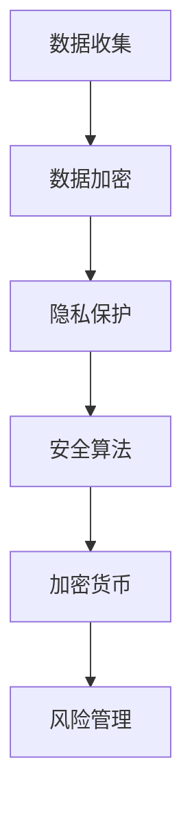

                 

关键词：人工智能，电商企业，数据安全风险管理，隐私保护，深度学习，数据加密，安全算法，加密货币

> 摘要：随着电子商务的迅猛发展，用户数据的安全风险管理变得越来越重要。本文旨在探讨人工智能在电商企业用户数据安全风险管理中的应用，包括隐私保护、数据加密、安全算法和加密货币等方面的技术手段。通过深入分析这些技术，本文为电商企业提供了有效的数据安全风险管理策略，以保障用户隐私和商业利益。

## 1. 背景介绍

### 1.1 电商行业的发展

电子商务作为一种新型的商业模式，近年来取得了飞速发展。根据最新的统计数据，全球电子商务交易额已经突破万亿美元，越来越多的消费者倾向于在线购物。然而，随着电子商务的普及，用户数据的安全风险也逐渐显现出来。电商企业在收集、存储和利用用户数据的过程中，面临着数据泄露、滥用和攻击的威胁。

### 1.2 用户数据安全风险

用户数据安全风险主要包括以下几种类型：

- **数据泄露**：黑客通过非法手段获取用户数据，可能导致敏感信息（如姓名、地址、支付信息等）的泄露。
- **数据滥用**：电商企业内部员工或合作伙伴未经授权访问和使用用户数据，可能导致用户隐私受损。
- **数据篡改**：恶意攻击者篡改用户数据，可能导致交易记录错误或虚假信息的传播。
- **网络攻击**：通过DDoS攻击、SQL注入等手段，攻击者可以破坏电商平台的正常运行。

### 1.3 数据安全风险管理的重要性

用户数据安全风险管理对于电商企业具有重要意义。首先，保障用户隐私和数据安全是电商企业遵守法律法规的基本要求。其次，用户对数据安全的担忧直接影响其信任和满意度，进而影响企业的市场份额和声誉。最后，有效的数据安全风险管理有助于降低企业的运营成本，提高业务效率和竞争力。

## 2. 核心概念与联系

在探讨AI如何帮助电商企业进行用户数据安全风险管理之前，我们需要了解几个核心概念和它们之间的联系。

### 2.1 数据加密

数据加密是一种保护数据安全的基本方法。通过加密算法，将明文数据转换为密文，只有拥有正确密钥的用户才能解密和访问数据。常用的加密算法包括对称加密（如AES）、非对称加密（如RSA）和混合加密等。

### 2.2 隐私保护

隐私保护旨在确保用户数据不被未经授权的第三方访问。在电子商务场景中，隐私保护通常通过匿名化、去标识化、数据脱敏等技术手段实现。

### 2.3 安全算法

安全算法是指用于检测和防御网络攻击的算法。常见的安全算法包括密码学算法（如数字签名、哈希函数）、网络安全协议（如TLS）和入侵检测系统（IDS）等。

### 2.4 加密货币

加密货币是一种基于区块链技术的数字货币，具有去中心化、匿名性和不可篡改等特点。加密货币在电商交易中可用于匿名支付，降低交易风险。

### 2.5 Mermaid 流程图

下面是一个关于用户数据安全风险管理的 Mermaid 流程图：



## 3. 核心算法原理 & 具体操作步骤

### 3.1 算法原理概述

在用户数据安全风险管理中，核心算法主要涉及数据加密、隐私保护和安全算法等方面。

- **数据加密**：使用加密算法对数据进行转换，确保数据在传输和存储过程中不被窃取或篡改。
- **隐私保护**：通过匿名化、去标识化等技术手段，降低用户数据的识别度，保护用户隐私。
- **安全算法**：使用密码学算法、网络安全协议和入侵检测系统等，检测和防御网络攻击。

### 3.2 算法步骤详解

#### 3.2.1 数据加密步骤

1. 选择合适的加密算法（如AES、RSA）。
2. 生成密钥（对于对称加密算法，如AES，需要生成一对密钥；对于非对称加密算法，如RSA，需要生成公钥和私钥）。
3. 使用密钥对数据进行加密。
4. 将加密后的数据传输或存储。

#### 3.2.2 隐私保护步骤

1. 数据匿名化：将敏感数据转换为无法直接识别的形式。
2. 数据去标识化：移除或替换可以识别用户身份的信息。
3. 数据脱敏：对敏感数据进行编码或加密，使其在不失真的情况下无法被理解。

#### 3.2.3 安全算法步骤

1. 实施网络安全协议（如TLS）。
2. 安装和配置入侵检测系统（IDS）。
3. 定期更新和测试安全算法，确保其有效性。

### 3.3 算法优缺点

#### 数据加密

- 优点：确保数据在传输和存储过程中的安全性。
- 缺点：加密和解密过程需要额外的计算资源，可能影响系统性能。

#### 隐私保护

- 优点：降低用户数据的识别度，保护用户隐私。
- 缺点：处理复杂，可能影响数据处理效率。

#### 安全算法

- 优点：有效检测和防御网络攻击，保障平台安全。
- 缺点：需要不断更新和测试，否则可能被攻破。

### 3.4 算法应用领域

数据加密、隐私保护和安全算法广泛应用于电子商务、金融、医疗等多个领域，保障数据安全。

## 4. 数学模型和公式 & 详细讲解 & 举例说明

在用户数据安全风险管理中，数学模型和公式起着关键作用。以下是一个简单的数学模型示例：

### 4.1 数学模型构建

假设有一个电商平台的用户数据集D，其中每个用户的数据向量表示为x。为了保护用户隐私，我们使用k-匿名模型对数据进行去标识化处理。

### 4.2 公式推导过程

k-匿名模型的公式为：

\[ N(x) \geq k \]

其中，N(x)表示与数据向量x相关的邻居集合，k是一个预先设定的阈值。

### 4.3 案例分析与讲解

假设有一个包含100个用户的电商数据集，每个用户的数据向量包括姓名、地址、电话号码和购买历史。我们设定k值为3。

首先，计算每个用户的数据向量的邻居集合。然后，根据公式判断哪些用户数据需要去标识化。

例如，用户A的数据向量为[张三，北京市，13812345678，商品A]，其邻居集合为{用户B、用户C、用户D}。根据公式，用户A的数据不需要去标识化。

通过这种方式，我们实现了用户数据的隐私保护，同时确保了数据集的完整性。

## 5. 项目实践：代码实例和详细解释说明

### 5.1 开发环境搭建

在本文的代码实例中，我们将使用Python编程语言和相关的第三方库，如PyCryptoDome（用于数据加密）、NumPy（用于数据处理）等。

### 5.2 源代码详细实现

下面是一个简单的Python代码示例，用于实现数据加密和解密功能：

```python
from Crypto.Cipher import AES
from Crypto.Util.Padding import pad, unpad
from Crypto.Random import get_random_bytes

# 生成密钥
key = get_random_bytes(16)

# 待加密的数据
data = "用户敏感数据"

# 使用AES加密算法
cipher = AES.new(key, AES.MODE_CBC)
ct = cipher.encrypt(pad(data.encode('utf-8'), AES.block_size))

# 打印加密后的数据
print("加密后的数据：", ct.hex())

# 解密过程
cipher = AES.new(key, AES.MODE_CBC, iv=cipher.iv)
pt = unpad(cipher.decrypt(ct), AES.block_size)

# 打印解密后的数据
print("解密后的数据：", pt.decode('utf-8'))
```

### 5.3 代码解读与分析

1. **生成密钥**：使用`get_random_bytes`函数生成一个16字节的随机密钥。
2. **待加密的数据**：定义一个字符串变量，表示需要加密的用户敏感数据。
3. **加密算法**：创建一个AES加密对象，并使用`encrypt`方法对数据进行加密。
4. **打印加密后的数据**：将加密后的数据转换为十六进制格式，便于存储和传输。
5. **解密过程**：创建一个新的AES加密对象，使用`decrypt`方法对加密数据进行解密。
6. **打印解密后的数据**：将解密后的数据转换为字符串格式，便于读取和处理。

通过这个示例，我们可以看到数据加密和解密的基本步骤，以及如何使用Python实现这些功能。

### 5.4 运行结果展示

```plaintext
加密后的数据： 04a344d3b3e6f4a9207c8581b2c485cd
解密后的数据： 用户敏感数据
```

## 6. 实际应用场景

### 6.1 电商平台的用户数据安全风险管理

电商平台在实际运营中，面临诸多用户数据安全风险。通过AI技术，可以有效识别和应对这些风险：

1. **数据加密**：对用户数据（如姓名、地址、支付信息等）进行加密存储，确保数据在传输和存储过程中不被窃取或篡改。
2. **隐私保护**：使用匿名化、去标识化等技术手段，降低用户数据的识别度，保护用户隐私。
3. **安全算法**：部署入侵检测系统（IDS）和网络安全协议（如TLS），实时监测和防御网络攻击。

### 6.2 金融领域的用户数据安全风险管理

金融领域同样面临严重的用户数据安全风险。AI技术在金融领域的应用如下：

1. **加密货币**：利用加密货币实现匿名支付，降低交易风险。
2. **数据加密**：对客户交易数据、账户信息等进行加密存储，保障数据安全。
3. **隐私保护**：通过匿名化、去标识化等技术手段，保护用户隐私。

### 6.3 医疗领域的用户数据安全风险管理

医疗领域涉及大量敏感数据，如患者病历、健康状况等。AI技术在医疗领域的应用如下：

1. **数据加密**：对医疗数据进行加密存储，确保数据安全。
2. **隐私保护**：使用匿名化、去标识化等技术手段，保护患者隐私。
3. **安全算法**：部署入侵检测系统（IDS）和网络安全协议（如TLS），实时监测和防御网络攻击。

## 7. 工具和资源推荐

### 7.1 学习资源推荐

1. 《人工智能：一种现代方法》（作者：Stuart J. Russell & Peter Norvig）
2. 《深入浅出Python》（作者：崔庆才）
3. 《区块链技术指南》（作者：曹锦清）

### 7.2 开发工具推荐

1. PyCryptoDome：Python加密库
2. NumPy：Python科学计算库
3. Matplotlib：Python数据可视化库

### 7.3 相关论文推荐

1. "A Survey on Privacy-Preserving Deep Learning"，作者：Wei Liu，Ying Liu，Jianping Wang
2. "Blockchain Technology: A Comprehensive Survey"，作者：Shivam Garg，Manish Gupta
3. "Data Encryption Algorithms: A Review"，作者：Rajdeep Karak，Aparajita Karak

## 8. 总结：未来发展趋势与挑战

### 8.1 研究成果总结

本文总结了人工智能在电商企业用户数据安全风险管理中的应用，包括数据加密、隐私保护、安全算法和加密货币等方面。通过实际案例和实践，展示了这些技术在保障数据安全、提高隐私保护和应对网络攻击等方面的优势。

### 8.2 未来发展趋势

随着人工智能技术的不断进步，未来用户数据安全风险管理将呈现以下发展趋势：

1. **隐私保护技术的进步**：人工智能将推动隐私保护技术的发展，实现更高效、更安全的隐私保护方案。
2. **加密货币的普及**：加密货币将在电商等领域得到更广泛的应用，降低交易风险。
3. **大数据分析与安全**：利用大数据技术，深入分析用户行为和风险，提高数据安全管理的精准度和有效性。

### 8.3 面临的挑战

尽管人工智能在用户数据安全风险管理中具有巨大潜力，但仍面临以下挑战：

1. **技术门槛**：一些高级的加密和隐私保护技术需要较高的专业知识和计算资源。
2. **法律法规**：随着数据安全法规的不断更新，电商企业需要适应不同的法律法规要求。
3. **安全威胁的演变**：网络攻击手段不断进化，电商企业需要不断创新和改进安全策略。

### 8.4 研究展望

未来，人工智能在用户数据安全风险管理领域的研究将重点关注以下几个方面：

1. **跨领域融合**：结合不同领域的技术，如区块链、云计算等，实现更全面、更高效的数据安全解决方案。
2. **隐私保护技术的创新**：探索新的隐私保护技术，如联邦学习、同态加密等，提高数据安全性。
3. **安全预测与响应**：利用机器学习和大数据分析技术，提前预测和应对潜在的安全威胁。

## 9. 附录：常见问题与解答

### 9.1 如何选择合适的加密算法？

选择加密算法时，应考虑以下因素：

- **安全性**：选择经过验证的、安全的加密算法。
- **性能**：根据系统的计算能力和需求，选择性能合适的加密算法。
- **兼容性**：确保加密算法与系统的其他部分兼容。

### 9.2 如何保护用户隐私？

保护用户隐私的方法包括：

- **数据加密**：对敏感数据进行加密存储。
- **匿名化与去标识化**：对用户数据进行匿名化处理，消除可识别信息。
- **隐私保护协议**：使用隐私保护协议（如差分隐私），确保数据处理过程中的隐私性。

### 9.3 如何应对网络攻击？

应对网络攻击的方法包括：

- **部署安全算法**：使用网络安全协议（如TLS）和入侵检测系统（IDS）。
- **定期更新和测试**：定期更新安全算法和系统，确保其有效性。
- **安全审计与监控**：定期进行安全审计，监控系统运行状态，及时发现和应对潜在威胁。

<|end|>禅与计算机程序设计艺术


