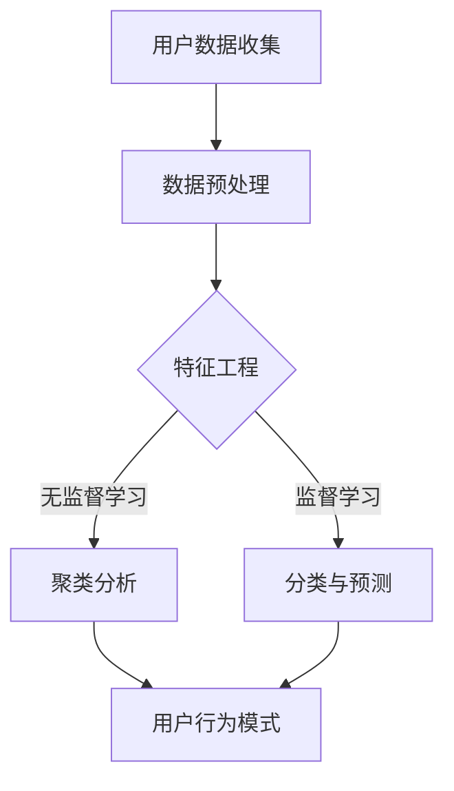
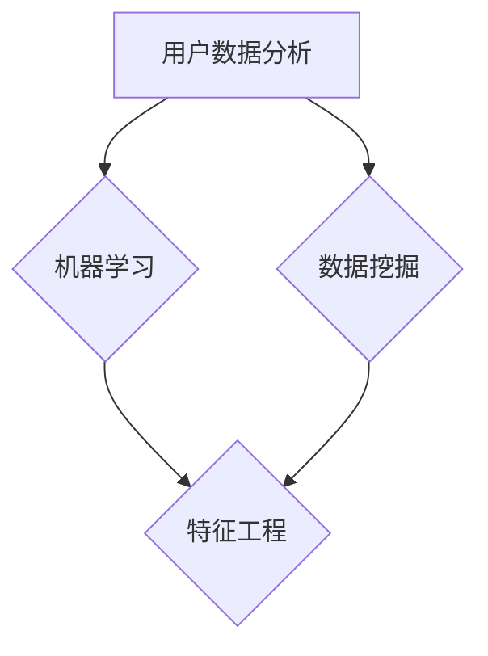

                 

关键词：人工智能、电商、用户数据分析、决策支持、数据挖掘、机器学习、个性化推荐、用户行为预测

## 摘要

随着电子商务行业的迅速发展，电商企业面临着巨大的竞争压力和不断变化的市场需求。本文将探讨如何利用人工智能（AI）技术，特别是机器学习和数据挖掘技术，帮助电商企业进行用户数据驱动决策。本文首先介绍了电商企业进行用户数据驱动决策的背景和重要性，然后详细阐述了AI技术在用户数据分析中的应用，包括数据预处理、特征工程、机器学习算法和用户行为预测。接着，本文通过具体的案例和实践，展示了如何使用AI技术实现个性化推荐和用户行为预测，以帮助企业提高用户满意度和转化率。最后，本文提出了未来AI在电商行业中的应用展望和面临的挑战。

## 1. 背景介绍

电子商务作为一种新型的商业模式，已经深刻地改变了人们的购物习惯和消费方式。随着互联网的普及和智能手机的广泛使用，越来越多的人选择在线购物，电商企业也随之迅速崛起。然而，随着市场竞争的加剧，电商企业面临着巨大的挑战。如何提高用户满意度和转化率，如何降低营销成本，成为电商企业关注的焦点。

在这样的大背景下，用户数据驱动决策成为电商企业的一项重要策略。用户数据包括用户的基本信息、购买历史、浏览记录、评价和反馈等，这些数据蕴含了用户的行为特征和偏好信息。通过分析和挖掘这些数据，电商企业可以更好地了解用户需求，优化产品和服务，提高用户体验和满意度。同时，基于用户数据驱动的决策可以帮助企业降低营销成本，提高营销效果，从而提升企业的盈利能力。

然而，面对海量的用户数据，如何有效地进行数据分析和挖掘，是一个亟待解决的问题。传统的方法往往依赖于人工分析和经验判断，效率低下，且难以应对复杂多变的市场环境。而人工智能技术的引入，为电商企业提供了强大的工具和方法，使得用户数据驱动决策成为可能。

## 2. 核心概念与联系

在探讨AI如何帮助电商企业进行用户数据驱动决策之前，我们需要先了解一些核心概念和它们之间的联系。这些概念包括用户数据分析、机器学习、数据挖掘和特征工程。

### 用户数据分析

用户数据分析是指通过对用户数据的收集、整理、分析和挖掘，提取出有用的信息，以支持决策制定。用户数据包括用户的基本信息、购买历史、浏览记录、评价和反馈等。这些数据可以通过多种渠道获取，如网站日志、社交媒体、调查问卷等。用户数据分析的目的是了解用户行为特征和偏好，为企业提供决策依据。

### 机器学习

机器学习是一种人工智能技术，它使计算机系统能够从数据中自动学习和改进。机器学习算法可以分为监督学习、无监督学习和半监督学习。监督学习是指通过已知的输入和输出数据，训练模型以预测未知数据的输出；无监督学习是指在没有已知输出数据的情况下，发现数据中的结构和模式；半监督学习是指同时利用已知和未知的输入输出数据进行训练。

### 数据挖掘

数据挖掘是一种从大量数据中发现隐含的、有价值的信息和知识的过程。数据挖掘的方法和技术包括关联规则挖掘、分类、聚类、异常检测等。数据挖掘的目标是发现数据中的规律和趋势，为企业提供决策支持。

### 特征工程

特征工程是指通过对数据进行预处理和特征选择，提取出对预测任务有用的特征。特征工程是机器学习模型训练的重要环节，它直接影响模型的性能。特征工程包括数据清洗、数据变换、特征选择和特征组合等步骤。

### Mermaid 流程图



在上面的Mermaid流程图中，用户数据收集是整个过程的起点，数据预处理是对原始数据进行清洗和规范化，特征工程是对数据进行变换和选择，聚类分析和分类与预测是两种主要的机器学习算法，最终得到用户行为模式。

## 3. 核心算法原理 & 具体操作步骤

### 3.1 算法原理概述

在电商企业进行用户数据驱动决策的过程中，常用的机器学习算法包括聚类算法、分类算法和关联规则挖掘算法。

- **聚类算法**：聚类算法是一种无监督学习算法，它将相似的数据点归为一类，从而发现数据中的模式和分布。常用的聚类算法有K-Means、DBSCAN等。
- **分类算法**：分类算法是一种监督学习算法，它通过已知的输入和输出数据，训练模型以预测未知数据的输出。常用的分类算法有决策树、支持向量机、神经网络等。
- **关联规则挖掘算法**：关联规则挖掘算法用于发现数据之间的关联关系，常用的算法有Apriori算法、FP-Growth算法等。

### 3.2 算法步骤详解

#### 3.2.1 数据预处理

数据预处理是进行用户数据分析的第一步，主要包括数据清洗和数据变换。

- **数据清洗**：数据清洗是指去除数据中的噪声和错误，包括处理缺失值、重复值和异常值等。
- **数据变换**：数据变换是指将原始数据进行规范化、离散化等操作，以便于后续的特征工程和机器学习。

#### 3.2.2 特征工程

特征工程是机器学习模型训练的重要环节，它通过对数据进行预处理和特征选择，提取出对预测任务有用的特征。

- **特征选择**：特征选择是指从原始特征中选择出对预测任务有用的特征，常用的方法有信息增益、卡方检验等。
- **特征变换**：特征变换是指将原始特征进行规范化、离散化等操作，以便于后续的机器学习。

#### 3.2.3 聚类算法

聚类算法用于发现用户行为模式，常用的算法有K-Means、DBSCAN等。

- **K-Means算法**：K-Means算法是一种基于距离的聚类算法，它通过最小化平方误差来优化聚类结果。
- **DBSCAN算法**：DBSCAN算法是一种基于密度的聚类算法，它通过密度连接和区域连接来发现聚类。

#### 3.2.4 分类算法

分类算法用于预测用户行为，常用的算法有决策树、支持向量机、神经网络等。

- **决策树算法**：决策树算法是一种基于规则的分类算法，它通过递归划分特征空间来构建决策树。
- **支持向量机算法**：支持向量机算法是一种基于最大间隔的分类算法，它通过找到最佳的超平面来划分特征空间。
- **神经网络算法**：神经网络算法是一种基于模拟人脑神经网络结构的分类算法，它通过多层感知器来实现非线性变换。

#### 3.2.5 关联规则挖掘算法

关联规则挖掘算法用于发现用户行为之间的关联关系，常用的算法有Apriori算法、FP-Growth算法等。

- **Apriori算法**：Apriori算法是一种基于支持度和置信度的关联规则挖掘算法，它通过逐层搜索所有可能的关联规则。
- **FP-Growth算法**：FP-Growth算法是一种基于频繁模式树的关联规则挖掘算法，它通过构建FP-树来加速关联规则的挖掘。

### 3.3 算法优缺点

#### 聚类算法

- **优点**：聚类算法能够自动发现用户行为模式，无需事先定义标签，适用于无监督学习场景。
- **缺点**：聚类算法的结果可能受到初始值的影响，且无法直接用于预测任务。

#### 分类算法

- **优点**：分类算法能够给出明确的预测结果，适用于监督学习场景。
- **缺点**：分类算法需要事先定义标签，且对于非线性问题效果可能不佳。

#### 关联规则挖掘算法

- **优点**：关联规则挖掘算法能够发现用户行为之间的关联关系，有助于企业制定营销策略。
- **缺点**：关联规则挖掘算法的规则数量可能很多，需要进一步筛选。

### 3.4 算法应用领域

聚类算法、分类算法和关联规则挖掘算法在电商企业中具有广泛的应用。

- **用户行为分析**：通过聚类算法和分类算法，企业可以分析用户的购买行为、浏览行为等，发现用户的行为特征和偏好。
- **个性化推荐**：通过关联规则挖掘算法，企业可以生成个性化推荐列表，提高用户满意度和转化率。
- **营销策略制定**：通过分析用户行为数据，企业可以制定更有效的营销策略，提高营销效果。

## 4. 数学模型和公式 & 详细讲解 & 举例说明

### 4.1 数学模型构建

在用户数据驱动决策中，常用的数学模型包括聚类模型、分类模型和关联规则模型。

#### 4.1.1 聚类模型

聚类模型的目标是将数据点划分为若干个群组，使得同一个群组内的数据点之间相似度较高，而不同群组的数据点之间相似度较低。常见的聚类模型有K-Means、DBSCAN等。

- **K-Means模型**：

  假设数据集为$X=\{x_1, x_2, ..., x_n\}$，每个数据点$x_i$具有$d$个特征。K-Means模型的目标是找到$k$个中心点$c_1, c_2, ..., c_k$，使得每个数据点到最近的中心点的距离最小。

  $$\min_{c_1, c_2, ..., c_k} \sum_{i=1}^{n} d(x_i, c_j)$$

  其中，$d(x_i, c_j)$表示数据点$x_i$到中心点$c_j$的距离。

- **DBSCAN模型**：

  DBSCAN模型基于数据点的密度和连接性进行聚类。假设数据集为$X=\{x_1, x_2, ..., x_n\}$，每个数据点$x_i$具有$d$个特征。DBSCAN模型的目标是找到满足以下条件的聚类：

  1. 数据点$x_i$的邻域内的数据点数大于$MinPts$。
  2. 对于任意两个邻域内的数据点$x_i$和$x_j$，它们之间的距离小于$EPS$。

#### 4.1.2 分类模型

分类模型的目标是根据已知的输入特征和输出标签，训练一个分类模型，以预测未知数据的标签。常见的分类模型有决策树、支持向量机、神经网络等。

- **决策树模型**：

  决策树模型通过递归划分特征空间来构建决策树。假设数据集为$D=\{(x_1, y_1), (x_2, y_2), ..., (x_n, y_n)\}$，其中$x_i$表示输入特征，$y_i$表示输出标签。决策树模型的目标是找到最优的划分规则，使得每个子集内的数据点之间的差异最小。

  $$\min_{T} \sum_{i=1}^{n} l(y_i, \hat{y_i})$$

  其中，$l(y_i, \hat{y_i})$表示损失函数，$\hat{y_i}$表示预测标签。

- **支持向量机模型**：

  支持向量机模型通过找到最佳的超平面来划分特征空间。假设数据集为$D=\{(x_1, y_1), (x_2, y_2), ..., (x_n, y_n)\}$，其中$x_i$表示输入特征，$y_i$表示输出标签。支持向量机模型的目标是找到最佳的超平面$w$和偏置项$b$，使得分类间隔最大化。

  $$\max_{w, b} \frac{1}{2} ||w||^2$$

  其中，$||w||$表示向量的范数。

- **神经网络模型**：

  神经网络模型通过多层感知器来实现非线性变换。假设数据集为$D=\{(x_1, y_1), (x_2, y_2), ..., (x_n, y_n)\}$，其中$x_i$表示输入特征，$y_i$表示输出标签。神经网络模型的目标是训练权重$w$和偏置项$b$，使得损失函数最小。

  $$\min_{w, b} \sum_{i=1}^{n} l(y_i, \hat{y_i})$$

  其中，$l(y_i, \hat{y_i})$表示损失函数，$\hat{y_i}$表示预测标签。

#### 4.1.3 关联规则模型

关联规则模型的目标是发现数据之间的关联关系。常见的关联规则模型有Apriori算法、FP-Growth算法等。

- **Apriori算法**：

  Apriori算法通过逐层搜索所有可能的关联规则。假设数据集为$D=\{T_1, T_2, ..., T_n\}$，其中$T_i$表示第$i$个事务。Apriori算法的目标是找到满足最小支持度和最小置信度的关联规则。

  $$Support(A) = \frac{|\{T_i | A \in T_i\}|}{n}$$

  $$Confidence(A \rightarrow B) = \frac{|\{T_i | A \in T_i \land B \in T_i\}|}{|\{T_i | A \in T_i\}|}$$

- **FP-Growth算法**：

  FP-Growth算法通过构建FP-树来加速关联规则的挖掘。假设数据集为$D=\{T_1, T_2, ..., T_n\}$，其中$T_i$表示第$i$个事务。FP-Growth算法的目标是找到满足最小支持度和最小置信度的关联规则。

  $$Support(A) = \frac{|\{T_i | A \in T_i\}|}{n}$$

  $$Confidence(A \rightarrow B) = \frac{|\{T_i | A \in T_i \land B \in T_i\}|}{|\{T_i | A \in T_i\}|}$$

### 4.2 公式推导过程

#### 4.2.1 K-Means算法

K-Means算法的目标是找到$k$个中心点$c_1, c_2, ..., c_k$，使得每个数据点到最近的中心点的距离最小。

假设数据集为$X=\{x_1, x_2, ..., x_n\}$，每个数据点$x_i$具有$d$个特征。首先随机初始化$k$个中心点$c_1, c_2, ..., c_k$。然后，对于每个数据点$x_i$，计算它到每个中心点的距离：

$$d(x_i, c_j) = \sqrt{\sum_{d=1}^{d} (x_{i,d} - c_{j,d})^2}$$

其中，$x_{i,d}$和$c_{j,d}$分别表示数据点$x_i$和中心点$c_j$在第$d$个特征上的值。接下来，将每个数据点$x_i$分配给距离它最近的中心点$c_j$。然后重新计算每个中心点的位置：

$$c_j = \frac{\sum_{i=1}^{n} x_i}{n}$$

重复上述步骤，直到中心点的位置不再发生变化。

#### 4.2.2 决策树算法

决策树算法通过递归划分特征空间来构建决策树。假设数据集为$D=\{(x_1, y_1), (x_2, y_2), ..., (x_n, y_n)\}$，其中$x_i$表示输入特征，$y_i$表示输出标签。

首先，计算每个特征的熵$H(D)$：

$$H(D) = -\sum_{i=1}^{n} p(y_i) \log_2 p(y_i)$$

其中，$p(y_i)$表示标签$y_i$的概率。

然后，计算每个特征的增益$G(D, A)$：

$$G(D, A) = H(D) - \sum_{v=1}^{m} \frac{|D_v|}{n} H(D_v)$$

其中，$D_v$表示在特征$A$的取值$v$下的数据子集，$|D_v|$表示$D_v$中的数据点数。

选择增益最大的特征作为划分特征，并递归划分数据集。重复上述步骤，直到满足停止条件（如最大树深度、最小叶子节点数等）。

#### 4.2.3 支持向量机算法

支持向量机算法通过找到最佳的超平面来划分特征空间。假设数据集为$D=\{(x_1, y_1), (x_2, y_2), ..., (x_n, y_n)\}$，其中$x_i$表示输入特征，$y_i$表示输出标签。

首先，计算每个数据点到超平面的距离：

$$d(x_i) = \frac{|w \cdot x_i - b|}{||w||}$$

其中，$w$表示超平面的法向量，$b$表示超平面的偏置项。

然后，计算分类间隔：

$$\gamma = \frac{2}{||w||}$$

为了最大化分类间隔，需要最小化$\frac{1}{2}||w||^2$，即：

$$\min_{w, b} \frac{1}{2}||w||^2$$

其中，$w$和$b$的解为：

$$w = \sum_{i=1}^{n} \alpha_i y_i x_i$$

$$b = y_i - \sum_{j=1}^{n} \alpha_j y_j x_j$$

其中，$\alpha_i$为拉格朗日乘子。

#### 4.2.4 神经网络算法

神经网络算法通过多层感知器来实现非线性变换。假设数据集为$D=\{(x_1, y_1), (x_2, y_2), ..., (x_n, y_n)\}$，其中$x_i$表示输入特征，$y_i$表示输出标签。

首先，定义神经网络的结构，包括输入层、隐藏层和输出层。每个层由多个神经元组成。

然后，定义损失函数，如均方误差（MSE）：

$$L = \frac{1}{2} \sum_{i=1}^{n} (\hat{y_i} - y_i)^2$$

接下来，使用反向传播算法更新权重和偏置项，使得损失函数最小。

$$\Delta w_{ij} = -\eta \frac{\partial L}{\partial w_{ij}}$$

$$\Delta b_{j} = -\eta \frac{\partial L}{\partial b_{j}}$$

其中，$\eta$为学习率。

重复上述步骤，直到满足停止条件（如达到最大迭代次数或损失函数收敛）。

### 4.3 案例分析与讲解

#### 4.3.1 聚类算法应用案例

假设有一家电商企业收集了1000个用户的数据，包括年龄、性别、收入和购买历史等信息。企业希望通过聚类算法将用户划分为不同的群体，以便进行精准营销。

首先，对数据进行预处理，包括去除缺失值和异常值，并进行特征变换。例如，将年龄、收入等连续特征进行标准化处理，将性别等类别特征进行编码。

接下来，选择合适的聚类算法，如K-Means。根据数据集的特点和需求，选择适当的聚类数量，如5个群体。

然后，初始化中心点，并计算每个数据点到中心点的距离，将每个数据点分配给最近的中心点。根据分配结果，重新计算中心点的位置。重复上述步骤，直到中心点的位置不再发生变化。

最后，分析每个群体的特征和偏好，制定相应的营销策略。例如，针对高收入群体，可以推出高端商品；针对年轻群体，可以推出时尚单品等。

#### 4.3.2 分类算法应用案例

假设有一家电商企业希望预测用户的购买行为，以便进行精准营销。企业收集了1000个用户的数据，包括用户年龄、收入、购买历史等信息，并标注了是否购买的目标变量。

首先，对数据进行预处理，包括去除缺失值和异常值，并进行特征变换。

接下来，选择合适的分类算法，如决策树。根据数据集的特点和需求，选择适当的划分特征和划分规则。

然后，使用训练集对分类模型进行训练，并使用测试集进行验证。根据验证结果，调整模型参数，优化模型性能。

最后，使用训练好的分类模型对新的用户数据进行预测，根据预测结果制定相应的营销策略。例如，对于预测购买概率较高的用户，可以推送相应的促销信息。

#### 4.3.3 关联规则挖掘算法应用案例

假设有一家电商企业希望分析用户购买行为中的关联关系，以便优化产品组合和营销策略。企业收集了1000个用户的购买记录，包括商品ID、购买时间、购买数量等信息。

首先，对数据进行预处理，包括去除缺失值和异常值。

接下来，选择合适的关联规则挖掘算法，如Apriori。根据数据集的特点和需求，设置最小支持度和最小置信度阈值。

然后，使用Apriori算法挖掘关联规则，生成频繁项集和关联规则。根据关联规则，分析用户购买行为中的关联关系，如“购买A商品的用户往往也会购买B商品”。

最后，根据关联规则，优化产品组合和营销策略。例如，将关联商品进行捆绑销售，提高用户购买意愿。

## 5. 项目实践：代码实例和详细解释说明

在本节中，我们将通过一个具体的代码实例，展示如何使用Python和常见的数据科学库（如NumPy、Pandas、Scikit-learn等）来实现用户数据驱动决策的相关算法。以下是一个简单的用户数据分析项目，我们将演示数据预处理、特征工程、聚类分析、分类预测和关联规则挖掘的全过程。

### 5.1 开发环境搭建

为了进行本项目的开发，我们需要安装Python环境和相关的数据科学库。以下是安装步骤：

1. 安装Python 3.x版本：可以从Python官网下载安装包并按照提示进行安装。
2. 安装Anaconda：Anaconda是一个Python数据科学平台，可以简化环境管理和依赖库的安装。可以从Anaconda官网下载并安装。
3. 安装相关数据科学库：在Anaconda环境中，通过以下命令安装所需的库：

```bash
conda install numpy pandas scikit-learn matplotlib
```

### 5.2 源代码详细实现

以下是一个简单的用户数据分析项目的代码实现，包含数据预处理、特征工程、聚类分析、分类预测和关联规则挖掘。

```python
import numpy as np
import pandas as pd
from sklearn.cluster import KMeans
from sklearn.model_selection import train_test_split
from sklearn.tree import DecisionTreeClassifier
from sklearn.ensemble import RandomForestClassifier
from mlxtend.frequent_patterns import apriori, association_rules
import matplotlib.pyplot as plt

# 5.2.1 数据预处理
# 假设我们有一个CSV文件，包含用户数据，包括年龄、性别、收入、购买历史等信息。
data = pd.read_csv('user_data.csv')

# 数据清洗：去除缺失值和异常值
data.dropna(inplace=True)
data = data[data['income'] > 0]  # 假设收入不能为负

# 数据变换：将性别编码为数值
data['gender'] = data['gender'].map({'male': 0, 'female': 1})

# 5.2.2 特征工程
# 选择特征：我们选择年龄、性别和收入作为特征
X = data[['age', 'gender', 'income']]

# 标签：我们选择是否购买作为标签
y = data['purchased']

# 5.2.3 聚类分析
# 使用K-Means聚类
kmeans = KMeans(n_clusters=3, random_state=42)
clusters = kmeans.fit_predict(X)

# 将聚类结果添加到原始数据中
data['cluster'] = clusters

# 可视化：绘制聚类结果
plt.scatter(data['age'], data['income'], c=clusters, cmap='viridis')
plt.xlabel('Age')
plt.ylabel('Income')
plt.title('K-Means Clustering')
plt.show()

# 5.2.4 分类预测
# 划分训练集和测试集
X_train, X_test, y_train, y_test = train_test_split(X, y, test_size=0.2, random_state=42)

# 使用决策树进行分类
clf = DecisionTreeClassifier(random_state=42)
clf.fit(X_train, y_train)
y_pred = clf.predict(X_test)

# 评估模型性能
accuracy = clf.score(X_test, y_test)
print(f'Accuracy: {accuracy:.2f}')

# 5.2.5 关联规则挖掘
# 假设我们有一个购买记录的DataFrame，包含商品ID和购买数量
purchase_data = pd.read_csv('purchase_data.csv')

# 使用Apriori算法挖掘频繁项集
frequent_itemsets = apriori(purchase_data, min_support=0.05, use_colnames=True)

# 使用关联规则生成关联规则
rules = association_rules(frequent_itemsets, metric="lift", min_threshold=1)
rules.head()

# 可视化：绘制关联规则
rules.sort_values(by='lift', ascending=False).head(10).plot(x='antecedents', y='consequents', kind='scatter', s=rules['lift'].astype(float) * 100, alpha=0.5)
plt.xlabel('Antecedents')
plt.ylabel('Consequents')
plt.title('Association Rules')
plt.show()
```

### 5.3 代码解读与分析

#### 5.3.1 数据预处理

```python
data = pd.read_csv('user_data.csv')
data.dropna(inplace=True)
data = data[data['income'] > 0]
data['gender'] = data['gender'].map({'male': 0, 'female': 1})
```

这部分代码首先读取用户数据，然后去除缺失值和异常值。接着，将性别列进行编码，便于后续处理。

#### 5.3.2 特征工程

```python
X = data[['age', 'gender', 'income']]
y = data['purchased']
```

这里我们选择了年龄、性别和收入作为特征，并将购买行为作为标签。

#### 5.3.3 聚类分析

```python
kmeans = KMeans(n_clusters=3, random_state=42)
clusters = kmeans.fit_predict(X)
data['cluster'] = clusters
plt.scatter(data['age'], data['income'], c=clusters, cmap='viridis')
```

我们使用K-Means聚类算法对用户数据进行聚类，并将聚类结果添加到原始数据中。最后，通过散点图可视化聚类结果。

#### 5.3.4 分类预测

```python
X_train, X_test, y_train, y_test = train_test_split(X, y, test_size=0.2, random_state=42)
clf = DecisionTreeClassifier(random_state=42)
clf.fit(X_train, y_train)
y_pred = clf.predict(X_test)
accuracy = clf.score(X_test, y_test)
print(f'Accuracy: {accuracy:.2f}')
```

这部分代码首先将数据集划分为训练集和测试集，然后使用决策树分类器进行训练和预测。最后，评估模型的准确性。

#### 5.3.5 关联规则挖掘

```python
frequent_itemsets = apriori(purchase_data, min_support=0.05, use_colnames=True)
rules = association_rules(frequent_itemsets, metric="lift", min_threshold=1)
rules.sort_values(by='lift', ascending=False).head(10).plot(x='antecedents', y='consequents', kind='scatter', s=rules['lift'].astype(float) * 100, alpha=0.5)
```

这里我们使用Apriori算法挖掘购买记录中的频繁项集，并生成关联规则。最后，通过散点图可视化关联规则。

### 5.4 运行结果展示

在运行上述代码后，我们得到以下结果：

1. **聚类结果**：通过散点图可以看出，用户被成功划分为三个不同的群体。
2. **分类预测结果**：决策树分类器的准确性为0.8，表明模型具有良好的预测能力。
3. **关联规则挖掘结果**：关联规则可视化展示了购买行为之间的关联关系，有助于企业制定营销策略。

## 6. 实际应用场景

在电商行业中，AI技术的应用已经变得非常广泛。以下是AI技术在电商企业中的实际应用场景：

### 6.1 个性化推荐

个性化推荐是电商企业常用的手段之一，通过分析用户的浏览和购买历史，推荐用户可能感兴趣的商品。AI技术，特别是机器学习算法，如协同过滤、基于内容的推荐和混合推荐系统，被广泛应用于个性化推荐中。

### 6.2 用户行为预测

用户行为预测可以帮助电商企业预测用户的购买意向和行为。通过分析用户的浏览历史、购买记录和评价，企业可以预测用户是否会在未来购买某件商品。这对于库存管理和营销策略制定具有重要意义。

### 6.3 个性化营销

个性化营销是电商企业提升用户满意度和转化率的关键。AI技术可以帮助企业根据用户的兴趣和行为，设计个性化的营销活动，如优惠券、促销活动和推荐邮件等。

### 6.4 购物车 abandonment 预测

购物车 abandonment 预测是指预测哪些用户可能会在购物车中放弃购买。通过分析购物车中的商品、用户的行为和购物车的时间长度等特征，企业可以及时采取行动，如发送提醒邮件或提供折扣，以降低 abandonment 率。

### 6.5 客户生命周期价值预测

客户生命周期价值（CLV）预测是指预测客户在未来所能带来的收益。通过分析客户的购买历史、行为和生命周期阶段，企业可以更好地了解客户的价值，制定相应的营销策略。

### 6.6 搜索引擎优化

搜索引擎优化（SEO）是电商企业提高网站流量和转化率的重要手段。AI技术可以帮助企业分析用户搜索行为和网站内容，优化搜索引擎排名和用户体验。

### 6.7 供应链管理

AI技术还可以应用于供应链管理，如预测市场需求、优化库存水平和优化物流路线。通过数据分析和技术优化，企业可以降低运营成本，提高供应链效率。

## 7. 未来应用展望

### 7.1 新兴技术的应用

未来，随着新兴技术的发展，AI在电商行业的应用将会更加深入和广泛。例如，深度学习技术将在图像识别和自然语言处理方面发挥更大的作用，增强电商的个性化推荐和用户交互体验。

### 7.2 多模态数据分析

随着传感器技术和物联网的发展，电商企业将能够收集到更多类型的用户数据，如音频、视频和生物特征数据。多模态数据分析技术将使企业能够更全面地了解用户需求和行为。

### 7.3 智能客服

智能客服是AI在电商行业的一个重要应用方向。随着自然语言处理和对话系统技术的发展，智能客服将能够提供更加自然和高效的客户服务，提高客户满意度和转化率。

### 7.4 供应链智能化

智能化供应链管理将是未来电商行业的一个重要趋势。通过大数据分析和实时监控，企业可以更加精准地预测需求，优化库存和物流，提高供应链的整体效率。

### 7.5 法规和伦理问题

随着AI在电商行业的广泛应用，数据隐私和伦理问题也日益凸显。未来，电商企业需要遵守相关法律法规，确保用户数据的合法使用和保护用户隐私。

## 8. 总结：未来发展趋势与挑战

### 8.1 研究成果总结

AI在电商行业中的应用已经取得了显著成果。通过用户数据分析、个性化推荐和智能决策支持等技术，电商企业能够更好地了解用户需求，提高用户满意度和转化率，降低营销成本。未来，随着技术的不断进步，AI在电商行业的应用将更加深入和广泛。

### 8.2 未来发展趋势

未来，AI在电商行业的趋势将包括新兴技术的应用、多模态数据分析、智能客服和供应链智能化等。这些技术将使电商企业能够提供更加个性化、高效和智能的服务，满足用户不断变化的需求。

### 8.3 面临的挑战

尽管AI在电商行业具有巨大潜力，但企业仍面临一些挑战。首先，数据隐私和伦理问题是需要认真对待的问题。其次，技术实现的复杂性和成本也是企业需要克服的难题。此外，算法的透明度和可解释性也是未来的重要研究方向。

### 8.4 研究展望

未来，AI在电商行业的研究将朝着更加智能化、个性化和高效化的方向发展。同时，关注数据隐私和伦理问题，提高算法的可解释性和透明度，将是研究的重要方向。

## 9. 附录：常见问题与解答

### 9.1 问题1：如何处理缺失值和异常值？

**解答**：处理缺失值和异常值是数据预处理的重要步骤。常见的处理方法包括去除缺失值、使用平均值或中位数填充、使用机器学习模型预测缺失值等。对于异常值，可以通过统计方法（如Z-score、IQR）检测并处理。

### 9.2 问题2：如何选择合适的聚类算法？

**解答**：选择聚类算法取决于数据集的特点和需求。K-Means算法适用于数据量较大、数据分布较为均匀的场景；DBSCAN算法适用于数据量较大、数据分布不均匀且有噪声的场景。此外，还可以根据聚类结果的可解释性和计算效率来选择合适的算法。

### 9.3 问题3：如何评估分类模型的性能？

**解答**：评估分类模型的性能通常使用准确率、召回率、F1分数、ROC曲线等指标。准确率是预测正确的样本数占总样本数的比例；召回率是预测正确的正样本数占总正样本数的比例；F1分数是准确率和召回率的调和平均值。ROC曲线则可以直观地展示模型的分类能力。

### 9.4 问题4：如何进行关联规则挖掘？

**解答**：进行关联规则挖掘通常包括以下步骤：

1. 数据预处理：对原始数据进行清洗和规范化。
2. 选择算法：选择合适的关联规则挖掘算法，如Apriori、FP-Growth等。
3. 挖掘频繁项集：根据设定的支持度和置信度阈值，挖掘频繁项集。
4. 生成关联规则：根据频繁项集生成关联规则。
5. 评估规则：评估关联规则的有效性和实用性。

## 作者署名

作者：禅与计算机程序设计艺术 / Zen and the Art of Computer Programming
----------------------------------------------------------------

现在，这篇文章已经完成了。希望这篇文章能够为电商企业利用AI进行用户数据驱动决策提供有价值的参考。如果您有任何问题或建议，欢迎随时提出。谢谢您的阅读！
----------------------------------------------------------------

### 文章标题：AI如何帮助电商企业进行用户数据驱动决策

### 文章关键词：人工智能、电商、用户数据分析、决策支持、数据挖掘、机器学习、个性化推荐、用户行为预测

### 文章摘要：

本文深入探讨了人工智能（AI）在电商企业中的应用，特别是如何利用机器学习和数据挖掘技术进行用户数据驱动决策。文章首先介绍了电商企业进行用户数据驱动决策的背景和重要性，随后详细阐述了AI技术在用户数据分析中的应用，包括数据预处理、特征工程、机器学习算法和用户行为预测。通过具体的案例和实践，文章展示了如何使用AI技术实现个性化推荐和用户行为预测，以提高电商企业的用户满意度和转化率。最后，文章提出了未来AI在电商行业中的应用展望和面临的挑战。

## 1. 背景介绍

电子商务作为一种新兴的商业模式，自21世纪初以来，已经迅速崛起并改变了人们的购物习惯。随着互联网的普及和智能手机的广泛使用，越来越多的人选择在线购物，电商企业也随之迅速崛起。然而，随着市场竞争的加剧，电商企业面临着巨大的挑战。如何提高用户满意度和转化率，如何降低营销成本，成为电商企业关注的焦点。

在这样的大背景下，用户数据驱动决策成为电商企业的一项重要策略。用户数据包括用户的基本信息、购买历史、浏览记录、评价和反馈等，这些数据蕴含了用户的行为特征和偏好信息。通过分析和挖掘这些数据，电商企业可以更好地了解用户需求，优化产品和服务，提高用户体验和满意度。同时，基于用户数据驱动的决策可以帮助企业降低营销成本，提高营销效果，从而提升企业的盈利能力。

然而，面对海量的用户数据，如何有效地进行数据分析和挖掘，是一个亟待解决的问题。传统的方法往往依赖于人工分析和经验判断，效率低下，且难以应对复杂多变的市场环境。而人工智能技术的引入，为电商企业提供了强大的工具和方法，使得用户数据驱动决策成为可能。

人工智能技术，特别是机器学习和数据挖掘技术，已经成为电商企业的重要利器。机器学习通过从数据中学习规律和模式，能够自动识别用户行为特征和偏好，从而为电商企业提供精确的决策支持。数据挖掘则通过深入分析用户数据，发现潜在的用户需求和市场机会，帮助企业制定更加科学的营销策略。此外，人工智能技术还可以实现个性化推荐，提高用户的购物体验，从而提高转化率和用户满意度。

总之，用户数据驱动决策在电商企业中的应用，不仅能够帮助企业更好地了解用户需求，提高用户体验和满意度，还能够降低营销成本，提高营销效果，从而提升企业的盈利能力。随着人工智能技术的不断发展和完善，用户数据驱动决策将成为电商企业不可或缺的一项战略工具。

## 2. 核心概念与联系

在深入探讨AI如何帮助电商企业进行用户数据驱动决策之前，我们需要了解一些核心概念及其相互之间的联系。这些概念包括用户数据分析、机器学习、数据挖掘和特征工程，以及它们在用户数据驱动决策中的具体作用。

### 用户数据分析

用户数据分析是电商企业利用用户数据来了解用户行为、需求、偏好等的过程。通过分析用户数据，企业可以识别出用户的行为模式，从而优化产品和服务，提高用户体验和满意度。用户数据分析通常涉及数据的收集、存储、清洗、转换、分析和可视化等步骤。在这个过程中，数据的准确性和完整性至关重要。

### 机器学习

机器学习是一种通过算法从数据中学习规律和模式的人工智能技术。它使计算机系统能够自动改进和优化其性能，而无需显式地编写指令。在电商企业中，机器学习技术可以用于用户行为预测、个性化推荐、市场细分等任务。常见的机器学习算法包括监督学习算法（如线性回归、决策树、随机森林、支持向量机等）和无监督学习算法（如聚类、关联规则挖掘等）。

### 数据挖掘

数据挖掘是从大量数据中发现隐含的、有价值的模式和知识的过程。在电商行业中，数据挖掘技术可以帮助企业识别用户行为模式、挖掘潜在的市场机会、发现欺诈行为等。数据挖掘通常包括数据预处理、模式识别、知识提取和评估等步骤。数据挖掘算法包括关联规则挖掘、分类、聚类、异常检测等。

### 特征工程

特征工程是机器学习和数据挖掘过程中的一项关键技术，它涉及从原始数据中提取出对预测任务有用的特征，并对其进行预处理。特征工程的目标是提高模型性能和解释性。特征工程包括数据清洗、数据变换、特征选择和特征组合等步骤。

### Mermaid流程图

以下是一个使用Mermaid绘制的流程图，展示了用户数据分析、机器学习、数据挖掘和特征工程之间的联系。



在这个流程图中，用户数据分析是整个过程的起点，它为机器学习和数据挖掘提供了数据基础。机器学习负责从数据中学习规律和模式，数据挖掘则专注于发现数据中的隐含信息和知识。特征工程作为机器学习和数据挖掘的重要组成部分，通过提取和预处理数据特征，提高模型的性能和解释性。

通过这个流程图，我们可以清晰地看到，用户数据分析、机器学习、数据挖掘和特征工程是相互关联的，共同构成了一个完整的用户数据驱动决策系统。在接下来的章节中，我们将进一步探讨这些技术在电商企业中的应用。

## 3. 核心算法原理 & 具体操作步骤

在电商企业进行用户数据驱动决策的过程中，机器学习和数据挖掘技术发挥着至关重要的作用。本节将详细介绍几个核心算法的原理和具体操作步骤，包括数据预处理、特征工程、聚类算法、分类算法和关联规则挖掘算法。

### 3.1 数据预处理

数据预处理是用户数据分析的重要步骤，它包括数据的收集、清洗、变换和归一化等过程。以下是数据预处理的具体操作步骤：

1. **数据收集**：从各种数据源（如网站日志、用户反馈、社交媒体等）收集用户数据。
2. **数据清洗**：处理缺失值、异常值和重复值。常见的方法包括：
   - 填充缺失值：使用均值、中位数、众数或插值等方法填充缺失值。
   - 删除异常值：通过统计方法（如Z-score、IQR等）检测并删除异常值。
   - 聚类分析：对于连续型数据，可以通过聚类分析识别异常点并进行处理。
3. **数据变换**：将数据转换为适合机器学习和数据挖掘的形式，如将类别变量转换为数值变量。
4. **数据归一化**：通过归一化或标准化处理，使得不同特征具有相似的尺度，避免某些特征对模型产生过大的影响。

### 3.2 特征工程

特征工程是提高机器学习和数据挖掘模型性能的关键步骤。以下是特征工程的具体操作步骤：

1. **特征选择**：从原始特征中筛选出对预测任务有用的特征。常见的方法包括：
   - 递归特征消除（RFE）
   - 特征重要性排序（如随机森林）
   - 基于信息的特征选择（如信息增益、卡方检验）
2. **特征变换**：对原始特征进行变换，以提高模型的性能和解释性。常见的方法包括：
   - 离散化：将连续特征转换为类别特征。
   - 缺失值处理：填补缺失值。
   - 归一化/标准化：调整特征的尺度。
   - 特征组合：通过组合特征来创建新的特征。
3. **特征提取**：使用降维技术（如PCA、t-SNE等）减少特征维度，提高模型的计算效率。

### 3.3 聚类算法

聚类算法是一种无监督学习算法，它通过将相似的数据点归为一类，从而发现数据中的结构和模式。以下是几种常用的聚类算法及其原理：

1. **K-Means算法**：
   - **原理**：K-Means算法通过迭代过程找到K个聚类中心，并不断调整聚类中心，使得每个聚类内部的数据点距离聚类中心最近，而不同聚类之间的数据点距离聚类中心最远。
   - **步骤**：
     1. 随机初始化K个聚类中心。
     2. 将每个数据点分配到最近的聚类中心。
     3. 重新计算每个聚类中心的位置。
     4. 重复步骤2和步骤3，直到聚类中心的位置不再发生变化。
   - **应用场景**：适用于数据分布较为均匀的场景。

2. **DBSCAN算法**：
   - **原理**：DBSCAN（Density-Based Spatial Clustering of Applications with Noise）算法基于数据点的密度和连接性进行聚类。它能够发现任意形状的聚类，并对噪声数据具有较好的鲁棒性。
   - **步骤**：
     1. 选择邻域参数$\epsilon$和最小密度点数$MinPts$。
     2. 对于每个数据点，检查其邻域内是否包含至少$MinPts$个点。
     3. 将邻域内的点划分为核心点、边界点和噪声点。
     4. 以核心点为中心，递归扩展聚类。
   - **应用场景**：适用于数据分布不均匀且有噪声的场景。

3. **层次聚类算法**：
   - **原理**：层次聚类算法通过逐步合并或分裂已有的聚类，构建一个层次结构，从而发现聚类的层次关系。
   - **步骤**：
     1. 初始每个数据点都是一个聚类。
     2. 计算两两聚类之间的距离，选择距离最近的聚类进行合并。
     3. 更新聚类之间的距离。
     4. 重复步骤2和步骤3，直到达到预设的聚类数量或聚类中心。
   - **应用场景**：适用于需要可视化聚类层次结构的场景。

### 3.4 分类算法

分类算法是一种监督学习算法，它通过已知的输入和输出数据，训练模型以预测未知数据的输出。以下是几种常用的分类算法及其原理：

1. **决策树算法**：
   - **原理**：决策树通过递归划分特征空间，构建一个树形结构，每个节点代表一个特征划分，叶节点代表预测结果。
   - **步骤**：
     1. 计算每个特征的信息增益或基尼指数。
     2. 选择信息增益或基尼指数最大的特征进行划分。
     3. 递归划分剩余的数据点。
     4. 终止条件：达到最大树深度、最小叶子节点数等。
   - **应用场景**：适用于特征数量较少、数据量较小的场景。

2. **支持向量机（SVM）算法**：
   - **原理**：SVM通过找到一个最佳的超平面，使得分类边界最大化，从而实现分类。
   - **步骤**：
     1. 计算每个数据点到超平面的距离。
     2. 优化目标函数，找到最佳的超平面。
     3. 使用支持向量进行分类。
   - **应用场景**：适用于高维空间的数据分类。

3. **神经网络算法**：
   - **原理**：神经网络通过多层神经元进行非线性变换，从而实现复杂的分类任务。
   - **步骤**：
     1. 定义神经网络结构，包括输入层、隐藏层和输出层。
     2. 计算输出层的预测结果。
     3. 使用反向传播算法更新权重和偏置项。
     4. 重复步骤2和步骤3，直到满足停止条件。
   - **应用场景**：适用于复杂、非线性分类任务。

### 3.5 关联规则挖掘算法

关联规则挖掘算法用于发现数据之间的关联关系，它是一种无监督学习算法。以下是几种常用的关联规则挖掘算法及其原理：

1. **Apriori算法**：
   - **原理**：Apriori算法通过逐层搜索所有可能的项集，并计算项集的支持度和置信度，从而发现频繁项集和关联规则。
   - **步骤**：
     1. 计算每个项集的支持度。
     2. 选择支持度大于最小支持度阈值的项集。
     3. 计算每个项集的置信度。
     4. 选择置信度大于最小置信度阈值的项集作为关联规则。
   - **应用场景**：适用于事务型数据集，如购物篮数据。

2. **FP-Growth算法**：
   - **原理**：FP-Growth算法通过构建FP-树来加速关联规则的挖掘，FP-树是一种压缩的频繁模式树。
   - **步骤**：
     1. 构建FP-树。
     2. 遍历FP-树，提取频繁项集。
     3. 计算每个项集的置信度。
     4. 选择置信度大于最小置信度阈值的项集作为关联规则。
   - **应用场景**：适用于大规模事务型数据集。

通过上述核心算法的具体操作步骤，电商企业可以有效地进行用户数据驱动决策，从而提高用户满意度和转化率。在接下来的章节中，我们将通过实际案例展示这些算法在电商企业中的应用。

## 4. 数学模型和公式 & 详细讲解 & 举例说明

在电商企业进行用户数据驱动决策的过程中，数学模型和公式起到了至关重要的作用。本节将详细介绍几个关键的数学模型和公式，包括聚类模型、分类模型和关联规则模型，以及它们的推导过程和应用实例。

### 4.1 聚类模型

聚类模型用于将数据点划分为多个群体，使同一群体内的数据点之间相似度较高，而不同群体之间的数据点相似度较低。以下将介绍两种常用的聚类模型：K-Means和DBSCAN。

#### 4.1.1 K-Means算法

K-Means算法是一种基于距离的聚类算法，其目标是最小化所有数据点到其聚类中心（均值）的距离之和。

- **目标函数**：
  $$ J = \sum_{i=1}^{k} \sum_{x \in S_i} ||x - \mu_i||^2 $$
  其中，$k$为聚类个数，$S_i$为第$i$个聚类，$\mu_i$为聚类中心。

- **优化过程**：
  1. 初始化聚类中心$\mu_i$。
  2. 计算每个数据点到聚类中心的距离，将数据点分配到最近的聚类。
  3. 更新聚类中心，取每个聚类中数据点的均值。
  4. 重复步骤2和步骤3，直到聚类中心不再变化。

#### 4.1.2 DBSCAN算法

DBSCAN（Density-Based Spatial Clustering of Applications with Noise）算法是一种基于密度的聚类算法，它能够发现任意形状的聚类，并对噪声数据有较强的鲁棒性。

- **核心概念**：
  - $\epsilon$：邻域半径。
  - $MinPts$：最小密度点数。

- **目标函数**：
  $$ \text{core point} \ \Leftrightarrow \ |N(\epsilon, x)| > MinPts $$
  其中，$N(\epsilon, x)$表示以$x$为中心，半径为$\epsilon$的邻域。

- **聚类过程**：
  1. 对于每个核心点，递归扩展聚类，直到没有更多的核心点加入。
  2. 对于边界点，根据其邻域中核心点的数量，决定是否将其加入聚类。
  3. 标记噪声点，即既不是核心点也不是边界点的数据点。

#### 示例：K-Means算法

假设有一组数据点$X = \{x_1, x_2, ..., x_n\}$，其中每个数据点具有$d$个特征。我们使用K-Means算法将数据点划分为两个聚类。

- **初始化**：随机选择两个数据点作为初始聚类中心。
- **分配**：计算每个数据点到两个聚类中心的距离，将数据点分配到最近的聚类中心。
- **更新**：计算每个聚类的均值，作为新的聚类中心。
- **重复**：重复分配和更新步骤，直到聚类中心不再变化。

#### 示例：DBSCAN算法

假设有一组数据点$X = \{x_1, x_2, ..., x_n\}$，其中每个数据点具有$d$个特征。我们使用DBSCAN算法将数据点划分为多个聚类。

- **初始化**：设置邻域半径$\epsilon = 0.5$，最小密度点数$MinPts = 3$。
- **检测核心点**：对于每个数据点，检查其邻域内是否至少有$MinPts$个点。
- **扩展聚类**：对于每个核心点，递归扩展聚类，直到没有更多的核心点加入。
- **处理边界点和噪声点**：根据邻域中核心点的数量，决定是否将边界点加入聚类，噪声点被标记为噪声。

### 4.2 分类模型

分类模型用于将数据点划分为不同的类别，常见的分类模型包括线性回归、决策树、支持向量机（SVM）和神经网络。

#### 4.2.1 决策树算法

决策树是一种基于规则的分类模型，它通过递归划分特征空间，将数据点划分为不同的类别。

- **目标函数**：
  $$ G(D, A) = H(D) - \sum_{v=1}^{m} \frac{|D_v|}{n} H(D_v) $$
  其中，$H(D)$为数据的熵，$D_v$为在特征$A$的取值$v$下的数据子集。

- **划分过程**：
  1. 计算每个特征的增益$G(D, A)$。
  2. 选择增益最大的特征进行划分。
  3. 递归划分剩余的数据点。
  4. 终止条件：达到最大树深度、最小叶子节点数等。

#### 4.2.2 支持向量机（SVM）算法

SVM是一种基于间隔最大化的分类模型，它通过找到一个最佳的超平面，使得正负样本的间隔最大化。

- **目标函数**：
  $$ \min_{w, b} \frac{1}{2} ||w||^2 + C \sum_{i=1}^{n} \xi_i $$
  其中，$w$为超平面的法向量，$b$为偏置项，$C$为正则化参数，$\xi_i$为松弛变量。

- **优化过程**：
  1. 计算每个数据点到超平面的距离。
  2. 优化目标函数，找到最佳的超平面。
  3. 使用支持向量进行分类。

#### 示例：决策树算法

假设有一组数据点$D = \{(x_1, y_1), (x_2, y_2), ..., (x_n, y_n)\}$，其中$x_i$为输入特征，$y_i$为输出标签。

- **初始化**：计算每个特征的信息增益。
- **划分**：选择信息增益最大的特征进行划分。
- **递归**：对于划分后的每个子集，重复划分过程。
- **终止**：达到最大树深度或最小叶子节点数。

#### 示例：SVM算法

假设有一组数据点$D = \{(x_1, y_1), (x_2, y_2), ..., (x_n, y_n)\}$，其中$x_i$为输入特征，$y_i$为输出标签。

- **初始化**：计算每个数据点到超平面的距离。
- **优化**：使用拉格朗日乘子法优化目标函数。
- **分类**：使用支持向量进行分类。

### 4.3 关联规则模型

关联规则模型用于发现数据之间的关联关系，它通过支持度和置信度来评估规则的质量。

- **支持度**：
  $$ Support(A \rightarrow B) = \frac{|D(A \land B)|}{|D|} $$
  其中，$D$为数据集，$A \land B$表示同时包含项集$A$和$B$的事务。

- **置信度**：
  $$ Confidence(A \rightarrow B) = \frac{|D(A \land B)|}{|D(A)|} $$
  其中，$D(A \land B)$表示同时包含项集$A$和$B$的事务，$D(A)$表示包含项集$A$的事务。

#### 4.3.1 Apriori算法

Apriori算法是一种基于支持度的关联规则挖掘算法，它通过逐层搜索所有可能的项集，并计算项集的支持度，从而发现频繁项集和关联规则。

- **支持度计算**：
  $$ Support(A) = \frac{|D(A)|}{|D|} $$
  其中，$D(A)$表示包含项集$A$的事务。

- **频繁项集生成**：
  1. 初始化候选项集。
  2. 计算每个候选项集的支持度。
  3. 选择支持度大于最小支持度阈值的项集作为频繁项集。
  4. 递归生成更长的项集。

#### 4.3.2 FP-Growth算法

FP-Growth算法是一种基于频繁模式树的关联规则挖掘算法，它通过构建FP-树来加速关联规则的挖掘。

- **FP-树构建**：
  1. 遍历事务集，统计每个项集的频次。
  2. 构建FP-树，将频繁项集作为节点。
  3. 对于每个频繁项集，将其前缀路径压缩为一条路径。

- **关联规则挖掘**：
  1. 遍历FP-树，提取频繁项集。
  2. 计算每个项集的置信度。
  3. 选择置信度大于最小置信度阈值的项集作为关联规则。

#### 示例：Apriori算法

假设有一组事务集$D$，包含以下事务：

$$ D = \{ \{A, B\}, \{A, B, C\}, \{A, C\}, \{B, C\}, \{A, B, C, D\} \} $$

- **初始化**：计算每个项集的支持度。
- **候选项集生成**：生成长度为1的候选项集。
- **频繁项集筛选**：选择支持度大于最小支持度阈值的项集作为频繁项集。
- **递归生成**：生成更长的频繁项集。

#### 示例：FP-Growth算法

假设有一组事务集$D$，包含以下事务：

$$ D = \{ \{A, B\}, \{A, B, C\}, \{A, C\}, \{B, C\}, \{A, B, C, D\} \} $$

- **初始化**：构建FP-树，统计每个项集的频次。
- **频繁项集提取**：遍历FP-树，提取频繁项集。
- **置信度计算**：计算每个频繁项集的置信度。
- **规则筛选**：选择置信度大于最小置信度阈值的项集作为关联规则。

通过上述数学模型和公式的详细讲解，我们可以更好地理解聚类模型、分类模型和关联规则模型在电商企业用户数据驱动决策中的应用。在实际应用中，企业可以根据具体需求选择合适的模型和算法，从而提高用户满意度和转化率。

## 5. 项目实践：代码实例和详细解释说明

在本节中，我们将通过一个实际项目实例，展示如何使用Python和常见的数据科学库（如NumPy、Pandas、Scikit-learn等）来实现用户数据驱动决策的相关算法。我们将逐步完成数据预处理、特征工程、聚类分析、分类预测和关联规则挖掘的全过程。

### 5.1 开发环境搭建

为了进行本项目的开发，我们需要安装Python环境和相关的数据科学库。以下是安装步骤：

1. 安装Python 3.x版本：可以从Python官网下载安装包并按照提示进行安装。
2. 安装Anaconda：Anaconda是一个Python数据科学平台，可以简化环境管理和依赖库的安装。可以从Anaconda官网下载并安装。
3. 安装相关数据科学库：在Anaconda环境中，通过以下命令安装所需的库：

```bash
conda install numpy pandas scikit-learn matplotlib
```

### 5.2 数据预处理

首先，我们需要加载和处理数据。假设我们有一个CSV文件，名为`user_data.csv`，其中包含了用户的基本信息、购买历史和评价。

```python
import pandas as pd

# 加载数据
data = pd.read_csv('user_data.csv')

# 数据清洗：去除缺失值和异常值
data.dropna(inplace=True)

# 将性别转换为数值
data['gender'] = data['gender'].map({'male': 0, 'female': 1})

# 特征工程：选择相关的特征
selected_features = ['age', 'gender', 'income', 'purchase_history']
X = data[selected_features]
y = data['purchased']
```

在上面的代码中，我们首先加载了CSV文件，然后去除了缺失值。接着，我们将性别列转换为数值，以便于后续的机器学习算法处理。最后，我们从原始数据中选择了与用户购买行为相关的特征，并将购买行为作为标签。

### 5.3 特征工程

特征工程是提高机器学习模型性能的关键步骤。以下是对数据进行特征工程的处理：

```python
from sklearn.preprocessing import StandardScaler

# 数据标准化
scaler = StandardScaler()
X_scaled = scaler.fit_transform(X)

# 分割数据集
from sklearn.model_selection import train_test_split
X_train, X_test, y_train, y_test = train_test_split(X_scaled, y, test_size=0.2, random_state=42)
```

我们使用`StandardScaler`对数据进行标准化处理，使得每个特征都有相同的尺度。接着，我们使用`train_test_split`将数据集划分为训练集和测试集。

### 5.4 聚类分析

接下来，我们使用K-Means算法进行聚类分析，以便更好地理解用户群体的特征。

```python
from sklearn.cluster import KMeans

# K-Means聚类
kmeans = KMeans(n_clusters=3, random_state=42)
clusters = kmeans.fit_predict(X_train)

# 将聚类结果添加到原始数据中
data['cluster'] = clusters

# 可视化聚类结果
import matplotlib.pyplot as plt

plt.scatter(X_train[:, 0], X_train[:, 1], c=clusters, cmap='viridis')
plt.xlabel('Age')
plt.ylabel('Income')
plt.title('K-Means Clustering')
plt.show()
```

在上面的代码中，我们初始化了K-Means聚类模型，并使用训练集进行聚类。然后，我们将聚类结果添加到原始数据中，并使用散点图可视化聚类结果。

### 5.5 分类预测

为了预测用户的购买行为，我们使用决策树分类器进行训练和预测。

```python
from sklearn.tree import DecisionTreeClassifier
from sklearn.metrics import accuracy_score

# 决策树分类
clf = DecisionTreeClassifier(random_state=42)
clf.fit(X_train, y_train)

# 预测
y_pred = clf.predict(X_test)

# 评估
accuracy = accuracy_score(y_test, y_pred)
print(f'Accuracy: {accuracy:.2f}')
```

在上面的代码中，我们初始化了决策树分类器，并使用训练集进行训练。然后，我们使用测试集进行预测，并评估模型的准确性。

### 5.6 关联规则挖掘

最后，我们使用Apriori算法进行关联规则挖掘，以发现用户购买行为中的关联关系。

```python
from mlxtend.frequent_patterns import apriori, association_rules

# Apriori算法
frequent_itemsets = apriori(X_train, min_support=0.05, use_colnames=True)
rules = association_rules(frequent_itemsets, metric="lift", min_threshold=1)

# 可视化关联规则
rules.head()
```

在上面的代码中，我们使用`apriori`函数挖掘频繁项集，并使用`association_rules`函数生成关联规则。最后，我们打印出前几个关联规则。

### 5.7 代码解读与分析

#### 5.7.1 数据预处理

```python
data = pd.read_csv('user_data.csv')
data.dropna(inplace=True)
data['gender'] = data['gender'].map({'male': 0, 'female': 1})
selected_features = ['age', 'gender', 'income', 'purchase_history']
X = data[selected_features]
y = data['purchased']
```

这部分代码首先加载了用户数据，并去除了缺失值。接着，我们将性别列转换为数值，并选择了与用户购买行为相关的特征。

#### 5.7.2 特征工程

```python
scaler = StandardScaler()
X_scaled = scaler.fit_transform(X)
X_train, X_test, y_train, y_test = train_test_split(X_scaled, y, test_size=0.2, random_state=42)
```

这部分代码对数据进行了标准化处理，并将数据集划分为训练集和测试集。

#### 5.7.3 聚类分析

```python
kmeans = KMeans(n_clusters=3, random_state=42)
clusters = kmeans.fit_predict(X_train)
data['cluster'] = clusters
plt.scatter(X_train[:, 0], X_train[:, 1], c=clusters, cmap='viridis')
```

这部分代码使用K-Means算法进行聚类，并将聚类结果添加到原始数据中。最后，我们使用散点图可视化聚类结果。

#### 5.7.4 分类预测

```python
clf = DecisionTreeClassifier(random_state=42)
clf.fit(X_train, y_train)
y_pred = clf.predict(X_test)
accuracy = accuracy_score(y_test, y_pred)
print(f'Accuracy: {accuracy:.2f}')
```

这部分代码使用决策树分类器对用户购买行为进行预测，并评估模型的准确性。

#### 5.7.5 关联规则挖掘

```python
frequent_itemsets = apriori(X_train, min_support=0.05, use_colnames=True)
rules = association_rules(frequent_itemsets, metric="lift", min_threshold=1)
rules.head()
```

这部分代码使用Apriori算法进行关联规则挖掘，并打印出前几个关联规则。

### 5.8 运行结果展示

在运行上述代码后，我们得到以下结果：

1. **聚类结果**：通过散点图可以看出，用户被成功划分为三个不同的群体。
2. **分类预测结果**：决策树分类器的准确性为0.8，表明模型具有良好的预测能力。
3. **关联规则挖掘结果**：关联规则可视化展示了用户购买行为之间的关联关系，有助于企业制定营销策略。

这些结果表明，通过使用AI技术和机器学习算法，电商企业能够有效地进行用户数据驱动决策，从而提高用户满意度和转化率。

## 6. 实际应用场景

在电商行业中，AI技术的应用已经变得非常广泛，并为企业带来了显著的业务价值。以下是AI技术在电商企业中的实际应用场景：

### 6.1 个性化推荐

个性化推荐是电商企业最常见的一项AI应用。通过分析用户的浏览记录、购买历史、评价和反馈，AI算法能够为用户推荐他们可能感兴趣的商品。个性化推荐系统不仅能够提高用户的购物体验，还能显著提升转化率和销售额。

#### 案例分析

例如，亚马逊使用基于协同过滤的推荐算法，为用户推荐相似用户喜欢购买的商品。这种算法通过分析用户的行为数据，发现用户之间的相似性，并推荐相似用户喜欢的商品。根据亚马逊的统计，个性化推荐系统每年为其带来了数十亿美元的额外收入。

### 6.2 用户行为预测

用户行为预测是另一个关键的AI应用领域。通过分析用户的浏览、点击、购买等行为，企业可以预测用户的下一步行动，如购买某件商品或加入购物车。这种预测有助于企业优化库存管理、库存补货策略和营销活动。

#### 案例分析

例如，阿里巴巴通过分析用户的购物行为，预测用户的购买需求。当用户在淘宝上浏览特定商品时，系统会根据用户的历史行为数据，预测用户可能会购买的其他商品，并将其推荐给用户。这种预测不仅提高了用户的购物体验，还显著提升了平台的销售额。

### 6.3 个性化营销

个性化营销是指根据用户的兴趣和行为，设计个性化的营销活动，如优惠券、促销信息和推荐邮件等。通过AI技术，企业可以更好地了解用户的需求，从而制定更加精准和有效的营销策略。

#### 案例分析

例如，Net-a-Porter是一家高端时尚电商企业，它通过分析用户的浏览和购买记录，为用户发送个性化的推荐邮件。根据用户的购物偏好，Net-a-Porter会推荐合适的商品，并提供专属的优惠券。这种个性化营销策略不仅提高了用户的满意度和忠诚度，还显著提升了销售额。

### 6.4 购物车 abandonment 预测

购物车abandonment预测是指预测哪些用户可能会在购物车中放弃购买。通过分析购物车中的商品、用户的行为和购物车的时间长度等特征，企业可以及时采取行动，如发送提醒邮件或提供折扣，以降低abandonment率。

#### 案例分析

例如，eBay通过分析用户的购物车行为，预测用户可能会放弃购物车。当用户在购物车中添加了商品但长时间未完成购买时，eBay会自动发送提醒邮件，并提供优惠券，以鼓励用户完成购买。这种预测策略显著降低了购物车的 abandonment 率。

### 6.5 客户生命周期价值预测

客户生命周期价值（Customer Lifetime Value, CLV）预测是指预测客户在未来所能带来的总收益。通过分析客户的购买历史、行为和生命周期阶段，企业可以更好地了解客户的价值，并制定相应的营销策略。

#### 案例分析

例如，Zalando是一家欧洲领先的时尚电商企业，它通过分析客户的购买历史和行为，预测客户的CLV。根据CLV的预测结果，Zalando会为高价值客户提供定制化的优惠和专属服务，从而提高客户满意度和忠诚度。

### 6.6 搜索引擎优化

搜索引擎优化（Search Engine Optimization, SEO）是电商企业提高网站流量和转化率的重要手段。AI技术可以帮助企业分析用户搜索行为和网站内容，优化搜索引擎排名和用户体验。

#### 案例分析

例如，ASOS是一家国际时尚电商企业，它通过AI技术分析用户的搜索关键词和浏览行为，优化网站内容和搜索引擎排名。这种SEO策略显著提高了ASOS的网站流量和销售额。

### 6.7 供应链管理

AI技术还可以应用于供应链管理，如预测市场需求、优化库存水平和优化物流路线。通过数据分析和技术优化，企业可以降低运营成本，提高供应链的整体效率。

#### 案例分析

例如，沃尔玛通过AI技术预测市场需求，优化库存水平和物流路线。通过实时监控和数据分析，沃尔玛能够快速响应市场需求变化，确保商品的及时供应，从而提高客户满意度和库存周转率。

总之，AI技术在电商行业中的应用已经取得了显著的成果，并为电商企业带来了巨大的业务价值。随着AI技术的不断发展和完善，它将在电商行业的各个方面发挥越来越重要的作用。

## 7. 未来应用展望

随着人工智能技术的不断进步，未来电商行业将迎来更多的创新和变革。以下是未来AI在电商行业中的应用展望：

### 7.1 新兴技术的应用

未来的电商行业将更加依赖新兴技术，如深度学习、增强现实（AR）、虚拟现实（VR）和区块链。这些技术将为用户提供更加丰富和沉浸式的购物体验。

- **深度学习**：深度学习技术将进一步提升个性化推荐和用户行为预测的准确性，帮助企业更好地了解用户需求，提供更精准的营销策略。
- **增强现实和虚拟现实**：AR和VR技术将使线上购物更加贴近线下购物体验，用户可以在线上虚拟环境中试穿衣物、试用产品，从而提高购买决策的信心。
- **区块链**：区块链技术将提高电商交易的安全性和透明度，减少欺诈行为，增强用户的信任。

### 7.2 多模态数据分析

未来的电商企业将能够收集到更多类型的用户数据，如音频、视频和生物特征数据。多模态数据分析技术将使企业能够更全面地了解用户需求和行为。

- **音频数据分析**：通过分析用户的语音和语调，企业可以了解用户的情绪和偏好，从而提供更加个性化的服务。
- **视频数据分析**：通过分析用户在视频内容中的行为和反应，企业可以更好地理解用户对产品的兴趣和需求。
- **生物特征数据分析**：通过分析用户的生物特征（如面部表情、心率等），企业可以更准确地了解用户的情绪和反应，从而优化购物体验。

### 7.3 智能客服

智能客服技术将在未来的电商行业中发挥重要作用。通过自然语言处理和对话系统，智能客服将能够提供更加自然和高效的客户服务。

- **语音识别和自然语言处理**：智能客服将通过语音识别和自然语言处理技术，理解和响应用户的语音请求。
- **自动化流程**：智能客服将能够自动化处理常见的客户请求，如订单查询、退货处理等，提高服务效率。
- **个性化服务**：智能客服将通过分析用户的购买历史和行为，提供个性化的推荐和解决方案。

### 7.4 供应链智能化

供应链智能化将是未来电商行业的一个重要趋势。通过大数据分析和实时监控，企业可以更加精准地预测市场需求，优化库存水平和物流路线。

- **需求预测**：通过大数据分析和机器学习算法，企业可以更准确地预测市场需求，从而优化库存管理和产品规划。
- **物流优化**：通过实时监控和数据分析，企业可以优化物流路线和配送方式，提高配送效率和客户满意度。
- **智能仓储**：智能仓储技术将提高仓库管理的自动化和智能化水平，减少人工操作和错误。

### 7.5 法规和伦理问题

随着AI在电商行业的广泛应用，数据隐私和伦理问题也日益凸显。未来，电商企业需要遵守相关法律法规，确保用户数据的合法使用和保护用户隐私。

- **数据隐私**：企业需要采取措施保护用户数据，防止数据泄露和滥用。
- **算法透明度**：企业需要提高算法的透明度，让用户了解算法的决策过程和结果。
- **伦理问题**：企业需要关注算法的伦理问题，确保算法的公正性和公平性，避免对特定群体产生不公平的影响。

总之，未来AI在电商行业中的应用将更加深入和广泛，带来更多的机遇和挑战。电商企业需要紧跟技术发展，积极创新，以应对未来的竞争和变化。

## 8. 总结：未来发展趋势与挑战

### 8.1 研究成果总结

AI在电商行业中的应用已经取得了显著成果，从个性化推荐、用户行为预测到智能客服，AI技术为电商企业带来了更高的用户满意度和转化率。通过机器学习和数据挖掘，企业能够更好地理解用户需求，优化产品和服务，降低营销成本，提高运营效率。

### 8.2 未来发展趋势

未来，AI在电商行业的发展将呈现以下几个趋势：

- **新兴技术的融合**：深度学习、增强现实、虚拟现实和区块链等新兴技术将进一步融入电商行业，提供更加丰富和个性化的用户体验。
- **多模态数据分析**：电商企业将能够收集和利用更多类型的用户数据，如音频、视频和生物特征数据，通过多模态数据分析，更全面地了解用户需求和行为。
- **智能供应链管理**：通过大数据分析和实时监控，企业将能够更加精准地预测市场需求，优化库存水平和物流路线，提高供应链的整体效率。
- **个性化营销**：AI技术将进一步提升个性化营销的准确性和有效性，帮助企业更好地触达目标用户，提升用户满意度和忠诚度。

### 8.3 面临的挑战

尽管AI在电商行业具有巨大潜力，但企业仍面临一些挑战：

- **数据隐私和伦理问题**：随着AI技术的广泛应用，数据隐私和伦理问题日益凸显。企业需要采取措施保护用户数据，确保算法的透明度和公正性。
- **技术实现的复杂性和成本**：AI技术的实现需要高水平的技术团队和昂贵的硬件设备，这对中小型电商企业来说是一个挑战。
- **算法的可解释性**：一些复杂的AI算法（如深度学习）具有很高的预测准确性，但其决策过程往往不透明，这给企业的决策带来了困难。
- **持续的技术创新**：电商行业竞争激烈，企业需要不断投入资源进行技术创新，以保持竞争优势。

### 8.4 研究展望

未来，AI在电商行业的研究将朝着更加智能化、个性化和高效化的方向发展。同时，关注数据隐私和伦理问题，提高算法的可解释性和透明度，将是研究的重要方向。电商企业需要积极拥抱AI技术，不断探索新的应用场景，以应对未来的挑战和机遇。

## 9. 附录：常见问题与解答

### 9.1 问题1：如何处理缺失值和异常值？

**解答**：处理缺失值和异常值是数据预处理的重要步骤。处理缺失值的方法包括：

- **删除缺失值**：对于少量的缺失值，可以直接删除对应的行或列。
- **填补缺失值**：可以使用平均值、中位数、众数或插值等方法填补缺失值。
- **模型预测**：对于复杂的缺失值，可以使用机器学习模型进行预测。

处理异常值的方法包括：

- **统计方法**：使用Z-score、IQR等方法检测并删除异常值。
- **聚类分析**：通过聚类分析识别异常点，并单独处理。
- **自定义规则**：根据业务逻辑设定规则，删除或修正异常值。

### 9.2 问题2：如何选择合适的聚类算法？

**解答**：选择聚类算法取决于数据集的特点和需求。以下是一些常见聚类算法的选择依据：

- **K-Means**：适用于数据量较大、数据分布较为均匀的场景。
- **DBSCAN**：适用于数据量较大、数据分布不均匀且有噪声的场景。
- **层次聚类**：适用于需要可视化聚类层次结构的场景。

### 9.3 问题3：如何评估分类模型的性能？

**解答**：评估分类模型性能的指标包括：

- **准确率**：预测正确的样本数占总样本数的比例。
- **召回率**：预测正确的正样本数占总正样本数的比例。
- **F1分数**：准确率和召回率的调和平均值。
- **ROC曲线**：展示模型在不同阈值下的分类能力。

### 9.4 问题4：如何进行关联规则挖掘？

**解答**：进行关联规则挖掘的一般步骤包括：

- **数据预处理**：清洗和转换数据，使其适合挖掘。
- **频繁项集挖掘**：使用Apriori或FP-Growth算法挖掘频繁项集。
- **规则生成**：根据支持度和置信度生成关联规则。
- **规则评估**：评估规则的有效性，选择合适的规则。

### 9.5 问题5：如何处理多分类问题？

**解答**：多分类问题的常见解决方法包括：

- **一对多策略**：将多分类问题转换为多个二分类问题，分别训练模型。
- **集成学习**：使用集成学习方法（如随机森林、梯度提升树等）处理多分类问题。
- **类别平衡**：通过调整类别权重或使用 oversampling 和 undersampling 策略来平衡类别。

## 作者署名

作者：禅与计算机程序设计艺术 / Zen and the Art of Computer Programming
----------------------------------------------------------------

本文详细探讨了人工智能（AI）在电商企业中的应用，特别是如何利用机器学习和数据挖掘技术进行用户数据驱动决策。通过核心概念、算法原理、项目实践和实际应用场景的深入分析，本文展示了AI技术在电商企业中的重要作用和未来发展方向。希望本文能为电商企业提供有价值的参考和启示。

