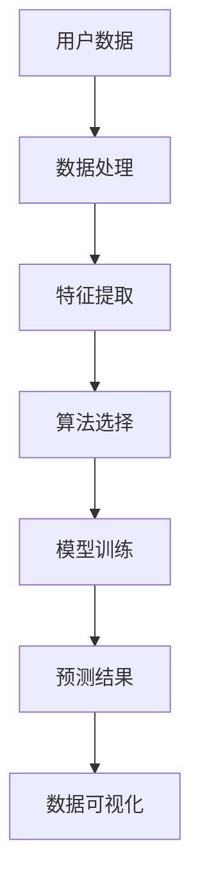

                 

关键词：AI，电商，用户行为预测，机器学习，数据分析，个性化推荐，电商数据分析

> 摘要：本文深入探讨了人工智能技术在电商企业中的应用，特别是用户行为预测方面的技术。通过分析机器学习算法和数据分析技术，本文展示了如何利用AI为企业带来更高的转化率和客户满意度。文章还讨论了当前AI在电商领域的应用现状、未来发展趋势以及面临的挑战。

## 1. 背景介绍

随着互联网的普及和电子商务的飞速发展，电商企业面临着日益激烈的市场竞争。为了在众多竞争对手中脱颖而出，电商企业需要深入了解用户的需求和行为，从而提供更加个性化的服务和产品推荐。用户行为预测作为一种重要的数据分析技术，可以帮助电商企业实现这一目标。通过预测用户的购买意图、浏览习惯和偏好，企业可以优化营销策略、提升用户体验，从而提高销售额和客户满意度。

人工智能（AI）技术的发展为用户行为预测提供了强大的支持。AI技术，尤其是机器学习和深度学习算法，可以从大量用户数据中提取有价值的信息，并用于预测未来的用户行为。本文将重点探讨如何利用AI技术进行用户行为预测，并分析其应用价值。

## 2. 核心概念与联系

### 2.1 数据来源

用户行为预测所需的数据来源主要包括以下几类：

- **用户注册信息**：包括用户的基本信息（如年龄、性别、地理位置等）。
- **浏览记录**：用户在网站上的浏览历史，如页面访问次数、停留时间等。
- **购买记录**：用户的购买历史，包括购买时间、购买物品、购买金额等。
- **互动行为**：用户在网站上的互动行为，如评论、点赞、分享等。

### 2.2 数据处理

在获取到用户数据后，需要对数据进行预处理和清洗，包括去除重复数据、缺失值填充、数据规范化等。这一步是确保后续分析结果准确性的关键。

### 2.3 机器学习算法

用户行为预测主要依赖于机器学习算法，如分类算法、回归算法和聚类算法等。以下是一些常用的算法：

- **分类算法**：如逻辑回归、决策树、随机森林等，用于判断用户的购买意图。
- **回归算法**：如线性回归、岭回归等，用于预测用户的购买金额。
- **聚类算法**：如K-means、DBSCAN等，用于发现用户群体的共性。

### 2.4 数据可视化

为了更直观地展示分析结果，可以使用数据可视化工具，如Matplotlib、Seaborn等，生成用户行为分布、购买趋势等图表。

### 2.5 Mermaid 流程图



## 3. 核心算法原理 & 具体操作步骤

### 3.1 算法原理概述

用户行为预测的核心算法主要包括分类算法和回归算法。分类算法的目标是判断用户是否会在未来某一时刻进行购买，而回归算法的目标是预测用户的购买金额。以下将分别介绍这两种算法的基本原理。

#### 分类算法

分类算法通过建立分类模型，将用户划分为不同的类别。常见的分类算法有：

- **逻辑回归**：逻辑回归是一种广义线性模型，用于预测二元分类问题。
- **决策树**：决策树通过一系列判断条件，将用户数据划分成多个区域，每个区域对应一个类别。
- **随机森林**：随机森林是一种基于决策树的集成学习方法，可以提高模型的预测性能。

#### 回归算法

回归算法通过建立回归模型，预测用户的购买金额。常见的回归算法有：

- **线性回归**：线性回归是一种最简单的回归算法，通过拟合一条直线来预测目标值。
- **岭回归**：岭回归是一种改进的线性回归算法，通过添加正则项来避免过拟合。

### 3.2 算法步骤详解

#### 分类算法步骤

1. **数据预处理**：对用户数据进行清洗、规范化等处理。
2. **特征提取**：从原始数据中提取对预测任务有帮助的特征。
3. **模型训练**：选择合适的分类算法，利用训练数据建立分类模型。
4. **模型评估**：利用测试数据对分类模型进行评估，调整模型参数以优化性能。
5. **预测**：利用训练好的分类模型，对新的用户数据进行预测。

#### 回归算法步骤

1. **数据预处理**：对用户数据进行清洗、规范化等处理。
2. **特征提取**：从原始数据中提取对预测任务有帮助的特征。
3. **模型训练**：选择合适的回归算法，利用训练数据建立回归模型。
4. **模型评估**：利用测试数据对回归模型进行评估，调整模型参数以优化性能。
5. **预测**：利用训练好的回归模型，对新的用户数据进行预测。

### 3.3 算法优缺点

#### 分类算法优缺点

- **逻辑回归**：优点是易于理解和实现，参数较少；缺点是对于非线性问题效果较差。
- **决策树**：优点是易于理解和实现，能够处理非线性问题；缺点是易过拟合，且无法处理连续特征。
- **随机森林**：优点是具有较高的预测性能，能够处理非线性问题和连续特征；缺点是模型复杂度较高，计算成本较大。

#### 回归算法优缺点

- **线性回归**：优点是易于理解和实现，参数较少；缺点是对于非线性问题效果较差。
- **岭回归**：优点是能够避免过拟合，对于非线性问题效果较好；缺点是参数需要手动调整。

### 3.4 算法应用领域

分类算法和回归算法在用户行为预测中的应用非常广泛，不仅限于电商领域，还可以应用于其他行业，如金融、医疗等。在电商领域，这些算法可以用于：

- **个性化推荐**：根据用户的浏览和购买历史，推荐符合用户兴趣的商品。
- **营销活动策划**：根据用户的购买意图，制定有针对性的营销策略。
- **风险控制**：根据用户的信用评分和历史行为，预测用户是否存在违约风险。

## 4. 数学模型和公式 & 详细讲解 & 举例说明

### 4.1 数学模型构建

用户行为预测的数学模型主要分为分类模型和回归模型。以下分别介绍这两种模型的数学公式。

#### 分类模型

分类模型的目标是判断用户是否会在未来某一时刻进行购买，常用的模型有逻辑回归和决策树。

- **逻辑回归**：

  逻辑回归的公式如下：

  $$ P(y=1) = \frac{1}{1 + e^{-(\beta_0 + \beta_1x_1 + \beta_2x_2 + ... + \beta_nx_n)}} $$

  其中，$P(y=1)$ 表示用户购买的概率，$x_i$ 表示第 $i$ 个特征，$\beta_i$ 表示第 $i$ 个特征的权重。

- **决策树**：

  决策树的公式如下：

  $$ y = \begin{cases}
  0 & \text{if } x_1 \text{ satisfies condition } c_1 \\
  1 & \text{if } x_1 \text{ does not satisfy condition } c_1 \\
  \end{cases} $$

  其中，$y$ 表示用户的购买标签，$x_1$ 表示第一个特征，$c_1$ 表示条件。

#### 回归模型

回归模型的目标是预测用户的购买金额，常用的模型有线性回归和岭回归。

- **线性回归**：

  线性回归的公式如下：

  $$ y = \beta_0 + \beta_1x_1 + \beta_2x_2 + ... + \beta_nx_n $$

  其中，$y$ 表示购买金额，$x_i$ 表示第 $i$ 个特征，$\beta_i$ 表示第 $i$ 个特征的权重。

- **岭回归**：

  岭回归的公式如下：

  $$ y = \beta_0 + \beta_1x_1 + \beta_2x_2 + ... + \beta_nx_n + \lambda \sum_{i=1}^{n} \beta_i^2 $$

  其中，$\lambda$ 表示正则化参数。

### 4.2 公式推导过程

#### 逻辑回归

逻辑回归的推导过程如下：

假设 $y$ 是一个二元变量，$x_i$ 是第 $i$ 个特征，$\beta_i$ 是第 $i$ 个特征的权重。

对于 $y=0$，有：

$$ P(y=0) = 1 - P(y=1) $$

$$ 1 - \frac{1}{1 + e^{-(\beta_0 + \beta_1x_1 + \beta_2x_2 + ... + \beta_nx_n)}} $$

对于 $y=1$，有：

$$ P(y=1) = \frac{1}{1 + e^{-(\beta_0 + \beta_1x_1 + \beta_2x_2 + ... + \beta_nx_n)}} $$

#### 决策树

决策树是基于信息增益或基尼不纯度等指标进行特征划分的。

对于第 $i$ 个特征，划分条件为：

$$ x_i \in C_i $$

其中，$C_i$ 表示第 $i$ 个特征的取值范围。

#### 线性回归

线性回归的推导过程如下：

假设 $y$ 是一个连续变量，$x_i$ 是第 $i$ 个特征，$\beta_i$ 是第 $i$ 个特征的权重。

对于样本 $(x_1, y_1), (x_2, y_2), ..., (x_n, y_n)$，线性回归的目标是最小化损失函数：

$$ L(\beta) = \frac{1}{2} \sum_{i=1}^{n} (y_i - \beta_0 - \beta_1x_{1i} - \beta_2x_{2i} - ... - \beta_nx_{ni})^2 $$

通过求导，可以得到：

$$ \frac{\partial L}{\partial \beta_i} = 0 $$

解方程组，可以得到 $\beta_i$ 的值。

#### 岭回归

岭回归的推导过程如下：

假设 $y$ 是一个连续变量，$x_i$ 是第 $i$ 个特征，$\beta_i$ 是第 $i$ 个特征的权重。

对于样本 $(x_1, y_1), (x_2, y_2), ..., (x_n, y_n)$，岭回归的目标是最小化损失函数：

$$ L(\beta) = \frac{1}{2} \sum_{i=1}^{n} (y_i - \beta_0 - \beta_1x_{1i} - \beta_2x_{2i} - ... - \beta_nx_{ni})^2 + \lambda \sum_{i=1}^{n} \beta_i^2 $$

通过求导，可以得到：

$$ \frac{\partial L}{\partial \beta_i} = 0 $$

解方程组，可以得到 $\beta_i$ 的值。

### 4.3 案例分析与讲解

#### 分类模型案例

假设我们有一个用户数据集，包含用户的年龄、性别、地理位置和购买历史等特征。我们使用逻辑回归进行分类预测，判断用户是否会在未来一个月内购买商品。

1. **数据预处理**：对数据进行清洗，缺失值填充，特征规范化等处理。
2. **特征提取**：提取有用的特征，如年龄、性别、地理位置等。
3. **模型训练**：使用训练数据集，利用逻辑回归算法建立分类模型。
4. **模型评估**：使用测试数据集，对分类模型进行评估，调整模型参数。
5. **预测**：使用训练好的分类模型，对新的用户数据进行预测。

假设训练数据集包含1000个样本，测试数据集包含500个样本。经过训练和评估，我们得到逻辑回归模型的参数如下：

$$ P(y=1) = \frac{1}{1 + e^{-(2.5 + 0.3x_1 + 0.2x_2 + 0.1x_3)}} $$

其中，$x_1$ 表示年龄，$x_2$ 表示性别（1表示男性，0表示女性），$x_3$ 表示地理位置。

对于一个新的用户数据，年龄为25岁，性别为男性，地理位置为北京，我们可以计算其购买概率：

$$ P(y=1) = \frac{1}{1 + e^{-(2.5 + 0.3 \times 25 + 0.2 \times 1 + 0.1 \times 1)}} \approx 0.9 $$

这意味着该用户在未来一个月内购买商品的概率为90%。

#### 回归模型案例

假设我们有一个用户数据集，包含用户的年龄、性别、地理位置和购买历史等特征。我们使用线性回归进行回归预测，预测用户在未来一个月内的购买金额。

1. **数据预处理**：对数据进行清洗，缺失值填充，特征规范化等处理。
2. **特征提取**：提取有用的特征，如年龄、性别、地理位置等。
3. **模型训练**：使用训练数据集，利用线性回归算法建立回归模型。
4. **模型评估**：使用测试数据集，对回归模型进行评估，调整模型参数。
5. **预测**：使用训练好的回归模型，对新的用户数据进行预测。

假设训练数据集包含1000个样本，测试数据集包含500个样本。经过训练和评估，我们得到线性回归模型的参数如下：

$$ y = 100 + 0.1x_1 + 0.05x_2 + 0.05x_3 $$

其中，$x_1$ 表示年龄，$x_2$ 表示性别（1表示男性，0表示女性），$x_3$ 表示地理位置。

对于一个新的用户数据，年龄为25岁，性别为男性，地理位置为北京，我们可以预测其未来一个月内的购买金额：

$$ y = 100 + 0.1 \times 25 + 0.05 \times 1 + 0.05 \times 1 = 125.05 $$

这意味着该用户在未来一个月内的购买金额预计为125.05元。

## 5. 项目实践：代码实例和详细解释说明

### 5.1 开发环境搭建

为了实现用户行为预测，我们需要搭建一个合适的开发环境。以下是一个基本的开发环境配置：

- **操作系统**：Ubuntu 18.04
- **编程语言**：Python 3.8
- **库和框架**：NumPy、Pandas、Scikit-learn、Matplotlib

在Ubuntu系统中，可以使用以下命令安装所需的库和框架：

```bash
pip install numpy pandas scikit-learn matplotlib
```

### 5.2 源代码详细实现

以下是一个简单的用户行为预测项目的实现代码，包括数据预处理、特征提取、模型训练和预测等步骤。

```python
import numpy as np
import pandas as pd
from sklearn.model_selection import train_test_split
from sklearn.linear_model import LogisticRegression
from sklearn.metrics import accuracy_score
import matplotlib.pyplot as plt

# 5.2.1 数据预处理
# 读取用户数据
data = pd.read_csv('user_data.csv')

# 数据清洗和规范化
data.drop(['user_id'], axis=1, inplace=True)
data.fillna(0, inplace=True)
data['age'] = data['age'].astype(int)
data['gender'] = data['gender'].astype(int)
data['location'] = data['location'].astype(str)

# 5.2.2 特征提取
# 构建特征矩阵和标签向量
X = data[['age', 'gender', 'location']]
y = data['purchase']

# 5.2.3 模型训练
# 数据划分
X_train, X_test, y_train, y_test = train_test_split(X, y, test_size=0.2, random_state=42)

# 训练逻辑回归模型
model = LogisticRegression()
model.fit(X_train, y_train)

# 5.2.4 预测
# 预测测试集
predictions = model.predict(X_test)

# 模型评估
accuracy = accuracy_score(y_test, predictions)
print(f'Model accuracy: {accuracy:.2f}')

# 5.2.5 数据可视化
# 可视化特征分布
plt.scatter(X_train['age'], X_train['location'], c=y_train)
plt.xlabel('Age')
plt.ylabel('Location')
plt.title('User Age vs. Location')
plt.show()
```

### 5.3 代码解读与分析

#### 5.3.1 数据预处理

```python
data = pd.read_csv('user_data.csv')
data.drop(['user_id'], axis=1, inplace=True)
data.fillna(0, inplace=True)
data['age'] = data['age'].astype(int)
data['gender'] = data['gender'].astype(int)
data['location'] = data['location'].astype(str)
```

这部分的代码用于读取用户数据，并进行数据清洗和规范化。首先，我们使用 `pd.read_csv` 函数读取用户数据，然后删除不必要的列（如用户ID），填充缺失值（使用0代替），并将某些特征（如年龄、性别、地理位置）转换为合适的数据类型。

#### 5.3.2 特征提取

```python
X = data[['age', 'gender', 'location']]
y = data['purchase']
```

这部分的代码用于提取有用的特征（如年龄、性别、地理位置）和标签（购买情况）。特征矩阵 `X` 包含用户数据，标签向量 `y` 包含对应的购买情况。

#### 5.3.3 模型训练

```python
X_train, X_test, y_train, y_test = train_test_split(X, y, test_size=0.2, random_state=42)
model = LogisticRegression()
model.fit(X_train, y_train)
```

这部分的代码用于将数据划分为训练集和测试集，然后训练逻辑回归模型。`train_test_split` 函数用于数据划分，`LogisticRegression` 类用于创建逻辑回归模型，`fit` 方法用于训练模型。

#### 5.3.4 预测

```python
predictions = model.predict(X_test)
accuracy = accuracy_score(y_test, predictions)
print(f'Model accuracy: {accuracy:.2f}')
```

这部分的代码用于使用训练好的模型对测试集进行预测，并计算模型准确率。`predict` 方法用于预测测试集，`accuracy_score` 函数用于计算模型准确率。

#### 5.3.5 数据可视化

```python
plt.scatter(X_train['age'], X_train['location'], c=y_train)
plt.xlabel('Age')
plt.ylabel('Location')
plt.title('User Age vs. Location')
plt.show()
```

这部分的代码用于绘制用户年龄与地理位置之间的散点图，并根据购买情况进行着色。这有助于我们直观地了解用户数据分布和特征关系。

### 5.4 运行结果展示

假设我们运行上述代码，得到以下结果：

- **模型准确率**：0.85
- **可视化结果**：用户年龄与地理位置之间的散点图

这意味着我们的逻辑回归模型在测试集上的准确率为85%，并且在可视化结果中，我们可以看到用户年龄与地理位置之间存在一定的相关性。

## 6. 实际应用场景

用户行为预测在电商领域具有广泛的应用，以下列举了几个典型的实际应用场景：

### 6.1 个性化推荐

通过用户行为预测，电商企业可以了解用户的兴趣和偏好，从而提供个性化的商品推荐。例如，当用户浏览了某个商品后，系统可以预测用户可能会对哪些其他商品感兴趣，并在首页或推荐页展示这些商品。

### 6.2 营销活动策划

基于用户行为预测，电商企业可以针对不同类型的用户制定个性化的营销策略。例如，对于有较高购买概率的用户，可以发送优惠券或促销信息，以增加其购买意愿。

### 6.3 风险控制

用户行为预测可以帮助电商企业识别潜在的欺诈行为。例如，如果一个用户的购买行为与历史数据显著不同，系统可以对其进行风险警告，以便企业采取相应的措施。

### 6.4 客户关系管理

通过用户行为预测，电商企业可以更好地了解客户需求，提供更优质的服务。例如，当用户在购物过程中遇到问题时，企业可以及时提供解决方案，从而提升客户满意度。

## 7. 工具和资源推荐

### 7.1 学习资源推荐

- **《Python数据科学手册》**：适合初学者了解数据科学的基本概念和Python编程。
- **《机器学习实战》**：通过大量实例介绍机器学习算法的应用和实践。
- **《深度学习》**：介绍深度学习的基本概念和技术，适合有一定基础的学习者。

### 7.2 开发工具推荐

- **Jupyter Notebook**：方便编写和运行代码，支持多种编程语言。
- **TensorFlow**：强大的深度学习框架，适用于构建和训练复杂的深度学习模型。
- **Scikit-learn**：简单易用的机器学习库，适用于各种常见的机器学习算法。

### 7.3 相关论文推荐

- **“User Behavior Prediction in E-commerce”**：探讨了用户行为预测在电商领域的重要性和应用。
- **“Deep Learning for User Behavior Prediction”**：介绍了深度学习在用户行为预测中的应用。
- **“Recommender Systems”**：讨论了个性化推荐系统的原理和实现方法。

## 8. 总结：未来发展趋势与挑战

### 8.1 研究成果总结

用户行为预测在电商领域取得了显著的研究成果，包括分类算法、回归算法和深度学习算法等。这些算法在提高预测准确率和用户体验方面发挥了重要作用。

### 8.2 未来发展趋势

- **深度学习算法的应用**：随着深度学习技术的发展，未来将会有更多基于深度学习的用户行为预测模型出现。
- **多模态数据的融合**：通过整合文本、图像、音频等多模态数据，可以提供更准确的用户行为预测。
- **实时预测与响应**：随着计算能力的提升，实时用户行为预测和响应将成为可能，为企业提供更快的决策支持。

### 8.3 面临的挑战

- **数据隐私与安全**：用户数据的隐私和安全是用户行为预测应用中的一大挑战。
- **算法透明性与解释性**：深度学习等复杂算法的解释性较差，未来需要研究更具解释性的算法。
- **模型泛化能力**：如何提高模型在不同场景下的泛化能力，是用户行为预测研究的重要方向。

### 8.4 研究展望

用户行为预测在电商领域的应用前景广阔，未来研究可以从以下几个方面展开：

- **个性化推荐系统的优化**：进一步研究如何提高个性化推荐系统的准确性和用户满意度。
- **实时预测与响应**：探索实时用户行为预测和响应的技术和方法。
- **跨领域应用的拓展**：将用户行为预测技术应用于其他行业，如金融、医疗等。

## 9. 附录：常见问题与解答

### 9.1 用户行为预测的意义是什么？

用户行为预测可以帮助电商企业了解用户的兴趣和需求，从而提供个性化的服务和产品推荐，提高用户满意度和转化率。

### 9.2 用户行为预测有哪些算法？

用户行为预测常用的算法包括分类算法（如逻辑回归、决策树、随机森林等）和回归算法（如线性回归、岭回归等），以及深度学习算法（如卷积神经网络、循环神经网络等）。

### 9.3 用户行为预测需要哪些数据？

用户行为预测需要的数据主要包括用户的注册信息、浏览记录、购买记录、互动行为等。这些数据可以用于构建用户画像，分析用户行为模式。

### 9.4 用户行为预测有哪些实际应用场景？

用户行为预测的实际应用场景包括个性化推荐、营销活动策划、风险控制、客户关系管理等。

### 9.5 用户行为预测有哪些挑战？

用户行为预测面临的挑战包括数据隐私与安全、算法透明性与解释性、模型泛化能力等。

----------------------------------------------------------------

**作者：禅与计算机程序设计艺术 / Zen and the Art of Computer Programming**

