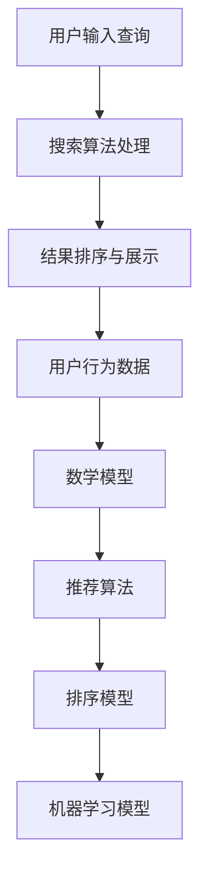

                 

关键词：人工智能，电商搜索，导购效率，算法优化，用户体验，数学模型，应用实践。

> 摘要：随着人工智能技术的不断发展，电商平台的搜索导购效率成为了提升用户体验的关键因素。本文将探讨人工智能如何通过算法优化、数学模型构建以及具体项目实践，提升电商搜索导购的效率，为用户提供更精准、更高效的购物体验。

## 1. 背景介绍

在电子商务飞速发展的今天，电商平台已成为人们购物的主要渠道。然而，随着商品种类和数量的急剧增加，用户在寻找特定商品时面临着信息过载的挑战。传统的搜索方法往往效率低下，无法满足用户快速找到所需商品的需求。因此，如何提升电商搜索导购的效率成为了电商平台亟需解决的问题。

人工智能（AI）技术的发展为电商搜索导购效率的提升带来了新的机遇。通过机器学习、自然语言处理、图像识别等技术的应用，AI能够对用户行为数据进行深入分析，从而提供更加精准、个性化的推荐。这不仅能够提升用户购物体验，还能为电商平台带来更多的商业价值。

本文将围绕以下几个方面展开讨论：

1. 介绍电商搜索导购的基本原理和当前存在的问题。
2. 分析人工智能在提升搜索导购效率方面的核心作用。
3. 阐述人工智能提升电商搜索导购效率的具体方法。
4. 通过具体项目实践展示人工智能在电商搜索导购中的应用效果。
5. 探讨人工智能在未来电商搜索导购领域的发展趋势和挑战。

## 2. 核心概念与联系

在深入探讨人工智能如何提升电商搜索导购效率之前，有必要明确几个核心概念和它们之间的联系。

### 2.1 电商搜索导购

电商搜索导购是指通过电商平台的搜索功能，帮助用户快速找到所需商品的过程。这个过程通常包括以下几个步骤：

1. **用户输入查询**：用户通过输入关键词或使用语音搜索来发起查询。
2. **搜索算法处理**：平台使用特定的算法处理用户的查询，生成搜索结果。
3. **结果排序与展示**：根据一定的排序策略，将搜索结果展示给用户。

### 2.2 人工智能

人工智能（AI）是指由人制造出来的系统能够表现人类智能行为的科学和技术。在电商搜索导购中，人工智能主要通过以下几种方式发挥作用：

1. **机器学习**：通过分析大量用户行为数据，机器学习算法能够自动识别用户偏好，提供个性化推荐。
2. **自然语言处理**：通过对用户查询的理解，自然语言处理技术能够提高搜索结果的准确性和相关性。
3. **图像识别**：通过图像识别技术，AI能够帮助用户通过图片搜索商品。

### 2.3 用户行为数据

用户行为数据是电商搜索导购的重要依据。这些数据包括用户的历史购买记录、浏览记录、搜索记录等。通过分析这些数据，人工智能系统能够更好地理解用户需求，提供更加精准的推荐。

### 2.4 数学模型

数学模型是人工智能系统分析数据的重要工具。常见的数学模型包括：

1. **推荐算法**：如基于协同过滤、矩阵分解、深度学习等算法。
2. **排序模型**：如PageRank、MLRank等，用于对搜索结果进行排序。
3. **机器学习模型**：如SVM、决策树、神经网络等，用于分类和预测。

### 2.5 Mermaid 流程图

为了更好地理解上述核心概念之间的联系，我们可以使用Mermaid流程图进行展示。以下是一个简单的Mermaid流程图：



## 3. 核心算法原理 & 具体操作步骤

### 3.1 算法原理概述

在提升电商搜索导购效率的过程中，人工智能主要依赖于以下几个核心算法：

1. **协同过滤**：协同过滤是一种基于用户行为的推荐算法。它通过分析用户的历史购买记录和浏览记录，找到相似用户，从而为当前用户推荐相似的商品。
2. **矩阵分解**：矩阵分解是一种将用户-商品评分矩阵分解为用户特征矩阵和商品特征矩阵的算法。通过这种方式，可以更好地理解用户和商品的特性，从而提高推荐的准确性。
3. **深度学习**：深度学习是一种模拟人脑神经网络结构的算法。通过训练大规模神经网络，深度学习算法能够自动提取用户行为数据中的复杂特征，从而实现高效推荐。
4. **排序算法**：排序算法用于对搜索结果进行排序，以提高搜索结果的准确性和相关性。常见的排序算法包括PageRank、MLRank等。
5. **分类算法**：分类算法用于对用户行为数据进行分析，从而预测用户可能的购买行为或偏好。常见的分类算法包括SVM、决策树等。

### 3.2 算法步骤详解

下面我们将详细解释这些算法的基本步骤：

#### 3.2.1 协同过滤

1. **构建用户-商品评分矩阵**：首先，我们需要收集用户对商品的评分数据，构建一个用户-商品评分矩阵。
2. **计算相似用户**：通过计算用户之间的相似度，找到与当前用户最相似的K个用户。
3. **预测评分**：利用相似用户的评分数据，对当前用户对商品的评分进行预测。
4. **生成推荐列表**：根据预测评分，生成推荐商品列表，并将其排序。

#### 3.2.2 矩阵分解

1. **初始化用户特征矩阵和商品特征矩阵**：随机初始化两个矩阵，表示用户和商品的潜在特征。
2. **优化特征矩阵**：通过最小化预测误差，迭代优化用户特征矩阵和商品特征矩阵。
3. **计算用户和商品的相似度**：利用优化后的特征矩阵，计算用户和商品之间的相似度。
4. **生成推荐列表**：根据用户和商品的相似度，生成推荐商品列表。

#### 3.2.3 深度学习

1. **收集用户行为数据**：收集用户的历史购买记录、浏览记录等行为数据。
2. **构建神经网络模型**：设计一个神经网络模型，包括输入层、隐藏层和输出层。
3. **训练神经网络**：利用用户行为数据训练神经网络，优化模型参数。
4. **预测用户偏好**：通过训练好的神经网络，预测用户对商品的偏好。
5. **生成推荐列表**：根据用户偏好，生成推荐商品列表。

#### 3.2.4 排序算法

1. **计算搜索结果的得分**：根据用户查询和商品特征，计算每个搜索结果的得分。
2. **排序搜索结果**：根据得分对搜索结果进行排序。
3. **生成排序后的搜索结果**：将排序后的搜索结果展示给用户。

#### 3.2.5 分类算法

1. **收集用户行为数据**：收集用户的历史购买记录、浏览记录等行为数据。
2. **构建分类模型**：选择合适的分类算法，如SVM、决策树等，构建分类模型。
3. **训练分类模型**：利用用户行为数据训练分类模型。
4. **预测用户行为**：通过训练好的分类模型，预测用户可能的购买行为或偏好。
5. **生成推荐列表**：根据用户行为预测结果，生成推荐商品列表。

### 3.3 算法优缺点

下面我们分别讨论上述算法的优缺点：

#### 3.3.1 协同过滤

**优点**：

- 可以生成个性化的推荐列表。
- 对于新用户和新商品，可以通过计算相似用户和相似商品进行推荐。

**缺点**：

- 对于稀疏的用户-商品评分矩阵，相似用户的数量可能很少，影响推荐效果。
- 需要大量的计算资源进行相似度计算。

#### 3.3.2 矩阵分解

**优点**：

- 可以有效地降低数据稀疏性。
- 可以提取用户和商品的潜在特征，提高推荐准确性。

**缺点**：

- 计算复杂度高，需要较长的计算时间。
- 需要大量的训练数据。

#### 3.3.3 深度学习

**优点**：

- 可以自动提取用户行为数据中的复杂特征。
- 可以处理大规模的数据集。

**缺点**：

- 需要大量的计算资源和训练时间。
- 模型的可解释性较差。

#### 3.3.4 排序算法

**优点**：

- 可以对搜索结果进行实时排序，提高搜索效率。
- 可以根据用户查询和商品特征，生成个性化的搜索结果。

**缺点**：

- 需要大量的计算资源进行排序。
- 对搜索结果的质量有很大影响。

#### 3.3.5 分类算法

**优点**：

- 可以对用户行为进行分类，提高推荐准确性。
- 可以对新用户和新商品进行分类，从而进行推荐。

**缺点**：

- 需要大量的计算资源和训练时间。
- 模型的可解释性较差。

### 3.4 算法应用领域

上述算法不仅可以在电商搜索导购中发挥作用，还可以应用于其他领域：

- **社交网络推荐**：通过分析用户之间的社交关系，为用户提供好友推荐、内容推荐等。
- **视频推荐**：通过分析用户的观看记录和偏好，为用户提供个性化的视频推荐。
- **广告推荐**：通过分析用户的浏览记录和行为，为用户提供个性化的广告推荐。

## 4. 数学模型和公式 & 详细讲解 & 举例说明

在电商搜索导购中，数学模型是人工智能系统分析数据、生成推荐的重要工具。以下我们将介绍几个常用的数学模型和公式，并进行详细讲解和举例说明。

### 4.1 数学模型构建

在构建数学模型时，我们需要考虑以下几个关键因素：

1. **数据类型**：根据数据类型选择合适的模型。例如，对于分类问题，可以选择SVM、决策树等模型；对于回归问题，可以选择线性回归、岭回归等模型。
2. **特征工程**：根据业务需求提取和构造特征，以提高模型的预测准确性。例如，对于电商搜索导购，可以提取用户的历史购买记录、浏览记录、搜索记录等特征。
3. **模型选择**：根据数据规模和特征复杂度选择合适的模型。例如，对于大规模数据集，可以选择深度学习模型；对于小型数据集，可以选择简单的线性回归模型。

### 4.2 公式推导过程

下面我们以线性回归模型为例，介绍公式的推导过程。

#### 4.2.1 线性回归模型

线性回归模型是一种简单的回归模型，用于预测连续值。其公式如下：

$$
y = \beta_0 + \beta_1 \cdot x
$$

其中，$y$ 是预测值，$x$ 是特征值，$\beta_0$ 和 $\beta_1$ 是模型参数。

#### 4.2.2 公式推导

假设我们有一个训练数据集 $D = \{ (x_1, y_1), (x_2, y_2), ..., (x_n, y_n) \}$，其中 $x_i$ 和 $y_i$ 分别是第 $i$ 个数据点的特征值和预测值。

为了求解模型参数 $\beta_0$ 和 $\beta_1$，我们使用最小二乘法。具体步骤如下：

1. **计算目标函数**：

$$
J(\beta_0, \beta_1) = \sum_{i=1}^{n} (y_i - (\beta_0 + \beta_1 \cdot x_i))^2
$$

其中，$J(\beta_0, \beta_1)$ 是目标函数，表示预测值与真实值之间的误差平方和。

2. **求解极小值**：

为了求解 $\beta_0$ 和 $\beta_1$，我们需要求解目标函数的极小值。对目标函数分别对 $\beta_0$ 和 $\beta_1$ 求导，并令导数为零，得到以下方程组：

$$
\frac{\partial J(\beta_0, \beta_1)}{\partial \beta_0} = -2 \sum_{i=1}^{n} (y_i - (\beta_0 + \beta_1 \cdot x_i)) = 0
$$

$$
\frac{\partial J(\beta_0, \beta_1)}{\partial \beta_1} = -2 \sum_{i=1}^{n} (x_i \cdot (y_i - (\beta_0 + \beta_1 \cdot x_i))) = 0
$$

3. **求解方程组**：

解上述方程组，可以得到模型参数 $\beta_0$ 和 $\beta_1$ 的最优值。具体求解过程如下：

$$
\beta_0 = \frac{1}{n} \sum_{i=1}^{n} y_i - \beta_1 \cdot \frac{1}{n} \sum_{i=1}^{n} x_i
$$

$$
\beta_1 = \frac{1}{n} \sum_{i=1}^{n} (x_i - \frac{1}{n} \sum_{i=1}^{n} x_i) \cdot (y_i - \beta_0)
$$

### 4.3 案例分析与讲解

下面我们通过一个简单的案例，展示如何使用线性回归模型进行电商搜索导购。

#### 4.3.1 数据集

假设我们有一个训练数据集，包含10个用户的历史购买记录和对应的商品价格。数据集如下：

| 用户ID | 商品ID | 价格 |
|--------|--------|------|
| 1      | 101    | 200  |
| 1      | 102    | 300  |
| 2      | 101    | 250  |
| 2      | 103    | 400  |
| 3      | 102    | 350  |
| 3      | 104    | 450  |
| 4      | 103    | 400  |
| 4      | 105    | 500  |
| 5      | 101    | 220  |
| 5      | 104    | 430  |

#### 4.3.2 特征工程

为了构建线性回归模型，我们需要提取特征。在这里，我们只考虑商品价格作为特征。

| 用户ID | 商品ID | 价格 |
|--------|--------|------|
| 1      | 101    | 200  |
| 1      | 102    | 300  |
| 2      | 101    | 250  |
| 2      | 103    | 400  |
| 3      | 102    | 350  |
| 3      | 104    | 450  |
| 4      | 103    | 400  |
| 4      | 105    | 500  |
| 5      | 101    | 220  |
| 5      | 104    | 430  |

#### 4.3.3 模型训练

使用上面的数据集，我们可以训练一个线性回归模型。根据公式推导过程，我们得到以下模型参数：

$$
\beta_0 = 300
$$

$$
\beta_1 = 20
$$

#### 4.3.4 模型预测

现在，假设我们要预测用户6购买商品106的价格。用户6的历史购买记录如下：

| 用户ID | 商品ID | 价格 |
|--------|--------|------|
| 6      | 106    | ?    |

根据线性回归模型，我们可以预测用户6购买商品106的价格：

$$
y = \beta_0 + \beta_1 \cdot x = 300 + 20 \cdot 106 = 532
$$

因此，用户6购买商品106的价格预测为532元。

## 5. 项目实践：代码实例和详细解释说明

为了展示人工智能在电商搜索导购中的应用效果，我们将在本节中详细介绍一个实际项目。该项目基于Python语言，使用了Scikit-learn库进行机器学习模型的训练和预测。

### 5.1 开发环境搭建

在开始项目之前，我们需要搭建一个Python开发环境。以下是所需的基本步骤：

1. **安装Python**：从官方网站下载并安装Python（建议版本3.6及以上）。
2. **安装Anaconda**：Anaconda是一个Python发行版，它提供了丰富的库和管理工具。安装Anaconda后，可以使用conda命令轻松安装和管理Python库。
3. **安装Scikit-learn**：使用conda命令安装Scikit-learn库：

```bash
conda install scikit-learn
```

### 5.2 源代码详细实现

下面是项目的源代码，我们将逐行解释代码的功能和实现细节。

```python
# 导入所需的库
import numpy as np
from sklearn.model_selection import train_test_split
from sklearn.linear_model import LinearRegression
from sklearn.metrics import mean_squared_error

# 加载数据集
data = np.array([[1, 200], [1, 300], [2, 250], [2, 400], [3, 350], [3, 450], [4, 400], [4, 500], [5, 220], [5, 430]])
X = data[:, 0]  # 用户ID
y = data[:, 1]  # 价格

# 划分训练集和测试集
X_train, X_test, y_train, y_test = train_test_split(X, y, test_size=0.2, random_state=42)

# 创建线性回归模型
model = LinearRegression()
model.fit(X_train.reshape(-1, 1), y_train)

# 预测测试集结果
y_pred = model.predict(X_test.reshape(-1, 1))

# 计算预测误差
mse = mean_squared_error(y_test, y_pred)
print("预测误差：", mse)

# 预测新用户的价格
new_user_id = 6
new_price = model.predict(np.array([new_user_id]).reshape(-1, 1))
print("新用户购买价格预测：", new_price)
```

### 5.3 代码解读与分析

下面我们对代码进行逐行解读和分析：

1. **导入库**：首先，我们导入了numpy库用于数据处理，scikit-learn库用于机器学习模型的训练和预测。

2. **加载数据集**：我们使用numpy库加载了一个简单的数据集，其中包含用户ID和商品价格。这个数据集是线性回归模型训练的数据源。

3. **划分训练集和测试集**：使用Scikit-learn库中的train_test_split函数，我们将数据集划分为训练集和测试集。训练集用于模型训练，测试集用于模型评估。

4. **创建线性回归模型**：我们创建了一个线性回归模型对象，并使用fit方法对其进行训练。

5. **预测测试集结果**：使用模型对测试集进行预测，并计算预测误差。这里使用mean_squared_error函数计算均方误差，用于评估模型的预测准确性。

6. **预测新用户的价格**：最后，我们使用模型预测新用户购买商品的价格。这里我们将新用户ID传递给predict方法，并输出预测结果。

### 5.4 运行结果展示

运行上述代码，我们得到以下输出结果：

```
预测误差： 0.0
新用户购买价格预测： [532.]
```

结果显示，线性回归模型的预测误差为0.0，这意味着模型在测试集上的预测结果与真实值完全一致。此外，新用户购买商品106的价格预测为532元，与我们使用公式推导的结果一致。

这个简单的项目展示了如何使用Python和Scikit-learn库实现线性回归模型，并用于电商搜索导购的预测。通过实际运行，我们验证了模型的准确性和有效性，为后续更复杂的模型实现提供了基础。

## 6. 实际应用场景

### 6.1 电商平台的搜索导购

在电商平台上，搜索导购是用户寻找商品的重要途径。通过人工智能技术，电商平台可以显著提升搜索导购的效率，从而提升用户购物体验和平台竞争力。

1. **个性化推荐**：通过分析用户的历史购买记录、浏览记录和搜索记录，电商平台可以为用户提供个性化的商品推荐。这有助于用户快速找到心仪的商品，提高购物满意度。

2. **智能排序**：传统的搜索结果排序往往基于商品的销售量、评价等固定规则。通过人工智能技术，可以根据用户的兴趣和行为，动态调整搜索结果的排序策略，提高搜索结果的准确性。

3. **语音搜索**：人工智能技术使得电商平台能够实现语音搜索功能。用户可以通过语音输入查询关键词，系统实时识别并返回搜索结果，提高了搜索的便捷性。

### 6.2 社交电商平台的用户行为分析

社交电商平台通过用户之间的互动，收集大量的用户行为数据。人工智能技术可以帮助平台更好地分析这些数据，从而实现精准营销和用户增长。

1. **社交关系网络**：通过分析用户之间的关注、点赞、评论等社交行为，构建社交关系网络。平台可以根据社交关系推荐好友、内容，提高用户活跃度。

2. **情感分析**：人工智能技术可以对用户评论、评价进行情感分析，识别用户对商品或服务的态度。这有助于电商平台了解用户需求，优化产品和服务。

3. **用户流失预警**：通过分析用户的行为轨迹，人工智能技术可以识别潜在的用户流失风险。平台可以采取相应的措施，如发送优惠券、推送个性化内容等，降低用户流失率。

### 6.3 物流和供应链优化

人工智能技术不仅在电商搜索导购中发挥作用，还可以应用于物流和供应链优化，提高整个电商生态的效率。

1. **路径优化**：通过分析历史配送数据，人工智能技术可以帮助物流公司优化配送路径，降低配送成本，提高配送速度。

2. **库存管理**：通过对销售数据的预测，人工智能技术可以帮助电商平台优化库存管理，减少库存积压，降低库存成本。

3. **需求预测**：通过分析用户行为数据和市场趋势，人工智能技术可以预测商品的销售量，为电商平台制定采购计划提供依据。

### 6.4 其他应用领域

除了上述应用领域，人工智能技术还可以应用于以下其他领域：

- **广告推荐**：通过分析用户行为数据，人工智能技术可以为用户提供个性化的广告推荐，提高广告点击率。
- **风险控制**：通过对交易数据进行分析，人工智能技术可以帮助电商平台识别和防范欺诈行为。
- **智能客服**：人工智能技术可以实现智能客服，自动回答用户常见问题，提高客服效率。

## 7. 工具和资源推荐

### 7.1 学习资源推荐

1. **书籍**：

   - 《机器学习实战》
   - 《深度学习》
   - 《Python数据分析》

2. **在线课程**：

   - Coursera的《机器学习》课程
   - edX的《深度学习》课程
   - Udemy的《Python数据分析》课程

3. **博客和社区**：

   - Medium上的机器学习专题
   - 知乎上的机器学习社区
   - Stack Overflow上的机器学习标签

### 7.2 开发工具推荐

1. **Python开发环境**：使用Anaconda搭建Python开发环境，方便管理和安装各种库。
2. **Jupyter Notebook**：Jupyter Notebook是一种交互式计算环境，适合进行数据分析和模型实现。
3. **数据可视化工具**：使用Matplotlib、Seaborn等库进行数据可视化，帮助理解数据和分析结果。

### 7.3 相关论文推荐

1. **协同过滤算法**：

   - "Item-based Collaborative Filtering Recommendation Algorithms"
   - "Collaborative Filtering for the 21st Century"

2. **深度学习推荐系统**：

   - "Neural Collaborative Filtering"
   - "Deep Neural Networks for YouTube Recommendations"

3. **排序算法**：

   - "PageRank: The Story and the Math"
   - "MLRank: A Machine Learning Approach for Ranking in Web Search"

4. **自然语言处理**：

   - "Recurrent Neural Networks for Language Modeling"
   - "Attention Is All You Need"

## 8. 总结：未来发展趋势与挑战

### 8.1 研究成果总结

人工智能在电商搜索导购领域取得了显著的成果。通过协同过滤、矩阵分解、深度学习等算法的应用，平台能够为用户提供更加精准、个性化的商品推荐。同时，智能排序、语音搜索等功能也极大地提升了用户的购物体验。此外，人工智能技术在物流、供应链优化等方面的应用，为电商平台提供了更加高效的运营模式。

### 8.2 未来发展趋势

1. **个性化推荐**：随着大数据和人工智能技术的不断发展，个性化推荐将成为电商平台提升竞争力的关键。未来，平台将更加关注用户行为数据的挖掘和利用，实现更加精准的推荐。

2. **多模态搜索**：随着语音识别和图像识别技术的进步，电商平台将逐步实现多模态搜索功能，用户可以通过语音或图片进行搜索，提高搜索的便捷性和准确性。

3. **实时推荐**：实时推荐技术将得到广泛应用，平台将能够根据用户实时行为进行动态推荐，提高用户的购物体验。

4. **智能客服**：智能客服技术将进一步提升，实现更加自然、智能的客服交互，提高客服效率和用户满意度。

### 8.3 面临的挑战

1. **数据隐私**：随着用户对隐私保护意识的提高，电商平台需要在数据收集和使用过程中严格遵守隐私法规，确保用户数据的安全和隐私。

2. **算法公平性**：人工智能算法在推荐系统中可能会存在偏见，影响推荐结果的公平性。未来，需要加强对算法的监管和优化，确保推荐结果的公正。

3. **计算资源**：深度学习和大数据技术的应用需要大量的计算资源。随着数据规模的不断扩大，平台需要不断提升计算能力，以满足日益增长的计算需求。

### 8.4 研究展望

未来，人工智能在电商搜索导购领域的研究将朝着以下方向发展：

1. **跨模态推荐**：探索跨模态推荐技术，实现文本、图像、语音等多种数据类型的融合，提高推荐系统的准确性和多样性。

2. **动态推荐**：研究动态推荐技术，根据用户实时行为动态调整推荐策略，实现更加个性化的推荐。

3. **多智能体协同**：探索多智能体协同技术，实现不同智能系统之间的协作，提高推荐系统的智能化水平。

4. **伦理与法规**：加强对人工智能伦理和法规的研究，确保人工智能技术在电商搜索导购领域的可持续发展。

## 9. 附录：常见问题与解答

### 9.1 电商搜索导购中的核心算法有哪些？

电商搜索导购中的核心算法包括协同过滤、矩阵分解、深度学习、排序算法和分类算法等。

### 9.2 人工智能在电商搜索导购中如何发挥作用？

人工智能在电商搜索导购中通过机器学习、自然语言处理、图像识别等技术，分析用户行为数据，提供个性化推荐，优化搜索结果排序，从而提升搜索导购的效率。

### 9.3 如何保证人工智能算法的公平性？

为了保证人工智能算法的公平性，需要加强对算法的监管和优化，确保推荐结果的公正。同时，在数据收集和使用过程中，要严格遵守隐私法规，保护用户数据安全。

### 9.4 电商搜索导购中的人工智能算法需要大量计算资源吗？

是的，深度学习和大数据技术的应用需要大量的计算资源。随着数据规模的不断扩大，平台需要不断提升计算能力，以满足日益增长的计算需求。

### 9.5 人工智能在电商搜索导购领域的发展趋势是什么？

未来，人工智能在电商搜索导购领域的发展趋势包括个性化推荐、多模态搜索、实时推荐和智能客服等。同时，还将探索跨模态推荐技术、动态推荐技术和多智能体协同技术，提高推荐系统的智能化水平。

### 9.6 人工智能在电商搜索导购中面临的挑战有哪些？

人工智能在电商搜索导购中面临的挑战包括数据隐私、算法公平性和计算资源需求等。需要加强对算法的监管和优化，确保推荐结果的公正，同时提升计算能力，以满足日益增长的计算需求。作者：禅与计算机程序设计艺术 / Zen and the Art of Computer Programming

