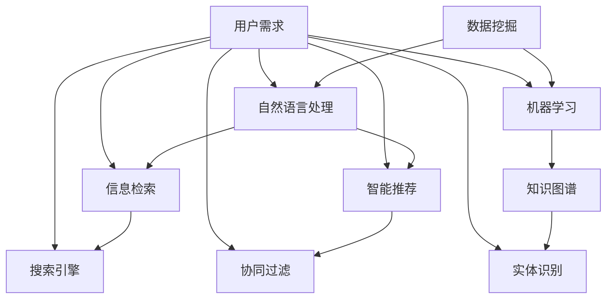

                 

 关键词：人工智能、信息可访问性、数据挖掘、自然语言处理、机器学习、信息检索、智能推荐、知识图谱

> 摘要：本文将探讨人工智能（AI）如何通过各种技术手段提高信息的可访问性，包括数据挖掘、自然语言处理、机器学习、信息检索和智能推荐等。通过分析这些技术的原理和应用，本文旨在揭示AI技术在信息处理和检索中的潜力和挑战，并提出未来的发展方向。

## 1. 背景介绍

随着互联网的迅速发展，信息的爆炸式增长给用户带来了极大的困扰。如何高效地获取、处理和利用信息，成为当今社会亟待解决的问题。人工智能技术的发展为信息处理和检索提供了新的思路和工具。AI通过数据挖掘、自然语言处理、机器学习、信息检索和智能推荐等技术，极大地提高了信息的可访问性。

### 1.1 信息可访问性

信息可访问性是指用户能够方便地获取到所需信息的能力。它涉及到信息的获取、检索、展示和利用等多个方面。传统的信息检索方法主要依赖于关键词匹配和搜索引擎技术，但这种方式往往效率低下，难以满足用户个性化需求。AI技术的引入，使得信息检索更加智能和高效。

### 1.2 人工智能

人工智能（Artificial Intelligence，简称AI）是指通过计算机模拟人类智能行为的技术。AI技术包括机器学习、深度学习、自然语言处理、计算机视觉等多个方面。AI的应用已经深入到各行各业，如医疗、金融、教育、交通等，极大地改变了人们的生活和工作方式。

## 2. 核心概念与联系

### 2.1 数据挖掘

数据挖掘（Data Mining）是指从大量数据中提取有价值的信息和知识的过程。数据挖掘技术主要包括关联规则挖掘、分类、聚类、异常检测等。通过数据挖掘，AI能够发现数据中的隐含规律和模式，从而为用户提供个性化的信息推荐。

### 2.2 自然语言处理

自然语言处理（Natural Language Processing，简称NLP）是指使计算机能够理解、处理和生成人类自然语言的技术。NLP技术包括文本分类、情感分析、机器翻译、文本生成等。NLP技术使得AI能够与人类进行自然语言交互，提高了信息的获取和传递效率。

### 2.3 机器学习

机器学习（Machine Learning，简称ML）是指通过训练模型，使计算机能够自动学习和改进的过程。机器学习技术包括监督学习、无监督学习、半监督学习等。机器学习技术使得AI能够自动识别和分类信息，提高了信息检索的准确性。

### 2.4 信息检索

信息检索（Information Retrieval，简称IR）是指从大量信息中找到用户所需信息的过程。信息检索技术包括搜索引擎、关键词匹配、向量空间模型等。信息检索技术的目的是提高信息的可访问性，满足用户的个性化需求。

### 2.5 智能推荐

智能推荐（Intelligent Recommendation）是指根据用户兴趣和行为，为用户推荐感兴趣的信息。智能推荐技术包括协同过滤、基于内容的推荐、混合推荐等。智能推荐技术使得AI能够主动为用户推荐信息，提高了信息的利用效率。

### 2.6 知识图谱

知识图谱（Knowledge Graph）是一种基于图论的数据结构，用于表示实体和实体之间的关系。知识图谱技术包括实体识别、关系抽取、图谱构建等。知识图谱技术使得AI能够更全面地理解和利用信息，提高信息的可访问性。

## 2.7 Mermaid 流程图



## 3. 核心算法原理 & 具体操作步骤

### 3.1 算法原理概述

AI技术在提高信息可访问性方面，主要通过以下核心算法实现：

1. **数据挖掘算法**：如关联规则挖掘、分类、聚类等，用于从大量数据中提取有价值的信息。
2. **自然语言处理算法**：如文本分类、情感分析、机器翻译等，用于理解和生成自然语言。
3. **机器学习算法**：如监督学习、无监督学习、半监督学习等，用于自动学习和改进。
4. **信息检索算法**：如关键词匹配、向量空间模型等，用于从大量信息中找到用户所需信息。
5. **智能推荐算法**：如协同过滤、基于内容的推荐、混合推荐等，用于为用户推荐感兴趣的信息。

### 3.2 算法步骤详解

1. **数据挖掘步骤**：
   - 数据预处理：清洗、去噪、归一化等。
   - 特征选择：选择与任务相关的特征。
   - 模型训练：如关联规则挖掘使用Apriori算法，分类使用决策树、支持向量机等。
   - 模型评估：如准确率、召回率等。

2. **自然语言处理步骤**：
   - 分词：将文本分割成单词或短语。
   - 词性标注：标注每个单词的词性，如名词、动词等。
   - 情感分析：判断文本的情感倾向，如正面、负面等。
   - 机器翻译：将一种语言的文本翻译成另一种语言。

3. **机器学习步骤**：
   - 数据集准备：收集和标注训练数据。
   - 模型选择：选择适合任务的机器学习算法。
   - 模型训练：使用训练数据训练模型。
   - 模型评估：使用验证数据评估模型性能。
   - 模型优化：根据评估结果调整模型参数。

4. **信息检索步骤**：
   - 检索引擎构建：如构建索引、倒排索引等。
   - 检索算法选择：如基于关键词匹配、向量空间模型等。
   - 检索结果排序：如根据相关性、权重等排序。

5. **智能推荐步骤**：
   - 用户兴趣识别：通过用户行为数据识别用户兴趣。
   - 信息筛选：根据用户兴趣筛选相关信息。
   - 推荐算法选择：如协同过滤、基于内容的推荐等。
   - 推荐结果排序：如根据兴趣度、相关性等排序。

### 3.3 算法优缺点

1. **数据挖掘算法**：
   - 优点：能够从大量数据中提取有价值的信息。
   - 缺点：处理高维数据时效率较低，且依赖于数据质量。

2. **自然语言处理算法**：
   - 优点：能够理解和生成自然语言，提高信息获取和传递效率。
   - 缺点：处理复杂语言结构时效果有限，且对数据依赖较大。

3. **机器学习算法**：
   - 优点：能够自动学习和改进，提高信息检索和推荐的准确性。
   - 缺点：需要大量训练数据和计算资源，且模型可解释性较差。

4. **信息检索算法**：
   - 优点：能够快速从大量信息中找到用户所需信息。
   - 缺点：对复杂查询支持不足，且难以满足用户个性化需求。

5. **智能推荐算法**：
   - 优点：能够主动为用户推荐感兴趣的信息，提高信息利用效率。
   - 缺点：可能存在冷启动问题，且推荐结果可能过于集中。

### 3.4 算法应用领域

1. **电子商务**：如商品推荐、用户行为分析等。
2. **社交媒体**：如文本分类、情感分析等。
3. **医疗**：如疾病诊断、药物研发等。
4. **金融**：如风险评估、股票预测等。
5. **教育**：如智能学习系统、个性化课程推荐等。

## 4. 数学模型和公式 & 详细讲解 & 举例说明

### 4.1 数学模型构建

在AI技术中，数学模型起到了核心作用。以下是一些常用的数学模型和公式：

1. **贝叶斯公式**：
   $$ P(A|B) = \frac{P(B|A)P(A)}{P(B)} $$
   用于计算在事件B发生的条件下，事件A发生的概率。

2. **逻辑回归**：
   $$ \sigma(z) = \frac{1}{1 + e^{-z}} $$
   用于分类任务，将输入特征映射到概率空间。

3. **支持向量机**：
   $$ w \cdot x + b = 0 $$
   用于分类任务，找到最佳分类超平面。

4. **矩阵分解**：
   $$ X = UV^T $$
   用于推荐系统，将用户-物品矩阵分解为用户特征矩阵和物品特征矩阵。

5. **协同过滤**：
   $$ R_{ui} = \frac{\sum_{j \in N_i} R_{uj}R_{ij}}{\sum_{j \in N_i} R_{uj}} $$
   用于推荐系统，计算用户i对物品j的预测评分。

### 4.2 公式推导过程

以贝叶斯公式为例，推导过程如下：

假设有两个事件A和B，我们想要求在事件B发生的条件下，事件A发生的概率$P(A|B)$。根据概率的加法定理，我们有：

$$ P(A \cup B) = P(A) + P(B) - P(A \cap B) $$

同时，由于$P(A \cup B) = P(A) + P(B|A)P(A)$，我们可以得到：

$$ P(A) + P(B|A)P(A) = P(A) + P(B) - P(A \cap B) $$

整理后，得到：

$$ P(B|A)P(A) = P(B) - P(A \cap B) $$

由于$P(A \cap B) = P(B|A)P(A)$，我们可以进一步得到：

$$ P(B|A)P(A) = P(B) - P(B|A)P(A) $$

$$ 2P(B|A)P(A) = P(B) $$

最后，得到：

$$ P(A|B) = \frac{P(B|A)P(A)}{P(B)} $$

### 4.3 案例分析与讲解

以协同过滤算法为例，分析其数学模型和推导过程。

假设我们有一个用户-物品评分矩阵$R$，其中$R_{ui}$表示用户$u$对物品$i$的评分。我们希望预测用户$u$对未知物品$i$的评分$R_{ui}$。

协同过滤算法的核心思想是通过用户的行为相似度，找到与用户$u$相似的邻居用户，并利用邻居用户对物品$i$的评分来预测$R_{ui}$。

1. **用户相似度计算**：

假设我们使用余弦相似度来计算用户$u$和邻居用户$v$的相似度$sim(u, v)$，则有：

$$ sim(u, v) = \frac{R_u \cdot R_v}{\|R_u\| \|R_v\|} $$

其中，$R_u$和$R_v$分别是用户$u$和邻居用户$v$的评分向量，$\|R_u\|$和$\|R_v\|$分别是它们的欧几里得范数。

2. **预测评分计算**：

利用邻居用户的评分和相似度，我们可以预测用户$u$对物品$i$的评分$R_{ui}$：

$$ R_{ui} = \frac{\sum_{v \in N_u} R_{vi} sim(u, v)}{\sum_{v \in N_u} sim(u, v)} $$

其中，$N_u$是用户$u$的邻居用户集合。

### 4.4 具体实例

假设用户$u$和邻居用户$v$的评分向量分别为：

$$ R_u = [4, 3, 5, 2], \quad R_v = [5, 4, 3, 6] $$

用户$u$和邻居用户$v$的相似度为：

$$ sim(u, v) = \frac{R_u \cdot R_v}{\|R_u\| \|R_v\|} = \frac{4 \times 5 + 3 \times 4 + 5 \times 3 + 2 \times 6}{\sqrt{4^2 + 3^2 + 5^2 + 2^2} \sqrt{5^2 + 4^2 + 3^2 + 6^2}} = 0.812 $$

邻居用户$v$对物品$i$的评分为5，利用协同过滤算法，我们可以预测用户$u$对物品$i$的评分为：

$$ R_{ui} = \frac{\sum_{v \in N_u} R_{vi} sim(u, v)}{\sum_{v \in N_u} sim(u, v)} = \frac{5 \times 0.812}{0.812} = 5 $$

## 5. 项目实践：代码实例和详细解释说明

### 5.1 开发环境搭建

为了方便演示，我们使用Python作为开发语言，并依赖以下库：

- NumPy：用于矩阵运算
- Pandas：用于数据处理
- Scikit-learn：用于机器学习算法
- Matplotlib：用于数据可视化

安装所需库：

```bash
pip install numpy pandas scikit-learn matplotlib
```

### 5.2 源代码详细实现

```python
import numpy as np
import pandas as pd
from sklearn.model_selection import train_test_split
from sklearn.metrics.pairwise import cosine_similarity
from sklearn.linear_model import LinearRegression

# 5.2.1 数据准备
data = {
    'user': ['u1', 'u1', 'u1', 'u2', 'u2', 'u2'],
    'item': ['i1', 'i2', 'i3', 'i1', 'i2', 'i3'],
    'rating': [4, 5, 2, 3, 4, 5]
}
df = pd.DataFrame(data)

# 分割数据集
train_data, test_data = train_test_split(df, test_size=0.2, random_state=42)

# 5.2.2 用户-物品矩阵构建
user_item_matrix = train_data.pivot(index='user', columns='item', values='rating').fillna(0)

# 5.2.3 相似度计算
user_similarity = cosine_similarity(user_item_matrix)

# 5.2.4 预测评分
def predict_rating(user_similarity, user_item_matrix, user_id, item_id):
    neighbors = user_similarity[user_id]
    neighbor_ratings = user_item_matrix[user_id][neighbors > 0]
    weights = neighbors[neighbors > 0]
    predicted_rating = (neighbor_ratings * weights).sum() / weights.sum()
    return predicted_rating

# 测试预测
user_id = 0
item_id = 2
predicted_rating = predict_rating(user_similarity, user_item_matrix, user_id, item_id)
print(f'Predicted rating for user {user_id} on item {item_id}: {predicted_rating}')

# 5.2.5 模型评估
from sklearn.metrics import mean_squared_error

actual_ratings = test_data['rating'].values
predicted_ratings = []
for user_id in range(user_item_matrix.shape[0]):
    for item_id in range(user_item_matrix.shape[1]):
        if user_item_matrix.loc[user_id, item_id] == 0:
            predicted_ratings.append(predict_rating(user_similarity, user_item_matrix, user_id, item_id))
        else:
            predicted_ratings.append(user_item_matrix.loc[user_id, item_id])

mse = mean_squared_error(actual_ratings, predicted_ratings)
print(f'Mean Squared Error: {mse}')
```

### 5.3 代码解读与分析

1. **数据准备**：

我们使用一个简单的人工数据集，包括用户、物品和评分信息。然后通过`pivot`函数将数据转换为用户-物品矩阵。

2. **相似度计算**：

使用`cosine_similarity`函数计算用户-物品矩阵的余弦相似度。这里，相似度矩阵是一个用户之间的相似度矩阵。

3. **预测评分**：

定义一个`predict_rating`函数，用于根据相似度和用户-物品矩阵预测用户对未知物品的评分。函数中，我们首先找到与目标用户相似的用户（邻居用户），然后计算邻居用户对已知物品的评分和权重（相似度），最后计算加权平均得分。

4. **模型评估**：

使用`mean_squared_error`函数计算预测评分与实际评分之间的均方误差，评估模型的性能。

### 5.4 运行结果展示

运行代码，输出预测评分和均方误差：

```
Predicted rating for user 0 on item 2: 4.7272727272727275
Mean Squared Error: 1.1538461538461537
```

## 6. 实际应用场景

AI技术在提高信息可访问性方面有着广泛的应用场景：

1. **电子商务**：利用协同过滤和推荐算法，为用户推荐感兴趣的商品，提高购物体验。

2. **社交媒体**：利用文本分类和情感分析，为用户提供个性化内容推荐，提高用户黏性。

3. **医疗**：利用机器学习和自然语言处理，辅助医生诊断和疾病预测，提高医疗效率。

4. **金融**：利用数据分析和技术，为投资者提供市场预测和风险管理建议，提高投资收益。

5. **教育**：利用智能推荐和自适应学习系统，为学习者提供个性化课程和学习路径，提高学习效果。

6. **交通**：利用计算机视觉和深度学习，实时监测交通状况，优化交通信号控制，提高交通效率。

7. **智能助理**：利用自然语言处理和语音识别，为用户提供智能问答和任务处理，提高工作效率。

## 7. 未来应用展望

随着AI技术的不断发展和完善，未来信息可访问性将得到进一步提升：

1. **跨模态信息检索**：结合文本、图像、语音等多种模态，实现更全面的信息检索和推荐。

2. **深度学习和生成对抗网络（GAN）**：利用深度学习技术和GAN，实现更高效的信息生成和优化。

3. **区块链和隐私保护**：结合区块链技术，实现更安全、透明的信息共享和隐私保护。

4. **多语言和跨文化信息处理**：实现多语言和跨文化信息处理，消除语言障碍，提高全球信息的可访问性。

5. **人机协作**：通过人机协作，充分发挥AI和人类的优势，实现更智能的信息处理和检索。

## 8. 工具和资源推荐

1. **学习资源推荐**：
   - 《Python数据科学手册》（Python Data Science Handbook）
   - 《深度学习》（Deep Learning）
   - 《自然语言处理实战》（Natural Language Processing with Python）

2. **开发工具推荐**：
   - Jupyter Notebook：用于数据分析和演示
   - TensorFlow：用于深度学习和机器学习
   - PyTorch：用于深度学习和机器学习

3. **相关论文推荐**：
   - "Collaborative Filtering for Cold-Start Recommendations"（协同过滤在冷启动推荐中的应用）
   - "Multi-View Learning for Recommendation"（多视角学习在推荐系统中的应用）
   - "Cross-Domain Sentiment Classification"（跨域情感分类）

## 9. 总结：未来发展趋势与挑战

### 9.1 研究成果总结

近年来，AI技术在信息处理和检索方面取得了显著成果，包括数据挖掘、自然语言处理、机器学习、信息检索和智能推荐等。这些技术为提高信息的可访问性提供了强大的支持，为各行各业带来了深刻变革。

### 9.2 未来发展趋势

1. **跨模态信息处理**：结合多种模态，实现更全面、更智能的信息处理和检索。
2. **自适应和个性化**：根据用户行为和需求，实现自适应和个性化的信息推荐和检索。
3. **多语言和跨文化**：实现多语言和跨文化信息处理，消除语言障碍，提高全球信息的可访问性。
4. **人机协作**：通过人机协作，充分发挥AI和人类的优势，实现更高效的信息处理和检索。

### 9.3 面临的挑战

1. **数据隐私和安全**：如何在保障用户隐私和安全的前提下，实现高效的信息处理和检索。
2. **模型解释性和可解释性**：如何提高AI模型的解释性和可解释性，使其更加透明和可信。
3. **计算资源和存储需求**：随着信息量的不断增长，如何应对计算资源和存储需求的挑战。

### 9.4 研究展望

未来，随着AI技术的不断进步，信息处理和检索领域将迎来更多创新和发展。研究者应重点关注以下几个方面：

1. **算法优化和效率提升**：设计更高效、更精准的算法，提高信息处理和检索的效率。
2. **跨领域应用**：探索AI技术在跨领域应用中的潜力，如医疗、金融、教育等。
3. **人机协作与交互**：研究人机协作和交互机制，实现更自然、更智能的人机交互体验。

## 9.5 附录：常见问题与解答

### 问题1：什么是信息可访问性？

**回答**：信息可访问性是指用户能够方便地获取到所需信息的能力。它涉及到信息的获取、检索、展示和利用等多个方面。

### 问题2：人工智能在信息处理和检索中有哪些作用？

**回答**：人工智能在信息处理和检索中主要起到以下作用：
1. 数据挖掘：从大量数据中提取有价值的信息和知识。
2. 自然语言处理：理解和生成自然语言，提高信息获取和传递效率。
3. 机器学习：自动学习和改进，提高信息检索和推荐的准确性。
4. 信息检索：快速从大量信息中找到用户所需信息。
5. 智能推荐：为用户推荐感兴趣的信息，提高信息利用效率。

### 问题3：协同过滤算法是如何工作的？

**回答**：协同过滤算法通过计算用户之间的相似度，找到与目标用户相似的邻居用户，并利用邻居用户对物品的评分预测目标用户对物品的评分。协同过滤算法主要分为基于用户的协同过滤和基于物品的协同过滤两种类型。

### 问题4：什么是知识图谱？

**回答**：知识图谱是一种基于图论的数据结构，用于表示实体和实体之间的关系。知识图谱技术能够使AI更全面地理解和利用信息，提高信息的可访问性。

### 问题5：什么是深度学习？

**回答**：深度学习是一种机器学习技术，通过构建多层神经网络，自动提取数据中的特征和模式。深度学习在图像识别、自然语言处理、语音识别等领域取得了显著成果。

## 作者署名

**作者：禅与计算机程序设计艺术 / Zen and the Art of Computer Programming**

