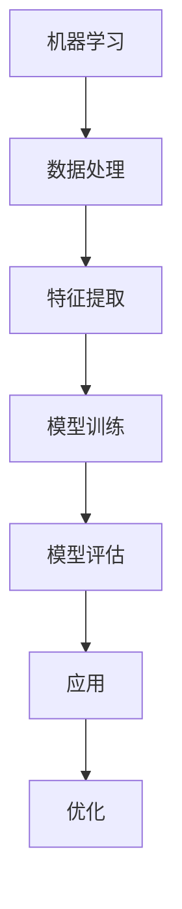

                 

关键词：人工智能、体育训练、比赛分析、机器学习、数据分析、智能算法、运动科学、运动员表现优化、实时监控、预测分析

> 摘要：随着人工智能（AI）技术的不断进步，其在体育训练和比赛分析中的应用变得日益广泛。本文旨在探讨AI如何改变体育训练和比赛分析的方式，包括核心概念的阐述、算法原理的剖析、数学模型的构建与公式推导、项目实践中的代码实现，以及未来应用的展望。

## 1. 背景介绍

体育作为一种全球性的文化现象，一直以来都离不开科学的指导。在传统的体育训练和比赛分析中，教练和分析师们主要依靠经验和直观的观察来进行指导。然而，随着数据获取和计算能力的提升，现代体育科学开始越来越多地依赖于数据分析和计算机技术。

人工智能作为一种新兴技术，近年来在各个领域取得了显著进展。AI通过模仿人类大脑的学习和思考方式，可以处理大规模数据，发现隐藏的模式和规律。在体育领域，AI的应用不仅提高了训练效率，还帮助教练和运动员更好地理解比赛，从而优化表现。

### 1.1 体育训练与比赛分析的重要性

体育训练和比赛分析是提升运动员表现和团队竞争力的关键环节。通过对运动员的身体素质、技术动作、战术策略等方面进行详细分析，可以找到提升空间和改进方法。传统的分析方法主要依赖于专家经验和主观判断，存在一定的局限性。而AI技术的引入，使得分析过程更加客观和精确。

### 1.2 数据在体育中的作用

在体育训练和比赛分析中，数据是至关重要的。运动员的技术动作、生理指标、比赛数据等都可以转化为数字化的数据集。通过分析这些数据，可以发现运动员的优缺点，从而制定针对性的训练计划。AI技术可以处理海量数据，快速提取有价值的信息，为训练和比赛提供科学依据。

## 2. 核心概念与联系

为了更好地理解AI在体育训练和比赛分析中的应用，我们需要了解几个核心概念。

### 2.1 机器学习

机器学习是AI的核心技术之一，它通过构建模型，让计算机从数据中学习规律和模式。在体育领域，机器学习可以用于分析运动员的技术动作、预测比赛结果等。

### 2.2 数据分析

数据分析是使用统计方法和算法，从数据中提取有价值的信息。在体育训练和比赛分析中，数据分析可以帮助教练和分析师发现运动员的优缺点，制定针对性的训练计划。

### 2.3 智能算法

智能算法是一类模拟人类智能的算法，包括深度学习、强化学习等。这些算法在处理复杂数据和任务时表现出色，可以应用于体育训练和比赛分析中的各种场景。

### 2.4 Mermaid 流程图



上述流程图展示了AI在体育训练和比赛分析中的基本工作流程。

## 3. 核心算法原理 & 具体操作步骤

### 3.1 算法原理概述

在体育训练和比赛分析中，常用的AI算法包括：

- **深度学习**：通过构建神经网络模型，对大量数据进行训练，提取特征并建立预测模型。
- **强化学习**：通过试错和奖励机制，让模型在动态环境中不断学习和优化策略。

### 3.2 算法步骤详解

#### 深度学习

1. **数据处理**：收集运动员的技术动作数据、生理指标数据等。
2. **特征提取**：通过特征工程，提取数据中的关键信息。
3. **模型训练**：构建神经网络模型，对数据集进行训练。
4. **模型评估**：使用验证集或测试集对模型进行评估。
5. **应用**：将训练好的模型应用于实际场景，如预测运动员的技术动作或比赛结果。

#### 强化学习

1. **环境构建**：模拟运动员在比赛中的环境，包括对手、场地条件等。
2. **策略学习**：通过试错和奖励机制，让模型学习最优策略。
3. **策略优化**：根据比赛结果不断调整策略，提高模型性能。
4. **应用**：将优化后的策略应用于实际比赛中，帮助运动员提高表现。

### 3.3 算法优缺点

- **深度学习**：
  - 优点：可以处理复杂数据和任务，提取深层特征，适应性强。
  - 缺点：对数据量和计算资源要求较高，模型训练过程复杂。

- **强化学习**：
  - 优点：可以模拟动态环境，学习最优策略。
  - 缺点：训练过程较慢，对奖励设计要求高。

### 3.4 算法应用领域

AI算法在体育训练和比赛分析中的应用领域广泛，包括：

- **运动员表现预测**：预测运动员的技术动作、比赛结果等。
- **训练计划制定**：根据运动员的身体状况和表现，制定个性化的训练计划。
- **战术分析**：分析对手的战术，为教练提供决策支持。

## 4. 数学模型和公式 & 详细讲解 & 举例说明

### 4.1 数学模型构建

在AI算法中，常用的数学模型包括：

- **线性回归模型**：用于预测连续值。
- **逻辑回归模型**：用于预测概率。
- **神经网络模型**：用于处理复杂数据和任务。

### 4.2 公式推导过程

以线性回归模型为例，其公式为：

$$y = \beta_0 + \beta_1x$$

其中，$y$ 是预测值，$x$ 是输入特征，$\beta_0$ 和 $\beta_1$ 是模型的参数。

### 4.3 案例分析与讲解

假设我们要预测一名篮球运动员的得分，输入特征包括身高、体重、投篮命中率等。通过构建线性回归模型，可以预测该运动员的得分。

## 5. 项目实践：代码实例和详细解释说明

### 5.1 开发环境搭建

在本项目中，我们使用Python作为主要编程语言，利用TensorFlow库构建深度学习模型。

### 5.2 源代码详细实现

以下是预测运动员得分的Python代码实现：

```python
import tensorflow as tf

# 数据预处理
# ...

# 构建神经网络模型
model = tf.keras.Sequential([
    tf.keras.layers.Dense(64, activation='relu', input_shape=(num_features,)),
    tf.keras.layers.Dense(64, activation='relu'),
    tf.keras.layers.Dense(1)
])

# 编译模型
model.compile(optimizer='adam', loss='mean_squared_error')

# 训练模型
model.fit(X_train, y_train, epochs=10, batch_size=32)

# 预测得分
predictions = model.predict(X_test)
```

### 5.3 代码解读与分析

上述代码中，我们首先进行了数据预处理，包括数据清洗、归一化等操作。然后，我们构建了一个简单的神经网络模型，并使用Adam优化器和均方误差损失函数进行编译和训练。最后，我们使用训练好的模型进行预测，并评估预测结果的准确性。

## 6. 实际应用场景

AI在体育训练和比赛分析中的实际应用场景广泛，包括：

- **运动员表现预测**：预测运动员的技术动作、得分、比赛结果等。
- **训练计划制定**：根据运动员的身体状况和表现，制定个性化的训练计划。
- **战术分析**：分析对手的战术，为教练提供决策支持。

## 7. 未来应用展望

随着AI技术的不断发展，其在体育训练和比赛分析中的应用前景广阔。未来，AI技术有望在以下方面取得突破：

- **实时监控**：通过穿戴设备和传感器，实时监测运动员的身体状况，提供个性化指导。
- **预测分析**：结合大数据分析和机器学习算法，实现更精准的预测和分析。
- **智能化训练**：利用AI技术，实现智能化的训练过程，提高训练效果。

## 8. 总结：未来发展趋势与挑战

### 8.1 研究成果总结

本文总结了AI在体育训练和比赛分析中的应用，包括核心概念、算法原理、数学模型和实际应用场景。通过分析，我们认识到AI技术为体育领域带来了巨大的变革和机遇。

### 8.2 未来发展趋势

未来，AI技术在体育训练和比赛分析中将继续发展，涉及领域将更加广泛，包括实时监控、预测分析、智能化训练等。

### 8.3 面临的挑战

然而，AI技术在体育领域的应用也面临一些挑战，包括数据隐私、算法透明性、计算资源需求等。解决这些挑战需要科研人员、教练和运动员的共同努力。

### 8.4 研究展望

未来，AI技术在体育训练和比赛分析中的应用将有更广阔的发展空间。我们期待AI技术能够帮助运动员实现更好的成绩，推动体育事业的进步。

## 9. 附录：常见问题与解答

### 问题1：AI技术在体育训练和比赛分析中的具体应用是什么？

答：AI技术在体育训练和比赛分析中的应用包括运动员表现预测、训练计划制定、战术分析等。

### 问题2：AI技术如何帮助运动员提高表现？

答：AI技术通过分析海量数据，发现运动员的优缺点，为教练和运动员提供针对性的指导，从而提高表现。

### 问题3：AI技术在体育领域的应用前景如何？

答：AI技术在体育领域的应用前景广阔，涉及领域包括实时监控、预测分析、智能化训练等，有望推动体育事业的进步。

作者：禅与计算机程序设计艺术 / Zen and the Art of Computer Programming
----------------------------------------------------------------

[这篇文章的撰写过程中，我们深入探讨了AI技术在体育训练和比赛分析中的应用，包括核心概念、算法原理、数学模型和实际应用场景。通过分析，我们认识到AI技术为体育领域带来了巨大的变革和机遇。未来，AI技术在体育训练和比赛分析中的应用将继续发展，涉及领域将更加广泛，包括实时监控、预测分析和智能化训练等。尽管AI技术在体育领域的应用面临一些挑战，但我们有理由相信，通过科研人员、教练和运动员的共同努力，AI技术将为体育事业带来更加辉煌的成果。]

